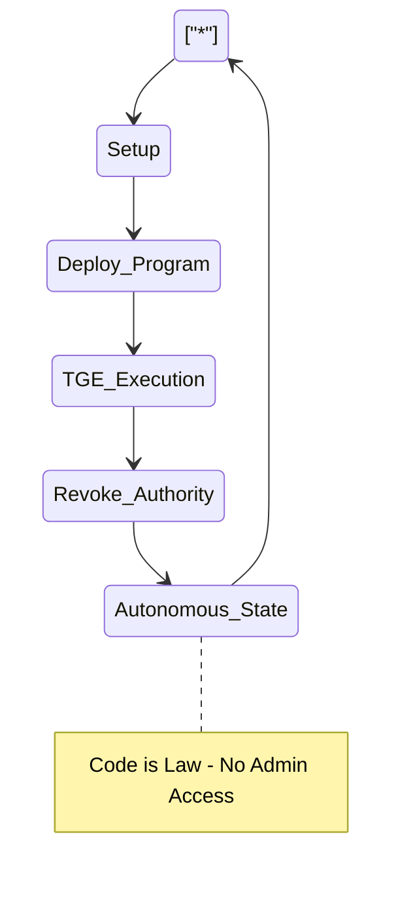

  

# DEVNET Proof of Work 

**Important Notice:** These Devnet assets are strictly created for internal testing and development purposes. They possess no intrinsic or monetary value. It can't be buy/sell using real funds. It won't give airdrop access/eligibility.

## ⚖️ CORE PHILOSOPHY: IMMUTABLE AUTONOMY

The Geveex Echo lifecycle is governed by a strict, one-way progression toward complete decentralization. Our operational framework follows a "Point of No Return" architecture:

* **Linear Evolution:** From initial setup to deployment, every stage is designed to transition toward a zero-governance state.
* **Authority Revocation:** Upon successful execution of the TGE (Technical Generation Event), all administrative authorities are permanently revoked.
* **Autonomous State:** The final stage of the program is self-sustaining and independent. 

> ### "Code is Law"
> Once the program reaches the **Autonomous State**, admin access is impossible. The ledger becomes a permanent, tamper-proof record where the protocol's logic supersedes human intervention.

### 🔍 Transparency & Development Disclosure

> **The Testing Zone:** At Geveex, we operate with radical transparency. We do not conceal our technical hurdles or development milestones. 
>
> **Note on Asset Integrity:** While this document lists 6,002 assets, you may encounter certain "broken" links or "null tokens." This is primarily due to ongoing metadata synchronization on the Devnet. Some assets have not yet been assigned their final metadata parameters.
>
> **Our Philosophy:** We believe that identifying and documenting these failures is not a weakness, but a fundamental pillar of our ultimate success. Every "null" value is a stepping stone toward a more robust and refined mainnet architecture.

### Proof of Work (PoW)

| Test | Link | Value |
| :--- | :--- | :--- |
| 0001 | https://solscan.io/token/4uEaNuNq3b3B3eZFGUgv5sEoZJD2WXLi1rZAqqi2iRTW?cluster=devnet | DEVNET |
| 0002 | https://solscan.io/token/9iyTmX3gtxBLevmvUwVKmahRH8K1jYCgsvYQsC6HNzdX?cluster=devnet | DEVNET |
| 0003 | https://solscan.io/token/7w5mxt7J8tkio1GUMYuYBgJjoGUUYM1w321s2wK5iXFd?cluster=devnet | DEVNET |
| 0004 | https://solscan.io/token/5xKBHX4TnZ2cUXazSpLwMuAD256EJ4tCTPptp8vXysF6?cluster=devnet | DEVNET |
| 0005 | https://solscan.io/token/2hKbFNL7r1qYvnZjU8sx9ajqgRjV8SPJoZ6cNmjTMihG?cluster=devnet | DEVNET |
| 0006 | https://solscan.io/token/93pQ1ASeCKhzzS9PRdE3RL5XrdnZt6FXW7LvAWj2Bmiq?cluster=devnet | DEVNET |
| 0007 | https://solscan.io/token/2FgEVKpmbHNmcXsqjTnPgUSkbQKz6VjeWBMR9ay3iG5g?cluster=devnet | DEVNET |
| 0008 | https://solscan.io/token/6PKh5sUmSX4ri11FDZ6eXxYu5nYgm2wdctNCWvDcezyY?cluster=devnet | DEVNET |
| 0009 | https://solscan.io/token/44GM6XBEwkuhScJxdHixXNA6ukLzfkdt5sVDM9VsFBhv?cluster=devnet | DEVNET |
| 0010 | https://solscan.io/token/2HdwBsssG6CTz1vGqX1JC7QTwpnieRY4K8hHh7Reuzca?cluster=devnet | DEVNET |
| 0011 | https://solscan.io/token/DiH5z3mvh88vw6jex19vtjS6zh8bnWPsWgBd67kKnCq5?cluster=devnet | DEVNET |
| 0012 | https://solscan.io/token/DpgRfkCpVGxRZNyvfZN3JeuTmzJvzxnwRxVW7E9tt9hN?cluster=devnet | DEVNET |
| 0013 | https://solscan.io/token/4sqMBgHBRZmzDdUgab8ZdYn1CGe4Dnme5kj2Sau4i1Ac?cluster=devnet | DEVNET |
| 0014 | https://solscan.io/token/CWEczMicKcLvG9pmkFfCvGKfXJK5m4ibDboCZZixZkrH?cluster=devnet | DEVNET |
| 0015 | https://solscan.io/token/CkNV8hNUfueXicC5uuF7fPtbmxF3vZkwEdiX3KnXAiL1?cluster=devnet | DEVNET |
| 0016 | https://solscan.io/token/4UZnTZn6jrHrivtvratALVzhfyK1MFLWzB7Hh4jeEHwR?cluster=devnet | DEVNET |
| 0017 | https://solscan.io/token/9jSMFbrBoLkRAMGooErCrFPYwxEurpbzJXKXEUifsJkK?cluster=devnet | DEVNET |
| 0018 | https://solscan.io/token/BRdMpkheih5YgcxULMhPiRRMJnjct79Wmwj9KF7qEt9K?cluster=devnet | DEVNET |
| 0019 | https://solscan.io/token/32RN7wbTWQWNkCzWtsw4PnV4Zq3D8hbWvy9YjDs36kRC?cluster=devnet | DEVNET |
| 0020 | https://solscan.io/token/DJ3NdaVqDHVsHRbEZhPfSEAFCsyHE3icPUT7Nhg6WQSj?cluster=devnet | DEVNET |
| 0021 | https://solscan.io/token/5tK3cv5uUFZLrTZCp5UzaX4XQeG7E3jstQG9dDZ912E2?cluster=devnet | DEVNET |
| 0022 | https://solscan.io/token/ExgG4rMQ3XnT9MkHoBVCyZVBfn6aMntPR7WyPiWWoN61?cluster=devnet | DEVNET |
| 0023 | https://solscan.io/token/H6bLDf2gqUkP9H1S8zU38Dc46Jc8sydcfm4mqTpJ52pS?cluster=devnet | DEVNET |
| 0024 | https://solscan.io/token/HqshTeiTvnrqkqL1cAQY5dJv1JurhGHAUR1KVfXFaEpa?cluster=devnet | DEVNET |
| 0025 | https://solscan.io/token/DEkWNqsB3fE8HsqQPC7WGMvq1fvoKXyiafuCrLJEeRnU?cluster=devnet | DEVNET |
| 0026 | https://solscan.io/token/6PEkNoFgMdV5MMrMvfGA3p3TQJqnARzkJcJbpoXJHxQa?cluster=devnet | DEVNET |
| 0027 | https://solscan.io/token/3rRxnWCXaiRC2UL7ANkFEfkUPGovR2XB7zHRWLt5Hr5c?cluster=devnet | DEVNET |
| 0028 | https://solscan.io/token/FHmcQpT6cJsUzjvgqXSFW7QxGx3zERaGTSikvibvhEbV?cluster=devnet | DEVNET |
| 0029 | https://solscan.io/token/HmXAascUuu6CGJKHmeQTjLJbX7bTqFeDLQ8ub7MFjQ11?cluster=devnet | DEVNET |
| 0030 | https://solscan.io/token/BQ9Hh51WBd6uVUaLFP6Vrh7fDDJs6mNWi6kvLS2dVWZZ?cluster=devnet | DEVNET |
| 0031 | https://solscan.io/token/6q4RJsmzKG8vhJNgqw94V5Fzq6pJ4Mp4S4WgZVct3ubA?cluster=devnet | DEVNET |
| 0032 | https://solscan.io/token/3JAcunt7V9K2A5yh4j6467R5BuPfdPJhkgYpdco9wqP3?cluster=devnet | DEVNET |
| 0033 | https://solscan.io/token/Gx8KMamYT2Qba7s38Vwd3hMTki8UvsyDTRSNX58yQb4P?cluster=devnet | DEVNET |
| 0034 | https://solscan.io/token/F4HhwVYa76rk51hnNziSokdJxqzJtuw1MCWjjR8S9bBa?cluster=devnet | DEVNET |
| 0035 | https://solscan.io/token/7wapLDmjH1MuoqUAP2iexAWMteUFER1PFmekQ3fG9Y4p?cluster=devnet | DEVNET |
| 0036 | https://solscan.io/token/2ZcFr5fWviEBtwX5FiLmMa8bDK4RB9vgvHHwNGrtL9yp?cluster=devnet | DEVNET |
| 0037 | https://solscan.io/token/2GPb7bCWVmyZn74MMdisxJSiQhFXgFzHvXyfmd4H3eQC?cluster=devnet | DEVNET |
| 0038 | https://solscan.io/token/FsBdXpHLhzFyqLWp5arF1hJr5EMTNajGd2HhYuwNPhJM?cluster=devnet | DEVNET |
| 0039 | https://solscan.io/token/3rN5bRK8uRzAptm5389KwL7uLVForTXAWvzGNn93wups?cluster=devnet | DEVNET |
| 0040 | https://solscan.io/token/DmyynbRbrM2951TXMkKDUjaQc8vRn5S9GiGzmiDmSRtF?cluster=devnet | DEVNET |
| 0041 | https://solscan.io/token/ELyXj77mg9cN7B41WLjzhpmhN5sKxEQhkZtXcMJcAWQ6?cluster=devnet | DEVNET |
| 0042 | https://solscan.io/token/DwiZxzZF3qv8RyWCJtbx1kyeQoR4Zzf8DpjKnebZe3w2?cluster=devnet | DEVNET |
| 0043 | https://solscan.io/token/BDPouBX5WJZ1YkNDDPYq9R9w4ayaWgnEBMUv53HsXJZE?cluster=devnet | DEVNET |
| 0044 | https://solscan.io/token/5igfbyUx1C5CGLBmezpx9uLkn7Ykhcjh3Lyf7NtY2wXe?cluster=devnet | DEVNET |
| 0045 | https://solscan.io/token/HkVofwNKXZFANpv5oSzJHUZYjqeQf7VjGkxTfUsrizjC?cluster=devnet | DEVNET |
| 0046 | https://solscan.io/token/CpfbFQsRMkSZo5aT1D9GPKTy5Zknp2k4DxbtszKzpWzh?cluster=devnet | DEVNET |
| 0047 | https://solscan.io/token/EvAu6FmCoP88YU1PpqYpoy4qucudfLAq8YBC7JRgd4F1?cluster=devnet | DEVNET |
| 0048 | https://solscan.io/token/4YFXWnWsNvar2gAkqdx9Wtfn4MDs1Ka7XF8kKxyUJd8F?cluster=devnet | DEVNET |
| 0049 | https://solscan.io/token/13A18DEJuRe1GVhBpHf18aXVJiQ1BVJWcpwgG7XupKow?cluster=devnet | DEVNET |
| 0050 | https://solscan.io/token/EHw6KQeT3ANryV7d4MRX7eDjshFTP76CtB9GsooRqUU3?cluster=devnet | DEVNET |
| 0051 | https://solscan.io/token/4wiswjqUbaosY2PA5qfWjsuhEyH37KB17PZahVG5QkFe?cluster=devnet | DEVNET |
| 0052 | https://solscan.io/token/Go9iZRhS3MuRuXwLWH2KvbZv9WqrYumefeShG4kxac52?cluster=devnet | DEVNET |
| 0053 | https://solscan.io/token/DeSKL1ZsK1RLGBMbMJzmBrNBX3UDsmoEbvnxftgDbSWJ?cluster=devnet | DEVNET |
| 0054 | https://solscan.io/token/A6GyskpQAfnMPART9vVSVb9WR9npUdi3oonhvzqKHDe7?cluster=devnet | DEVNET |
| 0055 | https://solscan.io/token/38oyWMTLGBosheeHrAm9et871L9whqNtTD4joKyT7yJY?cluster=devnet | DEVNET |
| 0056 | https://solscan.io/token/7MNWCpc4unrAa4C7KWA4956k1pzU9wYmqcgxoxzxdaxn?cluster=devnet | DEVNET |
| 0057 | https://solscan.io/token/8aXucK8mGWyzVJoTG7e1bPvm9vTWpX7YNrp2S3pam2DS?cluster=devnet | DEVNET |
| 0058 | https://solscan.io/token/6pY3C2wzsEaF97jjRUdjckA6Ua81LfBHD4G81fvax738?cluster=devnet | DEVNET |
| 0059 | https://solscan.io/token/GHf4grXMH3aCAkv2CadYgwoobfHZZjV3qxubDXDDM3rx?cluster=devnet | DEVNET |
| 0060 | https://solscan.io/token/GnWbutGejrV6tXcxEsGhDN5aomApBi5qjwzGvmavVZoY?cluster=devnet | DEVNET |
| 0061 | https://solscan.io/token/TUfw8iEkUkbHAg2xDRkxtTcdZzDHK2x5QyC7Hf8oHj7?cluster=devnet | DEVNET |
| 0062 | https://solscan.io/token/2eiiksdmcfp4vTzVyBD4VGYvtWCL9nfuJK7KY5bzGyjt?cluster=devnet | DEVNET |
| 0063 | https://solscan.io/token/A8Y6pgGn4o7iKGyomdKbWjfaV6JETWyEzg1Cftv16iit?cluster=devnet | DEVNET |
| 0064 | https://solscan.io/token/8SzjLH1wtp74iG9bkYLfnN1cZ2wQpVAyBbdmftfaHu2e?cluster=devnet | DEVNET |
| 0065 | https://solscan.io/token/2SQT6BKhpu3zRvHSQVaHLk9n1hDnuBQg5DSYX66kF9zx?cluster=devnet | DEVNET |
| 0066 | https://solscan.io/token/2o9daYLkLDPtMTqo7rQpFMBZ3NAkuQywhz7NREnDUGDs?cluster=devnet | DEVNET |
| 0067 | https://solscan.io/token/KysEUhYXGtqkauQcgNcrpAkGy5JNuXdJscZFiBxmgoT?cluster=devnet | DEVNET |
| 0068 | https://solscan.io/token/GzfKMDiYChDQjzYE7B5X9BVD7Y511MyZ55rrkXTRLwoB?cluster=devnet | DEVNET |
| 0069 | https://solscan.io/token/2d9AaY45a8pZudTaesCuakVjYUiCJB81Rzfe1PqqGrwy?cluster=devnet | DEVNET |
| 0070 | https://solscan.io/token/6EfGbSVG9LEhDMtLZkufB3Qzsfh5HgVaYScm6dbnAqhU?cluster=devnet | DEVNET |
| 0071 | https://solscan.io/token/2VrNw6Bhsit81YoMqiTkgxWovQaxTdFG13CJFwbKgLHb?cluster=devnet | DEVNET |
| 0072 | https://solscan.io/token/6sc5yhYEFCECCgdXqmgwF3hS4fcoKQaHT35zbyNGmdkr?cluster=devnet | DEVNET |
| 0073 | https://solscan.io/token/4PNVCgEiHyuDtJfbaMFFAtX78Prco4qid6HB19LAu1dA?cluster=devnet | DEVNET |
| 0074 | https://solscan.io/token/AeDhrq9qyJHDZBGN8XRLr2QnCD8JwwTw3N78Pdwrnspc?cluster=devnet | DEVNET |
| 0075 | https://solscan.io/token/EHC1jFaTA3xhfU9w6D1aC7C578Y9YgU3YyYPSobzoMt9?cluster=devnet | DEVNET |
| 0076 | https://solscan.io/token/EfNUEgAsfognCbYJoqh4u19vEGe8B4NGqbLggVYo2ACe?cluster=devnet | DEVNET |
| 0077 | https://solscan.io/token/45JsGA2Fvjm28qVeW5t8Psntex6KgLrqm96RueD7XPkH?cluster=devnet | DEVNET |
| 0078 | https://solscan.io/token/J2KV2GiZroGkVT1S2m5Tab3Xs7FktSLdqRTcHuJmRsVj?cluster=devnet | DEVNET |
| 0079 | https://solscan.io/token/BbkgWEoZYbTKas4Z6qTJ8vRcHsafqAKNhhHqCv8Pfxy?cluster=devnet | DEVNET |
| 0080 | https://solscan.io/token/2FgHeUjyAQ3GXy6xg6J9QXxkAoYBw9uHZxo4kgX7XcBZ?cluster=devnet | DEVNET |
| 0081 | https://solscan.io/token/9NcJKq4hyA9AcrPakjy83qFJfKsxrJyshrG3DxfNcm48?cluster=devnet | DEVNET |
| 0082 | https://solscan.io/token/FbGfpKTFwHygNWqbwKF3QaeuUqvnCXvk8LQQ2GTe74A8?cluster=devnet | DEVNET |
| 0083 | https://solscan.io/token/9DnM7yAxLuhC68aZ7JHQNLC4krDMpCxWwKLe8aJxPJsS?cluster=devnet | DEVNET |
| 0084 | https://solscan.io/token/7Z4XwhEZKEuv1meuzM9eenLUxbbkgUFSXXJuEaz6DPFo?cluster=devnet | DEVNET |
| 0085 | https://solscan.io/token/3XhnS5EYhGxpM4d7yH7Cy7xPRm4esb59j6b1YjhxDCvv?cluster=devnet | DEVNET |
| 0086 | https://solscan.io/token/8BaBy3f57MNr8J2b8rQxJLZv1pJBjKayLLX9kyY8AhkB?cluster=devnet | DEVNET |
| 0087 | https://solscan.io/token/Eor3pKDo2D8UydPZRqLJfDTQed9ZVX5WxDwhZDeDdf1X?cluster=devnet | DEVNET |
| 0088 | https://solscan.io/token/N8d9uKZyNVHesXb52RcCZpbGt7nVTTSaJ8KwH23AAHY?cluster=devnet | DEVNET |
| 0089 | https://solscan.io/token/HMfVdZxzVzYsS8wSqjiwFFDYtM4Vr5CtQCgopYoTufu1?cluster=devnet | DEVNET |
| 0090 | https://solscan.io/token/DTYkbcEttB6BdhVfUd34RA61YMEhhhUZnqLEPtn2x1xe?cluster=devnet | DEVNET |
| 0091 | https://solscan.io/token/D3R1hKCJUdCujP95vcyQsMCJuZNCEvGBz3hJNRatf4ij?cluster=devnet | DEVNET |
| 0092 | https://solscan.io/token/DhCwyckLVFmYce5eZ1M1QShtDtU77EvYerrjzuAEcgB4?cluster=devnet | DEVNET |
| 0093 | https://solscan.io/token/C5THpWXL14AVNcjX6SPD2N1Z8NLzdHu41yikMD4aGkvY?cluster=devnet | DEVNET |
| 0094 | https://solscan.io/token/GqJtAQGvYT2UeYtgpYr1jrRkLT97HEpbWq5iHCpRPjjE?cluster=devnet | DEVNET |
| 0095 | https://solscan.io/token/GYYhmM8hMJubcYrWamXhS5UWeeKHtb9Ft7nQpWvRMa6b?cluster=devnet | DEVNET |
| 0096 | https://solscan.io/token/AyWSjcUqzUrXA7Dy5XrAWBqJXUezdKmeGJYBhwxgv4vC?cluster=devnet | DEVNET |
| 0097 | https://solscan.io/token/5MpnyxKtJxox46Y5Nksou8kiqjgFQMnMpJh3ChVGxN2B?cluster=devnet | DEVNET |
| 0098 | https://solscan.io/token/EGGHzMGyqHDWUjvBxYD23DS7RBWdG8zaFqZHNMn4coAK?cluster=devnet | DEVNET |
| 0099 | https://solscan.io/token/5UEreMTRwoGcVcXWNEvqEeF6Ub7J5UEBqcYuM1fVabYw?cluster=devnet | DEVNET |
| 0100 | https://solscan.io/token/GauofSbNzcTuCWy8QFMa1Chq2oSsuuGZLozbjU21wkAj?cluster=devnet | DEVNET |
| 0101 | https://solscan.io/token/BchLH6ojLRXXcAVrjWdA8YKp5r5SdXHGhAFh3b7XNSqe?cluster=devnet | DEVNET |
| 0102 | https://solscan.io/token/Ci5A9AeMZ3Kjsg4uZiXifTyNUW9KLnWN7AYxPPCDQdfD?cluster=devnet | DEVNET |
| 0103 | https://solscan.io/token/2vJA1n9U35w34ZnY6ntGvHWCjwedd7dNkJRK6sgiPJJQ?cluster=devnet | DEVNET |
| 0104 | https://solscan.io/token/9erVNANYXot2moMZkkHSNGdEqzsg1oHqpXZqYLtigYQM?cluster=devnet | DEVNET |
| 0105 | https://solscan.io/token/2phesPWFYufsBKLJYttvEoAhnNuzWVcoMoz8p351EJPZ?cluster=devnet | DEVNET |
| 0106 | https://solscan.io/token/34VPf2tBC1bHrrwmqdwM1TyxmDEFecHR1csmvkqK7kiH?cluster=devnet | DEVNET |
| 0107 | https://solscan.io/token/b5PFVVhX8UBYQWfQpC79km9qxuzYDL829sj8bkE5M8R?cluster=devnet | DEVNET |
| 0108 | https://solscan.io/token/ALXXjeKoJmqnM75FGXwtfW6c6MjaPXZw5fftBEGBAetP?cluster=devnet | DEVNET |
| 0109 | https://solscan.io/token/EVvMhT1BLJY2yyQarLpH3SaaLr33oo3oxo8mtCMC4gYu?cluster=devnet | DEVNET |
| 0110 | https://solscan.io/token/6Tw19PgNsLufcK7WV8Ywf2arZbLPRjn7gTLFgw8ZrryJ?cluster=devnet | DEVNET |
| 0111 | https://solscan.io/token/ALDovUR4QcbQYm4fNZ4x2cMhCnq1CVyqKt9TQGGcGNxP?cluster=devnet | DEVNET |
| 0112 | https://solscan.io/token/7W996BVU9gWE1ucinTJf4mRMTJPpJpgUsW2vQYRcWR5Y?cluster=devnet | DEVNET |
| 0113 | https://solscan.io/token/DhiVahQZWMqrpV3moa7F5D6RdjvgQo4UBLovqUiHxvbg?cluster=devnet | DEVNET |
| 0114 | https://solscan.io/token/2Qf9TxwFbe87DmedduNA72AFJKUuV5mEpM3uiP3PvXoF?cluster=devnet | DEVNET |
| 0115 | https://solscan.io/token/JBi4oy4QPy3yEccv5SVB5vm2nu4cgVi8fgj2oER8ewn1?cluster=devnet | DEVNET |
| 0116 | https://solscan.io/token/3pEjdmvANvmKUrJ7Tk7wm1vJPJATvGDyrvpoatt86ktT?cluster=devnet | DEVNET |
| 0117 | https://solscan.io/token/3pq4j8r7pYm82YPCagHbSjaBG8kCG5JxACHZLstdHkU2?cluster=devnet | DEVNET |
| 0118 | https://solscan.io/token/3G79koMwUqMvHcDUUvzJmtqwJC4Ydb7gi1dXV8VBvQH7?cluster=devnet | DEVNET |
| 0119 | https://solscan.io/token/EgUngox13txLQHrLaGqoNrfDvHedD3haBKvZbcdfHnTn?cluster=devnet | DEVNET |
| 0120 | https://solscan.io/token/DfA5PnYHdezsEz3RJy14NsdHaR9cmYg8Yodom1kMesr4?cluster=devnet | DEVNET |
| 0121 | https://solscan.io/token/4QMziznGvwCMmUCZ44GoPf7xH1QaNcWjhoj5mKNzfgev?cluster=devnet | DEVNET |
| 0122 | https://solscan.io/token/HF47ggQigBaFwkdNstNMoLdVxVzBkUXBUUTuqBt45Hyx?cluster=devnet | DEVNET |
| 0123 | https://solscan.io/token/6HMPvDXrNCy8pTjdVjbJX3pK6UPMgQxVX9tCdwoarAFW?cluster=devnet | DEVNET |
| 0124 | https://solscan.io/token/A2eiLYJwjN9fdk6KnPhCeJj4VbFYCTwA7KtYHdguExbm?cluster=devnet | DEVNET |
| 0125 | https://solscan.io/token/7PqMQX3FpUSt8q9CJSWhgeZ2vzQGipfWjwQwhQYVLvTX?cluster=devnet | DEVNET |
| 0126 | https://solscan.io/token/B918fwYSnUaHoC54NFGAJRYNTM7j3iayw9RPnnH1XyhK?cluster=devnet | DEVNET |
| 0127 | https://solscan.io/token/Bd5Pr7NKRWWtg8oTMJNWFjJnrNv4cE58Mro6TDPb6k2e?cluster=devnet | DEVNET |
| 0128 | https://solscan.io/token/6NY9neeKD53KhjhxVbQqD1ppz5RfsQp8SGknbUNujbwc?cluster=devnet | DEVNET |
| 0129 | https://solscan.io/token/EuKRNU5GWPpMy676Ug7XWvoRvgacrBYzGFb9nRRc9T5z?cluster=devnet | DEVNET |
| 0130 | https://solscan.io/token/GnaySQYN1Q2hGta8UGmrh8ZMj5koichQu678T1Zce71c?cluster=devnet | DEVNET |
| 0131 | https://solscan.io/token/FJThkdm8baqWewJDyJxciBqYZF8wW4GCvo2p48tYbnqi?cluster=devnet | DEVNET |
| 0132 | https://solscan.io/token/2wWzx67T8EpWZfwXtWv2fwwkJyRnRPgzupFUiuh6thHz?cluster=devnet | DEVNET |
| 0133 | https://solscan.io/token/Gfb5KVqz9EFtXV43QYZVZPQBeYzLgrQDNRSiQJEnfPJb?cluster=devnet | DEVNET |
| 0134 | https://solscan.io/token/99tG28d48dH8zQReeMEHXjh4zKDCRfnaB8EtV1ELCEQV?cluster=devnet | DEVNET |
| 0135 | https://solscan.io/token/5GFvcbENdbmDhTqdmUd1Ps8W8Y1QAuYvTjttfRu8Br7f?cluster=devnet | DEVNET |
| 0136 | https://solscan.io/token/FXT32iXrz9VT1hqTN9RKTNEEdh2Ji78UsjaGtGjtpP5a?cluster=devnet | DEVNET |
| 0137 | https://solscan.io/token/7rhoW82pxUg9qvUnGAewThnfHstXB1yicwEE86NTeyF5?cluster=devnet | DEVNET |
| 0138 | https://solscan.io/token/4qKEEgZHqMP4RZzNHnGrHY6bLdHjm5DQEKz6oCQWLXdL?cluster=devnet | DEVNET |
| 0139 | https://solscan.io/token/BmEPCxxmhB774jwXPLkXXpyZgg94zgyDZEHbmaTtL8PU?cluster=devnet | DEVNET |
| 0140 | https://solscan.io/token/BwEGxRhHMYBPPYbK1PicSHnbKRYQzaJniBZeuGRudcfk?cluster=devnet | DEVNET |
| 0141 | https://solscan.io/token/3dqBtwEX95JPubXLMkLE2GZvFV6RTiZ2Fq3CsbUoLQJp?cluster=devnet | DEVNET |
| 0142 | https://solscan.io/token/HtsWhp2WC81EpvtG9ZqkriobTtcCjLUUJu16hMCtr82?cluster=devnet | DEVNET |
| 0143 | https://solscan.io/token/3EoquUWvQSKHY6xcBg38Em2JrbFHHvoag8DLjupGrts7?cluster=devnet | DEVNET |
| 0144 | https://solscan.io/token/CFXXWgXawJZcKWqiiSmsCRVyxgDpRBDniNvFpbNvQFTL?cluster=devnet | DEVNET |
| 0145 | https://solscan.io/token/59s8H3BocHBKsDVz99Q96p23Ekrf9fFCcKvZgmvXLdqN?cluster=devnet | DEVNET |
| 0146 | https://solscan.io/token/6F6svVuyyZSbuBBmyMSUbC5NfxN3t4yenqxbHJichZoZ?cluster=devnet | DEVNET |
| 0147 | https://solscan.io/token/F6zBrM2fNwLNyE9i7cBdbDowv6tRPjpPAn8tYm5UouW?cluster=devnet | DEVNET |
| 0148 | https://solscan.io/token/GZUE4dYtPwYsgYcEUCBUqoEFBxsFjZt7CUaVfR8yPJuC?cluster=devnet | DEVNET |
| 0149 | https://solscan.io/token/GL8bwDAPFqygaLdqtptVza7fzxKxQ9GqDhVLnxfZjoxc?cluster=devnet | DEVNET |
| 0150 | https://solscan.io/token/J7KyCGWpTrxL4A2YPx7tBGd7BPhkUoJeyYa63P8Gg9vH?cluster=devnet | DEVNET |
| 0151 | https://solscan.io/token/EzPToC9YNM6tfHnsgtbWaauqjrrMHZ3wj6B38NY3pQiX?cluster=devnet | DEVNET |
| 0152 | https://solscan.io/token/5L53P4jwVzwPrXB78x7iJxuq9yoE7fDt42unEPAUJe4a?cluster=devnet | DEVNET |
| 0153 | https://solscan.io/token/unf2nsDQMsh7SdgpcwfbivfogMhgHa3F8Kk4yuPujEr?cluster=devnet | DEVNET |
| 0154 | https://solscan.io/token/F1ABtzZDztdcGoQErt2hoc4LEa4op16cDQtRuG9yt9xH?cluster=devnet | DEVNET |
| 0155 | https://solscan.io/token/2Pi4i8Hw8NsSvcDuBqQSLFJ975QeRCpKZU3Ar8HUugMw?cluster=devnet | DEVNET |
| 0156 | https://solscan.io/token/8AkT7cjdoKKQ5MoZvQEHDkFzZMPz8StPN8Z5TVAHdn5R?cluster=devnet | DEVNET |
| 0157 | https://solscan.io/token/9voPFkU5CtBQZ2iJWjGBJ3Y564ig1BnRSTXjXL2VRjnk?cluster=devnet | DEVNET |
| 0158 | https://solscan.io/token/33ce6mau6ot6nZPH3DQy4mE5W4vXU6r8xcgZZ57VhBg7?cluster=devnet | DEVNET |
| 0159 | https://solscan.io/token/F6FFY1gUtAVLBHpJY57d7hBBu4tzD6MwfhV5taGKE2YX?cluster=devnet | DEVNET |
| 0160 | https://solscan.io/token/9Y3wJCYHeqCZbhCtJBAVHQpsr5D4RcwLo18ggAeeLAT1?cluster=devnet | DEVNET |
| 0161 | https://solscan.io/token/366Swt6bUTDPvA6rcDy2SPeHvRg4kotHfLVSm4nKuy6x?cluster=devnet | DEVNET |
| 0162 | https://solscan.io/token/5Q5Hs23sQ5xamaKkdMEyBsHWr2nVN4VgJgvbyE3BTGEg?cluster=devnet | DEVNET |
| 0163 | https://solscan.io/token/HdBtsaidZbq11dLsMPNgTV48vG99iuCjduBNGqx6ap7j?cluster=devnet | DEVNET |
| 0164 | https://solscan.io/token/5Z5iEgJy2zPMAPByTXDDxfxqCGpawFAoYN5uqAsg6iEZ?cluster=devnet | DEVNET |
| 0165 | https://solscan.io/token/GKw32VjMFWNypjvpFVivSBc516yxWQLLZXgfGAkijj2r?cluster=devnet | DEVNET |
| 0166 | https://solscan.io/token/Eddq7M7vLhb4hN8xxLAJrJUT2qzbTVNkfTw97y8rA54a?cluster=devnet | DEVNET |
| 0167 | https://solscan.io/token/7QhXpER7DBSSjPewYfFeQ1eJvrGcLWk6Au4faURHvn6P?cluster=devnet | DEVNET |
| 0168 | https://solscan.io/token/Amv5HwEdoZm7LZeMvVbBfeah3Kkgw7ZAnenjEgfKew8Z?cluster=devnet | DEVNET |
| 0169 | https://solscan.io/token/3djRHgPVLT7VTgMyRt6F2tgJegkVejS9yY19qfYt1C18?cluster=devnet | DEVNET |
| 0170 | https://solscan.io/token/vp92UBBJwMNp4UasP2u4UxFzYKBUc5KVVnvmimYEuDb?cluster=devnet | DEVNET |
| 0171 | https://solscan.io/token/9qbtMoXJonsK7H1c4nZSwoforW1yKDhe5FyfABXT5zN2?cluster=devnet | DEVNET |
| 0172 | https://solscan.io/token/BRY58NPWYWaasBCS1VUAHXixLsbfwX5Fv42AmFtfgcMk?cluster=devnet | DEVNET |
| 0173 | https://solscan.io/token/3UJiHfrGVnaP72tr4V7onWU7QWEQsVGDVNS44uStzNm9?cluster=devnet | DEVNET |
| 0174 | https://solscan.io/token/DtBnPwQMMFJZ6GLBTBAb7YjDoyRs2DzjBDvEcbsxX7sk?cluster=devnet | DEVNET |
| 0175 | https://solscan.io/token/E4BynZpTAfFRrQPZTubA9kdtsg6cEbxsLcMB7NS3L5nQ?cluster=devnet | DEVNET |
| 0176 | https://solscan.io/token/EsPzWDQ1UBmRoQ44ZvuXuoC9nNxedzHcX8PmP4TGRtcG?cluster=devnet | DEVNET |
| 0177 | https://solscan.io/token/GoyxKfGrs8cyHPN8R2kXfurVc7BhjB1gHJEaoxSEb417?cluster=devnet | DEVNET |
| 0178 | https://solscan.io/token/5rxG3jRwZVkzjRV4BFN1wnG6tb3xSEPPDyFAVfv4MgdY?cluster=devnet | DEVNET |
| 0179 | https://solscan.io/token/EkxnxhERfvHwZ9VaJm73s9mg6r7gkNBdgU5w4132yazy?cluster=devnet | DEVNET |
| 0180 | https://solscan.io/token/FC4edcjd2ksqxA1mYXhWZ2tdtVoeyb6CcFLYNtFv2Tmt?cluster=devnet | DEVNET |
| 0181 | https://solscan.io/token/7m385HKwASbb4FfPeZJHnQyScyuMP46wCAx2guaMpXLz?cluster=devnet | DEVNET |
| 0182 | https://solscan.io/token/cMcYujr42mD8xRatFKpMNWKfQpctRDkBDZ68AjS7XKz?cluster=devnet | DEVNET |
| 0183 | https://solscan.io/token/FEfvmiMgYySGtbvY1w4QDqybmsfGP5QkW5ZbmgkzkcZE?cluster=devnet | DEVNET |
| 0184 | https://solscan.io/token/C8DpkGYz9uZLU1mQVqTeU5GUGLrykrnHJdTDjxg2E1oa?cluster=devnet | DEVNET |
| 0185 | https://solscan.io/token/BfZe7itL7t9aNE9FH5RLxAJp6dHTowb6rJHHwdkE3ZZS?cluster=devnet | DEVNET |
| 0186 | https://solscan.io/token/AxvhHwac11Nv9LJvVYnzwB1dbE5cq5dDhYJeaDLiRzdu?cluster=devnet | DEVNET |
| 0187 | https://solscan.io/token/3NRndFcHSm8Fd7BZQz1aQ7uxWaNm1zjXvd5NkKWNRaA2?cluster=devnet | DEVNET |
| 0188 | https://solscan.io/token/9jbspbJpf3G6mKR55LpkJ9z9mBcapMQFRnc7GPsAAEyx?cluster=devnet | DEVNET |
| 0189 | https://solscan.io/token/DXtg8Bz57VWxMqjvZWcNYdo8AnNfQa6K8j8o2XTvBcxr?cluster=devnet | DEVNET |
| 0190 | https://solscan.io/token/EMBUkpdDJuLkrVmBGQsSwiSXT1aDfVU9kGTtTzARBZQs?cluster=devnet | DEVNET |
| 0191 | https://solscan.io/token/6HzCmVjWG69rUe3JdDufPmygw5PDjtqUfrebpVmpyFnY?cluster=devnet | DEVNET |
| 0192 | https://solscan.io/token/9wXqCRWWDjSXgvEdw9WQ7DbHkmfTPC6tDSgiD19en8vh?cluster=devnet | DEVNET |
| 0193 | https://solscan.io/token/HZh5be7jvEoTU9NEFocMXefhLnCjDiyGrSV7QQCtDdAL?cluster=devnet | DEVNET |
| 0194 | https://solscan.io/token/BRyYBiTWXERBKLB3VKj54H65BojAMuAne3bBqx7LajJD?cluster=devnet | DEVNET |
| 0195 | https://solscan.io/token/EFTi1d1z9fmYrWJbpJEXw9VHKU7UNuHZ9Wx7cynyr4Yd?cluster=devnet | DEVNET |
| 0196 | https://solscan.io/token/21oU4hcfLr9bknY7P7Ztf2LBP6qunLmeLQ2DwdVtSPmP?cluster=devnet | DEVNET |
| 0197 | https://solscan.io/token/BFLDrAwtTWw2QeE2GiTa8kAyu3Q8F7xPaZ7FQP4uh6vs?cluster=devnet | DEVNET |
| 0198 | https://solscan.io/token/48FrcAZcLnvW6GHPtQPMePtfgDaYKmdDUTHuH1WvpzJ9?cluster=devnet | DEVNET |
| 0199 | https://solscan.io/token/425LrY3LwXet8fwv4TmU7SwGf4N6m8Eo9LT65Z6JAguN?cluster=devnet | DEVNET |
| 0200 | https://solscan.io/token/Fi2TiiaCzs2FffgnuUw2J8nRKTGJXr3ahKoK3qRJSKfR?cluster=devnet | DEVNET |
| 0201 | https://solscan.io/token/EmFCPBQ9pSVqxNL2Pg7aFV4NwnhyzMw5tWRUn6N98S8C?cluster=devnet | DEVNET |
| 0202 | https://solscan.io/token/G2YT8vS4wekH26okQSFFvHVKRvJ6B8MErYY34xXoAL5d?cluster=devnet | DEVNET |
| 0203 | https://solscan.io/token/DWiBQ86BbmmNpep7FPX4kRQ5XRMEJtRJMUv1U9j9hQTM?cluster=devnet | DEVNET |
| 0204 | https://solscan.io/token/F57kRP2CN34DdVSJFHSFemUG1gLB67Lp312PBXSEdoYN?cluster=devnet | DEVNET |
| 0205 | https://solscan.io/token/5BuLA7PHL6QsMY4sz262gfnUm7Eg5YPMX3ZgWvG47EBN?cluster=devnet | DEVNET |
| 0206 | https://solscan.io/token/J8FPXjLM85WnX8SXq46GvwCZMaeKQMoLrYQzWWZYhXMt?cluster=devnet | DEVNET |
| 0207 | https://solscan.io/token/8PT984JB9cBcb9ZhRndsPrasckYpqcRqZnwThumPj4Gp?cluster=devnet | DEVNET |
| 0208 | https://solscan.io/token/7notZLT9PW3UBuQN4uDWyufk15m8fJobhLojQv1HRkfK?cluster=devnet | DEVNET |
| 0209 | https://solscan.io/token/9VeZbekA3uym7LCgEGx55LoYQkFBxuokVyu4b1N4Cpzt?cluster=devnet | DEVNET |
| 0210 | https://solscan.io/token/4wWmrPYvBVfGpAqKVYtYdaU7uLrFh782gLyNHPRD7zCo?cluster=devnet | DEVNET |
| 0211 | https://solscan.io/token/29XQKEFY8ZxpSy2eYB1nZhUTzV2kS3tyokgCL41mN2NY?cluster=devnet | DEVNET |
| 0212 | https://solscan.io/token/6gBMBLVNESDWh2oRCFdZ7JGXWgsD64fvecV8gadPx9Jv?cluster=devnet | DEVNET |
| 0213 | https://solscan.io/token/7UjBNzV8QKx5uY7R2eTa1W4P9wpW4r4dQrShcuQAhiHv?cluster=devnet | DEVNET |
| 0214 | https://solscan.io/token/HrCSFajALVWPcF4cSrnTsMMBWL9XjTAJ3cEuiyVqwJ6R?cluster=devnet | DEVNET |
| 0215 | https://solscan.io/token/96cgq2J6JLfkWFBeD4UL9vNrVy59LoLaGLPAUsuRC5ak?cluster=devnet | DEVNET |
| 0216 | https://solscan.io/token/78xwVeGov8bNgRPetB1WSbghvuiTRHASarN6Qi553iUL?cluster=devnet | DEVNET |
| 0217 | https://solscan.io/token/Asy6ZcapnTKqGdmzPXnaDoeM9egnX2VDsiQoUnqiZc6j?cluster=devnet | DEVNET |
| 0218 | https://solscan.io/token/EkDnSp7DddQ7ruVrEib1mjQ9ujJRBxDf2bcxafMTPTue?cluster=devnet | DEVNET |
| 0219 | https://solscan.io/token/2bkijxMgqvw8YMpDzbzeVNbPCNjzMHieuyLe5jqYmDw6?cluster=devnet | DEVNET |
| 0220 | https://solscan.io/token/BYdiQqGfHUcHxFe5WKC9HKrD7URnUNjN7oCjVkCAQMMV?cluster=devnet | DEVNET |
| 0221 | https://solscan.io/token/35LmJ3QeVSs6NScANEuqZtT9FrzSrEVrLZmhpPSYatav?cluster=devnet | DEVNET |
| 0222 | https://solscan.io/token/HgYtqqqRWeg1be8VPEbRAJhUqC7X95rGwdD2pAzz9GPE?cluster=devnet | DEVNET |
| 0223 | https://solscan.io/token/BjcXuDykT4iEYaQeKdFL8dXFZzMT6vqUh4MJk9huUgSP?cluster=devnet | DEVNET |
| 0224 | https://solscan.io/token/2p7ponRZon9suVD4nmcym9NfS9fZebH9ksUXY34DhugH?cluster=devnet | DEVNET |
| 0225 | https://solscan.io/token/mPjUkSQRWEMCSutJ7eSdiQJcpgMfUupW7W3VbJLCBw8?cluster=devnet | DEVNET |
| 0226 | https://solscan.io/token/7b7zXdJo8cAcEPa6BTTvKWucwv5E4Xgcdhoj8htWnAyx?cluster=devnet | DEVNET |
| 0227 | https://solscan.io/token/A877m25uSs23s7eFNDNh58KS7rhZ9fk6ADNQJrev3pcB?cluster=devnet | DEVNET |
| 0228 | https://solscan.io/token/DqrekdDtnnjA5m6TasLcoF4BJbAQwhnkjoVKcGEdwuCq?cluster=devnet | DEVNET |
| 0229 | https://solscan.io/token/5m5EPa4MtWyW6oxncdTn1CeuSaKzPUopmsrf3xbWo3kz?cluster=devnet | DEVNET |
| 0230 | https://solscan.io/token/77wfPCZydePZBjWnR3c32yLuFAe4qHpiWnLV5ttXLGs3?cluster=devnet | DEVNET |
| 0231 | https://solscan.io/token/9V6bjxMhHDexjxcYDCDQoELsM3p3ySTK2Wqxd49ruLm3?cluster=devnet | DEVNET |
| 0232 | https://solscan.io/token/FuWRHdFeF8zk8ueDqJNoKnTDkK8Vj6HehegKnNejiioH?cluster=devnet | DEVNET |
| 0233 | https://solscan.io/token/3WrZfvVRQUVtr8j6mWcTEAz21GUKnSZuivnFx8LvdmMM?cluster=devnet | DEVNET |
| 0234 | https://solscan.io/token/AasiNwfgQVkhKjgH6grXwJcJJzP9rRcXC6A22rgJqDsU?cluster=devnet | DEVNET |
| 0235 | https://solscan.io/token/GM3B6s2fx92BcBG1uV2EH6AGsoY2pxHKBRrtotUw4sGH?cluster=devnet | DEVNET |
| 0236 | https://solscan.io/token/CuVPcebrM2GX9h8GMhf1ot592gXEjiK6VZM6t3thRBjT?cluster=devnet | DEVNET |
| 0237 | https://solscan.io/token/iuKpByrznwNn8gsBMtcXjwhWEHp44fTk28Ajnw3HpQs?cluster=devnet | DEVNET |
| 0238 | https://solscan.io/token/CVyezAdev5ZLdaXnmGFZ4iUkbsag8qiuTAQtcXy1Utxk?cluster=devnet | DEVNET |
| 0239 | https://solscan.io/token/9XBNQwGoVGUQ68eRU5ABwAZjmeQDBJWGZ7gwBFTzjJ39?cluster=devnet | DEVNET |
| 0240 | https://solscan.io/token/BZrfCxEYcJhEzdsLBD55UgU7achncBzGr89amfFpd9q3?cluster=devnet | DEVNET |
| 0241 | https://solscan.io/token/HPpkRGrESxjLM2y5hHd74qc5NWsJHeFoikdj6Eq9xVdX?cluster=devnet | DEVNET |
| 0242 | https://solscan.io/token/FV6ohctNXoZsF7mMWqCgjYjJY5Shh5XHE7DKX5qZtAuj?cluster=devnet | DEVNET |
| 0243 | https://solscan.io/token/5N9dzYWCxF6cADqwNY4kD637nLYA8zPFRoK4PtqSBb2y?cluster=devnet | DEVNET |
| 0244 | https://solscan.io/token/6zRQArWmFmZ6oCpZHVKNPMaZkT1kNQVsC3TP956YSSBs?cluster=devnet | DEVNET |
| 0245 | https://solscan.io/token/4PM2frEX23hnWNgyurQJasqoisRavKbB2CsdG8qyDw4E?cluster=devnet | DEVNET |
| 0246 | https://solscan.io/token/3Rxe6ivUG5b2oFTQtdMYvmHjhWcthwVyGyEJu6qgrhGz?cluster=devnet | DEVNET |
| 0247 | https://solscan.io/token/GXoRraobKbZL2PEt1H5UrwH7KZrvD8JrVeNCcADR9EET?cluster=devnet | DEVNET |
| 0248 | https://solscan.io/token/CVQZbvCNhQLtM9jXjezH4xLQuWPzs46XsesN5jh2g1hF?cluster=devnet | DEVNET |
| 0249 | https://solscan.io/token/dGC7ThEKQeLgeah6HMvwpawNJdDw2WRmrt7vz4SJeoY?cluster=devnet | DEVNET |
| 0250 | https://solscan.io/token/ECggKjeVr7m76fsxgfWK63ahmHs2p4TR9f1LhNuESk9x?cluster=devnet | DEVNET |
| 0251 | https://solscan.io/token/WMgpeyLLUnY3Ppcx1D17oEqjeYZg9pggaYhswaF3SjT?cluster=devnet | DEVNET |
| 0252 | https://solscan.io/token/8Z12ig6ZLTVfU64BMBxpMbLnLNcYY6Ut52pbBDXaukGy?cluster=devnet | DEVNET |
| 0253 | https://solscan.io/token/HMZi68MmhnLnqHqwxWLtz7ig2CT4ZTkhE7SwK6GZ4mwx?cluster=devnet | DEVNET |
| 0254 | https://solscan.io/token/8vY96vnVsJ4DHfvXiLJB6ixY8bKJFhp46ZD42mYDGEfq?cluster=devnet | DEVNET |
| 0255 | https://solscan.io/token/3NGG7JvNTAYUSV5WEGR8y8mqFcAAYGWr4dyWRT3PkGLx?cluster=devnet | DEVNET |
| 0256 | https://solscan.io/token/8rnj6bvJq7tdPWkyhvM2V2qS7beFtr3PHfX9saXGoFX7?cluster=devnet | DEVNET |
| 0257 | https://solscan.io/token/8ewrYCwASqaE5wgrzM9s949n62L2jUhWRV5SZcED9Lsk?cluster=devnet | DEVNET |
| 0258 | https://solscan.io/token/EqXuhVYzUcDhGeXN9k51TqSjTSWx1bBVqxQB2Emr3URF?cluster=devnet | DEVNET |
| 0259 | https://solscan.io/token/FPoVVF1mW4QxAQ32yGYgSNnpeCjVAGqomuHXRFBgDZGJ?cluster=devnet | DEVNET |
| 0260 | https://solscan.io/token/5gcTemakYU9rGBNd9ZVbX4RcoEw31tY1hgqN7tz1N6HV?cluster=devnet | DEVNET |
| 0261 | https://solscan.io/token/3MGnTDWkmxsuQDhJ4LwyHi7g3y5Hs2ASBLmWYC69CVpm?cluster=devnet | DEVNET |
| 0262 | https://solscan.io/token/6a5Hq27jzrLynLns9ENRc1eWEQbCCf1Li4MsUnn24Zpi?cluster=devnet | DEVNET |
| 0263 | https://solscan.io/token/AQAAAHKbiMSTtfDs8zQ6BkvFiD78dTvN1PDR4YzqojFA?cluster=devnet | DEVNET |
| 0264 | https://solscan.io/token/4LwrwwsiquWxsRmfS7csxwEPBySMUr3NeBvZZLWuPZZn?cluster=devnet | DEVNET |
| 0265 | https://solscan.io/token/6jQXxwmzETe6qZz8oJiPHUa4XnxRUbS1KkeDWnzp6hue?cluster=devnet | DEVNET |
| 0266 | https://solscan.io/token/EvAGdPwYCF1L1RHXA2NhWsHDm3bbpKMCcDgn2Dtf2XgL?cluster=devnet | DEVNET |
| 0267 | https://solscan.io/token/ESnRvA8nVgMx16tL91QAe9NZjrFE59EcV82rCSaWH1JK?cluster=devnet | DEVNET |
| 0268 | https://solscan.io/token/E23q1hUutwepLLRfUTDgP7qJaXRexPBvnYxLahESoTMA?cluster=devnet | DEVNET |
| 0269 | https://solscan.io/token/GQfQZzgB2Pfd1iVcuJ5Z414KniUJjG8ayBH8ip1d5myM?cluster=devnet | DEVNET |
| 0270 | https://solscan.io/token/CU9vJStC6bsmQkcMhRjhQJuxwhSE7QA4KyBSsTyiofi4?cluster=devnet | DEVNET |
| 0271 | https://solscan.io/token/8VDYmsNdgH3BUpm9aTpA4TAyJYWnCEwgU72g5eQaHYcR?cluster=devnet | DEVNET |
| 0272 | https://solscan.io/token/AKch1sg6b5w6C1fsvaNjZGbtFbreR83Raf5Hs5SRT5s1?cluster=devnet | DEVNET |
| 0273 | https://solscan.io/token/GiefpXFGqutB9SE6iFXSDsFqQdRHQVNv3wNtAJn3CfUS?cluster=devnet | DEVNET |
| 0274 | https://solscan.io/token/Gi12dTprcANVoa5jY5uurKvuH6NgvkDFvp5pwjba5dQB?cluster=devnet | DEVNET |
| 0275 | https://solscan.io/token/EGjk8Ry3Yx6XrapZ1QmW1z5DaSTgdMPK7WRLjuQG4wLw?cluster=devnet | DEVNET |
| 0276 | https://solscan.io/token/9txrYa53UFWqYgpsmSNY6bHvBUQCnuT52gdPA9MJVUaW?cluster=devnet | DEVNET |
| 0277 | https://solscan.io/token/DzZxj6pCY5yKXYkpzzbrLfiWreUaS7TufSaf4Vrfpmty?cluster=devnet | DEVNET |
| 0278 | https://solscan.io/token/3zrB5uJdozmYa41wnWMueszE9pDSW4sU9oznKZbptgWZ?cluster=devnet | DEVNET |
| 0279 | https://solscan.io/token/9b3ntHt9kFoGULtpVr9c3RUsMLZJ22vzUPw3FK2YNod6?cluster=devnet | DEVNET |
| 0280 | https://solscan.io/token/HGLLAqi4RPHNcFM9oCywdQ4ZdP8wqRySD61jv9ZdHKSc?cluster=devnet | DEVNET |
| 0281 | https://solscan.io/token/3LMKzrCpMk5pPmd71hb9cwMEBnZsLQDhBFnyrq4ZjWxz?cluster=devnet | DEVNET |
| 0282 | https://solscan.io/token/GH6EatpY1cWh9biV4dvRn3kS7VoAbz8VqEkKYErz9wTs?cluster=devnet | DEVNET |
| 0283 | https://solscan.io/token/APKi37Co2KSKtKd8W7kpR89yNTpjQKWKEYEutHC51ZGD?cluster=devnet | DEVNET |
| 0284 | https://solscan.io/token/4Jb5BUhxbyqMExpi2TqsVUJN1EAwZMTWL9aj16Bm7ugR?cluster=devnet | DEVNET |
| 0285 | https://solscan.io/token/2xWrxC831UDv48zduDGp24bb89dkeGc2Wn1zVp7QqUVo?cluster=devnet | DEVNET |
| 0286 | https://solscan.io/token/5n7AG6eqnGs3CsZo3novbuhnsdF9u4tvDd2ZLaqCXPYh?cluster=devnet | DEVNET |
| 0287 | https://solscan.io/token/DBWcFfUUb8oTVP9TcfuAfKhXRA1LmxGmivyGGABLsaLr?cluster=devnet | DEVNET |
| 0288 | https://solscan.io/token/6b9MHieUxsHzR6iytdGYwMU7LhVKksRBqp6daYgxJDtp?cluster=devnet | DEVNET |
| 0289 | https://solscan.io/token/D4MWzt88FyxJsTqjUXMqfWJ3NrM1HY4Tgw8Uua8x4mGY?cluster=devnet | DEVNET |
| 0290 | https://solscan.io/token/2y9Lzyf8FL3vyBDhzBY6EqRF92aZmvHkjHKNJaCmpFZS?cluster=devnet | DEVNET |
| 0291 | https://solscan.io/token/G49TwLCQfm4ukUfiQVhikY5w7d6CNqqCpR9gSuW2HAie?cluster=devnet | DEVNET |
| 0292 | https://solscan.io/token/sXfuVJV7risNRc23szDexqmTaxGQUNYp6mCbN3Zkqo6?cluster=devnet | DEVNET |
| 0293 | https://solscan.io/token/Ehkz7JDhNLgha3KxBTPnYHxUxUXHU9yvGgfFRynWjrAD?cluster=devnet | DEVNET |
| 0294 | https://solscan.io/token/6uqqfwbN7WKfiPaFGs7UcwEhowwA5yehg9gNjSNj1cEZ?cluster=devnet | DEVNET |
| 0295 | https://solscan.io/token/3wzRJV2j2AXB5htbSd15i4kgv8mvtMyWREpWo9PPXHir?cluster=devnet | DEVNET |
| 0296 | https://solscan.io/token/4H2LQnx1Hs8p2daBQLyjECXp9vBA9auVyo8UZi1UbkcE?cluster=devnet | DEVNET |
| 0297 | https://solscan.io/token/6bp7Z2tk3f9YkeRf8SuAXNRwp1ZMLQ3VLEH9mQRb96G9?cluster=devnet | DEVNET |
| 0298 | https://solscan.io/token/C9ZRFHycLZMB5L3nT2MdWcn7EBHMWhF2MqrcUDJQxfC4?cluster=devnet | DEVNET |
| 0299 | https://solscan.io/token/9JnbQCfftMWWwpzUuPwnJaHEGKC3BRBgtoBgyqVix7y2?cluster=devnet | DEVNET |
| 0300 | https://solscan.io/token/62E5Ja1ghr5vFGDv4sBUJLZzGif9e7wjRgHjtqXmpfmL?cluster=devnet | DEVNET |
| 0301 | https://solscan.io/token/7a5Jocb3E1aA6AQJQSs4eNLEGJYDWsuPgAh88ZwfFNn?cluster=devnet | DEVNET |
| 0302 | https://solscan.io/token/k1C22UQTGmeKGEnxvfJtFXjVst4DVAwwZahQ2kMvfft?cluster=devnet | DEVNET |
| 0303 | https://solscan.io/token/3QW7NwdLpM5hX3CoQgv2jxCpHhn1dYTQLPuqDfXg2m7z?cluster=devnet | DEVNET |
| 0304 | https://solscan.io/token/ARDM6XLjtPGNYrCWHkSEvc33ArZNeRY2qWGFYsn8ZVMz?cluster=devnet | DEVNET |
| 0305 | https://solscan.io/token/8dkvpQB6ooMNRjnUBLX1qto3N8NJWvgJTWqRAZp2EGa1?cluster=devnet | DEVNET |
| 0306 | https://solscan.io/token/GCWmkn68eK6VbxdTmE77xzoHTo2eSg3hXL5GjmWqwbJ1?cluster=devnet | DEVNET |
| 0307 | https://solscan.io/token/FNvEoECigZj1TzLyunuN8yPsQVBv41NTrEYkZNa42NGe?cluster=devnet | DEVNET |
| 0308 | https://solscan.io/token/5DNnd4pWXzZpxnQyk279RytDbfVaqxqrpL83PSbqNXth?cluster=devnet | DEVNET |
| 0309 | https://solscan.io/token/BDw3hfejrv8VkXEdgpfLoCsgwUoqzJhtYxsNiqdh4thX?cluster=devnet | DEVNET |
| 0310 | https://solscan.io/token/CVKCx9vxSLjmmpGGNDzfLySjZ5aigcskeFDeCDdqJtfC?cluster=devnet | DEVNET |
| 0311 | https://solscan.io/token/Hc7ioWCPsRRcYrAPvFuoDFVTL8L9fGJmTuzA5VXro6g9?cluster=devnet | DEVNET |
| 0312 | https://solscan.io/token/oNSz23LDpC5oAiGev1Y3GRcXxEysGVwVAsYk45gnMbQ?cluster=devnet | DEVNET |
| 0313 | https://solscan.io/token/3sthncviUSjmDs4GMKRDkpnbVsyCZfxqMDqjNL2ZyD4S?cluster=devnet | DEVNET |
| 0314 | https://solscan.io/token/F1RxeVPyT9B7uCQey3aDfNAxXEbGqzJBQEYzpzT4p4NE?cluster=devnet | DEVNET |
| 0315 | https://solscan.io/token/DRtdSkVQjnabhJZeSbFJJQZJhnXqEdHFPcSYMhBWMUxD?cluster=devnet | DEVNET |
| 0316 | https://solscan.io/token/b7byKqhxuscF3GpqsV83BBPkHWnEdsaRe6zQs14MjX2?cluster=devnet | DEVNET |
| 0317 | https://solscan.io/token/FfeR1hRn4Jb8aHrVjCgnrWXkwRQm5ut2zcwAWFzj6cxq?cluster=devnet | DEVNET |
| 0318 | https://solscan.io/token/E5xuM29es2fmEyxgsBKwE6G5ukSmLLj5Z4xwtjZHu6hP?cluster=devnet | DEVNET |
| 0319 | https://solscan.io/token/aXJUQkqSvxwDTv2KUyR15KWwR5XZMn5d64sMDScEUcf?cluster=devnet | DEVNET |
| 0320 | https://solscan.io/token/EuJEMiB13cu9KGxVQEPkG1cxSQKpt49xLyx9hU9H5D5L?cluster=devnet | DEVNET |
| 0321 | https://solscan.io/token/RdYXawAAEM9u5cSLHgCozdfp6pdZZ9wJXw3VKsKVp6w?cluster=devnet | DEVNET |
| 0322 | https://solscan.io/token/7kySpSZWvuARAgMhwoXx48ZDyTvtgyHXTepfX8F7H7FD?cluster=devnet | DEVNET |
| 0323 | https://solscan.io/token/6rKVEBTHQ63GxjtkHtezHCVprHNR2cA8HLVgDqBauXQE?cluster=devnet | DEVNET |
| 0324 | https://solscan.io/token/6qMAPWE4QH8oU9gv5y1SyPAxj7DZ3jmEsposVi6F48oC?cluster=devnet | DEVNET |
| 0325 | https://solscan.io/token/5AW6UUH2mpPre1u4cP7S39w6jj9GxJ5R8pXXM45sFJbN?cluster=devnet | DEVNET |
| 0326 | https://solscan.io/token/3y3r6PN3GP96FjFbQJ5NHpvXggQT8qh5A2qC9j75LANE?cluster=devnet | DEVNET |
| 0327 | https://solscan.io/token/Gj7JRZwjSgf3Tf3uj1BW3q9yJoP6f9NCWKATZ4toQRvy?cluster=devnet | DEVNET |
| 0328 | https://solscan.io/token/FCiYgmaYiUxi187DcdikSkKHgwRvp5NaBfkRj4BeK9oJ?cluster=devnet | DEVNET |
| 0329 | https://solscan.io/token/HAnf234se4t3WK1CAZmc86xtSz7VQwc8DrTPdnHR4giV?cluster=devnet | DEVNET |
| 0330 | https://solscan.io/token/GZUXikDsquia75Z1cigi7w5KckcVotM9YGyTJwYRkvYs?cluster=devnet | DEVNET |
| 0331 | https://solscan.io/token/eKWZyn3ogZwhj5j8mS4fKvHgsbU2CK9QAcrpvnxgnAu?cluster=devnet | DEVNET |
| 0332 | https://solscan.io/token/HMEZMRbXvSHahZkQefQa4asWdvogkNefc9FMhr7qS9Qg?cluster=devnet | DEVNET |
| 0333 | https://solscan.io/token/GvAbF3wPmNSU6qiWqf4A28CgSsmzV8ohsV9EGtyWS3hb?cluster=devnet | DEVNET |
| 0334 | https://solscan.io/token/CTyT5tm64YddsEZeAnj9J21caasL5MpA4P7u1Ji6HfAW?cluster=devnet | DEVNET |
| 0335 | https://solscan.io/token/5L9ZvfCha6Nybz5jX1KPkxpkVY4AnDVS6XrXdFfpNKzB?cluster=devnet | DEVNET |
| 0336 | https://solscan.io/token/2ev5P6reDetteaAED7vRMoCewLXDAkw1jwx2vwwE2E6n?cluster=devnet | DEVNET |
| 0337 | https://solscan.io/token/83cXuCR5NmwY5AzCfK7uRVs2AaZQVC2fwWbnmrpyHTTL?cluster=devnet | DEVNET |
| 0338 | https://solscan.io/token/2bPV526ADUEZPTjekbfVyBv1R7ABfymaX9WiYnzfSvRw?cluster=devnet | DEVNET |
| 0339 | https://solscan.io/token/RSHf7xPgsPv5ysptz6UdxkE5R3UfqFWMx8gBC3wwv6Q?cluster=devnet | DEVNET |
| 0340 | https://solscan.io/token/A7kbgCpnPcyzoAYEfaVdxVH8zhyoRezqCTFgiNGLnR3T?cluster=devnet | DEVNET |
| 0341 | https://solscan.io/token/GPZtPsV7GYDvqx1s8yLmzztPTJUqocrvFMb7ZdMSVdxr?cluster=devnet | DEVNET |
| 0342 | https://solscan.io/token/DmKa6yPLtKBpYa4PNosTm2fJ6dCz3dDRzpe4kx88Yqmv?cluster=devnet | DEVNET |
| 0343 | https://solscan.io/token/nftqCWAYSC7A9EV3iA7h4uE1xywPw87ZpnWLjFBANqe?cluster=devnet | DEVNET |
| 0344 | https://solscan.io/token/9mw7kSbqZ1wDr4JhEUR5tnxDiPcvwMvi5DQqGpy1T6gZ?cluster=devnet | DEVNET |
| 0345 | https://solscan.io/token/GYrFHhqD5oATLaLAu84xESNhgCpeircfWuQjPEGc4DVw?cluster=devnet | DEVNET |
| 0346 | https://solscan.io/token/3LocXR19AoHsuExviD288aC5vUymPm4vwZKuw7reEFnR?cluster=devnet | DEVNET |
| 0347 | https://solscan.io/token/HDebJNK8CivWVcxdfc53xhe9chxuUkv8EuCDizT6s2xZ?cluster=devnet | DEVNET |
| 0348 | https://solscan.io/token/49dk1dP9Bc6oU87FyopPPKj9VLV2Lhsk9ou9eaBjciJr?cluster=devnet | DEVNET |
| 0349 | https://solscan.io/token/GixZZhUoHXeYbLLEMsCA9wjeYypbbZpT6CE66rgzzCie?cluster=devnet | DEVNET |
| 0350 | https://solscan.io/token/5tKmmAux5ctz98jivceRjuKQfyYWQVPwBXPQxz1icSjc?cluster=devnet | DEVNET |
| 0351 | https://solscan.io/token/3mkKWJJpfyiBsYK3J7DTgHtosKprZRXYJSfAfAVJUMPZ?cluster=devnet | DEVNET |
| 0352 | https://solscan.io/token/HHUDXqyUD5XmotGN1j2akZSkGs7KA87PxxeqsKEdfjyE?cluster=devnet | DEVNET |
| 0353 | https://solscan.io/token/4yhLs7gjgEunPHEfUb23rr4294FRU9qXrzGLeJ1FsMFi?cluster=devnet | DEVNET |
| 0354 | https://solscan.io/token/FZjxNVMQwWcCZtL5RJagipDGMqhWBGqh6g98T2kj8Xqs?cluster=devnet | DEVNET |
| 0355 | https://solscan.io/token/9276AzLdk9TDMv8iiBRvHyKNbSfLtEj1wQyL4auJtKkM?cluster=devnet | DEVNET |
| 0356 | https://solscan.io/token/3SfuobqauyNh7EWbCivpw7e8ys5zfChb6bn24Ythhx8o?cluster=devnet | DEVNET |
| 0357 | https://solscan.io/token/EdEpc8S48ugfdxefComiTtkJn9f82s1gg1hAxB2e32xu?cluster=devnet | DEVNET |
| 0358 | https://solscan.io/token/31C59zHkjUkU4VW15ZPbQjfqFNeJFU7oHepK3yZgJmh6?cluster=devnet | DEVNET |
| 0359 | https://solscan.io/token/GFmCa6d1s9yfZsTEcy3kMAQmKfhUEPxkXm6Z2an1KH82?cluster=devnet | DEVNET |
| 0360 | https://solscan.io/token/5EcUShPD5TckWiMyBu46AokwRN1NmaKztLcjD7PawVDf?cluster=devnet | DEVNET |
| 0361 | https://solscan.io/token/3FnPNZKAqpGVA4kZ3m4GfmChqfqNazBzSTzXbry1fZzy?cluster=devnet | DEVNET |
| 0362 | https://solscan.io/token/71giCsuieWtyhqgaFeX7aRew2ovqWafXrWyW9h9v6wEW?cluster=devnet | DEVNET |
| 0363 | https://solscan.io/token/8VHehxxTNP4KHE2W7Jpyx18KmJoLyaTFCfUVnR6oGXcx?cluster=devnet | DEVNET |
| 0364 | https://solscan.io/token/9fHDjpdj65TpjNCVDgk61uRu6uK5VSwjZDAUEPfbQtEu?cluster=devnet | DEVNET |
| 0365 | https://solscan.io/token/99qfqEGenAii4Y3otLjnViqEVKseetJX8YsyoZ9Tu6y7?cluster=devnet | DEVNET |
| 0366 | https://solscan.io/token/4iYKT8HEp9Anxs9kdTz3W6vUqGmiH5QyXQmeQqqmnSQs?cluster=devnet | DEVNET |
| 0367 | https://solscan.io/token/7JyPHpU3X9PutrECfsg7o6A4uyhLmZZVra34vcWBrhov?cluster=devnet | DEVNET |
| 0368 | https://solscan.io/token/HuSpQBk3v3oam5iMs9vHYhPqD5B4NJkKucYMmqYAqcWx?cluster=devnet | DEVNET |
| 0369 | https://solscan.io/token/CNCd8CDM8Qjzk3QFtLhk1CNfEZd1iGRdKXQjGmg4kpqH?cluster=devnet | DEVNET |
| 0370 | https://solscan.io/token/B4SCUyF2RxVX2Yg5o5esz2nLU4JWkxtrd34LKBCoar3C?cluster=devnet | DEVNET |
| 0371 | https://solscan.io/token/6iKfH23buzn1CjHzhQ4ZVVBJj6beDfeLPrrJw3D84gYS?cluster=devnet | DEVNET |
| 0372 | https://solscan.io/token/AshN2agyiFQa9ygz4rWck9aMAVBXkzNcSCahNsxpYJEj?cluster=devnet | DEVNET |
| 0373 | https://solscan.io/token/G8iVztwoTHGHGLt689oDyCshyjT76sNWDfqiYdvVADw4?cluster=devnet | DEVNET |
| 0374 | https://solscan.io/token/EfefPtHuSFWxycH4zrHXFxWGa9boqau4uRVwvxe2Zp5F?cluster=devnet | DEVNET |
| 0375 | https://solscan.io/token/32nCzDbU7KHWksaH8JDmNcthb7PQRjfvQgQSwBSnhspi?cluster=devnet | DEVNET |
| 0376 | https://solscan.io/token/9ckDVqmMyQVGAmAJgRrexVo5kHfG4onR4FTpVRxazXJZ?cluster=devnet | DEVNET |
| 0377 | https://solscan.io/token/8WPwmymeGMronF1nLTxCF2DuqyCu7jybxB7D8Y3ZtSCa?cluster=devnet | DEVNET |
| 0378 | https://solscan.io/token/EYnvrrExqWncUftF3MtZm8sxsu8W8VtAiBjBrHUNrtEY?cluster=devnet | DEVNET |
| 0379 | https://solscan.io/token/7m1o6bSLJi8V5PchjaVptddwjvt6DZi3MzK47L52MGT3?cluster=devnet | DEVNET |
| 0380 | https://solscan.io/token/GBJhw5okXimvqbShwL6ExgypiCWdrsPVGB7KLJvcuiPf?cluster=devnet | DEVNET |
| 0381 | https://solscan.io/token/7VkDXNSxKri7EPyp3W2kJEgnaguUGge6WYVp9tkDyXoA?cluster=devnet | DEVNET |
| 0382 | https://solscan.io/token/GrdVNkveEswquJ1NSSub223VsbGg68aiqrP76ZkPWpd3?cluster=devnet | DEVNET |
| 0383 | https://solscan.io/token/4bVQf8Z7CrRdeSb1Smb5XJVB9KtUzXyZLCZkwo4Ep81b?cluster=devnet | DEVNET |
| 0384 | https://solscan.io/token/DYtUfGcFTnka5jAQFebxFQyD1HSD4Si6E7bmVRYY9Axi?cluster=devnet | DEVNET |
| 0385 | https://solscan.io/token/8SK9zqpYCvHtS8aMZx527uiUm7eG7nRUZqyB9DrwQ9pc?cluster=devnet | DEVNET |
| 0386 | https://solscan.io/token/77NCfyNnej6iRzAvQzRtyQxc8WRCaPrtFzEvmMxxGNKh?cluster=devnet | DEVNET |
| 0387 | https://solscan.io/token/CNqhmJUpJ7aVqdvrFj2zueF1hsVnbmyx1k944HmN7xXg?cluster=devnet | DEVNET |
| 0388 | https://solscan.io/token/B74tnDtCUeFULQahBM9SfabnVZEzkurboV4H4qGLBYGp?cluster=devnet | DEVNET |
| 0389 | https://solscan.io/token/FwBKHgCvnJCWBmp4mhonVzHaLPxs73ANf3FGCtfCTSym?cluster=devnet | DEVNET |
| 0390 | https://solscan.io/token/247rT2ZsqEUg2V9hNpnYcMKTtSHQNRDcpWyFZGUUBeom?cluster=devnet | DEVNET |
| 0391 | https://solscan.io/token/AfhrNGHAmeY1Ya3trGEZo1Mvsa1mPVmmumJRThou3jVe?cluster=devnet | DEVNET |
| 0392 | https://solscan.io/token/88z737GMEtmDfYmCYjxxkuXe2PA3yejGpoyU2Feye4MB?cluster=devnet | DEVNET |
| 0393 | https://solscan.io/token/AMKrgmcdMEe1wvKSenqoPnAxS77bAFPLk5omj3CW8RMS?cluster=devnet | DEVNET |
| 0394 | https://solscan.io/token/4fdqYy2UsPCr5mRgEySKyRMbn9FvSnGigS3Uzqvigi8X?cluster=devnet | DEVNET |
| 0395 | https://solscan.io/token/a9SZgRs3kv2ae32gyDcDK2i1jSQsw8XMPUMpUkykptZ?cluster=devnet | DEVNET |
| 0396 | https://solscan.io/token/TAvo7xU4wxRuySBSuKUFmko2NTjBA16BiBprxYJe2A3?cluster=devnet | DEVNET |
| 0397 | https://solscan.io/token/CYVGxVy7oKyWZ2oMPFgzZxJKAAyUzpKA1vPbgz59MCTz?cluster=devnet | DEVNET |
| 0398 | https://solscan.io/token/JC2q8FE7aS7is244msAioq9gFruUJYc6ZUpWyJaBWVWp?cluster=devnet | DEVNET |
| 0399 | https://solscan.io/token/Bc6ipbdN1tS4oVppLMY3ZKhPZHGcuamAi9yQts8X6nJX?cluster=devnet | DEVNET |
| 0400 | https://solscan.io/token/9YHnhPbyhGRKx83Qi7vZNoMoYfMCvi7kqo3hrbTyxw2v?cluster=devnet | DEVNET |
| 0401 | https://solscan.io/token/AbunA4GSHFiy2UjijJeFqXbsiWTKN9XzzmEvkqx8RhLc?cluster=devnet | DEVNET |
| 0402 | https://solscan.io/token/GKxYXpu5C41wDWfVMrr3EjZp53kSbis9sJ2Nn8myqccV?cluster=devnet | DEVNET |
| 0403 | https://solscan.io/token/Fp4tpE1FTHAGpu7D6RUXK8uVRktz79VesBytvQQqGLtt?cluster=devnet | DEVNET |
| 0404 | https://solscan.io/token/tr274Pw5tAYvfeJPfiLsa9TQB48Z5gg2copVyiHJBbZ?cluster=devnet | DEVNET |
| 0405 | https://solscan.io/token/E2z6EgrQ3YLnimuJmxAzKPuk7ADfKybsaaaq9Ke8zmCL?cluster=devnet | DEVNET |
| 0406 | https://solscan.io/token/7rastbwJTLRy9kbHvQh7AQ3oVtbEQHcr5suBFTDSpX1e?cluster=devnet | DEVNET |
| 0407 | https://solscan.io/token/RiA4tG8ANzpN4htWRFSm7yySi3AZaXHTmkj4QapmCje?cluster=devnet | DEVNET |
| 0408 | https://solscan.io/token/BcuUvz2keLywUzKLxncXT9fuPnnPow3aJ5qkANRHFHuh?cluster=devnet | DEVNET |
| 0409 | https://solscan.io/token/EhjHAUG3JE8qn4qUyZuPdtm9T1p4i8kfjTzWUBdoSq98?cluster=devnet | DEVNET |
| 0410 | https://solscan.io/token/E4esPKwFbXcd6BfKZRWM1e3JtnQoMe2L4qAw923gDq1a?cluster=devnet | DEVNET |
| 0411 | https://solscan.io/token/EAHqyKEokTTZa5E7nBniy1yzX6o9Vfc5rCBsmmdRhsfJ?cluster=devnet | DEVNET |
| 0412 | https://solscan.io/token/934eSmdWFtZaFfa5DgszFEwfHwBcQ1qqmDL1uSTHvpgq?cluster=devnet | DEVNET |
| 0413 | https://solscan.io/token/BBCLXWSM6q9AeDWTNYZapWpMWcao5TGJvAabfbvWB4Rd?cluster=devnet | DEVNET |
| 0414 | https://solscan.io/token/DQoqXAhFq8s1JqZRZxmxqVYRM7hSwm276EFqYGTSAPAb?cluster=devnet | DEVNET |
| 0415 | https://solscan.io/token/9BBxb6eXJaPD2A52jJjHYXr4eV1iKmpmqTbJYKD2ccwp?cluster=devnet | DEVNET |
| 0416 | https://solscan.io/token/21xCuuo5dGBoyWjDpczfJGv9PtyXTAHLXw1b68j95p7U?cluster=devnet | DEVNET |
| 0417 | https://solscan.io/token/ArQKdbmPq1J2gnx6iBNaCcZDBj95Sv6SPo8sL7ZTcH7j?cluster=devnet | DEVNET |
| 0418 | https://solscan.io/token/75CFV2rQLMe33Pzra3FGNX2MkNQuT623x2qvvsaMvvCo?cluster=devnet | DEVNET |
| 0419 | https://solscan.io/token/3uaso9WXmKZexUMcr4V9LBHNMrNqWEpJHdzh4JXb6phP?cluster=devnet | DEVNET |
| 0420 | https://solscan.io/token/3GLEjGiigDNqkGKSgNa8rxS35JCW6NMe9MGCadH8aS4P?cluster=devnet | DEVNET |
| 0421 | https://solscan.io/token/GYyQYCbj6wZsu9g4RnWadePzP39E29CTsAv9mNby8e6p?cluster=devnet | DEVNET |
| 0422 | https://solscan.io/token/GrLCNNwsshEfBUngfHpTzESdM53AeWhaY7uLvbdp6F6D?cluster=devnet | DEVNET |
| 0423 | https://solscan.io/token/6TSh4boJVQzAZohYmQC7mDEDFzvTtj9R2wAaMJUpbogW?cluster=devnet | DEVNET |
| 0424 | https://solscan.io/token/9CVLG9MKpSjsTW2Ad6KveZbYRM2EhjSksgTkRAaxp8jY?cluster=devnet | DEVNET |
| 0425 | https://solscan.io/token/D9BMNa3JMW2Uy9zWfnLxgiGik2QQwAH1Rym12Xzme6wv?cluster=devnet | DEVNET |
| 0426 | https://solscan.io/token/HYfw8gqTwj8RQ8mRhoUkNfSLufRXHbWg2HAVoLYczcjE?cluster=devnet | DEVNET |
| 0427 | https://solscan.io/token/ApCvTYdBZm3ha4FfKfZuVVC7APEas85zbowBBiJGtNve?cluster=devnet | DEVNET |
| 0428 | https://solscan.io/token/21paEQFi8mb3vJMFxeQd4XBn8RnC9oEvmC59ryTq9Dsb?cluster=devnet | DEVNET |
| 0429 | https://solscan.io/token/DLddBBvTcSicn3KoPkztoY3z6pQqhqTk57jZAmGopxnx?cluster=devnet | DEVNET |
| 0430 | https://solscan.io/token/2C8jqe1XtEt68tHRmK9Ee2UYBZ1AVfixcBpHDezGVczz?cluster=devnet | DEVNET |
| 0431 | https://solscan.io/token/gfAC6B4yL4vjq2u8vYsCaGEjFXpRCPDdMmkYfqVCKk1?cluster=devnet | DEVNET |
| 0432 | https://solscan.io/token/3jjR1oZNBr1sevgBF6rGz18xeDgivGNcbFpZAbaW45FM?cluster=devnet | DEVNET |
| 0433 | https://solscan.io/token/C4aUXmk8mkbLdg4RA3g9qryd89aF77j3EP5yLap3jEr2?cluster=devnet | DEVNET |
| 0434 | https://solscan.io/token/Efhpd1iKPcmQvDjCEiofEpMhtz4yAZtFZtAtmMwbfQmz?cluster=devnet | DEVNET |
| 0435 | https://solscan.io/token/4xXy5xqEsCYKGj2QjN3ojXiDf2x3LZ64RZJb1uj6C2sr?cluster=devnet | DEVNET |
| 0436 | https://solscan.io/token/7eX9nz7NA4T4eJTdoWkP7sKaHSH495EBeYLncVBLunTL?cluster=devnet | DEVNET |
| 0437 | https://solscan.io/token/Mik1i5n14DNXkHUdAEHBgfXykFTirVaYxzD2FBMqw8V?cluster=devnet | DEVNET |
| 0438 | https://solscan.io/token/EL1weKuJDLjNgnzU3B67fPBZqvWMhSbc6QAMR3fBsr4U?cluster=devnet | DEVNET |
| 0439 | https://solscan.io/token/9B7aKcd1JnkFxGP4UJVA5M9NKtBLUQJR6DN93xo8hDvX?cluster=devnet | DEVNET |
| 0440 | https://solscan.io/token/8zEqSimhqaKY2RViSkiGzQRPH5isQJuvqDtNDfFi1kiZ?cluster=devnet | DEVNET |
| 0441 | https://solscan.io/token/4F6GBytmLwevMS1WKPinwo8GeRcfHr599fHEn5vDq7sk?cluster=devnet | DEVNET |
| 0442 | https://solscan.io/token/GLPQmWZXrnyP8wiHqrdcwf9ZZAyGFkeNJM8ZPjA5VhYJ?cluster=devnet | DEVNET |
| 0443 | https://solscan.io/token/6RDXfycX1QS2HdERJSHis2sZybAr3KaXbwQexhNKvjUJ?cluster=devnet | DEVNET |
| 0444 | https://solscan.io/token/6pSzXCr2j4nBJsgzbQ6Enc1njRa26KJsxmpA4ozUp7yc?cluster=devnet | DEVNET |
| 0445 | https://solscan.io/token/ASzAZRUKorfiDx2rGqfyibUGrQdDmMr4L2ebcWWCcpqz?cluster=devnet | DEVNET |
| 0446 | https://solscan.io/token/8G1P9wZDKvTZ5KmhnPf3k3joDafbS4hgY44UFJ9GrT1h?cluster=devnet | DEVNET |
| 0447 | https://solscan.io/token/5UXFHni4TRVNrkf4B61m8QupeAu5G37Ynju5oAe3XKfQ?cluster=devnet | DEVNET |
| 0448 | https://solscan.io/token/Hwty663DuvsF4UXFXAtg8Hane69X49n5PhFm2Z5Uu3zk?cluster=devnet | DEVNET |
| 0449 | https://solscan.io/token/6LUGNd7jZwri1B4WJTg6js6FjKYfA2bpNZ6sYnKrB4vD?cluster=devnet | DEVNET |
| 0450 | https://solscan.io/token/52ztkkXANbidx7q4NXUHCy9qzTebYkTRpCiCzHwnMhEt?cluster=devnet | DEVNET |
| 0451 | https://solscan.io/token/Basy5sy3EcchsyuzwKHZmsLSXNByt8mFasN6uG5iku1t?cluster=devnet | DEVNET |
| 0452 | https://solscan.io/token/CKVE9m4q42gsiC9tfBYiPsrapSoiuFtrb2uYC7WbUeHe?cluster=devnet | DEVNET |
| 0453 | https://solscan.io/token/AbxNgJr3ctRuP27Trfe2fZk6LozA88hbbFeytyAo7Pq8?cluster=devnet | DEVNET |
| 0454 | https://solscan.io/token/8ypWStRvk9ZzDJ59dzDb1rTDxVzRV2axDCjjAojnw3dF?cluster=devnet | DEVNET |
| 0455 | https://solscan.io/token/3RvS6wcX1f4cXK2pGrBUWBMgR5oS2yyyL4V2mfbSfZvr?cluster=devnet | DEVNET |
| 0456 | https://solscan.io/token/7jSJvsm42EfgyBUAXwhHKdyZLbxWLLCFBwgz9RYmTmxv?cluster=devnet | DEVNET |
| 0457 | https://solscan.io/token/4HCXUducBF5UkvxAbvovoHNq2BxfPuaH4jzaS6Ac5aJJ?cluster=devnet | DEVNET |
| 0458 | https://solscan.io/token/AGzx62pdhqrekwkG3FzgQbRDZSN4hSiYKjsVcZ4EqRWC?cluster=devnet | DEVNET |
| 0459 | https://solscan.io/token/3ZhwAUCJknDqmyEqTSzM7hPULGxhXkMNRbifxqp5JBhX?cluster=devnet | DEVNET |
| 0460 | https://solscan.io/token/FtaAarsLeByoXa1qt6ZNvnZpnHZi3wJ6YnhZu7hwePVG?cluster=devnet | DEVNET |
| 0461 | https://solscan.io/token/5JoqPnFVHm5ETwUNnqSxTu7QEgjzJcu4ZnoqWwm1FPK?cluster=devnet | DEVNET |
| 0462 | https://solscan.io/token/HYQLEP3uZwHSpZPCHSx5G1XmM9WFmjes2LxV3xidRGTp?cluster=devnet | DEVNET |
| 0463 | https://solscan.io/token/6kPpnim5oqCZVYSGZ2VMuLWN6657vgN1Un5AUTPV9FAd?cluster=devnet | DEVNET |
| 0464 | https://solscan.io/token/DTqT6m73Gh2ToNooKUBjQULEav8GAMpdhFHKT9ggkjUV?cluster=devnet | DEVNET |
| 0465 | https://solscan.io/token/9rMprR2ETUDEk4rbLURy5Rj88o7iHwAeS3EniwZnrjnc?cluster=devnet | DEVNET |
| 0466 | https://solscan.io/token/2HLZzSs3HFT7BsyPgzQM8Lg42j6xbGhvvGexmzDYCGWK?cluster=devnet | DEVNET |
| 0467 | https://solscan.io/token/7E9FZn4cWoNHsmhYkxQyzxPWTBnTGhCCJACSFws4c7ke?cluster=devnet | DEVNET |
| 0468 | https://solscan.io/token/6n3sadAvuWa5bzgnq6HwiyxRVpjrEXSZ6EHRpHfXp8EW?cluster=devnet | DEVNET |
| 0469 | https://solscan.io/token/8yNM8qi6bvwvEAfJnv8mrdkpdKUPkuknrTLW7LpEWgJQ?cluster=devnet | DEVNET |
| 0470 | https://solscan.io/token/7AQfYtvXb7UWGYT8N9Rbk15eU8SRxLUG5rQQPjMiHto4?cluster=devnet | DEVNET |
| 0471 | https://solscan.io/token/6mcT7k44XtcmiYwgxdW2firtJ7XaqChbFQcdXCTLsgRf?cluster=devnet | DEVNET |
| 0472 | https://solscan.io/token/DxaacgnCj69bYyPUe2smfKNeHCxTWCznJiHKDPwo9TS4?cluster=devnet | DEVNET |
| 0473 | https://solscan.io/token/244QtRrJk45wnyTVX4u6fUtVSoXRB6uhYSgxKQtckQaN?cluster=devnet | DEVNET |
| 0474 | https://solscan.io/token/FKEP5N7XsPU4rByr1oikfWfW1Cu9Q5GXTGCffw4USKRb?cluster=devnet | DEVNET |
| 0475 | https://solscan.io/token/3mqUXimFFk5LBxJnNNMdNYzUM32zwjpWakYGCKDo9rev?cluster=devnet | DEVNET |
| 0476 | https://solscan.io/token/H9YTq5jeTcS7yykX25A5arEfxJVWNJQovv8fdrKwgboP?cluster=devnet | DEVNET |
| 0477 | https://solscan.io/token/89q7gjTGndSA5Y26XmGsib47w8wojawN31diTP8PSj2E?cluster=devnet | DEVNET |
| 0478 | https://solscan.io/token/2NcoQLqEcXqDZC4gogK5moW2tDowxr3vw6Au8uA71yrL?cluster=devnet | DEVNET |
| 0479 | https://solscan.io/token/DpJeM3w1u1YHRQfyYcUwVVXNGRTJWPU51Vn2T3pFV2kF?cluster=devnet | DEVNET |
| 0480 | https://solscan.io/token/Ayyyznv5asAXmYvjjMXdZZNN83TtphV3RHDkaqgqEqcL?cluster=devnet | DEVNET |
| 0481 | https://solscan.io/token/4rkaahXM94zwb2LG7yDr3cyznTzgc6CjoV2Jf7Ax9Ceq?cluster=devnet | DEVNET |
| 0482 | https://solscan.io/token/GQkCuxkmfFGcSoNnsZL3mxFY8oeds3HnTpc4FEbeh7U8?cluster=devnet | DEVNET |
| 0483 | https://solscan.io/token/5K51VtzCDLCEBpGM4SknH65iQr6ic3LEXiBsFj9JsQKn?cluster=devnet | DEVNET |
| 0484 | https://solscan.io/token/A3CHynNzp3XwSW5VBG6amYHVNnsNnyAhFMRT6zUt61jp?cluster=devnet | DEVNET |
| 0485 | https://solscan.io/token/BEmG64aWjnmY2B9MhPeB3C15wpBM5vpQtcxyqP9fAB5y?cluster=devnet | DEVNET |
| 0486 | https://solscan.io/token/6qQ8iBJmccnYU1LhqVvvuPv2yjiXh6dkgEsmX7GhXNWa?cluster=devnet | DEVNET |
| 0487 | https://solscan.io/token/CtNzo8tASy4XDucaZHRvpJZCJVfAoZ3GaGpjemGSKymC?cluster=devnet | DEVNET |
| 0488 | https://solscan.io/token/2EBb4TcoHQNHuGdbwa4Ghqx4EoRLPgN4ECFrLc1wdKP6?cluster=devnet | DEVNET |
| 0489 | https://solscan.io/token/6gewKBXfXW1Zbjwp1L56KzvrnX43HTeSecCLVXXHNVMg?cluster=devnet | DEVNET |
| 0490 | https://solscan.io/token/AXQyDgfJG6XgVE3xH58HJAMixwRwkV2ULJtydSEuvtpE?cluster=devnet | DEVNET |
| 0491 | https://solscan.io/token/EjPeiaZAQyEy9ELtub84uA2rozJQn1Uk3HMvamftRt2d?cluster=devnet | DEVNET |
| 0492 | https://solscan.io/token/8DbhEnaxJKMpmNn429BpMvhqGvcC6x6zRRYVZwc94Q7Z?cluster=devnet | DEVNET |
| 0493 | https://solscan.io/token/GUFVH9kThoXX4PhP22HxQK5F9H7jZEQfzhds29bcpTD6?cluster=devnet | DEVNET |
| 0494 | https://solscan.io/token/HUa6Wg9YpurghaoafiX8kvSoRak4SfXv2HxBVP5zFxv3?cluster=devnet | DEVNET |
| 0495 | https://solscan.io/token/FYTvvWpPwHLKjerv4bAAfTyvEU1qrs4t3nBoRc3p93tr?cluster=devnet | DEVNET |
| 0496 | https://solscan.io/token/GtVFQyEBAhzZEw74SHedYqgHkCc5SLbmNup4tYcyWc9i?cluster=devnet | DEVNET |
| 0497 | https://solscan.io/token/6fFF5xJNDvM6cVd1Kbij64fQ4P1fPjJ29PRGnyHfWexs?cluster=devnet | DEVNET |
| 0498 | https://solscan.io/token/HtuUxXZ3teSjPVVYqM3ncrTrbVqUNX1K9cv6VrjK1ViE?cluster=devnet | DEVNET |
| 0499 | https://solscan.io/token/BCQHt7gCM71ohJyBQAfFAQwaLKSrJLitGAZ13VmVsJDX?cluster=devnet | DEVNET |
| 0500 | https://solscan.io/token/5H3U7UA5iypcrGfXvC4A9MNPsfK7eCELPGcPjbCv5vGV?cluster=devnet | DEVNET |
| 0501 | https://solscan.io/token/E6vYKdX2AifXUUx9Xh6aKWc5r9Z9Z14uFGYbMcKcKwhm?cluster=devnet | DEVNET |
| 0502 | https://solscan.io/token/CAxwHRvUMAMxCkxXi71M21UFWcneQbfCc7UPvuWpJS7M?cluster=devnet | DEVNET |
| 0503 | https://solscan.io/token/CAvmymN8yurpFfXGV3iUpPAHDY4f6GbpvjGqd67kMzJm?cluster=devnet | DEVNET |
| 0504 | https://solscan.io/token/2TXJyhpRcq55rtzAM12rw1ovjGUPKvj9XuNNXaj63SAy?cluster=devnet | DEVNET |
| 0505 | https://solscan.io/token/7opr2uiCbYW8HZDPr2dUDrtn2p83hnh3gKe7jKyrGQHg?cluster=devnet | DEVNET |
| 0506 | https://solscan.io/token/2AnA8dP8fj6o9Wb6ozADuDYbdLzRRvt4PBfZGn6JG4Kh?cluster=devnet | DEVNET |
| 0507 | https://solscan.io/token/35k5VSBziPS6eWdGz7SYhUwJ9s5KKfPrDxeYTk97WVoK?cluster=devnet | DEVNET |
| 0508 | https://solscan.io/token/5kt6eVW4VyZHpGZaQdUcrufyrbEvU8ZvS3sbrW6a75Eo?cluster=devnet | DEVNET |
| 0509 | https://solscan.io/token/Fk4MDCrrfwUNmrYjQRxNgt7XMBNmyh6fFK24AxXcgMxD?cluster=devnet | DEVNET |
| 0510 | https://solscan.io/token/FSE5juSA93xf7pSHb4wwMSLPJaXXpQvWNEn87hk1b8ia?cluster=devnet | DEVNET |
| 0511 | https://solscan.io/token/F7L5EbjcSajseP3g9YvmCbE1eQVw4J3sSZGTMUFt81B8?cluster=devnet | DEVNET |
| 0512 | https://solscan.io/token/CpkfAdfMNyqnvJAM9hTWb1qjyrg5pmDqqWyNHMDV1mxj?cluster=devnet | DEVNET |
| 0513 | https://solscan.io/token/26U6YNfffnyFwtcybCDZ7BsVGF1P8grUey2PUNoGgx4z?cluster=devnet | DEVNET |
| 0514 | https://solscan.io/token/FrA2deDmDXCkfEUBGeVAs7XJ8hjpFvTRkDLA3gUew5eq?cluster=devnet | DEVNET |
| 0515 | https://solscan.io/token/6qqc67DUxBXqZrKgapL3se4mk3n4EZ2ZYNFoFhxzeXtp?cluster=devnet | DEVNET |
| 0516 | https://solscan.io/token/EugUqHStVnqmMJpwu151EnZPyJ5dww43adx62G32v9Xr?cluster=devnet | DEVNET |
| 0517 | https://solscan.io/token/FKPTRxnoQGPaECGbkLc1xRG5FWXmKdNfa8Y2UhnS4uJV?cluster=devnet | DEVNET |
| 0518 | https://solscan.io/token/HjPsysPekpcdD9wHCLwQ251jxdTYrS9DqF87zEhPzZ7y?cluster=devnet | DEVNET |
| 0519 | https://solscan.io/token/AzLvdyxQSNjwgPEdzK5mSjVu2ZckCpGu9ZgvqPKKHHkk?cluster=devnet | DEVNET |
| 0520 | https://solscan.io/token/CcvVF5sfG3qc4NYtkPYo3THgMS6gytSD41ahNaFeDEZK?cluster=devnet | DEVNET |
| 0521 | https://solscan.io/token/AXyUZQHQQ7PPGzs85gVmff2W5hq54VTxXD5xE818PQ2Y?cluster=devnet | DEVNET |
| 0522 | https://solscan.io/token/3z9YgdatXALRsEu3ps8Wd1vWy2KQCHHQBPF72NzJ2zXw?cluster=devnet | DEVNET |
| 0523 | https://solscan.io/token/J6F7NWoqCRLyCNhYbt1L6yqo7fhCQvTN1qRxJkuQs1pQ?cluster=devnet | DEVNET |
| 0524 | https://solscan.io/token/8h7mgc9T7ptuWznH2QQuaPzoGLK5aJPuwZwyssZ9wDbg?cluster=devnet | DEVNET |
| 0525 | https://solscan.io/token/55pyzkTq8gdrz1YsZBkYyxFsEzbk1niq2CEH1dYAGErV?cluster=devnet | DEVNET |
| 0526 | https://solscan.io/token/91XXxCcJwcBwRkaV4551WUAkpJCgZb61VqoDiUx7459Q?cluster=devnet | DEVNET |
| 0527 | https://solscan.io/token/GDxLq2NUGZkxBHo6UMY4DuoDc6XJqhgNVeoxjgkowTRF?cluster=devnet | DEVNET |
| 0528 | https://solscan.io/token/6r6Tnyp9uZ9j8ruzqZbtQpjvbRQPtMEiYmwGhPnKHsQv?cluster=devnet | DEVNET |
| 0529 | https://solscan.io/token/7KFNjnV1Ptm164Z2QamLxQMpJAtDvzRkF4LHRdMb83Mn?cluster=devnet | DEVNET |
| 0530 | https://solscan.io/token/EkvUWnbSLvsB5F11EmJ2s6rEvFHZfq2t4cRcHcNiPfRd?cluster=devnet | DEVNET |
| 0531 | https://solscan.io/token/91zqin7wPJRUwDLVSbVMiqjy8Bfs8VCgNTCYiUd1FdN1?cluster=devnet | DEVNET |
| 0532 | https://solscan.io/token/8pMv1TqZvRfhPuf8ps5tCkuMcuHe3MiQdJcBWuEp14Bk?cluster=devnet | DEVNET |
| 0533 | https://solscan.io/token/CfuoGUr1oVmWnupnLCEv36Yp5QsEQrjeyncvVrQ7CYvG?cluster=devnet | DEVNET |
| 0534 | https://solscan.io/token/8iBB5d7rpfQNAFTqgTwTHtWsDECVAECuATEctpWCziuJ?cluster=devnet | DEVNET |
| 0535 | https://solscan.io/token/FQrQhD232LLe6F5GU7YVdXPmWjptrASnKQXyRhX6P1Ea?cluster=devnet | DEVNET |
| 0536 | https://solscan.io/token/2rswMgJ64bhreZXXPLiwth6Ep1Jy3BEQuVqjJHzoPk7y?cluster=devnet | DEVNET |
| 0537 | https://solscan.io/token/CLXtRPqMfkzZQAqWcSd1SpFaEEiHnmvjTk2P7afQZt8?cluster=devnet | DEVNET |
| 0538 | https://solscan.io/token/DwtXcZDug1goL4o5gBiurjpjPV1khsRhVywqhSkswUHE?cluster=devnet | DEVNET |
| 0539 | https://solscan.io/token/8zc1uRQNK7T7nhgc8wVav4o9ZGbqJh3Wiei3LLoAsi2R?cluster=devnet | DEVNET |
| 0540 | https://solscan.io/token/FuquxbT4PeRQoJBHhc65aixsXLSpHcdQswBj7CgzuMKV?cluster=devnet | DEVNET |
| 0541 | https://solscan.io/token/6nGV4vvNVAQydY2ZiwogmgYs57uV2xdJ3P6vhodG8231?cluster=devnet | DEVNET |
| 0542 | https://solscan.io/token/7Y6JQkUbuQxcMnWpFUc2SzSyr5He8pArKWe7T9M4nPfV?cluster=devnet | DEVNET |
| 0543 | https://solscan.io/token/BnDUqHM4TUQPhYYcVZPhrSEw6EdRwuhSUf4mSTn4r7Tm?cluster=devnet | DEVNET |
| 0544 | https://solscan.io/token/G7umZD1pCfPmqSHXrung2kp9anGaAGkrwtezKz3dBwug?cluster=devnet | DEVNET |
| 0545 | https://solscan.io/token/3bmUBnWhNyF4sNmWyEKT7VQVSCz5Dd5WY3MUF4N7YQVj?cluster=devnet | DEVNET |
| 0546 | https://solscan.io/token/BBZs4fsFTvnqtzywR7KDV5aXhmCC73cT9wJWFpQ4D1r9?cluster=devnet | DEVNET |
| 0547 | https://solscan.io/token/GK8mGD6qmRJTjgtU7HEV8qaNaBeYbjaiAhZfPGwAyf7u?cluster=devnet | DEVNET |
| 0548 | https://solscan.io/token/9vG1HJ5uv88J8wRaQBbfr76AeBvdtYwY6fPf8rwgeZpu?cluster=devnet | DEVNET |
| 0549 | https://solscan.io/token/QEY2pioBTc5D7QTZVSweMdBmF3jMU8M6y3JvWdCu4pf?cluster=devnet | DEVNET |
| 0550 | https://solscan.io/token/3yq8yp1QLFVn6fZobMwZHmrmK8ekXuYFKJPd1PQ8apwS?cluster=devnet | DEVNET |
| 0551 | https://solscan.io/token/6DVoB5CWdnaCen7hZsDzUPVuWw1BcBqCVcYxF5Mhn85J?cluster=devnet | DEVNET |
| 0552 | https://solscan.io/token/HrJ1zJJTSbeNzsFhBs1UVztWmHR2THgTHySxgce4i3fG?cluster=devnet | DEVNET |
| 0553 | https://solscan.io/token/52k1JpwfutduHRHNc38uTjGBkJ3Ndc46F7XzE2tbXA9D?cluster=devnet | DEVNET |
| 0554 | https://solscan.io/token/3axDpJh2Ebw7HitTsV2Zce7sjhddnud6fnpntwyfDVW6?cluster=devnet | DEVNET |
| 0555 | https://solscan.io/token/ChYZgMev9AE2m826c3TRXQhAV2RakU9PxHQdbPPKfq6C?cluster=devnet | DEVNET |
| 0556 | https://solscan.io/token/7Fu7DEs32ck8hkHSQbgSCCKNYJWQQukawAY5nmNRgu2w?cluster=devnet | DEVNET |
| 0557 | https://solscan.io/token/8h4mcuBhw68osgAF7DNRm9vHN7vms8tZ9B4TDfSQN4aq?cluster=devnet | DEVNET |
| 0558 | https://solscan.io/token/xxEySPrzcUPSZi64YDVe73W8pJ9FSS7VKt2yKsc2urZ?cluster=devnet | DEVNET |
| 0559 | https://solscan.io/token/6YZWjp8SyTpZoVRrYVu4fakgWZ3Ar51wTPpPHN2gyJ9u?cluster=devnet | DEVNET |
| 0560 | https://solscan.io/token/5JyU9hYR2XgGktxUnEcgQXBVprShQoGa7GyH7c63LDto?cluster=devnet | DEVNET |
| 0561 | https://solscan.io/token/2cDLq4Zz2KcSeEVazsRSKsefb5aQAdj4znntK2qUikbG?cluster=devnet | DEVNET |
| 0562 | https://solscan.io/token/63mvjWhQCWP2T2yfFvBEhifnGcyDcKS7fFwS8ECYWaRe?cluster=devnet | DEVNET |
| 0563 | https://solscan.io/token/14ofiimQm6PbPcnviJUf4fSpdsp8UVMgmGrWrL5o2L6h?cluster=devnet | DEVNET |
| 0564 | https://solscan.io/token/Gf765E9neBMFbB366bkWXpotDx6pctRgjQyMPbs2aayo?cluster=devnet | DEVNET |
| 0565 | https://solscan.io/token/59FjXNBLoK1kfCzygjwKyUnLzHWciF3R2HfB6ygafyNZ?cluster=devnet | DEVNET |
| 0566 | https://solscan.io/token/47Cgj1dh9twXhGByC92H6mVZmZwGDAbTxCj34r3Z5bx7?cluster=devnet | DEVNET |
| 0567 | https://solscan.io/token/3N9iJCeBQV7ucytdHx9mcYRHjBLsK5xaeXb7mqZwn1Xb?cluster=devnet | DEVNET |
| 0568 | https://solscan.io/token/Ad3EeAYRStEkBRX2dJzzBbN141Xbdir6fynvPBP2Hy8R?cluster=devnet | DEVNET |
| 0569 | https://solscan.io/token/G8tHh9QAK1SPbnnK1cJgMSZnvDC4Et57ppJSdjszoQGR?cluster=devnet | DEVNET |
| 0570 | https://solscan.io/token/4jxDxxGu2Bqe4yEQkgfVeUgmAd8S1CcWb5Bd1Q9x6DiX?cluster=devnet | DEVNET |
| 0571 | https://solscan.io/token/8gQm4MkAAzcb7nHHEnHmU8yGN3NBhmvdpD7Gt1MTx4Az?cluster=devnet | DEVNET |
| 0572 | https://solscan.io/token/64NebJjxmQMtpKy9rWn7QbHfcLzdYS6B1GFQacMitsM1?cluster=devnet | DEVNET |
| 0573 | https://solscan.io/token/5A3UTr5fUEVp1KKBFhQtZuJu2Q7PTxztArVHfGCnarav?cluster=devnet | DEVNET |
| 0574 | https://solscan.io/token/Gc9Mbp9qm1uM8qt3z6X16C8Bjv7wnAzgYCnQr1anJRfa?cluster=devnet | DEVNET |
| 0575 | https://solscan.io/token/EFVH5imvhGwQwfrrQcT4eMUFVJWakhxvqDQoZW9nTZzJ?cluster=devnet | DEVNET |
| 0576 | https://solscan.io/token/8TenzEVJ7P5LHjV6xFZkf6pgFBPTbUftBBHjpn5wsrWu?cluster=devnet | DEVNET |
| 0577 | https://solscan.io/token/Cy2JZmNVgSkC4EP3ybHibzVUNEtc8WRxmJhw4Ec2MGDk?cluster=devnet | DEVNET |
| 0578 | https://solscan.io/token/5Pxf4NdxCmYGpiiaL7sY42ffwb5tw5ny8no9DotFksxG?cluster=devnet | DEVNET |
| 0579 | https://solscan.io/token/4RvNxbTXZpVTmeFo3RccGyYwJCwiS973Zbfq1jwJzukS?cluster=devnet | DEVNET |
| 0580 | https://solscan.io/token/EUhXGvFo8gqi1DAZ1DEivGpBAfgmidFcDW3z6ZFgXRMQ?cluster=devnet | DEVNET |
| 0581 | https://solscan.io/token/CMyuCpDRyo86EsQEEMJ6Upeywzt1RDmcytCjwAdma63z?cluster=devnet | DEVNET |
| 0582 | https://solscan.io/token/GkRzY7MQ4dWCVGPrhL42exfQ8D1ND7WgpjhLVedVwtPC?cluster=devnet | DEVNET |
| 0583 | https://solscan.io/token/FqsrddtVy7KX1WcuumLTxz1uQgPVPZLuRUsCQSo1ZbBT?cluster=devnet | DEVNET |
| 0584 | https://solscan.io/token/GZZqjCtQn13d8oWy7rzwThg92uEZcxAYBZMLHPPJR4aF?cluster=devnet | DEVNET |
| 0585 | https://solscan.io/token/6Ke3k1VidQyBT3DeL7msRfnCAXcuYDmNgVRupMPYgZPp?cluster=devnet | DEVNET |
| 0586 | https://solscan.io/token/9hPvMrYVVvGjjCcbvN2rW3PyCF1crtEW9WRog5iTT6Hn?cluster=devnet | DEVNET |
| 0587 | https://solscan.io/token/9TxeHgXJQDrjp5fCSpe7Lc5NHgbgmMCedYStQqLYtkgK?cluster=devnet | DEVNET |
| 0588 | https://solscan.io/token/6rdkTxJPx4qYasfvmpagKskF5DtiuvVsQfvR64rgoLjz?cluster=devnet | DEVNET |
| 0589 | https://solscan.io/token/7QGbMSqAq41sK2X8WSYtrpRTeutGzmZhSy6THq6NL2Qy?cluster=devnet | DEVNET |
| 0590 | https://solscan.io/token/9TP7WU96fTaF13vcWxvUnXtjqBBUxNyscFoZ8XHk1mBn?cluster=devnet | DEVNET |
| 0591 | https://solscan.io/token/7hBiPGBxii72KyRvYFxsmpxZXWMaMFzUNNRvEh6U17MQ?cluster=devnet | DEVNET |
| 0592 | https://solscan.io/token/4qKGYYCertBYnKKYvW4YNkzw3t4LoyThkA23saiAhsrp?cluster=devnet | DEVNET |
| 0593 | https://solscan.io/token/DkZabZBDgR1pefVzn8vE4fdQ12C83R2YMT8xBwTaY6Ar?cluster=devnet | DEVNET |
| 0594 | https://solscan.io/token/GrkRs7fNkb1RJL6d1kD6km9Q5rypLEQb16ym9THqgbPp?cluster=devnet | DEVNET |
| 0595 | https://solscan.io/token/9cAujWDFPgSKENNCXB4RWqcDuytNt7SDr2Mxtqwoo6gg?cluster=devnet | DEVNET |
| 0596 | https://solscan.io/token/2XqETFBWtoMujyCEr7puaMtDsGFtHcEedF3HvwHr6AA3?cluster=devnet | DEVNET |
| 0597 | https://solscan.io/token/9ZJFA7LRT5bw1bx14K6653MHqvuq8JLR8r1eLgfcxXVU?cluster=devnet | DEVNET |
| 0598 | https://solscan.io/token/ANEMkN5g9PWi4MJsDhZYQsonHRXduzWgBBZG5waBJEJo?cluster=devnet | DEVNET |
| 0599 | https://solscan.io/token/3aC1aaAtEWKvBbUGgUps6mCYfK3FD9dezf1BeyeKAEm8?cluster=devnet | DEVNET |
| 0600 | https://solscan.io/token/8UQZBzTekuJtcBLQoHGaxgFwxvBD2TiFi6YtzwD9uhAr?cluster=devnet | DEVNET |
| 0601 | https://solscan.io/token/H5XWwAnuuNrQJiGX2sKYd8J3fLrizbpBtqjGS7W4kwCf?cluster=devnet | DEVNET |
| 0602 | https://solscan.io/token/471ryWM6UXoJqm4NW42PrrNgsckMuMgd5iFswjGxQAAv?cluster=devnet | DEVNET |
| 0603 | https://solscan.io/token/3H8amUYbHGbSxTEAVgLBJg4bvMxkejXGykvLYfcsZjfp?cluster=devnet | DEVNET |
| 0604 | https://solscan.io/token/6ZqiHWVzSAjBmMBpEQqzPkksmKsNZE1Xe2ZQW5x3q8hJ?cluster=devnet | DEVNET |
| 0605 | https://solscan.io/token/81B5YQxWpKExKJBgq6zAF9D3kNJCAZMn22BvfiMWSiD6?cluster=devnet | DEVNET |
| 0606 | https://solscan.io/token/DEmwcBYKSDdM5Y5PzMqWPkHgLwRBJyQpWPcHCHZx9phq?cluster=devnet | DEVNET |
| 0607 | https://solscan.io/token/9PsHM6tAX33iikUj6GjZKnERDzaT2UdP7cEVQ3DS68gV?cluster=devnet | DEVNET |
| 0608 | https://solscan.io/token/AEZCUKJMMeo9QgbteiadvPSCcPfpHurMZsyuzea6WG8A?cluster=devnet | DEVNET |
| 0609 | https://solscan.io/token/Gba8xEkTWGfmrAiVD6xhp7B2MuwmxLkarLN6seNun8vV?cluster=devnet | DEVNET |
| 0610 | https://solscan.io/token/dDJuFiD1WFGqMrRQpypQHXSHojpbxFmuuqRGmt9Wo11?cluster=devnet | DEVNET |
| 0611 | https://solscan.io/token/4qhrPKfo3WDaSyJYMo48bCpdiS3FP9FA3YNnw7Vda8FZ?cluster=devnet | DEVNET |
| 0612 | https://solscan.io/token/4jPWoLxzGWT6QVv8n3MEceYi6wTGCZxnrSaXcXwhYyqd?cluster=devnet | DEVNET |
| 0613 | https://solscan.io/token/B6s5poV3GLE9JcD6M2cx2Z4R6tUp9G6uVDLfLZxTvn9y?cluster=devnet | DEVNET |
| 0614 | https://solscan.io/token/CcBwUXaigfNhZHfMBTseewS54Po8MQwMQdGsAvdXP4hE?cluster=devnet | DEVNET |
| 0615 | https://solscan.io/token/3nrfH2JvUF7T5ygbSAZJw3SZJvABQRyng4RRaHrsDTHf?cluster=devnet | DEVNET |
| 0616 | https://solscan.io/token/Ef1tiGxaVci6hoKqRpcgqHXpXw7G1oFKFy8XzaPynYmp?cluster=devnet | DEVNET |
| 0617 | https://solscan.io/token/DQeywFUSgudGMh2UM1iLaw6mfFiYv7wViwGPtBathy5S?cluster=devnet | DEVNET |
| 0618 | https://solscan.io/token/Bhx5uj8FixqJcQ7YAXmHjqkWjancrANXcgHGXmDXAYPU?cluster=devnet | DEVNET |
| 0619 | https://solscan.io/token/6ahgBiYqU7Q1HSKmXqvUzJaBCLLPE65VbrFr3q8spM3F?cluster=devnet | DEVNET |
| 0620 | https://solscan.io/token/2qqL7ZVLZAs8gPuBpWiE2RfwXjmx3EcA3JumPyX7MfEu?cluster=devnet | DEVNET |
| 0621 | https://solscan.io/token/5teB3gDFrsVqcGBxV1aRmkESQanzwSTZrFbFa7umomxP?cluster=devnet | DEVNET |
| 0622 | https://solscan.io/token/4BnE8YdcQjiqzGbpGmmwGLYNWjdzqHChMNPLUyFH3YPq?cluster=devnet | DEVNET |
| 0623 | https://solscan.io/token/7wrkj7pkQWjAaZqWjSi4Juz7NGG9fnVdKkbmFVM7qi5A?cluster=devnet | DEVNET |
| 0624 | https://solscan.io/token/CTTVtCY2QsAkKzsW8DKT1MopWcXxfmiigQ3s52kVm7mz?cluster=devnet | DEVNET |
| 0625 | https://solscan.io/token/5sg5cPy5N5XhAAX9aobyq68M4izTsLy4nenRwTqD2TKc?cluster=devnet | DEVNET |
| 0626 | https://solscan.io/token/8pwosv4PKitGeGxUMtRCHtbmvCyE1uSuNSWAW4bqvh69?cluster=devnet | DEVNET |
| 0627 | https://solscan.io/token/3btMHFEBU8EtaHzeL1MWDLkMAfvFZdfq9vwsM6GD5SPK?cluster=devnet | DEVNET |
| 0628 | https://solscan.io/token/2vfdtTKHAuXwurAutonteix6AmkhMoMqxRBmhJbYwJ1e?cluster=devnet | DEVNET |
| 0629 | https://solscan.io/token/9ACH2LdjoSqZqUWUvCg1zkTQ2Zy7RM1NSU3jSxumiL8P?cluster=devnet | DEVNET |
| 0630 | https://solscan.io/token/GkHY3YPn5NR1K69rVUKKojCNEDwSHrnEftxLi34VhHdc?cluster=devnet | DEVNET |
| 0631 | https://solscan.io/token/5UnjYqrT3A433MNYkyeNufbQbRq9gzhLUHWuPNbQRmq7?cluster=devnet | DEVNET |
| 0632 | https://solscan.io/token/EHQJXgjQmY4DsCHH7Pj9My1RC87PsfhUpQ1dLWodVU4G?cluster=devnet | DEVNET |
| 0633 | https://solscan.io/token/6K36vKZM4sAaoAzEDMrPs7wqyzLY6YNC6DThH17GwZ3S?cluster=devnet | DEVNET |
| 0634 | https://solscan.io/token/6A9pXTnUBkXPLviffCN1zKNpivJd52ZbBRqJbcHUb7ii?cluster=devnet | DEVNET |
| 0635 | https://solscan.io/token/9entPkYhcRytvFPBkadRMmC9RG6xrsjRWoVd4kwLvRhy?cluster=devnet | DEVNET |
| 0636 | https://solscan.io/token/6TBBByApoBQ1k7hBjwNLHLm4uqpivJm5eSaGnfqByk5E?cluster=devnet | DEVNET |
| 0637 | https://solscan.io/token/Fqnnkp7ZPbSKzHUYiHmXb2ngo2LZAtRvwq3KfGijXRQq?cluster=devnet | DEVNET |
| 0638 | https://solscan.io/token/9o4d6s4haZ3fBk3PnBXx6JmzjTh3LD4pxdu5SpmjnqUt?cluster=devnet | DEVNET |
| 0639 | https://solscan.io/token/BrrCCBHqqcaMPoyCzhDzyFcC8NjDQ6LTZED21iZFj7gg?cluster=devnet | DEVNET |
| 0640 | https://solscan.io/token/72KzgQN6tGcLrGPy3wBqgypjtot2oKmv25WyzUn7wvRx?cluster=devnet | DEVNET |
| 0641 | https://solscan.io/token/Egt5HNcbq5NqUYnQWVHMNYrPoTtsXhu2dMvhY6jqctm9?cluster=devnet | DEVNET |
| 0642 | https://solscan.io/token/Gco58tfXqs74yxHTcfRZkNny55krct1jJM4USop3qBAh?cluster=devnet | DEVNET |
| 0643 | https://solscan.io/token/wi9U7MmwdFrwusMJK54usLQB9kFLBzzBDPz5E18vahN?cluster=devnet | DEVNET |
| 0644 | https://solscan.io/token/6kAAb92pnyNxLChMJyw8fcaSsC6Ctj53WhFQYH4cA1Yv?cluster=devnet | DEVNET |
| 0645 | https://solscan.io/token/HizP4FEewnexY32vPDL3TcjrBGxhFaeenzULVWGqQHfa?cluster=devnet | DEVNET |
| 0646 | https://solscan.io/token/iUH7RcDsKHWTozv4QKnFio87L228sa92yJbzFYn66bQ?cluster=devnet | DEVNET |
| 0647 | https://solscan.io/token/CoS44sm5crKKye86SrFXgRpV9UdarAuje18wPpNTXmWR?cluster=devnet | DEVNET |
| 0648 | https://solscan.io/token/2pMB5bxRoK27UVgkt42ZMYRCtDyMCuSRe6LM5JgbM7nC?cluster=devnet | DEVNET |
| 0649 | https://solscan.io/token/HX1DnSmmhETxw1XNRXbnZgv16kexwtx2GEUmutKnne1s?cluster=devnet | DEVNET |
| 0650 | https://solscan.io/token/ECkHuzexd1r6HjPS6RctEDj41mwhQv1xbv8d1TF7vhnM?cluster=devnet | DEVNET |
| 0651 | https://solscan.io/token/BbXa4rqtt8eaTkP1Yi62rerfAayovPkmz139nGAGsNJh?cluster=devnet | DEVNET |
| 0652 | https://solscan.io/token/5W7jedXbgLA51FLKx5n9PBiHy1aYf7c2LEvUyPNJSud2?cluster=devnet | DEVNET |
| 0653 | https://solscan.io/token/8PaZTkVfnVqEaHkH1gnooJeE7pnrzTboQQ5PdbVBfjKf?cluster=devnet | DEVNET |
| 0654 | https://solscan.io/token/DEjf7rrnoBx7MqHb8TouuX8g3Xg363HG7CrpJHLSYhad?cluster=devnet | DEVNET |
| 0655 | https://solscan.io/token/GUZEEZWRamCSH2Zys3HS1gm5fi2sdqegg72whPUSJ8e8?cluster=devnet | DEVNET |
| 0656 | https://solscan.io/token/7KKmEz4N5JZt3gS5W8hPCQd1uTZ3nsaZv72bL6HjPRhX?cluster=devnet | DEVNET |
| 0657 | https://solscan.io/token/5x8XtaasCA1q8oMdeU5bQjS31Ae5R1T5qEzfJfBaMwMX?cluster=devnet | DEVNET |
| 0658 | https://solscan.io/token/6GxZpRWjhfsAiuR2goMy142fHioDyPf6CMMaECuiQ1S7?cluster=devnet | DEVNET |
| 0659 | https://solscan.io/token/8DaFL36mQJTAkWZVgZ52gBcVCxhkJ3EcFX9YKMorbSPo?cluster=devnet | DEVNET |
| 0660 | https://solscan.io/token/9vjTUvfGqP1QatVJJeYys7qUzPmu3w1uWSthoVJxdxkd?cluster=devnet | DEVNET |
| 0661 | https://solscan.io/token/5NWU8uoVeKnhi8nJHyoz8Z7aswh5qcArq2Gpz4GEZCVZ?cluster=devnet | DEVNET |
| 0662 | https://solscan.io/token/BxpkoDeohq9FfRbeocJrndVAt5UNGs5DDQyhUzWnAcZG?cluster=devnet | DEVNET |
| 0663 | https://solscan.io/token/HXqq3DNcG5kxn5CKjtkfuGnVDM71yRaErrVfz3G7KDST?cluster=devnet | DEVNET |
| 0664 | https://solscan.io/token/9xTUqNUcDCfTMx1BADg1sQkjHXojCpH2uU4vsDcAHhXM?cluster=devnet | DEVNET |
| 0665 | https://solscan.io/token/C8D2Evq1E2GhuZL2mU7FXd2i5K5v3o7VQvjK9AcVdhYm?cluster=devnet | DEVNET |
| 0666 | https://solscan.io/token/5dpHrkuGCn1A3wuuQrBrJqEW7dHrnwcUfxtUnDiEk7b3?cluster=devnet | DEVNET |
| 0667 | https://solscan.io/token/AgU2RK6UyGQpLgWarw3NrTcuZpQkDD2eb33quRRc8yxt?cluster=devnet | DEVNET |
| 0668 | https://solscan.io/token/8TBBzNefLvDhP1u6a3f6Ltev6uFJZHUtaThuFLnxZhh2?cluster=devnet | DEVNET |
| 0669 | https://solscan.io/token/H7KzrssgoNNT7a3jVrstT9uKnF1syK4q3Ujd9vSc82Py?cluster=devnet | DEVNET |
| 0670 | https://solscan.io/token/GJ6Cu8ZP5TWJEea6SUQkfvgBX77dGfhEyBy9dTA3MSNN?cluster=devnet | DEVNET |
| 0671 | https://solscan.io/token/3Hh26w6hbM5tPzYg2zpumgHp3mrz36S8Kkc37nNjTQkv?cluster=devnet | DEVNET |
| 0672 | https://solscan.io/token/EosUqe9ijszqneyLSi3ii3fJfPhAjduoavnmv2anYaXi?cluster=devnet | DEVNET |
| 0673 | https://solscan.io/token/ACYrfY5j8ZqsuLw2xYUia6QRdTnUP8Pr6Nh8N7hWFk5o?cluster=devnet | DEVNET |
| 0674 | https://solscan.io/token/J13KF1F7ndeB48VxzHeHzCsvfPPoj4E8sadcBAqgExuW?cluster=devnet | DEVNET |
| 0675 | https://solscan.io/token/GojetNtHeyA9NVS9YNt7wf7SNc2PV9WhnYaM7vHa5hyQ?cluster=devnet | DEVNET |
| 0676 | https://solscan.io/token/8Ygk3DDsi7qYRRYyVnmB3RQzQb5saBVkTmF4n3t4ugfk?cluster=devnet | DEVNET |
| 0677 | https://solscan.io/token/9k9G2AykRjoRcfiwEYEsS7oZ6ntjUaE3komtXvQBT9sQ?cluster=devnet | DEVNET |
| 0678 | https://solscan.io/token/FGfLkE7nrZsAzJ9SP7ftCczVtDsre3j6kHHTdvDu7Aeh?cluster=devnet | DEVNET |
| 0679 | https://solscan.io/token/FKfYfCWMtA4HPgLm36gjxgiQHRaDuvKKXaapXvgXwiby?cluster=devnet | DEVNET |
| 0680 | https://solscan.io/token/DTt2uitKECZ6PhVPGbovVjkx2NAmEghD4RvnkewScaW9?cluster=devnet | DEVNET |
| 0681 | https://solscan.io/token/818XgM7n1e5bhrW1jfrkDTkwFgg5gdstrd3ZWyDrKATh?cluster=devnet | DEVNET |
| 0682 | https://solscan.io/token/BqKeW8jq4CD6JPSmAjoNyZFXEHHkP9qmsVyFDhsqtrc8?cluster=devnet | DEVNET |
| 0683 | https://solscan.io/token/CewQAb6uPeoEurRAttPDrMXF1ryhzAaTu14WXFJCJnpy?cluster=devnet | DEVNET |
| 0684 | https://solscan.io/token/9RK4fzZAgrQSTpUFiVjYi6y84G2i99XbwEaeMuEUgjPS?cluster=devnet | DEVNET |
| 0685 | https://solscan.io/token/6gke79c4VPsp1et3Y37zzgP8i21cnqnM5cd2vCh1Mhcc?cluster=devnet | DEVNET |
| 0686 | https://solscan.io/token/5fAUuDmDHfiWhv3rJ5HrR9GQ6YzSxcpxBCX3t452fjd9?cluster=devnet | DEVNET |
| 0687 | https://solscan.io/token/HNGmGrnM7cwr2sCS7V7e1CveD1dEsexxwRCK4vhGUEB5?cluster=devnet | DEVNET |
| 0688 | https://solscan.io/token/2Nq6ad9ZpvGpPNfdZFzVTWbxj5Ex7QpGJBCmxZc1Hoxm?cluster=devnet | DEVNET |
| 0689 | https://solscan.io/token/RJhoyGhWfnkhNpfTHNYhJzVRaMbTAfh381QdJShGz9r?cluster=devnet | DEVNET |
| 0690 | https://solscan.io/token/DDvezKEqbyern8xUHifUNLXzhTS71khoNVxDL8LYG3XS?cluster=devnet | DEVNET |
| 0691 | https://solscan.io/token/9zKCbW9eG5M2nN3wLFVPDNwDi2dFFxGiVUVaDWbid43o?cluster=devnet | DEVNET |
| 0692 | https://solscan.io/token/5iNrVeFYXd6joFsm712iGqdKHRrJTLScKbukV7oi1eAs?cluster=devnet | DEVNET |
| 0693 | https://solscan.io/token/AQF2CTJ8ipwAEusgqmigxFQaSSpmzy8onEsnu7mgCSfT?cluster=devnet | DEVNET |
| 0694 | https://solscan.io/token/G3e6G6wDUXeVed31cGCMvatFPFBW77iJeh4mcoNGj55v?cluster=devnet | DEVNET |
| 0695 | https://solscan.io/token/C7vbNnkt1PBVJrtaeGPEYLvRJ9D9KXYsxXCnM4pAu2Cc?cluster=devnet | DEVNET |
| 0696 | https://solscan.io/token/7LdYsVJt1dhMBH2G9RWfmKTRP6sMkAjxmcwR1KEyQnzK?cluster=devnet | DEVNET |
| 0697 | https://solscan.io/token/D4dqbBYqYFjfHByMrcNzMxAbbzFeTPTQ7ikrF8uZDcGt?cluster=devnet | DEVNET |
| 0698 | https://solscan.io/token/GsuVqB6e8XdJ7CU2ZA9Bu6RFaV49LZ2W6UPr3242yuE2?cluster=devnet | DEVNET |
| 0699 | https://solscan.io/token/W8azcjoLECLj4niAM9rdUtL3Hxf5Kw4HUzXwW12ycHQ?cluster=devnet | DEVNET |
| 0700 | https://solscan.io/token/9QETPaoBqJko4YzxVxq45iubre4hgoN7HEmoLoPU9Jd2?cluster=devnet | DEVNET |
| 0701 | https://solscan.io/token/8Q9N8DBqtRQUkDD9wW5Yszro74q3VSCWxh4jYe7RziXm?cluster=devnet | DEVNET |
| 0702 | https://solscan.io/token/3gkWUoVU8EbDp3p1vZC2bSiSWgvn4s59GFJBsjCR9Bv8?cluster=devnet | DEVNET |
| 0703 | https://solscan.io/token/GyynNRwAZ6FUv9Ed8gcgX8gPmYLtdAcDb1xmsfs7nY9q?cluster=devnet | DEVNET |
| 0704 | https://solscan.io/token/7w8qZaZ9U5M8A5c2EKKPByySgFjJ4vVKof5EmSb1s2JA?cluster=devnet | DEVNET |
| 0705 | https://solscan.io/token/3hSyq1zcFgbztuw9n4QR2oAC6vc55QNpwtFchuuM9KeW?cluster=devnet | DEVNET |
| 0706 | https://solscan.io/token/97h3VLqyaNxPeif96reijoTkB3NJpJJJh5SQJtsuzXz8?cluster=devnet | DEVNET |
| 0707 | https://solscan.io/token/21VnmzbXj7pVQvLqwbF9HKfsxosqyzicGRQFr1oEkhuR?cluster=devnet | DEVNET |
| 0708 | https://solscan.io/token/5E6TsmsnRZfeLShv4nGgPMBEshvoedEsGeed64kXbf7A?cluster=devnet | DEVNET |
| 0709 | https://solscan.io/token/GQU1dsNY5CDiZMa2R5F3c9a1n75g6y3NyrN6uJKFeFWM?cluster=devnet | DEVNET |
| 0710 | https://solscan.io/token/Bjj1eMcUo11wHDZQDczpXp4Ng9uUjbV3wb5Fp2nq7sVG?cluster=devnet | DEVNET |
| 0711 | https://solscan.io/token/7eVT94QU4kQQyvPgNjUe1u8d4hqeJyst4mM9Tkx4Zffe?cluster=devnet | DEVNET |
| 0712 | https://solscan.io/token/Eq6syfsGGaHkoBpCvjMv38ULEphagMzgD9thf9Hhz9rA?cluster=devnet | DEVNET |
| 0713 | https://solscan.io/token/2oU75aGTngArDeD8itkDMPMMBFU6P9ERmR5CHyAc8MJP?cluster=devnet | DEVNET |
| 0714 | https://solscan.io/token/C2Y6R1YQcqqNUUr954vxK2g7vJJRn56hdobVL9aB8eYb?cluster=devnet | DEVNET |
| 0715 | https://solscan.io/token/GPJNQMAYWPtc3VETE2zdjdnJqzo3Tyfet5N9k9m6wLdD?cluster=devnet | DEVNET |
| 0716 | https://solscan.io/token/DBWTu5FwpzHZwyTKPRxj7yTM5PmES2f8fSd5GaTLwXQT?cluster=devnet | DEVNET |
| 0717 | https://solscan.io/token/APdPuDdLjXXEwLw1FGLPoJWB5DjrFDBiVZA5iwq9jNL9?cluster=devnet | DEVNET |
| 0718 | https://solscan.io/token/5YdwKTpvxyXTMUbqeSCkB4Bz5Bh35NLRco3PJHtpuNQX?cluster=devnet | DEVNET |
| 0719 | https://solscan.io/token/8YHxrk1ixNyMWVUevX6MQCXTJUMT2RM3woUh27kFvNmN?cluster=devnet | DEVNET |
| 0720 | https://solscan.io/token/2bwLeymQSQzUXg7py9uqSuSJpso1BqczdKb4CiF8c7b5?cluster=devnet | DEVNET |
| 0721 | https://solscan.io/token/EBgPCE1STdCQFbKnwEgmkoGq8AYaxztH71CT7DAcA9P4?cluster=devnet | DEVNET |
| 0722 | https://solscan.io/token/9psPaFvMoVFsHCxSRqCwiQkcaMeTPDYE67A31KC2VqNF?cluster=devnet | DEVNET |
| 0723 | https://solscan.io/token/2vSJXoN4rqGb2XCaSyVTnUZwwTPHfcXX114LPC2ME1V9?cluster=devnet | DEVNET |
| 0724 | https://solscan.io/token/5u5MLd5C5FZ5dpbnH2BDT3bYYY3K1SQ8GgrG642nuCyH?cluster=devnet | DEVNET |
| 0725 | https://solscan.io/token/9MxRHRaTsBsMtmi72sbGBX76WCHXMmXMW1M1V9aqLQbm?cluster=devnet | DEVNET |
| 0726 | https://solscan.io/token/BEEhcofXEhzZTeBNsgAi1tu1TtShVmREk4ndLNwSkmgL?cluster=devnet | DEVNET |
| 0727 | https://solscan.io/token/97rJN8qnkE6PHU18B2ncfVuwBGC2RwiDXEZTzSqi9QrT?cluster=devnet | DEVNET |
| 0728 | https://solscan.io/token/8fPHifEh5vPAMn8hePjpuo25mtJ2DG2raqCmoj8knRHa?cluster=devnet | DEVNET |
| 0729 | https://solscan.io/token/FB97HGiqotQo1rVp4qDQL5xWyxhUQ1Jo33Lt1datWii8?cluster=devnet | DEVNET |
| 0730 | https://solscan.io/token/3jA2MNiznqbVMGu73HMFENi1ceom2hmUq1cBucZev7sU?cluster=devnet | DEVNET |
| 0731 | https://solscan.io/token/5x4VKZHFA57cM1HHNwvrbpVpq2E7wxuHjP3p5E4e1QjT?cluster=devnet | DEVNET |
| 0732 | https://solscan.io/token/G3EqDZ5UrwwYKB4RueWaCk4A9Tgh8cmGL6hH41ZxkFCS?cluster=devnet | DEVNET |
| 0733 | https://solscan.io/token/2oY9mUfJJSWsifdLKw6dF8PHRJi864UjKU4UzCgS8GnQ?cluster=devnet | DEVNET |
| 0734 | https://solscan.io/token/5QCHU4dHNGkmWX4T1Pu2yhWuoEGQcVWAcDzMVqQuEeFE?cluster=devnet | DEVNET |
| 0735 | https://solscan.io/token/9kz5mxLchY1j2DkpjvMbr7sCXiCiw3NrzXGWGJbKUPry?cluster=devnet | DEVNET |
| 0736 | https://solscan.io/token/8s9VWVvHZ5ArxQeNXtwLiFsWHAJXfuYvNJGUFHDUq9AU?cluster=devnet | DEVNET |
| 0737 | https://solscan.io/token/4jhqz8HEzd3joaSrKVurULffXYcB6CdGhQvY3ErH6T45?cluster=devnet | DEVNET |
| 0738 | https://solscan.io/token/29vfNCz6nVrwagigBYog9BY2F4V6DqX8Vak3frskVo9Y?cluster=devnet | DEVNET |
| 0739 | https://solscan.io/token/AzKdPPQxZe5t8XPKtND8RkXmf5oawd8bXi9jPGLRK2Us?cluster=devnet | DEVNET |
| 0740 | https://solscan.io/token/AdPyQncv8Vi3rNm4FSNqU4NJwi4VNatVBWbgaBnEHSAK?cluster=devnet | DEVNET |
| 0741 | https://solscan.io/token/7EuA7k84pcFQgLGPFMqWXLfTHL56Qw3rL9w5xjWT9iyZ?cluster=devnet | DEVNET |
| 0742 | https://solscan.io/token/7zb9ucm1jHDVKYFQbSKkWUvTdjF3w5sxjSv1wvQqz3My?cluster=devnet | DEVNET |
| 0743 | https://solscan.io/token/3HVzhaaWU7iMUPScrbnF8SMrdJoTbVshV92o6RwptyLz?cluster=devnet | DEVNET |
| 0744 | https://solscan.io/token/GiHNaX7RAyD2ZfDLCwppTWNPCaNLDYCLAtVZHKo77328?cluster=devnet | DEVNET |
| 0745 | https://solscan.io/token/8vHXxEU3QAc7JR4wom36rEUvUSdBygvN96W3KAYg4mQ7?cluster=devnet | DEVNET |
| 0746 | https://solscan.io/token/4BUqzGQxNoNynnBtrSdCRNUD51A3zny8vddbjBEeoTVa?cluster=devnet | DEVNET |
| 0747 | https://solscan.io/token/5S28c6KdA7u4JYpXF5NzaVn2mvzAuvQYsbgPySaxjyVd?cluster=devnet | DEVNET |
| 0748 | https://solscan.io/token/3pmPDLQDcvgiuq121BETTGviyHdnPXTNEZHki71xW3Kg?cluster=devnet | DEVNET |
| 0749 | https://solscan.io/token/D7NVY9D6sja3kdXvzTKGz94fSNrnVXtzwcwoiT7Qq1Fa?cluster=devnet | DEVNET |
| 0750 | https://solscan.io/token/9jK93YkmdeYajuPmuPaMCqW3YLD3hSfLSoTbH77aakt3?cluster=devnet | DEVNET |
| 0751 | https://solscan.io/token/2HUJvb5MaSgeMpn8pf8X42ZnvcdHbVfgYptsjHZ8NFdW?cluster=devnet | DEVNET |
| 0752 | https://solscan.io/token/BQgyXhHy3sNhmjZHESvcH6RH69Di93MBmfSWB8G2z8eY?cluster=devnet | DEVNET |
| 0753 | https://solscan.io/token/BmsnLqzYvQ7hUA8nbgE8TMp8jxbpc5u4dY5uHc5qqU3x?cluster=devnet | DEVNET |
| 0754 | https://solscan.io/token/2XzDjWxRzdtojpWxjtTXWr4aW5gGv8yAPpz23xBiQXh5?cluster=devnet | DEVNET |
| 0755 | https://solscan.io/token/82RsNuubJZrh5nqiZcsxmeks3VeUTQtG7dwsLJagJBXy?cluster=devnet | DEVNET |
| 0756 | https://solscan.io/token/HLP6MqGACbwQ7rB55oMSyebF9Jk8pGu2BSua5arJc5k1?cluster=devnet | DEVNET |
| 0757 | https://solscan.io/token/DCMnc3Gk74WFv2qeAoqbsg2o5RG3R1qTBJxKFzpFtAzx?cluster=devnet | DEVNET |
| 0758 | https://solscan.io/token/HS3RQ9MrAS3C8Bm3eoHKqtdqR9LdpiAiTY5rw54b5TWe?cluster=devnet | DEVNET |
| 0759 | https://solscan.io/token/7WKsAYNSfHmULqqoCvadHD7RLAuHD7ADXX8t2PKtYJd5?cluster=devnet | DEVNET |
| 0760 | https://solscan.io/token/F83NKrVsJoz5hVsW6PHK7dCvQRNCSKAMSNUeb3ySZdwP?cluster=devnet | DEVNET |
| 0761 | https://solscan.io/token/GJJM6QQJrr6PuoX32UJp6Fyt2gTausox6mB1MGUSRyCx?cluster=devnet | DEVNET |
| 0762 | https://solscan.io/token/2iFHNzmoMFTLxZ49CR2VEWoAu7WYjqBjYy3yN1rvKEwR?cluster=devnet | DEVNET |
| 0763 | https://solscan.io/token/EyjcGfTod76NAa7P9tCDJPHGXnBioFNbgZeTiey8x7b3?cluster=devnet | DEVNET |
| 0764 | https://solscan.io/token/ACEkpT5KyTwmyHkAcBZZopNwpLh2entJhEqhx6EyqYo9?cluster=devnet | DEVNET |
| 0765 | https://solscan.io/token/J5e8LZscJnefvoHuJbCzgb3MMtbqkpEm447UggGb3xjW?cluster=devnet | DEVNET |
| 0766 | https://solscan.io/token/CgvmCEfd5fHnpRHXEYP8j5Pe16dYPQuC4qoM38TC7Sfm?cluster=devnet | DEVNET |
| 0767 | https://solscan.io/token/4YCKRQ2FkVQ7JSkdHxkHgNrzSMDqkf2ebuP7yhQnLRzU?cluster=devnet | DEVNET |
| 0768 | https://solscan.io/token/8k3HdFHRVDaDskKbdSCniwRLoqofFVJ8xCMntyGB7Uc4?cluster=devnet | DEVNET |
| 0769 | https://solscan.io/token/4WokPamThw4SJbJNT9zSChzgCbYw3jxJnyx8nWkbySia?cluster=devnet | DEVNET |
| 0770 | https://solscan.io/token/4woWTcLXU7i1F3FynZcR2ys3S1xqzo5QBVhmuPqoBTXi?cluster=devnet | DEVNET |
| 0771 | https://solscan.io/token/5Yvio6uifYnPupQoiEVzUD9EWgBv4dZyw63nFx5341uc?cluster=devnet | DEVNET |
| 0772 | https://solscan.io/token/HamJmHbk5aRbL2p7J6MSbqWkeJwUxTzrsAcx49NyvdWJ?cluster=devnet | DEVNET |
| 0773 | https://solscan.io/token/2zbF2rrGLLk99JfEaeToJbNaXyUsYfHdjzNckX9b6LaX?cluster=devnet | DEVNET |
| 0774 | https://solscan.io/token/FbqW2bCBSznPhzXpRvm1gcJ68SKkBsstrzhMnsWHechx?cluster=devnet | DEVNET |
| 0775 | https://solscan.io/token/eginnUhUsvcXBWs7qWcRB6Qvj5GyiMQdWWQ61zJswZQ?cluster=devnet | DEVNET |
| 0776 | https://solscan.io/token/CZc2crZkxdjUbXX5WhKS9XAPRKCfXberFqxKz2WhTzta?cluster=devnet | DEVNET |
| 0777 | https://solscan.io/token/6Dwa4t5DnPaWDbHyM6rosPmRcHCbTKbLbWUjze85fXfX?cluster=devnet | DEVNET |
| 0778 | https://solscan.io/token/PsFAkUUJs1wV47pKFKaTatpzzM6ffDVfmzsdf7UdB1J?cluster=devnet | DEVNET |
| 0779 | https://solscan.io/token/61LoeNpfgpXnPMVM7N28MVVLUTP6PdP5aKJeBBpgNN1F?cluster=devnet | DEVNET |
| 0780 | https://solscan.io/token/9st7W6mXZqC6UEvSAJ4oJ58awSr1PFq1Do1Gwyt2T5vN?cluster=devnet | DEVNET |
| 0781 | https://solscan.io/token/FYc2JxfXtbDBpq5LbjFyV6MG4952G7JEfSSrNaABmyR6?cluster=devnet | DEVNET |
| 0782 | https://solscan.io/token/xyGmnrfJQmG14kgK3BMxKV1Y3YCxuK917ehSHiL6vGN?cluster=devnet | DEVNET |
| 0783 | https://solscan.io/token/8eCSxzGFHgcrHeLquEKV8jjDmagedVZAWbQMGLXd7Ddb?cluster=devnet | DEVNET |
| 0784 | https://solscan.io/token/DkPuwqDE2aGfrVDRyxMEMErZhADGfgwftm8JgnJ5XhkY?cluster=devnet | DEVNET |
| 0785 | https://solscan.io/token/4SHNLj834W6vmSSQDXYy76eUTXTU4UXi7c7ZqokwbPNe?cluster=devnet | DEVNET |
| 0786 | https://solscan.io/token/GoGwiJZFTs8J8AWTDvAUVpyeFjjz9dxKTd2Dx13sSrvv?cluster=devnet | DEVNET |
| 0787 | https://solscan.io/token/AmnUfJW1vGs66DJVfvXSyrs3MjE7SASPnmNkRErBG3kN?cluster=devnet | DEVNET |
| 0788 | https://solscan.io/token/9Up4RU5ktCcFiVxjdzn2jwwUxaoxpFhqUjburZbnbEQe?cluster=devnet | DEVNET |
| 0789 | https://solscan.io/token/JBPg3feu82sDtHJKv4m7ZMeM5tcncFskqXWzq9YVx4Vv?cluster=devnet | DEVNET |
| 0790 | https://solscan.io/token/2eqM2EDonncsqRkrdShN4KnsT9tMPEpeNb41cntwSiqp?cluster=devnet | DEVNET |
| 0791 | https://solscan.io/token/6BYEqVHjtnCjyLDQbcCmcEGx6WtUGP8FYhCTaNddATLh?cluster=devnet | DEVNET |
| 0792 | https://solscan.io/token/13PAppFSU5tePZb1kSQKi7tmDMdtZEmjUugRbFhoJqjM?cluster=devnet | DEVNET |
| 0793 | https://solscan.io/token/ERVdjFi9pcya8FomTBGHLZKAvqynMxuLxYz69CCt2uP1?cluster=devnet | DEVNET |
| 0794 | https://solscan.io/token/AjFkKAvFSFUxJjSBoopthNt5YPq74JsgDAyStYBEuXZv?cluster=devnet | DEVNET |
| 0795 | https://solscan.io/token/6mf7vSwFDagVgJicufhMAWjUTHMpnxfTiwQw9ovRd1aF?cluster=devnet | DEVNET |
| 0796 | https://solscan.io/token/3kD62nGHkUKHNeKnsR7TFqdmT1oqHv1EtH7ik19weos2?cluster=devnet | DEVNET |
| 0797 | https://solscan.io/token/DgxLfUbKi9KqY2jS5wCri9W2gxJChUogU8yQJJv7ndoE?cluster=devnet | DEVNET |
| 0798 | https://solscan.io/token/75uyEFiHDoHZDr3p3nGSZfi9rEdRQtrycBLUJeawrc5X?cluster=devnet | DEVNET |
| 0799 | https://solscan.io/token/Gs8KX4Efs8D9ony3TWUDKuwFBJWg3s5MFvG3XJG8VBGb?cluster=devnet | DEVNET |
| 0800 | https://solscan.io/token/Cadx2VXeLmFXAoc5xiVkMug8LWxz2CYVsncp5uTUAowu?cluster=devnet | DEVNET |
| 0801 | https://solscan.io/token/8DtYNCwS7m6ghRtcJQLbqBmXWHd1JEF5amQHaie61QD4?cluster=devnet | DEVNET |
| 0802 | https://solscan.io/token/DLF98UPWQPJH9e4WqZcsr5swZcYS2SQCQURLF82Wugu5?cluster=devnet | DEVNET |
| 0803 | https://solscan.io/token/49w9TDjNYCaaKqg8d3kzRjtXcpqs2YJHwwWYJYCiLSgP?cluster=devnet | DEVNET |
| 0804 | https://solscan.io/token/DnA2DiTwWStLw8HNgBnGdefmoy4bNU3QGDKE652wBjUu?cluster=devnet | DEVNET |
| 0805 | https://solscan.io/token/8f5pizsa3TiZsoZ9Kd9ssZiHysU6kybPEdSNTKSQdUgs?cluster=devnet | DEVNET |
| 0806 | https://solscan.io/token/GzXidr4Ef9n6jEnevGKUZJnLDJ1pG6gtQZxdYHbZdC1Z?cluster=devnet | DEVNET |
| 0807 | https://solscan.io/token/BcGmSv2iS3zKsZLZELySacnmacBX4fa51mpfgPnM9xmc?cluster=devnet | DEVNET |
| 0808 | https://solscan.io/token/3KzMrgDj3VPuuPEivULyhTNweV7AQ1j9atpjJZKafhZf?cluster=devnet | DEVNET |
| 0809 | https://solscan.io/token/AKTVBvm4qkbHZ3pt8ZG3F7N9suxDQmtDYP8YZEHyC99o?cluster=devnet | DEVNET |
| 0810 | https://solscan.io/token/AAxieSMUrTtex2UvtNyG2xB7EE5KeDsbr1Re7arguhTs?cluster=devnet | DEVNET |
| 0811 | https://solscan.io/token/Ds2PfbM9bwkquNT9NTYSrfzDGDW5x6fSxZz5dYaGwK2i?cluster=devnet | DEVNET |
| 0812 | https://solscan.io/token/FpDixaqGXVZAzgtZy1ZGr1FFYhVd1XsLwE7k1YCKpFQM?cluster=devnet | DEVNET |
| 0813 | https://solscan.io/token/5XHJquNhceF7V3cNPGBroTKBo8T4HA5KRC9dwS3dJSD?cluster=devnet | DEVNET |
| 0814 | https://solscan.io/token/8y9K9K8gVt2UTn525C1dW5FXTdpnnB6SE7AAvtpusbMX?cluster=devnet | DEVNET |
| 0815 | https://solscan.io/token/8skwcWsbazsXQAT5MgMzGRQy5t3wWx9doaP9dWXsd1AS?cluster=devnet | DEVNET |
| 0816 | https://solscan.io/token/FuDwGLHjYD3AeaeR4j3ZDDW3aLifuzqbfPX8sMaZVsgD?cluster=devnet | DEVNET |
| 0817 | https://solscan.io/token/HmtHKNYNZ8pZdooD5F9Zctq79TDQJyR2g2naHcCpjaaN?cluster=devnet | DEVNET |
| 0818 | https://solscan.io/token/CVKM7VXNbT1ytfop5fbBPSjVCfC3tU7AT2zuVxgVNwR2?cluster=devnet | DEVNET |
| 0819 | https://solscan.io/token/4pBY9iBQderddyCe8AWRFDs7RUyg6ZJLFvGqvpMANCMb?cluster=devnet | DEVNET |
| 0820 | https://solscan.io/token/94XkkMAeKNbD3KPUV31uHrGwCJ8H83QaXYPMQvV1Zpc5?cluster=devnet | DEVNET |
| 0821 | https://solscan.io/token/EDR1sBW6GpaPL3AHqDYewp89zBp5DhTh5Zvorb5UqLKX?cluster=devnet | DEVNET |
| 0822 | https://solscan.io/token/4bDpE9zHCamR8XXHcSK6HVrAfSpwbviDw95JkJpz7Jj5?cluster=devnet | DEVNET |
| 0823 | https://solscan.io/token/ETfoC3E8h5yoMtxZmrnRNDmQo73AEbeTbXWgvBrGXdZB?cluster=devnet | DEVNET |
| 0824 | https://solscan.io/token/uzffGwB7TfacRYeFfMUG6pd2ZH2HzqmwfNpbdkUSuHc?cluster=devnet | DEVNET |
| 0825 | https://solscan.io/token/J6iUwgC5Y9Z7KtQ6amoYSVaCqhottFdXBfFCRVdGL9en?cluster=devnet | DEVNET |
| 0826 | https://solscan.io/token/HsVD1ST5fj2k7gaXXNSGkFez2s1PG8RC4SmkVsrcZMMU?cluster=devnet | DEVNET |
| 0827 | https://solscan.io/token/9VN1XYx9LnN9594qMCqjaGzHqVszpjrPi1ggdN4q4BDt?cluster=devnet | DEVNET |
| 0828 | https://solscan.io/token/2ftrjAVTPqMpztgvzymtxrAcMHGEG47SqTpqxKVjhttL?cluster=devnet | DEVNET |
| 0829 | https://solscan.io/token/3UJazq1cZPsQioXYM4JDxyJnTck2GcCr5jWNQopncooN?cluster=devnet | DEVNET |
| 0830 | https://solscan.io/token/EYfa5N3UKS43J1jUymnsP5yjsq6vB9RgpnGzwqkcRZpU?cluster=devnet | DEVNET |
| 0831 | https://solscan.io/token/F7Fi9fdiEe5rp9gHvKajiQunSeUmAdjov934peR5Z25z?cluster=devnet | DEVNET |
| 0832 | https://solscan.io/token/4PyV8HYr7JJJo1k9Zw6SEZrjrq3DLZs7wUPf3fTQdoqJ?cluster=devnet | DEVNET |
| 0833 | https://solscan.io/token/7UcjYQCVc2jDULQEJQuxP7dzzjDR66P5m19M2y3eNoRq?cluster=devnet | DEVNET |
| 0834 | https://solscan.io/token/2KhhCBG8hEKtSQhCtMdjCeRsNdhRaPgVxuJovFiNBTu9?cluster=devnet | DEVNET |
| 0835 | https://solscan.io/token/AcAVXLRFM5jDcPbsUiGhnzsgrQP1TjDJmKYk5QoPVduG?cluster=devnet | DEVNET |
| 0836 | https://solscan.io/token/GD5Sf1Mt57QTGawvmTeFZb648upd8JoxyhNaMepZV1nL?cluster=devnet | DEVNET |
| 0837 | https://solscan.io/token/8NTmoWnuCP7pp5GFzHc46uecrBL9UgmDQXuMqyKajjt7?cluster=devnet | DEVNET |
| 0838 | https://solscan.io/token/84rM512MGAzgM8RyW4CSG9nkrdQyJ1DzfYW8xjB3z1dW?cluster=devnet | DEVNET |
| 0839 | https://solscan.io/token/9oA4cePcrHyXPZZ8Tv6hd5LoZ4it1gnKviDqd69me3cN?cluster=devnet | DEVNET |
| 0840 | https://solscan.io/token/4f1stYTdbESy1Vmbjthaa6bubPEWUhPJzKpZE1Gp8stR?cluster=devnet | DEVNET |
| 0841 | https://solscan.io/token/4udpEiq21R67fPg19ZbXA6pWqXRoGkzoyEWkRTRuwcsk?cluster=devnet | DEVNET |
| 0842 | https://solscan.io/token/D2TBpPQSyEmmihhekzuw4MjdXoy1JVxaecpwxu1NpQSa?cluster=devnet | DEVNET |
| 0843 | https://solscan.io/token/2TvgY8yMiqrQersdGhwzhyNBiBuGjMGztd73aiYAMjTS?cluster=devnet | DEVNET |
| 0844 | https://solscan.io/token/37JzHQoosr9FgStoMWg8SyzSmbmYkTi5ZqscrxzU8RPJ?cluster=devnet | DEVNET |
| 0845 | https://solscan.io/token/53b1h4JULApo6EY1jiFFKdjxQjj59JjQYw4df3hxw5qi?cluster=devnet | DEVNET |
| 0846 | https://solscan.io/token/75eJhpLsQUADPQbD6Rm5zKB8Xvp5QwSVBzwEGxWem8VG?cluster=devnet | DEVNET |
| 0847 | https://solscan.io/token/6WKT3AihyFGNgUe94kL2tEXd1icz8yHgb42WmMzP1Wu8?cluster=devnet | DEVNET |
| 0848 | https://solscan.io/token/4Lo5Viph5S5zdGRVLK5rJV2F5iA5bGhHr2SjoV7JfRUW?cluster=devnet | DEVNET |
| 0849 | https://solscan.io/token/HoatUiSZFioTRrjidwCjXScsxiNLUX3NGaawsro4s55T?cluster=devnet | DEVNET |
| 0850 | https://solscan.io/token/FQt6PyU8LbB6bFpqap8yPLBNwtyjg8qAFdTb2N7QbTzA?cluster=devnet | DEVNET |
| 0851 | https://solscan.io/token/FqNdBCddhHqBsonr9MLiEGVUZGPZYW1TbDopw9NGHxNQ?cluster=devnet | DEVNET |
| 0852 | https://solscan.io/token/Ha9bvq3bpERGFHEFvtHck3nTvP5T8W6bCjrkCCRjYb6R?cluster=devnet | DEVNET |
| 0853 | https://solscan.io/token/7eV5xiGv9TxodMFtuiKGSWNGVDGgsJccVQ1YRsSGNdkb?cluster=devnet | DEVNET |
| 0854 | https://solscan.io/token/6N7iuve76BYBs9UaXUEBDtCawT7gg6GKHPjr5FUKHWHp?cluster=devnet | DEVNET |
| 0855 | https://solscan.io/token/2v3x6S1m6HUuoWcuTopvX8WE5BhgRDFPewfSG3aLskqe?cluster=devnet | DEVNET |
| 0856 | https://solscan.io/token/4o9FaNTLiTfMe9RB2A97wmDPasMMr4ACxniE3hTtSmz5?cluster=devnet | DEVNET |
| 0857 | https://solscan.io/token/828mN2qzcpe4qDyZNQYi4ENkeM7CoFK9S6JpCGiep81?cluster=devnet | DEVNET |
| 0858 | https://solscan.io/token/FKuJjYLC79pmimRQFhr9sAFmFM5SijAxtXu8u6fBVLib?cluster=devnet | DEVNET |
| 0859 | https://solscan.io/token/GtxrnvD8dPpPjtgEdtzCyGukdmCzJY521ZXxobknvmcx?cluster=devnet | DEVNET |
| 0860 | https://solscan.io/token/8NjdrZqEyQeJqN5PKVTPiNNLmXTwXJG3P7w77QDSqMQt?cluster=devnet | DEVNET |
| 0861 | https://solscan.io/token/AnVRR5GEEQJSRd2nXPLTYKEzKwFY2rq5jg5MFtCymrs9?cluster=devnet | DEVNET |
| 0862 | https://solscan.io/token/7dHk9CzerVUvdmNKAorF9ttA6zVSapiGw2hdsHA819hz?cluster=devnet | DEVNET |
| 0863 | https://solscan.io/token/AvQAZKN5a3X5wXTm5BgsgFp5nGsrUTbjzQXLPjdJiupT?cluster=devnet | DEVNET |
| 0864 | https://solscan.io/token/DLRYVTkmuqyqeesfhsufhaUfwDQWyx5398MNP6xghUVe?cluster=devnet | DEVNET |
| 0865 | https://solscan.io/token/EYuxLGuckfVx6Wm4Ljf3PDxd1Nha8SjYk8DUrjdtXuJy?cluster=devnet | DEVNET |
| 0866 | https://solscan.io/token/Aw2WJ5rxbxvvwn4TmdKad7UxsuaYpeTuBHfYkk1Kc9HJ?cluster=devnet | DEVNET |
| 0867 | https://solscan.io/token/58v1ua4gpXukCh55jKemCibcUCSKvMZtHowcQYBj9GBw?cluster=devnet | DEVNET |
| 0868 | https://solscan.io/token/Bfxeev8M3ZVagePa2N4cgAMPRhp8812pK9MsqrwvC5oc?cluster=devnet | DEVNET |
| 0869 | https://solscan.io/token/3kamQmCZafxXWmzZ5XNE3CKZxJ2vGZbybrbNadmQAJhi?cluster=devnet | DEVNET |
| 0870 | https://solscan.io/token/DLtY7R6pdT2rJLytF5ZqaLanUNpq1jkQ1ydg99yKkXh7?cluster=devnet | DEVNET |
| 0871 | https://solscan.io/token/3A7zcKo8CHXe8imYTKkHDusJ3fvsRLeh5qVKJbkjmdGF?cluster=devnet | DEVNET |
| 0872 | https://solscan.io/token/C1Q5YVkwTT1y1dA7PhzPAYJ1tXGpEyvpUqHKteJKMNfw?cluster=devnet | DEVNET |
| 0873 | https://solscan.io/token/P5pciKLnqNvHnB6tZJDRJQwKjYAha7bfTquMvnWHxVP?cluster=devnet | DEVNET |
| 0874 | https://solscan.io/token/Cfxpd3eeAmZDonHarv4jT2C8f18GZcPAwNTiyQLoYTVB?cluster=devnet | DEVNET |
| 0875 | https://solscan.io/token/6JdcJh2aFFv9mHjKmx5DTh58YGYGBCtJYsiwa6hMb8ja?cluster=devnet | DEVNET |
| 0876 | https://solscan.io/token/GpUdArEMKzx8DjXZ7w1LgbvvXZnNxbSp6DqzVMXukiwb?cluster=devnet | DEVNET |
| 0877 | https://solscan.io/token/HozuuZ9KwXqJExwJHrkVvPMyaQAyUt1BTQ7p26h6WJ9x?cluster=devnet | DEVNET |
| 0878 | https://solscan.io/token/4VRyakViThrHSqTrdoQFiZkEQYeCNfpCjtFUiy8a5QWM?cluster=devnet | DEVNET |
| 0879 | https://solscan.io/token/8uHJQ2FhjQVn6t4wLD6xcpFY2nmDzMF7gMfG8Vf1RxAM?cluster=devnet | DEVNET |
| 0880 | https://solscan.io/token/6tyYwboHvRsAHBc8myv9VdpSM8fvQjnW2LfjQkTs93XB?cluster=devnet | DEVNET |
| 0881 | https://solscan.io/token/BvZ5auAbQ3sTu3jif9Br32TQGqNkXL9sCMnWrhXvwgZU?cluster=devnet | DEVNET |
| 0882 | https://solscan.io/token/9PAcFk5Qup8bEnyeoMQTg7QvcezDpj8GTgadmUAa3Yej?cluster=devnet | DEVNET |
| 0883 | https://solscan.io/token/FWJM1VRivLGXMXYaB4UnMrSHHDou952nDU2tZzWYiowH?cluster=devnet | DEVNET |
| 0884 | https://solscan.io/token/E1iuT1ZMhFx1ZkqVr9j5FrgdaK7SEYuhhfwczqpypTFs?cluster=devnet | DEVNET |
| 0885 | https://solscan.io/token/GwaBd7f76YU8YKAth9uZpGq6bHSq3tZaav9CVqHJahbe?cluster=devnet | DEVNET |
| 0886 | https://solscan.io/token/EuFFfGRVUcan8SvcTgceePwMvnu6MY7wLcLouD1V5Kt4?cluster=devnet | DEVNET |
| 0887 | https://solscan.io/token/DPkZ8ULGtdwQ6QUSAqZjtkeZdZHkEWYQMLVXGey1YDiu?cluster=devnet | DEVNET |
| 0888 | https://solscan.io/token/X9fsLByHNmpouDcZdiXWQRm4AkwxbweTGwwMfA4aSQA?cluster=devnet | DEVNET |
| 0889 | https://solscan.io/token/4yMUHAenuKkncAjDXusr5dLF3D3xjcZGfZSVcSWDoxgC?cluster=devnet | DEVNET |
| 0890 | https://solscan.io/token/FRWEKxJtP9K18CfnDGQb49BpuDVWHDqKxDB9FJmij2Nw?cluster=devnet | DEVNET |
| 0891 | https://solscan.io/token/BihETi2xq2XJmCGa8LovtFF85oUiv2hARGCCL6yQeDRf?cluster=devnet | DEVNET |
| 0892 | https://solscan.io/token/5Aq8ySppyYzKcwNjd7jBv2YYrvswfWEMfKg77jYjnHK?cluster=devnet | DEVNET |
| 0893 | https://solscan.io/token/Bkq2Vfd6PKWqcrbN61b6fUr1SdXrLxpCtzCCXew6Fo7V?cluster=devnet | DEVNET |
| 0894 | https://solscan.io/token/9ndGZq2GWX6Uxr27pYAi2JyP4waFyvRKHDoDmM11tW49?cluster=devnet | DEVNET |
| 0895 | https://solscan.io/token/G3EB2WYc5ACGSWjpd7E1Y6cvjDNmX2hbM6aJxwStpYB9?cluster=devnet | DEVNET |
| 0896 | https://solscan.io/token/7WuXYJMudZQB5PJLum4srCe81gmLbs6jUyBXu3pm2W87?cluster=devnet | DEVNET |
| 0897 | https://solscan.io/token/FaK6YxiopgZMSUuEZu4GfLFo22GhkMNUmHebSZ5gkwpX?cluster=devnet | DEVNET |
| 0898 | https://solscan.io/token/A5MbQeuaDytSvPAGkftWbo8uX7h5Qf57hsJ24xsAqStX?cluster=devnet | DEVNET |
| 0899 | https://solscan.io/token/7x1FAsvSsmfSsH1zfXYTTSKzKDdgSaGZhJGbHFDrjfCb?cluster=devnet | DEVNET |
| 0900 | https://solscan.io/token/4MXHsgFYrzasBNVcyq55Hus8qckN6bgPJF565XAeJ6HR?cluster=devnet | DEVNET |
| 0901 | https://solscan.io/token/FM2z1nowPjHVsqzbegfB5p9LppPm81R6oXDBZqYLH6Cb?cluster=devnet | DEVNET |
| 0902 | https://solscan.io/token/B5sxboJRTCG6D7Q9FcBTJGoLNFfXzaXrSgEKr1wcmJJ1?cluster=devnet | DEVNET |
| 0903 | https://solscan.io/token/Fp7b1GfefiWtjWPqH8RpefyyZR5GrsrfRQaC1xzbMhMZ?cluster=devnet | DEVNET |
| 0904 | https://solscan.io/token/Gtv6gzhLEB38AqtY2YnSKRPFakScqL3exWnq8HuK1TXp?cluster=devnet | DEVNET |
| 0905 | https://solscan.io/token/Cs5VYMJywywgzHfefhRqf8xqtWaueNrQwzsLJMsRVgwG?cluster=devnet | DEVNET |
| 0906 | https://solscan.io/token/2VUnrfBHSo9Z4R1UeJgQFhMXfeUycMBDePNPPVYVYwCQ?cluster=devnet | DEVNET |
| 0907 | https://solscan.io/token/2omf39FWHb9EDEFsYqnJ9ANHqgey63BDmq42eX8U8Tg1?cluster=devnet | DEVNET |
| 0908 | https://solscan.io/token/AsWJCY3L81hsfCEd6X5wUnMT9ix5B8Js3ANgd4XxFYEz?cluster=devnet | DEVNET |
| 0909 | https://solscan.io/token/BDaCc4vYqYgbCMz6FMfV7zCFnr8pgimrnpxtL2FbaztT?cluster=devnet | DEVNET |
| 0910 | https://solscan.io/token/5CG92Ghp1UFmrf5sbMo9RTjgyXXBXVnZik69cZ3SquKG?cluster=devnet | DEVNET |
| 0911 | https://solscan.io/token/FVHWsii59UNHhRedTKYMBhUDFJ2kLEn7LscT5M1WMfHe?cluster=devnet | DEVNET |
| 0912 | https://solscan.io/token/8ayetFKB7oPfkfnQ7ZX5EHxHyBW5Jgpxin3ghwrp4Qa3?cluster=devnet | DEVNET |
| 0913 | https://solscan.io/token/859fjNSzamewGoRFdq7WSRtcB2by4sZUsTzgL23aMNeu?cluster=devnet | DEVNET |
| 0914 | https://solscan.io/token/2kQqrzCHSHwiyzCGoaSVpGgiBXK3qYVN5dqcR11bEoYz?cluster=devnet | DEVNET |
| 0915 | https://solscan.io/token/4whdxSeDJh5FFy2cRfP82fgbwe65hDzXkre9gru87uRD?cluster=devnet | DEVNET |
| 0916 | https://solscan.io/token/EcBKsBGnesx848fnnsDRSES25dvhaaXuohbvynSdAK2g?cluster=devnet | DEVNET |
| 0917 | https://solscan.io/token/9H7hsrfBW52UTduWzWMwBgCYw47fMtMVC3Baj81wzdn3?cluster=devnet | DEVNET |
| 0918 | https://solscan.io/token/46t85AJ3WG2PCGVFQXjx2dehc2FEqCB6CZGaNXzGsh42?cluster=devnet | DEVNET |
| 0919 | https://solscan.io/token/7EN4pgLE1uGRBYCMCFymX5FKKiAnYfHrpY7dYN6adi9G?cluster=devnet | DEVNET |
| 0920 | https://solscan.io/token/DgLULeYLkGTstJGjgg3MSXYp7QaJgio8R9oxCxRzK76H?cluster=devnet | DEVNET |
| 0921 | https://solscan.io/token/9qiQcbrwWfB8BHwF6J9mVnkfcveGrFVgmf5qSpPwNaT7?cluster=devnet | DEVNET |
| 0922 | https://solscan.io/token/4M3GciXfMT1or7PMtkYt4YMk6yjo7BXRzTauSZWYMGin?cluster=devnet | DEVNET |
| 0923 | https://solscan.io/token/Ha85LsTseUpzTkmaRVHcD6q7nWgPKpq1WJh3XMHm41xX?cluster=devnet | DEVNET |
| 0924 | https://solscan.io/token/8A4AQHBwWuD5okVtQrfwhCp69ETtbo9w75wTemt36e5D?cluster=devnet | DEVNET |
| 0925 | https://solscan.io/token/BWJ5iRzTXWxkr5NDSLPeprH8e9VpAi3oNtUNXE1zUHNw?cluster=devnet | DEVNET |
| 0926 | https://solscan.io/token/CHquxWqnjT1jvUJdBLEqYDkPhtpcVkUpbCbVZqfxgaD3?cluster=devnet | DEVNET |
| 0927 | https://solscan.io/token/6X7W7S2exbT7my43FyNHtzrY7w8GsxiWqTNPjGeRgQ46?cluster=devnet | DEVNET |
| 0928 | https://solscan.io/token/2RZkSvkv8x83Jf1DJ2Y7a47CVb9SzyqoervYa8jNLD5i?cluster=devnet | DEVNET |
| 0929 | https://solscan.io/token/8QNfeUX28HqYnyAFmLSGx5GSeCPYPegKuxZdGBoGVY3j?cluster=devnet | DEVNET |
| 0930 | https://solscan.io/token/FtWUbDV1kjXteKSnfHbjpFVzMhgq3LMTmsmKGpaRNb2T?cluster=devnet | DEVNET |
| 0931 | https://solscan.io/token/C8pH7mALmFNXccdDQYoPBRThqTeq8LRwojjf8mSQRJau?cluster=devnet | DEVNET |
| 0932 | https://solscan.io/token/BMx678mVShUbJtPfCT7mSCwnCKtpftmKkUCjUwpmfULv?cluster=devnet | DEVNET |
| 0933 | https://solscan.io/token/13cYfK94hTa9cCdY3Xmpuq25nkMY97jMzU7WciHCdfHK?cluster=devnet | DEVNET |
| 0934 | https://solscan.io/token/6ewFjxZNmKKzSM6tVETgQRBRKhvvYKsPSttuuawijikV?cluster=devnet | DEVNET |
| 0935 | https://solscan.io/token/DwHzGgbHEyPBKpohVJrvJxieA8RCrkbuXxCpHkJLi2w7?cluster=devnet | DEVNET |
| 0936 | https://solscan.io/token/6fDHBpyW292rQXZzyzZKAUvpQtKcss7Ff1ekLu8YvnxE?cluster=devnet | DEVNET |
| 0937 | https://solscan.io/token/8Ppq4fCb4VQ6k9DNVtVCp2dPgArfZTyEWzh19KpGVMUT?cluster=devnet | DEVNET |
| 0938 | https://solscan.io/token/B79KLfoasQPAjGdiufX9gD1AhQCdhboEeFYsNyL4TrqA?cluster=devnet | DEVNET |
| 0939 | https://solscan.io/token/HP8P6jdj4DBbeE7kBT8aE9v5C5oNSNmvXma3j2FBvXm6?cluster=devnet | DEVNET |
| 0940 | https://solscan.io/token/8hJSp3tZpMQufmB92ggaowWKDHmvEmbRxgTRAovqRzFU?cluster=devnet | DEVNET |
| 0941 | https://solscan.io/token/8r849xrAeAi5RZxbRF55rFkHFV1M5GWqTFAQURQZjCbU?cluster=devnet | DEVNET |
| 0942 | https://solscan.io/token/91z4hiNXqmd3YYzexvscvsLYsdsEge42QhdcHa9329Pd?cluster=devnet | DEVNET |
| 0943 | https://solscan.io/token/Ghup7DKaTcj8TqYpgCxsfC5EbtZm8WyStuisEfn1qYuT?cluster=devnet | DEVNET |
| 0944 | https://solscan.io/token/4eTV2HHvCoM8tjFjUpAfFGGaZxhQhMWZ2qz4JUdBUaqb?cluster=devnet | DEVNET |
| 0945 | https://solscan.io/token/8nqfBmiXuZG25vKyjKijDuZfTy2rhAGA4v9PE961yyhP?cluster=devnet | DEVNET |
| 0946 | https://solscan.io/token/EAUVspPoh6RyhJZ8UrsPmcm9gz4WEXM4MNbDMxvmaxHn?cluster=devnet | DEVNET |
| 0947 | https://solscan.io/token/5BjJ8utZQDpiZzCWypTrMJaDTBadkFQsoifPkFyGWPAo?cluster=devnet | DEVNET |
| 0948 | https://solscan.io/token/A96Fr9gbQVYePCCPpAC9hV7gKZT8TfF3ywF31PqzEEJn?cluster=devnet | DEVNET |
| 0949 | https://solscan.io/token/4Do5b4u8zBhVtRwJyAtHZ3u19QycX7nxMjNvWR8Ch6KA?cluster=devnet | DEVNET |
| 0950 | https://solscan.io/token/BKMfyGBqFS67KZDsE8fAY6gfUR8bgbphCEWKQj2X4yW7?cluster=devnet | DEVNET |
| 0951 | https://solscan.io/token/AbLgo9hj7CD7NT8TJ9SEpuvUQUxK2xyVwQH24KG11UHX?cluster=devnet | DEVNET |
| 0952 | https://solscan.io/token/7bc3b8SAfaCb5inZNAQzsZ8tYxTpe7zh3SAMvBfFV9xa?cluster=devnet | DEVNET |
| 0953 | https://solscan.io/token/6xHiKAypGeaqswQamDa8GRRvSXRrokdQtfVuU22sxy1n?cluster=devnet | DEVNET |
| 0954 | https://solscan.io/token/BMUgF232yeRvWTLCtv5gxVb9YmMWHn2HSVCQeP2EoLqL?cluster=devnet | DEVNET |
| 0955 | https://solscan.io/token/5fb4NPBXyGoHnMVXE6HJ5UqcnAtuem4CEAQLk97c64pt?cluster=devnet | DEVNET |
| 0956 | https://solscan.io/token/FGdXW76sv3gDTQywvNtXSfy8zkSk5T1EowiatA7h4BK4?cluster=devnet | DEVNET |
| 0957 | https://solscan.io/token/BBodAxicvzQeK4zURK77hzSfQXe9cVT7Q2ua81VQQupN?cluster=devnet | DEVNET |
| 0958 | https://solscan.io/token/nFnJE6YgACZSF6VtHZRKxxcVggnKkPdJZx3M9iwbzJQ?cluster=devnet | DEVNET |
| 0959 | https://solscan.io/token/6BUeGaxiuuhXBY6bgSmkJyq6NJmSneoiTm71JasvaCkn?cluster=devnet | DEVNET |
| 0960 | https://solscan.io/token/HFLYEx5ZJunusRYm5pf8ZMr5wyrh5AS8zdLT51LSwXfg?cluster=devnet | DEVNET |
| 0961 | https://solscan.io/token/C7meNNJoNzmdteUGxyqgoTpfnNgP77NUabbM5vvSx485?cluster=devnet | DEVNET |
| 0962 | https://solscan.io/token/FKraUNq4xsK1ya7fTbMxPyVMjKggmhxXgHW9mySQn3Ja?cluster=devnet | DEVNET |
| 0963 | https://solscan.io/token/4BRtEWqdxepxhHUQWctjeogrQz5SR31TNcRAjv7Ud1PL?cluster=devnet | DEVNET |
| 0964 | https://solscan.io/token/6E9bCxYh2STnwEnUqEmYA28UF3fHJUjGZqnZvCMPYRwc?cluster=devnet | DEVNET |
| 0965 | https://solscan.io/token/92nXwYiMHbDb3vLhP92RtQUje4vBAvbixccVRphTf28G?cluster=devnet | DEVNET |
| 0966 | https://solscan.io/token/7Zqn6cv9uY7t5PnHvfKDHpsWYZco4SXoiTTBMaFUv2vF?cluster=devnet | DEVNET |
| 0967 | https://solscan.io/token/GvrxmwPVp6vousZPqBZTxkDyDzHrq8zEUkw3wdLAZ6iT?cluster=devnet | DEVNET |
| 0968 | https://solscan.io/token/4G5eurwLagDnFSYRpWXXKzt3Zn18b9ZGDf9yChuETdPC?cluster=devnet | DEVNET |
| 0969 | https://solscan.io/token/8392Po3nw7yt3yRMxRaxGktHRy2frujhWtswPqMFu2TJ?cluster=devnet | DEVNET |
| 0970 | https://solscan.io/token/Gdz9jVMNmHwnPMUJpwgKw4fV77EagmKD8Q11Lq3nt3Z8?cluster=devnet | DEVNET |
| 0971 | https://solscan.io/token/8xMMB2ofyUT972BzNRqFhJQPP7NNy7vTGP8ysXFYHDJo?cluster=devnet | DEVNET |
| 0972 | https://solscan.io/token/Cn32R4EiRUcSsxJ3LX8PG8gLJStfjtfm6pH8G9WBdycs?cluster=devnet | DEVNET |
| 0973 | https://solscan.io/token/AhX8vYiF828QHwxcof9RieXAiJzspBQQa5rHc3KTjCaH?cluster=devnet | DEVNET |
| 0974 | https://solscan.io/token/FCjz8fCtBoMopWL2XdveG8oAWxybaHBFzJVR9iqejLGd?cluster=devnet | DEVNET |
| 0975 | https://solscan.io/token/5w1B5uyM4oNJ76uUcabmWTbqwhGrY7v4pG1PDdYGMzNJ?cluster=devnet | DEVNET |
| 0976 | https://solscan.io/token/TJ1Cwfv1AsVqBDZa78R1Ha4wuaPJ47TL1UJWABHLyCG?cluster=devnet | DEVNET |
| 0977 | https://solscan.io/token/DPsQrdpZSry3S8qwrvEr2U631fxAAvkcv1GifLWYvzSN?cluster=devnet | DEVNET |
| 0978 | https://solscan.io/token/41TmzkdD9qg9UrbqqKv9onHC4DRyyEs3q5N1yFQ212A5?cluster=devnet | DEVNET |
| 0979 | https://solscan.io/token/BZy6QbvKRB473KF33AqhpV47vhHA7qZEtuQaU4JpQymD?cluster=devnet | DEVNET |
| 0980 | https://solscan.io/token/GtM1aAhFNaxKGTDPbqbyFGFccXhAwyaY7dnhjsZJ58q1?cluster=devnet | DEVNET |
| 0981 | https://solscan.io/token/FWxoqyD1cRpj2vZvJAJiHTbx7Jekq65rUfk8DSfP6ow2?cluster=devnet | DEVNET |
| 0982 | https://solscan.io/token/3XBvEq9qX5CcGJmWZxVfCD7KuiSrz2AUkXrCEy2JECvA?cluster=devnet | DEVNET |
| 0983 | https://solscan.io/token/BW9GECGZv9G57qS78TihaXqdP26p2k1SsHMLuHpv3us1?cluster=devnet | DEVNET |
| 0984 | https://solscan.io/token/HC8LDKLGpxxnpnj6MhWPA1aRN9nRaBndYmzrsXaLdyTP?cluster=devnet | DEVNET |
| 0985 | https://solscan.io/token/B4frANZaTGq43MgiBAiPUqmvuzk7ampE6LDiZJsCKGyN?cluster=devnet | DEVNET |
| 0986 | https://solscan.io/token/CKCF96YXCV1wroqzXpv4hc6SF4KTGWRUcWubTHhy9orR?cluster=devnet | DEVNET |
| 0987 | https://solscan.io/token/6S372egmNs7H1kkW5oNwbuGdVVidAnBsyZ8zqe4HtVXv?cluster=devnet | DEVNET |
| 0988 | https://solscan.io/token/8uHBxiLdQyMYeAKsXVc3NpM9jzM1jEsTdosAsmzfabGd?cluster=devnet | DEVNET |
| 0989 | https://solscan.io/token/Bx9icksjYJrbYt6B55pw4qBSUNZELGtTU3qJtxPpQsTE?cluster=devnet | DEVNET |
| 0990 | https://solscan.io/token/73KweMPpMfj2QHEi4BtiiKZYUL9G3NiUXXLMEtCiQfyu?cluster=devnet | DEVNET |
| 0991 | https://solscan.io/token/D2k2XkMFyoCvVGWEEuspaptiS8Ua5rRbj6fh4NKiQHP4?cluster=devnet | DEVNET |
| 0992 | https://solscan.io/token/PJbsPpoJszzXhcJZSRdGRtNqduPgqt7xbLvLzB6jAsM?cluster=devnet | DEVNET |
| 0993 | https://solscan.io/token/DCtis5gMkv1PFv61aK1kXkvtm7Wgq4qNjraxd7Vh6yPx?cluster=devnet | DEVNET |
| 0994 | https://solscan.io/token/5TgyPqhBTp7s9nW46qAfjuWBX8PpuwZpPRcTbSaSD6di?cluster=devnet | DEVNET |
| 0995 | https://solscan.io/token/7ECGcSSnhMHnkZu8yFVd3Ku3XNBHf1yPHFeYxBsxVq1w?cluster=devnet | DEVNET |
| 0996 | https://solscan.io/token/73FeQ9WRwTsNubwY34SFmnhHgpa3oXDAvKWQW8YemkFJ?cluster=devnet | DEVNET |
| 0997 | https://solscan.io/token/4Db7knuyaC6xLwQCWPEQcmj1L5VrDZZSGX5GyxQrKwh7?cluster=devnet | DEVNET |
| 0998 | https://solscan.io/token/VTf3i8XFAZ1CDAxow922oqBwaS4P9Yw8JvPDvHDUnzR?cluster=devnet | DEVNET |
| 0999 | https://solscan.io/token/AiDpyyesgfPeeK6NVZXPfaV7ZRYUA2UBfGqa6sGTYv34?cluster=devnet | DEVNET |
| 1000 | https://solscan.io/token/jffJPf2g1ZQksMzjBx3yThYBbGByVg7JRKtkQRctDwN?cluster=devnet | DEVNET |
| 1001 | https://solscan.io/token/6j2PLRofazm8PJxix9GfgwWqhC6nUUJ4eeEbZKYCtb9X?cluster=devnet | DEVNET |
| 1002 | https://solscan.io/token/Cipztj5eLKi6Bf6dQ1SQV7ZmpuDojbkFGekPERhcaJvx?cluster=devnet | DEVNET |
| 1003 | https://solscan.io/token/HPMiQUxN45wnxTzcpjtYG1Qwtgmm2GgFs2q3JXt4PVTm?cluster=devnet | DEVNET |
| 1004 | https://solscan.io/token/9wUeoahvSEfv8mjBByYeb36FoDfnWzxEpDjYgtgU5eWp?cluster=devnet | DEVNET |
| 1005 | https://solscan.io/token/C6eVm4zSMVUqNTyhKAuWPzt5vVVziLg4YXPrg36bkBzW?cluster=devnet | DEVNET |
| 1006 | https://solscan.io/token/6VjAEuFvPKQb3KpiwM4TzCnpEEWSvEer6exY4suASvfk?cluster=devnet | DEVNET |
| 1007 | https://solscan.io/token/Bh3parrWNAr4734HFv1b3MManjrwFQZ3CYafUUD95Sct?cluster=devnet | DEVNET |
| 1008 | https://solscan.io/token/AiGEfU9sFyjC56MbHc3HUbFWg3snobYnWZJqqJfGd8YE?cluster=devnet | DEVNET |
| 1009 | https://solscan.io/token/7AUoC35gSa7u13SQjsgjPeGK1u35kboJw4edBGQqyBNo?cluster=devnet | DEVNET |
| 1010 | https://solscan.io/token/t6R5dU3qTm2DKUUnddF6pjoTrWPhYycWHzzJaHnFhbT?cluster=devnet | DEVNET |
| 1011 | https://solscan.io/token/45re4ZeH6KqSQfZ3EWBWqGpQi1kRAcxm1v2aM573Ydgk?cluster=devnet | DEVNET |
| 1012 | https://solscan.io/token/DYWy1KkVDiyf7dCYy7AXqn3acieW6g9ue1j4b44o9P5t?cluster=devnet | DEVNET |
| 1013 | https://solscan.io/token/34geAf4er1WeDb7fuBQ5DYFG2rQrq9oyHkxMyxcUJVvQ?cluster=devnet | DEVNET |
| 1014 | https://solscan.io/token/Eab7bWDQxkDMQ8vKm8AtEhCbS8X7qS2TWKYZUUfwbsLV?cluster=devnet | DEVNET |
| 1015 | https://solscan.io/token/FvpcvvGceb8XxfwCi3QcoS2kX8KfGDY5dbTeWcivS7ao?cluster=devnet | DEVNET |
| 1016 | https://solscan.io/token/3ku9a5UG5eEsAZqB8uWdoiRJcqZZwU1y5sB8wbC86YJH?cluster=devnet | DEVNET |
| 1017 | https://solscan.io/token/HM8QMtaKbczEdMQtUSPCx6wTr9RVW4jQV4AZsi1qzWV8?cluster=devnet | DEVNET |
| 1018 | https://solscan.io/token/AwMcNLTqmAkuiiyQVacxFHWGdBAkhhFNmejhw2E1EViV?cluster=devnet | DEVNET |
| 1019 | https://solscan.io/token/2Bo3dWKM3cGhJt6mHBJHibFFpcYk2RdeEGzGXXVYP5Sn?cluster=devnet | DEVNET |
| 1020 | https://solscan.io/token/AuaY2oB8WZe4Cn88ebaVUaUdcRF9vhvLppTryngccUQ?cluster=devnet | DEVNET |
| 1021 | https://solscan.io/token/DgvNqFKUKe3VG2cRR7K4ZXUXszBP6FN8qEyE1xkwUitz?cluster=devnet | DEVNET |
| 1022 | https://solscan.io/token/CnDuHbYRP8vXY5CrzPKQVqQme8cXd7GhBJd73a9PHhx7?cluster=devnet | DEVNET |
| 1023 | https://solscan.io/token/DGLup34Ew2gv4s8uxCF7dZ2ti9ohvEGanxNVU6ArGwrX?cluster=devnet | DEVNET |
| 1024 | https://solscan.io/token/AncDbiEJdc8E9fjgLhgTPiWj1MxhJorDBtaFbvLRcZLR?cluster=devnet | DEVNET |
| 1025 | https://solscan.io/token/AQ7YxLdpKcmkS2zRTq5edfb5iDQ4eYrffmjfEWWuMkoD?cluster=devnet | DEVNET |
| 1026 | https://solscan.io/token/8yDGbJXEbfefyB9ZCbt8Em3VKaLng1iLSrJY82EeMf82?cluster=devnet | DEVNET |
| 1027 | https://solscan.io/token/4h7dnpBiHwkB1qQHmnX37ve3QpnHBrKkGccsh2qYHguC?cluster=devnet | DEVNET |
| 1028 | https://solscan.io/token/FCpYtvucRjwsrEXbnWFhC2VneASgwUcnB7zPpmVJw9b7?cluster=devnet | DEVNET |
| 1029 | https://solscan.io/token/D6p4Ms2yKmgtUvKWYgPxatyHSUq5bJiGvzLTmSpEf9GJ?cluster=devnet | DEVNET |
| 1030 | https://solscan.io/token/8ZBK78yxBggqvGXPH6QJ77eEecNMXK6GhKuYhqNWjEKs?cluster=devnet | DEVNET |
| 1031 | https://solscan.io/token/EdEmCfeLSPd1GNuCJ26Tj5ASE2yyPypGNEBTEePqsyvN?cluster=devnet | DEVNET |
| 1032 | https://solscan.io/token/Aw4oKWSVVCAqzNvMs772DSG4bopPagh1Mn5NMrY5taAi?cluster=devnet | DEVNET |
| 1033 | https://solscan.io/token/ELN5YB1aw26NZMUeDidPKAPvXTwh59kfm8dyHxRkGmPt?cluster=devnet | DEVNET |
| 1034 | https://solscan.io/token/BcFoQJKvVLYRiGRspUiXGZh4Fbamc6cMZWj4V3a5NwFf?cluster=devnet | DEVNET |
| 1035 | https://solscan.io/token/gi2tdC94Txhr944mwDh8AqTW4ykMqU6UmkczuUBT1nE?cluster=devnet | DEVNET |
| 1036 | https://solscan.io/token/7nDyLQCeFvk4F52beovDUVGfDEqsGa8mfFeXghaCvohK?cluster=devnet | DEVNET |
| 1037 | https://solscan.io/token/6pG5smFvbyM4JmybAuuRvmreFBGo4RNhuiW8smGu57Gw?cluster=devnet | DEVNET |
| 1038 | https://solscan.io/token/GrsCDWxPwUW5qrABNVanzUX5tFNpUuv1ejHr3mrrcb13?cluster=devnet | DEVNET |
| 1039 | https://solscan.io/token/7sF6fxw9GuVDtG4mq3guPCdV2s9UqgKHWmPTdRQccGBi?cluster=devnet | DEVNET |
| 1040 | https://solscan.io/token/CG7QQQBz8br7LM1LSkVEnRQwiAgtC4UAi9f9poXGxaRM?cluster=devnet | DEVNET |
| 1041 | https://solscan.io/token/Fk2rqJqD88E2UmsBEgXZUruMM995SBnHMuNAx8iXniPr?cluster=devnet | DEVNET |
| 1042 | https://solscan.io/token/G1k1ZFfARy8AdzeUJKTcaEoxPP4FEfWnvpXhDp9x5S36?cluster=devnet | DEVNET |
| 1043 | https://solscan.io/token/HLXfAWwH985ACSxgD76jt8eUYVBipunuYpt6LhpKtcbu?cluster=devnet | DEVNET |
| 1044 | https://solscan.io/token/8TLcKj5hTUWHZ3rXHH53HFgnGStkUJQ2g4mDorkygyPz?cluster=devnet | DEVNET |
| 1045 | https://solscan.io/token/6XCDvYk4jBJjbfT6BfvAGTJpU93sEvDCZicSQQo6c8Xj?cluster=devnet | DEVNET |
| 1046 | https://solscan.io/token/8xXeAktS1DAt7xLopY1jMdfxEpqaF6v7JQwGBi8GKrNY?cluster=devnet | DEVNET |
| 1047 | https://solscan.io/token/Go3UfztUe6L6LBRChjTau5amysVuF82NDtiXnVhPNzJn?cluster=devnet | DEVNET |
| 1048 | https://solscan.io/token/9CrKYxLdZT9pSzB6NbWGu1mu9oyAUimHo2QyYXvXZSEt?cluster=devnet | DEVNET |
| 1049 | https://solscan.io/token/Aq2FkspWfJENLsLFk2aNEzjumN1JtoHmQVeh2cQ184De?cluster=devnet | DEVNET |
| 1050 | https://solscan.io/token/GrtnQy95YQuysNewDeGBikrmdgMiHHnkqQaT1WrqR32x?cluster=devnet | DEVNET |
| 1051 | https://solscan.io/token/FsFmp8fGo3DactQmkARru8CxCwjuumWZZKVK4ynaKVDa?cluster=devnet | DEVNET |
| 1052 | https://solscan.io/token/8V4xXH5VNpGGwxyeKUku6GYAbj72CF1t7wpsdjbnGiQW?cluster=devnet | DEVNET |
| 1053 | https://solscan.io/token/DvoMfTDYRwDR472LCmwqaE4qQkum3qksp8kMmXAdCfCN?cluster=devnet | DEVNET |
| 1054 | https://solscan.io/token/EKZMirsAFWmY5r4Yc17E226FswByUKRt7YF7TAtoGgwv?cluster=devnet | DEVNET |
| 1055 | https://solscan.io/token/25QVoyF3R5LypXGPw6Yu9SvxwHkThmWfup5pqxzLxjxo?cluster=devnet | DEVNET |
| 1056 | https://solscan.io/token/CTCEXWd9fm7DgaePzBtGUTKeV5rPoWzgjR34ryEfnTwA?cluster=devnet | DEVNET |
| 1057 | https://solscan.io/token/B5SbQcZqGy8BDSQQpbd2BR6YPbWHc4HtyU9tN4KPuchz?cluster=devnet | DEVNET |
| 1058 | https://solscan.io/token/9CBRATBYrrGB4cG35wXdgkVsuCTkf5WjWQuGttev9xP2?cluster=devnet | DEVNET |
| 1059 | https://solscan.io/token/Aue6UmsHSxJ7jjnheps7qPughTfv2xyNzo1qYmyHxeVQ?cluster=devnet | DEVNET |
| 1060 | https://solscan.io/token/6yb7j2AgExYCfiCu2SfdJXoHNXzd82bee4ECd1nVLjSe?cluster=devnet | DEVNET |
| 1061 | https://solscan.io/token/66MNwtBdPH4yXT4k2cE9P7PZYLrjATDv5nw8F7A1dtCT?cluster=devnet | DEVNET |
| 1062 | https://solscan.io/token/2Quunb6wVSThYWmLgVwtgdk2aiUzsBhNQscem4GXXTwb?cluster=devnet | DEVNET |
| 1063 | https://solscan.io/token/FWGjhrtktb3fw9FpQzf6Ny6BLCErQTarDNkDPaCtgEGs?cluster=devnet | DEVNET |
| 1064 | https://solscan.io/token/AKSwUDahsxXspZ18hyeigEAJaEbmYHp6xm614Xa7owF?cluster=devnet | DEVNET |
| 1065 | https://solscan.io/token/CxRhXL5GUWkbjn4cvdHvm2uvHzGotzGuK8WFevtvZX2?cluster=devnet | DEVNET |
| 1066 | https://solscan.io/token/2h9ft73NWVbg63RU6Utu3MT8K36CX1yJiKLkBr5gknzK?cluster=devnet | DEVNET |
| 1067 | https://solscan.io/token/FHK1wyTk8KBcbBzt66dQ4whcRCe6B8R8884A4mQ35MGS?cluster=devnet | DEVNET |
| 1068 | https://solscan.io/token/5z6XgBywhDG5dzZUu6YjJusgLJDG19GY7VGgSzszaGq9?cluster=devnet | DEVNET |
| 1069 | https://solscan.io/token/A63567TZt2KixucvqkG7K6bt5XQsnYYu9Pe8xP9mtKEB?cluster=devnet | DEVNET |
| 1070 | https://solscan.io/token/9QqpQDg91FxBfnoBuQScPfYEhCruponvsrvTfahCG61d?cluster=devnet | DEVNET |
| 1071 | https://solscan.io/token/E4fBHbvo9LTkj6HoP4jg2G5Yr3Xh9aQKBhD88xXLvP3V?cluster=devnet | DEVNET |
| 1072 | https://solscan.io/token/4RxkkWuh36qLjNoJ8UbajfUMi62nAspP2mogU6sNt7dk?cluster=devnet | DEVNET |
| 1073 | https://solscan.io/token/AiTztjiRmP9sMi1QmgwXnaKxLC8gvmGbERr3KrBfg1yH?cluster=devnet | DEVNET |
| 1074 | https://solscan.io/token/4fgf6AzrMjYxcJfmuzE1GzoEsQZF7Q5SjeYn3Gxs9rLs?cluster=devnet | DEVNET |
| 1075 | https://solscan.io/token/dGVwkbdy2JmjZ4Rq8xGvUFonhLdDJJPaZoA7fa17Ao6?cluster=devnet | DEVNET |
| 1076 | https://solscan.io/token/7ktV4wKNsGYttgECkabv1TrAjMHZtPrnzWSCq2nzUoCv?cluster=devnet | DEVNET |
| 1077 | https://solscan.io/token/BU32aZdRHDCgzea5DguvnaTPb9nTnPHgpgpYWsPqWFBt?cluster=devnet | DEVNET |
| 1078 | https://solscan.io/token/3MM5U8E9ymFmgWaHF6HREtQJn7aHMFdgEDbAS9DwxgCU?cluster=devnet | DEVNET |
| 1079 | https://solscan.io/token/GB7FATeErLqhpUMG4N5Ra2kmYaqSAGTfe63eFEVRYLsH?cluster=devnet | DEVNET |
| 1080 | https://solscan.io/token/4jKAdxkdjaRN8GB6WGKacchYx5CkiZBk7YqnNJ2oxdJi?cluster=devnet | DEVNET |
| 1081 | https://solscan.io/token/Eq9u2x85Fwk46KLFt5LUQ6A73PJRAgsu8S6rHnh7AvNm?cluster=devnet | DEVNET |
| 1082 | https://solscan.io/token/56fXtpLsvwuTHnDqnPybYEW9NEt9r21F537A8p6Zogsc?cluster=devnet | DEVNET |
| 1083 | https://solscan.io/token/46U5MWWVb7yosCqZw5UMtQ4joehMuZsmokGothdr7Xh2?cluster=devnet | DEVNET |
| 1084 | https://solscan.io/token/5aLzaSAfoYh1dvnGyQZowts5EGBRKKzqymbWtNDWJ9rq?cluster=devnet | DEVNET |
| 1085 | https://solscan.io/token/hkcPrHe62Dx43e4YttTaRZmHBNRxxLZqwhNHMjQiFdK?cluster=devnet | DEVNET |
| 1086 | https://solscan.io/token/ib7Dzx9ipoHaz7hXV8993ZLxmEETKjv7KF67QuuZxym?cluster=devnet | DEVNET |
| 1087 | https://solscan.io/token/ETzhrTXiNiFnPGiTDNrvx1dpt132tzP2bfQuwxXwJxKC?cluster=devnet | DEVNET |
| 1088 | https://solscan.io/token/GvPfjz8hNucgyDRPUdBsc66j5CDC6TnMuze6mTVmQ1gM?cluster=devnet | DEVNET |
| 1089 | https://solscan.io/token/BxzU2tj6dTNWHmmesFjLPCPsqPd9PEAq6eGfqdTRTGxg?cluster=devnet | DEVNET |
| 1090 | https://solscan.io/token/VgkcapByY6tS2t7GqBGNHKcYj7Kdw9gKVmo4pXPaEmR?cluster=devnet | DEVNET |
| 1091 | https://solscan.io/token/uuX1TwjuY4h7AXvdNd3G4BdyqQNNnidsF8bgD3ZHMZ2?cluster=devnet | DEVNET |
| 1092 | https://solscan.io/token/B3JEE9DJQK7gH34xe36GnHz8ECCS3grXE6vcaU9McwKF?cluster=devnet | DEVNET |
| 1093 | https://solscan.io/token/48nv4huW49fcAQHt53JzMfo617GKVHnXEWJoGtMWxWTX?cluster=devnet | DEVNET |
| 1094 | https://solscan.io/token/6zvAFEssxVKsG6gGzivXd66g5PA5BzUmZtBDB4dvJZ5b?cluster=devnet | DEVNET |
| 1095 | https://solscan.io/token/CD9Mu4FFWTnDNsAtF1u1rzKSVeEuyymk4RQqmFrjvZD?cluster=devnet | DEVNET |
| 1096 | https://solscan.io/token/DBpvF6vkE6S2nP6K6JZ1TkVeHPbRRyKtprKR6rUmeDkt?cluster=devnet | DEVNET |
| 1097 | https://solscan.io/token/823ZMhGUoLTZwG3GRHZj9TQJ8K5FKLbf66eyzDydC918?cluster=devnet | DEVNET |
| 1098 | https://solscan.io/token/homKEPWWiJJoqN4RQvP8eZcT6SWyrLJ5HBRFEY2Y782?cluster=devnet | DEVNET |
| 1099 | https://solscan.io/token/HgFSSPimgzX2bcCUQrzHXSX3aFRyETkBddpeiC4Lib7q?cluster=devnet | DEVNET |
| 1100 | https://solscan.io/token/Bcub3UfMUuJ1NaXzGcA3JMwe3azMAMMTQPj3qEqmxq2Q?cluster=devnet | DEVNET |
| 1101 | https://solscan.io/token/EXp2q1dcShfqdc9jNeMHYttqFAxMGnjqECXWH86wdjYa?cluster=devnet | DEVNET |
| 1102 | https://solscan.io/token/7NXQZuuYpaQSSmZhfpDYopHuxzJ6mor1BaiTViMgvakv?cluster=devnet | DEVNET |
| 1103 | https://solscan.io/token/A4YdpnwpA7j6gMmk86uhkowAbQWuw31MoKpnaHeb82R7?cluster=devnet | DEVNET |
| 1104 | https://solscan.io/token/83GbB4tWydGfWM2VYb43DznDnsRJFL5X3H55YHfDN2qA?cluster=devnet | DEVNET |
| 1105 | https://solscan.io/token/2yngAbP9Lex7booTSti47cAUDVRbbQYdUuuHDKGgJYLd?cluster=devnet | DEVNET |
| 1106 | https://solscan.io/token/CFx1cskJuvibYUxR1D7z75JXP1YcpBGV6AhBS4TEbUqe?cluster=devnet | DEVNET |
| 1107 | https://solscan.io/token/DHTGrfTJYkNACzxvEc7wmqdXassvkcDJeWfDu7eSKf4k?cluster=devnet | DEVNET |
| 1108 | https://solscan.io/token/BUfGPGFZLa7ZAgioD52jygJSJ6rcNqpGh6che8k2uCeb?cluster=devnet | DEVNET |
| 1109 | https://solscan.io/token/HYQLyRRHhB9xjXrhmhZwjFVfpK2dYUPvjto5twdVbXaa?cluster=devnet | DEVNET |
| 1110 | https://solscan.io/token/9yMJBfFeou622HRpWJw9pX2BRL3MEvfq3wC59VHboAEL?cluster=devnet | DEVNET |
| 1111 | https://solscan.io/token/CkC4xFJ1EhrorSxv6WJ8EqRfA5scG7TsDyDyUeju9Exi?cluster=devnet | DEVNET |
| 1112 | https://solscan.io/token/5Wc2YjybmhwnJ3n42Dg4X8z5cw6LwUne5q3PzMDsHsaW?cluster=devnet | DEVNET |
| 1113 | https://solscan.io/token/DSe6THrP3WTue7cAYXEBoQuwuvPxn24uCFTEsNGDP71H?cluster=devnet | DEVNET |
| 1114 | https://solscan.io/token/DaSiJAWeENH5xSF27Z5aMHVDL98FvzhtdrCzpNQ94J7W?cluster=devnet | DEVNET |
| 1115 | https://solscan.io/token/2XeDJtBqcLAyTPs7DYjeKPB7tzns9VqziL39vfe8ai6a?cluster=devnet | DEVNET |
| 1116 | https://solscan.io/token/79r2deti75ktNdEzYkmYFtPv43BH6rDZPnKZSp5YfqvC?cluster=devnet | DEVNET |
| 1117 | https://solscan.io/token/BhxBMrDWV9MuSGgav6XEJZkxRhkuh9nBVyMWsMiUmp7?cluster=devnet | DEVNET |
| 1118 | https://solscan.io/token/GANppmr9udXTysSaCqxGPCdGbDS51QQCQmEVaRnisSS4?cluster=devnet | DEVNET |
| 1119 | https://solscan.io/token/Hn6PcsiPDV8CRgeN7mYairTou1QXb839zBh2XLxLjTis?cluster=devnet | DEVNET |
| 1120 | https://solscan.io/token/3vc9cgEF9DtEQKhcsDWCb3G2NmZwXdkLmoq4MQkHvgmj?cluster=devnet | DEVNET |
| 1121 | https://solscan.io/token/9S65mqiwBZsqLcKUpueXHLjBXeUDUvUsjaan23g39GRp?cluster=devnet | DEVNET |
| 1122 | https://solscan.io/token/GrfSB14Dfw4MUPQXomMF4yT5YR3G2YHKMVJs4rNWXk8p?cluster=devnet | DEVNET |
| 1123 | https://solscan.io/token/BnPzs6KxZqdBF8jdyzYygVpb3Qn1yj51DKDZ4d9zeMaA?cluster=devnet | DEVNET |
| 1124 | https://solscan.io/token/EEXFYaCwKvfgEvP5AeAwnBx1bztrMspp67PzM6XxdHb3?cluster=devnet | DEVNET |
| 1125 | https://solscan.io/token/E71fbxBkQnPWcxDEpyPFhm9TSqH9Uz9LSsZSGYDvt8JG?cluster=devnet | DEVNET |
| 1126 | https://solscan.io/token/HSHoo9xep5PtPM4r3174QSmC69qUbNHWKD2j25hBrrb2?cluster=devnet | DEVNET |
| 1127 | https://solscan.io/token/9HeYjsSbJVJ2Xrqy8eX1dHo1kkKLAuSpk1p4aQMmbYtB?cluster=devnet | DEVNET |
| 1128 | https://solscan.io/token/2eKXHCDEv8eKBbi7ZoHe4qefabMwjcdbW3W3RFC7iYPJ?cluster=devnet | DEVNET |
| 1129 | https://solscan.io/token/6snCPpchEJ7GD35n2rWztMsRvPP4XDnMAzLtC76cdMDZ?cluster=devnet | DEVNET |
| 1130 | https://solscan.io/token/J2TgLa5F2CphNHSyTBDCRz4L5dJ4oLkoZeiuE92taG6U?cluster=devnet | DEVNET |
| 1131 | https://solscan.io/token/HSKyKfwwh78JdoiTKUn5fRqTT8vqrfALZgZTm99AejdF?cluster=devnet | DEVNET |
| 1132 | https://solscan.io/token/J9aSemZ7F5V4LXDhNLbVyCr89X9bFz7QNBXVn8dDjg1w?cluster=devnet | DEVNET |
| 1133 | https://solscan.io/token/GSA6ke9wUGtCTPXfVueQScJFDbXA5qgkCs5Zi3Jr951j?cluster=devnet | DEVNET |
| 1134 | https://solscan.io/token/45agYwUgPcpVKobY3vcLbW2ahCp4oR5pLbDY891PJ2nM?cluster=devnet | DEVNET |
| 1135 | https://solscan.io/token/8XZNt1Wo4TBXmQ6qw5XsLKSHJCTvQctixiwoxupJGj61?cluster=devnet | DEVNET |
| 1136 | https://solscan.io/token/HH7fWU3Pnbyt11WQcCCrBQ818tRrL777juawpnw5t7jk?cluster=devnet | DEVNET |
| 1137 | https://solscan.io/token/5s6AoHFv4kMCBaqkepwVm8tFZ4XyaKwTsaWUNnyN3AW1?cluster=devnet | DEVNET |
| 1138 | https://solscan.io/token/BtJQaSSV7WbVW6XB7wkJRneNkuJGxS3cmgHcAFaSwBxi?cluster=devnet | DEVNET |
| 1139 | https://solscan.io/token/B1gggczEcDgZYfMrFUbRqmNpXGFfmuTYbSRBjyi95w4i?cluster=devnet | DEVNET |
| 1140 | https://solscan.io/token/2Wz4s3CG7BxBKVVW3QyMM8FPuHgcsQjohWGq8qq8fnN8?cluster=devnet | DEVNET |
| 1141 | https://solscan.io/token/53J5tqtNvRQppEEj5J9tkCCNGq7R9bM7wJVVhy3YafqN?cluster=devnet | DEVNET |
| 1142 | https://solscan.io/token/2kqeTeDGRCtnBVxGeeGzTF1nuJjNaKcVDwEX6wGpehZD?cluster=devnet | DEVNET |
| 1143 | https://solscan.io/token/DKcj8X3ymDWw3RQaEYYr8b5MN6TqBJvhXBMt4VHvrJe5?cluster=devnet | DEVNET |
| 1144 | https://solscan.io/token/34R2L2Uo582czV2Y3uPATWoZnaqcGhWnYa795EfhUyH1?cluster=devnet | DEVNET |
| 1145 | https://solscan.io/token/zUs84P7oQtTdAWdoQR9ynVSSBQTsfNHvWQXyohWYmMc?cluster=devnet | DEVNET |
| 1146 | https://solscan.io/token/3R95EgTwxbUQkbWttsfti3URwBbjvaMQmGkQU5RnhbNn?cluster=devnet | DEVNET |
| 1147 | https://solscan.io/token/8vXqYV1LEMaLzSiSSVSyrtSzePt2BQZbGk8XXw899FfZ?cluster=devnet | DEVNET |
| 1148 | https://solscan.io/token/6nuDGXLd1tcZ9tamLhyqBuE9sjHLBjw34kgVj9fEkpPa?cluster=devnet | DEVNET |
| 1149 | https://solscan.io/token/KMTHd9K5UNcCDJqHqfxZbFXRAeATDz9dnTQEV5vQjFr?cluster=devnet | DEVNET |
| 1150 | https://solscan.io/token/77sbJga1vwdQoemzAVzx3mcFjnVX83MMZ1PapwcgXo1Y?cluster=devnet | DEVNET |
| 1151 | https://solscan.io/token/JDU7dv8jpDe1r3JXLRP7DfdrF23XcWsKjbvhKz4LdAwP?cluster=devnet | DEVNET |
| 1152 | https://solscan.io/token/81ihRxHAyyQGYjT6KnKEjvmmn35QGn4EzbBRNrXtqkMc?cluster=devnet | DEVNET |
| 1153 | https://solscan.io/token/Cg1rdrYkj35jgQG9MjDwtNZJ1o3onYFbAr5uS5FWzWz2?cluster=devnet | DEVNET |
| 1154 | https://solscan.io/token/85wbHdht9nrAzvoUHNuNePnEdDyG8MnyXk1cH8CTwyC1?cluster=devnet | DEVNET |
| 1155 | https://solscan.io/token/iBZgNs2MPjsiugfkFZGeSiP4VXb1fYC2f2Ubwqh9iqq?cluster=devnet | DEVNET |
| 1156 | https://solscan.io/token/BYErHqK3ALypQWYczwo7qDxgfefXUetRAdJGGDEdQV84?cluster=devnet | DEVNET |
| 1157 | https://solscan.io/token/BBLYYnRAR652fYK3aJWktJXCwRGoifkiZcM44fdjepG8?cluster=devnet | DEVNET |
| 1158 | https://solscan.io/token/JAEUxij4frU8ku9MKFPi7EmkvgiVCNrQDxEmVpwe64k9?cluster=devnet | DEVNET |
| 1159 | https://solscan.io/token/7NowEy6G1Vk4v9amCypWjnqtwDyEGxzduRDrXGVLXM3X?cluster=devnet | DEVNET |
| 1160 | https://solscan.io/token/5YwHHpZ4k4DDtKkHArTixwRVEv3WAT4SRv7nHJjZj11g?cluster=devnet | DEVNET |
| 1161 | https://solscan.io/token/GDhPfjMhiECTL3iUXXmk7EHFSNztuM2fLx1KrarJWqZU?cluster=devnet | DEVNET |
| 1162 | https://solscan.io/token/8We86xDvzx743KfWkzMUo4FpqzWLBnyrSJHxt8JD2XSb?cluster=devnet | DEVNET |
| 1163 | https://solscan.io/token/EXib6cvnfpy5CgDZbhf4X52ukeTMPtquttf55TzUrSug?cluster=devnet | DEVNET |
| 1164 | https://solscan.io/token/VE7zPuHekw4ESeEChpFMLkbwGzZqwyKvxeGFzMJ2Hxv?cluster=devnet | DEVNET |
| 1165 | https://solscan.io/token/68WxHWkRPTpKEKga98hBzZmT8o3ttACUabFTiGNLrwSY?cluster=devnet | DEVNET |
| 1166 | https://solscan.io/token/7jRzwcywtyEG58E3ZiJFPaBpntD79hg3gzPjvhZNXj7d?cluster=devnet | DEVNET |
| 1167 | https://solscan.io/token/GHdWh8odP1VgTxBXDA2dq36ZzDosxv3M7GkJcr1ktXrr?cluster=devnet | DEVNET |
| 1168 | https://solscan.io/token/CA7VUM5oUHMpCUcUno6M6jvSBVS42Gf9PsqmcMqH3cy2?cluster=devnet | DEVNET |
| 1169 | https://solscan.io/token/DQmE8wvc2cwBJG2vLK1W6mVdsNEZAF7wjQPppwrQnhCR?cluster=devnet | DEVNET |
| 1170 | https://solscan.io/token/9aQ2ZmawaGLCsJ3EuJWLWH324WAob4WPR9QhmtQ5aKE?cluster=devnet | DEVNET |
| 1171 | https://solscan.io/token/DFrLQyagHgFGYA4kH1Ud5kFg5B3CsfqcsiGnex9z35Dn?cluster=devnet | DEVNET |
| 1172 | https://solscan.io/token/7ZHJQwqqtQFGGgqektyGDjF4J8Nsm5XHNDnoT3NtF2Cg?cluster=devnet | DEVNET |
| 1173 | https://solscan.io/token/Am3FqEZ8nzWVjpJWBPU7d5a1HNBUL7TvPca2BwEMtcf7?cluster=devnet | DEVNET |
| 1174 | https://solscan.io/token/4EzYri3monL7Cr3E94FocWbkcmYQyb8bmafPM3Tq1rYY?cluster=devnet | DEVNET |
| 1175 | https://solscan.io/token/A2CzPVHKpfCGLHkUYadR8zokZJ6EHcu2PXC7vPDQx3qd?cluster=devnet | DEVNET |
| 1176 | https://solscan.io/token/634hEDDHjsbzvUsWFpPUJNRxJ3H2dyhQYLVrXweUF47i?cluster=devnet | DEVNET |
| 1177 | https://solscan.io/token/J7vrTHdUXVFKuBbJDcwGj4hKKrzdVs8bEeSuDExn34SU?cluster=devnet | DEVNET |
| 1178 | https://solscan.io/token/2wbn9TYon2tfVJiwpeuTtfXVvj74fzHpQYAGSsPsJFF4?cluster=devnet | DEVNET |
| 1179 | https://solscan.io/token/AH8mJo2VqH7PiC3DdrEZuxvAVTciWBmXGdbsBUzVurGM?cluster=devnet | DEVNET |
| 1180 | https://solscan.io/token/4HBWSnKrH8SvHBzp548LjmGC4Qua8pgs7h96WY6pfxMU?cluster=devnet | DEVNET |
| 1181 | https://solscan.io/token/C83Z8eBsmF2rKP14aJQYh9tP7qPZEB4MF4vFBBC2AHEw?cluster=devnet | DEVNET |
| 1182 | https://solscan.io/token/5YyPfs95T3pYZKGdU1H83RujXtVfT9Z6r4e2nU3dCPG6?cluster=devnet | DEVNET |
| 1183 | https://solscan.io/token/8N9o7MhfU9iZAFJABCmcgMm7bdWp8HpkYuLRRLvgXGRJ?cluster=devnet | DEVNET |
| 1184 | https://solscan.io/token/87WbJAL5FfypK6B4d9cGM6MY48FoUKGqUGAStqKHLX1j?cluster=devnet | DEVNET |
| 1185 | https://solscan.io/token/8ZSDE4n3U2hM6Aqp7RujALg2gy9d1G8b1tRnhDd5j9pr?cluster=devnet | DEVNET |
| 1186 | https://solscan.io/token/6oPcJVux3tXxERSTvY4xvkXyCkoX8CoWPWDPSnWxFQu7?cluster=devnet | DEVNET |
| 1187 | https://solscan.io/token/FkQJhXhTTwCWqBdTKsbqxV6KVrUpfE7ZzK4Xc6K9KzBr?cluster=devnet | DEVNET |
| 1188 | https://solscan.io/token/FmHnDoYkqyVPfaWQG6Kn96BJy7tzjZmtS5xv5e4Uixa1?cluster=devnet | DEVNET |
| 1189 | https://solscan.io/token/9akTqsGLVLD9NGV8uLupvuqXXptGm1XToWtrQp9F5KzQ?cluster=devnet | DEVNET |
| 1190 | https://solscan.io/token/DxH7HeC5WtUtrthXvdUNuYC21FY3XDgrDC8TaWnDhY39?cluster=devnet | DEVNET |
| 1191 | https://solscan.io/token/DZ8syJLodDjRpbWyhyKrDpY7mXGbppWWyhYyJbmFnUhn?cluster=devnet | DEVNET |
| 1192 | https://solscan.io/token/BAoY7gUrYeK8j3Zh41wKbviLkiWk6vCmYUiX1vRfmGNp?cluster=devnet | DEVNET |
| 1193 | https://solscan.io/token/F5zxjgTpeqZ1eWfCjMoWga8RYcug2pYjEHNScuehHEdo?cluster=devnet | DEVNET |
| 1194 | https://solscan.io/token/HHZ3Nk3S4E1Cw7Kh7se7u7e9qWRPsK8pWLfnBnhPqnyf?cluster=devnet | DEVNET |
| 1195 | https://solscan.io/token/86BZY3oPPL8dDmox2wiYTDGyLFzUvMm6prx3xRiECNKB?cluster=devnet | DEVNET |
| 1196 | https://solscan.io/token/94wKKepzGo42cPm54TZbQ3zYp3NL5QZqZzybSFitJTG6?cluster=devnet | DEVNET |
| 1197 | https://solscan.io/token/EdLUKZ2a85s6W4w9ZybUyzm22Y6oAifBvbjQKXvfPgD6?cluster=devnet | DEVNET |
| 1198 | https://solscan.io/token/A6siN1CDQr31j8ziFJwtCEv16jojjerYomCVJW4dcxCj?cluster=devnet | DEVNET |
| 1199 | https://solscan.io/token/8FUvhBZqz99EaYUcjJekHABrLvZApw4Km2jBSYWHigza?cluster=devnet | DEVNET |
| 1200 | https://solscan.io/token/BSZsd92YK9wbHpbV3jKLKwDKRrsPTabRx6bybB1YaVVi?cluster=devnet | DEVNET |
| 1201 | https://solscan.io/token/7aLMvtN1bqpKRmC4Mw1RNZxAiq4H8oURCUYuXgXKooL2?cluster=devnet | DEVNET |
| 1202 | https://solscan.io/token/9WCQjqqdbxAZUaDtyJvjmKKp2VAJ4nrkWK6CFXK8vToJ?cluster=devnet | DEVNET |
| 1203 | https://solscan.io/token/8XznvKLyaNTqB5WnvhHzbAhkniPCRdSpJePQagv9jyPr?cluster=devnet | DEVNET |
| 1204 | https://solscan.io/token/7fVEUjKR9wy3K4sqiEx7mZJ3b788FwHBKAd5pjnTLXQ4?cluster=devnet | DEVNET |
| 1205 | https://solscan.io/token/HqJEXmopM9osh24rEHjE2soHqXsECQy3H7aD5HMNLQJc?cluster=devnet | DEVNET |
| 1206 | https://solscan.io/token/9dCDHb6nXyBp2FvvXShGaJvNjRuzREXocp2RdJ65YEj2?cluster=devnet | DEVNET |
| 1207 | https://solscan.io/token/Aq5ViEeeALZiLLXe2V3JrE8pZwojEQ6mqRA85y4dyWLv?cluster=devnet | DEVNET |
| 1208 | https://solscan.io/token/4vZNAPQxct8sE5qvVc4ZXXhEMtX11soK5SYdJi7Ln3Yd?cluster=devnet | DEVNET |
| 1209 | https://solscan.io/token/HVD5Bbs1FEtGxXmieiFUor3UHSoS7XeDnUtWmSxPXbhu?cluster=devnet | DEVNET |
| 1210 | https://solscan.io/token/EagdxR3dfT4nccnH1RiXUhpwYGcCshvzVGBka7XaYuq8?cluster=devnet | DEVNET |
| 1211 | https://solscan.io/token/9HugMLy4UyszNPbet71QF32uHPewD1qo7YmxFJfv4S5Q?cluster=devnet | DEVNET |
| 1212 | https://solscan.io/token/JBd5UYeFT4iyUwd8wx5AzMfekkVqSxy3zGcX7P25J6Aw?cluster=devnet | DEVNET |
| 1213 | https://solscan.io/token/B56ZraHqTzNBppHp8yAzGZPaXxPAYpR6x3QHYFvwWby2?cluster=devnet | DEVNET |
| 1214 | https://solscan.io/token/G92t6gvmKJEa35sRpsZKKbUE3cZLDWaMVeDtoectZKUN?cluster=devnet | DEVNET |
| 1215 | https://solscan.io/token/8GeNuHhDtdwav259GwbVPX1pAxCPcsWELrgy9dzs9z1Y?cluster=devnet | DEVNET |
| 1216 | https://solscan.io/token/4nRGDgVci1HdB5MjyV8FKY7Jy7m9bDiKSHzxRipVWRMg?cluster=devnet | DEVNET |
| 1217 | https://solscan.io/token/5Vd1SJQrJF4XUXF86GwARbkHyz7S7inQ7odJYPEfMeuL?cluster=devnet | DEVNET |
| 1218 | https://solscan.io/token/GD6BSA7jxjotTEG8WzyVubMUfeZHJwhTLSbGUSmozDND?cluster=devnet | DEVNET |
| 1219 | https://solscan.io/token/EvkbEvcmnbwbtN1knLB2t22jFasK5fosq62K3Psvm7KG?cluster=devnet | DEVNET |
| 1220 | https://solscan.io/token/GXKviVe4rxULZ7HFsa6virC1RReRhnkFsJdr2fosPyfX?cluster=devnet | DEVNET |
| 1221 | https://solscan.io/token/JE9z9TEkYhBT2X9TuNbkVVxsGVSKJN2DqWEhDVuGbKnh?cluster=devnet | DEVNET |
| 1222 | https://solscan.io/token/Uab9U6vmn6DcLbZ5icyBhDhZ16gkE1T39pdSvn9zeWU?cluster=devnet | DEVNET |
| 1223 | https://solscan.io/token/2KWYaQ8YFgDGSUqCn2Qv6wRhHtE2xxidtbARvKvLH8NP?cluster=devnet | DEVNET |
| 1224 | https://solscan.io/token/7sbzRqFPsr6qetDJg9ietyDz94NkqetrtL2inqsJ539B?cluster=devnet | DEVNET |
| 1225 | https://solscan.io/token/9aqyoLmBoPBG4N1Cc6yRmXKCMT39CTw5FaRSgzyW95JP?cluster=devnet | DEVNET |
| 1226 | https://solscan.io/token/trCY8AQT99Gcth2YthGkv3AiAPZxvqNZ6PZS7qriYiD?cluster=devnet | DEVNET |
| 1227 | https://solscan.io/token/ABZPbKqRBPgycNigQqA99VmJq32wdKTZagBDMhqZq9yW?cluster=devnet | DEVNET |
| 1228 | https://solscan.io/token/ETAizuHACpeCuFVSJmy1QuT78nkgjTVLDvg2y4HDFF5c?cluster=devnet | DEVNET |
| 1229 | https://solscan.io/token/6DeoC33zZNMZzyRQ1vGV4HtvuM24ayVnrseft5Pu6EqL?cluster=devnet | DEVNET |
| 1230 | https://solscan.io/token/9Hi6kq3nZ54K26iZUHo1prD8qkVExpSEz8D9g5ZzzcX9?cluster=devnet | DEVNET |
| 1231 | https://solscan.io/token/3tWD59vaxqYvuhGwxTwgRASfzUCSbpsfdBtZYRfaBVJe?cluster=devnet | DEVNET |
| 1232 | https://solscan.io/token/3oxFU7s4MAqGR1kPGUPPTauWeYWditSHRMa5B9Ybxiga?cluster=devnet | DEVNET |
| 1233 | https://solscan.io/token/3LwNbeBRxwX5guKfk4QnE3sHFx5Fq2sB5ZXhijuXbWMN?cluster=devnet | DEVNET |
| 1234 | https://solscan.io/token/3dPciCYJByBNaeHT3pWo4saPYk7iw7hwXLndRigKXG3c?cluster=devnet | DEVNET |
| 1235 | https://solscan.io/token/7ddcVaw8p8tgpUgeCwuubQ23a89xeqVpaGB211XaknMn?cluster=devnet | DEVNET |
| 1236 | https://solscan.io/token/3wZfmvRjo9h4PicvhXnhC9SZYtb1edTvs6EAUCcuiTNy?cluster=devnet | DEVNET |
| 1237 | https://solscan.io/token/23kffEJduP8s11J2kRGkFyzEYt3FREjNsFkJFBLWaucH?cluster=devnet | DEVNET |
| 1238 | https://solscan.io/token/GH5jT8A87xY78vvY7z4iNiSZGDrwAYdkngm8uQH4JSNj?cluster=devnet | DEVNET |
| 1239 | https://solscan.io/token/7KxVqVTHpoi2VGX4tpN1Xz3LkpC5E4vjS4ZJK4ZqESqZ?cluster=devnet | DEVNET |
| 1240 | https://solscan.io/token/HePEp7pJ2peyYAQAAKCQeam4ce8tRSMEqYSEEHBq6sRP?cluster=devnet | DEVNET |
| 1241 | https://solscan.io/token/Eqohaxfk7uH9AiX2uCfkUGfHS8qZNXqnWNKcVhTFmHdg?cluster=devnet | DEVNET |
| 1242 | https://solscan.io/token/GBcQEVrRCwBr1dDzq9fpr3fyYPNFkFHnHXCZasirJ1pR?cluster=devnet | DEVNET |
| 1243 | https://solscan.io/token/5PeZR9tSbajgDuNUPjx1CxRwcpZHgBwVC3EEW4jAcPpG?cluster=devnet | DEVNET |
| 1244 | https://solscan.io/token/4foKQVLBASuUmDmSzT8NRUyKCsiwAvz5VpW9P8R2szaX?cluster=devnet | DEVNET |
| 1245 | https://solscan.io/token/H7z7KZRSQun1Y7CNv5mXNijfumXoLAMmu4Mk8VSDSzbG?cluster=devnet | DEVNET |
| 1246 | https://solscan.io/token/8VKyNamdKdbmm8gojW2pFeYvXkWQqdYAHnJfKgYaUxqa?cluster=devnet | DEVNET |
| 1247 | https://solscan.io/token/DWicG2UY2zyK32CiqnjUpuV67k2b9giQFSzZH1bTrzzD?cluster=devnet | DEVNET |
| 1248 | https://solscan.io/token/C3qNakJEfCMZfKWzBNmsxKX756x3mJW1Ef8FhLWVeaSW?cluster=devnet | DEVNET |
| 1249 | https://solscan.io/token/5nTqVNdvZXzQdJPFzoRcBqHwj7V389nN7VoE9rN4DcgK?cluster=devnet | DEVNET |
| 1250 | https://solscan.io/token/J42hLdn2FtfLzfbmJ1NcZa1Fbmt267g47MqzAYT5ZbPs?cluster=devnet | DEVNET |
| 1251 | https://solscan.io/token/3ZXieC7D4HEEM7bzqctMvPtp7tAjcFi3oY3LckoXmwFP?cluster=devnet | DEVNET |
| 1252 | https://solscan.io/token/5BQu2xKsps6tTvQQL1mzCTFZfVyCrVTUsnaJ7JBdbBw3?cluster=devnet | DEVNET |
| 1253 | https://solscan.io/token/4ff5Pd6bCwGFrCdYwbgdexbCnQCDhXWAKU1nueRV2oqX?cluster=devnet | DEVNET |
| 1254 | https://solscan.io/token/3ANfUTux1R8pdfQYBjc6iEZGUMrj53N4LiE1yZyYvL6H?cluster=devnet | DEVNET |
| 1255 | https://solscan.io/token/HU4MgraWbisbpT9SaFNMN4pnHFmr9ZuJQUnDjgQif39W?cluster=devnet | DEVNET |
| 1256 | https://solscan.io/token/GmjFuY344GPiqKqXHpTuXC3GdqQcpPQ8YvpqBphGWbkz?cluster=devnet | DEVNET |
| 1257 | https://solscan.io/token/DiL1aCvmKERjRDqQFizpxJpJUdinrdVcutK2FLtyLgz?cluster=devnet | DEVNET |
| 1258 | https://solscan.io/token/MEjqq46FDSmsTgGSfDZYik7CkiE2xqitd8WjmGN3qmx?cluster=devnet | DEVNET |
| 1259 | https://solscan.io/token/4brUcyyGBuFVSke7ghrzR6hfk6phKwdV11t81kdpoZLu?cluster=devnet | DEVNET |
| 1260 | https://solscan.io/token/EzizrcvtGtgcChiDq8hXC1WK38B6fz2deKXn1khK9i7M?cluster=devnet | DEVNET |
| 1261 | https://solscan.io/token/3YNYcpRag3fuQqakbmw1pXiED5MW6Viq4fGRWc8PvBjS?cluster=devnet | DEVNET |
| 1262 | https://solscan.io/token/5gaKXVJJioWiADm56nTnz5MpsgNRY7tSjvi24v3XJZPx?cluster=devnet | DEVNET |
| 1263 | https://solscan.io/token/5oJM51HkBuT8MvRu3wtztpjksBceCgg7ryFnUkymJG51?cluster=devnet | DEVNET |
| 1264 | https://solscan.io/token/4jVLd3iruTrN7iEvpRKsoiYb7A1BhDLHCmFUYZp8xa7A?cluster=devnet | DEVNET |
| 1265 | https://solscan.io/token/DMW3JunK6yQfUBznv1aWFAiJPoJwFRhveFCfKFkuDWKk?cluster=devnet | DEVNET |
| 1266 | https://solscan.io/token/9TEwfPVUUgi92TTkPqC1Dyt1HzVi16F5jyxSkj1RqmLc?cluster=devnet | DEVNET |
| 1267 | https://solscan.io/token/UegTtw59VWoTC3cPme1e7BzrPsp6qCjGYj5bBDRsgVm?cluster=devnet | DEVNET |
| 1268 | https://solscan.io/token/94asHCmfpW5nNs2kYV7DgeKarNS5PWt81u92jZFKQs2X?cluster=devnet | DEVNET |
| 1269 | https://solscan.io/token/4H6EqFRNJnsS9hoHyG7j4VGETKSXc9Zh7oQTJ5w1V7Tp?cluster=devnet | DEVNET |
| 1270 | https://solscan.io/token/GiTwoTWMHj7CcTQCUFMbAyR6MPR7Zk1uAYrnKP4sxocm?cluster=devnet | DEVNET |
| 1271 | https://solscan.io/token/Dfkzp4PT2Kjpnfm989JauPkXZ8DXHCSGgtKcGpCu4agb?cluster=devnet | DEVNET |
| 1272 | https://solscan.io/token/HFmSNaRwMCmq7tGfganABzngLVqnNqainyXQ5tUv5rMd?cluster=devnet | DEVNET |
| 1273 | https://solscan.io/token/Fo33HL3b529hXs4uevh9zP3JtHNNdg99CMzgKSwhKesc?cluster=devnet | DEVNET |
| 1274 | https://solscan.io/token/7PHPW2tmPQwZnoAWqmiuygLtGjKg5qcyhMx5nNsRFKdd?cluster=devnet | DEVNET |
| 1275 | https://solscan.io/token/9TBrZdL9fEeziNB3AYk3x3qips5b3QQyDtncXheArJjc?cluster=devnet | DEVNET |
| 1276 | https://solscan.io/token/3T68RPsknZYgi13Kzq8KjS4Warj4DTkHUTJepQdJePbA?cluster=devnet | DEVNET |
| 1277 | https://solscan.io/token/FDFpsyQQ3poigiS2VrR1gVte3nwhoMxbg9BEkNLsqfN5?cluster=devnet | DEVNET |
| 1278 | https://solscan.io/token/4128wazgJbatzXwyACDMUoXXE7gFxkyjv6U1H9TZAHuJ?cluster=devnet | DEVNET |
| 1279 | https://solscan.io/token/B2JFRacs5An8FL68wQ3pAs9LPEEPL8Yq7Y5B5rmGsJNm?cluster=devnet | DEVNET |
| 1280 | https://solscan.io/token/HAfbK3JBEtPW1jH9fHdQKrfNRxhdX4EAdVwwnui2ttFu?cluster=devnet | DEVNET |
| 1281 | https://solscan.io/token/545hZtYbHrR3wc4ASqf4b51tS9L9omSPEFpjVxPnVqk?cluster=devnet | DEVNET |
| 1282 | https://solscan.io/token/HYinHRcNHh2EH5383gSQtMKPnRAqGbsoHfiz5TDh5LuU?cluster=devnet | DEVNET |
| 1283 | https://solscan.io/token/FNM5GCdLpi9p75FuBHCxT9kmKU5xvFxUcuA6Z5md4HEz?cluster=devnet | DEVNET |
| 1284 | https://solscan.io/token/Hesm5rsyULWVTPN2bDxTMXhNbr5E9Zu7vYbymxFLp11t?cluster=devnet | DEVNET |
| 1285 | https://solscan.io/token/DCd8y7kigBPVfQNgBRQwKW543mnipK4mMuTJS2TBePrB?cluster=devnet | DEVNET |
| 1286 | https://solscan.io/token/6Uhs3e83UKeazaHQdDxCNz37XzYkCKfHfDQMj9v2Ku7e?cluster=devnet | DEVNET |
| 1287 | https://solscan.io/token/HxTAszNPtp8dHEgG1vNTPpYTjn335P7q86NNDpN4jfhE?cluster=devnet | DEVNET |
| 1288 | https://solscan.io/token/GxgzR5G5SerZPgA48tdpAwh23xKyLRSDyqagCkxtW2wA?cluster=devnet | DEVNET |
| 1289 | https://solscan.io/token/i7i1FvgU5kTZ7ihgoipuaznxxyWeX8AF9kwD1eyjqRC?cluster=devnet | DEVNET |
| 1290 | https://solscan.io/token/2VvoCCjfzv8WUJAv9pLfZQtrqjGSR9GAdgX1iGNr4HgP?cluster=devnet | DEVNET |
| 1291 | https://solscan.io/token/46jmARH7asrk5t6NP8nqTXwS8bpaVC84uhwHs4g4sFND?cluster=devnet | DEVNET |
| 1292 | https://solscan.io/token/BBE1UuUZx9ADMDMF1JMKtYXjoVTt2xvcxacnQCzdjWns?cluster=devnet | DEVNET |
| 1293 | https://solscan.io/token/CBo3AHTRtjn4QQXHXx5Af6XnpHmF6os3L9WQ7Ptj27nT?cluster=devnet | DEVNET |
| 1294 | https://solscan.io/token/GsvpYefHQSHAegvYz37AREH6q5RB6Hsz4QkCV9N7K1ca?cluster=devnet | DEVNET |
| 1295 | https://solscan.io/token/53CDRomHcHzNyGDJQR95omgWEZrV66NbDzjVtrm5cyR4?cluster=devnet | DEVNET |
| 1296 | https://solscan.io/token/EZJojszA3iABDjHMpJEFFHFv4UpSoGDMkEMRPd8ZLWZo?cluster=devnet | DEVNET |
| 1297 | https://solscan.io/token/CF2aahSXvF6hdqWm2P3yoh4NXtgBSaUiZ9VeBPFqVuA4?cluster=devnet | DEVNET |
| 1298 | https://solscan.io/token/3F4VYw3MeeqyJ8GwN7yLaRRpckKd3HL6AYdTBPv8VU5F?cluster=devnet | DEVNET |
| 1299 | https://solscan.io/token/9hnmRepP8D9UDsJvsJ84ASN3Y1D6SBpRLt47ctMvD6e4?cluster=devnet | DEVNET |
| 1300 | https://solscan.io/token/DCE6JLf2gzgeNYQVKNJxhgSyqpn48JjZeZkbB1oJ8DDU?cluster=devnet | DEVNET |
| 1301 | https://solscan.io/token/2qj8FTErzfkAqakAJSRLsvxuQ6snUid3M5tHMnV6dw6w?cluster=devnet | DEVNET |
| 1302 | https://solscan.io/token/8fMtetHDGP2aJhK8B78wbProsC8ngWJwTGGpHvAS5Mc8?cluster=devnet | DEVNET |
| 1303 | https://solscan.io/token/8dLrpAet4i1HrRTHmzXzBPrzrQ3R8x159RtLjo9nLQt1?cluster=devnet | DEVNET |
| 1304 | https://solscan.io/token/DBaP2xdEwTZZrkn1grthBZuNVFG5YSgNARnXPuE2wcjx?cluster=devnet | DEVNET |
| 1305 | https://solscan.io/token/Cxiz643UZeXjW4Bxrhg4Qap4JL54B8nne8DEsitAADVu?cluster=devnet | DEVNET |
| 1306 | https://solscan.io/token/HtEe1rrXEtacabf13ui7rRLx9LthkmnwbEn8BoZjm4N5?cluster=devnet | DEVNET |
| 1307 | https://solscan.io/token/BwRqMnAHtbkSUvymrUuweMWVwnVMmwXSDRY1dysmf2rN?cluster=devnet | DEVNET |
| 1308 | https://solscan.io/token/2rsYyCCbjMjpnxEWKktzSTvznFSdzB7isvsm948XeWhW?cluster=devnet | DEVNET |
| 1309 | https://solscan.io/token/fSQZGiopj3tZRcS6nrdFvG5oCCNn4xy6Nv5q6pgJprD?cluster=devnet | DEVNET |
| 1310 | https://solscan.io/token/BzwmsYRPALuF7nLEMxw2rZMS5xVKpgSR5CiBTLKLyJLc?cluster=devnet | DEVNET |
| 1311 | https://solscan.io/token/EtU4FbYzifsfKCi3dQ4mTVBpsbqK5XENdRXF2Ckx1wjk?cluster=devnet | DEVNET |
| 1312 | https://solscan.io/token/2LEZ22BeyviTZr7cSRg8irkQbyWTTyPXUZqJSrEXNqec?cluster=devnet | DEVNET |
| 1313 | https://solscan.io/token/8GfocR9YP12DJsL6srR51dVUUumLAZt4tSb9Cdt9dDNX?cluster=devnet | DEVNET |
| 1314 | https://solscan.io/token/EdjzL1oAJL6fo8YXn45JbAmFN65ZZ7FrooWJRPcmn1TY?cluster=devnet | DEVNET |
| 1315 | https://solscan.io/token/Fn83XC6ggwyRPztWEqHjoSXiGKwKcZQsfyHG8Xan1QxL?cluster=devnet | DEVNET |
| 1316 | https://solscan.io/token/FVELT1jWiwc4sYtkPZcrgK3FVpHfMkyozQkzydL7H49M?cluster=devnet | DEVNET |
| 1317 | https://solscan.io/token/EHoiP1X1azMtAVDNyTVzsDR3VKGGqkoVFp1pNKunsbpz?cluster=devnet | DEVNET |
| 1318 | https://solscan.io/token/4fQabD1inN295q4Mgg8CmufT6BLFssnFnmQqAMsAC89g?cluster=devnet | DEVNET |
| 1319 | https://solscan.io/token/43jdqM2WkFbfS7FwbYFGipyo6UaNXN7nKc6rnpJ3FrM3?cluster=devnet | DEVNET |
| 1320 | https://solscan.io/token/Ai4zNguU1taDJHeS46Y8wLYZJKinbfoa2bmE9nEhWXGb?cluster=devnet | DEVNET |
| 1321 | https://solscan.io/token/8jEyELPoZUA2MkkGkZU11naM8DTeYjhGri3gGpbKot5C?cluster=devnet | DEVNET |
| 1322 | https://solscan.io/token/CpztpjLdQ8p9ZXnbLhWfs1SangJkEVPXknAtcqontAbY?cluster=devnet | DEVNET |
| 1323 | https://solscan.io/token/EarnDdXdr12d4V7np6vYSRx2RyjMMk8zvbUMUdfwe34Q?cluster=devnet | DEVNET |
| 1324 | https://solscan.io/token/85Xs3jWWwjCwdgcy4jfLJQBEgAjNJMvhL3G82bQuqMQE?cluster=devnet | DEVNET |
| 1325 | https://solscan.io/token/HetqeQ16fW1FVh9tTe1uKRYQNnhbE4yiPzf74WJKuqrx?cluster=devnet | DEVNET |
| 1326 | https://solscan.io/token/7LPM1UqHqu7gduQLcmaVa1vnAVeaDYTPU2kSn2o7c8Vw?cluster=devnet | DEVNET |
| 1327 | https://solscan.io/token/C2pAzRw33qq37QCYi3bkx2MEtwQkFrBTU7nsgQhDLXbb?cluster=devnet | DEVNET |
| 1328 | https://solscan.io/token/CfnBeohNMhqtPfZB96DLZ5j3SNdD227GQGNXYZJwqsXw?cluster=devnet | DEVNET |
| 1329 | https://solscan.io/token/8Bw8yTiYDrzA79fA3m5U1pNsJ4xwpbYNvR2R36c3KTPz?cluster=devnet | DEVNET |
| 1330 | https://solscan.io/token/6hVwG7pnWDaacMYshc5KgmztTGBWod5RPhsqEVyABcVB?cluster=devnet | DEVNET |
| 1331 | https://solscan.io/token/DU8M7hQNE26yqhB7d2PYSSqnZaxnCUXQmCTsBt42s8Ar?cluster=devnet | DEVNET |
| 1332 | https://solscan.io/token/8FAskKkEnkJkUe68YZct5Mefp5UDi4oWoZuqQ7gbaKFD?cluster=devnet | DEVNET |
| 1333 | https://solscan.io/token/8WLdBkfXrq4tuxuDy9aJoBpks6YmaybHWgmgX1bfaHu3?cluster=devnet | DEVNET |
| 1334 | https://solscan.io/token/7Ggk6TSz3m5WZLFZ3YLacFo6TqgVaj8xc1FFZuJtb2yy?cluster=devnet | DEVNET |
| 1335 | https://solscan.io/token/9iuoZkszr6wgZNNW1R1KbgJgd2uYkPJPJdogozsCEikr?cluster=devnet | DEVNET |
| 1336 | https://solscan.io/token/HmwJzb2foqxPTYgrmVvh8vdpnUQSWm13gxsR6N8KW56Z?cluster=devnet | DEVNET |
| 1337 | https://solscan.io/token/HLrSxWnXVvrjDGaS4EgxALn98t3H8hEGu2ehfCc9NDtB?cluster=devnet | DEVNET |
| 1338 | https://solscan.io/token/74ojcnA58iF7JwLA2GCmAmqz6T1YhRXndxJpmhR7VyB?cluster=devnet | DEVNET |
| 1339 | https://solscan.io/token/7PVYLnCGgMunq1taZLGp9ktzTawYSEJtxgmknCf7XCXk?cluster=devnet | DEVNET |
| 1340 | https://solscan.io/token/EmZD9nRDgv1HSnZqkfEU3xuycyeCLTYEMoXZ8hwtv5WX?cluster=devnet | DEVNET |
| 1341 | https://solscan.io/token/9Ze5mjDqrXFwzqmsvyjdxu814Q8Djb7avQRPjuHP8Pp5?cluster=devnet | DEVNET |
| 1342 | https://solscan.io/token/6ko4Gk8NQuyWE6kDKtWYmwLQnjrs5CxSHTWpvaUYYfbd?cluster=devnet | DEVNET |
| 1343 | https://solscan.io/token/36ezxW6KEom7xfZaDr2VqDbcgDc98DWq7fLvm4QsyuHX?cluster=devnet | DEVNET |
| 1344 | https://solscan.io/token/F2Hxkzqmaitp581GHqqaTJ1jmocTrUp8j17XvM1sKz6A?cluster=devnet | DEVNET |
| 1345 | https://solscan.io/token/AFD79z1buB5pqoDr6M1wjTXQnPPiEZ2fEzsqNxypp6MT?cluster=devnet | DEVNET |
| 1346 | https://solscan.io/token/B3hYgsijM9HacefQsRZXkivEwNS4pJTp9tdqf38un96p?cluster=devnet | DEVNET |
| 1347 | https://solscan.io/token/BMfHAGWM44CWDvrMtSFK5Q77TQCZFiFsSPQvpgjfrQjV?cluster=devnet | DEVNET |
| 1348 | https://solscan.io/token/2d4qjx86z3F3tzfMEbne86r4rnB5vZV1iBZtsq7X6Xj1?cluster=devnet | DEVNET |
| 1349 | https://solscan.io/token/EfFym9iWXkuaZAuXbana8FRg9qntzVR67b28j5uGZBV5?cluster=devnet | DEVNET |
| 1350 | https://solscan.io/token/8A1hjcNDuBcQ1TVeTUSdhYsMX2y36Szx34pPmNndWpRj?cluster=devnet | DEVNET |
| 1351 | https://solscan.io/token/B5t3nunb9AyDtUxWAKrfEU1oPWKTpgzavgTcZzTARuRg?cluster=devnet | DEVNET |
| 1352 | https://solscan.io/token/GKYUqSuaRRfuXB6SyPbg3YzkgujwPzXm8zTLdV2DXHiP?cluster=devnet | DEVNET |
| 1353 | https://solscan.io/token/4G3TPs7V1EduhG8gTzBYdUWVVj73xKgeTTm2raQmgZHo?cluster=devnet | DEVNET |
| 1354 | https://solscan.io/token/7RpZT1bQ1mkqeoASE1oBwcmkuo1QtmKWJSmUzYknDqtz?cluster=devnet | DEVNET |
| 1355 | https://solscan.io/token/2g61WpSjgw9DguHCARFChkgLLCNBwdgMCP2xbwqc5um3?cluster=devnet | DEVNET |
| 1356 | https://solscan.io/token/HT8ApcxLsb7QBXRHDxpcx99LTCjh2AoZjmks5ozQcEqm?cluster=devnet | DEVNET |
| 1357 | https://solscan.io/token/A5AqWAjHK7kPwfRu6N9F1wTtPMbyzUT1hCVAszst3SSZ?cluster=devnet | DEVNET |
| 1358 | https://solscan.io/token/3kGnoasr8W9mDNAFkA1paJS7jf8rvfL9QbjQDqu2Z5L3?cluster=devnet | DEVNET |
| 1359 | https://solscan.io/token/3PhUpM7Ct1pZUoQaCc75rKFXij9URtS7omDm3ETKhuRF?cluster=devnet | DEVNET |
| 1360 | https://solscan.io/token/48kDfJ2Tb1uvZZikYrtQyFKjS5yn9Gydu7bAYiPuXHTL?cluster=devnet | DEVNET |
| 1361 | https://solscan.io/token/5jcaGjxYuiHTSukF6XQqCCjh7JnNA26nPKzmF9DPJvjT?cluster=devnet | DEVNET |
| 1362 | https://solscan.io/token/NCeocrcJ6Xq2WL1uoWqsaqGfLocVE8iJYhE52s9ajSv?cluster=devnet | DEVNET |
| 1363 | https://solscan.io/token/34D1oFEtntmBhM5q1zg5db8eCjugDEZYof97e8T2N6Zq?cluster=devnet | DEVNET |
| 1364 | https://solscan.io/token/BoKTtM2BiWf35sHMW31HmiTZbnbPZowkxmymNnS3t7w3?cluster=devnet | DEVNET |
| 1365 | https://solscan.io/token/6UZVA3VgV9sFdU3QasEDBZnuujQLCELQj5ZBCxx8cqAV?cluster=devnet | DEVNET |
| 1366 | https://solscan.io/token/4iCxskKqGpQKJGQHdoefRCyhDhkrF4FWqbkdoYNRKmdf?cluster=devnet | DEVNET |
| 1367 | https://solscan.io/token/3q9UCAGoM4V6qjwq2ECDVoayr5UnZC7ukKtWYDSWLFLK?cluster=devnet | DEVNET |
| 1368 | https://solscan.io/token/A8XkRrTuoBfrzUvPQdKmfJyq3h2sJmNjidBqVThvXLe9?cluster=devnet | DEVNET |
| 1369 | https://solscan.io/token/EHWWyoHX138YWCWVimQ6GkM5bvG9ymRyx29kezMcWwqc?cluster=devnet | DEVNET |
| 1370 | https://solscan.io/token/13YjfVqBgEMTz2351GcveJwBKkFyoU3Hg9XhULy1F6DC?cluster=devnet | DEVNET |
| 1371 | https://solscan.io/token/2AFfvm4VxFtCJ7wugNw39qqSWcqnk5kXQFUpKXrKgdhT?cluster=devnet | DEVNET |
| 1372 | https://solscan.io/token/5UWsmVtGvuuybyrS1fF3LjAg6w1KKJJ3qHPfwV3HVHYE?cluster=devnet | DEVNET |
| 1373 | https://solscan.io/token/7KYKtxyfRyV2wNRj6uEwAzxRmtm17op64siS5mQ5e6vm?cluster=devnet | DEVNET |
| 1374 | https://solscan.io/token/39NekygqPUxv9f9mJ6jqvPKHwJasWqB6zqgYDLwJXsnW?cluster=devnet | DEVNET |
| 1375 | https://solscan.io/token/2coGSaRhHMz76s1T38tjHykfnhxDV6jL6zmnrKzmyA7V?cluster=devnet | DEVNET |
| 1376 | https://solscan.io/token/Fw6ads4riwq9RGXva11Vxak6RdccJpE8oaKnf5f2aze7?cluster=devnet | DEVNET |
| 1377 | https://solscan.io/token/Ho4vsxyKXWMYYDrb5UPLXdXtAmZScdnL3SmKm8FHWUVt?cluster=devnet | DEVNET |
| 1378 | https://solscan.io/token/7M84ssUu28wWdPwUcDcVYaZRjoVEUotcWR8ntNY9ATUJ?cluster=devnet | DEVNET |
| 1379 | https://solscan.io/token/6dWeF2Zet6BJqjwqVgmF5W3KzodWP7MnJYyThbGZs6oo?cluster=devnet | DEVNET |
| 1380 | https://solscan.io/token/9u2r6BhCcuWusnTuFycdtSWpdjn23pAN67LcF7eg79ar?cluster=devnet | DEVNET |
| 1381 | https://solscan.io/token/4vtMNkKt4aZYnaaQNUNYBB4RjCGsCR3wPnAqMQR8CmRz?cluster=devnet | DEVNET |
| 1382 | https://solscan.io/token/CefDytT65eiuqDCEnZGMcuNeDsMZ6fBCRbBtfNHEJdtv?cluster=devnet | DEVNET |
| 1383 | https://solscan.io/token/AB94Lc1kXqZSgeQEuzsCn5M88EuLhELaodhWuXRue7as?cluster=devnet | DEVNET |
| 1384 | https://solscan.io/token/3maKDYBnua5WAF8Kyt9BmtzYbaEFfcSxrAPPHsuP3dBD?cluster=devnet | DEVNET |
| 1385 | https://solscan.io/token/77PYxfpsqEEWfuAozhjw3LKXi9hFkjgm9f6B3i2Hooxb?cluster=devnet | DEVNET |
| 1386 | https://solscan.io/token/8bfFZsRY8ps37bUGGV1jd2q64fdaVmW2eUzyT6EG2Ck7?cluster=devnet | DEVNET |
| 1387 | https://solscan.io/token/9fHTq9CnD7S7jshW4xQdjRosJjq5PNL522M5TA5Js5Wa?cluster=devnet | DEVNET |
| 1388 | https://solscan.io/token/AJQQR8wX8PLiHQMp3mqd3fdpMFvgowdUQCq8vVhpMkuT?cluster=devnet | DEVNET |
| 1389 | https://solscan.io/token/6DRw6kBYXLZMnFeRCxGHqhCnMXrccfGe5wmXKKEVwCrq?cluster=devnet | DEVNET |
| 1390 | https://solscan.io/token/GXckB2inR4DRycz8PArja6xkhwBVNxnmSjMyFSXLoyAH?cluster=devnet | DEVNET |
| 1391 | https://solscan.io/token/8MWntF7ch2MAeVxYvfFRfjj5GfdLyFWX97DBMXeuuMgP?cluster=devnet | DEVNET |
| 1392 | https://solscan.io/token/38rTky8enwAzKo7PBWDV2Evd9ktUMsk2Rz4Hx6RD54FJ?cluster=devnet | DEVNET |
| 1393 | https://solscan.io/token/FLc38V3hKNprW1VbJKJUfm4qRANL4FZWuMaXw4ntPJr?cluster=devnet | DEVNET |
| 1394 | https://solscan.io/token/B8ZBtS7tg3WnWvxgb4NDQangnPXpMwrGkuFBDgvBTTzx?cluster=devnet | DEVNET |
| 1395 | https://solscan.io/token/9hnkSWZs4isQjKdYrsnHjETJhEp8XKe94sWZ748nzHuV?cluster=devnet | DEVNET |
| 1396 | https://solscan.io/token/BPTdYNAqVpP8hqsVwDzCaP2GWRzUBxdZ3xQQygAyDCCH?cluster=devnet | DEVNET |
| 1397 | https://solscan.io/token/GntGq2ofCwTmc56t7fpRVp6QP2DGDvNnAvF8SnD3HkGX?cluster=devnet | DEVNET |
| 1398 | https://solscan.io/token/G9HwckgpQrKCjaUwGwieAUjQDuZafRsW2FmShnUjUvRq?cluster=devnet | DEVNET |
| 1399 | https://solscan.io/token/37kLYVz7t8LJkQ9XiKHeR3VNnVRQn2QRwbJXUNcDmGrL?cluster=devnet | DEVNET |
| 1400 | https://solscan.io/token/BDoaESZdwH3SDytSnbCPjBBkFY9Lbu1JbNSdohrZ6cBS?cluster=devnet | DEVNET |
| 1401 | https://solscan.io/token/EwmJfeoWYskG8yzdGUkpH7q2VqtBQkrpRXqju8nP3i1r?cluster=devnet | DEVNET |
| 1402 | https://solscan.io/token/AqyoVXf4QfWSb2wF4LqBsUrs4bmd4NQxUbfuRTRLPf6R?cluster=devnet | DEVNET |
| 1403 | https://solscan.io/token/EKggis16mBSy8sYSwarxTz7UCHxTWsaZ3pX88L9hisf6?cluster=devnet | DEVNET |
| 1404 | https://solscan.io/token/6HAcp5wkUs9C8E138Wwf5kHcrEmrjuxMLuFLqyShpkAu?cluster=devnet | DEVNET |
| 1405 | https://solscan.io/token/BggLTVr8pRpqBXdC3X2QoKsP6QsqPdmVNcvKbH6wScP4?cluster=devnet | DEVNET |
| 1406 | https://solscan.io/token/F1AUgAHmDmpw6epkQL3bLt6s2Y8eq9vboXMurhNxRCgh?cluster=devnet | DEVNET |
| 1407 | https://solscan.io/token/DjBYX4J8i8EBckpn6PPdoZchNd7ADQkBwq9k9qDqYJ5M?cluster=devnet | DEVNET |
| 1408 | https://solscan.io/token/2BR3mStBiv7WeGgtkToQw8bBxmSAG2SyG1U41i8tTma2?cluster=devnet | DEVNET |
| 1409 | https://solscan.io/token/6Vnk2HGwvWQo1SRc6451Vrd6oVnULb976iheEL8fkW6L?cluster=devnet | DEVNET |
| 1410 | https://solscan.io/token/R4geLvV5MZVa8jYGUZ2yJKWtXKWhd2oA1PPqSTLRNVD?cluster=devnet | DEVNET |
| 1411 | https://solscan.io/token/EKWyBqwrktDtDjPqB3FRsJJKHuQ7LwN3xTMB2tBdW6GD?cluster=devnet | DEVNET |
| 1412 | https://solscan.io/token/A2xsiU4kKhJ6wTiV63eBjmaMkRiBVePSc2uURM3HWDjy?cluster=devnet | DEVNET |
| 1413 | https://solscan.io/token/CCK18xuHg4q9vKbwd7EMbi4NJneviMRc1rPW2yZNhBHE?cluster=devnet | DEVNET |
| 1414 | https://solscan.io/token/98WTk6MsdJv2Xap5HnU9rQsXwhA2bvpDpTTArp9razf7?cluster=devnet | DEVNET |
| 1415 | https://solscan.io/token/GhZr8zs6MXcefe96AjCCypJwYY5ZPaVg1RrqSuHAiyNb?cluster=devnet | DEVNET |
| 1416 | https://solscan.io/token/FjKhbFeqCJpFYDSXHsrB8BBSerq1PeF8gbx5VTvjkdtR?cluster=devnet | DEVNET |
| 1417 | https://solscan.io/token/HiFvVH92kFMftqkjENGndyecchT64S7RZtixhKF4Q766?cluster=devnet | DEVNET |
| 1418 | https://solscan.io/token/DGZoTkoPkaVndkEnAVh3ser8XNpRq3ePJcBYuTzmJmky?cluster=devnet | DEVNET |
| 1419 | https://solscan.io/token/4ZBNowHFt9uYdYw7wnx1oUdnAFz8tL8ELssqDXsFv4is?cluster=devnet | DEVNET |
| 1420 | https://solscan.io/token/5Dt4JqJLgGxNFronptPdcFKHoNyynpGw4wQXRPhB2PLQ?cluster=devnet | DEVNET |
| 1421 | https://solscan.io/token/CZMWzjeBYXi4BuV6SNyKRgNuwfumgmZaMdBnW6Svxfzw?cluster=devnet | DEVNET |
| 1422 | https://solscan.io/token/HUDXNXqYXrrF3ZaBLxjpUiwTFX7PuWEbaa6GYpCTQf9e?cluster=devnet | DEVNET |
| 1423 | https://solscan.io/token/CiE2yhGvXgDjAc4Ex3XEviuQDk1uazQaKjgAdBirAgTF?cluster=devnet | DEVNET |
| 1424 | https://solscan.io/token/G8GvvPMjbZak6r3FG2yhnuX9evQ5pBEWJjUcW2CUJy3U?cluster=devnet | DEVNET |
| 1425 | https://solscan.io/token/6MNc3Jk3utXQX5W95xMdkB3ts7T1dZBcgKXJjvCLP6Cn?cluster=devnet | DEVNET |
| 1426 | https://solscan.io/token/BDDQTksqsYk3L95hpBv7JXA59ySn1hVZj5rGWspVRbM9?cluster=devnet | DEVNET |
| 1427 | https://solscan.io/token/3BZ5yAoVsa2ebHNqyhAMwb9XUrd9j7oULkUzGSYsW7Sm?cluster=devnet | DEVNET |
| 1428 | https://solscan.io/token/4P64hjYfcNJepkPTq6vTGy1vsq9BeieW18gyQkfNYasn?cluster=devnet | DEVNET |
| 1429 | https://solscan.io/token/DNr8HDscKTLbFdFmFGD8LZETJ1gvAVwfNUkfijvTVz4d?cluster=devnet | DEVNET |
| 1430 | https://solscan.io/token/HevX2BjcPSRYUvKBgXLnpeeE1vzCKfkWzCjm1rYe2hGx?cluster=devnet | DEVNET |
| 1431 | https://solscan.io/token/Ba9otr5RERewaQAGWfqKakiR4yfvrvHUtD2dSVQhpzvA?cluster=devnet | DEVNET |
| 1432 | https://solscan.io/token/7wBeRi6Q5iWAxpbxkFFNEYLLEMR2kVtVgwUThaYWkC7D?cluster=devnet | DEVNET |
| 1433 | https://solscan.io/token/C9nLWDjgR8moYBvpHALFDTEewBEBZWcYNZP8bMUhjDgr?cluster=devnet | DEVNET |
| 1434 | https://solscan.io/token/5EfJ7vjAmm9vHBooN6qSi3XujtRw8hLE4rJZge3iEXXh?cluster=devnet | DEVNET |
| 1435 | https://solscan.io/token/EGTg4VXCtoGFgfCo2EWT2pxKFeRaeY3ru2Ys6f2i2Dws?cluster=devnet | DEVNET |
| 1436 | https://solscan.io/token/WAN3nieBqqugbHxMH4B7zscLnwRytRB7nXAhtnyUUMZ?cluster=devnet | DEVNET |
| 1437 | https://solscan.io/token/4gnDJZoBWZmfwbsjrj9SJTRZvmF4netFexzNYn5jTEgU?cluster=devnet | DEVNET |
| 1438 | https://solscan.io/token/HHYVm8eprZR5b3bYcd2GtiWY5UEfzkUWLPpJJLtXbGdB?cluster=devnet | DEVNET |
| 1439 | https://solscan.io/token/B9bSkSPYMcLGPedA5bNvJ8n7uqvRu1khHGwbJig7mWdG?cluster=devnet | DEVNET |
| 1440 | https://solscan.io/token/HqdycmocXn3UePLwWZMqEJ27vdTyLCCMv34nK3qpaoQV?cluster=devnet | DEVNET |
| 1441 | https://solscan.io/token/BZ2if8gZqePudxHq7cCeHTtAWs9SFTfGHzHHVxGahzoJ?cluster=devnet | DEVNET |
| 1442 | https://solscan.io/token/32EYhKX2JuzUCvHcPHx4FBxuwxCSFQDkPC7441YSKBfQ?cluster=devnet | DEVNET |
| 1443 | https://solscan.io/token/Gvz5usiw9vpghpsd9x599c5JybWmp3dEfXxkz4qcm2m4?cluster=devnet | DEVNET |
| 1444 | https://solscan.io/token/9QVeb4k4zFYnAdk6vWB4ZP6LhHjsiFr48DoGsZoeSj5E?cluster=devnet | DEVNET |
| 1445 | https://solscan.io/token/x1V8uC4RKpSx4Le1p325BPJFQhv9FhfGUYftF2aNYFw?cluster=devnet | DEVNET |
| 1446 | https://solscan.io/token/8jRkGfRUHi5GLNYfrx4oFNButdxAybDohxPeCqesJksC?cluster=devnet | DEVNET |
| 1447 | https://solscan.io/token/BCGWBfQLf4LQcWTYY3oW4eA1UX74yJXkCZwAETDR3Any?cluster=devnet | DEVNET |
| 1448 | https://solscan.io/token/BgtAfCgt7hqVt9FaXAG3SXAYtCceWoncoXMjiCH97Bxi?cluster=devnet | DEVNET |
| 1449 | https://solscan.io/token/Qh8uZQtRrm5JACkm3j5X92q7d8V8NMoHHMBjNvBHQN7?cluster=devnet | DEVNET |
| 1450 | https://solscan.io/token/sbmECd8o5GdAK4Vg3PPZYRE5kmGwuz6V5Qwgc1yKQg6?cluster=devnet | DEVNET |
| 1451 | https://solscan.io/token/D5neSPoDwhKtNDMuP8BusYvdQ5Lazxd4jP9tJGKYGDiK?cluster=devnet | DEVNET |
| 1452 | https://solscan.io/token/ECJGACr8dL6p3mdEG5jSCacrc9yGDMCGRY5g2ZDUuvJD?cluster=devnet | DEVNET |
| 1453 | https://solscan.io/token/DQTs9xCq8qfw7q3TvD7Q95ahNgWyvbXtjxuAaQLdKapu?cluster=devnet | DEVNET |
| 1454 | https://solscan.io/token/82cEBawR6K5D52LKhha3wVPGKYe3e8uGFgTPgdYitxdB?cluster=devnet | DEVNET |
| 1455 | https://solscan.io/token/7TDJSGDaBL3y2ajpWTf6f6kbyHoHZ4aB3rDs7fSRKq4e?cluster=devnet | DEVNET |
| 1456 | https://solscan.io/token/GHNebLsfvuSxJXJLkGzYEr4sZZHw3DPrDaEEhqQ1GdXn?cluster=devnet | DEVNET |
| 1457 | https://solscan.io/token/Bygiu7NNCVzfSHMWtKZXGZDqhQxhsEcAkj7BNMrvHjTq?cluster=devnet | DEVNET |
| 1458 | https://solscan.io/token/EDXXAnenqmGM76nyUZ69NVPqEvDbj6tjmnjjrbDGhAHx?cluster=devnet | DEVNET |
| 1459 | https://solscan.io/token/8SWzGWtWoY1gFSAju8uGccKtH9f7qDTRPYL39RroDYtb?cluster=devnet | DEVNET |
| 1460 | https://solscan.io/token/BBVzLMLeXahVD378XLCU9QcBPeYzcA3biXWtrtQvmHh?cluster=devnet | DEVNET |
| 1461 | https://solscan.io/token/BG4itgEd5DCqNtctwyfD9Tk42wMZQJsh42ZtEUGZ18Py?cluster=devnet | DEVNET |
| 1462 | https://solscan.io/token/2nzhV1ZeMBquzwdNPWBG4bbqqYQVaNZT3QXtVbS6oqs8?cluster=devnet | DEVNET |
| 1463 | https://solscan.io/token/6x7XSm8yMUJfNkqDADd5pQbtcuY3MCANhvaX7f2rvbsP?cluster=devnet | DEVNET |
| 1464 | https://solscan.io/token/GTSLT52F6rjpq6T9CrcPF7EwGHoxivF34YY5yzuL4nU5?cluster=devnet | DEVNET |
| 1465 | https://solscan.io/token/35sHmERBSAjZDcvvggKQkjhdrRjhPQC6Y8hDS5JAdrfg?cluster=devnet | DEVNET |
| 1466 | https://solscan.io/token/9H4beLErYe19ecgkLbwMDUWLYkNZ7oosm1Nm7WMhjLHt?cluster=devnet | DEVNET |
| 1467 | https://solscan.io/token/5HoRWWk9atG9cfR9AmEFTJx42MsEBcfZhFLyUidA6PT9?cluster=devnet | DEVNET |
| 1468 | https://solscan.io/token/G8JirHnwCZAXuqTciT1auNRCSmwe8wrbviShmVovnLoi?cluster=devnet | DEVNET |
| 1469 | https://solscan.io/token/DxqR89zT8NU3YurNPDRvP7aQpYUcgYfX9mVR4xjLnYiy?cluster=devnet | DEVNET |
| 1470 | https://solscan.io/token/FMrKJrAgk72eGwWwdKTnFeubLy8fvAbjjmYdCXpFkHBc?cluster=devnet | DEVNET |
| 1471 | https://solscan.io/token/C9AZ7SJmPKjMoknMdxsapJZ7aUnFotAggPUHzubaxLNf?cluster=devnet | DEVNET |
| 1472 | https://solscan.io/token/D7DG1TCzBAUuZoH3FD1Ceu11taJfs8gKx95EgXYkjXrL?cluster=devnet | DEVNET |
| 1473 | https://solscan.io/token/4UeSCs2hHTPJ6mPwXJTdL5pdAtQtkt9keCTpkcgzosoC?cluster=devnet | DEVNET |
| 1474 | https://solscan.io/token/3NwYFADg1xrceFwmJgSZXjp2b6hkg49uyEqSBEFJ5Mri?cluster=devnet | DEVNET |
| 1475 | https://solscan.io/token/5arxMitdYvvkzt9V5CkhB9pu4mYTMoKFUQGCBBKiodhq?cluster=devnet | DEVNET |
| 1476 | https://solscan.io/token/7n1q86BgRVwY6SL1VeTaQxSAG1N4G8QowLDwT5NsWDLS?cluster=devnet | DEVNET |
| 1477 | https://solscan.io/token/3Squ1qsdAWNcFLqAG7tMKFSoebfz3KhP3TBGXWDpLDF9?cluster=devnet | DEVNET |
| 1478 | https://solscan.io/token/kJ2N4wQQ3zfxS56eBMrfNXQMBqC9tNRQf8ZQVwE7x4a?cluster=devnet | DEVNET |
| 1479 | https://solscan.io/token/GSyXYLqzfTCJC8wFjNzD6ftF3dbVbdVJvFZfx319EjWv?cluster=devnet | DEVNET |
| 1480 | https://solscan.io/token/3bzZfJK4WdfSuooVWSFuAvcHmxhpoPkhjT6X7EV8S18E?cluster=devnet | DEVNET |
| 1481 | https://solscan.io/token/7kRjkKNdvQsENTrfz67WJYjsNLzdyMvvdiGMNe9G5JGg?cluster=devnet | DEVNET |
| 1482 | https://solscan.io/token/Gqeo9U2961bpdn9583UEezfmnq9PfqzwMNpMqPbJCpLF?cluster=devnet | DEVNET |
| 1483 | https://solscan.io/token/9KfWzGVbvPpe1hRAiXq7qvpKiE88CphFnZWJ6kRLy5xR?cluster=devnet | DEVNET |
| 1484 | https://solscan.io/token/DaEAZwWidxSBTJrpjQAbBZSnjLdDtDkB8MW1aJHx4YNX?cluster=devnet | DEVNET |
| 1485 | https://solscan.io/token/93REvrjpWZJquEMwz4oH8cUedxKe6LL3KFozd8i7tSNc?cluster=devnet | DEVNET |
| 1486 | https://solscan.io/token/4GrR1LcsBSMUxvxyhbNDxfMCC5VkLdup7DSqCJE7mmAe?cluster=devnet | DEVNET |
| 1487 | https://solscan.io/token/CZYTJdvYMjFLaVaMRPUnd93SWkGnEeaT6ofcPz8xPvA3?cluster=devnet | DEVNET |
| 1488 | https://solscan.io/token/9ixCBTDc2aVSYaJA8PLMPTiEEqTwWVSXrW63LJXAZC8G?cluster=devnet | DEVNET |
| 1489 | https://solscan.io/token/39jKnw62cmhM1HhmPtHYxPL1pXRH8UJg6Y4aBPNLS2x4?cluster=devnet | DEVNET |
| 1490 | https://solscan.io/token/9TTp9E197qgc8HJgo4aPX5CiPKNEyjmbgFp8UEDvvvou?cluster=devnet | DEVNET |
| 1491 | https://solscan.io/token/GtSMY7WPh4WoF7tbLxehzVsVGPctFyjuxUYYxeyeyBdJ?cluster=devnet | DEVNET |
| 1492 | https://solscan.io/token/CKtpwLcSKmZiwBzWz184gTvJGRKtfGARK8hUCEnFMqpy?cluster=devnet | DEVNET |
| 1493 | https://solscan.io/token/9s1yUbfAC1m77sQWc1fCXfAqcftKXwhAXZycCWHN3V23?cluster=devnet | DEVNET |
| 1494 | https://solscan.io/token/6ZinisQ1GebVuqG1qvAcBdPLv8Hk3kYwZqpvtqYWWpX?cluster=devnet | DEVNET |
| 1495 | https://solscan.io/token/4swzmL3gr5CqWr3CTV2YHKcpwg6WXkvJLvxAbZ8dXpmj?cluster=devnet | DEVNET |
| 1496 | https://solscan.io/token/2hiMMqQQH2F7nDVALhaP2WWqVFQS5YNN6zPg7h7xW6a3?cluster=devnet | DEVNET |
| 1497 | https://solscan.io/token/BVwC8d2htKrYDBZSiVB1iHUM2vkJibTz7Bnaoadaapg6?cluster=devnet | DEVNET |
| 1498 | https://solscan.io/token/CajNSFaHmRFYzrW4dwPPK6Zihgek34BJ8UWZWEW1275Z?cluster=devnet | DEVNET |
| 1499 | https://solscan.io/token/5KKwJBcsiJh2FFCVmrU1ho6XVb2pX1eDhZ97fUwsP6iy?cluster=devnet | DEVNET |
| 1500 | https://solscan.io/token/5Xu3L4GPaZv9K3VJ5ZJAwQAZajq7U8USddT4SPPMMNXx?cluster=devnet | DEVNET |
| 1501 | https://solscan.io/token/AHj8B1wS3Reaapchk5e7HCJP4VKw9aMhqoXsWjo9pjqs?cluster=devnet | DEVNET |
| 1502 | https://solscan.io/token/9voxbQjjr2niEfeXvi5pFHWyX824bcb7Lve2L1p9CSLc?cluster=devnet | DEVNET |
| 1503 | https://solscan.io/token/HYSjfhMTN3m4gqeeFGxB6DviRSrNqTbXSobmmBfE4ZTx?cluster=devnet | DEVNET |
| 1504 | https://solscan.io/token/7Xp4rKQan7G57oFMVGBhdUL3vpA26YjwCMYdtfpQyAS6?cluster=devnet | DEVNET |
| 1505 | https://solscan.io/token/GCkj7g6nx8JfimMDAWqCXsXSnTHhuHv9dMDHkYpAgXt1?cluster=devnet | DEVNET |
| 1506 | https://solscan.io/token/E5TKUcQSrYBqribJqLq9eJZx3Sz5jywYa8aASZXvgena?cluster=devnet | DEVNET |
| 1507 | https://solscan.io/token/8ewKzpVpXGvUZvXTZU4ayyMYA2TyczRQSCKue6AjoFgw?cluster=devnet | DEVNET |
| 1508 | https://solscan.io/token/3DZb3UB3F28vfKNh8NC5YvprTvbFP3okPjksxWYD2HNZ?cluster=devnet | DEVNET |
| 1509 | https://solscan.io/token/2qmDmR54f9NM48i4uA7S2Lj6Cy12nJJptJz4aGeSNiog?cluster=devnet | DEVNET |
| 1510 | https://solscan.io/token/Ak99yBWQ65e3X5LyS1ZHahEKNPdgC8TYH8FiLDyxm88y?cluster=devnet | DEVNET |
| 1511 | https://solscan.io/token/C6TQF8Dya7gCnMJiDvEbKq3t4J3KRRV7xN4tYacVV85s?cluster=devnet | DEVNET |
| 1512 | https://solscan.io/token/2LLtoQLEUhHC9frAuh3owoH5X5GGM7SWdmCvc1sRzr9r?cluster=devnet | DEVNET |
| 1513 | https://solscan.io/token/BFDJVRJVGWCthN6E1icegenFLNAEQtBXMv9X3ApZk2fJ?cluster=devnet | DEVNET |
| 1514 | https://solscan.io/token/GwxSa6ZMZwmRrWoqcxnhfbTJVj8qvKN6AXp8dKS6L7bh?cluster=devnet | DEVNET |
| 1515 | https://solscan.io/token/6BVMgBxsRx76mn9FRpcEyZdheCkBAe723BwRgXwYUjVS?cluster=devnet | DEVNET |
| 1516 | https://solscan.io/token/EazGHsqaXsqU1VuV5QZPoHUSTNov3ZNDd8GCA64dwyRF?cluster=devnet | DEVNET |
| 1517 | https://solscan.io/token/E89bdLoe2LWJXK7SR9jkUL5XKS8fLGR8c2V6o4iFMThv?cluster=devnet | DEVNET |
| 1518 | https://solscan.io/token/GDK5KJM53cqBYdeYVP3mGc69DgrRkQW2DDtVXQRKy1e5?cluster=devnet | DEVNET |
| 1519 | https://solscan.io/token/F1Zu7PrVfJqDif964K4CAAWaoDfeV4ApbCXNxPDbFQN?cluster=devnet | DEVNET |
| 1520 | https://solscan.io/token/QQ1txAC4ZwxC1jNx3XJgkNCPhXgHqAW3txWbjxghR16?cluster=devnet | DEVNET |
| 1521 | https://solscan.io/token/GMC1Xdi965qZV9v4pWUUR7yUTGneWM1u6h79kvJHNwws?cluster=devnet | DEVNET |
| 1522 | https://solscan.io/token/34HrxwL9TJm9JSxuXyzS9PQAJDFZrdsoywFcYB5hC6E3?cluster=devnet | DEVNET |
| 1523 | https://solscan.io/token/9zzHCgqcZMUoHDA4gNDWt95HAUU58e5LZaqgzFjMJPpA?cluster=devnet | DEVNET |
| 1524 | https://solscan.io/token/DcGXNr1S2w8Tz3hS2UnDuVvaK8cjvW3iEWoyWhLifxXz?cluster=devnet | DEVNET |
| 1525 | https://solscan.io/token/9KFRCvmHwkVyZ1W1MLRPmhA2NLDB2jLedjgH1sXgrLRn?cluster=devnet | DEVNET |
| 1526 | https://solscan.io/token/7FtRwYUnzQeWpWQ8zJGHUXmJ2PR7TBJCkWeNi8vvmRVN?cluster=devnet | DEVNET |
| 1527 | https://solscan.io/token/84ELMMpMgYovt9FzYFGkTHQMrVpL7PECjWbyKFvLDsof?cluster=devnet | DEVNET |
| 1528 | https://solscan.io/token/6ChXntraoDG1nFTVoQiQkGqecvpm4iyUuibarULpvDGc?cluster=devnet | DEVNET |
| 1529 | https://solscan.io/token/A6w5hXvejggk7VHAxyZXA5dX4vhCcUZgAibfQCQDyNyJ?cluster=devnet | DEVNET |
| 1530 | https://solscan.io/token/HZeKX8fja8j6tBgz9p16255MdzEvqzaUNMkdSPka5KWk?cluster=devnet | DEVNET |
| 1531 | https://solscan.io/token/DecAnQ76zSpVHueF8wAC6DCeK2aEfrgqFYgXXViPwHwb?cluster=devnet | DEVNET |
| 1532 | https://solscan.io/token/CneSu59ugqDGZNrb5SAwBZmRjFyEQMZD85HixRoZGAyh?cluster=devnet | DEVNET |
| 1533 | https://solscan.io/token/HtJNgzu2uxhv4vjP8z9NGUmKQWrLfkbDTqxLyoVanCc9?cluster=devnet | DEVNET |
| 1534 | https://solscan.io/token/2j62uuKxZe19KbnnNALenLedx7f3Wd9cxPmydegV12MA?cluster=devnet | DEVNET |
| 1535 | https://solscan.io/token/A9fkfrvA65a49VwJLbgzsXrmevgCbz58nGDmhnswUCja?cluster=devnet | DEVNET |
| 1536 | https://solscan.io/token/9SVrGwtPNmtNfARAVaqxPhoA4t9GZmmHvuyHg7cEy8jS?cluster=devnet | DEVNET |
| 1537 | https://solscan.io/token/CcR527c51VSxkCDcMKGCd4mFZGQDbA4Jq1bTFFAyK5uD?cluster=devnet | DEVNET |
| 1538 | https://solscan.io/token/HXfjB6bRAPoCw7oUG1ziyKDbr7Ehrhh8yhX8cdUcKdDq?cluster=devnet | DEVNET |
| 1539 | https://solscan.io/token/EeK4Kqy9KojxxFnasdcNn7iinoexipDjurZFbQ9o8tkf?cluster=devnet | DEVNET |
| 1540 | https://solscan.io/token/21jaUVQs1KLoYn3pNBEpKvZ1YoaWStMA5TEVqu7c3frD?cluster=devnet | DEVNET |
| 1541 | https://solscan.io/token/6v1Zz3LJBomKAVe1yKR5oHNQ8nW9iLw9xoE6ErpA5jqQ?cluster=devnet | DEVNET |
| 1542 | https://solscan.io/token/3z8rwWUHgFzFB3RRpC6h9zmqgae22ro7EMe35R6MSJT4?cluster=devnet | DEVNET |
| 1543 | https://solscan.io/token/B1f5E4qwZ6J7bgkUeKAGmbApwRkkJxf9cHWWs3vDGAs2?cluster=devnet | DEVNET |
| 1544 | https://solscan.io/token/FLQjpF6Xjj7Kqid4VvbndNnc1QrFv2yWmXDhDCnoMWZm?cluster=devnet | DEVNET |
| 1545 | https://solscan.io/token/DdokKmuzMmkXHze9XWjaQ5WBHnfEXQF2HaFc4eWWbJWE?cluster=devnet | DEVNET |
| 1546 | https://solscan.io/token/FTWnWshvbxCowT7XymLhwmhD97dcqq6vUtM5CB33vZQx?cluster=devnet | DEVNET |
| 1547 | https://solscan.io/token/D2ikrVcwfEPt9278Uvo7Ci6iH9bJ3gAUnr8rggxy5VTQ?cluster=devnet | DEVNET |
| 1548 | https://solscan.io/token/GA7zTRSFAbeXEDfj6hHSMbLU2oSeDyBVRmiA7ApPLE6a?cluster=devnet | DEVNET |
| 1549 | https://solscan.io/token/Ctt9bxQzL8GZ8Ts1Tvjpf7yAMU3RU3vWMsuKox9iDoJP?cluster=devnet | DEVNET |
| 1550 | https://solscan.io/token/pgsj5QUWaFKwXzAV3rvD74og8eJbFdT5yZncXGTtcEC?cluster=devnet | DEVNET |
| 1551 | https://solscan.io/token/EhhAMbXcuo7rke3PcSiksdbikYhxvNcgX6uWnkd4hGj6?cluster=devnet | DEVNET |
| 1552 | https://solscan.io/token/8i4cbwPhYAse4GCH6qmqEAfafHdGuWBAzXpd4wS7hPoC?cluster=devnet | DEVNET |
| 1553 | https://solscan.io/token/GJ3uD8d1NXk1asHT2gim55E8CqiB9nDoa2PCQQeZjCnY?cluster=devnet | DEVNET |
| 1554 | https://solscan.io/token/8fiDDCCkgDSpwoJpUxSetuuRLgn3gadQV73q8Ged2WcJ?cluster=devnet | DEVNET |
| 1555 | https://solscan.io/token/9dsTemzcsjcFZhkJdaSfQpWUnY57hSCRdDxyzUuDwRBj?cluster=devnet | DEVNET |
| 1556 | https://solscan.io/token/JwwnGAzi7MwUC2HZeBRoJDspr6geQ3SR9ZccGfhHUai?cluster=devnet | DEVNET |
| 1557 | https://solscan.io/token/FNAVDwYqi3feUix6SGwSoSr8Aj1mPZ2wDxb7mWgEMCpe?cluster=devnet | DEVNET |
| 1558 | https://solscan.io/token/9cZrucf6qbRbCLjN92CTaqfevyNAg3Nfj755SgDhBvnt?cluster=devnet | DEVNET |
| 1559 | https://solscan.io/token/6Quk8EgUcpifwVmsZgGyawMP5p1fseJunTpuCCDpqUmi?cluster=devnet | DEVNET |
| 1560 | https://solscan.io/token/BZhNzvkRS2rHjYFh1ReS5G334YoXdDEGDKibqNvKWxfS?cluster=devnet | DEVNET |
| 1561 | https://solscan.io/token/9gAFxGBowDYH8Kg7eY19tDEcsJZB3JYRH3E6cLtGnpzy?cluster=devnet | DEVNET |
| 1562 | https://solscan.io/token/AQBU8xwKu29uHwc5UjiHnpXrP9272tzRFPvSHoQ5Ffgf?cluster=devnet | DEVNET |
| 1563 | https://solscan.io/token/Gfxd8UypJoXwBTskoUy2FxWon4YBuxgJimQmXREXfUGR?cluster=devnet | DEVNET |
| 1564 | https://solscan.io/token/56jeRiWnoQ4PhNR95jDeFf4eMvaRh2US7ZM9243ZvPk8?cluster=devnet | DEVNET |
| 1565 | https://solscan.io/token/C1Tmy7BdYGGTVx9ocbz14b6avvMZXjuntcoLC7RY7PMt?cluster=devnet | DEVNET |
| 1566 | https://solscan.io/token/GbQBcmza1ELGCHuTV6hdEgwphxZ3oc9BUw4Ce5N7uZKF?cluster=devnet | DEVNET |
| 1567 | https://solscan.io/token/AjbF9diyBMAGHCeDD7LUL5B17M76kGU3fvNDzuShpfL1?cluster=devnet | DEVNET |
| 1568 | https://solscan.io/token/AMpyxD3CdAmZVGCEqDZsWWbykFfoczqgd9RUQUrjSrUn?cluster=devnet | DEVNET |
| 1569 | https://solscan.io/token/pCrhse9ZoZWX4qVk1SFq1MdMviAojiVhL6U7kVRpWSe?cluster=devnet | DEVNET |
| 1570 | https://solscan.io/token/8ShUnRsZiM5GjcEJvytkC2PR8CgJksCLQgMwxjM99XcL?cluster=devnet | DEVNET |
| 1571 | https://solscan.io/token/6FLkJ16Xsv3AtQyvDE7JWtzMzYjWyGKjggT2cX7zmsXS?cluster=devnet | DEVNET |
| 1572 | https://solscan.io/token/7rvSZXpEik7d6ULZMUGjRGfpURtzRbWcBuLigK27w4kq?cluster=devnet | DEVNET |
| 1573 | https://solscan.io/token/3hWNN5muHWPuki3WvCTYinjgBtw5Vi69TEe7knB6ZJ4f?cluster=devnet | DEVNET |
| 1574 | https://solscan.io/token/F1xKMcKJatmhwtXQKbWiUL4HpEzRTAJCy5XGXsxdipeG?cluster=devnet | DEVNET |
| 1575 | https://solscan.io/token/BQqVfuUZan4a9D1JpQJwiHWJiiuB4DLhrbb97ay6Bp5v?cluster=devnet | DEVNET |
| 1576 | https://solscan.io/token/BYG3yBk1CrHb3rdbo4Cgr6DDmhsvHMH49qbs7UY6vXVG?cluster=devnet | DEVNET |
| 1577 | https://solscan.io/token/BEcgNgPFGTuL59Stqj7HLM6gpg8ZwGg8nLmX4UPzp1uK?cluster=devnet | DEVNET |
| 1578 | https://solscan.io/token/9WGipLQgDkdLfikRXfFoLbMX4Z3w8tR8cxK1TYecVq3K?cluster=devnet | DEVNET |
| 1579 | https://solscan.io/token/2gNixLfABdVNyk9AGyLS9Rfb3SFSMUqRLKBejmNtn3Rq?cluster=devnet | DEVNET |
| 1580 | https://solscan.io/token/VRmUzVuTznPkSULtcJotVHtp4uzJagcb8JickMGa8T6?cluster=devnet | DEVNET |
| 1581 | https://solscan.io/token/519rTRBQLY5TEkQGk3KgV9354uPSdxDdJdYZsLRS3hvV?cluster=devnet | DEVNET |
| 1582 | https://solscan.io/token/2BTd9ENgrv1yMWcwudjjYKGbQvEh19B4sAfSPnX4EXvA?cluster=devnet | DEVNET |
| 1583 | https://solscan.io/token/6fzVdTy1MC1CxEiuDbepZYus77gpQz9Zg9mteQqjBt5j?cluster=devnet | DEVNET |
| 1584 | https://solscan.io/token/HZRYCuZrixHHASGkmJfu88KT6fW39Ryrsoh5JJ6zxNap?cluster=devnet | DEVNET |
| 1585 | https://solscan.io/token/FyXMgzGoYb2HQcVrdPuFAkmaxjqvRrart57MuWguVRNU?cluster=devnet | DEVNET |
| 1586 | https://solscan.io/token/CzPPUkd518aBvCGsYsLb7wLcFChwoZHrsvUm51wLMPQr?cluster=devnet | DEVNET |
| 1587 | https://solscan.io/token/7qgrFpxiZADvj3VsPM6fYkAQ8wqBbWUKTmG6g71BdgX7?cluster=devnet | DEVNET |
| 1588 | https://solscan.io/token/C2mUCtkczLzThbGmTJzc6Xf2oi4Z2NySWic1B58Y583K?cluster=devnet | DEVNET |
| 1589 | https://solscan.io/token/HttqGq32uM93xoR5XJHjNNggAtdTwmqvKQM2wgerR3U1?cluster=devnet | DEVNET |
| 1590 | https://solscan.io/token/AumwW4xk5xMgQQ3z1q6U6KTysCizHDDj31R7rFPNQMB6?cluster=devnet | DEVNET |
| 1591 | https://solscan.io/token/G1hRVtj6yhRCXMmB56r8d7XJ5wTa2p5DLrDLaboq3pQd?cluster=devnet | DEVNET |
| 1592 | https://solscan.io/token/GMfLbttqpCS7M6erXTdB78c3qpbs1cBu7niH3RLBZgTC?cluster=devnet | DEVNET |
| 1593 | https://solscan.io/token/JCwb8UzAUYZdDL2ZzZXn5gAPKgj9gvCyKRiw7sECRBvj?cluster=devnet | DEVNET |
| 1594 | https://solscan.io/token/GSvRSgquRRBZYwV3b2mRMJdUR5dyiXG9o4ntLvFoXxTd?cluster=devnet | DEVNET |
| 1595 | https://solscan.io/token/6dSEMTN5aYCAWJmMSUe72yvjf6R6cxaPzYSFmtqnwLSh?cluster=devnet | DEVNET |
| 1596 | https://solscan.io/token/7CfirPj6GjBN1Dbpz7J65CopHirsB46Rtzoa96kzHPFw?cluster=devnet | DEVNET |
| 1597 | https://solscan.io/token/HRz4SgMTbv784yUzExS1dfm6s3HSVgWDamFhs8bNbCuM?cluster=devnet | DEVNET |
| 1598 | https://solscan.io/token/GrCxP2wGAHKQD6cZpPUoFgSozhG5jwowrAVw3rcwnWNZ?cluster=devnet | DEVNET |
| 1599 | https://solscan.io/token/8x6cZLRcNBexq1FhiG2qdt7n76BGSaScg4DnJig6Huyd?cluster=devnet | DEVNET |
| 1600 | https://solscan.io/token/ExzGHQSh2Xdp8CSPYSVUU5K6NXmtCC455kK3iYndmaME?cluster=devnet | DEVNET |
| 1601 | https://solscan.io/token/CV83FspdutyagMyDVFk4knRyYvKDD3v1PENfnPsX7DbD?cluster=devnet | DEVNET |
| 1602 | https://solscan.io/token/ARjdFZFAZzuc8gLQvhdcbnuAYY5teYTZCGAWNbjR6ns5?cluster=devnet | DEVNET |
| 1603 | https://solscan.io/token/FhpQ3EjT4A2zybNNxE47HMUzATVwa5Y1v3ZxFo6yqLEd?cluster=devnet | DEVNET |
| 1604 | https://solscan.io/token/4idzsMVLMHoNQrcVe5vj2z4e85eqHdxak8Mg8oEedbrw?cluster=devnet | DEVNET |
| 1605 | https://solscan.io/token/85z2Zt8Wq9qjiXygkASPSyPqLY39kA7wNB63Ukucj9XV?cluster=devnet | DEVNET |
| 1606 | https://solscan.io/token/87RAkTUpAcD45dm86HFYjFCgfLBZeF45yVZN2LmGkMvJ?cluster=devnet | DEVNET |
| 1607 | https://solscan.io/token/EYT3KRxE2MtTnWuj5YqNG3GZ7BLkpVCpSrajxDjscYZs?cluster=devnet | DEVNET |
| 1608 | https://solscan.io/token/6WfwwcTBPov7VAaFRHVJe4a7w9SebyuKFgaXtDntrd1e?cluster=devnet | DEVNET |
| 1609 | https://solscan.io/token/8EKWWPzq2ubK6ni1NoCWd7SNpmY1cmoL3B7VwHXacxTW?cluster=devnet | DEVNET |
| 1610 | https://solscan.io/token/C73cxY5a7uQBXoBPsc26VyeMuRCKE1RpjDCNv6a1oP53?cluster=devnet | DEVNET |
| 1611 | https://solscan.io/token/5CyeWE13xc7A2NSf5tvuFWr9agRWwJURJhqLfT7FfQHC?cluster=devnet | DEVNET |
| 1612 | https://solscan.io/token/E3KwQbTpXfs7aPs2cr8iR2n3riacJNJjQXENJ2s8rstU?cluster=devnet | DEVNET |
| 1613 | https://solscan.io/token/J8uELHiApaaauxj65fNr5LsK2DmHXTuEJLubB4JqWz3c?cluster=devnet | DEVNET |
| 1614 | https://solscan.io/token/Gie3KVQY4y9sZrqBxSt3CKAssd5hXJxzydoQk1wCCCDV?cluster=devnet | DEVNET |
| 1615 | https://solscan.io/token/CqYDLgPqHxJc1LvcWT2aM5uR2Mw1bHA8u4r1jZLrjBtS?cluster=devnet | DEVNET |
| 1616 | https://solscan.io/token/GkUj9k28fBsWH2fnVeP2iHP67QJQVnxi7eYRw4Ed1VUq?cluster=devnet | DEVNET |
| 1617 | https://solscan.io/token/HQ6GKeK1wnYUSXVwzt1sJWp3fURfCttXyyDD98Z4aW6j?cluster=devnet | DEVNET |
| 1618 | https://solscan.io/token/5YyNL4ToRWMKX3M3eKmsUQW3hX214vSNefCcSaBRWwfi?cluster=devnet | DEVNET |
| 1619 | https://solscan.io/token/EEvthdHpAwNpxctani8ZnporwcrZjEQhR2jGfVZ9eBab?cluster=devnet | DEVNET |
| 1620 | https://solscan.io/token/8WmtPZjY8iCK4dqKwzFSSUZnf5nChLRjXXMYuUER7qRZ?cluster=devnet | DEVNET |
| 1621 | https://solscan.io/token/EYS3JAL8HaFqVED85rBk9UgsQTXrbaTB24kATKvaVzcy?cluster=devnet | DEVNET |
| 1622 | https://solscan.io/token/F4ieYQVdj5YxhLv44aidbF5f3jyU8NotvhSgZAsvE69G?cluster=devnet | DEVNET |
| 1623 | https://solscan.io/token/ChooqmF3UfDahGYECDzhYFxMWG3FwizA7HSkGXU5u5S3?cluster=devnet | DEVNET |
| 1624 | https://solscan.io/token/58KwA2Z7BsnrRGesNapQyBtZnnvd1Lopua6XsMEj2TgG?cluster=devnet | DEVNET |
| 1625 | https://solscan.io/token/C4K8eA5XxS2CDZZMz2iTuzVD8Bx9JPxsjMvjMD87qwkR?cluster=devnet | DEVNET |
| 1626 | https://solscan.io/token/GViej3poyCes9q65erD2k9hLKZaLHzjNviXykaS5xfsq?cluster=devnet | DEVNET |
| 1627 | https://solscan.io/token/J22HbvFVXc73EfSyBsUswzSsHN9biP2SGp4HNcLEBxzD?cluster=devnet | DEVNET |
| 1628 | https://solscan.io/token/5GpN5p4iZNC6SJd5xkfVdqApf12H1Rd4udDiGrZSQx5h?cluster=devnet | DEVNET |
| 1629 | https://solscan.io/token/AmcsPz4rZ6ZKFZvTztFvqNJjVBB4272yoEw8fgW7DWZo?cluster=devnet | DEVNET |
| 1630 | https://solscan.io/token/9stKkqdBP3CAYizk6U4C8pyAeaUz3yQzJpaQCx4Gz9cS?cluster=devnet | DEVNET |
| 1631 | https://solscan.io/token/9TUKrJXUdFKEryRpg3AYaqMCHVQfvij6mCZJrSqgvFev?cluster=devnet | DEVNET |
| 1632 | https://solscan.io/token/3b1HzuwZ9uMuqoEo4DAVAafjY3GQiyHgNSDrDkENqVvt?cluster=devnet | DEVNET |
| 1633 | https://solscan.io/token/APKP3udTZpnocHu48H3WN9sAvq4YGTVAD24pRzoZjeAq?cluster=devnet | DEVNET |
| 1634 | https://solscan.io/token/8BRhQ9jUzBJjjqcrvtmw1NQeiU3dkmqEQNzQWVKU7XbY?cluster=devnet | DEVNET |
| 1635 | https://solscan.io/token/BaqUPbXSvfkokTFZ2NeKs8MPjdYghuHGKcTjGeMe6KXC?cluster=devnet | DEVNET |
| 1636 | https://solscan.io/token/Ajb7k4CgYxuQQbCnkHWz3SDFVkaRT8W1Yp95yX1mM6Xu?cluster=devnet | DEVNET |
| 1637 | https://solscan.io/token/FWNekwpfutHwcYWphvKZ49k4GRcHX2Qj18X8sbWQS1jL?cluster=devnet | DEVNET |
| 1638 | https://solscan.io/token/7Y9XC5VRm4JASeJ1iZqJnUtESUpdpSDKoKetUWY5FKUD?cluster=devnet | DEVNET |
| 1639 | https://solscan.io/token/4uP4UJdWba1UdK7BvkEC7QguqyacEo7mi6p3pDCdjdCQ?cluster=devnet | DEVNET |
| 1640 | https://solscan.io/token/24Warzq4htHb3f6umbVzgE3qdhrhYpycoxmfWCPa6RfR?cluster=devnet | DEVNET |
| 1641 | https://solscan.io/token/E64C6xeCyHHYfPyPNrFm62E7v6RjFX8jKwoSaAczg1uN?cluster=devnet | DEVNET |
| 1642 | https://solscan.io/token/G76U5JbzNkbhi7AUoNbp9ayJBbWi186spoQZYQpCd16e?cluster=devnet | DEVNET |
| 1643 | https://solscan.io/token/GHWZEKAw5PupsgdArchpLYNNmp2tGoeVvN2Nbf6R4BLf?cluster=devnet | DEVNET |
| 1644 | https://solscan.io/token/Be46GKBA9DArxrLntkoQXixrVPLHhS3VdYUQBzxoaqNq?cluster=devnet | DEVNET |
| 1645 | https://solscan.io/token/ACy6CTM3mT27twM3TMp1HyELzYnPDKurm4xbVcWiaCvQ?cluster=devnet | DEVNET |
| 1646 | https://solscan.io/token/BVLDoAVbShhD1oxB97CGiPARPrQBebjUaprrbnwbjT2o?cluster=devnet | DEVNET |
| 1647 | https://solscan.io/token/FTxKEfkZDK4pR3L2mkETstAqG6xFsT9E9F1EBHMB3Qug?cluster=devnet | DEVNET |
| 1648 | https://solscan.io/token/2GU5um2m7RhU32T2po6DWGcXajdYdqESB6an8NcwddK9?cluster=devnet | DEVNET |
| 1649 | https://solscan.io/token/FZrBWQWR2KoH4Gca9p1cePEGvDJRWZeYXma8jfjuJoyP?cluster=devnet | DEVNET |
| 1650 | https://solscan.io/token/E3nu3wg9A3BSzkR1AkBtBqSuC8D9kLWkt9qHBbZjbzDM?cluster=devnet | DEVNET |
| 1651 | https://solscan.io/token/26GCmNo8cdBaWd3bH6J4ZTVH6BLD1XJqm3vot81fooFM?cluster=devnet | DEVNET |
| 1652 | https://solscan.io/token/44uNTazbxnm5jnCNuADAZeNcTdseMnNGJQGrsiFgagRe?cluster=devnet | DEVNET |
| 1653 | https://solscan.io/token/97whCFPUxi3Do9QykdwDn4pCTDZTPFPvQk4hePCUnLqa?cluster=devnet | DEVNET |
| 1654 | https://solscan.io/token/4rfuyuwd45ig1A9fUBaEt739mUJmbvz7F4NtMsvynygM?cluster=devnet | DEVNET |
| 1655 | https://solscan.io/token/4BDYJ54Wp3CWppzj1Jbo6tUTS9CtUHgVnLcm8PwsAt17?cluster=devnet | DEVNET |
| 1656 | https://solscan.io/token/2qRvCwGKbUjC1X76uJS4cUoJeiWTw8acrB7fyuTFnc5Y?cluster=devnet | DEVNET |
| 1657 | https://solscan.io/token/7ECYkk1EvLsnTSsMFoAstoDwLxF2FkGyNVGYFsnF1MeL?cluster=devnet | DEVNET |
| 1658 | https://solscan.io/token/9ssMWFMPFt2zP5nDgyaHGhA9e4iF59rfGZ7KF9myPEWe?cluster=devnet | DEVNET |
| 1659 | https://solscan.io/token/Bn2mddnHrtxSCw4eFmxLuGy3VXzYYQUGpH9Q1acpicb9?cluster=devnet | DEVNET |
| 1660 | https://solscan.io/token/vT7omxWnTm3J2vPZGyZ2sKSKvUgg7ivozKGW9M18mcv?cluster=devnet | DEVNET |
| 1661 | https://solscan.io/token/9zaEdfGsftsq9zAYKPy8icvaJLvpDUgpocPt94HEgpEk?cluster=devnet | DEVNET |
| 1662 | https://solscan.io/token/3gBTmmrS7bcxncTqdovqN16hJjcwM8vdo19jigMBKRhW?cluster=devnet | DEVNET |
| 1663 | https://solscan.io/token/24S8RZyYurPmLNQZ6SkHyN25fA7d9rvuxH2yX79US8bY?cluster=devnet | DEVNET |
| 1664 | https://solscan.io/token/2CjEwht9HXFBSysGAErjf3TURruUkM3PLhdRcxBDnekL?cluster=devnet | DEVNET |
| 1665 | https://solscan.io/token/FHogLw4FCUn6DCFi2R1rFUkGJ2ij6AGE7JTFdAQsDDA4?cluster=devnet | DEVNET |
| 1666 | https://solscan.io/token/DmrfXjeShzyx7dQu98RogZBLgpLG7qXAqjDosHRUKUqC?cluster=devnet | DEVNET |
| 1667 | https://solscan.io/token/8KmCvjek83Kcggtk18aiCCQGrPhH4crYtLJNEAPtdBjP?cluster=devnet | DEVNET |
| 1668 | https://solscan.io/token/J1ZNtz6t43M18uJw818p7Wqxq5NNfGHy4VmFsCooBjep?cluster=devnet | DEVNET |
| 1669 | https://solscan.io/token/9FuTEeZ36i9c4MxE5HKKbZz4VQyTz9zYzEFKCpHmD58x?cluster=devnet | DEVNET |
| 1670 | https://solscan.io/token/47oiNg2SaxrVkANoUaHK2pvMVz8zzFpySTH9SaMPdRTv?cluster=devnet | DEVNET |
| 1671 | https://solscan.io/token/2zGhnDrjU3QdaizNFxLvz6s3AcevHwD9vWeuDFC3V1Ax?cluster=devnet | DEVNET |
| 1672 | https://solscan.io/token/EPdzS3vZvCSTSK38VYaZXQrshySnbQvv1C3UkoNmnEqa?cluster=devnet | DEVNET |
| 1673 | https://solscan.io/token/CQBRJzEThwSxLV8gTtvKEGa1YC7Mn7DZ4bjtoSJmrSoW?cluster=devnet | DEVNET |
| 1674 | https://solscan.io/token/HFSbRYXP71R2RwJ52DkXDcSTetxp3ZZ7bMuetr65Nad7?cluster=devnet | DEVNET |
| 1675 | https://solscan.io/token/6eKpfB8K8ra9P6ZitaXZdNfGdWXfs8dM9qKdQGfdzw6i?cluster=devnet | DEVNET |
| 1676 | https://solscan.io/token/2rw5yz2HJvkNLStbRkSr4Km7cV7JGpmtcvs3V21iapvT?cluster=devnet | DEVNET |
| 1677 | https://solscan.io/token/5LkCMpe7B1XrfgMqZ1wr5SkSR9ngG475bKmS1n5J3uun?cluster=devnet | DEVNET |
| 1678 | https://solscan.io/token/CQT6CzTFhd1KZbqMg3zsU2FWX51zAoRSxBJcFq3CGU6w?cluster=devnet | DEVNET |
| 1679 | https://solscan.io/token/9CAmqqzHAMCPpcenVBVVAJGNV1FQTKEuTuVRSxox8CFr?cluster=devnet | DEVNET |
| 1680 | https://solscan.io/token/E9V131kQvEJ5nwm9oGRvrMghZ54tBHTAtALpvmxA29EG?cluster=devnet | DEVNET |
| 1681 | https://solscan.io/token/EtPbqVGBfHHVHrRiY4HZmHAfH6LSSWat8rULadhpnv6F?cluster=devnet | DEVNET |
| 1682 | https://solscan.io/token/DiQo8fwfP5RRenL3nkFt2bjQKxyvhq5pkEumgJrRTZWS?cluster=devnet | DEVNET |
| 1683 | https://solscan.io/token/9dqjonVyjj6qqeBKQJrhVSwmXdY5ySBp8XA1bAfS7t84?cluster=devnet | DEVNET |
| 1684 | https://solscan.io/token/6QGxr9KAVnNg24dvnYnmfQKy5SaVzvLE8Sc1gwBxbCZh?cluster=devnet | DEVNET |
| 1685 | https://solscan.io/token/2QC88MVuY6XK3YZLDhQ5bPGjpjjfyajFGnYqCePsunCh?cluster=devnet | DEVNET |
| 1686 | https://solscan.io/token/A2SDsdAVwk9jNVUJcRQcTzvNhLdTyFHqwqc3Mc4vCThz?cluster=devnet | DEVNET |
| 1687 | https://solscan.io/token/9SMnWNpQjcQEP7VbqSVheiQhpSUoiqasRMqZh6MNWXiv?cluster=devnet | DEVNET |
| 1688 | https://solscan.io/token/CzK29gmphmHYiy36B1SrxkksoStQzqF3mP656Sq5Tz1c?cluster=devnet | DEVNET |
| 1689 | https://solscan.io/token/Fo3NBQDUCLSGf8XrgRwMx1trvyEiyLLJagsY6EXCn6tG?cluster=devnet | DEVNET |
| 1690 | https://solscan.io/token/2Yi3YTGrw4zrpYF4RtnhHzb9p63gHfabiV9inQ2feaCW?cluster=devnet | DEVNET |
| 1691 | https://solscan.io/token/E7kdUqzJELpQ5Hi515hRQeSj3KVmPT8pmboiqsRKMxzt?cluster=devnet | DEVNET |
| 1692 | https://solscan.io/token/5BS4G8PiQ2i6Cq72vDyrgc3jw6AZ9auP3vdqT76vc3mH?cluster=devnet | DEVNET |
| 1693 | https://solscan.io/token/23iYaFACGp1gLaB77dZbrqcZgzvnSH5rBfbTByi2CLgz?cluster=devnet | DEVNET |
| 1694 | https://solscan.io/token/3rtFwj999N5RooiC2WPSgjHvABSV3JZDQb9Ft9ysKFnv?cluster=devnet | DEVNET |
| 1695 | https://solscan.io/token/okKkbBtH2ipRyZv9YAbeiz4PoWYiKrcKJem5sv8tRpF?cluster=devnet | DEVNET |
| 1696 | https://solscan.io/token/FPEc8x9R6Je3L5topJo1uyHRLgRHjKtoyx4nSGxLzTzD?cluster=devnet | DEVNET |
| 1697 | https://solscan.io/token/CJqibukh98q7qh4RKF1HzH5BS5xVDvzZbiGjSw1jcj6Z?cluster=devnet | DEVNET |
| 1698 | https://solscan.io/token/6ZZwrqr5FYTRQtZhp7CTX4UKYoS6k5cU8pn5cyCP3gaW?cluster=devnet | DEVNET |
| 1699 | https://solscan.io/token/6Wyj9UQjnj9xSDJZs1oixit2jQFQgAzvdCcNfqzdndZj?cluster=devnet | DEVNET |
| 1700 | https://solscan.io/token/7qouEfkh77GEVFjTPspMtJUYSJbH3vbBHRFbkgb8du5f?cluster=devnet | DEVNET |
| 1701 | https://solscan.io/token/9sCPsuYrgCqvPQr2FJspNzrwDLZZBRi1aNzvQfbzqSLn?cluster=devnet | DEVNET |
| 1702 | https://solscan.io/token/3dWdMvdbWjsymgqL6MYkuGXuerdABiCWAURXYiYSzRrc?cluster=devnet | DEVNET |
| 1703 | https://solscan.io/token/ZJs45N2xF1YGqoaZxvJ4MeGD6HP2v7awf1gYg9Epped?cluster=devnet | DEVNET |
| 1704 | https://solscan.io/token/9kEi6ShwhQVSWBzQZg78mEE2RLm6muBHVeKP8TqcB1EG?cluster=devnet | DEVNET |
| 1705 | https://solscan.io/token/6wsYmH7n8gJVCAsstgQzaKgKvV5EPnK2PTyP1xx8zygk?cluster=devnet | DEVNET |
| 1706 | https://solscan.io/token/9LU7xTwzgzWMGaiL93bXkUhYYC5sHSw7m7B5vLac984F?cluster=devnet | DEVNET |
| 1707 | https://solscan.io/token/FdiMRpsBnzmm7WjX8qwGsZv9nXVbzUaNtxzwr53MesF7?cluster=devnet | DEVNET |
| 1708 | https://solscan.io/token/J69sFAni6KpvCqys2eAdKtKrgfJiBwRu8cjZtYJJC8As?cluster=devnet | DEVNET |
| 1709 | https://solscan.io/token/6n9ndPt3YLFxMUxC5RR1pgY2Ej2TSQW8BPpxGn2vJoac?cluster=devnet | DEVNET |
| 1710 | https://solscan.io/token/B5Qho9fyuCZTTUTvizD5VNY2PT7zLtH1siN8d5FVBpKu?cluster=devnet | DEVNET |
| 1711 | https://solscan.io/token/469CqdduP17S4YafyG2SK1LS8WXo4Uew1qCHY81PCdCf?cluster=devnet | DEVNET |
| 1712 | https://solscan.io/token/HjXtXsgLqVn8CJKUn3AwDhZaEjYdDjQamLJ1s1reyHBd?cluster=devnet | DEVNET |
| 1713 | https://solscan.io/token/Hj32eQNjXBSDdngBdpg6JS8FChtqwVjmk66FyRFajoNZ?cluster=devnet | DEVNET |
| 1714 | https://solscan.io/token/GL5TEg2eBw73W6t5f9Si8SukbU2Ttb14vJK9qGwDLmb5?cluster=devnet | DEVNET |
| 1715 | https://solscan.io/token/FX9QKUVcNykgMGRHtLQCvQUHuLfhpziu9T63cnHDt9FG?cluster=devnet | DEVNET |
| 1716 | https://solscan.io/token/EK8k5DBeVBfRPPwwWSmt87dkuqeaQby4e8F3cw3AMynx?cluster=devnet | DEVNET |
| 1717 | https://solscan.io/token/DbbPC5TJb8hKJi4fB75sLtCVGLeHJJRZRtiAfTdYMiN2?cluster=devnet | DEVNET |
| 1718 | https://solscan.io/token/FsamRY4emVWEasj4p7CRAvYbaqGiRp7ti2g7Kfw4R9qw?cluster=devnet | DEVNET |
| 1719 | https://solscan.io/token/HEKjoHiSeriTvT8TfnvkUFCJYoUz9iRN8b9jw6mMJgmP?cluster=devnet | DEVNET |
| 1720 | https://solscan.io/token/A82aUMH3fSKTEGAiBkBdrUCWsad3Cwiz9et2vHHsoowR?cluster=devnet | DEVNET |
| 1721 | https://solscan.io/token/6T4Kyvy8d7fmzosoqBeaaRuFA2qyEc9athSmRRH91pJY?cluster=devnet | DEVNET |
| 1722 | https://solscan.io/token/C63nhUPquW7aP7EgpHHDKS6JXtVMWGTvaHaWRfmwX8jU?cluster=devnet | DEVNET |
| 1723 | https://solscan.io/token/EKqNXtSm3WJsozeZ6h5Tp7E5gBbhetRG6Vz4EBYC6Suw?cluster=devnet | DEVNET |
| 1724 | https://solscan.io/token/2E62byZQpoR7FSShAFrYbpxHobkKhVLHDbPCnDSUDkjv?cluster=devnet | DEVNET |
| 1725 | https://solscan.io/token/AZYRB4EgFqde7tk2GZEaMP4CpF17tQJydqyEN9cg93Qe?cluster=devnet | DEVNET |
| 1726 | https://solscan.io/token/5XHgVDDN1Mt4xPiK7orTwSAzRu6kUn1LVUdCCsSvq2dK?cluster=devnet | DEVNET |
| 1727 | https://solscan.io/token/3EqxLEhSzeX6nsDNkrLp2onrU5UQdWqccvEc87eFEhEy?cluster=devnet | DEVNET |
| 1728 | https://solscan.io/token/ETjzmxaYZBjhJLgCqU7b7uYfPJAnz1UiXVUqdpgzPAKo?cluster=devnet | DEVNET |
| 1729 | https://solscan.io/token/BNTFzmvYNQyiU7pD7rU8U3ZL4qxMYMcYLecv3q7zd1Fn?cluster=devnet | DEVNET |
| 1730 | https://solscan.io/token/5ZqYtws8LMjAqLYxL8CZ2cF5n741BC6g2yEcsNSskRRZ?cluster=devnet | DEVNET |
| 1731 | https://solscan.io/token/4o8F8R5Xom78M9zHHQTVbD75aBHYPnHFKBU6JAxiVaN6?cluster=devnet | DEVNET |
| 1732 | https://solscan.io/token/4UfDPM1gqUmQ8Rp82XadgGe4HYjvu5kKahbPzHRJQPNF?cluster=devnet | DEVNET |
| 1733 | https://solscan.io/token/G1uRjLUNPSJwZiGfS9Pmh23pjFJA3d2SYLWwKPUDAHJz?cluster=devnet | DEVNET |
| 1734 | https://solscan.io/token/4C8fA3hArpRv3pSKbcz4s6Nb7Do3Y2jHNVTw949azKh1?cluster=devnet | DEVNET |
| 1735 | https://solscan.io/token/66GpetSGE3mh6HiFpP63BhdP7vA2KxFSRsyUWM2zTfxX?cluster=devnet | DEVNET |
| 1736 | https://solscan.io/token/3UgkwWiqkKrauHrHhB8vY46HZ5Lu5QzA7GLAjjmq4VxX?cluster=devnet | DEVNET |
| 1737 | https://solscan.io/token/EUrzRNdzmHmVyRnTuRFPHZxyLRGP7m81HDcgHBypjNbE?cluster=devnet | DEVNET |
| 1738 | https://solscan.io/token/81eewjovBZXJGSYSx18PA41rPr5TAq5xK3QP8bRarS9f?cluster=devnet | DEVNET |
| 1739 | https://solscan.io/token/CzMxK1fPzqnncDbFsB8LL4HeeNmvBAoj3VYRke52TMsY?cluster=devnet | DEVNET |
| 1740 | https://solscan.io/token/C4ecuBMR51QNzExWTGwLbq1SkEJ2Hwvh2EgVsXtKCy8L?cluster=devnet | DEVNET |
| 1741 | https://solscan.io/token/2VhAFRokMyMkAChQ5RHHfJFhkgfWSuE6wyhkr3s4UFPw?cluster=devnet | DEVNET |
| 1742 | https://solscan.io/token/DYsSgD7f4yReF3Z8iTW7KsNJxjdkQF3Cwq1UR1VCp1vH?cluster=devnet | DEVNET |
| 1743 | https://solscan.io/token/3vmzDZHR6jdcsvaoi5zBKhCdfrdC6jucoMachzFwuNtE?cluster=devnet | DEVNET |
| 1744 | https://solscan.io/token/BpBjcqx6wNuzfAVwAP414j4YjG3ykcevhnAz37BAwkY1?cluster=devnet | DEVNET |
| 1745 | https://solscan.io/token/HYWbZJR6AbmitgLfgYSTgVF87cnmSuVV8RzXuu7htASC?cluster=devnet | DEVNET |
| 1746 | https://solscan.io/token/EwNEfs2YuVq8Ef2EqC2zi6yxbpoaswa1TcthCD6nyniB?cluster=devnet | DEVNET |
| 1747 | https://solscan.io/token/3BQc8KfiW1885odRX14gjGKQDCqEq22GxTo1z75wdMaz?cluster=devnet | DEVNET |
| 1748 | https://solscan.io/token/6JRSfpB8EgxeUFWphD4ykrVPKoGwxxhorviW1UaW9im3?cluster=devnet | DEVNET |
| 1749 | https://solscan.io/token/G95aCqmkLvJh4kxDPsaf16pCqPUz5XRVBAofX6WQgL47?cluster=devnet | DEVNET |
| 1750 | https://solscan.io/token/65nxCHCHWNL6gcJnpwFU8JcHNMgmgk62GVoFjMUwbvUz?cluster=devnet | DEVNET |
| 1751 | https://solscan.io/token/H8HXZoQtsd3rmT86QPDa48baTGvna6dNtPVXhomuLkqD?cluster=devnet | DEVNET |
| 1752 | https://solscan.io/token/5WCrVMGZekviVfk1XcQ52jW2MZ6i41eg3XGBa8vUdfYG?cluster=devnet | DEVNET |
| 1753 | https://solscan.io/token/Cdu4zCFX2di3y9D7BhMWdpXJFTLwctwKAD5NVQAgVfaf?cluster=devnet | DEVNET |
| 1754 | https://solscan.io/token/2V51EsuoFsLkjMkQAR4XGU2LyBYBb7S8RAhXtomhr74P?cluster=devnet | DEVNET |
| 1755 | https://solscan.io/token/5xR8Zz1VbAhks9Am3YLESekrqtfv64xftMYgRysdPdLz?cluster=devnet | DEVNET |
| 1756 | https://solscan.io/token/GxcgC7QDPXEkf9jBGaYeuUFiZDRZfeHGr5GudkZdwGqA?cluster=devnet | DEVNET |
| 1757 | https://solscan.io/token/BhxEm2mkuCfvEqPakXK51RPr8rP4rhUQNfJ3udzx7ZfL?cluster=devnet | DEVNET |
| 1758 | https://solscan.io/token/DKj3v81nK1ib9p66h72p7VwBF242rwRr8AkuibpL6HYB?cluster=devnet | DEVNET |
| 1759 | https://solscan.io/token/4ceCQUaaxPJV7ABLbnLigG57vegRsbGgifz7TcLcpXsD?cluster=devnet | DEVNET |
| 1760 | https://solscan.io/token/HgGMxFaQUa4A9pCy75CeMHfs9prXjoLqsoezgMo32pQ6?cluster=devnet | DEVNET |
| 1761 | https://solscan.io/token/4K9C9KKKaZ3G7kybDPXyuZjU2rT13MsqhPZHCBodGae7?cluster=devnet | DEVNET |
| 1762 | https://solscan.io/token/6iBLhP7Cgc1ieBa7RR4Ncmmn1qwGgonGWERmpqacoAiX?cluster=devnet | DEVNET |
| 1763 | https://solscan.io/token/BEHa1GfDk6gLSybFX5WmtNFp5ErVNBQXNeM8bhjXmXZp?cluster=devnet | DEVNET |
| 1764 | https://solscan.io/token/J6LCDCppxAHXdzkf2EyH2HRSeXWhjqTfcumiPZ1E8Mqc?cluster=devnet | DEVNET |
| 1765 | https://solscan.io/token/r9GbidTa41izS6aUWpSAMvVFLCGA5fwvXnVucd4qngV?cluster=devnet | DEVNET |
| 1766 | https://solscan.io/token/3hBJJXfH6LjNRVjBbFt1xoNvRehTPGTiV3k5HFfnXsve?cluster=devnet | DEVNET |
| 1767 | https://solscan.io/token/FcxeTP9BnE2fznwYaHtUzuFKSLhLVZkVaNLUQSyerVvr?cluster=devnet | DEVNET |
| 1768 | https://solscan.io/token/4xPgtrdgPG8cNMCMZ5q6qxj6UeFhEzP1QkU26VSrpuKD?cluster=devnet | DEVNET |
| 1769 | https://solscan.io/token/Dvm4CbwcBt8ZaDkAAipSkDuid3y9Azsyyd8QRFNhqyzu?cluster=devnet | DEVNET |
| 1770 | https://solscan.io/token/Fjq79amz7Hpg8G5P3toXZhoxdxk5v3M7SaQhqjVJwm5k?cluster=devnet | DEVNET |
| 1771 | https://solscan.io/token/8BxJVUu58AZZ2MkzJPNgzAu6BAb2SU9vDGWu9WPyJvjb?cluster=devnet | DEVNET |
| 1772 | https://solscan.io/token/DGgfRw11AoTYbDRjE8WJszveMerh7QaPwgFe8RHqs9CG?cluster=devnet | DEVNET |
| 1773 | https://solscan.io/token/GCiwM6qd1hU5TqfEwPTfJR6QaERPW7m7CMncgFFqFtxr?cluster=devnet | DEVNET |
| 1774 | https://solscan.io/token/GyD1hWHDpNkYDPaiCySE2ka3MDYwdUfP3wbCvYQX7zGT?cluster=devnet | DEVNET |
| 1775 | https://solscan.io/token/6wr9LYk8Ygk7YwNstdF7qSQQKFd1JxyHkhTVgCbfBTnh?cluster=devnet | DEVNET |
| 1776 | https://solscan.io/token/J3VP1cTaHnhmjvEFRDnPAba4YBaDjaWCiEKJp6GK1KtD?cluster=devnet | DEVNET |
| 1777 | https://solscan.io/token/D2Pyiec4YxVd8TNdnCzivePSq4opT9LMZdFNb4xwd3LU?cluster=devnet | DEVNET |
| 1778 | https://solscan.io/token/9ob5shRHn9xkhnNRSJpMmAM8QV6yq1aDBJxXf6bKSnzj?cluster=devnet | DEVNET |
| 1779 | https://solscan.io/token/EoCTKFw8zPCi66FjzebwEwySXJsR6HG5oifoivkSv1ej?cluster=devnet | DEVNET |
| 1780 | https://solscan.io/token/DJCNZ64w5w5vQQwnY7UQ7uVux5WVuKXZ1861ZgzuM53s?cluster=devnet | DEVNET |
| 1781 | https://solscan.io/token/56Pe4GRBzR6gAUXb4B4EDmAMYnC4J5WzrUyb3vwrMwiw?cluster=devnet | DEVNET |
| 1782 | https://solscan.io/token/B6M2H3PPod7qbV5DBrpDJ6gaGH6GL52PZYAqsqymME9X?cluster=devnet | DEVNET |
| 1783 | https://solscan.io/token/85okCZCE2fYst6XE3irDd1BpKZiRcxPN29MMUybfSCuD?cluster=devnet | DEVNET |
| 1784 | https://solscan.io/token/H9EqsaEYfJ41DHGufZqV5cUhRf2qQhC3DdnyhyZcGvvt?cluster=devnet | DEVNET |
| 1785 | https://solscan.io/token/3SKbeqBL4jxvkvsyGyUjKfnCAvMLftHujdTXMk657cWC?cluster=devnet | DEVNET |
| 1786 | https://solscan.io/token/3gfyPydU9t392G4EJozw76tAzk3ULtxu3nJcMqKSxJgT?cluster=devnet | DEVNET |
| 1787 | https://solscan.io/token/HEiAyhG9uTKkmcbtVP2gGuQWGdJhQXvsV9S6sJUN7BGe?cluster=devnet | DEVNET |
| 1788 | https://solscan.io/token/ATf7qKaGbzVenXJLy9zb6RkPY6htwMAvdHySZm4eFinz?cluster=devnet | DEVNET |
| 1789 | https://solscan.io/token/4CS95Uwy3PCghxbYw8NGWivZ8JM8oZx9MEPP8TxWh7Wq?cluster=devnet | DEVNET |
| 1790 | https://solscan.io/token/FjwS91TDAwWmfS9VUm6ApU5MgkqveV1YWiopgtp4kC2J?cluster=devnet | DEVNET |
| 1791 | https://solscan.io/token/AWzkLpQaDHnPeCQeBFVZGehJDVZMGBCyaWhAaNB7zpSb?cluster=devnet | DEVNET |
| 1792 | https://solscan.io/token/B1bAM4YzkCZQmtJUEXrDiWHnFEJXbfrywLXfCoZwQtUS?cluster=devnet | DEVNET |
| 1793 | https://solscan.io/token/FQ65Z8yRFNurStnD4T9XRoVzabQEsEi1zXKCkHKZnSgV?cluster=devnet | DEVNET |
| 1794 | https://solscan.io/token/61Kpqm1QUNoqpD9MEEzCu7AcrTaZkhudre89JRYnE2t1?cluster=devnet | DEVNET |
| 1795 | https://solscan.io/token/9oeKhksSeziYS8m7F795Uq8dRYPqYshcEHJsuidKviwH?cluster=devnet | DEVNET |
| 1796 | https://solscan.io/token/CZf15nupbeEDCqAhQhodL16xABg3ywUwFbCTvK9pSQQe?cluster=devnet | DEVNET |
| 1797 | https://solscan.io/token/693AbczhsBnhUhRUo6MdPTmJTEpcwQKbVo47icyeLZgQ?cluster=devnet | DEVNET |
| 1798 | https://solscan.io/token/6sYkGSFPGHpUhyN51vPW5hRbyP29tUjUX8tC1kH42LGT?cluster=devnet | DEVNET |
| 1799 | https://solscan.io/token/7212GtVD9cmuiwcZ86tWmu826JZWjQgkWjawh14iNcAq?cluster=devnet | DEVNET |
| 1800 | https://solscan.io/token/BBzwDXFnqfhR1khXV7qcdyFRQQESwKqeE6FyUdk5bZGH?cluster=devnet | DEVNET |
| 1801 | https://solscan.io/token/HwWwd9MsiJxYazkoyW6tPs9U2S2dwJMd6J9gM2N2LkBL?cluster=devnet | DEVNET |
| 1802 | https://solscan.io/token/FvpqWkirQNaA25Fvg6FQy9YvrVcPT9QCWAswa9xDd1JE?cluster=devnet | DEVNET |
| 1803 | https://solscan.io/token/6aW753p4r2oJjrbZGjBS5NeaiKQUTj6qUd1VseBxKAZt?cluster=devnet | DEVNET |
| 1804 | https://solscan.io/token/G3bFLGd7BgVNmDF75s39TmSkyJkqVtUTDgoG14iWMuQ5?cluster=devnet | DEVNET |
| 1805 | https://solscan.io/token/3svvknZMsU1nLcrxbiYYYV7uwQpPGvXzzxT9uZ9q8AoT?cluster=devnet | DEVNET |
| 1806 | https://solscan.io/token/5yZP24mpQe4nQkg8qauRAcjuHegaaFK3PMwdBiBMV1we?cluster=devnet | DEVNET |
| 1807 | https://solscan.io/token/GtCqZhXvQvvEG5NkHfWFYLM4hMoNLPyLsipNs29D6WVD?cluster=devnet | DEVNET |
| 1808 | https://solscan.io/token/BMfNnQdkH4pVtaHkWUUho2RtkNbtk6KyEtPFU6aZ37vy?cluster=devnet | DEVNET |
| 1809 | https://solscan.io/token/3JeWGNGGDP28pdy2qsTQE6pWq8fGFEqjZSRNKYzDVCte?cluster=devnet | DEVNET |
| 1810 | https://solscan.io/token/J8vZCfiveHfMvMpnNskXwufS4L7m4X4SJY6RiBurgZTC?cluster=devnet | DEVNET |
| 1811 | https://solscan.io/token/5Da4YF9NTCV38mCvHdBHCocHugbsBtbBjnzrzhw1FA2a?cluster=devnet | DEVNET |
| 1812 | https://solscan.io/token/AzWmCXuGbbP4pXy6Uii5nmn8DDmKT2hToJHDbHQiXbVa?cluster=devnet | DEVNET |
| 1813 | https://solscan.io/token/4Pb3RvQAnRM7VrZuejf98CitgeJe8pWNTUs1ioUPH4bp?cluster=devnet | DEVNET |
| 1814 | https://solscan.io/token/Go28c9PuKRfARbR91EDiHH8Hy7aFMBGiwSgQBWXvPDHq?cluster=devnet | DEVNET |
| 1815 | https://solscan.io/token/6iSyQ6KiqH6huQAmccCrRM6pHT3JbA2YRi6TVPtMThj2?cluster=devnet | DEVNET |
| 1816 | https://solscan.io/token/HfzjEqHhk2BTzoA3pmvwbPZZYnYXkkgdkSCAd4fPaUqB?cluster=devnet | DEVNET |
| 1817 | https://solscan.io/token/Cc8GGw1dfCXrRHtZXh4MLFruU3KCjruypye5siz6ADHD?cluster=devnet | DEVNET |
| 1818 | https://solscan.io/token/2mdrfTxDdUgav5V5px9S2c95CMjfRoWLNUQsbqU2WXHB?cluster=devnet | DEVNET |
| 1819 | https://solscan.io/token/4FWPY31Wh6j9oYdhbYxbuTvoMn3nDpM4JvM4xhnH3JzP?cluster=devnet | DEVNET |
| 1820 | https://solscan.io/token/BPPGBTcxCzTBnfVpTyKADWnYpm4577BprZf69BH3Qfxp?cluster=devnet | DEVNET |
| 1821 | https://solscan.io/token/9uici2BkdB3p1x4k4RqSngFG2DMaULx5K4FRGB1wFfAh?cluster=devnet | DEVNET |
| 1822 | https://solscan.io/token/GHMYjscmrFeHpRWEL4KES19ewLKjLReM3C4f1y53JjWb?cluster=devnet | DEVNET |
| 1823 | https://solscan.io/token/DdDPKtGu5REhP24kn5wmiGfqAEh2iiGFWMxSrxSUccFd?cluster=devnet | DEVNET |
| 1824 | https://solscan.io/token/3tV6oCfN5YNhWjhA3nGkPNWmSZpunT8ZWrsdyqMo1JfJ?cluster=devnet | DEVNET |
| 1825 | https://solscan.io/token/9CGUKMEdBJX9mPgXA9v2xgzM3SJHjLmduBjKaYDz6bvV?cluster=devnet | DEVNET |
| 1826 | https://solscan.io/token/2JVb5Ex5myjxPnMG9vj7AkjYN91tBLyN7Z4xCs8mcVco?cluster=devnet | DEVNET |
| 1827 | https://solscan.io/token/CMuuyZ3d5Kr2CBt3GeMw85TPfvj97k6TeZvsTt5EPXXA?cluster=devnet | DEVNET |
| 1828 | https://solscan.io/token/ETGUHpYdjRnmBeVqzdF7hW9KaMe9bB8LRLyAUN3KQZPt?cluster=devnet | DEVNET |
| 1829 | https://solscan.io/token/3KGeEuELx2bVs7obydYS3B6N2iX7dtCPVTUpEVZo997q?cluster=devnet | DEVNET |
| 1830 | https://solscan.io/token/HMo1SVQSGCVYymm6Gxpsim5oP29YgSonvrww9r7cXC1u?cluster=devnet | DEVNET |
| 1831 | https://solscan.io/token/7guQ11ABQUTVAKwuXGSAv8yC7Tx4Q9JoMMwcib3Yig62?cluster=devnet | DEVNET |
| 1832 | https://solscan.io/token/5pjfz5CFPBzVu49gAGEgVHwyfYu5176BqiRnfmEuS93o?cluster=devnet | DEVNET |
| 1833 | https://solscan.io/token/DWTzLuYW3W5RnYwdZFqqfrqfBpTZYAyLHmE9sMFwXoRc?cluster=devnet | DEVNET |
| 1834 | https://solscan.io/token/4zeED8gsWkdY5YDKfEk7tNQfNqXWeqSVKqrF8ujmpV2S?cluster=devnet | DEVNET |
| 1835 | https://solscan.io/token/3aGj7QCpdgn2xKV8m4ser7mBxzy8bic2aoTbS65iRLfs?cluster=devnet | DEVNET |
| 1836 | https://solscan.io/token/CQDPYeSKDVz8ToxHzfAWc5941AEnmj7sVt5EPzxGY4hf?cluster=devnet | DEVNET |
| 1837 | https://solscan.io/token/BeXUxQziReY1p5CG4zxESh4kbzJPQbL5oZeFNmdRoQWb?cluster=devnet | DEVNET |
| 1838 | https://solscan.io/token/Eho9icgA1rm3wPekx9sHmoTjqNdThUba38QjLHsGSxov?cluster=devnet | DEVNET |
| 1839 | https://solscan.io/token/2EmPudbzVhcRzyguk5GrjcD8jatqmR9J7CZuC9Sh7ukE?cluster=devnet | DEVNET |
| 1840 | https://solscan.io/token/DNL4vQyfKR9hdFe7h53q1Ne6AgyUjD4TjbX9viG8gSzu?cluster=devnet | DEVNET |
| 1841 | https://solscan.io/token/DQgJo7z1f6DgzoodeAvzUtfaQ1bwqwKKKTGCyU2GdyrY?cluster=devnet | DEVNET |
| 1842 | https://solscan.io/token/9qy4yWkeypu4vgQde1PY7NsWiK2nNvVafkw8WwWj9tG8?cluster=devnet | DEVNET |
| 1843 | https://solscan.io/token/91rEYSm528ZRrVDS6VXgrT1W3mY1ZcMFD7LXSZPzmq8D?cluster=devnet | DEVNET |
| 1844 | https://solscan.io/token/76UPCHjthDNLvKsAvnB2dELNFX3hXpKya9FtYFRB3drW?cluster=devnet | DEVNET |
| 1845 | https://solscan.io/token/DrzBLkPpEpaMoPdDm7tnpMjb2snhPVKXs5fivK4Ls75Y?cluster=devnet | DEVNET |
| 1846 | https://solscan.io/token/4wagJ2qoCU3REAUST8PogyT7A4wsjF7KKA5ZEsDZfudS?cluster=devnet | DEVNET |
| 1847 | https://solscan.io/token/HfQEptm3EZDtQo8KAZ7HD633uvBULrdbe9wb4xV4gmQH?cluster=devnet | DEVNET |
| 1848 | https://solscan.io/token/FNhq422cqeGFG2QgrbSFCBFsQtUJgRLxEeu4xQUCmaGQ?cluster=devnet | DEVNET |
| 1849 | https://solscan.io/token/8cUbAhNbD9521WNZoSkFvR9prcgT8wf5Z8nwGb6MRKMu?cluster=devnet | DEVNET |
| 1850 | https://solscan.io/token/7HVy4wwtHcuoYaTzxTTeXmyy3BYDaKBQcGTGmvDYLV8v?cluster=devnet | DEVNET |
| 1851 | https://solscan.io/token/GhygXpLTajcEW3oJFt2NvsnzVytTjByDF8ZfjsPp7GL4?cluster=devnet | DEVNET |
| 1852 | https://solscan.io/token/AcJCygSFD86KT3fVqiNQL6MijTupG9437UioENpbMX9b?cluster=devnet | DEVNET |
| 1853 | https://solscan.io/token/EH17b7rzxfUPNwesJxhcvffPvhBLDvn9jQ2EhnnZNVSM?cluster=devnet | DEVNET |
| 1854 | https://solscan.io/token/2SemTPn7g5Kzb5LNZZCdRSk7wKWrm5vRgwyCRuZV4mbP?cluster=devnet | DEVNET |
| 1855 | https://solscan.io/token/B8vC25USqru7ZQybuNJ4gAWMrK8K9zQH1dc67EHXUePT?cluster=devnet | DEVNET |
| 1856 | https://solscan.io/token/5BsPDYSBFmnZ51VLtdtUURLbXnXWZ7nL2xCipWqQabbN?cluster=devnet | DEVNET |
| 1857 | https://solscan.io/token/Bj6Luj6XMDy1zgBfQYqQa1tCYMAmmdFMCB4wbat4jtDE?cluster=devnet | DEVNET |
| 1858 | https://solscan.io/token/7hcSvcf5Mbczd7siEEmy32Am8pDfYcsDM4NMvand5v8s?cluster=devnet | DEVNET |
| 1859 | https://solscan.io/token/CT5SbFBiKw1hg2FU9BbYMgArcaZb2HjQxowZwp9e9VvS?cluster=devnet | DEVNET |
| 1860 | https://solscan.io/token/3gpMBTuMmj1u7XqQ1rHAX2r1oTfsPGvsSFr7S9HPpkty?cluster=devnet | DEVNET |
| 1861 | https://solscan.io/token/EzidXV67YxTjUDbjasTEyXmucA7fkK66peHmejNSEZK?cluster=devnet | DEVNET |
| 1862 | https://solscan.io/token/2a1uidtu7ZA3BWwi5pyRP5Wdjs41M8KKZc4BtSxTTDFt?cluster=devnet | DEVNET |
| 1863 | https://solscan.io/token/GAfiBFov4aSfWG4ikE25ToeXcV7tUVnV5Xvr8eXSmDRs?cluster=devnet | DEVNET |
| 1864 | https://solscan.io/token/2ZXN8dQWKuSQ9iQa7eypnRP7aDgA3uxDNriUSUrRJ8Yk?cluster=devnet | DEVNET |
| 1865 | https://solscan.io/token/ATUfSX6f3psak9YjxjoB6GGAkk7E5TDM4QoMZsPAFsD?cluster=devnet | DEVNET |
| 1866 | https://solscan.io/token/EqDMma69EMHvb1Xd9SCW4JWuJBbYqZaJHR8cv4hkpZRW?cluster=devnet | DEVNET |
| 1867 | https://solscan.io/token/2gbDzC8rjRpaUqZbP145crX3dBMxczcZLBYqrbzPrjhD?cluster=devnet | DEVNET |
| 1868 | https://solscan.io/token/9B45M95qa3SkLt3xpGyETTj98KcktsfFujwLAwdTnZmt?cluster=devnet | DEVNET |
| 1869 | https://solscan.io/token/GHVLuJb3xVqYa4s2KEeN3pAnN6owf871EEQWgh1p3Udo?cluster=devnet | DEVNET |
| 1870 | https://solscan.io/token/BC8jufBwuvsbbfDNR1ZYVQHpC2re2uYQ3ZDimkztFxrp?cluster=devnet | DEVNET |
| 1871 | https://solscan.io/token/DiXxtqzT32TtN8Bf3juukeN1Zvdy8BGbr5jSbFgXL2Ke?cluster=devnet | DEVNET |
| 1872 | https://solscan.io/token/H9YrVgKLrKDKnj7dNG3KUfSe7aDknxVSmPRy5evKe8CX?cluster=devnet | DEVNET |
| 1873 | https://solscan.io/token/HyferB5EeTkY47siUvmSiuJ93fLBWcSUi63GfseBQssM?cluster=devnet | DEVNET |
| 1874 | https://solscan.io/token/DrgPps5vTjCs24aTURgpND6gjxDWdj9JhjeByshAdqPS?cluster=devnet | DEVNET |
| 1875 | https://solscan.io/token/A8fJ5L2MChFM8oZcKm4fj3CHkhnNSukRo4CMzYR2dDqL?cluster=devnet | DEVNET |
| 1876 | https://solscan.io/token/J6TdyNzNcuZ8qBkyeh7nU9mLqYfLmN4zGF7nwWPF6o6v?cluster=devnet | DEVNET |
| 1877 | https://solscan.io/token/52MozxrLLVsSojVjww1sU2BzvPSU4sjUSfYQeZHdPXX2?cluster=devnet | DEVNET |
| 1878 | https://solscan.io/token/BnnLy9gr47LGqYvnRouUoPBJGqniSbpDvV7coKVYurxC?cluster=devnet | DEVNET |
| 1879 | https://solscan.io/token/AqkJ9XABmjMFQwMAAyF7TTmta9Cgr524ygQee52WmUzd?cluster=devnet | DEVNET |
| 1880 | https://solscan.io/token/D5E3wTiLJbAN12Pc1nye9bPG8ZoCATtzoi8dEEmp4X9i?cluster=devnet | DEVNET |
| 1881 | https://solscan.io/token/3YCuty4jbpvXPwabuUBqfVisHEM4E1bwYRFj64ZjPGts?cluster=devnet | DEVNET |
| 1882 | https://solscan.io/token/5JGNMUKe7MsSfntGGYswZSQQyZzrzDVz8bEQ4NwtmLib?cluster=devnet | DEVNET |
| 1883 | https://solscan.io/token/HkXnS2X5RmmiW32WBLt6S553gkQBo5GuXgbqSnZLR1hN?cluster=devnet | DEVNET |
| 1884 | https://solscan.io/token/BK6TLtjRKFStsMJc5fWdzikN1niHPLVc1iNh5TGLNm3R?cluster=devnet | DEVNET |
| 1885 | https://solscan.io/token/4i34yBqgnhTmnkC3jcr7cgrNB3xs9HbVQCkqZxYUWYw8?cluster=devnet | DEVNET |
| 1886 | https://solscan.io/token/Erd5oM3VDg9vEFKRM7ZgoK1L9kuzSs2FJXFPyVpbn3k9?cluster=devnet | DEVNET |
| 1887 | https://solscan.io/token/7dsbXCAGuwZPLe4zibbiTUKfCtXUzHgFdVk8krAJN4uZ?cluster=devnet | DEVNET |
| 1888 | https://solscan.io/token/32tPo9g4iUsFBkRyFEVQvnu1WSaMQFQdU8X399nzkgRp?cluster=devnet | DEVNET |
| 1889 | https://solscan.io/token/2S9v56vKSxR3ueSVSV6T9ttCKtSczufYJBffpwb6X6nD?cluster=devnet | DEVNET |
| 1890 | https://solscan.io/token/3hXQgMaEbKZsbtAgpah8zGtitCXAzTKe8YUfLr7Ztvce?cluster=devnet | DEVNET |
| 1891 | https://solscan.io/token/C4PoHeoDFw6v1Nf7rCzPU1yLkbGo39scDAU4QzW4aSZR?cluster=devnet | DEVNET |
| 1892 | https://solscan.io/token/HeLcXQXrUfAzPuJJ8rekqxVaXJu7g1jstge2iYQaip7G?cluster=devnet | DEVNET |
| 1893 | https://solscan.io/token/BWp43Njy7UDH6vmfDqiqb6Wku539AbEsGvxEb2UosoQe?cluster=devnet | DEVNET |
| 1894 | https://solscan.io/token/93MQyPFQ32qc7Z4dSH64XPAUPvZCz4zESAuRDEM1b6z4?cluster=devnet | DEVNET |
| 1895 | https://solscan.io/token/2H2upPX2FBfbKEm9kgZgY4fZJhyHeAk85NXNr8Y7paBH?cluster=devnet | DEVNET |
| 1896 | https://solscan.io/token/7HD3xMNbhLaLCKeMeYzxU7dp5H3AcM1GyDT9Kz5EQLYB?cluster=devnet | DEVNET |
| 1897 | https://solscan.io/token/7XWGY6JxzGaWeh5aoK5CwzzagufzW3P4BxNkKNDydKbN?cluster=devnet | DEVNET |
| 1898 | https://solscan.io/token/FeeroHd2dXSw8fGifTVQspDrPAQGbHTTLX3M7zUeeAF8?cluster=devnet | DEVNET |
| 1899 | https://solscan.io/token/FUTSC9m5AgSksGWgsfyz8ckDyizYJE4hTMVshUYrN6ff?cluster=devnet | DEVNET |
| 1900 | https://solscan.io/token/AhNHMGMYrAtRQrd3xsmcLB3Hnf6s3ubCmvxRuUWzyvZx?cluster=devnet | DEVNET |
| 1901 | https://solscan.io/token/BUmodE34gZ9pxjNuecmyiMy4Hc5hjf8uFcnzdN3dWb9T?cluster=devnet | DEVNET |
| 1902 | https://solscan.io/token/BU1CbBagr4r6oSrcELvUuoBdJG7LpBMaYLCA5cq7VENw?cluster=devnet | DEVNET |
| 1903 | https://solscan.io/token/AVgDXHciFpX26bawgv2JFuhExmQRH3pqdV78EMR2Rbp3?cluster=devnet | DEVNET |
| 1904 | https://solscan.io/token/139w7CTwvAVEF6SaQz5boPyMMKiNEMtFDCHyEyzJxjDU?cluster=devnet | DEVNET |
| 1905 | https://solscan.io/token/8spa4XLe4EMdd7AbvD6kCt5Cc8JscTbogz4z34XNGiTf?cluster=devnet | DEVNET |
| 1906 | https://solscan.io/token/ET4U5EoE8KL6uVXmhhLP9cXkjZKyPis6WZnBtXmNsUZN?cluster=devnet | DEVNET |
| 1907 | https://solscan.io/token/GGiMYbr8sL6fnw1jLDx4f2e6kHfJyvhunzufrRHiZGB6?cluster=devnet | DEVNET |
| 1908 | https://solscan.io/token/7oe3FbvnpExWkfs2xmch2w4WDr3kTTtozNEFeZ4QNB3a?cluster=devnet | DEVNET |
| 1909 | https://solscan.io/token/FuqHf4qonUCUw2G2WZgTf8GFB7jaW6oZaDSQ3hz3jmwF?cluster=devnet | DEVNET |
| 1910 | https://solscan.io/token/EDdYZJkkjz7JX7nkQHhuTGeM3pGHqtVxy38Jym3sGQjp?cluster=devnet | DEVNET |
| 1911 | https://solscan.io/token/EgaHyJdgExhiQLLNbRrFvZFFKs9XBHPavfjQXn9SFtwN?cluster=devnet | DEVNET |
| 1912 | https://solscan.io/token/7roLa9HJKEXBxNQjsP8MNw49xhFe7MuMJSdyBXfYhsCF?cluster=devnet | DEVNET |
| 1913 | https://solscan.io/token/4JpwwAckuq1V3K8BpSZHcgGy9YxyRfaatvyCoVgKBmDu?cluster=devnet | DEVNET |
| 1914 | https://solscan.io/token/As4URqk1prHAFPAaX6ya1Ws8Tzo34HwKvSjyaKW4E4kE?cluster=devnet | DEVNET |
| 1915 | https://solscan.io/token/7Q3gAz7rDWV89VUBBdPF9wfoTxr9XLgNVq7FrqokyBzg?cluster=devnet | DEVNET |
| 1916 | https://solscan.io/token/AnVkz6BnbiBzjxTCdTy4E58jszKUZ5B4ufB6ikmTRnY1?cluster=devnet | DEVNET |
| 1917 | https://solscan.io/token/DhYcyWDvHmSdqK67KqDDQ5TrzjSs96e1pfp2d35Trjp5?cluster=devnet | DEVNET |
| 1918 | https://solscan.io/token/32zB45qdS6D9hwReqEAnmF3DgFYooPfRNuub3Wk87Y7P?cluster=devnet | DEVNET |
| 1919 | https://solscan.io/token/FgTugCqcXYn5NndBNFpca5cRD1UAzB7n1tBY4CJagsgQ?cluster=devnet | DEVNET |
| 1920 | https://solscan.io/token/947JVG6Px6BxhJMPprpdzN388g3PzcppBeegNJX1KYnU?cluster=devnet | DEVNET |
| 1921 | https://solscan.io/token/HvhgPtJgY6fDrbSCrq5ECmsJ5UdwGLmZjayzAqDbpVNY?cluster=devnet | DEVNET |
| 1922 | https://solscan.io/token/G6wYNUUzYzTzjvbkpx8GzzgNuf191fMuJrH2QyuzeWGC?cluster=devnet | DEVNET |
| 1923 | https://solscan.io/token/9xAti53nAMvBxspFu5nFjgUcsvtQE4sGb66w3wkNYavA?cluster=devnet | DEVNET |
| 1924 | https://solscan.io/token/HJCZDsru95xH91GWk43A6EXoPdaNSuHc4Hj62MR3oJ3U?cluster=devnet | DEVNET |
| 1925 | https://solscan.io/token/A8zyXhyS75FiMKdTCu3uHYKoN5cMYSaBkyu3MvMsj2rY?cluster=devnet | DEVNET |
| 1926 | https://solscan.io/token/4foKLmRCGsHygcnrnoyatTMPGSv2D48Z6pzDDvbdhAa1?cluster=devnet | DEVNET |
| 1927 | https://solscan.io/token/CSQXyQwp79rBjcrG7VrfR2vpTrh24Wo1pmHf2V9DbfP9?cluster=devnet | DEVNET |
| 1928 | https://solscan.io/token/FoMEafGoviuu7PgL7Bx2VoPGNpcvWeA8XTdB7DCWusDG?cluster=devnet | DEVNET |
| 1929 | https://solscan.io/token/6fQoyHZtu6scH3vDty5LYRgMRYL3h8HhUUY2DfivAveP?cluster=devnet | DEVNET |
| 1930 | https://solscan.io/token/6nwE6CHJksbEESmsNAFccFcUuCgtsFHG99WFm2c6c9UY?cluster=devnet | DEVNET |
| 1931 | https://solscan.io/token/4cFKGNKSSCeoCcEn66NvJxG7devT2XYPLfDCw99VJQM8?cluster=devnet | DEVNET |
| 1932 | https://solscan.io/token/GHjpyEcuw4wRoVQxPhwo52Vm3xLftfi9qHDTFhSwzZQm?cluster=devnet | DEVNET |
| 1933 | https://solscan.io/token/CCvuPH2aAzSZ2KevnAvgS5DWksq6BGzeKLYXcn7MqxTS?cluster=devnet | DEVNET |
| 1934 | https://solscan.io/token/Gc1LhBvTXRkP4DatynmQycoAUh8pUP1F3VodfSpBKyiL?cluster=devnet | DEVNET |
| 1935 | https://solscan.io/token/7hwQjNBccfZZ1CktBc4NUX4G8UcNupUN9Wadr19RWfo3?cluster=devnet | DEVNET |
| 1936 | https://solscan.io/token/AhK9NznndTGpi7YRvxAnyh2XzsJnTwxBYUnSoCtYTE1M?cluster=devnet | DEVNET |
| 1937 | https://solscan.io/token/CLr1DLnuqHvepxUwj7hjX1F4q6PdpWHqGQm5AtDPZQu3?cluster=devnet | DEVNET |
| 1938 | https://solscan.io/token/BYod8XNwKWdrrBRS3Pf5DAPx8Kh8sTr11tR5KnRnY4qC?cluster=devnet | DEVNET |
| 1939 | https://solscan.io/token/CJ6hY3MwCNK6W7FJJ5Mo8wJTgJoMQPaYRYBLrwnYZaVm?cluster=devnet | DEVNET |
| 1940 | https://solscan.io/token/61hd8C8FvEyFf7RaddaNRpFEkgq5nhfBUKbpKuk4hvLy?cluster=devnet | DEVNET |
| 1941 | https://solscan.io/token/6CS2Awv5CXY58ckrEei1TMTBD5nYL1R6kV21fkoFGKe4?cluster=devnet | DEVNET |
| 1942 | https://solscan.io/token/5rQ2Q4oCP26gmhuMxKWZ77xPFDB9ZGMZrmqfkWYmQKFg?cluster=devnet | DEVNET |
| 1943 | https://solscan.io/token/8BLiAaWZSCH5yFXL1kjHUjekJVhi23qSnoDNsXYX2A32?cluster=devnet | DEVNET |
| 1944 | https://solscan.io/token/FegujNnSAhXzp5ZqPJV9GS5q6uw4juXVkYNCn6CR15R4?cluster=devnet | DEVNET |
| 1945 | https://solscan.io/token/95HXq34BTZqDEeWTSdefYULpir3Hh1AH7vFdekPy8UsC?cluster=devnet | DEVNET |
| 1946 | https://solscan.io/token/HShJv6j9x9JQs3A2bQjpyC9hkGuzD2FZTmURzviKksAd?cluster=devnet | DEVNET |
| 1947 | https://solscan.io/token/8NrH9hJLfm3DZpeBtfbbvEmthnAPSJeroPzZrD4EQS3y?cluster=devnet | DEVNET |
| 1948 | https://solscan.io/token/2MZLAKcCAEbameDJrrNEn99n7e53viTML4j58B7d8vPj?cluster=devnet | DEVNET |
| 1949 | https://solscan.io/token/Feig4fXk1A8AgnxhXkDLax7dTPKtGZCmCiriV3jz3vwi?cluster=devnet | DEVNET |
| 1950 | https://solscan.io/token/4hY34wPQmxmUqTYwKqdPnuEWp6ykfz98u1rUMaHde9wr?cluster=devnet | DEVNET |
| 1951 | https://solscan.io/token/EocXexzc2Y95tCqybWv6f2bBDFmDnzehg5ipuRJD2JcF?cluster=devnet | DEVNET |
| 1952 | https://solscan.io/token/FmFhBirEMV7PY1isziA9BRoPyhbziwQzqWa3gumh9kpX?cluster=devnet | DEVNET |
| 1953 | https://solscan.io/token/EvNtoXQNR2UKYXjuwpapLM43WaTYaBxZ4y5sjAvJfTGX?cluster=devnet | DEVNET |
| 1954 | https://solscan.io/token/CgkPfmnZZVqpKpPCfVG4dHfyLU4Q4PANUYBz6DbTEzrp?cluster=devnet | DEVNET |
| 1955 | https://solscan.io/token/79CpmDb2CxJNXHoMkD7mW5fEQMNxELjDmZzXTYpdzaPr?cluster=devnet | DEVNET |
| 1956 | https://solscan.io/token/GKYn1ya42X51N5FrBgbwzgCY4j3PNc5fbrfEEhSYLtEM?cluster=devnet | DEVNET |
| 1957 | https://solscan.io/token/9qJnnbogkxLr2EyHftaXSC5r6KnE2NbNRk1z2iHfStA6?cluster=devnet | DEVNET |
| 1958 | https://solscan.io/token/2Z6NWZ9kjmkBJVQhCT5oAAEkhJNfVnSSkmjtyTfWEs95?cluster=devnet | DEVNET |
| 1959 | https://solscan.io/token/D9CESXtFvDmF4hPsHgkcYR3ynPvpiomBuccgG4LmUAQX?cluster=devnet | DEVNET |
| 1960 | https://solscan.io/token/Gvrf12FfarAcFV7LGkg2Sf2J4Us8Sia6vX8wwu86dNvk?cluster=devnet | DEVNET |
| 1961 | https://solscan.io/token/AeDuJVMGg3A3DNBX26NgdmUL9juhnZaM2ZR4qtBaEmPh?cluster=devnet | DEVNET |
| 1962 | https://solscan.io/token/DCabLhxdXvi5yUhpBhogdoZxKuQVXS5JAeQf4mtkv9MP?cluster=devnet | DEVNET |
| 1963 | https://solscan.io/token/8fzwe75XDbGtUWDUFFva3iYpnwAEozU28eLtHpnDm86m?cluster=devnet | DEVNET |
| 1964 | https://solscan.io/token/Ej5ytMYStCKiLoDafcYQ9uqjBn2xPJn2eLC9v1D22jr6?cluster=devnet | DEVNET |
| 1965 | https://solscan.io/token/69Eq8ADGJBP9CxVn6ivXKmsPiPwsuPjRbmtBWbnAhCd1?cluster=devnet | DEVNET |
| 1966 | https://solscan.io/token/EhPVvZfgrpa5tAaivwsXm5WqxCUMBuGC38hKg4nW5yL1?cluster=devnet | DEVNET |
| 1967 | https://solscan.io/token/7rfiWoR6j3Y59edZnK72ofNANB7wWuTZ4CxS7ULQAaeT?cluster=devnet | DEVNET |
| 1968 | https://solscan.io/token/ACAQ4cW9u32cLQFyDTPs91Cxrj4oRhpgYn7RR2DeAxGj?cluster=devnet | DEVNET |
| 1969 | https://solscan.io/token/BgAaxtJDBQVLWEf2PNehUnR5ZZUzshXRjFTm55UG5Azn?cluster=devnet | DEVNET |
| 1970 | https://solscan.io/token/FCyP6sawGxJet2poYf2Chbwa6Se5kAkFc2SDoN6Lerk6?cluster=devnet | DEVNET |
| 1971 | https://solscan.io/token/2hgB13owQ2bkCnS7dwowJndqzUjvak3gcTaS1YWyeu14?cluster=devnet | DEVNET |
| 1972 | https://solscan.io/token/3DcuU5bajxieWRRfgMjWS8Gwfw8WJHfhf5TzjtzaHYy9?cluster=devnet | DEVNET |
| 1973 | https://solscan.io/token/7tFt2MYvigXRDC2gLb1eY2rFqvNrqhzafQT7Xm1KKXEo?cluster=devnet | DEVNET |
| 1974 | https://solscan.io/token/9RmXCe8nmAURVkBaanxdaFrnwkLYnvRf4dTKssQWmLMq?cluster=devnet | DEVNET |
| 1975 | https://solscan.io/token/Drewk5aJ8pCBcpecDWowyno2aRx9y6kSoi7ZXQFXGGuh?cluster=devnet | DEVNET |
| 1976 | https://solscan.io/token/B5VTUE4ZPxqDcwQFavFrCoJHttqevyCvpT1xUhzXzvBv?cluster=devnet | DEVNET |
| 1977 | https://solscan.io/token/4zwg4TgJfHFxdEb2FrxrmdTQAe59CRZJEDvgaYvQ5dg2?cluster=devnet | DEVNET |
| 1978 | https://solscan.io/token/Bc7x355fYB6c6uEei4vkb1HN94FUtiLqw9S4vBzxBEB3?cluster=devnet | DEVNET |
| 1979 | https://solscan.io/token/5s9kDC31kt5Bapw8s173kJeJpnFcCZPamA1fEBvA4hYT?cluster=devnet | DEVNET |
| 1980 | https://solscan.io/token/2aAZbKvxrzai3mYs1jaCShxTaNJ92XTuf6ufV4AGP7Fe?cluster=devnet | DEVNET |
| 1981 | https://solscan.io/token/Ddhz5pAWNM7K8HPNNcbw3YyijyaKspRVZFrY6P25tKqo?cluster=devnet | DEVNET |
| 1982 | https://solscan.io/token/3tzuKbWD1XdMpRnwNGSa3LEZkvHKYJiNekQ2eCCiKxVP?cluster=devnet | DEVNET |
| 1983 | https://solscan.io/token/584mGNFr4xEejDUzXhVnBusrYovgANqQUE73XkT3L2hN?cluster=devnet | DEVNET |
| 1984 | https://solscan.io/token/3W6iH6hx5SA7yckNogbhQCtXmUVsD2UxiDQtovy3XEp6?cluster=devnet | DEVNET |
| 1985 | https://solscan.io/token/HdTftVUj1gJDiEaycVZh8ha8QwnrkhHUMExLNQdnhvNB?cluster=devnet | DEVNET |
| 1986 | https://solscan.io/token/GWbjynFc5n88d2r7VZuf31e7Z3L67616aZy9tkaGAgXC?cluster=devnet | DEVNET |
| 1987 | https://solscan.io/token/DNLnB7v7TmL6oFmy8ZB98rE5NCe864ypZrdRg3bGi7AF?cluster=devnet | DEVNET |
| 1988 | https://solscan.io/token/CkgWNButNnDpKBwcsqCCMUo8RZnkAMaUAExcFagpLpU?cluster=devnet | DEVNET |
| 1989 | https://solscan.io/token/DdtGD3dTaMKaeoGCFwza6xAy8M3ZtzXfeE1UvBz6h4Y6?cluster=devnet | DEVNET |
| 1990 | https://solscan.io/token/EoHfYE1gUNUUTntuDVUqbM177GpgTZ62bKLMFwssEf1t?cluster=devnet | DEVNET |
| 1991 | https://solscan.io/token/AieEDzFJEQR6JQKpAtvSZUTVQpc4GYqWBpFsgSQzRtNY?cluster=devnet | DEVNET |
| 1992 | https://solscan.io/token/96skzM67ECvCbSDKrdzVgaf8Kp4ph4TetFUzUnvum2ZC?cluster=devnet | DEVNET |
| 1993 | https://solscan.io/token/BpgA6LT4i8ymjopYNK7GAEi66J4BcW5wdmRPNZAf7KBZ?cluster=devnet | DEVNET |
| 1994 | https://solscan.io/token/FwJe1T8YC3iFJGNLeFHfJBtws23tc44zskLzkLQ3KB6V?cluster=devnet | DEVNET |
| 1995 | https://solscan.io/token/ASAdwokS3pFB1vcKTx2dJ7L61Gg4NMbCT1othZYnWnce?cluster=devnet | DEVNET |
| 1996 | https://solscan.io/token/7s4vmv2aL1BcSN2WyenKE8JfcDwfxrHREA68XmGqBoY6?cluster=devnet | DEVNET |
| 1997 | https://solscan.io/token/GMMqvdk2hqmEXeZQiZceDu1bLsgSbfj57hGErcZ1srgv?cluster=devnet | DEVNET |
| 1998 | https://solscan.io/token/64FmXnVSshY2voyHQ5rUXCKNoGbAzzcfEfiCTPJshD9G?cluster=devnet | DEVNET |
| 1999 | https://solscan.io/token/5rBwkv3HzwUUP4a2Bn9Hvr9Z67Sx8SWcoPsMwrsdHayE?cluster=devnet | DEVNET |
| 2000 | https://solscan.io/token/DTvXMVuHTGtnCp6g9yTijNv58XaeWYpA3Do1DjjDAfpP?cluster=devnet | DEVNET |
| 2001 | https://solscan.io/token/BdtRZkoLue8ywQem6AYVSgS6ajh1oEnzFzRK9VujTXhQ?cluster=devnet | DEVNET |
| 2002 | https://solscan.io/token/Dsbi4DzJ46HsWd1HiK6BRVXKSRNyYw5xKLgLUtuVHKNL?cluster=devnet | DEVNET |
| 2003 | https://solscan.io/token/VKusAvW7KYJnGX9GXnKVz4vsHWFhABVZeGKB9cVS9fJ?cluster=devnet | DEVNET |
| 2004 | https://solscan.io/token/Ccr2yTzDrsPE11QuNYcZmBaW5swBSG5dCRiQ9h7ctUDn?cluster=devnet | DEVNET |
| 2005 | https://solscan.io/token/H7mDA7vsQFNuYa1gUGm5rF7K6QU68ky4vYEHxKcjDdv2?cluster=devnet | DEVNET |
| 2006 | https://solscan.io/token/6rdnXeX7aLXt9tA8Xi4dauXvL15QLGomjpAueM1nzEt8?cluster=devnet | DEVNET |
| 2007 | https://solscan.io/token/EtazDDzzfRtDJbAuiAJAecpa4YA1NsrjeD1qwqVJdfxJ?cluster=devnet | DEVNET |
| 2008 | https://solscan.io/token/9U3Yqj9SSn9BK8cpBRHidkFpbqzoW4g8saafBZ9VxG58?cluster=devnet | DEVNET |
| 2009 | https://solscan.io/token/DZiw12ry4MvZPdkSY2m9kidskFiaPvEkuE7fgjApx5QL?cluster=devnet | DEVNET |
| 2010 | https://solscan.io/token/D1GeovcrAKf7fUjhDYSYXvHgk8CQKeKrL3iV2Z8pec4A?cluster=devnet | DEVNET |
| 2011 | https://solscan.io/token/FRWikRJAFgwYVx89vBHwtjeo79VmbqagAL9UhX8pzhcz?cluster=devnet | DEVNET |
| 2012 | https://solscan.io/token/et7NxjWbnrps1AB2PJq53yvrFau99WozcJxEHhBpUMs?cluster=devnet | DEVNET |
| 2013 | https://solscan.io/token/GwkukUwEDummCYEkcHTYajrFSBntNz7Kins8MD6v36nz?cluster=devnet | DEVNET |
| 2014 | https://solscan.io/token/CfEoKeBWtt7T9gsCsMUSmhAuu1toW7thPHRuT2zMKuoK?cluster=devnet | DEVNET |
| 2015 | https://solscan.io/token/H1TipArtog7MqTiBZbNcLpV5mJeRjDJ64tfsdvgzdUAi?cluster=devnet | DEVNET |
| 2016 | https://solscan.io/token/8SsecYxYcZ6vjkmkHNmMuEgAYfBHNWUoBWBmuv5PNgeg?cluster=devnet | DEVNET |
| 2017 | https://solscan.io/token/FmWPSarnqn4WrAY8yqQmF5hVRYxJn41Xd7wjyopWpw4C?cluster=devnet | DEVNET |
| 2018 | https://solscan.io/token/6uqKv9LkR6gJthAsMHzKwPw8W2gm6drdG1fJxtXCet1d?cluster=devnet | DEVNET |
| 2019 | https://solscan.io/token/8WXbLUJcrvpGgztJfBE4aZjZJMqW6hFLHJp8KX2JeWgA?cluster=devnet | DEVNET |
| 2020 | https://solscan.io/token/G8wuwAfhEJJr9nnTvnXvyr9di6o9jkXiLP6qjueoSv32?cluster=devnet | DEVNET |
| 2021 | https://solscan.io/token/E1DT3SkR6TaGsSr6LpaCRNRurdPbGiBRZ9pqXu9wBgFX?cluster=devnet | DEVNET |
| 2022 | https://solscan.io/token/6j4ZQ2CGqage1LxdRWbCmJ9MMroeSWJxxXtZk4jGcYWN?cluster=devnet | DEVNET |
| 2023 | https://solscan.io/token/3s3YZdWTsGX3jKDA95KcsjEaks7r6hvuF2wXnVGUBWuT?cluster=devnet | DEVNET |
| 2024 | https://solscan.io/token/6GEEsGxXakxCFT4X2b8zKEBSzoYvqE3Z84hsxhZAzi2p?cluster=devnet | DEVNET |
| 2025 | https://solscan.io/token/Hew8vCUSZCTDXeDcyAfoGPjHpN49Ajr7UhcftD1A1nAM?cluster=devnet | DEVNET |
| 2026 | https://solscan.io/token/91FVrwYwuenw6eRVEkzZssanQCfrWFiyW8Cxfq9Wv6dh?cluster=devnet | DEVNET |
| 2027 | https://solscan.io/token/7EZvwDQRApxoLCvphtVCh73sQ8NPc4gXv7Hhgvzp8XNR?cluster=devnet | DEVNET |
| 2028 | https://solscan.io/token/FxocmhNTwzGj7uuoc7TfojAxBTgy1JuesM59RnYiGJxj?cluster=devnet | DEVNET |
| 2029 | https://solscan.io/token/BeUFh4tWQGnv3YM1sx5aZWVGrGhjGj2Q25gc62UHQQjX?cluster=devnet | DEVNET |
| 2030 | https://solscan.io/token/D8NV5DhEL5bYw8w5Aw3jdYKtgYVzJLKCsjXLFo2ex1fr?cluster=devnet | DEVNET |
| 2031 | https://solscan.io/token/De3Q6cZD4w3kg8kicTt2LqdGFYDE12gUF6yHiXFmD9cf?cluster=devnet | DEVNET |
| 2032 | https://solscan.io/token/5v7EPEGcZCYhXaFMuTnhrzVcNYsvo7qeTkbrsis426ta?cluster=devnet | DEVNET |
| 2033 | https://solscan.io/token/3M95jhq8rrP9zrwr473qaqQ7QZFuYG4hpS4vj2VpckVw?cluster=devnet | DEVNET |
| 2034 | https://solscan.io/token/VR3PhiqyocCSqArZW9Xmdfg1rAc8FH7cTELwWQZNPHn?cluster=devnet | DEVNET |
| 2035 | https://solscan.io/token/EkQsAgZEUN7M33KcXJXqTYYXjqHRVyARAcbBevgHa2m1?cluster=devnet | DEVNET |
| 2036 | https://solscan.io/token/BgVgJyaNobyhbCENyDpZeaxsZzZ4yev1Xid1sQckyADP?cluster=devnet | DEVNET |
| 2037 | https://solscan.io/token/56j71xedzgDWU6EQ9bNR1AqaCWc2U5moyqcUUf1GKd8o?cluster=devnet | DEVNET |
| 2038 | https://solscan.io/token/3PCDbvHg3NESk8JZFG3aUk83JzxMih4wDcDpx7XR872V?cluster=devnet | DEVNET |
| 2039 | https://solscan.io/token/9ocHkXJpgh4oiMGC98qgt3F59GAcDb6eA9DvvwhtuoZn?cluster=devnet | DEVNET |
| 2040 | https://solscan.io/token/2EYUqX7rbjVcDC4QVVB3mcbo3dVP7Y5DM6DsuN43uWC1?cluster=devnet | DEVNET |
| 2041 | https://solscan.io/token/EsNxdsbB9zaYzWaYbJUdjWSxcUqdVx5cpWihHVCQS8o1?cluster=devnet | DEVNET |
| 2042 | https://solscan.io/token/8sKXDSzF971u3gMXkv18XubFxM29YcDCeS1HhwMtjBUF?cluster=devnet | DEVNET |
| 2043 | https://solscan.io/token/HAWzx5vYNBpCkQijU8MsxmdxH9rBbz2mtHFYckSadhFg?cluster=devnet | DEVNET |
| 2044 | https://solscan.io/token/EBeVEULUUJtZxGM8JC9QxY89JxhsvPJCLrcgJ8dEGEHK?cluster=devnet | DEVNET |
| 2045 | https://solscan.io/token/FK36GCy6gMUPLm74xe8GwDZMfsXEN95pp2PJx39AM7Sn?cluster=devnet | DEVNET |
| 2046 | https://solscan.io/token/EdwvorugFYdMrZnCmWrDHj8jD48iad4YPan19CrwXcYv?cluster=devnet | DEVNET |
| 2047 | https://solscan.io/token/4X5GWezcvQjBkxzWTvB7attyojGXtvoTCj8GzzSNpynF?cluster=devnet | DEVNET |
| 2048 | https://solscan.io/token/EFBcNbtrHEon1XcAA3gMHy7tyiALPxzq2RsqjyqbVuuW?cluster=devnet | DEVNET |
| 2049 | https://solscan.io/token/BTnUbiFvuG5X7BaF1cGbtScHDjMxSiBLcMRZthao9P4o?cluster=devnet | DEVNET |
| 2050 | https://solscan.io/token/7QC3ZxpUwbETJgyTarHF7pGgec3zwuzyhteLCbYWuodx?cluster=devnet | DEVNET |
| 2051 | https://solscan.io/token/FyWdRrSVoDyanPva25UD5uMTr9vCaFwV3MRqWF7yEciq?cluster=devnet | DEVNET |
| 2052 | https://solscan.io/token/GYNMrc9pQ6nFzkDGaUzsWSJwbzKLiG6iYqHXUzsFkcrb?cluster=devnet | DEVNET |
| 2053 | https://solscan.io/token/ARQAPkptkkXRmmkw9cLngp8pZUaZEoNPmVpf5xxP9fue?cluster=devnet | DEVNET |
| 2054 | https://solscan.io/token/7gdQzqZoPp18wukPvQ1dNzZyKcTGajneDXLXdKo64SRQ?cluster=devnet | DEVNET |
| 2055 | https://solscan.io/token/DWydE5FjcD81eqoAQ6XczwrprEPKNK6PMoaW8c2MEQXh?cluster=devnet | DEVNET |
| 2056 | https://solscan.io/token/GZh1ofAQzqB9RsHKne772Z9KTCJcYPL5yoXcJt6WYjNB?cluster=devnet | DEVNET |
| 2057 | https://solscan.io/token/5vXMtokLSd6YmDnfjMmStduAZn2JvosqtfKBjhj8hHd6?cluster=devnet | DEVNET |
| 2058 | https://solscan.io/token/Ed4F9NgSVb65xcVQuoGdaHa7fsTBSUJAD3MKqwDVf4Yn?cluster=devnet | DEVNET |
| 2059 | https://solscan.io/token/2eDU4UF3StbWhMzMm67yy6cGRYvhwxuvE75xUL6gkTsB?cluster=devnet | DEVNET |
| 2060 | https://solscan.io/token/DRa1pc31LjHnTDytu9K7E3Z51pthrHMMEwspEGry5KkT?cluster=devnet | DEVNET |
| 2061 | https://solscan.io/token/9xoSFH3Qh6agzdien9TrsLs8tM6AgDF33Rv2Ffv9b1FX?cluster=devnet | DEVNET |
| 2062 | https://solscan.io/token/HZD67E6fwFAEPNAmYBrfX2Qk14ZRNxswuYDYxRoZpSnW?cluster=devnet | DEVNET |
| 2063 | https://solscan.io/token/8PAKYj2RHowxxL9aSQRAWhTz5B2JaqHM4mYnJ5m5uZW5?cluster=devnet | DEVNET |
| 2064 | https://solscan.io/token/BrJvYTHafrYrAtWQ9LMwpeye5GAZ2VDHwg86ehqSwwTR?cluster=devnet | DEVNET |
| 2065 | https://solscan.io/token/GnsSNyefGR9796cjFm6ofShVoroR4gQHuyiua3fyPMae?cluster=devnet | DEVNET |
| 2066 | https://solscan.io/token/DjzkcB7z7C6ebuHRotvwMWYYFYMfKCVZ6uhbPZdRb3aX?cluster=devnet | DEVNET |
| 2067 | https://solscan.io/token/HQFB18RCx8R92KYDtpM3ktjWHnB28nBmKv2PKo3YHKEB?cluster=devnet | DEVNET |
| 2068 | https://solscan.io/token/4rTo7Y8HRF7itD7drytFrdiGKcfCienyEvavk8erFymM?cluster=devnet | DEVNET |
| 2069 | https://solscan.io/token/FBrzSn65EKZvcC1eoJ7Pqe9Q8Mfh1GiXNrLBfmgYWmya?cluster=devnet | DEVNET |
| 2070 | https://solscan.io/token/5n6DGVqMwQKzd3XagoAWHPQnZyb1pDWSUfSSUprVY2oD?cluster=devnet | DEVNET |
| 2071 | https://solscan.io/token/EMXvBLXTBAYx18u49eHY4jTwvGKVr3zcLf544exN31LU?cluster=devnet | DEVNET |
| 2072 | https://solscan.io/token/BA147YeyqFsVHkc29QFg1wx15ZdUKvpaTF93aQzTPoKt?cluster=devnet | DEVNET |
| 2073 | https://solscan.io/token/CgQYVzbCeCs7LJ1wsz19nf16cwtchmmgvbxmCoP1XTMs?cluster=devnet | DEVNET |
| 2074 | https://solscan.io/token/9YQk3e7xPjr6uTDCgjbfaDYmZf1egCMePPWyaQjrfWUt?cluster=devnet | DEVNET |
| 2075 | https://solscan.io/token/8LeiNRD7ByYcug4tPHYAoa4Lyrm1qe8pAaZXcqXLrgK?cluster=devnet | DEVNET |
| 2076 | https://solscan.io/token/9yUsEUr27BZNgTG8WrXegm8SJw4sZ4kj4eNbEpPwWYJi?cluster=devnet | DEVNET |
| 2077 | https://solscan.io/token/HiFpfb8NGNkfzc7GaUCWS8KWJVSAtnS8eYKpkzcSUBjk?cluster=devnet | DEVNET |
| 2078 | https://solscan.io/token/HrL8f9KgLjsTDi2u9mogpUyKwe71GUuKTYh5JW2jdVxu?cluster=devnet | DEVNET |
| 2079 | https://solscan.io/token/5QLq14UuDERwFTaM8G3Z8EKUSjLbgjthWWPWdXTWJW5R?cluster=devnet | DEVNET |
| 2080 | https://solscan.io/token/EKGauFj6inKSz2sbKzpfFkZndjiApnQzmzutPMjBakV6?cluster=devnet | DEVNET |
| 2081 | https://solscan.io/token/Ghq88SfEviLFYNkk4NbEpcE6dD36DuGUwVi84Sb5vNTP?cluster=devnet | DEVNET |
| 2082 | https://solscan.io/token/B6w9vpwWinDqgDdWR5wDQAgXQF4oaiGnSPsdnATqTkMP?cluster=devnet | DEVNET |
| 2083 | https://solscan.io/token/7fun6B3nThGfXrJ998hu8TYfRZkAibgE1eFw9e3juywG?cluster=devnet | DEVNET |
| 2084 | https://solscan.io/token/mUi5avXniytYdjXugkt8QGGx8A3WHjAXCt8xK7foFhX?cluster=devnet | DEVNET |
| 2085 | https://solscan.io/token/BtfTnycoAEjpH5iC1ZGnejawDEqqnxUG3iwi94ShAew?cluster=devnet | DEVNET |
| 2086 | https://solscan.io/token/4bbvJT7VVzv7M9mZE7ogWioK8S1XTuXTbatxN8FxrRSV?cluster=devnet | DEVNET |
| 2087 | https://solscan.io/token/23S3oKZzazcmp9Jv3Sr1FY784KFnFcuZCdgzBcXSUGoA?cluster=devnet | DEVNET |
| 2088 | https://solscan.io/token/6zLd89LxHshonjgSbw2JYKSYVP6ZFhAQ3z9j333sBTRQ?cluster=devnet | DEVNET |
| 2089 | https://solscan.io/token/Bd4DaDFXo2mchhKgapoTgXH9o9JMRKZqSkyVsbzQKjBM?cluster=devnet | DEVNET |
| 2090 | https://solscan.io/token/5QD4AHYbCo4kSJ1vHLwBzL2EHMqWDkQGnVVNzJBsoJcH?cluster=devnet | DEVNET |
| 2091 | https://solscan.io/token/3DeXrKJA6NfTVcBoZhps7MEQ6WvSjBHeQgkTG1tGafS1?cluster=devnet | DEVNET |
| 2092 | https://solscan.io/token/Yt65pdpm91JHVxvCCdoPaqb1orzqWMNr9KyTEMxuzAx?cluster=devnet | DEVNET |
| 2093 | https://solscan.io/token/AKyoY8qqYmwWWt2H4XqocJu35jADqHZdrcStjAPx6LmC?cluster=devnet | DEVNET |
| 2094 | https://solscan.io/token/5WB6NujQQub4wm4cN6hdgHw4ZNAe8Mujk1hMGrU8Yvf7?cluster=devnet | DEVNET |
| 2095 | https://solscan.io/token/4bwyCvRc53v9Wsd4wf7eMS7XQRJnB3G8bQyhLgP9dCF1?cluster=devnet | DEVNET |
| 2096 | https://solscan.io/token/D1UYDWY2w8UD2NdHQumhWWbQQvYeE4FnLfW6Y6nusccc?cluster=devnet | DEVNET |
| 2097 | https://solscan.io/token/TyWwKx9b9prx5dVBx7BCzFp43FxqXkNK7yopcyVDSby?cluster=devnet | DEVNET |
| 2098 | https://solscan.io/token/8PEvcZRg9MHMu7v9xYnCtewcmZem6VE1SV6ZwvTSWo3R?cluster=devnet | DEVNET |
| 2099 | https://solscan.io/token/ECEhQfdCyq19PsxgoCDKmKN8DuJCjS1jbCVzHTrzB2D8?cluster=devnet | DEVNET |
| 2100 | https://solscan.io/token/EiuERUMuN9mSJUiQKQmGPmncu6jAr4m63Nf1PhGoDyn8?cluster=devnet | DEVNET |
| 2101 | https://solscan.io/token/FgA4fdtXwm1UhjfM4yMDyoyJNR5mUtnT7J1qfKM7po5d?cluster=devnet | DEVNET |
| 2102 | https://solscan.io/token/AzZRRfw4oQWgqUY9w9tb8cikBJkddeVkqLUtCCmxFBd4?cluster=devnet | DEVNET |
| 2103 | https://solscan.io/token/2WPTYQjq2tHDGAP7acXzRw3tkZPHYssmKDFgr1jmhfPq?cluster=devnet | DEVNET |
| 2104 | https://solscan.io/token/6bM3iwzwuUTLxc8iupQb3wBc7EzRv6f5CEJzydH8MpNq?cluster=devnet | DEVNET |
| 2105 | https://solscan.io/token/144uwBsUXfJmdV5P8K32S5ZHK7mhTyQPpXWAJCnjcZLE?cluster=devnet | DEVNET |
| 2106 | https://solscan.io/token/5Ht3Am2Zh9bFwinNUnD35hQio2Hw5RisVDYRT5xD9uZL?cluster=devnet | DEVNET |
| 2107 | https://solscan.io/token/3bXDKvT3pDBa1QqqDPY67eXcpRq5VQs93nJzyEPpMPqy?cluster=devnet | DEVNET |
| 2108 | https://solscan.io/token/5xV7GQiNJ6aqSS2S4wcsty3VHEAqynNYqQ13qSmNQxDn?cluster=devnet | DEVNET |
| 2109 | https://solscan.io/token/8hE4sqGZgf56ZZnYUyGrNsBr9gRdXKq9mj2srdcAWJri?cluster=devnet | DEVNET |
| 2110 | https://solscan.io/token/BHWzp8fynVLmz5obkXHgwPqwKPgog85bnjEm2Jws3BF1?cluster=devnet | DEVNET |
| 2111 | https://solscan.io/token/AYXdrgFaTKHknJ4tEsnPkXgTDHg5Bqhq6jqZ2qdgnf4p?cluster=devnet | DEVNET |
| 2112 | https://solscan.io/token/BGew9tprJpxVVSRy7VXtSys7wgq21k91iYTnArwS3tHK?cluster=devnet | DEVNET |
| 2113 | https://solscan.io/token/3iFJWNL2w6CdsXNCWKGhQjgw7xiSQHGkExdYuRFrbT2r?cluster=devnet | DEVNET |
| 2114 | https://solscan.io/token/CPcaYZdhzUHUfECsU23r5vmMfrLu5QmvY5ricJTv72Kh?cluster=devnet | DEVNET |
| 2115 | https://solscan.io/token/CJiyTshKG2aGa6svRu79b3fRnE6pGov2noAyZWqz4JpL?cluster=devnet | DEVNET |
| 2116 | https://solscan.io/token/4PecqNga5cbpHKyCbp8D3iUbtzLAPDkLanbtobzhQivq?cluster=devnet | DEVNET |
| 2117 | https://solscan.io/token/F6PatoZwh1DduuJnR8ZSxS54S2R1nRGpyNb1n8omW2zh?cluster=devnet | DEVNET |
| 2118 | https://solscan.io/token/9dfypuWTnaKmshK47cXb9CvMdMgtHRUBz3xNXb6YPCzp?cluster=devnet | DEVNET |
| 2119 | https://solscan.io/token/ELXh2QXzbiBkMDvdynoxKWE4d1MD9jJ3sjkcEbnmvher?cluster=devnet | DEVNET |
| 2120 | https://solscan.io/token/AWw4dEwrYUhkYwqxV8YVNAVr196FcnSpbxBy1AHgVhit?cluster=devnet | DEVNET |
| 2121 | https://solscan.io/token/5XCyPMGCjDXkxUp7BPGYv259NdNJ8Smq2saXrRBNkrx5?cluster=devnet | DEVNET |
| 2122 | https://solscan.io/token/HrCAi9PQi6wETUzGQbufAs5DBSDszawyezMj3EZCPc54?cluster=devnet | DEVNET |
| 2123 | https://solscan.io/token/8oH8sbwVBQPC6kiKHjhzqoSyeA1Efnr9iiqaKnFViExZ?cluster=devnet | DEVNET |
| 2124 | https://solscan.io/token/2jS1DDg2ChpAiaPKd5GUAQFmBwiZA1GZB6RkHcfM8V5F?cluster=devnet | DEVNET |
| 2125 | https://solscan.io/token/7tGmNWzYL6nrb1XPXFGUWsqUuiK2SL65R7aCKkz2Vz1X?cluster=devnet | DEVNET |
| 2126 | https://solscan.io/token/GVDrKtGfvsdQvzrwNAofMFRfkGf93QEemZFxwh9D37Bo?cluster=devnet | DEVNET |
| 2127 | https://solscan.io/token/3vMMXYXU5zg5vDWabZDJmux7LpixBh3uyuSJ64uHidR9?cluster=devnet | DEVNET |
| 2128 | https://solscan.io/token/BPJsX9JWcoDAnsjpRth1eC5h3XXB7tMRB6s25gxt6PsU?cluster=devnet | DEVNET |
| 2129 | https://solscan.io/token/FPcwCQjUXfKhcazMULiBp4CGQuWzdruc8pZv7YXKiVTW?cluster=devnet | DEVNET |
| 2130 | https://solscan.io/token/8qq5x9FDpsZwjjApnnebbL8FmjGPaf6UFGNtuYTmtjxV?cluster=devnet | DEVNET |
| 2131 | https://solscan.io/token/ET88RbxpYFZ2awJbAHxjfaSbQXhZ1xHqxq1GFvry9jum?cluster=devnet | DEVNET |
| 2132 | https://solscan.io/token/CJMRiWkUXuX64mKEzb1xfXoZXSxr1BqwzWUB4vPi5A1A?cluster=devnet | DEVNET |
| 2133 | https://solscan.io/token/DvmpHkcGDXPgSHnsxdLGNg1JbJ9GXP4cP3MoPsaMMEoF?cluster=devnet | DEVNET |
| 2134 | https://solscan.io/token/2XafXmUcQ6Wh1gSG4MNVft3ftUaZkBTfxWVDt4fU5PWN?cluster=devnet | DEVNET |
| 2135 | https://solscan.io/token/BTHoCpQgwmVZU9qEM2P4wmoFTSx1VbJLG9DAcXXiSgFc?cluster=devnet | DEVNET |
| 2136 | https://solscan.io/token/GAgZuy94jJqur4GVaMmFA7ApUUHbR4Rb7SJw16LgDe6g?cluster=devnet | DEVNET |
| 2137 | https://solscan.io/token/J713BS3hDjt8ZCCkyVvmM7AYpfeLTfJXNnNURdfC5iXL?cluster=devnet | DEVNET |
| 2138 | https://solscan.io/token/J3VxBdyMFRt3qAPEzwK4tMGmzVr1EFSL358oc9kYDzVv?cluster=devnet | DEVNET |
| 2139 | https://solscan.io/token/AVRq5m8m8ZxKwPdnGjtao3JgkSf9iV79QVWw8vfNitVQ?cluster=devnet | DEVNET |
| 2140 | https://solscan.io/token/GmM6n1DZsFaJKaprJz7fmnLFvAEuQx3rBhevyiNxyvVD?cluster=devnet | DEVNET |
| 2141 | https://solscan.io/token/6aD6xWCnBfZut17zWHuMpCHcufGEfCicqCdbeyGrvXMf?cluster=devnet | DEVNET |
| 2142 | https://solscan.io/token/eQTRv7FaJw2ooH5Uamzij1JcxYufky8ecb9SChsj6R4?cluster=devnet | DEVNET |
| 2143 | https://solscan.io/token/EniHEpajKSydv1Lv5RufY46K8PSoKfBYfhALvHaAfjyd?cluster=devnet | DEVNET |
| 2144 | https://solscan.io/token/3qxpCjPdsujaBFQtPyeuYtD6uNk1ps3M1n13dGgKyMgP?cluster=devnet | DEVNET |
| 2145 | https://solscan.io/token/HJCoLaa7Yy7WETckJUaBEHwAhLtMV5jiLfRm9SvmPzkn?cluster=devnet | DEVNET |
| 2146 | https://solscan.io/token/CjtFbQ8DwQHhmZeemfcQHFF4hZXgh55jkSDamuqjx33b?cluster=devnet | DEVNET |
| 2147 | https://solscan.io/token/2prZPbYRSc3bA3q1Vk4hsCrH1stwMumM9NxhLLNvmSDe?cluster=devnet | DEVNET |
| 2148 | https://solscan.io/token/7XUfSEa2NvoAYiowP8J5WH7cBJuEWoqrrS8dcDnznKw1?cluster=devnet | DEVNET |
| 2149 | https://solscan.io/token/8kWBcgsRbHNoiD87A8zEBBybqnrZ6BNZurKNQLrJkK73?cluster=devnet | DEVNET |
| 2150 | https://solscan.io/token/Bd2YMKYH4GyrSM6vQSmWCas1YcUj8txNC8tdQLe6kdjf?cluster=devnet | DEVNET |
| 2151 | https://solscan.io/token/8G63LgeypKivsMZpsxhPkqJYCRGHTXMvA3vkrbXhfBtK?cluster=devnet | DEVNET |
| 2152 | https://solscan.io/token/7Qimo7YwLCuzPztuPfcpXGyvrrpiw7X8ReNjtVzecVMk?cluster=devnet | DEVNET |
| 2153 | https://solscan.io/token/GrizVPKXqDEiKt2Y3mq3kcrb1SqcETLAUn5QxnsoB6gk?cluster=devnet | DEVNET |
| 2154 | https://solscan.io/token/F46CS7SVVioJp4rbk27V78gj5viX59QyWcWNS4T4SJk6?cluster=devnet | DEVNET |
| 2155 | https://solscan.io/token/2hpYVYLDRVkciJHvQSiTNRyfGyexhFstiA3Y1VcDwTTq?cluster=devnet | DEVNET |
| 2156 | https://solscan.io/token/pzXbBY84fwnksACkbpLt2frYTbZS4fZ3e47bygSDsTS?cluster=devnet | DEVNET |
| 2157 | https://solscan.io/token/FqkJ9qBwe5w3DwMnP8KErbqFJBYiG22FUH3f4WyLwRFo?cluster=devnet | DEVNET |
| 2158 | https://solscan.io/token/4W15p2p3RVWq3oNcWEcs3oXKW6ytBGRBo2Zvrj27goQa?cluster=devnet | DEVNET |
| 2159 | https://solscan.io/token/At1DyuFGd8PejSqfkJPMEWQ7US1VgGNGPZx3Engo1cYe?cluster=devnet | DEVNET |
| 2160 | https://solscan.io/token/2qSDrijcgzxXDuYr4hVC76npDJqSnyuUEanggzp8VAg2?cluster=devnet | DEVNET |
| 2161 | https://solscan.io/token/FPGN1pvwhsvAbA47AzeXyMnEecqZst2cEsNJHETQGq63?cluster=devnet | DEVNET |
| 2162 | https://solscan.io/token/FJw5EyyoDLNTUHF4RDgJ1snB7dTKiccgsk8aUh2oqth4?cluster=devnet | DEVNET |
| 2163 | https://solscan.io/token/8dtLVV5ZbxkEGt4XyFVk2fxLDgkPck6pgJyPSaJRrrYj?cluster=devnet | DEVNET |
| 2164 | https://solscan.io/token/CKBXAaLwJY6dEj8Htb12ZRdpQ3gLkeTz7iWZJokTFSvh?cluster=devnet | DEVNET |
| 2165 | https://solscan.io/token/9SgqkkogBAS6BMS677R35swTsp3c2qhM1zJmifxYmrDy?cluster=devnet | DEVNET |
| 2166 | https://solscan.io/token/9cDrf362joeigqkT1JW4mzWGs9ppNe5pVTBdRuvXfouT?cluster=devnet | DEVNET |
| 2167 | https://solscan.io/token/BiZxkdQy4T1QPxSGQxrsbarPF5KDeP6Um4YSngEhC54j?cluster=devnet | DEVNET |
| 2168 | https://solscan.io/token/9jknMoYUHsZbJvtGocsFcN39recbENdT7d2nQA9HpkmX?cluster=devnet | DEVNET |
| 2169 | https://solscan.io/token/A4ZZZfDFvDJZqqnMDAFWt6thirkXgnccoYjVPVp34cQ5?cluster=devnet | DEVNET |
| 2170 | https://solscan.io/token/3n87Xi2xLjs5Gc8HmqApuFfqZ7WgUJjiMtZGuY25rtbb?cluster=devnet | DEVNET |
| 2171 | https://solscan.io/token/ByL4DhLJavmsNkhx242GfvzR3P95AVhpoZXdX7xQMsLe?cluster=devnet | DEVNET |
| 2172 | https://solscan.io/token/BB3pRh4U3MqYoNhSm2BwNpSD13d2DphELbTnA8FUGY7z?cluster=devnet | DEVNET |
| 2173 | https://solscan.io/token/EfMrWhJ2JZnGWeVZF2wHYuoHr5spEeEt3qhNV8joeE4F?cluster=devnet | DEVNET |
| 2174 | https://solscan.io/token/F9MExWLpGcaxG9udybAYzaBLuDvBiv4o3Z5bpeSHhaC5?cluster=devnet | DEVNET |
| 2175 | https://solscan.io/token/4EEWNDoQwduUKKYy4y4cCRETParEYFKGNbZHSGBUh9JC?cluster=devnet | DEVNET |
| 2176 | https://solscan.io/token/8kHfNSTTBmvJC9WRto6gjcA8B9388zk6WGqptWz3YKFB?cluster=devnet | DEVNET |
| 2177 | https://solscan.io/token/EWMrzeKaVpxU6f6p22kEQ7ka29rK5U3m9pP2WcXxKXe?cluster=devnet | DEVNET |
| 2178 | https://solscan.io/token/DL5BpMo9RuQjFupCSEh39f3ziB2irPKUXLhFekComonq?cluster=devnet | DEVNET |
| 2179 | https://solscan.io/token/F8Vc9xx9viiZVU6VjqbduEAj8cZutLPgPnG3m9GUfUFN?cluster=devnet | DEVNET |
| 2180 | https://solscan.io/token/CxsvBZNuh7r27kJ32gqxQCq31Am891nMwNcarCsUk1RE?cluster=devnet | DEVNET |
| 2181 | https://solscan.io/token/3cGnNF6mrow5u14efQRLj4NWNqFF8anjw1mBJMetxdi2?cluster=devnet | DEVNET |
| 2182 | https://solscan.io/token/FzSSF43bzsX7xTbWsBSGeJ7bhEet9g7JooiAVpBnb5Hv?cluster=devnet | DEVNET |
| 2183 | https://solscan.io/token/Au7VTv1RQJxbwGJRXkRS83jDkFCKhmCjjFNpkumF7ehF?cluster=devnet | DEVNET |
| 2184 | https://solscan.io/token/FnEmJCQujEtJwqmxYYjMWsZWHxuZF1L2uWqu7yu9nSpT?cluster=devnet | DEVNET |
| 2185 | https://solscan.io/token/31YHBrdZ75CW4S8x4j5vAXaDLbjLApaf7JEipFfoHtz5?cluster=devnet | DEVNET |
| 2186 | https://solscan.io/token/GhtMZM2t5shj4Zs7KukACcdwMn4zR1pR8tqSwjThhcud?cluster=devnet | DEVNET |
| 2187 | https://solscan.io/token/A6ZVygu3JnGV7sh47oh8zYgpU3LEDBWMgAGf9VP2EoBS?cluster=devnet | DEVNET |
| 2188 | https://solscan.io/token/E6b1Uhc9jb45VkMALsbKvFAPV1anRQMPvWvqRsz1Bc9T?cluster=devnet | DEVNET |
| 2189 | https://solscan.io/token/EGZnWKUAwNvBdjKwW7YU1uhVSb1qMDH6YNNwfcj1YUdQ?cluster=devnet | DEVNET |
| 2190 | https://solscan.io/token/DVWEycS1v9dmUdcpDk4Y5d4adbuTvfNwPnqbp46rZ3jj?cluster=devnet | DEVNET |
| 2191 | https://solscan.io/token/41BLtETTEfrBuRD6due4bJtAFkPuerj4UnUtR6hribfc?cluster=devnet | DEVNET |
| 2192 | https://solscan.io/token/nGLJL8JM8PxSzuRdQ8ejnbxGdESQqGfueY1ZSnSgi2q?cluster=devnet | DEVNET |
| 2193 | https://solscan.io/token/3KZdjAaBQuyKy9Kx28BLuTVDsAZBbx82sAFSaDykw3hj?cluster=devnet | DEVNET |
| 2194 | https://solscan.io/token/C9ebUx7oBgmfsQ4e6bTKJhv11ym5tweatLyGQgBWC8W8?cluster=devnet | DEVNET |
| 2195 | https://solscan.io/token/6gKi3MH4fBvFpbF2zkE6zLvYcw4t3gHD3ipvBLdNvoLz?cluster=devnet | DEVNET |
| 2196 | https://solscan.io/token/CexbfLhmZCQMLdH3bjV1xWX9i1VNopsnZsyurzLcsoxi?cluster=devnet | DEVNET |
| 2197 | https://solscan.io/token/Fgd5cBSNTLjBteW8af7ZMo7qXEXRb7g6kyHXWTG8TRTV?cluster=devnet | DEVNET |
| 2198 | https://solscan.io/token/GNoKpcZAT782PHZeY4uZqsp15EZkLLJtQBrHbjgqtYnE?cluster=devnet | DEVNET |
| 2199 | https://solscan.io/token/A7Ahhef2gmdNMbDZbubbz2wHK53yCsyFw4bNadrMRMXw?cluster=devnet | DEVNET |
| 2200 | https://solscan.io/token/84hEkZZTBiFSsXbM3YPZpb3W6EFjeooqMq4gRnPDa2f4?cluster=devnet | DEVNET |
| 2201 | https://solscan.io/token/AubBiXa1Ct5GFLJkDMpeCMpw497Hxi8nTTxbM2u393zQ?cluster=devnet | DEVNET |
| 2202 | https://solscan.io/token/5PKqGBoXJRDXJo2XqL4rjtLFZi6kFxrYmzrxa7QgPtsb?cluster=devnet | DEVNET |
| 2203 | https://solscan.io/token/2yX98HWD4NHhsUmMM8My11HDLLNHD4cMaX1xmRjFBZFz?cluster=devnet | DEVNET |
| 2204 | https://solscan.io/token/D5XsTsTpVwQvkhJn7giT7ZoPtvu9nLkj5aWt7PN6UNQp?cluster=devnet | DEVNET |
| 2205 | https://solscan.io/token/BVZjWxjDeLy5bF12QXsYMkBJNEPDj9vn66ryRyAh4qaR?cluster=devnet | DEVNET |
| 2206 | https://solscan.io/token/EGor5yeA87tosWLoaPa6TWgo1KADZeJU5ZCu9ogy4FBv?cluster=devnet | DEVNET |
| 2207 | https://solscan.io/token/5aGBwgLnHfsXx4CuVKiSnrpxktXYKacrE7o6bKRbcibT?cluster=devnet | DEVNET |
| 2208 | https://solscan.io/token/EyJXjsEq7i5n6HqpLcbSGVasgrHdDup5hK5sre8CG7Ky?cluster=devnet | DEVNET |
| 2209 | https://solscan.io/token/6969iu511aJpxdMuj58cfiVY3dFzQMPrxVcYPYJNEze4?cluster=devnet | DEVNET |
| 2210 | https://solscan.io/token/4i4TLsYbDkZk4KFjATpcp3b74TveEXWhkTeDm2Kyuyxc?cluster=devnet | DEVNET |
| 2211 | https://solscan.io/token/7WHcK2ufgTgVJWB8UYChN98JtpchwuQ6KhKuXYJodBzX?cluster=devnet | DEVNET |
| 2212 | https://solscan.io/token/Eb98F5ia4TDpySbxoLTFa5fZF9yikJgzdQoqaNn1BgWp?cluster=devnet | DEVNET |
| 2213 | https://solscan.io/token/8Z8ep3JSrY1USNLpY1JC6VXjW1FPjug9xE2MWAJG5VuG?cluster=devnet | DEVNET |
| 2214 | https://solscan.io/token/G4AH9zC7VS2u26buJeySfEAmU7ymSfgyzdCJFGcjPx1d?cluster=devnet | DEVNET |
| 2215 | https://solscan.io/token/Emnqwxh2AvJnJYFGhJ3FoLPYBjSfCEpeCJyBTwnuHDx6?cluster=devnet | DEVNET |
| 2216 | https://solscan.io/token/2YvQGymqmTuh2Nr6Vzfk9wgSrNzsgfmaKnNUhx7dmoFJ?cluster=devnet | DEVNET |
| 2217 | https://solscan.io/token/BD52YfmVk2qqTb82GaHqjetfP65mtGnD8veCVB2vuBf6?cluster=devnet | DEVNET |
| 2218 | https://solscan.io/token/8ki5UpSTwhERnCnChkArZ96i5rerM3tGGhJ8EtBBpRFP?cluster=devnet | DEVNET |
| 2219 | https://solscan.io/token/EUDxQ5AXTgu1QZ5EGBDy9ntxAWAasyUthCVrh3nKZuou?cluster=devnet | DEVNET |
| 2220 | https://solscan.io/token/DLohaZHs24QBZ8UGjcrbWVJBvjVhcUBrebPtjqw3RqEM?cluster=devnet | DEVNET |
| 2221 | https://solscan.io/token/4UqgujkBQEdv6L1fQVy11y4Ks3v4XfXJP9Z1v4ahqwFU?cluster=devnet | DEVNET |
| 2222 | https://solscan.io/token/GeHW6tbKcnfnmLz7RJx8s4Df4n3GEu4RAF56J6iNKx9E?cluster=devnet | DEVNET |
| 2223 | https://solscan.io/token/Dw1byybHada4Cgfyrzct2vHKwyEwVCsxCKG3NKvDRa7w?cluster=devnet | DEVNET |
| 2224 | https://solscan.io/token/FBViS5ERFejHWHAch2kpKK1LzQ4Gnq4CpsiwkLeUHofh?cluster=devnet | DEVNET |
| 2225 | https://solscan.io/token/5zYMQJagxuwpqYoWCMGHWTPWa6kUn9fQCnfTGbjSAp8Y?cluster=devnet | DEVNET |
| 2226 | https://solscan.io/token/Fb871YCdXuKSReZFs4KG28sTJEfk6wJMPHqRjDqoz8Gd?cluster=devnet | DEVNET |
| 2227 | https://solscan.io/token/8QWwa6M16vxP2vKG12btrbpXDLCgmWwh2L1kCsZSCSSt?cluster=devnet | DEVNET |
| 2228 | https://solscan.io/token/FYnf8q8eyWzfobuz17GLy9UXwUjcMLNPR8PyNV9W8Mfn?cluster=devnet | DEVNET |
| 2229 | https://solscan.io/token/Hw9eQdoZrjEqZpKhcoTzoR23VvontRFhHtJMz5nmFfoL?cluster=devnet | DEVNET |
| 2230 | https://solscan.io/token/4GXqecYwNshByV79jXxRpvT8SUWqxapQGLH25Nxkzbzo?cluster=devnet | DEVNET |
| 2231 | https://solscan.io/token/ATuDAqrVvHaD5Wt3cvPRdHMh2xn3e5DRNzpP1s8gjP3e?cluster=devnet | DEVNET |
| 2232 | https://solscan.io/token/DGhRM1w3yuNxZGyADk7goC5uxPL1ohkniyRfwgVHHCsn?cluster=devnet | DEVNET |
| 2233 | https://solscan.io/token/GEQFxwJXm8NGHTF8LLDArgJAAHsX2ynpMvhohWzgJpRo?cluster=devnet | DEVNET |
| 2234 | https://solscan.io/token/Bzeb8nFiFbbNbW5WoB99udMGhaFB6XSfK2hhh3Hzdboq?cluster=devnet | DEVNET |
| 2235 | https://solscan.io/token/GzkMtV4k2SsvRPEHN3wd4wrRGnrRJmaqYk7kGUMUjZ81?cluster=devnet | DEVNET |
| 2236 | https://solscan.io/token/6XmNeFpViddGE9EDQVZnbrRaPp5kkNnqgR7evMxuNAeS?cluster=devnet | DEVNET |
| 2237 | https://solscan.io/token/AL3Z2Srz8V2GP28vE2DQBfxL83ej1caaKLu3W3FMcXzb?cluster=devnet | DEVNET |
| 2238 | https://solscan.io/token/C5Gxy8k9J6yTfRehbA1qFi2N6skqLKx5NKh67dVSyu3q?cluster=devnet | DEVNET |
| 2239 | https://solscan.io/token/7qAe8FFXiCy8q5EHHJA5qbeCwkMTKHXsbsi2Bsss4gPn?cluster=devnet | DEVNET |
| 2240 | https://solscan.io/token/3AsEmFBH93ff8p2BvR9SbR2vXQgAt6q5sdX756CkgiCm?cluster=devnet | DEVNET |
| 2241 | https://solscan.io/token/5jqr5qaFZxTNHDY3HTLRMJbWB71jrBjtREHN1iEvCbh2?cluster=devnet | DEVNET |
| 2242 | https://solscan.io/token/H6ZWR6akj5BTypTXDLN7eE86qj8vVfXSzF51aWaL7poi?cluster=devnet | DEVNET |
| 2243 | https://solscan.io/token/BMitf66mCSaBAhkPVzN3rsFcYT8mrzymzcrcrna4TQ1e?cluster=devnet | DEVNET |
| 2244 | https://solscan.io/token/2ZLr5j5Xgu3F1GCjFbMF21k5Ei3taoG4siQyCG5MztBr?cluster=devnet | DEVNET |
| 2245 | https://solscan.io/token/9BtyBHk7ank5a4YrHaHYkCqNx8fK6Wk3WLUDk5Lbkazz?cluster=devnet | DEVNET |
| 2246 | https://solscan.io/token/6JyBLR2PMAuhGF7uExBaxYaUKBjifNFaSwgWoPdsQpVW?cluster=devnet | DEVNET |
| 2247 | https://solscan.io/token/7sUYdCewhhetTEQgCCo9kChyEtAUUV2YcrvjqRAroHuf?cluster=devnet | DEVNET |
| 2248 | https://solscan.io/token/4oRWNtmksdz2unscodz3UmgKZkE1uMyp8miyqvTnW9SD?cluster=devnet | DEVNET |
| 2249 | https://solscan.io/token/4DKWax88Er9xvyfuJRaL4xXdzHvG4Uiw6YHfUdKLRYSe?cluster=devnet | DEVNET |
| 2250 | https://solscan.io/token/8ZjaoV8ZxJv11P31jWeqfhdpcrp9atp9yZZXH64Qij2T?cluster=devnet | DEVNET |
| 2251 | https://solscan.io/token/91S8wXDqBMANyTopYVoAmQ6SRQ8phW73EM6iZuG2PoAj?cluster=devnet | DEVNET |
| 2252 | https://solscan.io/token/83CXVoqAcujS4jrqkp13gkECE5BXC9EHfJ9DooFmTpSE?cluster=devnet | DEVNET |
| 2253 | https://solscan.io/token/DdQ6vAhCvEkT8EyTP2EmkeV4Ym54cNmPDkiZAFTfjGfn?cluster=devnet | DEVNET |
| 2254 | https://solscan.io/token/DNBvEm9RCSYxnz3Nn6pgKEwPatVqLPxNSewF34d8hFxf?cluster=devnet | DEVNET |
| 2255 | https://solscan.io/token/7Ayd7DWWAKEYq9959f2HKDz1s3N4nQZq8bkk1DWubjZu?cluster=devnet | DEVNET |
| 2256 | https://solscan.io/token/7TJt8CdM3QKPuigLFzYunQbeihgphs4GLkjGQJJd2NTJ?cluster=devnet | DEVNET |
| 2257 | https://solscan.io/token/AHMfQfK8n2gSnarN5xs7CPa3GoenwPMNJno1jG6ZHtgr?cluster=devnet | DEVNET |
| 2258 | https://solscan.io/token/FSVKHeaWUsKGvd9mn9NfcwKQuNrSq13BBBHxDhJacBBb?cluster=devnet | DEVNET |
| 2259 | https://solscan.io/token/HXcZF395uQayVMdFPBEspV25gLtuBAidjj9yJK78EtNJ?cluster=devnet | DEVNET |
| 2260 | https://solscan.io/token/GUSd7LJBdpzHHL53BV8fLyf9TXuu3KTyYMjzJhNw7uUE?cluster=devnet | DEVNET |
| 2261 | https://solscan.io/token/ATTnRZJ2w8DHizBdZSXGRL6PQgvyNornQhT3zpAu848r?cluster=devnet | DEVNET |
| 2262 | https://solscan.io/token/8MUKzg67hp2motePnKxmhGXYQHkx6mg7pvwoaoeDRKHg?cluster=devnet | DEVNET |
| 2263 | https://solscan.io/token/J9h2LsGtF2BM5e288GxPvkd3sg8VNxhjsn4Sr1tXGp6b?cluster=devnet | DEVNET |
| 2264 | https://solscan.io/token/4SV818e7krgWKqyyK2PpnUcBwiUShzEsifNcyfU9cHPj?cluster=devnet | DEVNET |
| 2265 | https://solscan.io/token/7z3pD1q8HMkmNx59WaZXP4bD6efs3WoQndKVodePGuH5?cluster=devnet | DEVNET |
| 2266 | https://solscan.io/token/8km5YKZsfmqPiZcutq5gWyZ4gphfY2wFwmVy5k2UH8FR?cluster=devnet | DEVNET |
| 2267 | https://solscan.io/token/Eh4Ccv9p42a6Mh8Yq1NuTUqhfU9LZVVvUGJ1y72cj1Dp?cluster=devnet | DEVNET |
| 2268 | https://solscan.io/token/4iLczSMTdG9BrS7RL4FhAvtiJ9tYCWJq4pnG7wp9rAkb?cluster=devnet | DEVNET |
| 2269 | https://solscan.io/token/Ez6HC9S31BXYNqmA94CCGcNeKLxkwAvUWhdPBjLGBVjp?cluster=devnet | DEVNET |
| 2270 | https://solscan.io/token/A3VrnbzwRmPRFb2SiGSA2x6oVHAHHs3QfCo3dzy5qAt3?cluster=devnet | DEVNET |
| 2271 | https://solscan.io/token/85UdnywPTUpXNNP48WoXY55TjwKpfzsXrmubSbzdNmdq?cluster=devnet | DEVNET |
| 2272 | https://solscan.io/token/77ovpsZ5VwrS3XvwBhHZe4F3FtbePThaL8dV61dBByj8?cluster=devnet | DEVNET |
| 2273 | https://solscan.io/token/ZcQxrQjMsMxMCwPGpHzAe9GnhLgm2Nt9UZkTGW75BvE?cluster=devnet | DEVNET |
| 2274 | https://solscan.io/token/7Z61inQKaTqa2khpLtm962NPJcLNXtszypWjqtd3UZ23?cluster=devnet | DEVNET |
| 2275 | https://solscan.io/token/8JoKoZ6BuoJTZ2HB854Ja3aWm33geu8sJvrBLSv8nnNq?cluster=devnet | DEVNET |
| 2276 | https://solscan.io/token/21sojmep4jBRfpodgnkHsac4NEzRcrHW3pzZZRkNAVxi?cluster=devnet | DEVNET |
| 2277 | https://solscan.io/token/FQ1eXpS8HdWAZr8dSw4vVP89gATLpKqKtXpxTdiAfEsm?cluster=devnet | DEVNET |
| 2278 | https://solscan.io/token/HRunnmVpTtAjP5MMVhCP1aR2F14qYJdnBsv3TMaPS4kG?cluster=devnet | DEVNET |
| 2279 | https://solscan.io/token/G22TjBMeWuCbABoaHRhaKjw6hWZb1UmrMpMoCdwQr5dB?cluster=devnet | DEVNET |
| 2280 | https://solscan.io/token/8V2e8RUAACHqkrWRv6oHRpSo67H2W5DM3q1ptXHeH9z8?cluster=devnet | DEVNET |
| 2281 | https://solscan.io/token/C88oDKAMkZxxQzLxpbzvMFSgVBKSe8xyTrdf1q5NFbkw?cluster=devnet | DEVNET |
| 2282 | https://solscan.io/token/4zHesnWPHLy9YJcHWHJw33Zec1gE6d36NhKofbi9w5VY?cluster=devnet | DEVNET |
| 2283 | https://solscan.io/token/64QXGKpY52K6Da62vh7Kv3J641Q7KvmqBQAbWTFPWUBR?cluster=devnet | DEVNET |
| 2284 | https://solscan.io/token/8TGRkCYRjMxZHzWxoC8cmxPLjx19iNNHRiLWZav6bbHF?cluster=devnet | DEVNET |
| 2285 | https://solscan.io/token/9t828mDzqKXLV3otspF7JUgjQAETbdRnwW1Nqi4YhCs4?cluster=devnet | DEVNET |
| 2286 | https://solscan.io/token/FMFY3rCcU13ko8r2rZSiME9mXYWc7yfKrBcHvNWdiWs7?cluster=devnet | DEVNET |
| 2287 | https://solscan.io/token/ACww6CAnw3iKdV2LkE7zwPo3af92nBn7xumGzcg9YRz4?cluster=devnet | DEVNET |
| 2288 | https://solscan.io/token/CJ6v9mXSqCvzTm8WXXNKKaEzA8U38ULV7BY8URT1qgtK?cluster=devnet | DEVNET |
| 2289 | https://solscan.io/token/4vePBo3whgTgrrhN2gSDMJSVjfM9AHe3fHkrwcuEwdK8?cluster=devnet | DEVNET |
| 2290 | https://solscan.io/token/9EoXKzMVS1C963KykAXSww6FD8Pwo8e1Jxq8vM1XsWXN?cluster=devnet | DEVNET |
| 2291 | https://solscan.io/token/9qidKnA7TD83arAGLAvjQPcRPfv2obSBwbbYe2Smf89f?cluster=devnet | DEVNET |
| 2292 | https://solscan.io/token/Btz6yjYFDKBMdvcUgaddv9yq6C4c3Aq4nkhjtf3EKhEd?cluster=devnet | DEVNET |
| 2293 | https://solscan.io/token/HP3N1vG438QEEc4PVsUaJs61PWYXvRD4QXhtkfaZiCbW?cluster=devnet | DEVNET |
| 2294 | https://solscan.io/token/HPVT9EVErZiruoFGU6SdVNMD3K3uLEzXU1BjCvVkAaka?cluster=devnet | DEVNET |
| 2295 | https://solscan.io/token/Dvhoz35mHL9cNXm9XKh13gUDcUxtHDg1jjZZFKw4692w?cluster=devnet | DEVNET |
| 2296 | https://solscan.io/token/4cy78JkNmk4mNvc8zvdaN3hjaoHGuqaMAqJYirGw2nx9?cluster=devnet | DEVNET |
| 2297 | https://solscan.io/token/8gdvd274muk1QSW8m9DEAPPLL2Ch6YaF31C8eiDqxSv1?cluster=devnet | DEVNET |
| 2298 | https://solscan.io/token/FxAWjkAiaK586zdwY77RRmUt4Uifggvwe6dxuQHwgYDY?cluster=devnet | DEVNET |
| 2299 | https://solscan.io/token/7xLufujLyV6LtoaVbaTGqLhvyuyMPRdff4ay3TLFBnN4?cluster=devnet | DEVNET |
| 2300 | https://solscan.io/token/8BmXjyvKWi4e1oEV25fUB74W3ZdHu3t3swBkqFoedeNv?cluster=devnet | DEVNET |
| 2301 | https://solscan.io/token/41akpW8gFN38kpn5daCTXdihgY5Q9Lqd2tvfV3nbSmCE?cluster=devnet | DEVNET |
| 2302 | https://solscan.io/token/229bJts8jvnLohQD5R7NEYvFurRRkbJx7mibgCHHzgpd?cluster=devnet | DEVNET |
| 2303 | https://solscan.io/token/7LBpC7cBgjEjKgpKDHQYWWhM4nrG35pEbZNL6yZJHL6V?cluster=devnet | DEVNET |
| 2304 | https://solscan.io/token/BCkmathpNW6KjBcWShmQYob9FLDnaTMpbozsoHtASz5x?cluster=devnet | DEVNET |
| 2305 | https://solscan.io/token/5HZuZgvaJBcCd62D3taaNc4ZD77iFNFSeemtCYj18dN4?cluster=devnet | DEVNET |
| 2306 | https://solscan.io/token/BUcchsqZC9m44dZjf6i7knMbBv543omx7kfZ7PxfvGh6?cluster=devnet | DEVNET |
| 2307 | https://solscan.io/token/FbuGJwpj4usQk3RZ7iyPuGP9L5dP5gJpfHggF9YosH1p?cluster=devnet | DEVNET |
| 2308 | https://solscan.io/token/BdrZGG5s789TJZxCzSLg8eGUG323bBsGSiXFNCvzS3qT?cluster=devnet | DEVNET |
| 2309 | https://solscan.io/token/G24VMTWTbxaaXyzseQyWm4Y2kytcv6EwV52NvzbH56U3?cluster=devnet | DEVNET |
| 2310 | https://solscan.io/token/3w5ykDr3GrSaFQUPHxmVgfW1Fajn9LYCc9oSfmJjMRCy?cluster=devnet | DEVNET |
| 2311 | https://solscan.io/token/71hPW6ZMeXppofbWkotkYP8kpVn1zucpGVkut6ffb5wG?cluster=devnet | DEVNET |
| 2312 | https://solscan.io/token/DaWb3f93aeheUtr5EZU8NMy6gPrCJN1fz3Wp8wsJJmg3?cluster=devnet | DEVNET |
| 2313 | https://solscan.io/token/AXBCxfNMa7WPhLriietZov8c85ssrN6NiUCLeiBz4NuS?cluster=devnet | DEVNET |
| 2314 | https://solscan.io/token/FXY6RAoz5UQgYp2QTrkEa8Bw6wtw2b2Ji5VBewtJUkx8?cluster=devnet | DEVNET |
| 2315 | https://solscan.io/token/47qGyxDzDcPqvgKSC1tTVifG2o6sHZFdxx9uLSg7Um3h?cluster=devnet | DEVNET |
| 2316 | https://solscan.io/token/UgBYMhpZLmVry24seERYy1Q7236CUM4z2jhe6Kbn98U?cluster=devnet | DEVNET |
| 2317 | https://solscan.io/token/DhwrmM5PhYTF2N8JvwUvgo9ud5gc279FbEFFwSHPJbSg?cluster=devnet | DEVNET |
| 2318 | https://solscan.io/token/EBRmfvB9mAjK1rE2yFk2CN6nxXZHHEqX3TibykYXKxRx?cluster=devnet | DEVNET |
| 2319 | https://solscan.io/token/EZoxj1En2Rxst3A2f4kyTmZd4WTPgk5tJpA1fafUwJ6G?cluster=devnet | DEVNET |
| 2320 | https://solscan.io/token/FWE3hm5WW1deyURBowYWYDDpgHCcgY4hSGVnx7AJQ2Db?cluster=devnet | DEVNET |
| 2321 | https://solscan.io/token/AR8HWGa8GLJrByThKbsKR8LcyKjHzB2tjDWnhn1uywrG?cluster=devnet | DEVNET |
| 2322 | https://solscan.io/token/53wJbMpmg4sEsb6DtttFVNTbejHFQLBk9EZqBpX3TrxZ?cluster=devnet | DEVNET |
| 2323 | https://solscan.io/token/5MmJcWJP7ZBhfWA6hZCFBptq67oCBDCZinVrbQ55owJH?cluster=devnet | DEVNET |
| 2324 | https://solscan.io/token/5prg5yuZJxKfN6SUYFMKsoR8JMsMvUyZgw9hS6BDPaFv?cluster=devnet | DEVNET |
| 2325 | https://solscan.io/token/CjkAPvBwSEzkNUgjF7y5YYsSEb1EvB5nJsoMFJPom1Km?cluster=devnet | DEVNET |
| 2326 | https://solscan.io/token/kBpHiXMv8FP6uXfUU2tWH5j1gv7iJowhv5USDF1UA9g?cluster=devnet | DEVNET |
| 2327 | https://solscan.io/token/CGRg3SPFgm2HchRcJ28nrLr37RNBxWo8caMJ5zT3A7aN?cluster=devnet | DEVNET |
| 2328 | https://solscan.io/token/7XbtWe3yTaVSXsmYdrsuPZ9gGs2uWMLgmPsU2hyDLWcq?cluster=devnet | DEVNET |
| 2329 | https://solscan.io/token/EUWppXzjejvvrmihJhaP4Qc3F6owux4XhDggh7E6BABM?cluster=devnet | DEVNET |
| 2330 | https://solscan.io/token/7QUTcvu4BDGm4HJToB3Wv6FBNuo5T2apxuEjV9myHahp?cluster=devnet | DEVNET |
| 2331 | https://solscan.io/token/5Qk4cYybF4ArxEKJCyuuPvbwdgMxEwDB2iUEyUaov6CD?cluster=devnet | DEVNET |
| 2332 | https://solscan.io/token/9bfoTKCCrTqFdg91RKRzMzTDagwG3kvcEFf6MEY3paW4?cluster=devnet | DEVNET |
| 2333 | https://solscan.io/token/G2cEqx2rXZt8crXKtyTAT2AF1ZCzLBSHfATUDop3rCk?cluster=devnet | DEVNET |
| 2334 | https://solscan.io/token/2n52zap2icSzj3aMaUm1pdR3m5473c3V562PMDao73kf?cluster=devnet | DEVNET |
| 2335 | https://solscan.io/token/7H3Jam9cDRERTXYw8cMUM3SWvHYXZG4AyNAt1a14avNt?cluster=devnet | DEVNET |
| 2336 | https://solscan.io/token/BF6GsHLRCWvVJ1hGCg5E4uvGNPwcGLVjjRARxkKUgwEz?cluster=devnet | DEVNET |
| 2337 | https://solscan.io/token/78ApX8vuwc5RfJgUwbwhqisg2euz93Ri9Ks5gkafpyPs?cluster=devnet | DEVNET |
| 2338 | https://solscan.io/token/HpJaxWZoXTcFbg24P6Sg6DbW8vEqxLA5XhCDZkZ6veTC?cluster=devnet | DEVNET |
| 2339 | https://solscan.io/token/2jsRQHUaasGHgGt5D1LrG4iYwtVdkGMkPDNfL4A9umLz?cluster=devnet | DEVNET |
| 2340 | https://solscan.io/token/CF4nDQ4RkvYQpGuQKEWevPFXwbPs7pZhowtPrc2GbYC3?cluster=devnet | DEVNET |
| 2341 | https://solscan.io/token/4k2FEWPswQxhe9tEgrSn8FEobQftTZGG7R9EipEWAZqJ?cluster=devnet | DEVNET |
| 2342 | https://solscan.io/token/AhRp8zBfia54kiwnt6v7wCc9Zu8V2wgscf7wwXK5PhjT?cluster=devnet | DEVNET |
| 2343 | https://solscan.io/token/4DRmf7G1nufyEM67V4ehLaByzwJuNVzFcsrxmDh3uXmP?cluster=devnet | DEVNET |
| 2344 | https://solscan.io/token/Ew4N4Xjfs8YGVc62EhmCqnmqLBJnHSVRj6KX3BdNPGv?cluster=devnet | DEVNET |
| 2345 | https://solscan.io/token/5LqTgby3NBaG2b6ikH9MS1g6yY5E3jj26BYsdhb3jMzh?cluster=devnet | DEVNET |
| 2346 | https://solscan.io/token/B1CtzNzEJHzfEPzP6dyWBWEaHe4YwQSv299VYet2qTiG?cluster=devnet | DEVNET |
| 2347 | https://solscan.io/token/3aRDHpFXmYVqQMXXsFHdDMHJW4dcTJ1sx1kvUU9Ztgfy?cluster=devnet | DEVNET |
| 2348 | https://solscan.io/token/Fc6hQuySRMKqoZFwvrBSswMyZ3uvEB61pdJP7Cwb9NYD?cluster=devnet | DEVNET |
| 2349 | https://solscan.io/token/GcuCJUKqD2i77dbBfNWS624yNeSoWbif8fNRsaCxCw1P?cluster=devnet | DEVNET |
| 2350 | https://solscan.io/token/wfQownzsknKAH2A27Lgg2nh2P1QgA9BXN8GV2ge5spJ?cluster=devnet | DEVNET |
| 2351 | https://solscan.io/token/BUrTLoTBuRMSrrsHjcuSqov8DjHfBeYnLFtdEFA7dmCC?cluster=devnet | DEVNET |
| 2352 | https://solscan.io/token/9tThpw8NPGSAa6DYEvxZUaD2jr8PEzGVTDPvbVEcvceE?cluster=devnet | DEVNET |
| 2353 | https://solscan.io/token/GiFzFee9y9B5gRTr1fhSH8VAwLHdBZW2kZ4aWxTUZadu?cluster=devnet | DEVNET |
| 2354 | https://solscan.io/token/9B5kJ32y81Bp3LtKFLHKwsUYQfigjjXBENipA9n2nui1?cluster=devnet | DEVNET |
| 2355 | https://solscan.io/token/FxvVFx48PxWGzFi9kcnD6Bi39FRwkvRkCoPhJzK1dAbe?cluster=devnet | DEVNET |
| 2356 | https://solscan.io/token/HxfRYf1iShKJ7LQhWg4hGiXHo7qoqo1UfU45aCo7YeLX?cluster=devnet | DEVNET |
| 2357 | https://solscan.io/token/F3DZL55i2iFtffjtLHcefaUktWTkKpjYdbnjZog3fHTS?cluster=devnet | DEVNET |
| 2358 | https://solscan.io/token/8JyqQhp7pkC2TRn1mG4L8wKpuu2ZhTCM9CNS1PaccitU?cluster=devnet | DEVNET |
| 2359 | https://solscan.io/token/4qNgL3g6xuJ9LuHg5k9MNUFxsDhVLP48infqhBoz179W?cluster=devnet | DEVNET |
| 2360 | https://solscan.io/token/GxQzzsHBRabzzvt499ZxGBFPmSpoGDXuXnrpVSiKEHKz?cluster=devnet | DEVNET |
| 2361 | https://solscan.io/token/9kHf3NQ8K7SCAfao9SNz6LQ8sMMX8qekv8dHA1VN9nPk?cluster=devnet | DEVNET |
| 2362 | https://solscan.io/token/94zwLrbp8t4LuizvcsH9kf6DwHkoQpmZWaL48ujhVTKu?cluster=devnet | DEVNET |
| 2363 | https://solscan.io/token/4EsDybfZhHNZMDC2btmBUpN9v95gpNaCQLrRQigjhiDz?cluster=devnet | DEVNET |
| 2364 | https://solscan.io/token/CSbqjBismXpoFNK3J5cUGcQ8Hpd2UEUTHxy8WbPxNzRi?cluster=devnet | DEVNET |
| 2365 | https://solscan.io/token/8BRf4ytRQbkXsBoa4EBB745GnybexraXTSPXKPKPzTvu?cluster=devnet | DEVNET |
| 2366 | https://solscan.io/token/CN5Ymfe4BfALQNADMrihyk4MvmL2YeNwgJNyTZbtvhZh?cluster=devnet | DEVNET |
| 2367 | https://solscan.io/token/EcvFzb33NSRJRfj6kjTvnpdLDdjqcUxPLXKMgfG4Ng3Y?cluster=devnet | DEVNET |
| 2368 | https://solscan.io/token/9B84TmNXY573D1zMfcrMyCDJ43utso3TZn9kqN5dKmJM?cluster=devnet | DEVNET |
| 2369 | https://solscan.io/token/DUBUt2ztvt6nfCuBEcX6V4XEaWxdcAL8ePfj3eT2r8JP?cluster=devnet | DEVNET |
| 2370 | https://solscan.io/token/FEN7Zi381hy6GYmy9VkdjQPNxb9uWguWSicsme6BTYw7?cluster=devnet | DEVNET |
| 2371 | https://solscan.io/token/A6DSqFEqBjkBzsnWRiVep2UoFE3hwcbFYe5QFHu3Fimz?cluster=devnet | DEVNET |
| 2372 | https://solscan.io/token/CyzCGQWseNSqSVhTxHKHP4ZM3k6ifiem2FPwgHFFLt2k?cluster=devnet | DEVNET |
| 2373 | https://solscan.io/token/3Psw8xAt95LqbP5uJFyHeQgbyFwUEv79Sm45RRLW9LQB?cluster=devnet | DEVNET |
| 2374 | https://solscan.io/token/3st3wdztugPYaXrBHJrE9oHv1VpfnWXEJfjf2Hvv6Znz?cluster=devnet | DEVNET |
| 2375 | https://solscan.io/token/D2NjaVJ38XcFwziiFgkaMJmH1yyp85WVjRoDm5jvgxT9?cluster=devnet | DEVNET |
| 2376 | https://solscan.io/token/6R5tWmPYtX6LhDzALi2Hfs967hGowBfWPv4fwwwStQz4?cluster=devnet | DEVNET |
| 2377 | https://solscan.io/token/8Evs5tqqJcGCYEXnuH65KcXYriSZbsq8Lqd5papUswq8?cluster=devnet | DEVNET |
| 2378 | https://solscan.io/token/vbbdPAnA7CqCWTCFU28JhnpegUWNzggrQd3mKQY7RyU?cluster=devnet | DEVNET |
| 2379 | https://solscan.io/token/CKDkNcBcwombf5NG6qVsMck5GP5fRYpoZJfoxEng6RrT?cluster=devnet | DEVNET |
| 2380 | https://solscan.io/token/56nDKwkwosT8GDExbgezmLTbokgpw2jv44zhuYacpF1B?cluster=devnet | DEVNET |
| 2381 | https://solscan.io/token/Aiys5r4ygPJMM7hRYso5ECczZ6xmhaiT2DHED6KLTrX2?cluster=devnet | DEVNET |
| 2382 | https://solscan.io/token/EYR21z7M9Uh2jeWr8PkB2jXvsxNte7PHYHn95Fzwghwt?cluster=devnet | DEVNET |
| 2383 | https://solscan.io/token/Bs9npMc716JkyyiJP5jg1pPGk3yLvUg7ue4qwt2WV2ee?cluster=devnet | DEVNET |
| 2384 | https://solscan.io/token/FJRuY5MexfWysRQUx1f8bCMJjPG7nrrgGkTX8F7E36d9?cluster=devnet | DEVNET |
| 2385 | https://solscan.io/token/Bq3Mekif4Q1CXUiT5bYoXz6ioe2zZhkzvNntGHsJtZCc?cluster=devnet | DEVNET |
| 2386 | https://solscan.io/token/EhKbY5vzVMGU9FT34yoKotpp5vH1Ui6FJEwBgYBUW6yU?cluster=devnet | DEVNET |
| 2387 | https://solscan.io/token/Fzw1zwRxsXBbqv1DLPyB1J2fSnEXeJh1uc5WH3gAbU3V?cluster=devnet | DEVNET |
| 2388 | https://solscan.io/token/4AGoEhWKSgGWLmSinmcNerwiL5zgq8bSn9HdgBmwtC7K?cluster=devnet | DEVNET |
| 2389 | https://solscan.io/token/GLaDsTsdDY4L8RNam2i2CdLKfSu91aoT4JxwVezmL2Vh?cluster=devnet | DEVNET |
| 2390 | https://solscan.io/token/7qV1DeAR6cTwCPJUG8K7ud7KoTek7gPhq5TRwXyPMSpT?cluster=devnet | DEVNET |
| 2391 | https://solscan.io/token/8BcYPzdBp97Fyj9GQiq5HCjc6pvKj4Anp8ihpCkVbw9r?cluster=devnet | DEVNET |
| 2392 | https://solscan.io/token/CUWkyX8ahbXopmtQ5Xr2mSgh9XQZ2KXG2EeBMXcxBAdP?cluster=devnet | DEVNET |
| 2393 | https://solscan.io/token/AduhNL9xSHhLdX8vM5rEcfoy6JAUGE8HBgc2geNKzgVf?cluster=devnet | DEVNET |
| 2394 | https://solscan.io/token/5c7h4q9jftewb4Eo8iXJNVdyND4WPfxJgf7vyvMgfwud?cluster=devnet | DEVNET |
| 2395 | https://solscan.io/token/82C14az9AGvCKhnbEGAWk2ZA1aPn9apBFidwCdC4vTiB?cluster=devnet | DEVNET |
| 2396 | https://solscan.io/token/A8LbEPK6brm2pEddowofcchLXummYhXnJwbtEvU7GjxD?cluster=devnet | DEVNET |
| 2397 | https://solscan.io/token/ADregxwRsNVNwrtxjxMzspgCgw4AZLDmvNFgauSF9AUm?cluster=devnet | DEVNET |
| 2398 | https://solscan.io/token/3mkkhRcXcXsf21xNkDZzezXwpibQEmhWMrqkyarJQy7Y?cluster=devnet | DEVNET |
| 2399 | https://solscan.io/token/4XAVeTkH83LH9jLCy8ton8LMuzx7sJ3haCQvrcdcwSfv?cluster=devnet | DEVNET |
| 2400 | https://solscan.io/token/AkSudBqWFv2GgV4nHkupHWthu4ikBhTXZ5X1CZ4iaPuH?cluster=devnet | DEVNET |
| 2401 | https://solscan.io/token/8y6i4Trn9ghqCfH8tHHbyhGpJVqvaPouiLjkE8YztLZC?cluster=devnet | DEVNET |
| 2402 | https://solscan.io/token/HQhhpS8NkPgKrURcgtz49YTAmuoSq73fuAHiCCajF5eR?cluster=devnet | DEVNET |
| 2403 | https://solscan.io/token/A18BMhtTFzEd1RuHbbonyBhfkopgV6TCPpAxpG5h2fRy?cluster=devnet | DEVNET |
| 2404 | https://solscan.io/token/FTrA2V2D8V6dB25iKNPAwAS9YtynaFwkg4DF5uiUiNtM?cluster=devnet | DEVNET |
| 2405 | https://solscan.io/token/Ah7h734NyH5pPL3UM2717649oCVJwc6644hXc4ZyF8ix?cluster=devnet | DEVNET |
| 2406 | https://solscan.io/token/6P1osZ4dGdkjPw9G7LP4t1PmmyxoRBKbfiUGxB5iM1zo?cluster=devnet | DEVNET |
| 2407 | https://solscan.io/token/C7n616ZyBz4gquskfXDsGcFmwGiLXYuYQ63LcdSjNtgG?cluster=devnet | DEVNET |
| 2408 | https://solscan.io/token/36rGGWfTkwEMzCCkiBpdqRfFRuXg3juyFCp1EiiJiBv3?cluster=devnet | DEVNET |
| 2409 | https://solscan.io/token/7odQ2nLqKrUT4T3zMorz3pXhGjnGZLcc231oCQEag9ks?cluster=devnet | DEVNET |
| 2410 | https://solscan.io/token/2X7o38XcqkH2WntsXoHNRio1qrDdJdwbs35USbo58rD6?cluster=devnet | DEVNET |
| 2411 | https://solscan.io/token/AmrjJTBjdx2GVtRUKPk4rS1GUWkiEe1tg8jnerprBYo2?cluster=devnet | DEVNET |
| 2412 | https://solscan.io/token/8yMy9fXsfSoo5HHt6ArUeNfazTG6hSAYJvARdxtZqUR5?cluster=devnet | DEVNET |
| 2413 | https://solscan.io/token/7NB5pbUboT71WVMDRGBmNHNK3p7fYAD7zxqf7hrTGWEy?cluster=devnet | DEVNET |
| 2414 | https://solscan.io/token/DazAP3uqmH4BBdRLU3SnGi8wvvxwY7uVDPw8nC8Sphi?cluster=devnet | DEVNET |
| 2415 | https://solscan.io/token/HwxcQK3ayvuZuu4su78dekx5ccv99jWfZ1UYPvgTznuQ?cluster=devnet | DEVNET |
| 2416 | https://solscan.io/token/ChwfhbyCNrHx36rcUoSKDUB1YWcBbL6NT6zuM9ERnEVJ?cluster=devnet | DEVNET |
| 2417 | https://solscan.io/token/EA3mB9VbE9xqDXMjsyFEQZtMsqzpwnnz2TfU8orxPivs?cluster=devnet | DEVNET |
| 2418 | https://solscan.io/token/A33PxhfmvHXSyengXKUD2yJPJ3QibCo2813yiCtLPUYg?cluster=devnet | DEVNET |
| 2419 | https://solscan.io/token/2R3gB9AVq9JSPteWe7aLYqRAQpyfreL4QKDhtgqjh6Lg?cluster=devnet | DEVNET |
| 2420 | https://solscan.io/token/6nXo7P1ZZogQ5R2FPegyvaGiUWoAAXengARKGgC8U26C?cluster=devnet | DEVNET |
| 2421 | https://solscan.io/token/DNkGgTWb2RJKRB3NPNTJdnXL2a1WomZwa4mxHFvCBrrk?cluster=devnet | DEVNET |
| 2422 | https://solscan.io/token/CuEvt2ZhADpHnEt2oZcEgTfJaMFCtTuGbrgtUHQYDNWa?cluster=devnet | DEVNET |
| 2423 | https://solscan.io/token/Ahwx2nAccapHr3StohWxQBFr8dxmNvVnQNmVsuATVDeh?cluster=devnet | DEVNET |
| 2424 | https://solscan.io/token/3X2x3nzo8ZeZYoTPAVyqV8sLEW1f7Fr7zqWiE7zgTHvU?cluster=devnet | DEVNET |
| 2425 | https://solscan.io/token/FcVpCFxzSjjichshnqaTonCvmvPXeoiZxJab8soccBXv?cluster=devnet | DEVNET |
| 2426 | https://solscan.io/token/6JxHiSdAZYn3Wdn7pgJbQpmNG9zXm1S6oD5gzp8yDjVJ?cluster=devnet | DEVNET |
| 2427 | https://solscan.io/token/GwmrtzMkwLQyDbSRtjDZAJLmqFMj1xmM6xN2iUpTtAw7?cluster=devnet | DEVNET |
| 2428 | https://solscan.io/token/CdYX4t4vhCtzRnjdAsXg1hwdaqiAXSB5XnKJGiEzyD7q?cluster=devnet | DEVNET |
| 2429 | https://solscan.io/token/9ru5hcm5aW5ihYjh8grRSZJuFWHSV1rwKEGsNZGr52uX?cluster=devnet | DEVNET |
| 2430 | https://solscan.io/token/FgMkDhTwPoNd5aKdG4NCUZ5F9os5duXiR1jnSpqLYfwE?cluster=devnet | DEVNET |
| 2431 | https://solscan.io/token/9QRsoptLF6jJKCL4Ght77fGD3rTEMJDH4DcAmbAkav1p?cluster=devnet | DEVNET |
| 2432 | https://solscan.io/token/p4rtJtUV9BcoAYUovSKe3kfe2dxmvAFoiJScH3Dg4hH?cluster=devnet | DEVNET |
| 2433 | https://solscan.io/token/DDQEhcvTBt2Yz1ogyQTfs6PouGg39cFP7Fcm8eLcKgVa?cluster=devnet | DEVNET |
| 2434 | https://solscan.io/token/3hxopUZSZBhpYJ1kZvJXZbhQpsMLW8CpUbFmiVP8AZua?cluster=devnet | DEVNET |
| 2435 | https://solscan.io/token/5XBvLJoDWWg8fyZLu1DfEGnHFaBrAuJNJkZW8jSwUvQ9?cluster=devnet | DEVNET |
| 2436 | https://solscan.io/token/2np2f5UfXGJswFnbVXF7XZDGc4qQAzTNxm6ZXNtGpGh4?cluster=devnet | DEVNET |
| 2437 | https://solscan.io/token/BsxYNKtYeqHcDMFmXYMVutuSq6NHLh4cvFJfKpcgmWzM?cluster=devnet | DEVNET |
| 2438 | https://solscan.io/token/6y9WPsbdXmq4LoYT4z5CHXRS2wJK3FZ9Mq6XHHigjMn8?cluster=devnet | DEVNET |
| 2439 | https://solscan.io/token/J3Rn4FUBMj8dQprehRQvYQ5uBiz4Dd2V1mcwjin7XKQP?cluster=devnet | DEVNET |
| 2440 | https://solscan.io/token/36DnwufjHDKxcxBxHiAi9yAmc8QqgezajZbKkusiHGKz?cluster=devnet | DEVNET |
| 2441 | https://solscan.io/token/2CGewycPciK5qswD6hHvWXWF9STAnq2A9xBRX3pYG4Ba?cluster=devnet | DEVNET |
| 2442 | https://solscan.io/token/AthE1dR13f4CqxHbffwKNohmVPLLRZx2dK8qUu1ndrXg?cluster=devnet | DEVNET |
| 2443 | https://solscan.io/token/HWkDPrXYphHdWFKnuZsY9483fTvgmH9yQA8W9EqQLUwS?cluster=devnet | DEVNET |
| 2444 | https://solscan.io/token/E9pi4dMSxsybFvqAxkPucrbLhEzaYzZzGQUmQ98J5NGA?cluster=devnet | DEVNET |
| 2445 | https://solscan.io/token/G8GCqrkWWLiZg57PT6derDCf55waxzUqtnByefMBcJ6r?cluster=devnet | DEVNET |
| 2446 | https://solscan.io/token/2ugQAaGzFMe49UjtNcQahAyUKFoE7TzhWksDbkeswRN9?cluster=devnet | DEVNET |
| 2447 | https://solscan.io/token/31DN48cmtf8Ltu3PLQWLHzxgLk2uVBGS5mMVn45ByqyD?cluster=devnet | DEVNET |
| 2448 | https://solscan.io/token/GXQanUUizRPCu24VifVKVu4XQhD9B9DhFWBtdbL1XRgy?cluster=devnet | DEVNET |
| 2449 | https://solscan.io/token/DEfHRi83KurBBEoLKZSBcw9FvHb1aH4uJQ9737d51PBL?cluster=devnet | DEVNET |
| 2450 | https://solscan.io/token/9MqwQ7X4EbmcM3z39Xk1ujVPaHtPcyU8tU4CFdL9nDHC?cluster=devnet | DEVNET |
| 2451 | https://solscan.io/token/6txAFSMvfJiLwAbU1V3ZRydKKaKT1dqGG9uWrbQMoH7o?cluster=devnet | DEVNET |
| 2452 | https://solscan.io/token/pCnyhgo7Gf655HyzNkpMMTsbGzbhGBYCotpSXhydVEj?cluster=devnet | DEVNET |
| 2453 | https://solscan.io/token/5LdaKTpBmwaLqgJvTeLPnZwqkXXfoPgZjGxvxcTvCD3G?cluster=devnet | DEVNET |
| 2454 | https://solscan.io/token/6k8Z1xr3mqphGruYsXawuHt1H3Pbzumy7UnSy5C8yzF2?cluster=devnet | DEVNET |
| 2455 | https://solscan.io/token/AhJmzJqi78z2REqG4A9MzTSAkGdujEiDMQX81wh71UNY?cluster=devnet | DEVNET |
| 2456 | https://solscan.io/token/8JiXXjFqKkAfVXQMVZWvpHE2eGbN5S6Dmm5wYKV1XciX?cluster=devnet | DEVNET |
| 2457 | https://solscan.io/token/CkjHStPSg18rPP4tuKrpvMQFt47NGRYyYm2Qgeiw4Jda?cluster=devnet | DEVNET |
| 2458 | https://solscan.io/token/GFQ5SR6mdnhDXr3CNhctPgBaTzg1WgoDhfz9kG4zHMjG?cluster=devnet | DEVNET |
| 2459 | https://solscan.io/token/ByxUBSW9gchMRje5c6MZJcNPsxJUm8qmxQihqSrmxyNH?cluster=devnet | DEVNET |
| 2460 | https://solscan.io/token/9btZf35NyGfswidG2PeQ1qiVPf64MbeQ6vmvpszukTsX?cluster=devnet | DEVNET |
| 2461 | https://solscan.io/token/BN5AAU9Tbqq64Qhg22UHL47ERc55bhZZ4BPZ398q7agV?cluster=devnet | DEVNET |
| 2462 | https://solscan.io/token/2V8d1x7Uzp44yDDroCxxhXGVp1yhvcMymB5PVoFr8py5?cluster=devnet | DEVNET |
| 2463 | https://solscan.io/token/7K2ZN78ogBnokYB6DfKQSdewJpiZDszHxT1Hck1RSW17?cluster=devnet | DEVNET |
| 2464 | https://solscan.io/token/GzYthHNmDGboFXKBTGX7Bekcqs4EKVZuEFUbCds1qTsL?cluster=devnet | DEVNET |
| 2465 | https://solscan.io/token/7sABx6ywq2FJ73khRg2xgHdiD5JdvSuyoksSJTLdgkzE?cluster=devnet | DEVNET |
| 2466 | https://solscan.io/token/J16tb8Uio4Pqjgnx22WgAhFmhwUwbeU7fS1NKhUzgfwn?cluster=devnet | DEVNET |
| 2467 | https://solscan.io/token/FFjdACL9QGFWA8xScnP63i2HFzQmYm8WMSRbpv7h6NAy?cluster=devnet | DEVNET |
| 2468 | https://solscan.io/token/3SWjNbdEUCPNZP344naq9XyYUpiWpAAYC4HZ9rKAdwWi?cluster=devnet | DEVNET |
| 2469 | https://solscan.io/token/9yu88GQsBtby2bVjbowp1GKTTUkXe1LkgZ1qvyAHdpwb?cluster=devnet | DEVNET |
| 2470 | https://solscan.io/token/8CXqTiV2Vxvv5HyJiGxgxgrZcw9Exyv22NFJFGLEEgbq?cluster=devnet | DEVNET |
| 2471 | https://solscan.io/token/3r57ogp7saEx5cygEWpB2uPcxNkU3TTJ38yhhJP82189?cluster=devnet | DEVNET |
| 2472 | https://solscan.io/token/G76c1mR7vGZFLWMWC9cK3XFLPQvqZRPxgLqyzsphxJbY?cluster=devnet | DEVNET |
| 2473 | https://solscan.io/token/HTG1rdTnEN41yBsTLvLr5ntZdjdhdkmDXHHy3gujY1RV?cluster=devnet | DEVNET |
| 2474 | https://solscan.io/token/3GCyf3jdURw9zRJD9TEwyh5eL937p1SnAGE1UWXFMDEd?cluster=devnet | DEVNET |
| 2475 | https://solscan.io/token/2WUniAXGBzRBhWMqPfvDWhKePewDqgD6zTtwyhAZnHLE?cluster=devnet | DEVNET |
| 2476 | https://solscan.io/token/JCQPaGzQWmB8NUCHPDLhKED3yyJUv8mrZNHkaut2jE67?cluster=devnet | DEVNET |
| 2477 | https://solscan.io/token/B8odxyMne3qJnZd437FMskWYRPmMDnsyFrRY8Cp4sj1s?cluster=devnet | DEVNET |
| 2478 | https://solscan.io/token/CrrxRFoTV7sFAZqbqj6JiFT6Q8AYNitXZdSr6AvPEijD?cluster=devnet | DEVNET |
| 2479 | https://solscan.io/token/BTbsgf41YTznx7VM1pe8nXPbBCP4HEmzP9SjNniibReh?cluster=devnet | DEVNET |
| 2480 | https://solscan.io/token/6o2JAPe4MMzS5e8wb8V3oybTTR8UYmYw9q2tyoCGabvd?cluster=devnet | DEVNET |
| 2481 | https://solscan.io/token/BPEUWhZTVkFLETd8SeAaa2cZAZQWfAJHgaW8z1TjnZMT?cluster=devnet | DEVNET |
| 2482 | https://solscan.io/token/3CoJx3brDw3wg3cAnS3w4WCAoZYy5qTm3wWQ9npxpTCF?cluster=devnet | DEVNET |
| 2483 | https://solscan.io/token/DpC8MbyFZm5twEvzWWYQ63JK5xVt37uvfrTfTaix65e1?cluster=devnet | DEVNET |
| 2484 | https://solscan.io/token/6EXFtjPo5sRUG94HWK2bmLGURbAa2NtvERTH5aeZpvrQ?cluster=devnet | DEVNET |
| 2485 | https://solscan.io/token/DXLUYQYQ6a6JHvraQx5D9zmqcfdrY7V2bt51ZNAcnq1P?cluster=devnet | DEVNET |
| 2486 | https://solscan.io/token/2jLbM4VbQf95EqTm3eMnB9ehCkzU1TwEnFJPjnNPehGM?cluster=devnet | DEVNET |
| 2487 | https://solscan.io/token/6ZztPkwtcmHJ1DEEaqw7YAN8JwVd5kvW99w2g1RkMdzc?cluster=devnet | DEVNET |
| 2488 | https://solscan.io/token/cYtYxwuWvtDZ2U2bQbSEAEew14Bdg4JxKEWjJTtKdxY?cluster=devnet | DEVNET |
| 2489 | https://solscan.io/token/86QKpGrHT6kdtHDXQ62vEn6CH7o8Cvay9DMsEoK97V8F?cluster=devnet | DEVNET |
| 2490 | https://solscan.io/token/FLYwnKTRUZjUmKokxLQAxkKvtjgYhsWGGD6twRsLGSMw?cluster=devnet | DEVNET |
| 2491 | https://solscan.io/token/EsEZsUev4sia5gVw7xr2rQVSnTqx8SjBEyZyZ2KLV65L?cluster=devnet | DEVNET |
| 2492 | https://solscan.io/token/6fPQoR8vwrM56hKdHANjBrT8sbRrq94JYLGGxg2QBV7C?cluster=devnet | DEVNET |
| 2493 | https://solscan.io/token/2Q3ahm4jss7fjE7avhiaBZqeQ92Be5peLKwrU855Ud5P?cluster=devnet | DEVNET |
| 2494 | https://solscan.io/token/HtvfyCpifHgJWQi3seufN8FQTUGtd5wQK6CWcfvvoQVQ?cluster=devnet | DEVNET |
| 2495 | https://solscan.io/token/2ZPwV4UQhn2uSHpzr9MdYhsmTimCgVEXksARKMSPiUEm?cluster=devnet | DEVNET |
| 2496 | https://solscan.io/token/HfDZbWp8VwBtGUeBZQebq5CThR9JAWPpfz6sqKiAijp9?cluster=devnet | DEVNET |
| 2497 | https://solscan.io/token/C8aykKnpQqoQyCymuAbpK8y7mKgnJYdCn1Y6QdnLhhnU?cluster=devnet | DEVNET |
| 2498 | https://solscan.io/token/HSodHpgZGtGtoR7AEz1MWi7neoM7LRdPdMfVKrXBSNfy?cluster=devnet | DEVNET |
| 2499 | https://solscan.io/token/DaZWJzNZLq1WLBrnb2fYnizNcvn2mhY9asv3RRaXzJ6P?cluster=devnet | DEVNET |
| 2500 | https://solscan.io/token/71H4WDDL7BXNmz4hJxwpX29n8KUMxGRYxjGi3HvGKT4V?cluster=devnet | DEVNET |
| 2501 | https://solscan.io/token/4WkPyVcPcH6pD1VxDFaFBjppZ2YqMEC9XoALtmaXVJCz?cluster=devnet | DEVNET |
| 2502 | https://solscan.io/token/42xwJ2Kg2q8CV8KdP49FLnXfYMQNGJBKVfy8ptLkUhoF?cluster=devnet | DEVNET |
| 2503 | https://solscan.io/token/CtSWRQG3xTPpxMxPrdunpt4HDZ5nxK99SVoiHuQ5NmPd?cluster=devnet | DEVNET |
| 2504 | https://solscan.io/token/6jno9XebcYv52c7wC1NcaTuhgbnmgquYchQ3ahvA9cKu?cluster=devnet | DEVNET |
| 2505 | https://solscan.io/token/EZayBEGv9DSr7yLke3HrCCtnY5hR2JXtHw1mS9hqMF1w?cluster=devnet | DEVNET |
| 2506 | https://solscan.io/token/7ruFUVEi9TssJ1xuaaMW3ndaY91w33UqfvsvqeTFpxUo?cluster=devnet | DEVNET |
| 2507 | https://solscan.io/token/DpaDhQy8XaTY3V48o6j7mqcZcz7Qbwi2VH7YwAa7JzhF?cluster=devnet | DEVNET |
| 2508 | https://solscan.io/token/6EfbRmFHagzmnyaSW4NbdyfM2Eqaast1iMZ5SNXczLm1?cluster=devnet | DEVNET |
| 2509 | https://solscan.io/token/7BoxsaTKD16MtnRLkt23fBAjqMY84pJrWJYo3Z8YyudY?cluster=devnet | DEVNET |
| 2510 | https://solscan.io/token/H44qkXCKxyeBkD3miX7ySNkHVRCZQES36oJxpZ46Dy7M?cluster=devnet | DEVNET |
| 2511 | https://solscan.io/token/BdjkmgMe5Mj8FnH6ttKwoNWbwkhYgPKrVSX3udcr48HH?cluster=devnet | DEVNET |
| 2512 | https://solscan.io/token/HsSj7qFS4YyL8gxCGo6RuhUQivsvwNZTzc41TwQbJD8F?cluster=devnet | DEVNET |
| 2513 | https://solscan.io/token/6TUQvnBtu8BwdsexkBBYC8xc7LyynzTBCWboCtXSy8Ae?cluster=devnet | DEVNET |
| 2514 | https://solscan.io/token/Cka5qWxFZsnsUVh6eUYv3K96NrmnaqPVpYLWvadwekax?cluster=devnet | DEVNET |
| 2515 | https://solscan.io/token/CytPTCnFdMxW4MDtrqH7zAD2Tw5fz4yZguqBQm7ijxkW?cluster=devnet | DEVNET |
| 2516 | https://solscan.io/token/A2JzH9heBrsNUXoMB7JciRNkxL8kA2KmBCyDW2weChYG?cluster=devnet | DEVNET |
| 2517 | https://solscan.io/token/4FxQQM387VQ9bBhFcLt74fWXAZJbHyzyvQZmVZKkP8oa?cluster=devnet | DEVNET |
| 2518 | https://solscan.io/token/9LSapeccfhrJpqUMRibrdeuVqRQe8UyMAE1KH2KLyuUp?cluster=devnet | DEVNET |
| 2519 | https://solscan.io/token/FEyvTCBCkG2YHjQYaNmvMBhAcJJX86zKwyjt1jRryBgn?cluster=devnet | DEVNET |
| 2520 | https://solscan.io/token/FqkFSd2QyxUa3hSEVVA9svxZbueaZZujW23wghgfevT8?cluster=devnet | DEVNET |
| 2521 | https://solscan.io/token/3Jtcj9k2MkykM9XwTyfHvUTQGL1aAdXCqU8eUSRiYK6Y?cluster=devnet | DEVNET |
| 2522 | https://solscan.io/token/EA3SFLRepJ4pGk7rndT56zF7QpCToZQmo1VJFqL48PCn?cluster=devnet | DEVNET |
| 2523 | https://solscan.io/token/HCL6Y4gGirXiLRaYwXt3RGkG3KWw5SMnoeDN4BvnmUUp?cluster=devnet | DEVNET |
| 2524 | https://solscan.io/token/HKj6UktaSiSigrdmmm62xftqJhDhKH72eyAmSdfFMeFZ?cluster=devnet | DEVNET |
| 2525 | https://solscan.io/token/6LSe5vU8RKate7zgLZTKiCmMsJWZFgs9ZctSm7sEA14F?cluster=devnet | DEVNET |
| 2526 | https://solscan.io/token/98urk6dtWXymfpQJmfvmHMM6hLUVycn8nAyxEgTEE9FM?cluster=devnet | DEVNET |
| 2527 | https://solscan.io/token/EgjhqBtHnMwK9D78Rabh58aGYaoHYeLCAAJ1wYKykKCD?cluster=devnet | DEVNET |
| 2528 | https://solscan.io/token/442jFjnoziakthZUwghhRgm6UhgV13Go9fDegkaF43yY?cluster=devnet | DEVNET |
| 2529 | https://solscan.io/token/3PF4XL8WGrRMvNeX4tcpMuMwRWKLzgN2PNxpZYtPzpiD?cluster=devnet | DEVNET |
| 2530 | https://solscan.io/token/Ay7GLXzg36fJv96viBQ4Go4ydeFpXoubM6N2Qc2XTiW9?cluster=devnet | DEVNET |
| 2531 | https://solscan.io/token/DY1dWhBZ9rzxYdntX1KWxLV5GMv8m5oi43ZDMHfdHRdH?cluster=devnet | DEVNET |
| 2532 | https://solscan.io/token/71MDf97APvyhZCGe7tEPBdG6mwk3m9aTmEZQTfwqwzd7?cluster=devnet | DEVNET |
| 2533 | https://solscan.io/token/CazodLsxxZz79c3rcFpD1ja87PRCpw8u1iooV6pN4dqg?cluster=devnet | DEVNET |
| 2534 | https://solscan.io/token/5njAo2TkEsa5tES4aHZ1HYiz3SskCRyTf8f4mP6wiWi6?cluster=devnet | DEVNET |
| 2535 | https://solscan.io/token/7zxVcY5BGpURqVU73f2nuYf1RVR3DQNTQs15x6ckUaM7?cluster=devnet | DEVNET |
| 2536 | https://solscan.io/token/Ag2Mohp1g3F5wMuSi1EJueQauwk3xJBXd6e6LgUBmW77?cluster=devnet | DEVNET |
| 2537 | https://solscan.io/token/FWFnhgMavb7wyifMM5LQNTwsJDHn3cnn4jEdWnMqsEe9?cluster=devnet | DEVNET |
| 2538 | https://solscan.io/token/DzNzi9tavaNHEdBJ5niaFsxCcZCGeeQ9Mg29fiXhABB?cluster=devnet | DEVNET |
| 2539 | https://solscan.io/token/AQRSbxrEtoJJf4EPS1p9NpkrrBQuqyTWDHzbNQNkGqv4?cluster=devnet | DEVNET |
| 2540 | https://solscan.io/token/6J7FRMaqdthPshwRSjedCugFNvo9NgfBibR8pcMRGusq?cluster=devnet | DEVNET |
| 2541 | https://solscan.io/token/EtPF6FEbGqYQwBf5jiiuvMzWB8oAEt17bUq9fYuzw16V?cluster=devnet | DEVNET |
| 2542 | https://solscan.io/token/DyMcHtpQLkWfpk7GvANHyFnZnNm7QKHfJ4F1CyKjFynM?cluster=devnet | DEVNET |
| 2543 | https://solscan.io/token/5yDtosurGJWXGuewUrTUpvZ4tvydM45Hua7s9FVFJtmV?cluster=devnet | DEVNET |
| 2544 | https://solscan.io/token/DA2aNFi2eTadS7S1hsvwMVkqgHBWoyDHHTcmgtNCm6f5?cluster=devnet | DEVNET |
| 2545 | https://solscan.io/token/EvBpPmXdtNbaqcFQWxdnb1WuZrGxU3FeyD5rhUdGwUav?cluster=devnet | DEVNET |
| 2546 | https://solscan.io/token/5ZimNPvQ9Tc1NKGqcJdVJeKMi5kvzJFz1NRVKSG2yh9A?cluster=devnet | DEVNET |
| 2547 | https://solscan.io/token/5gqybMwp7hPnQT5Qx3ABoNL1WmwgaAH415v86vZVnnvL?cluster=devnet | DEVNET |
| 2548 | https://solscan.io/token/9u7d4ZQiAJuAowbcPvGg8cfvQmFTDYrTEtexS8tUbvvt?cluster=devnet | DEVNET |
| 2549 | https://solscan.io/token/4vxZ6UTWFDar83pYcibdeKLiR9D5C1Q85TptUhH7cFE5?cluster=devnet | DEVNET |
| 2550 | https://solscan.io/token/9jpQMdmMTug1eMvnNmJJHxc6mGbjUzfvjZ9XpdmXXTW3?cluster=devnet | DEVNET |
| 2551 | https://solscan.io/token/FQzufBnmukZDE8M8zynqJDA1Qv5PueVSqp4S859TrMiu?cluster=devnet | DEVNET |
| 2552 | https://solscan.io/token/596VMUmidZd38aCbxDn9zzepK5GyUkhVgjd6Q6mPoAMd?cluster=devnet | DEVNET |
| 2553 | https://solscan.io/token/3imwktKGE77fnwZa3rc8KM5aZAutvH4kWrUMQ1KYHWW8?cluster=devnet | DEVNET |
| 2554 | https://solscan.io/token/APC5uhS6QnHo2wFdi1LyyTct7rkyp4gQP7pSGv185pNr?cluster=devnet | DEVNET |
| 2555 | https://solscan.io/token/6gtD2TDoM5G84ggnn4dhdKGk3BJzzv7qDZK2Qu11KLcA?cluster=devnet | DEVNET |
| 2556 | https://solscan.io/token/r24ctwYLkwBQx8XktBHDfFU2ZdB7cTiJfwKe8CoQeas?cluster=devnet | DEVNET |
| 2557 | https://solscan.io/token/39HmEtt8pDgnqoC4K1MiJhTpj4r3efxFiWkgSh75nMGH?cluster=devnet | DEVNET |
| 2558 | https://solscan.io/token/48sL37JipABmNWAqYjAGqgZdrbShUzKofkWPD54CT43M?cluster=devnet | DEVNET |
| 2559 | https://solscan.io/token/8NtQpQVe2gc4wwXG4XKQT3xzW56d7YYwf3vjGqfHZBTu?cluster=devnet | DEVNET |
| 2560 | https://solscan.io/token/5Zoiop265DC6J4vgD9czmPArqbP6RaNbn4sVD6jhf3fW?cluster=devnet | DEVNET |
| 2561 | https://solscan.io/token/92sxGsHPAJqx7BiQiYhtcUsv3dfAySadACYGw1GPkm9g?cluster=devnet | DEVNET |
| 2562 | https://solscan.io/token/8fgXeN9V8735CjN6LTpyQ8gobUn1RxPceEbkbxiDF7fR?cluster=devnet | DEVNET |
| 2563 | https://solscan.io/token/6dBLEBaLE37VXDsYLSeWrC7Z7jrbJvALuFaBnzpBVvKS?cluster=devnet | DEVNET |
| 2564 | https://solscan.io/token/475KFFpDuGgY4obAwdGYd6nACYxmeTwLHVj7rrwyEnHp?cluster=devnet | DEVNET |
| 2565 | https://solscan.io/token/2jjZJKRPrGpQCF91YK6zoJhj7T5RZUpyP3C6baRpBHdC?cluster=devnet | DEVNET |
| 2566 | https://solscan.io/token/FVCx7UbfPT3R8MG7pAmbRZogwLBRZ4arNGpgMphWpXvj?cluster=devnet | DEVNET |
| 2567 | https://solscan.io/token/76ruTjBvapDqxBWzbdyiiJLjatob4yVAGtUxSoswtehj?cluster=devnet | DEVNET |
| 2568 | https://solscan.io/token/DVgmPaz6jZnQy8Wt7gyLdXhctQGUUq2ggSk9HZkNkAkb?cluster=devnet | DEVNET |
| 2569 | https://solscan.io/token/ACt8fTwLpD1Tc9VZ9XYLgyKVMjQR5rSEuBYRynr8udPj?cluster=devnet | DEVNET |
| 2570 | https://solscan.io/token/4KaMkqAr53YUqUF4mUVqHSbWFmwmqqLxgCyNxj5p6vQE?cluster=devnet | DEVNET |
| 2571 | https://solscan.io/token/8KX8HE2BdiduGeMKKXjRV8TF37CWYxmoknT8BsVcKc7Y?cluster=devnet | DEVNET |
| 2572 | https://solscan.io/token/F6RUmB81hni1RLrfQWK8RHJXZRd8g57EfUqnTpUW13ew?cluster=devnet | DEVNET |
| 2573 | https://solscan.io/token/6hVWwp9DqZ6wQR5ksLgqv18WRv56nn4khgQfystM9DxG?cluster=devnet | DEVNET |
| 2574 | https://solscan.io/token/9Kvwa4sRisswvVacMmu7LmHnbyRjyW268CGGCdArrQ71?cluster=devnet | DEVNET |
| 2575 | https://solscan.io/token/AnEWoaqjNJMHavZBxcfLpvpLqidhrpZtMaqk6frGFm8G?cluster=devnet | DEVNET |
| 2576 | https://solscan.io/token/2qrfUSf8RX6oJy38mZ5QYGV32zikHwMf1yVnQdx8Diz5?cluster=devnet | DEVNET |
| 2577 | https://solscan.io/token/a1fMdGvkGFVGHpp8uYPb17fqeJANLWxpd1JXQHza3V3?cluster=devnet | DEVNET |
| 2578 | https://solscan.io/token/Fe1C8ywtKNjVqX6nR6QMMJJYgpPxKCg4c24XMhFtWPhm?cluster=devnet | DEVNET |
| 2579 | https://solscan.io/token/8zCGJ2FpYC3116ajbuQyUx9CHiAhMq9osSE24Ry4JXn5?cluster=devnet | DEVNET |
| 2580 | https://solscan.io/token/JCBjRGXCJYvYUU1qHLK1wYRwkpgP9ZHNTwEWmgaNrCM8?cluster=devnet | DEVNET |
| 2581 | https://solscan.io/token/EaAyYCEUyyyhq2UDUV3tR1pedVC5EkNtV1tG9ekmFiZN?cluster=devnet | DEVNET |
| 2582 | https://solscan.io/token/BN1fKFs4tHV8gWgXr51XdGMezjkaJtvefK9Va2SCU67g?cluster=devnet | DEVNET |
| 2583 | https://solscan.io/token/Gj4JnZMSLKo4MaaCieS11UaiXveSThmMitnnDYohk3KF?cluster=devnet | DEVNET |
| 2584 | https://solscan.io/token/GhQhrzphyE6x4yQaPEBXditwEvQacFV46y8UT6t6CinA?cluster=devnet | DEVNET |
| 2585 | https://solscan.io/token/5impW5bEfPPaYRfrATR2uF3TBp2G3JuDFh4uPsptafe8?cluster=devnet | DEVNET |
| 2586 | https://solscan.io/token/7ZCSXZzkei5yG4WsiroLH4BBMFQS7p2b1Qq8B2tsrRTj?cluster=devnet | DEVNET |
| 2587 | https://solscan.io/token/AAZo7USRiJ6GA9hAsXeQksZV7P5fUVJdpuA4SLayGB1C?cluster=devnet | DEVNET |
| 2588 | https://solscan.io/token/G1iDnEfUyr6p9tqZYFYJTM4Zq5J1f9tWEojT93GUvTrj?cluster=devnet | DEVNET |
| 2589 | https://solscan.io/token/ArD9WfZuTDhxw3t9vazHiHdf1QgNDLEYP8bP1CYVwhdP?cluster=devnet | DEVNET |
| 2590 | https://solscan.io/token/HJxEsqGdvdCZpg8huXMJidSRg8bVwTqJqvTjxnExyFVz?cluster=devnet | DEVNET |
| 2591 | https://solscan.io/token/4tJvUKu9auvefbAMspZwKaUQbJaiQGAoUYdPEffXqkXU?cluster=devnet | DEVNET |
| 2592 | https://solscan.io/token/9AAMeyhVX1CByXBoNuzg8tLswoQPPq242ZxYahwrcpMu?cluster=devnet | DEVNET |
| 2593 | https://solscan.io/token/DfRiFMGVbZZzw1oekXqKxrv41MawCEjsMJonyRJrJVya?cluster=devnet | DEVNET |
| 2594 | https://solscan.io/token/2L7Ffs2h172v3e6pSZeMDthyFs9BbWgRCMPruFSkQpkd?cluster=devnet | DEVNET |
| 2595 | https://solscan.io/token/2JwjNeYSJWzoTBHC9tYnN7Wnns3qowxVdnknSaTA6EV6?cluster=devnet | DEVNET |
| 2596 | https://solscan.io/token/6MbSxbL6CoFW4soECkrSLAXjg9rLm5cfDJoyaApNjYAU?cluster=devnet | DEVNET |
| 2597 | https://solscan.io/token/Bx4j3ySTBKYf825syFW66TGvFsBqMbyD7o3LK5taAQdC?cluster=devnet | DEVNET |
| 2598 | https://solscan.io/token/JDhZUngdBatf7cwR2iBHRJgvGtwehB75hTxebGDPRrvE?cluster=devnet | DEVNET |
| 2599 | https://solscan.io/token/9RKBLdAsWnZE3YbKpN4Xk8p5ynSGdhorw68sWjXeBTip?cluster=devnet | DEVNET |
| 2600 | https://solscan.io/token/5ceecafrrUis3wKesioXAPF54g8b3pSBg8wYgE2oNzrz?cluster=devnet | DEVNET |
| 2601 | https://solscan.io/token/6XzoBMeK8DnBmGK1HW23gmPjFrWPhkp3gCAqgtffn33Z?cluster=devnet | DEVNET |
| 2602 | https://solscan.io/token/7VqrAZscVsJvYJaWPSK7bo5m9dquiAVPrmPQBMwtdFpt?cluster=devnet | DEVNET |
| 2603 | https://solscan.io/token/4n6ZYC82pbakWCvSFhHCUzc34erGiPZXJSREmcyV4RLt?cluster=devnet | DEVNET |
| 2604 | https://solscan.io/token/7dbMWVNwWrg3erzbzALN3RjAau5S33tdxfYJhSCfdtUk?cluster=devnet | DEVNET |
| 2605 | https://solscan.io/token/5cAFM2np6nc7Gdo5iXFykC3WogNmZLG2STLEEWYB51BC?cluster=devnet | DEVNET |
| 2606 | https://solscan.io/token/C8vxCsVN4V9BEZGWc1ctJqsNe4dmRMjcYzupgdoqaiHb?cluster=devnet | DEVNET |
| 2607 | https://solscan.io/token/EZsUQhL1SCbxyvCJu31tjf1YnYqTPye15M7zfASzQ2we?cluster=devnet | DEVNET |
| 2608 | https://solscan.io/token/7Bm1gJhNX89oSyuaheuRRYsSGrnPtQZZ3cDn2wjfREhi?cluster=devnet | DEVNET |
| 2609 | https://solscan.io/token/cqgA8jWVPXAUnBMfkszpdcoTWkHduVnZupoDTDQVV2M?cluster=devnet | DEVNET |
| 2610 | https://solscan.io/token/9cWPonhjfqpRkRpu2WE57LnjpkZG2TkxSgyhDSWxG8MD?cluster=devnet | DEVNET |
| 2611 | https://solscan.io/token/7qtELU5EYgGgvGDjVDvXQgdMCX5ESETu2Fz6tEDij5KH?cluster=devnet | DEVNET |
| 2612 | https://solscan.io/token/8uMtkwj2FGTQMqmbTSDyozFzWTPGiCWSSfYrbHzqdHRU?cluster=devnet | DEVNET |
| 2613 | https://solscan.io/token/4qPG7DYBZ25eazt8XUaqGgZbZa8gbGGRmD4e1PWr1iJo?cluster=devnet | DEVNET |
| 2614 | https://solscan.io/token/2o4heVX82Zc48ihi759BiW2kvr1dGK6ur8bMpayHARA3?cluster=devnet | DEVNET |
| 2615 | https://solscan.io/token/2mTRF9BYx8emqAj1Bk1Nm8eA9fVk8CeKgWKiGbvr1aUE?cluster=devnet | DEVNET |
| 2616 | https://solscan.io/token/BYHMUVAuFmrcALvySkHVHDe2jcgcsTebseBS6QnJmgnz?cluster=devnet | DEVNET |
| 2617 | https://solscan.io/token/8roGfMKsTeQxGrTR1qc5pTnad4Mbph7ovNkcfhj5ik2z?cluster=devnet | DEVNET |
| 2618 | https://solscan.io/token/26ovVgCZzzSnvKHoN4XhD5CCmgkpLNfKhQbUruJBJN53?cluster=devnet | DEVNET |
| 2619 | https://solscan.io/token/6oj9AqWk4hC5Vfi1zjfQs91TZPkEQrTN6xXWQiVvq8UN?cluster=devnet | DEVNET |
| 2620 | https://solscan.io/token/8xS1izD7ayBp46rrMRvQ6rCcA6yAwTN58kzNC8mpSdsW?cluster=devnet | DEVNET |
| 2621 | https://solscan.io/token/Vrc1DbGf3JwXYFGaeVwe8z4XGsMzBwMMwPaHB6p7obJ?cluster=devnet | DEVNET |
| 2622 | https://solscan.io/token/BUtzLdcFpKpwECbqbjfqZExzfTCCPUXSnzWGSPdbjon2?cluster=devnet | DEVNET |
| 2623 | https://solscan.io/token/Bog5Q3Rw525Ey9C7Pb9XRoTDa2tcQXqWeECQMg7Bfi1J?cluster=devnet | DEVNET |
| 2624 | https://solscan.io/token/6Why1FT2vpbB4Bvs9yt4py19oV6MCVLL5SuCVXx9Xfwy?cluster=devnet | DEVNET |
| 2625 | https://solscan.io/token/CrsQL5jHnf5t9wLyuoaJNtrp4PNGmxmh286DSScwgaut?cluster=devnet | DEVNET |
| 2626 | https://solscan.io/token/C61dqSuXb9WyVim7SkRnas1oZYTUDs9Gwfghqi9nHVYA?cluster=devnet | DEVNET |
| 2627 | https://solscan.io/token/DTtjE5XQDuWM1sFMiGmZP3K9MXQZ82KyQJ71GotSpQ3V?cluster=devnet | DEVNET |
| 2628 | https://solscan.io/token/7igSA2A3XkJEA8t3ZRoE2SquhWB61fZ6JvZ8DNFTE3KR?cluster=devnet | DEVNET |
| 2629 | https://solscan.io/token/3XMcdPZYrsyjicxoBy5pnq7JAVfPQ8TTTLBHPymFrB2i?cluster=devnet | DEVNET |
| 2630 | https://solscan.io/token/D1GaE6VQccqVwCowMtcJGQTpgKEp6ah3smpLhTQFc4jg?cluster=devnet | DEVNET |
| 2631 | https://solscan.io/token/2Z96CPn7NKAdNPGVszS4YmDDBY3oizShscRoV3PLW1Zq?cluster=devnet | DEVNET |
| 2632 | https://solscan.io/token/21q3uhYd7cXoT4DdEgCY7QqACgc47kzDE1uD7DxwUMbF?cluster=devnet | DEVNET |
| 2633 | https://solscan.io/token/CHdJNM2BxZK4FvLFnTU1ukbHkReHn9QdDe9sCgan4NnR?cluster=devnet | DEVNET |
| 2634 | https://solscan.io/token/7agBKMDZn39R17ft89QrPWkreihztSzjvcq2TLtgMmt3?cluster=devnet | DEVNET |
| 2635 | https://solscan.io/token/FDWCvfgNDGdRK9E8NKtFFL8Kg5M3euga5NH7ap4yBcnJ?cluster=devnet | DEVNET |
| 2636 | https://solscan.io/token/7eHaDRtLnkokPE2PjuohPiYRi7XkNZa2tg2Ss6XvJVks?cluster=devnet | DEVNET |
| 2637 | https://solscan.io/token/AUgNWAXRW9cDfsbQ18brz5qXiSu12N4JMpvBcVZgBa4G?cluster=devnet | DEVNET |
| 2638 | https://solscan.io/token/7kYcFtQeyB1Ge4k8QMTSBPnPpd1VT2kXPf7foNsFyoMt?cluster=devnet | DEVNET |
| 2639 | https://solscan.io/token/Da3WHcoX8wTL9WxPqMZdTAAKUseSbunRAtSHCHEvLNe9?cluster=devnet | DEVNET |
| 2640 | https://solscan.io/token/CHuSaFFDo6rpUZhAi5Z99tiZcMRJ5sUUoBmGoTbWaBw4?cluster=devnet | DEVNET |
| 2641 | https://solscan.io/token/62dcsT1kz8G3tvwrcP4J7tKzGY9GG9yGAtEp22Qcbphw?cluster=devnet | DEVNET |
| 2642 | https://solscan.io/token/5ce8eG433MzV3FqUx2f3RSmyaKbW1ZVwyqfKSmRRb4Zj?cluster=devnet | DEVNET |
| 2643 | https://solscan.io/token/HVfppfFRp2Up5sCzrDnABwvnVpRx3fWuJ1rMKFkM2b4j?cluster=devnet | DEVNET |
| 2644 | https://solscan.io/token/3FaRoSwctSWmpuwufsMf8S1ho814xkr52pWpcJDV9Bng?cluster=devnet | DEVNET |
| 2645 | https://solscan.io/token/6QbKJHkfu64VDKgxoriuvGx7u2k56dtXws6GUZQahCk7?cluster=devnet | DEVNET |
| 2646 | https://solscan.io/token/DXmD6CGfCtse61dwnEBGoFZdHJ2xEzrq4XPsP7bFKQML?cluster=devnet | DEVNET |
| 2647 | https://solscan.io/token/2di8igeZPZQjtBdSLe9FCsjaNqgSQRG1TXoZ9biiA8p6?cluster=devnet | DEVNET |
| 2648 | https://solscan.io/token/EqN5uvkeMQBwmpAWPhSpRH7hNRkUmGmDRTmKPLzYvYhD?cluster=devnet | DEVNET |
| 2649 | https://solscan.io/token/DEzbKKrEiQjMiZpbxcZRp7zNgWY6fQt77k4VSteJevFV?cluster=devnet | DEVNET |
| 2650 | https://solscan.io/token/BQ5C83Q3C11FeNYP7WYPE4k9Fp1jKcS4tAD4ZEmw7tyi?cluster=devnet | DEVNET |
| 2651 | https://solscan.io/token/4johzZRRnCvwU3rQfR6mXzPBaT7Bpwsa2oPQ7tMDW9vw?cluster=devnet | DEVNET |
| 2652 | https://solscan.io/token/6vhnz3C8HfX38kCcPLmtZJToQYEH2wHm3jp48yBwJdj2?cluster=devnet | DEVNET |
| 2653 | https://solscan.io/token/Hr1qXfy6jCT5odZgzrUFHCnb4bf5PHSwnVJmcQShcMNS?cluster=devnet | DEVNET |
| 2654 | https://solscan.io/token/EXyBGWbw52Bgn5N5FAT3SuiaY5bJUbM1iyCZwZtU4aq5?cluster=devnet | DEVNET |
| 2655 | https://solscan.io/token/3uSbTASVbqqvbyJDFi22Bjg3PayfSMQwsshsKae1SfnJ?cluster=devnet | DEVNET |
| 2656 | https://solscan.io/token/5epWrtWjEC4gj9LMQ2rzz6dk4E4U7Bd7nDKgzestBDD3?cluster=devnet | DEVNET |
| 2657 | https://solscan.io/token/6DceLU2WB8VMhcLpnALoR1ZegAvdtQ9ZcjoNs49mkjU4?cluster=devnet | DEVNET |
| 2658 | https://solscan.io/token/o52yqtehQo7VXGk7dGyHcZLpyRw8babb8SNjfmpFyVR?cluster=devnet | DEVNET |
| 2659 | https://solscan.io/token/9i3sHKcB9YqeoM2k17Pi5UyoboHNdfAbpSd9iBn3x4iP?cluster=devnet | DEVNET |
| 2660 | https://solscan.io/token/HphaYJ5jDFAPvUfdwyoe9Gx3LJLBSLH55fN9crBKDZfG?cluster=devnet | DEVNET |
| 2661 | https://solscan.io/token/J444vhmSZ4Jnte1nkbGrdr8Ckgk1biMqaEracbHcRja3?cluster=devnet | DEVNET |
| 2662 | https://solscan.io/token/EE8TpVFGxErccXEDmtTc1smhjKV1x53kZqXH5o2iPqjm?cluster=devnet | DEVNET |
| 2663 | https://solscan.io/token/FTSxab93ywNmWedSZjRLscYZPQATSN5CcejQSkP9qGoh?cluster=devnet | DEVNET |
| 2664 | https://solscan.io/token/3K7VBqvTBg9ntaoKSU4v4g116YQSPMbHZgPoUChg9NL8?cluster=devnet | DEVNET |
| 2665 | https://solscan.io/token/DoNLiY1BAswZpzVFxuTSe39rf35Tuy91gcYcuvrjyf7b?cluster=devnet | DEVNET |
| 2666 | https://solscan.io/token/6WBTYNnutupB2WeKpTsNtgeGEC4zHB9JG8f7gdqfDwwk?cluster=devnet | DEVNET |
| 2667 | https://solscan.io/token/AhcDzX9oDDrQM9M2KETVUoFasfbV6qKgXfnHN1DJKfb5?cluster=devnet | DEVNET |
| 2668 | https://solscan.io/token/49ELVfLzpo465utN7Ph2jRrzFzu61LtHTRZBS2JW5obL?cluster=devnet | DEVNET |
| 2669 | https://solscan.io/token/3VPXy3JTKfwxrrfoaD3jBQ34Ny6jcHRwbUZuh976wdWV?cluster=devnet | DEVNET |
| 2670 | https://solscan.io/token/7cgUgYRY764yr5tKZvP8Jok7Wk8kNZv82eK7GMK2t2xu?cluster=devnet | DEVNET |
| 2671 | https://solscan.io/token/4F99koz4FWCgyNDG4b4kdcMCWyKPbAHn7ue14Fh224pv?cluster=devnet | DEVNET |
| 2672 | https://solscan.io/token/84FW3Ehprprze7odhkz1kvZP7HVUYyAkUwRErGDB2sJQ?cluster=devnet | DEVNET |
| 2673 | https://solscan.io/token/CyVTqSShDH6oyUhF4jqHLgd2dRjqrjS3KPj23KLDCmxD?cluster=devnet | DEVNET |
| 2674 | https://solscan.io/token/HR9gWHFpe5M8qjosV9TZqtNHnXtLW35G913bBTmXyBnf?cluster=devnet | DEVNET |
| 2675 | https://solscan.io/token/BVcdSvds5g45cM34hNzzQSNYJfqrgFFgfwY82FgmKPTM?cluster=devnet | DEVNET |
| 2676 | https://solscan.io/token/2gU6a88DDCBwZf2cUdxQN6gehYDfCLrtCaWKt2xcFvd7?cluster=devnet | DEVNET |
| 2677 | https://solscan.io/token/21QF9w1F5yPAY9mCLTuW4SsBYKq9nwinBpgmReUCrHGQ?cluster=devnet | DEVNET |
| 2678 | https://solscan.io/token/AoidtDESDLqhcFHY7mMVo8R2RcyoWjmqNZaD7sko4o9t?cluster=devnet | DEVNET |
| 2679 | https://solscan.io/token/52Ytd6B8S9WjNfnRyDXAru5XKierCRowZTrNfisAeP3g?cluster=devnet | DEVNET |
| 2680 | https://solscan.io/token/DSX1Ujbi6sZNyT64due6PcaGw3r6wnETsBy8dsb6EBK7?cluster=devnet | DEVNET |
| 2681 | https://solscan.io/token/ETAxymZWJzmBPUKT7uQhkGazrT3FkWiUPW9iEuuwRcfx?cluster=devnet | DEVNET |
| 2682 | https://solscan.io/token/A3FdqCgS7gVioExvrnigecev5GdBxkhugiLSNU5JyeLz?cluster=devnet | DEVNET |
| 2683 | https://solscan.io/token/4BcGGJvNG3kQ2KAwgVu3ZoTT16jKN7dEGE3f392M8xKH?cluster=devnet | DEVNET |
| 2684 | https://solscan.io/token/8BeyvBWLcXx1bU3RatabVNF4jDbDiPPgvub7ACdL3sRf?cluster=devnet | DEVNET |
| 2685 | https://solscan.io/token/3ek66eAyiYuNygVpuabamoqN8UirVMyUWXDAqYPF6uDP?cluster=devnet | DEVNET |
| 2686 | https://solscan.io/token/EM5NbqN1cbWJWYmHG3T8ZrpFPQB4WnttyPhiTk59t1Fh?cluster=devnet | DEVNET |
| 2687 | https://solscan.io/token/ECKGReogeJ4AJgY45Hz3QTxiAMAEWMr5F87zoosaiVj3?cluster=devnet | DEVNET |
| 2688 | https://solscan.io/token/2bhtUs5xVxPCxWahsdopeC6Mkg9V8JcnjYkrXFKEw9Vo?cluster=devnet | DEVNET |
| 2689 | https://solscan.io/token/9KWq3MY145ui4ZtZE1g8j8JDFKJBtHY2Pr9iZ4xVyn2M?cluster=devnet | DEVNET |
| 2690 | https://solscan.io/token/Bv24NJKLS2VwYnBmLNNg5MWUmMggHvnSE7gWx53erNpR?cluster=devnet | DEVNET |
| 2691 | https://solscan.io/token/BiMx6e7VTM6tbZCSMHDfkR5PrNe8wUT1Y9Eb8bYKJkwH?cluster=devnet | DEVNET |
| 2692 | https://solscan.io/token/GfFtdf3futkrnU2yZjkqxynrAcQz8ZnLUnrNaL84nWcw?cluster=devnet | DEVNET |
| 2693 | https://solscan.io/token/7KaSGVtQKBVPShZqFk8bWRruxeCwDapJu5wJYqgKe88x?cluster=devnet | DEVNET |
| 2694 | https://solscan.io/token/96SE8vCMBEyRHhA33XQRCNdFH62XyxvsHsg4aDzPuTjS?cluster=devnet | DEVNET |
| 2695 | https://solscan.io/token/CxbWH32W4cJQV8qRFsdgqBWHnbVY8hzCBXsVJdH6bfwB?cluster=devnet | DEVNET |
| 2696 | https://solscan.io/token/7WnygbNbdQaA1bf1cf9c6ASCpiLRukbceCDu4U6u9ivv?cluster=devnet | DEVNET |
| 2697 | https://solscan.io/token/4tfwqotE3DLT4R2WwC3tuEgZ836u8o48LWJv5S86rsst?cluster=devnet | DEVNET |
| 2698 | https://solscan.io/token/WiFuTNFh5Ca7N8TBxwN2UDxtWuij8PM2kKTK7DxMfme?cluster=devnet | DEVNET |
| 2699 | https://solscan.io/token/9EuCGCD2gZkY1rMK4g5RySapcuKo6TG6XU8x1DqoaBep?cluster=devnet | DEVNET |
| 2700 | https://solscan.io/token/EKWEm8t7ikQ7kCNSFcDtxrSwJWQs6Lruw3ncaNbNAh2k?cluster=devnet | DEVNET |
| 2701 | https://solscan.io/token/BZxq9GuTRLuNHCqcYBnZfjhjVA32sDh6eEzUAjNdhxe3?cluster=devnet | DEVNET |
| 2702 | https://solscan.io/token/BGyyPgTqEGpGBDU2NAPXnM7fzYPTgUVYSWJKqdahvMFm?cluster=devnet | DEVNET |
| 2703 | https://solscan.io/token/BgdGFM2sxE3EkuyKEqTtST772jHqzZQVbBoaYCjJpC8U?cluster=devnet | DEVNET |
| 2704 | https://solscan.io/token/FPHh9Xsgq9GsrbdmpxnPAjDaosdbNnPBXBAgSX7JfCSc?cluster=devnet | DEVNET |
| 2705 | https://solscan.io/token/4naktHWdUXMRBoizZhmSZiAkFwKfvLXF989Zsjothm1X?cluster=devnet | DEVNET |
| 2706 | https://solscan.io/token/7MP32Lo2e9hsFVj9rHzjAiFcWe55GgN4KBHPGCaEcbZQ?cluster=devnet | DEVNET |
| 2707 | https://solscan.io/token/43bH2a8UmBAfHq4YFqivpFiEoaTjsccmbKAsptEc5Jvc?cluster=devnet | DEVNET |
| 2708 | https://solscan.io/token/3KXTpx1fzh5nkAn4u1mda6VdKGSkhMF9n8z6pVR2sPTU?cluster=devnet | DEVNET |
| 2709 | https://solscan.io/token/ByAoFq3kHD3oJwQ3sqy1D2SK8qfCP4bi5vfLDrttEm3t?cluster=devnet | DEVNET |
| 2710 | https://solscan.io/token/EZVf4bZ9GtusDmttNoTx2SB71zpUYYu1EELeSbYwg35m?cluster=devnet | DEVNET |
| 2711 | https://solscan.io/token/8gcbkEg9Nyqy9XnwanBTpze4rSrLREexAYm4zXDf2wUx?cluster=devnet | DEVNET |
| 2712 | https://solscan.io/token/3foKBwozaVXLsnu5SW81cgsm9V615x7ff3EFW6ELsM2w?cluster=devnet | DEVNET |
| 2713 | https://solscan.io/token/4xkuEYG1pizBToJDvP5R9TCiaWh3UDhj2XX4JVzK7wRq?cluster=devnet | DEVNET |
| 2714 | https://solscan.io/token/Dnf7MUHoV8YoW5LthBBxHdVNFv1w7rhV7upqMBsF6Jdw?cluster=devnet | DEVNET |
| 2715 | https://solscan.io/token/HhSQEFyfVccTPsSo3iKXG39dvrDaWcb57vVfio3ZrSzW?cluster=devnet | DEVNET |
| 2716 | https://solscan.io/token/Gxvduypr36kDsSRuMs5vUNb6JTJY7QJqUH1bSL1sL7gD?cluster=devnet | DEVNET |
| 2717 | https://solscan.io/token/6KoXqNgmyrijQV72J2jtxAGgYjLbnJ7VJFP42SYnN6Ab?cluster=devnet | DEVNET |
| 2718 | https://solscan.io/token/8GYYw59qLRRo7ahBscCQDQxwgYvX6wvQJWcmm7PB181j?cluster=devnet | DEVNET |
| 2719 | https://solscan.io/token/BvgxNYytVBVHUiJnpmwaSSUkRCANk14j3L4PFTbmEZvn?cluster=devnet | DEVNET |
| 2720 | https://solscan.io/token/Z844v9v5LWAnfcMATJKspaNo9XzAB46KXMMhRdJxong?cluster=devnet | DEVNET |
| 2721 | https://solscan.io/token/6RJD1VmjeffstP9ovdizBSQ1DB7zLN6Emqxr2Ud2mxzH?cluster=devnet | DEVNET |
| 2722 | https://solscan.io/token/2ZDTzDyHtcjQziPbA5FHQHVsvwys8Tt2z6xPFfwNPvRs?cluster=devnet | DEVNET |
| 2723 | https://solscan.io/token/7BTseZoYVCeeRQU879jh9V8DJcEA7Qq2LFz6DZZQoyUX?cluster=devnet | DEVNET |
| 2724 | https://solscan.io/token/HZSzp8D8ymggeg1YjmqRCQHy586ppMjJhc5URMJdhmd9?cluster=devnet | DEVNET |
| 2725 | https://solscan.io/token/HoC56U87jCgQKh35Ev2RoQykbTpQbNKJtB3Gh34EwWbQ?cluster=devnet | DEVNET |
| 2726 | https://solscan.io/token/CV8wkkGoRAE8191NogfPWotCppLvbE6f9nwrfqQ41afd?cluster=devnet | DEVNET |
| 2727 | https://solscan.io/token/8Qss6x4K1x7Zj9VAYvE3DPWTKyFQ3otZs2VSXpPHRnFc?cluster=devnet | DEVNET |
| 2728 | https://solscan.io/token/GdvTqUKfwgN4mfHBwtMtkUjkMBHjdZJJDHwR3ppuAusL?cluster=devnet | DEVNET |
| 2729 | https://solscan.io/token/BsPTtwMrnJN5kmMeVtVnTZRsu78FHBPpq1BWsTyLba6D?cluster=devnet | DEVNET |
| 2730 | https://solscan.io/token/CW81HeTnUDL4Ma5G37NAXbnZXnv5a1QqvTM14uWF69gY?cluster=devnet | DEVNET |
| 2731 | https://solscan.io/token/5VZdNz9VyQDaVR2fHPvKgHSj2MN9dQwMhLVf8rE4zE9V?cluster=devnet | DEVNET |
| 2732 | https://solscan.io/token/EPFfNhjJ3kTr4DnM8QsZwt3XpVGBiGc9uR7DUP7BXs2y?cluster=devnet | DEVNET |
| 2733 | https://solscan.io/token/GY7WFPs5V2gUKku8oHFiQ5SLn7x5a47dyiYgfmVCwr5D?cluster=devnet | DEVNET |
| 2734 | https://solscan.io/token/F2M7K2M8JbEmq66fCiDJjhA7HVDgvQjg5HxhEzDCE7qF?cluster=devnet | DEVNET |
| 2735 | https://solscan.io/token/5GRNMhyNH2prpjW7fHYF3wPEzDhWF4eLbcA52HrTEkUM?cluster=devnet | DEVNET |
| 2736 | https://solscan.io/token/5XUwfb9ANF9qjDmtdp4ZacULpwCXcGrnQy9wCkF4XCoa?cluster=devnet | DEVNET |
| 2737 | https://solscan.io/token/4FHCimS76rfKMrZZ8NsKC7faZH9F6SGftoQYf9CmaerV?cluster=devnet | DEVNET |
| 2738 | https://solscan.io/token/24p8dwnpburHqtKHMyb34mtwEQXyq1SvoGs5q6gv2tMf?cluster=devnet | DEVNET |
| 2739 | https://solscan.io/token/D5Q99FFWMsW9D5xFzU5PLQxavnTYgnZZxjJ3xW7ivS6J?cluster=devnet | DEVNET |
| 2740 | https://solscan.io/token/D94rQG9BrsH2GYt3HudveEyQxEjjaNmgyCUaPh4Sh4rz?cluster=devnet | DEVNET |
| 2741 | https://solscan.io/token/hKnnZArn2AstC46mRZoUQvM9gR1unSDC6DEDJyuUBzU?cluster=devnet | DEVNET |
| 2742 | https://solscan.io/token/6GczhqSa7hfCw5A59259wKgPKX1LLzqNusufF8jSsm68?cluster=devnet | DEVNET |
| 2743 | https://solscan.io/token/BaarEDGyZEnUgkFYrTJeqEzhoqmW5o4bEYVEDXBcJy3w?cluster=devnet | DEVNET |
| 2744 | https://solscan.io/token/ATXsCfrPMcHwJEgx7ZA9a8LGVAJnutkov7B2ZsbYG4Du?cluster=devnet | DEVNET |
| 2745 | https://solscan.io/token/C6tgzSasyjWJ4RGWBENRuWSHPwCuuBvSsdBsAYgNyNo3?cluster=devnet | DEVNET |
| 2746 | https://solscan.io/token/Edk5VxAh1hJuvHqYUFT3iCsReHKjndfQkuDcaCkcE4Az?cluster=devnet | DEVNET |
| 2747 | https://solscan.io/token/BRjHryifd8TXAS9EvpvhYdPaJKhMJAErF9gkseJQUJ1g?cluster=devnet | DEVNET |
| 2748 | https://solscan.io/token/DTkEnG8Ubz5NRDXTz44yHVFdSsrFSJTumtzdkZkzXwMo?cluster=devnet | DEVNET |
| 2749 | https://solscan.io/token/BQYgPUcViPm3WW1v5aWXV7BEEaAp1QEdZ5EJu7d69qJ1?cluster=devnet | DEVNET |
| 2750 | https://solscan.io/token/2KSRdu7aEs5bAtmriwNzymmqwi4zVVEWHe8VMdk6oEZq?cluster=devnet | DEVNET |
| 2751 | https://solscan.io/token/H6sUg1c7WtqCtQgS99zyp5zw5cabP7qZYYrNNhvX9UUx?cluster=devnet | DEVNET |
| 2752 | https://solscan.io/token/5fuYVGXRTjZpsmnEWvYRsuJfXbPuSSnvDakf3VDYEGiw?cluster=devnet | DEVNET |
| 2753 | https://solscan.io/token/4XLXbscb8pUkpVRp6oD7adK7RDqixpobfCr5AdBtTT5v?cluster=devnet | DEVNET |
| 2754 | https://solscan.io/token/FWNgQXW489fCJnJAXjceh5DW5utR1YVTyhTtNZHf3A2h?cluster=devnet | DEVNET |
| 2755 | https://solscan.io/token/6ZKqZz5E352sKHgUqLCErxFQrLAPAjPyHT3AeD8hoonr?cluster=devnet | DEVNET |
| 2756 | https://solscan.io/token/FpNfYPME7jwfsBd4WWEdC9nspMZroDkeQDJPUmXoYBFt?cluster=devnet | DEVNET |
| 2757 | https://solscan.io/token/7P6P8aKM1DxjFfkeSMZoSHAWYH3KQKsNhPoP85gPMpmD?cluster=devnet | DEVNET |
| 2758 | https://solscan.io/token/8ouYhhxgVxhpZrP6M6zoaKGg7JQrPifY7AAJgQvrdcA1?cluster=devnet | DEVNET |
| 2759 | https://solscan.io/token/44JpSr4ktvRejdg7gUgVEiAaGsX5QWU3UntgQh8kD6Ya?cluster=devnet | DEVNET |
| 2760 | https://solscan.io/token/7n6x6ND5cMRyaYR3ioihBMYPbqv2BeJkHGMGovDATqes?cluster=devnet | DEVNET |
| 2761 | https://solscan.io/token/BPorJ7uQTBfdFNEr7xPPXxxWVvMQQTSH7avU5tER1cHT?cluster=devnet | DEVNET |
| 2762 | https://solscan.io/token/AVt65xNMxJFKMeksB87AycGiRabgL6Ba14Si8dcJrcNk?cluster=devnet | DEVNET |
| 2763 | https://solscan.io/token/AzDnNm8MBxqQuxRA5vFNnLe3Gqw6nGtNZhjNkbequ4cF?cluster=devnet | DEVNET |
| 2764 | https://solscan.io/token/356UAGrxrw7sKfweVXxzAzt6MUn6gCSkcX7J2Mcwn6Wm?cluster=devnet | DEVNET |
| 2765 | https://solscan.io/token/HKKpNgRkUYsgzLfsEPHrdMYve92FxkZMbfdJ1amNpa3r?cluster=devnet | DEVNET |
| 2766 | https://solscan.io/token/9j4hh3Zdej88QDywHDeYRyLytdrUuPtSGVy44iUXTJmd?cluster=devnet | DEVNET |
| 2767 | https://solscan.io/token/H839Xv67VHoEhpdVvQvT77RHVM1jU9cL7crdAoTCDJTC?cluster=devnet | DEVNET |
| 2768 | https://solscan.io/token/2qB4wNYXPoZDfeLYeyDK84dnwpC96xJvZKDHcKWyfUxv?cluster=devnet | DEVNET |
| 2769 | https://solscan.io/token/6rv9wMDFp8Xc6N2sZdyQ8ddnai5s5wfdTnZevBkuzTGB?cluster=devnet | DEVNET |
| 2770 | https://solscan.io/token/96k9cfGCuWci8SmHmfZZANAoj8wuc8E51Dzu4WAKMDo2?cluster=devnet | DEVNET |
| 2771 | https://solscan.io/token/2wtVPCkpiYRXUhMs4wjpWenUWRh8YrZisQQ84WFXcCd7?cluster=devnet | DEVNET |
| 2772 | https://solscan.io/token/9JQJAfYFWmDBte8TXwHq2G7mYJWdBZs8ywDPTSWBvygp?cluster=devnet | DEVNET |
| 2773 | https://solscan.io/token/CVqhsHMM3HcDrW2GsVwbiLGfgodEa5xtVEYz58DvcXBG?cluster=devnet | DEVNET |
| 2774 | https://solscan.io/token/PHs9ynpcsydxFmtY8GM9f7njner4vL4XreMJjW2uEAn?cluster=devnet | DEVNET |
| 2775 | https://solscan.io/token/5PjrRkggCNCTFC9fiDvwREAAddTk9P2DVZ9jjNEtvdbC?cluster=devnet | DEVNET |
| 2776 | https://solscan.io/token/J5bN7uKsCDEsjosCv4HSdMsRoBcmGWTzTd88R36ZT7PY?cluster=devnet | DEVNET |
| 2777 | https://solscan.io/token/12uLz21cHtoJujCAdPpdidDizQZfX2nN5aRcd46xkirB?cluster=devnet | DEVNET |
| 2778 | https://solscan.io/token/9rtQV2ktCJnfK1Z2h3n4aaP7JuzLW1wVmeDmSys7XYZ6?cluster=devnet | DEVNET |
| 2779 | https://solscan.io/token/HFHXrNFs7YK7CgxFritGoJK5Ac7L4btdGNssvTDzLd7g?cluster=devnet | DEVNET |
| 2780 | https://solscan.io/token/DAGbJbG8MEmHnoZuL3WnJVULVpQNCcB8K9qsrnfiS6Nt?cluster=devnet | DEVNET |
| 2781 | https://solscan.io/token/42j6ziqPcA5S2XDoVqytR3ZEZEQusE7p716tYzPAdm3n?cluster=devnet | DEVNET |
| 2782 | https://solscan.io/token/2525YWtRTcAJrLDygZgvBHvx1yXgX3wSJknjD74y3BPu?cluster=devnet | DEVNET |
| 2783 | https://solscan.io/token/AHypDSPxSB2pXTMfX8Qy5uPtRAFMrqrZvDhjfpAEETBC?cluster=devnet | DEVNET |
| 2784 | https://solscan.io/token/BzxrRbw8xfMmvP7D6ThYU6LEf78gKRyHppm2CCfywN1u?cluster=devnet | DEVNET |
| 2785 | https://solscan.io/token/Gm8fVztEHyb2t1uwr3oTW5sN7ThFA2iSnL5b8nd4QG5E?cluster=devnet | DEVNET |
| 2786 | https://solscan.io/token/8VsgozieD5oyTzYG6cqpTBm4mfEpbvGFpi8vLzw4CxkP?cluster=devnet | DEVNET |
| 2787 | https://solscan.io/token/8dPQZkZYfznBdYZFHg4osR2zKGEjVGu2FwJ4LxEdDNE7?cluster=devnet | DEVNET |
| 2788 | https://solscan.io/token/CUNrPfvdQFjLMtkSiHZGtUd5uxwRhsdPBvbLVFgtC7SS?cluster=devnet | DEVNET |
| 2789 | https://solscan.io/token/4w1hNeKFYaGDEgb7G5TL7BdFrGejuYWnw6FYxLNcsfwV?cluster=devnet | DEVNET |
| 2790 | https://solscan.io/token/9wcqHvzB1Ba1SZoVutjN1t7Yv6FBLqZPnhN8LnPjvEnm?cluster=devnet | DEVNET |
| 2791 | https://solscan.io/token/FsEM6jQwsvisgMNsuWFp3hcN5qWrQ8ttQbZLg7FiK4YD?cluster=devnet | DEVNET |
| 2792 | https://solscan.io/token/HdtaGqdQKL6oBbbQYmLEmYLj8ABJWpnZquQ2FRe2fa1H?cluster=devnet | DEVNET |
| 2793 | https://solscan.io/token/92GonvDhtWZ2rBdqWhCBrTqdj9CADWBkwFJ314KEaFcA?cluster=devnet | DEVNET |
| 2794 | https://solscan.io/token/EHYAmjjzt3NZnTFNnyZD1ZpP76iBtqCjYDEd2CKGBFAE?cluster=devnet | DEVNET |
| 2795 | https://solscan.io/token/8UQCwxxMi3HDyCkcFqqoLRiqgA4Yj85iHd1sBUH2GSgj?cluster=devnet | DEVNET |
| 2796 | https://solscan.io/token/46ST7gzDTPKcGE6FBD4q3LYVUWDAe3z8UhyNoh7T6HsQ?cluster=devnet | DEVNET |
| 2797 | https://solscan.io/token/BEiLtk8pjfMyKac2nu4ofvh9aAdonXduR9AB9pT4HUci?cluster=devnet | DEVNET |
| 2798 | https://solscan.io/token/6Mu1PSSRiwd6NSugwCqCsP1MiytCRGMmiePZ7vMCu53b?cluster=devnet | DEVNET |
| 2799 | https://solscan.io/token/AxicWsNAHD1czeVxBqJvuxp6q5dL23j1YkRTtx9V9X2e?cluster=devnet | DEVNET |
| 2800 | https://solscan.io/token/BaA47diUdkXLdc6iF8MHBqDveRG5hnStZ5Wv9KqLCu5G?cluster=devnet | DEVNET |
| 2801 | https://solscan.io/token/CC1U6NKfafFYPngLmsFUc5V24VnWc88ZFZmAK3SQeqQv?cluster=devnet | DEVNET |
| 2802 | https://solscan.io/token/M7YxQGEEcdkRToTFvHP9n8rDqmnBnhZnDUjShUFs1MQ?cluster=devnet | DEVNET |
| 2803 | https://solscan.io/token/8J4DhdMYcZ8ayD4Q2sN9Ge6Q2i9rPMTsWAa7Fwp7QsmY?cluster=devnet | DEVNET |
| 2804 | https://solscan.io/token/DMGGBYwXMQUDC4Y5ry5TVkpEYTB5xvntP9ikm6tWNG8H?cluster=devnet | DEVNET |
| 2805 | https://solscan.io/token/GdroghRdbNn5DcrBF45ZxheDEMaK8skVPbYRW8qf4ghv?cluster=devnet | DEVNET |
| 2806 | https://solscan.io/token/G6CFCM8K3duGeSL982qJJthFzP8DxaSQQDFhH7MAwTzW?cluster=devnet | DEVNET |
| 2807 | https://solscan.io/token/CaHDPQv3hj7LNSsmmbxXPgyc96tTVe6WsJAZy5EYXDij?cluster=devnet | DEVNET |
| 2808 | https://solscan.io/token/FBV5fH8xrVnYy5ho1qP4c3swxf9iD2MoCiMR3VLRmUo6?cluster=devnet | DEVNET |
| 2809 | https://solscan.io/token/AH4GWMdoKbeEWxosBPNKDQB4UjenhyqK4UsTbo9btZG?cluster=devnet | DEVNET |
| 2810 | https://solscan.io/token/5V2ZN5pGTfrySCRNqq6LgpGqb14Yq7EhPrJeRekfFaHA?cluster=devnet | DEVNET |
| 2811 | https://solscan.io/token/EcvypR49b9SYmpz1auWbRqfsFfjCN75AcdDob9oe4WBh?cluster=devnet | DEVNET |
| 2812 | https://solscan.io/token/61WvEHZc3MYVSLuGoxYLz31oHqnFoAiGCDEZfLV9Ew4p?cluster=devnet | DEVNET |
| 2813 | https://solscan.io/token/2yfNygsMSdCwLdBSfMUBKd6cK7GKa8KhCrVj5phzc2PR?cluster=devnet | DEVNET |
| 2814 | https://solscan.io/token/xhQhHtG6yvNTssjQx8oJb63MMUNJ9qxwRkHzQqvr3EE?cluster=devnet | DEVNET |
| 2815 | https://solscan.io/token/BAeYkt5RcuNhg53xwHf44iAx4QAmEJ4WQck49x834TCz?cluster=devnet | DEVNET |
| 2816 | https://solscan.io/token/2pPm1A6t246RRTdpaFkQsBVsfzDACMneqpMaGaPaNZht?cluster=devnet | DEVNET |
| 2817 | https://solscan.io/token/AH36ii1iiyRz9NDmPJmsw8Q21YfdyGzqZEtdh6kdwZM7?cluster=devnet | DEVNET |
| 2818 | https://solscan.io/token/AavwF3KcufvNJR5ngFiqv4Nmnw8WtDRaCbmNMUBqsBzo?cluster=devnet | DEVNET |
| 2819 | https://solscan.io/token/Hb2TuiHnC4jzzD44tvWpkd563Sb42jHBg5D56vVb2TqM?cluster=devnet | DEVNET |
| 2820 | https://solscan.io/token/7rk3rr1Bn4WfDTAaLWAUs9FqugUbuAVLaKKq4XUWcNyR?cluster=devnet | DEVNET |
| 2821 | https://solscan.io/token/2Jq3ByLhbzs9tq7t9zzgihS5SUCrjduhedi1BuhLWBFm?cluster=devnet | DEVNET |
| 2822 | https://solscan.io/token/H2hr9XGG3ycbyZy92mW1iXqk6XncuZZRSH8vPzdkXA9A?cluster=devnet | DEVNET |
| 2823 | https://solscan.io/token/9xa7cZUxYUCAcwCW9ARSprB9s6PYR4xcjodzbcD1Wd9H?cluster=devnet | DEVNET |
| 2824 | https://solscan.io/token/7YfssFbYHmwqZjAo9au7RQxsNUAPFcBFKKw33PZ3addQ?cluster=devnet | DEVNET |
| 2825 | https://solscan.io/token/EhTF8xq1QujWYCnZh2NC8txfxssMYgEYZCeV326NMudB?cluster=devnet | DEVNET |
| 2826 | https://solscan.io/token/6n9JKeaiBGwdHG3hsecqeJK8eeeVnopqutzBYqxwYjLd?cluster=devnet | DEVNET |
| 2827 | https://solscan.io/token/33UshXLbddX9Mg5Yc2t6hdkah9WHNEWq381veQWrt8Ge?cluster=devnet | DEVNET |
| 2828 | https://solscan.io/token/5Hn4SJZMwqvSDvHHe3TkazcPrbj1cPorU4sKbktd4r2g?cluster=devnet | DEVNET |
| 2829 | https://solscan.io/token/GoWUCtz2vP35CK3X2zTx26qr6PjrQWUgn5vbLeGYsdsN?cluster=devnet | DEVNET |
| 2830 | https://solscan.io/token/EPVDFJP7capb7rDZgNvzUChsdwn8QojEC7faJhx58pbf?cluster=devnet | DEVNET |
| 2831 | https://solscan.io/token/BqAZqvpuiUAfJZKqZMvn2yuLtzyBeP3HdDBzSXMvVeTe?cluster=devnet | DEVNET |
| 2832 | https://solscan.io/token/HsSsTvFqAEqQiKGtYWjSXrR5HLhomL1wYnJCtmrs8RsN?cluster=devnet | DEVNET |
| 2833 | https://solscan.io/token/BfRVbTjDfLnbnJxgXVM519deUPWYJf11Qw5RfSUQzyzq?cluster=devnet | DEVNET |
| 2834 | https://solscan.io/token/xbwqENsjWnydKpFAHWhqFn7Nmz7C6gvr8ehuAZLry1W?cluster=devnet | DEVNET |
| 2835 | https://solscan.io/token/FNTyv759FreRbZr44yz4DoJEstTq9K2VPSLHeH1Xk88E?cluster=devnet | DEVNET |
| 2836 | https://solscan.io/token/HhzrYLmGsDW3bwfkPdYJ4dW3sHrQk6ZQiEHhxNGfMjqG?cluster=devnet | DEVNET |
| 2837 | https://solscan.io/token/B1nh7ZUMV7T8ur7kQ9sMExemWXHVu98zexdeEv7HZxMr?cluster=devnet | DEVNET |
| 2838 | https://solscan.io/token/7ToJJ7Cbf7YpqaLhmEb3f98XCci4uLYT6tG2cY9yHzLx?cluster=devnet | DEVNET |
| 2839 | https://solscan.io/token/5x5Ysc9UZZPCq68TpzsxWZ4KUU9HXoVVCuyYGkiWN87v?cluster=devnet | DEVNET |
| 2840 | https://solscan.io/token/FpJGJX3Ko46iaop2a6j68PxinsfAD9mqFMnQGAYaMQEo?cluster=devnet | DEVNET |
| 2841 | https://solscan.io/token/BBmYx6jLaP1rbFfPk4RitTVrGmwKppdx3zZPgFm8rewR?cluster=devnet | DEVNET |
| 2842 | https://solscan.io/token/3nt3gto8MKnTGzwWw2dKn9BL8QHAD9mj8yDt3nRaiYRL?cluster=devnet | DEVNET |
| 2843 | https://solscan.io/token/6Q8Nw5eGqqzwAFPk6yZsaAE9qbNZTgvtabxCJ3LyaJYM?cluster=devnet | DEVNET |
| 2844 | https://solscan.io/token/9bCzSLaVbRyTKTzyesGKV1jpxAmhw1puU8kG2MPwAABc?cluster=devnet | DEVNET |
| 2845 | https://solscan.io/token/EjZCAyC7oSHGqsG1d5W8LzveHkXCdyrQBiq3BJrV7H1G?cluster=devnet | DEVNET |
| 2846 | https://solscan.io/token/H5kARNR8eikWX1gCexrh9J62L8hB2RTR8JMmNkK7ESB4?cluster=devnet | DEVNET |
| 2847 | https://solscan.io/token/ExDNH4f8jZJg8wjRFeFzn6u2J8ddM9MfYXHiHP5h9iZN?cluster=devnet | DEVNET |
| 2848 | https://solscan.io/token/A8fEwZZyhEPD6vAFTVbdqm44rzHKiQrr9hYU6rSX96dp?cluster=devnet | DEVNET |
| 2849 | https://solscan.io/token/D1RZPHvBtyhiJbmR6rbjfSX84vDb8B2EbrFdcCKsqY9E?cluster=devnet | DEVNET |
| 2850 | https://solscan.io/token/656trXBu3JHfJD1PKqJ9VxUzsMtdHCrNmg7kDyMfRwXe?cluster=devnet | DEVNET |
| 2851 | https://solscan.io/token/BPHeYB5msVcLsqn42ipj7xeqfHSqpVVBeXNNxq4wfTdR?cluster=devnet | DEVNET |
| 2852 | https://solscan.io/token/Hp6EoMHKPGuhA6ZVTaTQg3GUr4Vc46tqvCdAbpkWsU9E?cluster=devnet | DEVNET |
| 2853 | https://solscan.io/token/E8mzJzjSEAhgqyJnB2DmKgeS3aPefi2gGRSUYQDi4X3N?cluster=devnet | DEVNET |
| 2854 | https://solscan.io/token/4SQbg2UxvNFH9QPuFgLZVroGKL2edfVe4XCTXraEduci?cluster=devnet | DEVNET |
| 2855 | https://solscan.io/token/EYojRSmtmTADZ2MUtYVK5FtuzAXnq3kzQxZZcuKVKdPf?cluster=devnet | DEVNET |
| 2856 | https://solscan.io/token/A51QVM3M1ov1QjPR6N6U8VG6KtE3pEx2tK4YHdjhwoZR?cluster=devnet | DEVNET |
| 2857 | https://solscan.io/token/HLHGqy3e7kXghDujxfvSUUZm8ZQc6LUtzdYLcQ8TDTMt?cluster=devnet | DEVNET |
| 2858 | https://solscan.io/token/DNRsnTcXvT4Q39wSw57QiCe9Zg6psokcC5aMHjDWEAQQ?cluster=devnet | DEVNET |
| 2859 | https://solscan.io/token/DGsTZDG54xszwJUTAH6BCe7aDRJxw87rkgtHCRcbnBTA?cluster=devnet | DEVNET |
| 2860 | https://solscan.io/token/5746tvdh84QL3hAkPe4Ph4tESSMuTNPrW4WJXWAEY8Ww?cluster=devnet | DEVNET |
| 2861 | https://solscan.io/token/7fyYzpEe26mQYLWXKy1EX8LADUGFppYHqQwQZx3Go4UN?cluster=devnet | DEVNET |
| 2862 | https://solscan.io/token/HpfzaUeP2EXwBmpQS987WUwx7xr4KjFNTRUZAMvoD8u2?cluster=devnet | DEVNET |
| 2863 | https://solscan.io/token/GS5nZ6dpdhxDzF5oABNDFWSStBZpdSikk9bT8EZKCpS8?cluster=devnet | DEVNET |
| 2864 | https://solscan.io/token/nNTwBhdPk6t3yyr2HtQJ34aKnc8yC3SGjoPpS4M8d3N?cluster=devnet | DEVNET |
| 2865 | https://solscan.io/token/56n2j6sDZBnFX32cvvvQn6dQZrtiwCmfriugc4YbADn3?cluster=devnet | DEVNET |
| 2866 | https://solscan.io/token/CktLouca3N5mo7jvEnHHMGA4m9A9jyGoDmPiAJwcXCf5?cluster=devnet | DEVNET |
| 2867 | https://solscan.io/token/38cuWdsrq4z1mCwr6puMY1AoLYYFeueNCZL1GLCPXDzp?cluster=devnet | DEVNET |
| 2868 | https://solscan.io/token/E43sxcG227oCZbW38p4HBZxUuyBvHHXL4VYQfdCMn28m?cluster=devnet | DEVNET |
| 2869 | https://solscan.io/token/4t8VuUNFa1U3wMrmdaeZv5Gf5wrPQFmbqNxKjkxs2u5e?cluster=devnet | DEVNET |
| 2870 | https://solscan.io/token/3b6zd4PugHXSUPPFDfzfuNivwfDKsva3b4mJJx2Zmceu?cluster=devnet | DEVNET |
| 2871 | https://solscan.io/token/FRRbDmmHGgFY5rHis78QRuLETdsKNizhR2ukUtpTY2SV?cluster=devnet | DEVNET |
| 2872 | https://solscan.io/token/8Gu1uGAsFL2kdQ73R631jWV1DZBdHcRWSchBZvMEY9rr?cluster=devnet | DEVNET |
| 2873 | https://solscan.io/token/8F45gUPJB9jpkkczx2NXuysrheZ7vuF5XbTT8pPDugqT?cluster=devnet | DEVNET |
| 2874 | https://solscan.io/token/AAyaqbqGYa7aLiyRYmDeTBXGMxUHykWfmtY9r67SrpWh?cluster=devnet | DEVNET |
| 2875 | https://solscan.io/token/Erc2UXXVCYmWgPg4DuUGXPu1e4MR9HzpZu2Jxdbhgpxx?cluster=devnet | DEVNET |
| 2876 | https://solscan.io/token/E8hDocKVTNBDyg3Knk71g9c76NWyrLGHF7PGUggnnHjq?cluster=devnet | DEVNET |
| 2877 | https://solscan.io/token/5k7aQFWJEvC466rPquSGBikj2xYeG7jzmJM2rGBjwBDJ?cluster=devnet | DEVNET |
| 2878 | https://solscan.io/token/ExEqrfpxY26MM713LwmHxawjAAFTFpPek9YfAtHB2JKR?cluster=devnet | DEVNET |
| 2879 | https://solscan.io/token/4a55zZ3LzfPsqVikZgBqrNLnhPTisQ9o6EeF8D2YBj4z?cluster=devnet | DEVNET |
| 2880 | https://solscan.io/token/DhKASxmFan6gR1pD5MegKjtV774DGqKiPdVCRX4MHUdi?cluster=devnet | DEVNET |
| 2881 | https://solscan.io/token/gSkyNcGSdVjQ2LGGeBk6wj1EAHvBF4rXje8b8P6Wf18?cluster=devnet | DEVNET |
| 2882 | https://solscan.io/token/8rtS4mMR7GrXTRkoW9q7NrManBKEvAKsjq5Brs2Jy7CJ?cluster=devnet | DEVNET |
| 2883 | https://solscan.io/token/4EQCZNQ3jRvD9rdcSBp6VJcFVg4ST6xgQFssSTNYvU6d?cluster=devnet | DEVNET |
| 2884 | https://solscan.io/token/DPg7mhpogJL3P8otJVN3UXtBnRqtBL1UC6WeCfcJh8BM?cluster=devnet | DEVNET |
| 2885 | https://solscan.io/token/eYanJGwdhzEfnK58B6dzYojUJ8dGvHE1U6WFYXpmviz?cluster=devnet | DEVNET |
| 2886 | https://solscan.io/token/7bzxVahox9eGdvDimcoWeLD37SqxTfQHcEVUA5nv8j2y?cluster=devnet | DEVNET |
| 2887 | https://solscan.io/token/FgTqnrVE75BP1DeiW4Eq9q31BZ1Cz5LMJkAmN52qqusL?cluster=devnet | DEVNET |
| 2888 | https://solscan.io/token/4vrpqD47m3SMhuWW49aG7ZhzrhaRuvqTu4gqXH8iuics?cluster=devnet | DEVNET |
| 2889 | https://solscan.io/token/HEvGVhPyH4AE8XPTACY6TWCzrMaUcxbzgGqQkp6187UG?cluster=devnet | DEVNET |
| 2890 | https://solscan.io/token/HRgUvqwE8zqMAjbRXmGcxCxeVvZmWFiQ3T3RWhfU8ffC?cluster=devnet | DEVNET |
| 2891 | https://solscan.io/token/HpiKCbiGEMzUJXw3B9YaDhQ7gGdf695HcYr1e8X5rWw6?cluster=devnet | DEVNET |
| 2892 | https://solscan.io/token/6H1X1TdhqEsGC69sjA19SJfZdb628pnwME24YixABR57?cluster=devnet | DEVNET |
| 2893 | https://solscan.io/token/6oiBgqFDXm6HRiAKRN2jsVRC9ru4Q6fmNCPPMoH9szcq?cluster=devnet | DEVNET |
| 2894 | https://solscan.io/token/C91CVBYQzxYpPvmDYaUiAkkztUqDtRttV7MFGzKdmNq1?cluster=devnet | DEVNET |
| 2895 | https://solscan.io/token/3eURuKs3AyyEBc8SgrRjuXewPPFv3XGkzjsMEEJx4YS3?cluster=devnet | DEVNET |
| 2896 | https://solscan.io/token/GD59zbEhoQHhhoNaF7ypA7XWThPtHZSkV1eVVkwEgz2U?cluster=devnet | DEVNET |
| 2897 | https://solscan.io/token/2AUT5EwuWQEBpakX9LJbVP6MoqhKoDK9G6u4gPjWeR27?cluster=devnet | DEVNET |
| 2898 | https://solscan.io/token/A8dtgPAzW433PA3zFgwybuwMn9SjYsuqUNzc1JnVvHwq?cluster=devnet | DEVNET |
| 2899 | https://solscan.io/token/5c5UDDr4Mvktj2rGrnrDN6Cu3schnFiQpHxAhAR5vJWf?cluster=devnet | DEVNET |
| 2900 | https://solscan.io/token/EWepvvVdYaghxVbWRYmAWUf3NtdVpuY7duazYJQASHKB?cluster=devnet | DEVNET |
| 2901 | https://solscan.io/token/JBxcDjAAfLMqZQLzkKbyxcZKVT7Ebk1FZaXtrtvbs5cr?cluster=devnet | DEVNET |
| 2902 | https://solscan.io/token/CsaMu52eUFgjCGYW1fmE8CpLAJ3Zvr1QHe6UYLdoyv5P?cluster=devnet | DEVNET |
| 2903 | https://solscan.io/token/6MTPQ486LFesp9kVj5PoxEhpsuduGGgthuTY2kGrE5at?cluster=devnet | DEVNET |
| 2904 | https://solscan.io/token/6SsLsQSo6UdD7TPR4gSAyGy4uNG2x2TmbLu2x52M43VD?cluster=devnet | DEVNET |
| 2905 | https://solscan.io/token/3dHJ4KePEjbKW4umPS1RnruMa1RzQaWW44DiHABS53Kc?cluster=devnet | DEVNET |
| 2906 | https://solscan.io/token/7BPupjosDCbzb2EMLAP46x4qMuFY1nsRcAvpf857ddAr?cluster=devnet | DEVNET |
| 2907 | https://solscan.io/token/7VjDUKKQGz5gSGDtXFhNLr4jUqRCtoBP75y6aNLKww3Y?cluster=devnet | DEVNET |
| 2908 | https://solscan.io/token/2GCNPVXovutHHwitdKn3L2KXvJYLJfAAG9jJnPE1i3hK?cluster=devnet | DEVNET |
| 2909 | https://solscan.io/token/21Z7dUnRLbExfUDXe6uErTTu6LoEcwjePMFhce6ZJ7JK?cluster=devnet | DEVNET |
| 2910 | https://solscan.io/token/FdUL8G5KFbRMU2zqJR2ZzGDSRavn6CYHVfgQ3f2nzLTf?cluster=devnet | DEVNET |
| 2911 | https://solscan.io/token/4yfaqxfxmrNj5ia8u4WXTY8tkyP9zuXKbWJ2wvpSzmEa?cluster=devnet | DEVNET |
| 2912 | https://solscan.io/token/CtUDXwpgp3SebjPVaJFZDXmA3vthC5Btwvr4EvJDGo5z?cluster=devnet | DEVNET |
| 2913 | https://solscan.io/token/A5R3X6vFaRF9Jf8FcXz8JxeC2GVu7nwf4jHGd3xAjUvP?cluster=devnet | DEVNET |
| 2914 | https://solscan.io/token/G42ymH64E9RDVasBRSG8gtNfH22DuYajjTGnak5PFJ1z?cluster=devnet | DEVNET |
| 2915 | https://solscan.io/token/7t2bamoZcKwnoi4grNoPS1RZAduPdynRe1ZRDZ5SzY9u?cluster=devnet | DEVNET |
| 2916 | https://solscan.io/token/GAYJCvDNKi7ZiHa6Fq4yqubBwa6vyr57Tk8uwmkQkiVa?cluster=devnet | DEVNET |
| 2917 | https://solscan.io/token/CwUnMjom5c7BCkWhh2oKig86MZECiYjic1mVBvpgpkaS?cluster=devnet | DEVNET |
| 2918 | https://solscan.io/token/3A3ocaaPq8af1yeP1UuAgxaTEvuuvK4Fpip3DLfPd2fo?cluster=devnet | DEVNET |
| 2919 | https://solscan.io/token/FyqTQ3L68vcVNJCDnXV3xzFZpEL3AYGDJB2vpyHnsg3W?cluster=devnet | DEVNET |
| 2920 | https://solscan.io/token/23hHwREVjFJDjjVCcVMXepZx8DHLqDNQwrHEnNoYqPnf?cluster=devnet | DEVNET |
| 2921 | https://solscan.io/token/3jWzU6s4DCigMGwfEoA16eG1GD2K8dnYs6PWnBD5c1FX?cluster=devnet | DEVNET |
| 2922 | https://solscan.io/token/GRCDwid94zXMpYjNMJB2uZXKjoXaftY6VzCkWUGkLRFf?cluster=devnet | DEVNET |
| 2923 | https://solscan.io/token/BJ88Q2cyWqFRoh9MDrYoAkU7fpdNEbB7QpqtpLqN3Jx1?cluster=devnet | DEVNET |
| 2924 | https://solscan.io/token/4LPB2GqcUcEAegmEMGVHuz3MrtuD2jA66uMLmRZqjYKF?cluster=devnet | DEVNET |
| 2925 | https://solscan.io/token/HTXGLsqhJLmYTFDP7TEDrvFNSryLHWrdpHMb8NK6S8fL?cluster=devnet | DEVNET |
| 2926 | https://solscan.io/token/ASEyJ56sf8M9vaEYT26yvRnV1Yvz9rHVYf7EWKmUzCX?cluster=devnet | DEVNET |
| 2927 | https://solscan.io/token/4LJGrbQphMisLeJxbjs3nv2q6kF5PYEmcLCNrRAU6euX?cluster=devnet | DEVNET |
| 2928 | https://solscan.io/token/9mjDDEyiUNs2ufULYBd8gxmhnWNs7jWj6DPFynDBCiNv?cluster=devnet | DEVNET |
| 2929 | https://solscan.io/token/4udDBS8WhBbA8SRJb1pUKqj2PX1xoCpEgxoAGeJw1uXj?cluster=devnet | DEVNET |
| 2930 | https://solscan.io/token/6ruSdxBKXpVVWGauynhkhYoHwszACuRnGEYZ6o8ebMf3?cluster=devnet | DEVNET |
| 2931 | https://solscan.io/token/HTkvMMtSH8SPqEDjkUT3fWbGsFCom3LrTKDH7KdbHwTm?cluster=devnet | DEVNET |
| 2932 | https://solscan.io/token/EhPAu21FD7C3FC19GsPWyDSDvxV6iaPtUgx7dLRNyn1k?cluster=devnet | DEVNET |
| 2933 | https://solscan.io/token/EDeSx14ciDbAEBWhYGxZeTKhWJboe9dMG56kQ2K78Q4?cluster=devnet | DEVNET |
| 2934 | https://solscan.io/token/DedMetXHjTHzStLEWyRCy1TooRedckX6GPfLgdXFRx8w?cluster=devnet | DEVNET |
| 2935 | https://solscan.io/token/BM9TPcPJBV8axvRAp3kuA1f9sSRPbctDLFhzVEM8fUHT?cluster=devnet | DEVNET |
| 2936 | https://solscan.io/token/2j3PSUqzgNdyggifcFatwV98v14oH8DXDo6ZKraWPEXG?cluster=devnet | DEVNET |
| 2937 | https://solscan.io/token/8amScktUZmHgyRiF4SdRbGcL5u9dnQ6YffnKUKmxasGZ?cluster=devnet | DEVNET |
| 2938 | https://solscan.io/token/9eDvdop76oMMrJMhdWmosSag1bNifUtSjLVQMN8XgH5w?cluster=devnet | DEVNET |
| 2939 | https://solscan.io/token/8PMA2NpZ4PjcbGPruKWGKR2uLjhwHSufcT9AbLm8uSti?cluster=devnet | DEVNET |
| 2940 | https://solscan.io/token/7pVF7QCaYjZ4rmQmkoCTWY94rTV2tNoSEhriyy9UkUtK?cluster=devnet | DEVNET |
| 2941 | https://solscan.io/token/BKwZEuBTtcNCenh8nYXu63Xot5Qq8WCNyvqDJAYA53aF?cluster=devnet | DEVNET |
| 2942 | https://solscan.io/token/CqGwHUfB9FsorG3V9JACQAb3CSbHX6tmiKoWaSUqeqMo?cluster=devnet | DEVNET |
| 2943 | https://solscan.io/token/8u99yVKxknEWL4Mjeg76ifpnit9jXVnxN3svcnhrwPbk?cluster=devnet | DEVNET |
| 2944 | https://solscan.io/token/9F8cZvmWBabspYkY8VJbv6mUDFjegbTwui5KqmvJ9oM2?cluster=devnet | DEVNET |
| 2945 | https://solscan.io/token/9ns62q4KLkjn8q4MddC3tbXyjE2NFVhTfE2GS3t85VMF?cluster=devnet | DEVNET |
| 2946 | https://solscan.io/token/AtYcpPU81p4hwAhGo5Nyz6ywDqfAowRcizZf4W1eDbT6?cluster=devnet | DEVNET |
| 2947 | https://solscan.io/token/9zw2ADxhqaB642oDjRYyMk2cBCYDwthtd5MQS1FTaRvi?cluster=devnet | DEVNET |
| 2948 | https://solscan.io/token/8e4ofAYYq7YjafKoqZ7r1phj87HYbyXTZssRz66LSahc?cluster=devnet | DEVNET |
| 2949 | https://solscan.io/token/6N7gpSsJTWJAE4qb2H6sHakZvwkZRGiJBJu37nnb4jJn?cluster=devnet | DEVNET |
| 2950 | https://solscan.io/token/Fbk3LhMdCBs3WspJQqomMPqgNAVSEwTUqmeR75b6ub36?cluster=devnet | DEVNET |
| 2951 | https://solscan.io/token/5PQqSWixwcBVYjTJwg583AXjCwmAg9wdjtxmzQMbdCgQ?cluster=devnet | DEVNET |
| 2952 | https://solscan.io/token/CoY6zRsERPNC8Q5F6BazZoWCBeXWsn45CBFgF6ei1hfn?cluster=devnet | DEVNET |
| 2953 | https://solscan.io/token/FMyNZ9uHFc9wAbW8hfN9QMNVxoTPQ4Cw7AxdixmnHXfa?cluster=devnet | DEVNET |
| 2954 | https://solscan.io/token/Gh2sC1EsiBKZJ2WqMPD22iQNUyTiiJimXAxhLTLyRE52?cluster=devnet | DEVNET |
| 2955 | https://solscan.io/token/FFheReCZBYJ7BQyjoxpncZJzQ3CxYYDtKmFgAxsbYp9q?cluster=devnet | DEVNET |
| 2956 | https://solscan.io/token/3JnkfNz4d9ZBrwviATbQ9cri3S3VnRYrRFx1Vrj1JYJv?cluster=devnet | DEVNET |
| 2957 | https://solscan.io/token/A4GsPCdMAoR1kXz51aQfJ4wjt3gwJseu86558i9kApEU?cluster=devnet | DEVNET |
| 2958 | https://solscan.io/token/6CQPGY5DekQmbmW3nUyEir5Tm62bnQdycHycxTjAQJRF?cluster=devnet | DEVNET |
| 2959 | https://solscan.io/token/6757goBwoNWsRDCZDe81uNqNWkymaKUh2QDExSXqpLoY?cluster=devnet | DEVNET |
| 2960 | https://solscan.io/token/HFycaJYC5LBsNEAJQp3WqG6L88Cyw1Xdj9EbB5DCPzsn?cluster=devnet | DEVNET |
| 2961 | https://solscan.io/token/3JjTmFtitunvSmPKrBGRYfNsZE7EZMrUpg2eAa1YiCL4?cluster=devnet | DEVNET |
| 2962 | https://solscan.io/token/BjmdWo6ruGJRzuUEhaEnpAAvf7Dkky8vGJgLyRFzBag7?cluster=devnet | DEVNET |
| 2963 | https://solscan.io/token/H2rsZZNBdQzcWEcVPWrXWdc5kR2msFonH9CabXDDWTCZ?cluster=devnet | DEVNET |
| 2964 | https://solscan.io/token/2HoHKpYekpSLKjC1wM2TGSMFjyCbfAjDnVuSxnVUbZn8?cluster=devnet | DEVNET |
| 2965 | https://solscan.io/token/Dnbks9BMGWrYCYi5pmWz9RAmADSpKhDn3RtK6ByULAKM?cluster=devnet | DEVNET |
| 2966 | https://solscan.io/token/6FHMuc4JNfKC3u26GuyrncYWTZGEybKzokkC1QpKgVdW?cluster=devnet | DEVNET |
| 2967 | https://solscan.io/token/ELZFtM8Wb5UnEyNeqbuHaKWWFw2YLCUxfteP9msUjQTe?cluster=devnet | DEVNET |
| 2968 | https://solscan.io/token/GG4wYkVMeWFLkWiJA4ksnNRdADej3MyFWqUpvqASfXso?cluster=devnet | DEVNET |
| 2969 | https://solscan.io/token/Bf8aUpFvqzCn76yjmUMwnAxqNDkuwj4RAaQfB6obTdmz?cluster=devnet | DEVNET |
| 2970 | https://solscan.io/token/6CfyfEx1w8QurE4ynE6TxNk8wufcE8orWQvU9MUj3qaQ?cluster=devnet | DEVNET |
| 2971 | https://solscan.io/token/3WxjjcWeTkcXZdQftCy3rsPzBxLo6FhDUGuUfmKSvUc5?cluster=devnet | DEVNET |
| 2972 | https://solscan.io/token/AssMPKvXYL4ovNMP8yDmms4rLQ6bXV1q4CYvDgUjTxky?cluster=devnet | DEVNET |
| 2973 | https://solscan.io/token/8Nm6X4x1t5RpUqfonnQjdDvZFqfN7gdQAFy8G6aezfnH?cluster=devnet | DEVNET |
| 2974 | https://solscan.io/token/EJCEjbzkGpUqU1ScXSvn1jmNPTmEUVREGi67bBFdbRF?cluster=devnet | DEVNET |
| 2975 | https://solscan.io/token/BgkH7GPzhf6SgCU8NDGjZkWibtc4ne1UFpY3xMZ1dWwn?cluster=devnet | DEVNET |
| 2976 | https://solscan.io/token/5UnDd2SMEjWpYSkS2buZFyyqEAfT5fp82BcjdurSGcrt?cluster=devnet | DEVNET |
| 2977 | https://solscan.io/token/Fqan4GcWJ8Zbq3NHY92SgS5huyzSqikkLCKEXw7zFnLV?cluster=devnet | DEVNET |
| 2978 | https://solscan.io/token/C2KnSEqFXh4E9vE4ad97t325UEzF1VUiDFB2sNevFNQc?cluster=devnet | DEVNET |
| 2979 | https://solscan.io/token/5CqdLqxcEJ9Dqr3KCLUxxtB4DCdjMR7xcpQAPcXANo1P?cluster=devnet | DEVNET |
| 2980 | https://solscan.io/token/E52V75D56nozxBbisApshuCoWL2P2fEx81LGMoenpo6P?cluster=devnet | DEVNET |
| 2981 | https://solscan.io/token/J7bVu6ERUA3aDcoLvNJTyeWFq8eWkpr83BMJnhrxiLMH?cluster=devnet | DEVNET |
| 2982 | https://solscan.io/token/47PYxgph7CV7LtWmWU8EMRe8YkbnKTNfmn1pgQMcVksr?cluster=devnet | DEVNET |
| 2983 | https://solscan.io/token/3m2CWC692cL3n9Pbz5vzKBQSXQkUwDYk43kw5HCvfe42?cluster=devnet | DEVNET |
| 2984 | https://solscan.io/token/3X1r8HwFw3ryc8MQHJoUvCS4h5qRru9eszbZocvUmyYi?cluster=devnet | DEVNET |
| 2985 | https://solscan.io/token/7QWnUD2Urcbr5CxRSxpomkSYWvu5fD5Ffhi3F3Ze39qr?cluster=devnet | DEVNET |
| 2986 | https://solscan.io/token/9mNXbF5skyX1vdYCTt5rkZBw9VrsNhfXCeeQrK8wTiBB?cluster=devnet | DEVNET |
| 2987 | https://solscan.io/token/FrMwasihbCxq99JTP1ejm34AWyKGekE7xDdoYF3Pfg7H?cluster=devnet | DEVNET |
| 2988 | https://solscan.io/token/3a6nmR58NRNHm5YC6MqPfuUhFudWG7GgVnWgzACguEGe?cluster=devnet | DEVNET |
| 2989 | https://solscan.io/token/24zAcLfCsT5EMjTRWJETUVFXCwSxPS3ThMhCCViUkdfo?cluster=devnet | DEVNET |
| 2990 | https://solscan.io/token/72ZHaBh5gqhY5qacF8GiKbGt5bDgZwiAguybipRys7z4?cluster=devnet | DEVNET |
| 2991 | https://solscan.io/token/ChmhWZ1jxhDayW89DWVvjWUB3LADGKEiMi9RjUMXE22G?cluster=devnet | DEVNET |
| 2992 | https://solscan.io/token/GLLMXKvi9ZqUXeZU7gsPxRTieeTpCJacU2UsozcNe6iw?cluster=devnet | DEVNET |
| 2993 | https://solscan.io/token/EZZ9WbMoB8Lhwwmvypf5SQSnZgq2qJXfzrXfrHt3uDmq?cluster=devnet | DEVNET |
| 2994 | https://solscan.io/token/AjDiaMky36WMAyuiUNjA2wehyZBwi2DVSqKLm5j5UD25?cluster=devnet | DEVNET |
| 2995 | https://solscan.io/token/7rpQ7QB4WCaQVCzsfwoAEx5DzQEXmHT8TG4vLH1qAK4k?cluster=devnet | DEVNET |
| 2996 | https://solscan.io/token/AqjfDdfzdVwJa2121VnsuSHe4oFvy1BkbpS3bHEdzHWB?cluster=devnet | DEVNET |
| 2997 | https://solscan.io/token/EgGVBs2GgNh5N57GULArv3LD6WRaJpnJzJScrcq1yQDq?cluster=devnet | DEVNET |
| 2998 | https://solscan.io/token/AsV8we6AGX7MDrUtwF6FKhLP2u98iSHnSu8oLwr8dKuS?cluster=devnet | DEVNET |
| 2999 | https://solscan.io/token/nELdvdz4kQYNfADvUj9Ut3osHgdHTJkGZBUrJ1ivWWB?cluster=devnet | DEVNET |
| 3000 | https://solscan.io/token/8acec7SiGqwFjVB9obBnTnD7SQE5Q8wq5aUZQgn7Kv4j?cluster=devnet | DEVNET |
| 3001 | https://solscan.io/token/AQFgHi6T8ja3RRv2qWdcSbn6dokFxiaoRT9DcqePGEQJ?cluster=devnet | DEVNET |
| 3002 | https://solscan.io/token/6Rh4MWwizD6B9aTxzQtK32W3LQmTYhia2ikW9abeFVeT?cluster=devnet | DEVNET |
| 3003 | https://solscan.io/token/HLWPAoECiqWzjPCG1LCFnsk4WeD74GFQ5ZQuGorBHxVp?cluster=devnet | DEVNET |
| 3004 | https://solscan.io/token/G9JDaUZriUG4sJjZEDLLtRWJie7N3pw98Lpe7LJdPXzY?cluster=devnet | DEVNET |
| 3005 | https://solscan.io/token/GYm5WtWrB1CMSGPhT1dEcCREZ7UJX7MwRXGzDHVRBX2H?cluster=devnet | DEVNET |
| 3006 | https://solscan.io/token/Ava6R89ScoJ6ia8mpGQtjpa3N37n16NfAtSSko4kwd1J?cluster=devnet | DEVNET |
| 3007 | https://solscan.io/token/83T9g2jfXon3x5dqovEEC4sAXpuxxZjD9xQptikW9iqy?cluster=devnet | DEVNET |
| 3008 | https://solscan.io/token/6cxFiNUFe3swFA4ygLSrmBC1QRtwmtXsjDCrJVWT9oih?cluster=devnet | DEVNET |
| 3009 | https://solscan.io/token/CgKf9TevneKAkaRPLXVDQ8sV3R2cncoR55JToaz81Low?cluster=devnet | DEVNET |
| 3010 | https://solscan.io/token/Csmwdr3yJY23FrJt88dJB16GxpZNJezSHvMP1qKZVYJa?cluster=devnet | DEVNET |
| 3011 | https://solscan.io/token/9MkP8WExQHyW2axUWBxR5t6KXrz1bsK4ZLnehKBTRtvm?cluster=devnet | DEVNET |
| 3012 | https://solscan.io/token/F4m3mfnz5SwQaHrqnFB2DsUtKtXN2hrr6EM5m4RpnbS7?cluster=devnet | DEVNET |
| 3013 | https://solscan.io/token/CcZcZsUt7FwUneBg4Vyax3CbxrBJeqeG9pPaR5PUhR8v?cluster=devnet | DEVNET |
| 3014 | https://solscan.io/token/5rzkhyEWPEHVdiTvfmMmsE3F4nAsyTEtTQZmT947EbRu?cluster=devnet | DEVNET |
| 3015 | https://solscan.io/token/HK3sKfaDdUgUf6pnyE5NhfxAaex1wFPWniWvADdjFybi?cluster=devnet | DEVNET |
| 3016 | https://solscan.io/token/5aoCt1q1qeEcqzKDGVojt4PVSV36rzKxMyHH5m9Vxd7e?cluster=devnet | DEVNET |
| 3017 | https://solscan.io/token/D86JyjwPac25oKixHm7c7wfUGDYiHA3tC2mRkzFA99N8?cluster=devnet | DEVNET |
| 3018 | https://solscan.io/token/3HkbwvdmbPGAEunSy1XNoMbVii2Wfj5iqYV1waGJyAA1?cluster=devnet | DEVNET |
| 3019 | https://solscan.io/token/45MLf1MLvdY2kUUbC1mCWwQ5LkDZLQLMWFJv244Ck8m5?cluster=devnet | DEVNET |
| 3020 | https://solscan.io/token/5arpFqPqZPzgSGzbaAVE5rctYeDjK1ph35rJqGCfdUaX?cluster=devnet | DEVNET |
| 3021 | https://solscan.io/token/ARDGvWPUeLP1Y7Nby3qrSEZWgwJs7dZv35PyxADzWKa6?cluster=devnet | DEVNET |
| 3022 | https://solscan.io/token/EotSzvdphPKc2NmqbUREd8m6NWnPYS4Qjt5mudfb4xV9?cluster=devnet | DEVNET |
| 3023 | https://solscan.io/token/E66Woe3wfMKtZS2CTmVmagRqRvgudECc7PCfXr8APShK?cluster=devnet | DEVNET |
| 3024 | https://solscan.io/token/CXkgQbyufmr5jAKtdRcYusrwmKQPDSLcJXnSFJxFDK3Z?cluster=devnet | DEVNET |
| 3025 | https://solscan.io/token/D8pDggKXAkhyiEVWBcKhXWq6nEyE2hQeVLzsspF3Jgtk?cluster=devnet | DEVNET |
| 3026 | https://solscan.io/token/ExX5Nd35UoU15aAMKwXWkZedM6oqxnnUrfe7WCQP6dWU?cluster=devnet | DEVNET |
| 3027 | https://solscan.io/token/37QNZJ66Ge1rmPv5YpRYfsAr4nFFza8ymmEBzhCmdZE1?cluster=devnet | DEVNET |
| 3028 | https://solscan.io/token/4vTJmUsjpYUKFuwxiwtzXotByh8qzQsDzmbjN5YrXW2J?cluster=devnet | DEVNET |
| 3029 | https://solscan.io/token/GcMgYvjkJu1BZVAVWuvvRFUN1BTZs54xhrZ9W8vvoQfM?cluster=devnet | DEVNET |
| 3030 | https://solscan.io/token/FRgpwNyygJhgaW8B8Vvvjh4bvXqW5GixZeokt1yr37nf?cluster=devnet | DEVNET |
| 3031 | https://solscan.io/token/8Who9BQVbZ52f2qeER1shNpQhDotTxBZRTnZ7PmkgjCu?cluster=devnet | DEVNET |
| 3032 | https://solscan.io/token/Fzk3hqsN1AeMASUNPE1ZnaBSk6VWy3i59oKHoezk11eu?cluster=devnet | DEVNET |
| 3033 | https://solscan.io/token/2ZXxUPyNFntaaVh6x7UkcSQVBx5SKqc2jtotVY2CMELJ?cluster=devnet | DEVNET |
| 3034 | https://solscan.io/token/JDmKi3XvuERxCcMeaZ9bFqExJwjKGeGekbREzHo7WqV2?cluster=devnet | DEVNET |
| 3035 | https://solscan.io/token/14bujCXydmm1ETxuV9K6zCTEvhT3gDS2TbsAbpB79gS5?cluster=devnet | DEVNET |
| 3036 | https://solscan.io/token/EL82FFeuiLNGtpuMqtikcpG46eW5CnimG3dW6faJc5Cz?cluster=devnet | DEVNET |
| 3037 | https://solscan.io/token/ZYrg4FpNgMpeVtmyaBSqEKQuWcWMBiHdeAJiVGVeojW?cluster=devnet | DEVNET |
| 3038 | https://solscan.io/token/GFge2FScon6UA8mGxyCnxEkD2mEyojMg91qJtvF27jjw?cluster=devnet | DEVNET |
| 3039 | https://solscan.io/token/EVVXu3D3pvKpHLLEm31Vz3sH6NBgvcc3vPJbsUsDgooT?cluster=devnet | DEVNET |
| 3040 | https://solscan.io/token/7YdFECmeLkuymi5zoyoGYRqD9SWrcEAN3HBiXpsQvn1t?cluster=devnet | DEVNET |
| 3041 | https://solscan.io/token/HR8MaTdhgZrz2TUpy7KoYq445WDTPX6vSiVR7fPTLwZu?cluster=devnet | DEVNET |
| 3042 | https://solscan.io/token/8ZjEuzJLjfhzJNLb6ZAUek9SaVAVKei3iC3B5PVU4WZ5?cluster=devnet | DEVNET |
| 3043 | https://solscan.io/token/7mM3GYr4yxB1nhxqr1zapmgujTbyuQ7nKE8H6vKp4eX9?cluster=devnet | DEVNET |
| 3044 | https://solscan.io/token/5WiVX8TmnsF9ah2ZEBoXzE2YnaKTiHzNQbhp9MEGcvBu?cluster=devnet | DEVNET |
| 3045 | https://solscan.io/token/7L75vzbJRWGQHRDenGorpEK8nYGb3386dnjUyiMBBeKs?cluster=devnet | DEVNET |
| 3046 | https://solscan.io/token/6e2wxn9vzi4r9ZkS9EqorUhSgYP1iscVVnei2oAkcVTX?cluster=devnet | DEVNET |
| 3047 | https://solscan.io/token/7iNVSAejz6Anw9fsXcN272NGMdESPyWRPboA1k4d7EZw?cluster=devnet | DEVNET |
| 3048 | https://solscan.io/token/6ZAkf2eRachR1BfAZR4raGwvBpLoj9scBaz46WyYSMDh?cluster=devnet | DEVNET |
| 3049 | https://solscan.io/token/9qAoEZQMiQscKZFz6sfHwJxdx8D5Emrui7WAdNgDLihK?cluster=devnet | DEVNET |
| 3050 | https://solscan.io/token/FkpemWE9thV2V3BzieAvxxbqvAEekWhxXxZUD4fZ32By?cluster=devnet | DEVNET |
| 3051 | https://solscan.io/token/F1asecc9tUcVEj1USGrurMrZcwQS2bZxW7ujWbLiNtvv?cluster=devnet | DEVNET |
| 3052 | https://solscan.io/token/9QZ8zK8sqhJX2GMaXDdBdpdnXmsKW6hPyJ9HMEe2PGj4?cluster=devnet | DEVNET |
| 3053 | https://solscan.io/token/FPf829CPEadNoofoZEeiLzrnJPZtfbDAB2ZKvdjNjkeX?cluster=devnet | DEVNET |
| 3054 | https://solscan.io/token/Bj8hKY6DpkDV5CNNYSHsdcRpZvacbyp7ds5i82vTzskK?cluster=devnet | DEVNET |
| 3055 | https://solscan.io/token/77yF9EaDLMWSLVbezDyHDZnQc7atZBBunGHRZuY4j8md?cluster=devnet | DEVNET |
| 3056 | https://solscan.io/token/3SdvEboaHxwFeW4Zct1TAdf5jB71SyvuFJUb2A6aoimX?cluster=devnet | DEVNET |
| 3057 | https://solscan.io/token/35dCQK6WpNs4XoYPjvYnxN2DJ9zzEy81k78GCKztbHmZ?cluster=devnet | DEVNET |
| 3058 | https://solscan.io/token/EcupSeoXsFF8KN6WbzWTvJxteZRpGmYksDdcEpUbg61f?cluster=devnet | DEVNET |
| 3059 | https://solscan.io/token/Ep1nYmWi8vxp96ppQ631c5fskXpu4uGMtLihreYfYXAN?cluster=devnet | DEVNET |
| 3060 | https://solscan.io/token/EsKgobGdk9wUx1sZpRpg2BhznJ2d9BLs9uEprf637Ao4?cluster=devnet | DEVNET |
| 3061 | https://solscan.io/token/GCGMGXFTvs9boqGdopZXCL6TyygRmkHRRZFh7C8FUKsg?cluster=devnet | DEVNET |
| 3062 | https://solscan.io/token/2Smc3yjdqNzTuVqn7ZSQEB1EDxTpR4PmMDvRZRnY83DW?cluster=devnet | DEVNET |
| 3063 | https://solscan.io/token/FBGPVE9ZaEPwNcJveqbDCFwmHAhpD9Vt54QmZaKFo4LH?cluster=devnet | DEVNET |
| 3064 | https://solscan.io/token/HkUweZ2F2EBc4MwA7ZC38Tnbwsqr7mTEzWfExMT9M4DD?cluster=devnet | DEVNET |
| 3065 | https://solscan.io/token/3U1xHKPjCqwxqrdRTzmLbpxqMFDA4WTNC6BGmx9dzgzP?cluster=devnet | DEVNET |
| 3066 | https://solscan.io/token/AHCDcFugiRMgQHQEqtCqP8KigKofNXPGjjYAGPwUaJ4m?cluster=devnet | DEVNET |
| 3067 | https://solscan.io/token/Ear8Afx5XEkaAzA9SsEjT2yQT5K5oGbCs7RMydvUqo2s?cluster=devnet | DEVNET |
| 3068 | https://solscan.io/token/679rZ7kUVYdfZWZirRXnC4exvW9mdofZwfGvLGCmq1Ae?cluster=devnet | DEVNET |
| 3069 | https://solscan.io/token/8BXEj7tUa2BoY2hQkHypvGiDPxFqcemasr25iQDrUrBD?cluster=devnet | DEVNET |
| 3070 | https://solscan.io/token/AF7ZLNrj8irRdMShY2ZkTH2bAcvq8EbaMbAHCw5Jq1f6?cluster=devnet | DEVNET |
| 3071 | https://solscan.io/token/FxnJFiTj8X9YBCxy3KoshYXXqVpgGuMSqCznzrKWfhro?cluster=devnet | DEVNET |
| 3072 | https://solscan.io/token/4v6TZegZyZJNv2iKJuhdGuAvnZLebBsTcSaLVjqwppdr?cluster=devnet | DEVNET |
| 3073 | https://solscan.io/token/A42yNKRCe9dCoxNBkkDRyMdSj4bJNPezzQmDEQZZbJZz?cluster=devnet | DEVNET |
| 3074 | https://solscan.io/token/GgovgqXKnJ7x84BpReo1sHYKxrb7sUK6bdoCQ8t6p2Tw?cluster=devnet | DEVNET |
| 3075 | https://solscan.io/token/D4rdHSPK8MNbKrRb2dm4FTwqsWkLW2LFAdZLqra1PtXP?cluster=devnet | DEVNET |
| 3076 | https://solscan.io/token/GdhoNsScv4zkajP22xmY8V3TmouGjkyQ1huqzjJmBwoF?cluster=devnet | DEVNET |
| 3077 | https://solscan.io/token/Ez2y4ZmagV3X45SgtqxpsQSrctdy7TVt469DN5xbag3G?cluster=devnet | DEVNET |
| 3078 | https://solscan.io/token/Ec9Q2dtcRQwENLx7XuRRyK5TqqtS8Pc5R7NALqDyco8R?cluster=devnet | DEVNET |
| 3079 | https://solscan.io/token/7DF1YxL5HqhcdPcnSJi5N96BFmRBx4gXTRJxCk11hVAJ?cluster=devnet | DEVNET |
| 3080 | https://solscan.io/token/EdXK61Rm3441WjMVHwL5Sov4ixr8i2TZFBtjSQd6Jouo?cluster=devnet | DEVNET |
| 3081 | https://solscan.io/token/ETwWr82XaUFLL6QLqYdGSDTyeSqyBMSwSzqtA5FQZJak?cluster=devnet | DEVNET |
| 3082 | https://solscan.io/token/3wK6BUPAhNa9qt9S9uDTDMv2sPWB3cMnEV838cdhYmBZ?cluster=devnet | DEVNET |
| 3083 | https://solscan.io/token/XKsymYx1uughtGGnjBvwUz5nFDVQwWNWDoDwGUz2Jm3?cluster=devnet | DEVNET |
| 3084 | https://solscan.io/token/GQaUm8soZQNQhXS6ckH3HAGfnzK3KZe9gQ15uDTgV3mi?cluster=devnet | DEVNET |
| 3085 | https://solscan.io/token/G5632uQFi6YVtz1Hz3hcDNkieZfoWZMNpZVy3jQ4xRyP?cluster=devnet | DEVNET |
| 3086 | https://solscan.io/token/8PGJr29MfMJi5ZRjJf6Mgd98JTkmGMYna9FwumxTbPdA?cluster=devnet | DEVNET |
| 3087 | https://solscan.io/token/7kKDgRAb9c9CvgwMbxrGFPK4qhJCfzBZyJgPMdZxpdh8?cluster=devnet | DEVNET |
| 3088 | https://solscan.io/token/DyBdSaB45T5dDy5r8e9jZyD78E9wAdZg89ho1PWfWwSw?cluster=devnet | DEVNET |
| 3089 | https://solscan.io/token/99aeDpXnA45WjEnxzryuz1B6Uoxfwc736ZUceg7dQdha?cluster=devnet | DEVNET |
| 3090 | https://solscan.io/token/HjZ945AZhNuJf7cJXN63zCayyFTNrZg8Xj1nmQasCon7?cluster=devnet | DEVNET |
| 3091 | https://solscan.io/token/hSaACbB9Mk9ibWBsUSXvbmAV68W37gH99qqsQdUvPcT?cluster=devnet | DEVNET |
| 3092 | https://solscan.io/token/47nJk8PAv2FZcAySqhXTKVETq5rEqHdMYV6TTKrmexTk?cluster=devnet | DEVNET |
| 3093 | https://solscan.io/token/YTWziXotHycnDmqMe2QRSDEdU8z2vs6jMdPxmgVZ11i?cluster=devnet | DEVNET |
| 3094 | https://solscan.io/token/3G4qM89wQKpWtYisULgXWnL3XGTwQC2JL1119YKRAerx?cluster=devnet | DEVNET |
| 3095 | https://solscan.io/token/FrXiD9dN4NUXSoidpjGNkuq6S9zCnBiaWF9D38nsXaaW?cluster=devnet | DEVNET |
| 3096 | https://solscan.io/token/E3pkBWXU98oirErwBcH3HzvKGt2QFq6AftDUqPxze5hJ?cluster=devnet | DEVNET |
| 3097 | https://solscan.io/token/4PbB2yVPM4LjWas4cmm2kEt9jhwaxx5JPQiA5QLztYWH?cluster=devnet | DEVNET |
| 3098 | https://solscan.io/token/9nf4XTSGG4V3GHHnfJc3B4W1Px4dL3cZm47i1UuGKitL?cluster=devnet | DEVNET |
| 3099 | https://solscan.io/token/DRHh1JW3UF2nguBctPkUzoryxvkqSnkACSWbuiDRDeCs?cluster=devnet | DEVNET |
| 3100 | https://solscan.io/token/Ag9d3qrjYVdmo2wTdpZxa4PhPpMtPEz4Qe7atCubSotj?cluster=devnet | DEVNET |
| 3101 | https://solscan.io/token/AJbGwNghyraRFsW6G1RNXTJoaGzhZWACo1W4zAcXEBqD?cluster=devnet | DEVNET |
| 3102 | https://solscan.io/token/D8vvym198p7PKFpDDrWi7XXqaCQ9R4xrB6zfZHye2W13?cluster=devnet | DEVNET |
| 3103 | https://solscan.io/token/Q44mDckLkUniz6rvBVzy4EggxdqwzYopfgRKotURf8K?cluster=devnet | DEVNET |
| 3104 | https://solscan.io/token/7kngtFqqNjQPmpkWQR5NwQZYCYsBt46kQ5ytuz36h2Ls?cluster=devnet | DEVNET |
| 3105 | https://solscan.io/token/JAxcVaarn63iDpU53t1FbGKQHwBhqptL9Pera4JqWWJM?cluster=devnet | DEVNET |
| 3106 | https://solscan.io/token/2GvbsyRvgjwpcsaWrK6n4fgynFmfkM7dfd6kGqZa65uH?cluster=devnet | DEVNET |
| 3107 | https://solscan.io/token/5Rr5CJW5ZuTiL2az6PFQTyuUZSMTSX76XRENHybSZ8aT?cluster=devnet | DEVNET |
| 3108 | https://solscan.io/token/HxT2DckuWfYTUPYShKSuUtEQHF3QiTDNyz6M9cTmrGCD?cluster=devnet | DEVNET |
| 3109 | https://solscan.io/token/8N2hLvrN5CbnuNV34WJNMi4zFm2XnysfJXG2vNSqpW7F?cluster=devnet | DEVNET |
| 3110 | https://solscan.io/token/7AkzgGWBeVpxqBB88xsx4me2SXtE6E4e3Wg8xr8TfTWr?cluster=devnet | DEVNET |
| 3111 | https://solscan.io/token/DkGFNxigd6EVFXio4Yf6rwHx8Zp6Pk2ZakvFAytv95m?cluster=devnet | DEVNET |
| 3112 | https://solscan.io/token/D4HMhkgHjZfMRv638GjP2cJxPUU2PUhXJcJ9SPHn63bm?cluster=devnet | DEVNET |
| 3113 | https://solscan.io/token/6VMUZ2Sq2UKHLk7f1np6vQLkKvuwXyTL398qJS7EpFbw?cluster=devnet | DEVNET |
| 3114 | https://solscan.io/token/BJZobsLY6dM9Asw8CSRt5vjb8hRfWpyM8QKa7j5CQbjv?cluster=devnet | DEVNET |
| 3115 | https://solscan.io/token/Gkdhxq5bkorJNGdAgtUBTRqCp6MvnFv6qZZGm7hkKRTU?cluster=devnet | DEVNET |
| 3116 | https://solscan.io/token/BSvcVmYTCNkhFB9ZC4LbNzjH5W7ZzKzbXoCaMLbhAW3s?cluster=devnet | DEVNET |
| 3117 | https://solscan.io/token/EbgZHXhVcqMXSWP2pEEdKFs18stTT627nesJW6qRw7Cn?cluster=devnet | DEVNET |
| 3118 | https://solscan.io/token/GPnPSrMdvgQCN5qJFsWAyWBmBEhLhtKGV8BZiwHgR54r?cluster=devnet | DEVNET |
| 3119 | https://solscan.io/token/CnHfSUxCRshAx4fKrK9VyDhkqioBRENZMHfWMViQffGS?cluster=devnet | DEVNET |
| 3120 | https://solscan.io/token/4NoNCSf4sQp6qLiHV8hstSxRQaC4gQKddUdUewoY1MQG?cluster=devnet | DEVNET |
| 3121 | https://solscan.io/token/AfjVZ6rCWPVnw66u3bNdZv27ivGWEN2pepUJ3SZmbMin?cluster=devnet | DEVNET |
| 3122 | https://solscan.io/token/ADE3VZLG1CUjzd2n7t8qR2wevXkwavmsVm7eiS99itJ?cluster=devnet | DEVNET |
| 3123 | https://solscan.io/token/2B5Ej78hkAErMwqtRk4oeAVVu5aqeV8L4pEm7Sh9mJiR?cluster=devnet | DEVNET |
| 3124 | https://solscan.io/token/DTL9u5n4YnJQopv9opWdbnDfnYXh4ktfWXDFdmvtwCZM?cluster=devnet | DEVNET |
| 3125 | https://solscan.io/token/HhPBawGYeM3zAwUz2ijJKHBMgPMqVBwN44UAjadMZTMN?cluster=devnet | DEVNET |
| 3126 | https://solscan.io/token/cjkBpYVsPrMjmhWsUEoznHpyHFcxQ4GPEpd4DWpXTK9?cluster=devnet | DEVNET |
| 3127 | https://solscan.io/token/2QzuGZogJQR8gGmYLVPPcUwTh4dvMDfnCYwGw4RZLBgj?cluster=devnet | DEVNET |
| 3128 | https://solscan.io/token/4NTvkdekQdaQ8UoNZJ4Lz748iShBiW7qzwFyM7pKA4k7?cluster=devnet | DEVNET |
| 3129 | https://solscan.io/token/9cCzraNmxAuUqSrPAjtnsGRPLr2a1c3Q4jCBcS7EnJgW?cluster=devnet | DEVNET |
| 3130 | https://solscan.io/token/77gb69vAcKkbxSvkdhhEfeJAXscZ7hLni757yr2BX3WP?cluster=devnet | DEVNET |
| 3131 | https://solscan.io/token/4jMrLkZgR79SVcYRUR4ivHQ2XVbMaXjQJufNcgwoZW6L?cluster=devnet | DEVNET |
| 3132 | https://solscan.io/token/27c82RGE1DSANzpkcSSwNBF2CHjTd7i58VSrABFbdNMA?cluster=devnet | DEVNET |
| 3133 | https://solscan.io/token/CL7sU2mLVsGWdKoz1HmZ9QXTJE4S2znZNVYFAWRu7J5R?cluster=devnet | DEVNET |
| 3134 | https://solscan.io/token/CibKy1EXvMS9SH6z3VN342tcs5MAtQNcX22DVr4QqzhN?cluster=devnet | DEVNET |
| 3135 | https://solscan.io/token/3ZRBt7AmgYfzWda6vsh7i9d3t63n6mdg4gJXbPoV4voM?cluster=devnet | DEVNET |
| 3136 | https://solscan.io/token/8LJHwdtndjhrQLtJpaDNPsGxT4jtU9M8NiNBqgqiiRtd?cluster=devnet | DEVNET |
| 3137 | https://solscan.io/token/EEVAsem8LDWuNt98Uy5bGvWAn7VsYBjrRYGx4HuHAYBn?cluster=devnet | DEVNET |
| 3138 | https://solscan.io/token/8aBUB3h9J9rTB9LWJJqLMKFfvfvuZv7sJwJkeFbBpKzc?cluster=devnet | DEVNET |
| 3139 | https://solscan.io/token/8Mk9n1MduMDMjPErkBHVeEHJ1UZ2TCE3iL49T2JeJSHK?cluster=devnet | DEVNET |
| 3140 | https://solscan.io/token/6J9FJDuoRMMWR7eggrKv2TqAT4eCuPyMCfFWzeyMVBvc?cluster=devnet | DEVNET |
| 3141 | https://solscan.io/token/EKB9qxQy76WJRwSEAc1zqmEog8MgCMVZJryeu4Uiogc2?cluster=devnet | DEVNET |
| 3142 | https://solscan.io/token/5rEBzEuxRxuD3ezvNUvs7xVjKbhQ1no7gDPcbASKqw3K?cluster=devnet | DEVNET |
| 3143 | https://solscan.io/token/4U5cp1mXUKHAmKuqnA9VaUV8FKeDnFx572UvTdJyttYV?cluster=devnet | DEVNET |
| 3144 | https://solscan.io/token/CYqxpobWyvRzF1oji9BgZXG1bgLHKVVQiUP7wLe12Zyf?cluster=devnet | DEVNET |
| 3145 | https://solscan.io/token/2Zh527fL5sATL5nMKciFYxtWqgNQBAcEaVqHg7EoZuGN?cluster=devnet | DEVNET |
| 3146 | https://solscan.io/token/ASKUaJTcEHw6EKMUvb94W1oRz7X8kvVq8hGSr5dSKfK8?cluster=devnet | DEVNET |
| 3147 | https://solscan.io/token/B7NHume5X4GfvMfDch87os8FYHoeeEoq9dcBK2qBpciG?cluster=devnet | DEVNET |
| 3148 | https://solscan.io/token/FCQ1YayKNSFVVsoY194zbtrD8CeVh6maYxaR44r7ESjk?cluster=devnet | DEVNET |
| 3149 | https://solscan.io/token/6k2azvaaGYYcRnbnxPAT7aLqoPQbPbGpKtfVWTDfxJQ?cluster=devnet | DEVNET |
| 3150 | https://solscan.io/token/7oYnp2xgYAi5zNi9zw9jzki8t1cUmErbog8iWwTaNM1N?cluster=devnet | DEVNET |
| 3151 | https://solscan.io/token/AWHWN9oJJukqXxDw5Z8CYWYyTUq4NAAhc5kGDMrqoPe4?cluster=devnet | DEVNET |
| 3152 | https://solscan.io/token/DwkGpUR7pMJdqjr2SWtyhz4PYSdmaUGzQ5X2Xu7apRiz?cluster=devnet | DEVNET |
| 3153 | https://solscan.io/token/AcxTnCuS5DwAhQJjbhxyYRdNsPDrt28LH3jeQULnnjbf?cluster=devnet | DEVNET |
| 3154 | https://solscan.io/token/6jZeCFCBDRuNnqsjWuorZcn5jrmF3Nj3bwbVhPx5ZYpU?cluster=devnet | DEVNET |
| 3155 | https://solscan.io/token/6SRtkoWkrWCicwM3nKKVsyNJTZCem35irZ5ecRkFJeKS?cluster=devnet | DEVNET |
| 3156 | https://solscan.io/token/CPxLWT6w9xPba3WVThv6tLpJgM3gD6EVUGxW8ZeVXbB?cluster=devnet | DEVNET |
| 3157 | https://solscan.io/token/8yprXneqdaVVHHYkd9JeDUWCwZrtbXMa11yQ1WDuxuYe?cluster=devnet | DEVNET |
| 3158 | https://solscan.io/token/AurJvgkPhoUpzfsp9hrgQhcTxjNdUgENMEDksokbwn9b?cluster=devnet | DEVNET |
| 3159 | https://solscan.io/token/4ihVw6U3UEv7BRkeMf35YuQ9XTSCkL35uQsBV3zah3Pk?cluster=devnet | DEVNET |
| 3160 | https://solscan.io/token/Fyzta8pbWeR1aY5jQjAzwDkb3RSTWKtKiFDyQfFzeUf1?cluster=devnet | DEVNET |
| 3161 | https://solscan.io/token/BqVPEdQAnYgNskDDRKHNHihYRgNsXVAvCz5oW4GazmHv?cluster=devnet | DEVNET |
| 3162 | https://solscan.io/token/BfJJ4f2vzi1SZFN4QmGgoEw2kuZYdb9m78RbstnbCaF1?cluster=devnet | DEVNET |
| 3163 | https://solscan.io/token/9AbrTGWNKjNFoLbhdimxp99pBXVL84YsNcFhCGDqz61e?cluster=devnet | DEVNET |
| 3164 | https://solscan.io/token/9RhAnRpA46M347DTr87BUh4ib8AVP1pJMVoE6v72srVL?cluster=devnet | DEVNET |
| 3165 | https://solscan.io/token/FPSHLmobedQjFzGUGGL3e783unW2Ezev1Csrh8fdWy83?cluster=devnet | DEVNET |
| 3166 | https://solscan.io/token/9NPSats8rYpH433wSuJvpGwYtm5Y6p8KgPpo6gypBqHd?cluster=devnet | DEVNET |
| 3167 | https://solscan.io/token/GGTzkPQKdz5gzpfmHr8GfwFRAErxrLSDQ11nELC92nhS?cluster=devnet | DEVNET |
| 3168 | https://solscan.io/token/4p5Gy2XfFMJHCLsA2D5EsinNk3691uSzHyvZdBiZVMWY?cluster=devnet | DEVNET |
| 3169 | https://solscan.io/token/3FCRKK4UCeVkk9znXFUumsr5cAdq7GH7yWXLUjnJoeMx?cluster=devnet | DEVNET |
| 3170 | https://solscan.io/token/E3KuCTWN3dhxYi9TxEeh9TEqw2WgP4vQY9s39pot5jJY?cluster=devnet | DEVNET |
| 3171 | https://solscan.io/token/3gWqK7BvNepK2Z6ryyxkM6QbioxkRoTed9XqjaBNWXwN?cluster=devnet | DEVNET |
| 3172 | https://solscan.io/token/DNPtmwKTEwqhkH5AubVa9zLkUyPPgxx25ZdUJNWXXFht?cluster=devnet | DEVNET |
| 3173 | https://solscan.io/token/3qguXgxm1qRnSjAJYm9Zr9quKfwTXzBNkpd9t6Qb1oEL?cluster=devnet | DEVNET |
| 3174 | https://solscan.io/token/FGhtitweDLUv1x2et7TxsfBeSrXCLP1K8kPGz2u5CeL1?cluster=devnet | DEVNET |
| 3175 | https://solscan.io/token/DLLwJoSAGoqVKfoTRtLRUJQW6UFimURNg7yRwD1FYet?cluster=devnet | DEVNET |
| 3176 | https://solscan.io/token/AWao7LLZ9geKr4W5mu3YQkEd1Ez7KKnPWvCBo1zKH3vN?cluster=devnet | DEVNET |
| 3177 | https://solscan.io/token/AaEtW4UMDjcu339QAhYQikeGLQUWVi3wmQdqQafC7MNS?cluster=devnet | DEVNET |
| 3178 | https://solscan.io/token/32mjAc9XMvtbrwkWXQ25RVgz5RLULdoWmQwGQqKJAC2q?cluster=devnet | DEVNET |
| 3179 | https://solscan.io/token/6U43UqKMnuWxK7ebNmRxtkDqDRwP5RikGga4rLMxWYcZ?cluster=devnet | DEVNET |
| 3180 | https://solscan.io/token/5N3TUdtnVqcftmiB3JjG4jHuHBwqXoLLv9fLP7CRdGwr?cluster=devnet | DEVNET |
| 3181 | https://solscan.io/token/7zSyMDWJC622NxrGnuQVJcLCi2QXMos94vY9VUDemMTe?cluster=devnet | DEVNET |
| 3182 | https://solscan.io/token/H31dQyhvYdYGZ2y3DBkX56quDmDe7srrfsfpwYTwCMNr?cluster=devnet | DEVNET |
| 3183 | https://solscan.io/token/D6hPThU1Dy8Mj2acgnyrdTREPzYC2pSdvBLzQy18eBJG?cluster=devnet | DEVNET |
| 3184 | https://solscan.io/token/DcCqxWkjqWqSp5dGeU2rjWZ8d7yW99zikrv5VqnRJ1tn?cluster=devnet | DEVNET |
| 3185 | https://solscan.io/token/45vCYx92jV86Y8zCnK3AUeWoUckf1T4qw1ZFKpUNaQaC?cluster=devnet | DEVNET |
| 3186 | https://solscan.io/token/8Fpn3KpafR6nCAvBJRAdmJuN55EV8SZuFbmniNYHAJnY?cluster=devnet | DEVNET |
| 3187 | https://solscan.io/token/zq87Sv39FK7itcZT3fqKTPaZ5zeZHUPVwgyB3SaH1rS?cluster=devnet | DEVNET |
| 3188 | https://solscan.io/token/6z74CqALxVEzjADfYzxnEZ7bFn6DjLkvmrcN2w68UtcH?cluster=devnet | DEVNET |
| 3189 | https://solscan.io/token/F7NzEnwX6YwgBeeaTNi9LRWTCz4uA429KCVTcL8MZEKb?cluster=devnet | DEVNET |
| 3190 | https://solscan.io/token/3vq7zcsHoCDDvb45M14HnRnBCcb3mXyx3ubXFYgpCMJ7?cluster=devnet | DEVNET |
| 3191 | https://solscan.io/token/Bhv3edo6aFhRirvKdH2A3j8npgqHyDNSrSsfYASDmTRc?cluster=devnet | DEVNET |
| 3192 | https://solscan.io/token/52WCyGYGmb4eBYDfFNvvUcBinwUN7MEoBqoWD5UrsHvL?cluster=devnet | DEVNET |
| 3193 | https://solscan.io/token/9MLFDy8vttED7VBc6AuH17forvsbVpG9kVKvL4NPHUQe?cluster=devnet | DEVNET |
| 3194 | https://solscan.io/token/6rxqWxFB3pWkPH2xegdn4Uv3ebHGjMb1HdoSxZpxUpx1?cluster=devnet | DEVNET |
| 3195 | https://solscan.io/token/FgExMkNxjaWskrZb97v1Fj8Y39jGUnSiP5ARwSuHaP6L?cluster=devnet | DEVNET |
| 3196 | https://solscan.io/token/42mHK3uj9FAkwpYsBXDNuGvX66K9aJNqWWAwbqa1Y2DK?cluster=devnet | DEVNET |
| 3197 | https://solscan.io/token/8YhZoz5YueXH2S8SfJ9qx5UQBDDXAasvCwrCbHHEdCkX?cluster=devnet | DEVNET |
| 3198 | https://solscan.io/token/kZymLZ6Bf78rvyLTFMY3wxw6RKbiUHA4w4ivbuwScMM?cluster=devnet | DEVNET |
| 3199 | https://solscan.io/token/4wFNRFrECgDdbaHicvkTUnyhC23zq7B7jVGvgGAPqrbH?cluster=devnet | DEVNET |
| 3200 | https://solscan.io/token/CQRjsYeTCH9vPLfJQUx38k7ZD7aFpbZR5j7HTZXFi9Xx?cluster=devnet | DEVNET |
| 3201 | https://solscan.io/token/7RkYwjCvbojsd2Ak1wNhQMc6em5WoY345yDR52wWJMLQ?cluster=devnet | DEVNET |
| 3202 | https://solscan.io/token/CMonaGtvP1qAT5PNXQYfxeAD8SgyjpJcVH64sHHS3cFS?cluster=devnet | DEVNET |
| 3203 | https://solscan.io/token/GBA2XkArAfL2KbkqFm6quWEPuHod68ZHn2se6SRm31Ak?cluster=devnet | DEVNET |
| 3204 | https://solscan.io/token/EXdc76JporywNMawqkoUBXGC37aiUgY6Fg6ccBTUAQ1X?cluster=devnet | DEVNET |
| 3205 | https://solscan.io/token/6wRevgoAoBPEcs3aW7XvF7Cw87y3D2FmTuM7CsSFaKh1?cluster=devnet | DEVNET |
| 3206 | https://solscan.io/token/3Re9aonLR1hB2znERvHV81zAY7pFsKmD62wrkHRXyvsk?cluster=devnet | DEVNET |
| 3207 | https://solscan.io/token/EHjtgg5FBFYvCtD3KWDf9BXwGphLw13rY7Tys1bPoyA7?cluster=devnet | DEVNET |
| 3208 | https://solscan.io/token/vTpBJUSZcpN7NUSg8mycody57WWNpWizQir7xjHXDsF?cluster=devnet | DEVNET |
| 3209 | https://solscan.io/token/A1D5gQctbmzbori5Q35B8M2HjqQZBnaYLAN4J7zMZnUc?cluster=devnet | DEVNET |
| 3210 | https://solscan.io/token/GVtfC29mh5MgxVAXFR2jygt8KU3nJ54VLbBgcotPhDuG?cluster=devnet | DEVNET |
| 3211 | https://solscan.io/token/4A9uaeqSrB8SvRMz4EMJpxMTTMCGYpNTP1MeNPzV3pXy?cluster=devnet | DEVNET |
| 3212 | https://solscan.io/token/GZCU3ViBa7MsRDUQhHTjWAVCv4h4VsVvTg56WNetzGKW?cluster=devnet | DEVNET |
| 3213 | https://solscan.io/token/954j7uvZGasNahFcsh6AbuGeAZYad2rmfnGbctMMWDjv?cluster=devnet | DEVNET |
| 3214 | https://solscan.io/token/jfqLeMbA26GfZNecaSM6AsgmLywC3JjHBuKsDfRhpb1?cluster=devnet | DEVNET |
| 3215 | https://solscan.io/token/9qvrSeofraKESHWWtb2kCQfn8AfHsknwTE1KBisxYiMk?cluster=devnet | DEVNET |
| 3216 | https://solscan.io/token/51RvgCeyA5cKjpn2mD7no9amfAnFS5b7BXfw2MeqTUCA?cluster=devnet | DEVNET |
| 3217 | https://solscan.io/token/FzFzSG86aozKuoEtcRgR8LwyVBcvuFey99K4AiVVTtZX?cluster=devnet | DEVNET |
| 3218 | https://solscan.io/token/3sDCpFa4XZ7wifB6JejuzojSH8Vfpu2ee5cH29t3uzVp?cluster=devnet | DEVNET |
| 3219 | https://solscan.io/token/AEd8Xm7yKhPnqqokBjDkV8sK4xoZrxD8jVefd7abD2i5?cluster=devnet | DEVNET |
| 3220 | https://solscan.io/token/8X9Kf3QTbuem1D9RqQV9tp6x2XXv97v81eGbdcBXF4Z1?cluster=devnet | DEVNET |
| 3221 | https://solscan.io/token/A6pQ1k1mJzqHAQ62cWbahQ5ommHdEuW8G7gskj4P8K7q?cluster=devnet | DEVNET |
| 3222 | https://solscan.io/token/9wKKieLnSUtFoRRfVtGFvjKq9LWoF6vek9c2Qp73tJvX?cluster=devnet | DEVNET |
| 3223 | https://solscan.io/token/BuJMk9Fmnj9ujNkHGhoaTfY9oCGthPNiFk2Nk3oEXoam?cluster=devnet | DEVNET |
| 3224 | https://solscan.io/token/H6TgyUbcWadfVaSkwHtxR9sd41mZEk3GtEdJfWHr5ZmB?cluster=devnet | DEVNET |
| 3225 | https://solscan.io/token/FwEDzxkovo4LDvb7siZu3xDuJwgVUwtmHNtZTWsKRAF7?cluster=devnet | DEVNET |
| 3226 | https://solscan.io/token/BS1UWM3x9AXpTh8yrx8q8664jiJGxx3GDFVCiTDFWwqw?cluster=devnet | DEVNET |
| 3227 | https://solscan.io/token/EcLmD9mA3HMcVJccEeohiJnUkL35KyFEBpMqVzAg9nP5?cluster=devnet | DEVNET |
| 3228 | https://solscan.io/token/8s5FMFxUauKtdjMxCzYLsFwKMPnRD5HfzTaETE9iBsLY?cluster=devnet | DEVNET |
| 3229 | https://solscan.io/token/97dAfBeQfhrBV1Y6JJbEHczfKjk7Vd8ZDbHBSLcVfyVd?cluster=devnet | DEVNET |
| 3230 | https://solscan.io/token/5SB9WL5Kh8DTbuXe1eKTzytwHDp1zdu4H3bRsnpPcj7K?cluster=devnet | DEVNET |
| 3231 | https://solscan.io/token/3ccwNe2H9NwkZf3rBphNJsMadLwJjS3eF6vaPKuTDuni?cluster=devnet | DEVNET |
| 3232 | https://solscan.io/token/2F3G1W7sFEpcszpZuPQ8VLrmZpu5gsiYmXWBNdpf7EfS?cluster=devnet | DEVNET |
| 3233 | https://solscan.io/token/G5827LmsZH35UU1biKdc7R4kNTJXccRBHXjuNugdyKkS?cluster=devnet | DEVNET |
| 3234 | https://solscan.io/token/piT4YKjaBLG4hy6uTMsWrHRevs7Uwzmr7kpuRfXDRVk?cluster=devnet | DEVNET |
| 3235 | https://solscan.io/token/66PYUdMuST1X5A58jCE7vLZih7R6fVePnMU6sLym2iU2?cluster=devnet | DEVNET |
| 3236 | https://solscan.io/token/FLb2bLzR9NAJSF23vvVVsAgYStJ81hRZyShKmjKXVgkV?cluster=devnet | DEVNET |
| 3237 | https://solscan.io/token/3epARQLpaUoVm7HBP2Ukis5KcjX48YuJnxMykXda3kid?cluster=devnet | DEVNET |
| 3238 | https://solscan.io/token/9nQiGuW8Fr2P5KzxM1iT5UNv4HecRQnNPVGUMzds6gme?cluster=devnet | DEVNET |
| 3239 | https://solscan.io/token/4qQ1Abi4KB72Fp14hbXRrQcqa1hnqmiXtkh3xsMoA1h9?cluster=devnet | DEVNET |
| 3240 | https://solscan.io/token/HCF7EAPNoRm5PTMA4aEFJ6stcPAoxmfTzoLo1tuQNVyY?cluster=devnet | DEVNET |
| 3241 | https://solscan.io/token/EvEptb1M1tx9xg2ct5HT8pEDDct5k8EiCmupFXKVbvcp?cluster=devnet | DEVNET |
| 3242 | https://solscan.io/token/HkK1s4j5sBrMnFrqFixpMHkLSSDRomwLxPAHhPf9JgWd?cluster=devnet | DEVNET |
| 3243 | https://solscan.io/token/2xWhu6E3Frdo7wwYj4prCfJGQX7rLSnGuxoXAd7GXBRj?cluster=devnet | DEVNET |
| 3244 | https://solscan.io/token/FC1x35k8WcSdJvLGb82D1RsF8vkA9Juosr47RWt3e6R4?cluster=devnet | DEVNET |
| 3245 | https://solscan.io/token/EbTmjYZgPW8G9tXgYN8uBsr9oXZ2n1cimRrexNjvk1wJ?cluster=devnet | DEVNET |
| 3246 | https://solscan.io/token/DsvUimFMmqHq8VDC6fB7ibkYPUgMRbtQKjAQouoiNLEo?cluster=devnet | DEVNET |
| 3247 | https://solscan.io/token/HpwBH6vghLm1R5zENvg42ERWjW8PfkYtrc8JGaav5w9h?cluster=devnet | DEVNET |
| 3248 | https://solscan.io/token/CVPW5tS1iSvTBhR5Cn7n4x2bKKk2Ug4gowydzAHin1iz?cluster=devnet | DEVNET |
| 3249 | https://solscan.io/token/EZRsx8p3R1EufLMiBCda7F9f6NHbZjd89xDFaNodwFk7?cluster=devnet | DEVNET |
| 3250 | https://solscan.io/token/CA7bkxjGiusw6GyNMQ5w3vnAe7upqsV6YtBtHUaPei36?cluster=devnet | DEVNET |
| 3251 | https://solscan.io/token/GyPWtbjtQc59S7BjztE15VepraiFHUJzAKJ9UeNwxhWu?cluster=devnet | DEVNET |
| 3252 | https://solscan.io/token/7Dpuf5JRhn9YBgw5yHCLaXPi1WFZrumoJfXJ6tL1pczt?cluster=devnet | DEVNET |
| 3253 | https://solscan.io/token/8EfGqSEm1ZEnUaXKntvVPrFTJpBXf4yUvyukyuM9U8ag?cluster=devnet | DEVNET |
| 3254 | https://solscan.io/token/3wt16tg9jprLk1869tFqeAJR6Kao4KSu7ijKWega7TYM?cluster=devnet | DEVNET |
| 3255 | https://solscan.io/token/34YYXv9SSCHJQ2nASumkSNc6JW9APDeU7qQhHR2u9PcF?cluster=devnet | DEVNET |
| 3256 | https://solscan.io/token/CD3ESy5mmzqJN5CMPGgabfg1bvPg1razNy1qvxsy1XRw?cluster=devnet | DEVNET |
| 3257 | https://solscan.io/token/EF4XgiGdAJ2VqkvsehaufcQ9ZWcxDhGisjJNjeUEX2Cn?cluster=devnet | DEVNET |
| 3258 | https://solscan.io/token/AhX7VXFm9MiqbPAt6HcCsQZSEsnEPyf64b1AKP1WKTxo?cluster=devnet | DEVNET |
| 3259 | https://solscan.io/token/8v1Ufe7a8C6A5RGYJXuYGqjcbUtNvJNBs2iLrHLwaPg?cluster=devnet | DEVNET |
| 3260 | https://solscan.io/token/q3SLm1u1kP1iBzSReGN8SuUU3VNKsEfg4v9oJ7oXAAc?cluster=devnet | DEVNET |
| 3261 | https://solscan.io/token/J2w7Rv32qcDa4mnKYBhnjHm1MwYoWmeMw4sk6zcDHLC7?cluster=devnet | DEVNET |
| 3262 | https://solscan.io/token/6HA3bfoQpyQt76uYmDw9tFtVEJaTL4ZZYsQPURHHLMwW?cluster=devnet | DEVNET |
| 3263 | https://solscan.io/token/Fiy29rk4UAWgws4kX5u4hqixNjigqVpyasAMu4G8Ja6c?cluster=devnet | DEVNET |
| 3264 | https://solscan.io/token/8AR8YFXN97nwoS3Sssv2FkcaQogbcP6PyH3ZfqXYG3rs?cluster=devnet | DEVNET |
| 3265 | https://solscan.io/token/AKfk3NtATR9mF3xRB1uMMuhvqauHaTP1fZGAbhTZBznz?cluster=devnet | DEVNET |
| 3266 | https://solscan.io/token/8svHV266vqafUJogaP12ntuj3SiHyhASP2vJMwrKXQXw?cluster=devnet | DEVNET |
| 3267 | https://solscan.io/token/CrRvo7nGLLcW35p4qB8FZuoKqv7J3Nf6XqsnesdAzB5k?cluster=devnet | DEVNET |
| 3268 | https://solscan.io/token/Cz5Kx4s7jNZctEB2zcbzXXTAEGcg2tT9XqEAM15TeEeT?cluster=devnet | DEVNET |
| 3269 | https://solscan.io/token/74HW8BJVCGL8GaxEomDKzM6zypzQCgAtKfpD64iiSUje?cluster=devnet | DEVNET |
| 3270 | https://solscan.io/token/9Uvn7JSAVSffjMaVdXJGq3QxQRUAgVJ3kb9FB9DBofYd?cluster=devnet | DEVNET |
| 3271 | https://solscan.io/token/959764cHsfJwS8SmgFD7YXEaWS29oKt9MKr68YFjNZDj?cluster=devnet | DEVNET |
| 3272 | https://solscan.io/token/FHeHiW9dZfrX3hE163jKsRS2DD61XoqzbGpjB7ctJs8V?cluster=devnet | DEVNET |
| 3273 | https://solscan.io/token/DuFVGVtBErFhzriDznSpXcEaCoq7VYfT8b82Eo7Lg9z2?cluster=devnet | DEVNET |
| 3274 | https://solscan.io/token/EXhZKoxfRrL8fmnfqZJWnJmxk7AkTQSbwMG2RpDm3tYA?cluster=devnet | DEVNET |
| 3275 | https://solscan.io/token/AJ9tqX1ZtTkqXTUpkurGZWNa8RACs5fuCVTsNzPx8vd1?cluster=devnet | DEVNET |
| 3276 | https://solscan.io/token/7yKVbyZ9MG12jpmXqfK4o4pqnV7rYjoN35JCp41AGg8h?cluster=devnet | DEVNET |
| 3277 | https://solscan.io/token/6mWhyYVtd5jy8vPTNjRLhbBBsaXmdnfdHiduhz3pLnzK?cluster=devnet | DEVNET |
| 3278 | https://solscan.io/token/7eiVgHaj6aiYZraJBmAhGfHhtNQ2Ve1KrspQ7J9DnvW5?cluster=devnet | DEVNET |
| 3279 | https://solscan.io/token/5SXf9Cbqji26CoMwzaNAXdqWKYMEEtxXD2uvyRqE9ZBq?cluster=devnet | DEVNET |
| 3280 | https://solscan.io/token/Ae2ZmJT6w9dByzAA4C1CBFXCxvbp6zmh9RSbQWHEG2hu?cluster=devnet | DEVNET |
| 3281 | https://solscan.io/token/HR9EfZjhPDX1gpeu7Kw2Y9mbQGgcGjbrCewzF2FLt3mj?cluster=devnet | DEVNET |
| 3282 | https://solscan.io/token/63w7ipx3HcBwNo3Cm71xUbND7UJ7ZcwSebMGNNkRaQho?cluster=devnet | DEVNET |
| 3283 | https://solscan.io/token/2VduBVkquaUnVaKUgmqpRR66ciKFqkFZJ7WSeKdNvX9o?cluster=devnet | DEVNET |
| 3284 | https://solscan.io/token/EFUu5cA5F4AvwyjY2o31HiMdogAb7wQYvp5G5qgBtXMg?cluster=devnet | DEVNET |
| 3285 | https://solscan.io/token/8P7ykgvQJyBfAPeQ8zG1fw4Mr56bULo8a48J1E5TRb4v?cluster=devnet | DEVNET |
| 3286 | https://solscan.io/token/G7bf6bbkWdKBfhzJVnowGW5JNEGeR5GyPjSxqWzHuX9v?cluster=devnet | DEVNET |
| 3287 | https://solscan.io/token/5b9CRWk5UMavQS34mz42onhkJWdJpytNKjvpZqiTfKgD?cluster=devnet | DEVNET |
| 3288 | https://solscan.io/token/BbQH4JkHYs14xGVDDhakoNivtVrt5jQNr4dqPeE2e7ZB?cluster=devnet | DEVNET |
| 3289 | https://solscan.io/token/6yQ1rMjbM9rmcxzMYgq7X2DsF8MQfigiqskbZbD8Zujz?cluster=devnet | DEVNET |
| 3290 | https://solscan.io/token/5je1hcbirTeon2JSuuCQnaBkDwaonTw5Mprwc4MTnKxd?cluster=devnet | DEVNET |
| 3291 | https://solscan.io/token/Gh9vic3qWfmtWiF3QUMS63mSgAHyvkvsXY92rqZHZsVg?cluster=devnet | DEVNET |
| 3292 | https://solscan.io/token/7ZPFChrMLLshXTgFcdT7KACiUQ3MEDSvy44RBy7Dbr7F?cluster=devnet | DEVNET |
| 3293 | https://solscan.io/token/9RqtNDLxVB558Tn35op9PWFTAwnyiezZCUGMhGwkZUti?cluster=devnet | DEVNET |
| 3294 | https://solscan.io/token/2fUKsVXawger9dmDrsg5piYQ2PB982zdAm4Lfu9SzgzB?cluster=devnet | DEVNET |
| 3295 | https://solscan.io/token/7JvrXMQQPYk4F6dCa8q1X3Lkpy6ZNiNsMneLdrNnGFpS?cluster=devnet | DEVNET |
| 3296 | https://solscan.io/token/4XVMLTurPN9P14nsEgcnQCYfJ3xSSfh1t96QWojrbAKd?cluster=devnet | DEVNET |
| 3297 | https://solscan.io/token/6Wu8MEekF9J2uoPBbao4xvEvJxr46nG1pomYnA7spxKi?cluster=devnet | DEVNET |
| 3298 | https://solscan.io/token/5eTTeqjdCEMuYb5e4yERneZbzWUWSRuqvE2VSzZqzpFB?cluster=devnet | DEVNET |
| 3299 | https://solscan.io/token/1s8ARVmMY83cGB1feAZgmUGBy2Z2dUszsQcGHoher23?cluster=devnet | DEVNET |
| 3300 | https://solscan.io/token/CFtc7HEzeDB4VRvNuKoBHZUN8xp319gdR2LhcY5GfRi2?cluster=devnet | DEVNET |
| 3301 | https://solscan.io/token/9p1tPcsEJuQ1C1YEgzsndBKCdwnbPWf5RiYqmZ4687Q7?cluster=devnet | DEVNET |
| 3302 | https://solscan.io/token/HzrbRyEL5UNj4KWgV1L26Pno3nx7VjKPcTjWH8hxrrrK?cluster=devnet | DEVNET |
| 3303 | https://solscan.io/token/CnLkUgx72LQDjRtR3LkB1D64RzUhSZxNWRbR49SZGTbX?cluster=devnet | DEVNET |
| 3304 | https://solscan.io/token/B2hdZ8F2RtSW9dobEziXGfrLyu5A7eU3qhbWNQJN7Cus?cluster=devnet | DEVNET |
| 3305 | https://solscan.io/token/EtpKd1tPPpQcCmdSfahyiX76HAA3572rWUJgzjg4FAM9?cluster=devnet | DEVNET |
| 3306 | https://solscan.io/token/G1PPREnwdUdAepJ7dfqzEjYQ8ftCEAXrGDb6CdUz2Ere?cluster=devnet | DEVNET |
| 3307 | https://solscan.io/token/DpRUKwnE8ZdW5CfNhv4Vr3Qjs3vvBwsch1jqnQ4Uy2YB?cluster=devnet | DEVNET |
| 3308 | https://solscan.io/token/G3nV4emywgMogxPixtwNQfR8bSpmxomTJGf1UUSRFze7?cluster=devnet | DEVNET |
| 3309 | https://solscan.io/token/8dnwvaKNwsEJCwM5XjEALPnA4ViAcxcgf5P6vccK5DPE?cluster=devnet | DEVNET |
| 3310 | https://solscan.io/token/9BEMaKzFED18xrsKcyg5VkLAKuaDppY8sguHLQgZXvpy?cluster=devnet | DEVNET |
| 3311 | https://solscan.io/token/GpAXwG4QjK7qpW3pJt1b7haxD8YpKWsEwMXL8LaWzEkG?cluster=devnet | DEVNET |
| 3312 | https://solscan.io/token/4vZR8WvEDsvcgcWhST5tFRgsXeMysEdm2mUMN88HZR6j?cluster=devnet | DEVNET |
| 3313 | https://solscan.io/token/7MdBvR5yp5p6gDq5YVVVAvKhbYJRWKAvTHuxGHm3wAWu?cluster=devnet | DEVNET |
| 3314 | https://solscan.io/token/5yNEdH9d4QcLxP2ZYfeePYGtZdBvr2B28hMZZWc8pwxK?cluster=devnet | DEVNET |
| 3315 | https://solscan.io/token/ATwhkvzkjTAHrx2ZcXbXu1mTSWmY6q3x6AxMKaes8WD3?cluster=devnet | DEVNET |
| 3316 | https://solscan.io/token/7v8oKwUJs6Ro1xSaNLkGhLqf5AViKWBKdr5BoRegiuJe?cluster=devnet | DEVNET |
| 3317 | https://solscan.io/token/GVuzScSMLT4C9hZXjjwpJY973gubPqa84RphdCzFXGeF?cluster=devnet | DEVNET |
| 3318 | https://solscan.io/token/FNAoJFsWGDVy3hpcqLnAbiWaVZujh25rmGRyxBr2vb6C?cluster=devnet | DEVNET |
| 3319 | https://solscan.io/token/298mHrbvrhbWp4HKnUt8E7eHSPsbtKNSG3r61yULP4Q7?cluster=devnet | DEVNET |
| 3320 | https://solscan.io/token/8tgZWgTu9bWUmWYDEP1UdBBU3dvEMQ4PUFEXwYpzYZ41?cluster=devnet | DEVNET |
| 3321 | https://solscan.io/token/CkUBeemjYJY6eyxRDAjxmfbpab9gS2NgFMFiwX3gN4E4?cluster=devnet | DEVNET |
| 3322 | https://solscan.io/token/3osSkhoQciB9WF1MhfGTZjasxE74kvXWUgTZ8WqTEvLA?cluster=devnet | DEVNET |
| 3323 | https://solscan.io/token/BiXe8eRF3ZeyMQZskxTAyjMYAzq1XUWo8ajycEJ5C3DC?cluster=devnet | DEVNET |
| 3324 | https://solscan.io/token/GP3eBUcCuwsJg15uvPjZpwUkoXyVKwCYSkgdBDpWpiS7?cluster=devnet | DEVNET |
| 3325 | https://solscan.io/token/DGJEgGT8WmYvG2dCzVKfEdHxfdER4pScr4xU9NSQACgs?cluster=devnet | DEVNET |
| 3326 | https://solscan.io/token/Ej7TCcLK2ripe2rV6eVHww1iLrP8MDonfJ9Btd4hpESx?cluster=devnet | DEVNET |
| 3327 | https://solscan.io/token/GHU4o2nvt58TU4p6QMyGJdUzJMSsYaYEm9pvgggbQYNJ?cluster=devnet | DEVNET |
| 3328 | https://solscan.io/token/2uTEafiNXdiRdz1AheNEUA7xbhAY8qvscrFkE7JgWECg?cluster=devnet | DEVNET |
| 3329 | https://solscan.io/token/BcqvA6wbPTsJ3cqTzEe7WLehGw5XMRyszg37CyZowXie?cluster=devnet | DEVNET |
| 3330 | https://solscan.io/token/FFGMF9kFfgd3Xcjd4ARDHnmeduyM11btauCuesw4gj66?cluster=devnet | DEVNET |
| 3331 | https://solscan.io/token/FxFgdbpYn6dEFhqPWg9PDaSAFcfophgUwWsE56jXBDSu?cluster=devnet | DEVNET |
| 3332 | https://solscan.io/token/8nL7rDfJJDJjQEvYFR95gF9gZi1VFuu71rj3XaH6aYWx?cluster=devnet | DEVNET |
| 3333 | https://solscan.io/token/7MfxzBcMdTaUPus3hfqDKeymXi1RB7NF8QcGbSavgKir?cluster=devnet | DEVNET |
| 3334 | https://solscan.io/token/5Wf3U19Qn1WQ8ZUMo3TwQJxjGUaC2SFiAFPtCywHzfed?cluster=devnet | DEVNET |
| 3335 | https://solscan.io/token/F8hoVKPKDAa4dmCpN5NK5Wjw4QXyn3PNpoNDncbRZ3cy?cluster=devnet | DEVNET |
| 3336 | https://solscan.io/token/5MupJA53Li4AcM3vhZXhKbhyrtu6AXYkbdbkuC4ApuX3?cluster=devnet | DEVNET |
| 3337 | https://solscan.io/token/JBEUdsYvSDCm1E4FSon1RfkPMwXJu7Fp2djC6jhbHZZh?cluster=devnet | DEVNET |
| 3338 | https://solscan.io/token/44j1gxwT4QuUctzG4BFkp8mgV7J6QipmMaH7ydrNCXzV?cluster=devnet | DEVNET |
| 3339 | https://solscan.io/token/GWN9SE5ohEavjtaW3wvwG1xaLBbSbtaGo1L76SrHFnQj?cluster=devnet | DEVNET |
| 3340 | https://solscan.io/token/EWjaJq9aiyBYLZ14nm9QqngrapHgQxtjGE54FTVxc18E?cluster=devnet | DEVNET |
| 3341 | https://solscan.io/token/DAh1jKfr2DHCt87pgzmSHqg63LDjV57CNYXoQgm453pt?cluster=devnet | DEVNET |
| 3342 | https://solscan.io/token/BL3zt4tVd5ezr3pfqyXxcCxGwTj6ynn9AyNcwBPbL8gF?cluster=devnet | DEVNET |
| 3343 | https://solscan.io/token/GfQPf4FERtrvDXim6qtLZ7ZQzds2WoJc5qsqcbWnjKu8?cluster=devnet | DEVNET |
| 3344 | https://solscan.io/token/GBk55EWL5GGWzv45azBVq1NynBPfVrwjokMd6NYouqJ6?cluster=devnet | DEVNET |
| 3345 | https://solscan.io/token/9W1cAS3Vy2XahDMMA6zL3GL5USHvRGz9JNb52CrwpYNd?cluster=devnet | DEVNET |
| 3346 | https://solscan.io/token/JAgGUu9jsci8zyKidWaEQ17Ns4PJVQ7bgw3wc2KaJhM5?cluster=devnet | DEVNET |
| 3347 | https://solscan.io/token/4YmKQFfSHkKSzz4AecCwaFNmHed2k59K7R7y1pQMjQPp?cluster=devnet | DEVNET |
| 3348 | https://solscan.io/token/EmEPSeJ9n3gZ4SBhw2qsWpYZnge1sucvRwZyDan49EeC?cluster=devnet | DEVNET |
| 3349 | https://solscan.io/token/2q29tYrVFMLoWL2FcAsCxSrrPSaByXrCdtT9uPnSyaXq?cluster=devnet | DEVNET |
| 3350 | https://solscan.io/token/AHL6iYVvZ86pEbBqPuctE2sjq3y1YC3AE8zhnMVNpQJp?cluster=devnet | DEVNET |
| 3351 | https://solscan.io/token/8LDcAmmRnPR2144NhqHnZA3LtqHmBvcgonMYx9YyAaHk?cluster=devnet | DEVNET |
| 3352 | https://solscan.io/token/Hy6whTe2mVfSmCVAPAt2KkbKJ2PPWDPq1eUaDdSRXnCC?cluster=devnet | DEVNET |
| 3353 | https://solscan.io/token/3khXfL4vwemDLmRX3nHgiJ6MMAgQyJtuKNKPrNwhVoPW?cluster=devnet | DEVNET |
| 3354 | https://solscan.io/token/4XigPT9kYtMFkNE7yfiCMGWE3rSM4rDfy8eRNyPSGi1o?cluster=devnet | DEVNET |
| 3355 | https://solscan.io/token/4f9EGDr3c3vzsjeURcN8cz4BFDgsyngzragtvzsBRhkp?cluster=devnet | DEVNET |
| 3356 | https://solscan.io/token/4DoGd4L3FjHwWNGgYAzGa691UAZKUV4TW1UXpmjCawvt?cluster=devnet | DEVNET |
| 3357 | https://solscan.io/token/AiieuP584cKVETYsu7WZKq6Dbm9UriZYKxy6SYMtBJG4?cluster=devnet | DEVNET |
| 3358 | https://solscan.io/token/UNuJG978pmGnh9fP8AJ1NPjxz1PjzMcf3dLbFEr4vHe?cluster=devnet | DEVNET |
| 3359 | https://solscan.io/token/GSXwMfo2p6mphYkBAHG3fdJRPGX64DtFFE7jUJkg9jmM?cluster=devnet | DEVNET |
| 3360 | https://solscan.io/token/AnLdSqKv9zWhiD6kipWTvhS1MDFDPdL53SPE36rrrgbx?cluster=devnet | DEVNET |
| 3361 | https://solscan.io/token/WAywErmG8Ahduk4ZuvxuvticmAXXzQu4GdakHsXYuyy?cluster=devnet | DEVNET |
| 3362 | https://solscan.io/token/5ukG6Ka24RTQKy8k7JR7KCBVW9Jzs7KPwj167msAuxtY?cluster=devnet | DEVNET |
| 3363 | https://solscan.io/token/BPj845v6FA6YSaNVm6ZNW58A1JxEt4KKPq3zw7P5Ggoy?cluster=devnet | DEVNET |
| 3364 | https://solscan.io/token/8NmAfmz2ZNy7j3wiEFFEwtsk2STLR6i1jqPECqPGb917?cluster=devnet | DEVNET |
| 3365 | https://solscan.io/token/5JEieezVXYQosZvSBR9dhpKYbHCCCkJe1LBUCTBuM57s?cluster=devnet | DEVNET |
| 3366 | https://solscan.io/token/DjS6oi3j7uC3rBqg1cupwp5shCZjJ2AHgjQ6GhPZyD2Q?cluster=devnet | DEVNET |
| 3367 | https://solscan.io/token/DAcuXMTPCY7gEwtkzfPJf1f3s5vKzRXSk5StZxaMyJse?cluster=devnet | DEVNET |
| 3368 | https://solscan.io/token/AHhVbnyeKvHzWf1KKkiQUb7rs8pkwk8kc7Gm8yMKt2P?cluster=devnet | DEVNET |
| 3369 | https://solscan.io/token/Dq2F47EwV4JqKgz5iiLB4EzMwJWKhtip1A5iJucP8tHv?cluster=devnet | DEVNET |
| 3370 | https://solscan.io/token/DcGmGunzM2R2RzqYVrFvmwtmRxxzbNK3TGqYWD5KUoup?cluster=devnet | DEVNET |
| 3371 | https://solscan.io/token/3kxsWcmNHUPfpvxnvho4u1L359vRqihBAvmvsJtAuJLk?cluster=devnet | DEVNET |
| 3372 | https://solscan.io/token/44Q1Jeo8k8k7HtWog6LZ1Lo1UMjPpEpvDUcbbYrtxeWi?cluster=devnet | DEVNET |
| 3373 | https://solscan.io/token/5zd9X2uDbjk7zoNqt3LFFcAAprTkKY1sEjjQ55Y2jXzK?cluster=devnet | DEVNET |
| 3374 | https://solscan.io/token/6G4vRhtyATDHfP15FZqtdvYiB4nNVMR9XKBh4XdC9sKj?cluster=devnet | DEVNET |
| 3375 | https://solscan.io/token/KnmVJUT7UdJd8jtvYC4bfbaXfnof1Y51FY39D9dQYwg?cluster=devnet | DEVNET |
| 3376 | https://solscan.io/token/6PX39vMKriMdbbxaWoGzcn5j8wBSgukX8C1G7omaaiQx?cluster=devnet | DEVNET |
| 3377 | https://solscan.io/token/Dp2p9JKq64RKCkewcNccfACdpLs66ohS2Z758N4LtX5j?cluster=devnet | DEVNET |
| 3378 | https://solscan.io/token/8uWPP3bhGHiHGfCyK7QMdCowXhJ9qbf4mgUrtJCyVw6E?cluster=devnet | DEVNET |
| 3379 | https://solscan.io/token/mYSTZxPbdcayxY68KGXn6dN2dfCGZ1bHt21HpAMeyUn?cluster=devnet | DEVNET |
| 3380 | https://solscan.io/token/Ebmxyj4UPwB6tqqAqp5iiifhDj6C5ZPsTGefiYRBYuqe?cluster=devnet | DEVNET |
| 3381 | https://solscan.io/token/J35qt3ebdpnuMJU4Avn9bd5mr9UbKuAhmB9yWxGgpGDS?cluster=devnet | DEVNET |
| 3382 | https://solscan.io/token/8wea1BXnkPokL5ZEcENDFfM1poH5KMeFxbMsM1xsYu9r?cluster=devnet | DEVNET |
| 3383 | https://solscan.io/token/3dz3z2NSU91aNBhUyJdw63xiznSTaHoTwujtNbDngvuu?cluster=devnet | DEVNET |
| 3384 | https://solscan.io/token/2hzsg6KGS7b5TA2zGSt5rcD5WXWsHaPthJu78Tw8iRQZ?cluster=devnet | DEVNET |
| 3385 | https://solscan.io/token/AtdDhBig9j7yaB2HH52MGDYWD26BxYDENJKgun2LJhnp?cluster=devnet | DEVNET |
| 3386 | https://solscan.io/token/F3YDzAQde9Aby2J9KmhJHvXLriN3DFUjZ2229DhfcVws?cluster=devnet | DEVNET |
| 3387 | https://solscan.io/token/DbCNkJeaodDYqmnR862YjwpMQAQhMTHWpW8eYWNKpWLC?cluster=devnet | DEVNET |
| 3388 | https://solscan.io/token/3S5HdqPimBCFeJEpLSiLdVsnQ1cdmJ3EFZeAaCBcrKLp?cluster=devnet | DEVNET |
| 3389 | https://solscan.io/token/3Wce8bxnNBfusPXJatBDn3mPWNvzD2ANWmQraGPupjCM?cluster=devnet | DEVNET |
| 3390 | https://solscan.io/token/97Wr5xmQ2ZmCpMqhUPs47o2TjmsQn5ayHTdKTY8QkPhK?cluster=devnet | DEVNET |
| 3391 | https://solscan.io/token/3x7AP4BejaSGoGhLt7zs2fAizMUAAgBNp6NW8MZwfKDD?cluster=devnet | DEVNET |
| 3392 | https://solscan.io/token/TbKg4yxSoppsaqaLdRdGuoeo8R3VnWMygoim3YLyMv6?cluster=devnet | DEVNET |
| 3393 | https://solscan.io/token/2U4xeS4rtUW4xgAWAyZvK232FcdKcfEHtHgZEPyRYbsT?cluster=devnet | DEVNET |
| 3394 | https://solscan.io/token/AS35vD1KNXV1NXERB2rBRWDGAto6SKLchw2JKwnoMTcK?cluster=devnet | DEVNET |
| 3395 | https://solscan.io/token/76fWrJkNHY3PWrkYsvNti8CfHms7L5wQqNymX5zRapSR?cluster=devnet | DEVNET |
| 3396 | https://solscan.io/token/2zmibrfTHj72umWTTBBeXLbhvYH1YZ24YPPNikkKGvZ4?cluster=devnet | DEVNET |
| 3397 | https://solscan.io/token/6gCCUsdgKxDqhmPDhsL8H91dfVGNCTdbhoWKoo3tMCCd?cluster=devnet | DEVNET |
| 3398 | https://solscan.io/token/6ahAiR8TprRTWHXvy7zyDjCgVPQQ97KYe9dBHyMEPHzF?cluster=devnet | DEVNET |
| 3399 | https://solscan.io/token/7aNw1yo8BKmhPwHXMUPw2gCTjcX4cGWUcK6euFPZvqAn?cluster=devnet | DEVNET |
| 3400 | https://solscan.io/token/FPiX34XyQ6qU4eb94vDZmPpzdaTFqhnFKPccQYTPHixs?cluster=devnet | DEVNET |
| 3401 | https://solscan.io/token/G8he9Y55yBKnJmdvi13PejtfwnsrfLSPzq1rgRyi6hg9?cluster=devnet | DEVNET |
| 3402 | https://solscan.io/token/GGy8MQxoGxEmABajHMPBFnxhXrENWot5pW936MBej5aD?cluster=devnet | DEVNET |
| 3403 | https://solscan.io/token/D1hk9nQSaXVAd7QEv3UqoQsf4xDVAJTV1p2sYxgbv7FS?cluster=devnet | DEVNET |
| 3404 | https://solscan.io/token/2skiaCH5whJRWpM5vhy48fB32gsz2FyHjRo6BKJaMBz6?cluster=devnet | DEVNET |
| 3405 | https://solscan.io/token/SGoYq4YQpGpZxx1j9m5Yo36GWetQeKnxRx9CkxXowHz?cluster=devnet | DEVNET |
| 3406 | https://solscan.io/token/HRYDETfwgwNagNHiMuh8TvHphhXfoW8MqEKpZs8PE1d7?cluster=devnet | DEVNET |
| 3407 | https://solscan.io/token/EQpy3qj3vwNFEJ9BcqxgCHrDRYrGvioLdStGSRSnQVGd?cluster=devnet | DEVNET |
| 3408 | https://solscan.io/token/BhFTcVRsRbw35xV1GHtk1DQmKm5CmFiVGveRjiREQqq4?cluster=devnet | DEVNET |
| 3409 | https://solscan.io/token/G8DjckiaqQXhjDTXRhT2fymprsTkqy8z3EvbQRgaFJzv?cluster=devnet | DEVNET |
| 3410 | https://solscan.io/token/6Q3xVCudjVSP2J24VjFgh2vh3nzA2z8E8Ci19qAHVi8n?cluster=devnet | DEVNET |
| 3411 | https://solscan.io/token/Fw9Qafp35S8Qi31sJuScK3h55xYYjSXcrgh5vrL73e8u?cluster=devnet | DEVNET |
| 3412 | https://solscan.io/token/5x8PieAGfWzSuHD6VLuFetR8Ga1HvYGxP67KCLSiuPbc?cluster=devnet | DEVNET |
| 3413 | https://solscan.io/token/xasAh7uXrMMyBFQCLWdeuhUNTQvZRuKyAVhJJSr149G?cluster=devnet | DEVNET |
| 3414 | https://solscan.io/token/Bzx6NqWVPpBgg7Zc9ig43bKCb5PwfCY9jMA4n1NMdnbj?cluster=devnet | DEVNET |
| 3415 | https://solscan.io/token/CbjW3Nihhv5UvYp3TyeBQgmiRvsyzZNj2LcN1SEYs5Sg?cluster=devnet | DEVNET |
| 3416 | https://solscan.io/token/CAvhL3XJTL4Mg763EVynXxoabMW64vPvRZW9N71sBLhA?cluster=devnet | DEVNET |
| 3417 | https://solscan.io/token/C4iMqpJJdEKN8BU9H1wGSbekYocNrDpRKieA2gEU9zZR?cluster=devnet | DEVNET |
| 3418 | https://solscan.io/token/5Hmb983MZBZvo5sWzjgFuYd8ic7vB6qQsViMEaxS1zcq?cluster=devnet | DEVNET |
| 3419 | https://solscan.io/token/7T2CRCxfchcSss1R5GLSByecu15QZq4Knf6bsj29wKAS?cluster=devnet | DEVNET |
| 3420 | https://solscan.io/token/36LNG4KFnW7m2ney9EPr6XpFW6zfadC45fCrbpWdt3vt?cluster=devnet | DEVNET |
| 3421 | https://solscan.io/token/EjqpynckcnBkE5s4LoHYAYn4GAXvxsnDdLjHJ1WVF4gT?cluster=devnet | DEVNET |
| 3422 | https://solscan.io/token/B3k1RLpTFKpGWkE3W77VHPt3CvV9F2kpKQ8nyNPcnqk6?cluster=devnet | DEVNET |
| 3423 | https://solscan.io/token/ABABdE36nzi2NGg9jaBYEhPyPz28f6PCscBR11RcS7iX?cluster=devnet | DEVNET |
| 3424 | https://solscan.io/token/9CZHfv3h4uNgVe6xYg8BHDfiMkbyEXRRQ8fECEZXf5wv?cluster=devnet | DEVNET |
| 3425 | https://solscan.io/token/H8RaHgqrGkPA6AZktQ7AQrUoiTaPV5hJFZ7zd3VrMWLa?cluster=devnet | DEVNET |
| 3426 | https://solscan.io/token/DoMZgqMfmCa4ohDpe5JeK31qv9b2nbK1CXGYkdyXiXsf?cluster=devnet | DEVNET |
| 3427 | https://solscan.io/token/8qK3X9ziD9Qb17m6N66yTR4WQzcU7ZddbBYMjpXc1HZL?cluster=devnet | DEVNET |
| 3428 | https://solscan.io/token/5qJ2rh4QfyuWpFP8Dr6YyiqpkxJTRsjkujfMazDT4PGD?cluster=devnet | DEVNET |
| 3429 | https://solscan.io/token/BTMaSSuxNjs7AfNMgqTpKZLAWgm584gHbRgB8575B6zD?cluster=devnet | DEVNET |
| 3430 | https://solscan.io/token/AwHyzUttet2Qmu123kvaWbfD1MpYG8qbhbjvFymJnLWT?cluster=devnet | DEVNET |
| 3431 | https://solscan.io/token/6r8tctEqr9JUQHAUwHt4FFPvCdXVer9z4PQSgys9HS9h?cluster=devnet | DEVNET |
| 3432 | https://solscan.io/token/Gn8oVGjVY4QZsGuBaMTsaSurymSkNYzze2ECQvqsALEB?cluster=devnet | DEVNET |
| 3433 | https://solscan.io/token/94uN9Xb98DCmP62xU6VjLuCbtDyP2gHhEfUoLZmK9Lf5?cluster=devnet | DEVNET |
| 3434 | https://solscan.io/token/8ir6MjgaMax7GEBT74Ued5x5pBj7iYKMwSCoLkZ5mwJX?cluster=devnet | DEVNET |
| 3435 | https://solscan.io/token/9rcZ8RMUSJnCnWzef3xA9eWDJDjB5M8PWTAX4XY7iPZt?cluster=devnet | DEVNET |
| 3436 | https://solscan.io/token/DmwAnTNsxrymuPv4Y1MpLKw4zMcMudzLz3Rq9JWWA3TS?cluster=devnet | DEVNET |
| 3437 | https://solscan.io/token/6A55PMH6b23PMWQjnEbwK6RTF8L7nDNNitjBQmkZNgQZ?cluster=devnet | DEVNET |
| 3438 | https://solscan.io/token/A4u5g517APwBs1rcfgqExmQpdPhXFvJaKMpHCGEqRMRA?cluster=devnet | DEVNET |
| 3439 | https://solscan.io/token/DQRxHLikdZxgbF63sxpGPYqX4zVjsd4VEvu6prAiTbtm?cluster=devnet | DEVNET |
| 3440 | https://solscan.io/token/2RUTzKTyQroHCLUuP7R2tvtdnhG7sLhSL54eHXMxfkhR?cluster=devnet | DEVNET |
| 3441 | https://solscan.io/token/9RWS1kt3CVRybMYRDHBVRsxDCHXMY6fyhFN2hhG9EBVi?cluster=devnet | DEVNET |
| 3442 | https://solscan.io/token/F7ZKF1mTLU6DUsb5yQ5wWhiWidSPmtaRXe8w1v4gsJA6?cluster=devnet | DEVNET |
| 3443 | https://solscan.io/token/8FVmoXXY2JVfy1CCBqCLoh6VdJagYBh59UXKx4qLgQZ4?cluster=devnet | DEVNET |
| 3444 | https://solscan.io/token/3cQWz5PJ5ivwKuEjVaFE5aByHQdwuixLUFTB61eKAPF5?cluster=devnet | DEVNET |
| 3445 | https://solscan.io/token/FA8MCYfRsj4AZW5gDzPMLFKU11xLdeDyYUejYhA5d8pK?cluster=devnet | DEVNET |
| 3446 | https://solscan.io/token/7wo4TUje3eZNjSeTVFRD9bW1aCrrzh2hqLFNzFdKDFeu?cluster=devnet | DEVNET |
| 3447 | https://solscan.io/token/5trXAAzTEznaAGWQBKdPkmTbrKiUqambkXz8u3whAnBg?cluster=devnet | DEVNET |
| 3448 | https://solscan.io/token/GbQx5Q8FxCLckFnHyGW2hsuQ6LEnnVGgw1bouFoXWmq4?cluster=devnet | DEVNET |
| 3449 | https://solscan.io/token/DaUcE16oRjPY9EEDbApmtkSSLVYEEjBMr5FJ9bM3YTRr?cluster=devnet | DEVNET |
| 3450 | https://solscan.io/token/J6BXvPFUbpvCyNvGWw6BJX6JQpqFqTsg22o1nN27pBwk?cluster=devnet | DEVNET |
| 3451 | https://solscan.io/token/G73VUU14wgf8hetKsCuRxyGQhtZi1yCyb8HFLi8GpJ3T?cluster=devnet | DEVNET |
| 3452 | https://solscan.io/token/7SmJRjfhKDBZX6w5bH1kP7yKKaFgQoxy9CrPPPujHZu9?cluster=devnet | DEVNET |
| 3453 | https://solscan.io/token/8oGymLqD8CtFCbg6PJyrC18imCHLSrRQCvvvUX2eCc8V?cluster=devnet | DEVNET |
| 3454 | https://solscan.io/token/3S4YaJyNEJdY25bQ3Q9akVgtPsySBWoUoaY9ReY2mrCZ?cluster=devnet | DEVNET |
| 3455 | https://solscan.io/token/CaaaBQ3o6pU8e2k4cwfmF4AaveJ3ioc7LpjQpCnPFAQH?cluster=devnet | DEVNET |
| 3456 | https://solscan.io/token/8h22yFYmErzrV3P1uXVu2QyddcBn6DSvHB8z88xzAd8g?cluster=devnet | DEVNET |
| 3457 | https://solscan.io/token/3hsoKWJxHx5TnxDhf3D4dk1NDZA5V3GasQ6pAUbd2K4Y?cluster=devnet | DEVNET |
| 3458 | https://solscan.io/token/AwS9FNJJoowCv9xj6jmFSXPwj9h54NTTnGLc3AewjmH3?cluster=devnet | DEVNET |
| 3459 | https://solscan.io/token/9j2RERErgKAREUwNnRWUKxbHBUHbHiCLvRcLhKc1W3pK?cluster=devnet | DEVNET |
| 3460 | https://solscan.io/token/54tCrvLH58FWCPUBxGVsMnJRGmgf52zDTCrBD3cGBonA?cluster=devnet | DEVNET |
| 3461 | https://solscan.io/token/GLcSYYmpZP8V1KMvYNTQHscsc2sySrYWVabbu7QTxxe1?cluster=devnet | DEVNET |
| 3462 | https://solscan.io/token/5wAovzc3djwNZby4UzPdyJqQ7FD94SCjtk5uAperuvY3?cluster=devnet | DEVNET |
| 3463 | https://solscan.io/token/EYCNfrDzMAQ23UjmSpk3EqzeKxE7VfCRs9suKnVnxE24?cluster=devnet | DEVNET |
| 3464 | https://solscan.io/token/GeGSSBbtE44riPV1sT6BbuykJHkni8XCnDPrae3u7Cgx?cluster=devnet | DEVNET |
| 3465 | https://solscan.io/token/H621NEH8WWRCWxPBpdEw9FWDMxEeZ2HuTQQZhxvnBsXY?cluster=devnet | DEVNET |
| 3466 | https://solscan.io/token/9oNUMgaQm3E77biqUZk5iDs8yX5VfmdAhVD95zoaV5ZB?cluster=devnet | DEVNET |
| 3467 | https://solscan.io/token/B9aTGNoztavj6fnnv2oT68MRKYCrzzU9LDN3rZkMp4Ro?cluster=devnet | DEVNET |
| 3468 | https://solscan.io/token/5bJhdn9M66d15jZedkxpz3H2BK3P2xFWWnjqj6e3JA5y?cluster=devnet | DEVNET |
| 3469 | https://solscan.io/token/G7CAnGZd3VL1HXxkvDQohVAqjygMbDjxdwkMeFL7krQC?cluster=devnet | DEVNET |
| 3470 | https://solscan.io/token/4GCNJzTvoaZriG4NvutAragWCQi2CZVDmGfKDm8UAY9w?cluster=devnet | DEVNET |
| 3471 | https://solscan.io/token/ENcN3kqJNKfrnWsbTjGj4FvXdVLdNjXK4nxaw5PUvs5v?cluster=devnet | DEVNET |
| 3472 | https://solscan.io/token/9mn2UhWY4okw8BnunFJM2CJwQdnGmwjVCQRHBWpnDr2E?cluster=devnet | DEVNET |
| 3473 | https://solscan.io/token/2nMKZAvtxiT3qnS93TngV7fMLjJxQ1bx4GxRqxQXdqMD?cluster=devnet | DEVNET |
| 3474 | https://solscan.io/token/8RZTpne4iL8NuM2H2xugEttEFqX4PxwR8tVk1QGkUMdv?cluster=devnet | DEVNET |
| 3475 | https://solscan.io/token/2ypkq3cNq1tPN7e1tKmYnrjUfddxhC2pr51M2V2PWXJD?cluster=devnet | DEVNET |
| 3476 | https://solscan.io/token/7a9Aet2ht1hv7GqroKabfiQJP1Mh9t2MiuFkdx33nW9p?cluster=devnet | DEVNET |
| 3477 | https://solscan.io/token/4GrWeyw5mF4ysJWxfDi3e26KgvS6X8KkSH2asKAzK9Be?cluster=devnet | DEVNET |
| 3478 | https://solscan.io/token/E76ZJNFYHYEZWsv4yipx9zLCwqn1nMZVidzi4gqEpXQZ?cluster=devnet | DEVNET |
| 3479 | https://solscan.io/token/J5YqUdNCiJcJXfBitGWLcmTzLo4TFHfqdLCsjU36UBS3?cluster=devnet | DEVNET |
| 3480 | https://solscan.io/token/CE8jGyzLScjmrD8Fi865NeV7pn2mXKcWm5v9EMZAgBEF?cluster=devnet | DEVNET |
| 3481 | https://solscan.io/token/G3KtkzecAk45xQJKRbhzJGJ5vqZByRgo6rNRR3W1QUwY?cluster=devnet | DEVNET |
| 3482 | https://solscan.io/token/68YDcmQga7PniwBFgh3U4eVc48GjNeLSnasMw9zaF2S8?cluster=devnet | DEVNET |
| 3483 | https://solscan.io/token/AfbUKPyq99umrUaFnDUGt5a9SJWr7DZYmGJEsmGE984C?cluster=devnet | DEVNET |
| 3484 | https://solscan.io/token/CvbGEPzKNtFqM74wDwGHfUGkZDe6rLVZUmwhY1R5kZWC?cluster=devnet | DEVNET |
| 3485 | https://solscan.io/token/27bwh12PVqaUhdsGgeDS96dk6qT2XQW4Tre23qx1aYYm?cluster=devnet | DEVNET |
| 3486 | https://solscan.io/token/5e7DYFq3jMs6CZdfoy8PwTvibBdQ775UMSLasPaazM3S?cluster=devnet | DEVNET |
| 3487 | https://solscan.io/token/Co4zeiMk7UgywmTsFKsPZy9PM5dahDuZpFsYndcfkDoS?cluster=devnet | DEVNET |
| 3488 | https://solscan.io/token/5eDnL4pZgzQsovZs1VhsSZDDkQJhqneTmtacsuswRufN?cluster=devnet | DEVNET |
| 3489 | https://solscan.io/token/Fgh3QEju6vE58jEmMo1cMBEBs2RSykS7XFpus6x73nMj?cluster=devnet | DEVNET |
| 3490 | https://solscan.io/token/SFYcKHjFs5VcZok7X7JwrYS7afDu2MSeQ6cafXq7MqD?cluster=devnet | DEVNET |
| 3491 | https://solscan.io/token/4eJBWjFnJpMYJCNWNvNUrHLG6W2XGVnWDDj8cJoTCMPC?cluster=devnet | DEVNET |
| 3492 | https://solscan.io/token/6TJYS1bc3f6crG8KTK1kBy1TQvuMg8zSbMXXgTNQLs4Y?cluster=devnet | DEVNET |
| 3493 | https://solscan.io/token/3KsMCPYYXugosc9ycoMxczkzpN6BrCyCUiSQJyYu2UUB?cluster=devnet | DEVNET |
| 3494 | https://solscan.io/token/FiwgvbwUfjri9SqLv9VC6KrukStUnxNcngqPe83DZsta?cluster=devnet | DEVNET |
| 3495 | https://solscan.io/token/8UUQb44ZLAdinR77zN8qezDHqyFLrMfgkiAPUF7bwjc8?cluster=devnet | DEVNET |
| 3496 | https://solscan.io/token/GX7ftrg9t6JfrF9AKDEbKXAnfWEmLA4fYGHU2jCnskfk?cluster=devnet | DEVNET |
| 3497 | https://solscan.io/token/HYpQaf682ovJ7AWmeDTieNxdXEZLu41A9B21wtqvWDbL?cluster=devnet | DEVNET |
| 3498 | https://solscan.io/token/Db9z8WBac5Z9Ln2S3wXZ9yoXvcKXywpUAJzFPDHgSSHB?cluster=devnet | DEVNET |
| 3499 | https://solscan.io/token/prtp8YXxptc6pi1iVtLQTyjL6fWnWLhj9JS8tHGcZgf?cluster=devnet | DEVNET |
| 3500 | https://solscan.io/token/FVNiNuw3uycTsjH11tDENxVXqdaCyPviNA2fUAKd2CLG?cluster=devnet | DEVNET |
| 3501 | https://solscan.io/token/HZYTEdczdGLGoQqnGqwvxQLzhWV68sibWXvmQXjmicZd?cluster=devnet | DEVNET |
| 3502 | https://solscan.io/token/D94iHRNTFhsATWoP65pmFsvvr92UrbKWiLkLLzDKJumT?cluster=devnet | DEVNET |
| 3503 | https://solscan.io/token/Fe3NP2sJWdbMdTzsDwjUUwntdBQN1BcXrAu2D4B87eCF?cluster=devnet | DEVNET |
| 3504 | https://solscan.io/token/3daYS7TyLSFJYvqgNLs4eUp17hcpxfooACyytpMa75pa?cluster=devnet | DEVNET |
| 3505 | https://solscan.io/token/2xH7NJNavezBGQCZ97VLJQgCX5Dv6m87QVjsgHWz6bbF?cluster=devnet | DEVNET |
| 3506 | https://solscan.io/token/88iuNKdEwnGUW42CG7X83CsaFJLv7VsQz9rzNzoy6pZd?cluster=devnet | DEVNET |
| 3507 | https://solscan.io/token/BqVrEtjdJhoFYmAyfqXUNdCHpYz29ZRZqdsG2RbQ7dqs?cluster=devnet | DEVNET |
| 3508 | https://solscan.io/token/5pEwEosTT5LDmMcBcgKAz25hQ8UgoQ6kDMb7SGcKrQDR?cluster=devnet | DEVNET |
| 3509 | https://solscan.io/token/HfwcdD1fvjtzpVuvSd3pnFHUpBYujSxnD9Vcqxau5EQj?cluster=devnet | DEVNET |
| 3510 | https://solscan.io/token/6wPRpeEpxEmhodtMi3S4UnznZUxbkQCJf1UsZMyeKsqL?cluster=devnet | DEVNET |
| 3511 | https://solscan.io/token/8jtGVEgdVPHDFSu1PUACM7Ga4nnSTtXQiWotihfjfrZV?cluster=devnet | DEVNET |
| 3512 | https://solscan.io/token/Hs2pqUdXzDptDx4XcHHz4ZXM8MfoERKUahwiX7YM5SJw?cluster=devnet | DEVNET |
| 3513 | https://solscan.io/token/GzNLiAc1coWPhd68CDpCuarAS5giuQjuHpazLzp3et22?cluster=devnet | DEVNET |
| 3514 | https://solscan.io/token/BWTYnFhxQGg88LHkCbiWHgktGQX564Uz3ZKzX2kAXKZw?cluster=devnet | DEVNET |
| 3515 | https://solscan.io/token/36yxi6Tsjw2it1D9yh7X4x1H9pZSrriP4VrgqGqZq2v3?cluster=devnet | DEVNET |
| 3516 | https://solscan.io/token/CqFbEAYb9wFV4FN5SsGB51bRvBgDJH346cpg5A1qbYYG?cluster=devnet | DEVNET |
| 3517 | https://solscan.io/token/8rK444KoUpeEPCdLXcDgvjsrdxTUhzZzxStjAPu14ZsH?cluster=devnet | DEVNET |
| 3518 | https://solscan.io/token/3XmreThcPQH2aDFETg84JzWLz8DQGoedCZoXsa97SxpC?cluster=devnet | DEVNET |
| 3519 | https://solscan.io/token/3MQNRkvX8cUjdL1zbyUt8zdDfZDAHdU5KNa16yECZNBL?cluster=devnet | DEVNET |
| 3520 | https://solscan.io/token/DokTiZniET4yVcXcD1B19zyzsKZyAjHuLpKyWE9enKR1?cluster=devnet | DEVNET |
| 3521 | https://solscan.io/token/9C96C61JoXnLF7bUVrG6ronvgqoCVA1HXX4TJoCqkj1c?cluster=devnet | DEVNET |
| 3522 | https://solscan.io/token/7MEYNK9gNmU4gYiNzj9AinyFud4sZjJqw4CwMjBFT1tZ?cluster=devnet | DEVNET |
| 3523 | https://solscan.io/token/6wdSAg5aNEVvb8ndxoswVCz96zFi5ZY9qrrWh86wpVw6?cluster=devnet | DEVNET |
| 3524 | https://solscan.io/token/Ht8gcHHY2FzGBonQGX2wMLKfKLtAs3aQRxGiMC5tj46c?cluster=devnet | DEVNET |
| 3525 | https://solscan.io/token/8Fgjj9K73q4A3YDagZ7pzx6kPuTkuHXmoYZeAfFtMUsK?cluster=devnet | DEVNET |
| 3526 | https://solscan.io/token/HgSyQbs3BK3xr2eWC7nowyuJmiLW7EDGaACemqFotyFX?cluster=devnet | DEVNET |
| 3527 | https://solscan.io/token/Go9J8VYH75ajt9TrUwmhiFrJChMnvZWiqJmEfcxhWqLh?cluster=devnet | DEVNET |
| 3528 | https://solscan.io/token/4VKJECmYRZEbpYAfxt1ZFHnF9Wx1VktXuTXxxty2Awi7?cluster=devnet | DEVNET |
| 3529 | https://solscan.io/token/3hhDX1xEHnzYUDyURZAkRELDpw6ot3f6Ky2yEzQapC6Z?cluster=devnet | DEVNET |
| 3530 | https://solscan.io/token/9QuPHfr2jZ3Yk4URBCi2zXpYin1psD5hRLGkRFWkmCgM?cluster=devnet | DEVNET |
| 3531 | https://solscan.io/token/2dis9L2LGTGZzkGbLAWv4V9AidsqzzxwWnHUpNLkDVyd?cluster=devnet | DEVNET |
| 3532 | https://solscan.io/token/97e9PAKkU2E86p14bemHjz7Asmrfhpy47DhUzCa3SU4s?cluster=devnet | DEVNET |
| 3533 | https://solscan.io/token/EPR9wcPacPTcpu4JkXkhxDxvW5UwKdBMAacY7nyUqPHr?cluster=devnet | DEVNET |
| 3534 | https://solscan.io/token/3osTEBndi5NUBQRRCGeqc8QbVSfDu5RH2mGLDGULZ32q?cluster=devnet | DEVNET |
| 3535 | https://solscan.io/token/APkQiHXYsAd61zYeT9tTjeMeoxv1xVmUNJknFD5xACu6?cluster=devnet | DEVNET |
| 3536 | https://solscan.io/token/HSbsZGbUciRscCejxh114ohZwcASUwkaK9uzaNt3r7JC?cluster=devnet | DEVNET |
| 3537 | https://solscan.io/token/9HPiBSiE7rmp4K2WzCzvUCot7Rsyg659AUb1BKfygVpj?cluster=devnet | DEVNET |
| 3538 | https://solscan.io/token/EkzzQo653A4U2JHzQnNjW8X31q4KhD289iwN8fKA3ozR?cluster=devnet | DEVNET |
| 3539 | https://solscan.io/token/3Y6tFw63dXhkG2X5gvuRbAeXtvgupVgJp1EQTTzcekwV?cluster=devnet | DEVNET |
| 3540 | https://solscan.io/token/6o4Hq1MUmKYafcW6LiBbL5eCMJHdLZkH3jeKkfEwLU2M?cluster=devnet | DEVNET |
| 3541 | https://solscan.io/token/Dk2uTiwdQwEwuA7HaBPtyrWSXZVGGUCxqaX8jcMstgzM?cluster=devnet | DEVNET |
| 3542 | https://solscan.io/token/E5HcoHozk6CFKYeyfhzhm3o7sApFUaRDmnvgNLfrpxBz?cluster=devnet | DEVNET |
| 3543 | https://solscan.io/token/HYhxfirQ9pRw9E6tbYjsGcXVcY9gJLL1j2W1gUgc4Vvt?cluster=devnet | DEVNET |
| 3544 | https://solscan.io/token/5qqHrxu652uqwJiLfA6S5AxPP5RJ94c4QEqs2Li4jUHc?cluster=devnet | DEVNET |
| 3545 | https://solscan.io/token/AgYDPDLTLmk9kPkfg49c98HSPQ4MY65fFyzFTtw2m9Nq?cluster=devnet | DEVNET |
| 3546 | https://solscan.io/token/A2tKPq8g3ZsuXuqWBsNaLENxoRGfp57FTh4UXEhjt477?cluster=devnet | DEVNET |
| 3547 | https://solscan.io/token/FqQnma42RYvQje5FWKsevVPdc28LyhsaA9ynWaHoEPFf?cluster=devnet | DEVNET |
| 3548 | https://solscan.io/token/zDfmWsb6bzGGtEbQRS8kzXqDptnghNLRWYWmPuA1V8e?cluster=devnet | DEVNET |
| 3549 | https://solscan.io/token/7vJm7zEXkxWAjsAZk1Ayu8nU53e8uCfTJpaaf5yz9yFS?cluster=devnet | DEVNET |
| 3550 | https://solscan.io/token/CdTW1gRR853dzmV8S6sHZqQMZF3B2DTS7o2Xx2VgCcke?cluster=devnet | DEVNET |
| 3551 | https://solscan.io/token/BEjHM9DUoTTnNdSv62wrGZb61be9hqspy5P5cQH1jVmJ?cluster=devnet | DEVNET |
| 3552 | https://solscan.io/token/MHy93BCFrARKBqoUsa6q94FM5Dg3JYJ8MzZBszWJAss?cluster=devnet | DEVNET |
| 3553 | https://solscan.io/token/8tu2Ww1RfVi7iorBvu75LScAD3QqzM2yqpgErr4E1y7h?cluster=devnet | DEVNET |
| 3554 | https://solscan.io/token/BTnk3AuDN3eZJvWdtSm2J9vRhsx5wixNnr4w29gx1G53?cluster=devnet | DEVNET |
| 3555 | https://solscan.io/token/4z3ifsNDY5wyXVXaCuyvRb1niewX2VCD7RAvbtSnr6h3?cluster=devnet | DEVNET |
| 3556 | https://solscan.io/token/8goUFDj6dsK3Gqjzhqu2e2PZqPPoUE6dTLkysSBPQ3FM?cluster=devnet | DEVNET |
| 3557 | https://solscan.io/token/DHnPngmDop4BcR9KGdm23U9TqXMz45sWwUoSJUx8in1Z?cluster=devnet | DEVNET |
| 3558 | https://solscan.io/token/EV4kYqeto56YETZ71zeMKq6RAsGut8X2h1k4g4qhvT2P?cluster=devnet | DEVNET |
| 3559 | https://solscan.io/token/92fqAbLd9MiavAPE9vJPbJQhFGS3MUPUrPXq2xj4hYf3?cluster=devnet | DEVNET |
| 3560 | https://solscan.io/token/dTTzBe1g848XZEsfPCP6NiuF4AwzpCMWrBK4no4K3pR?cluster=devnet | DEVNET |
| 3561 | https://solscan.io/token/9TX25VbsLnvy3zMRUQgTJHttbgf4FCBuwXzoAS37EAiW?cluster=devnet | DEVNET |
| 3562 | https://solscan.io/token/2JyTixZCF2dCzZZBpPZa9H9eK98csYSfSdzyjY43Mv5G?cluster=devnet | DEVNET |
| 3563 | https://solscan.io/token/GQZ1yqBVpjEvYEZjpBepgGVxYFMVKyRqA6wHncBgsE5z?cluster=devnet | DEVNET |
| 3564 | https://solscan.io/token/8mpB2SJphVCoAJtW8zLNrmAdKAVcYTcaUHuAFbJGfzDg?cluster=devnet | DEVNET |
| 3565 | https://solscan.io/token/4twkm5binfUCff69BXQdtEMnTyEz9XpEwjTEYF4f9Yrc?cluster=devnet | DEVNET |
| 3566 | https://solscan.io/token/Bi93ic8cMKCRvG949Dj37RBfDNbZb8JcKa5xzXkn48B5?cluster=devnet | DEVNET |
| 3567 | https://solscan.io/token/5KUGvPH1myvoCcQePRCxfHsNtAWme9kGbJQsvGLJtAzW?cluster=devnet | DEVNET |
| 3568 | https://solscan.io/token/HUoVgVAEEL6mJBMbJL2sF3BjguF2ha5FDgYffpYxKJYB?cluster=devnet | DEVNET |
| 3569 | https://solscan.io/token/4sRgz8KtodE4HaxvmpKUBhSPqG8bDMuQkxxTdbgdqc12?cluster=devnet | DEVNET |
| 3570 | https://solscan.io/token/Eu7ZKmU28m6eCfbWpggRQXbz6pwABdhmtSNJ7WgospfS?cluster=devnet | DEVNET |
| 3571 | https://solscan.io/token/mBfawae4VqeigCYCnbTjRSxyfE2kxF4TZiHyacw3nUA?cluster=devnet | DEVNET |
| 3572 | https://solscan.io/token/2hfDw3Qg99MBTU4AgLDMzmW1SvtH9M1BZC2QoSRPJDqE?cluster=devnet | DEVNET |
| 3573 | https://solscan.io/token/FyTBEqS54cUNn7jXwpt2hEvT2SzjVnY43yXEex4x6hUH?cluster=devnet | DEVNET |
| 3574 | https://solscan.io/token/YBYbf8xsXDWVt8WCezrm6TUjGW4wE5YQJNuR87hJ7hn?cluster=devnet | DEVNET |
| 3575 | https://solscan.io/token/3MBsGx2xyMK1RMuJ21K3gYhcuNMiR4C4hrLrYNBX2NfW?cluster=devnet | DEVNET |
| 3576 | https://solscan.io/token/6B5HTWyZc5hvEnzApwdh3MQmcCWupVectu9tqa8By9fM?cluster=devnet | DEVNET |
| 3577 | https://solscan.io/token/5HPfb3PkK2prhJMMkskKWAjRdhBTG8ryk6RMxJmkCtmz?cluster=devnet | DEVNET |
| 3578 | https://solscan.io/token/2UwHbU6EFqvutZkeq2FPuWRVLuSaUUHMKjjr7UY8RBH5?cluster=devnet | DEVNET |
| 3579 | https://solscan.io/token/2NMngcwizcGVWooXwZbNsfSVAaccSEirdXu5tbnjKvSK?cluster=devnet | DEVNET |
| 3580 | https://solscan.io/token/HpTSD5cMea8MMfX6X9U9SZA53EcohtNa3KVsmLH8Bqvm?cluster=devnet | DEVNET |
| 3581 | https://solscan.io/token/CJwyADEFPi4nZkMUK7gdS8i9wAhuTAgz5UHt9zNYuGQF?cluster=devnet | DEVNET |
| 3582 | https://solscan.io/token/HpscTnZSsMYkimZVhyMngVF6sKwN1Pa5qqfgKYrWTHH5?cluster=devnet | DEVNET |
| 3583 | https://solscan.io/token/3uJjhsgS4D47y5E5WcqkMFgBQjLVvi71z13XbEGBcKSF?cluster=devnet | DEVNET |
| 3584 | https://solscan.io/token/34JpmQSoDaVHT1pzkPhetRphoKAxgcrrvQzqKgNVz43M?cluster=devnet | DEVNET |
| 3585 | https://solscan.io/token/H64UXhCqXPeD7meKrkqGqiB9PrcNh7dXwkES8G4yXRTV?cluster=devnet | DEVNET |
| 3586 | https://solscan.io/token/GBJiLux99hzbnCHREaBtbBaiWvh6RaapLuc3LcDNx1HB?cluster=devnet | DEVNET |
| 3587 | https://solscan.io/token/9bCCdGek1xMZ8Xuhvj97VphdBJp4zUiN95oSXL25QjF6?cluster=devnet | DEVNET |
| 3588 | https://solscan.io/token/D7Y2xbEhNM15t5pHhZwgtsKJ4PVKPPZCHPQCnxRyRu8i?cluster=devnet | DEVNET |
| 3589 | https://solscan.io/token/BtUA8EoVHDseVVhsc1AKtR1ZHuBrNWNBi5eLnoXUeuSH?cluster=devnet | DEVNET |
| 3590 | https://solscan.io/token/5APFwpo9LeejDf7gn74Cxn1Mr9MnYN72KXFk8p6KMJyR?cluster=devnet | DEVNET |
| 3591 | https://solscan.io/token/7tp7Fx6VJr28oThMD2QhhzussCLDuAhSebRK7BKRWcHE?cluster=devnet | DEVNET |
| 3592 | https://solscan.io/token/AQwM4B4mEwkx8UdYAfyqqXifFG8Zo5YeWXDd1nYpPy8e?cluster=devnet | DEVNET |
| 3593 | https://solscan.io/token/AhZ9S9czX3XNQ4kzyWNDrQRzApnwG2jVrFRd2DUEXA43?cluster=devnet | DEVNET |
| 3594 | https://solscan.io/token/Gac8tFt4VWaWGn8wai36Fn9TJAV2qfakPWG1Z7fPB9Gq?cluster=devnet | DEVNET |
| 3595 | https://solscan.io/token/4EWArh974451YnHN2d5MeeErS3xadqXXbG835z2RuFd8?cluster=devnet | DEVNET |
| 3596 | https://solscan.io/token/7CtdWCt1s9SMTNUW8EPrbEdU8ogSDHJcsvxcxrWNThgi?cluster=devnet | DEVNET |
| 3597 | https://solscan.io/token/6E2Ryaoz14HRA84G41a93nt3W4HQZbRQUQKnWCzXrBEu?cluster=devnet | DEVNET |
| 3598 | https://solscan.io/token/3WwhCPNUgDVfrQtnfvn5GDezjBhZhVdwdxcarjsj4zLA?cluster=devnet | DEVNET |
| 3599 | https://solscan.io/token/6keZNnWDCgwajbVhA6aohWpj9mAZc3VjPX8Tm2Sj41DS?cluster=devnet | DEVNET |
| 3600 | https://solscan.io/token/H7uYKo89UpnreC85Y38DmFFkKwvQYFMvULmQ3orG4KYZ?cluster=devnet | DEVNET |
| 3601 | https://solscan.io/token/58BrqcbkYsiWgDUbnSpFNqaFFTF93LLU7XMj6nSp7ziB?cluster=devnet | DEVNET |
| 3602 | https://solscan.io/token/97mj9b963JrSbe4fUoSW5EgXtkgzewvtPCWmyMfWEqM7?cluster=devnet | DEVNET |
| 3603 | https://solscan.io/token/28jE6J5LC3RcDXM7jHs1W3ftAc5qkHtpqbM4jjfJBtA4?cluster=devnet | DEVNET |
| 3604 | https://solscan.io/token/EQLEaaB5tHzQLxCMH5Do8g52GakMcAdTsjvgqCTVyM6A?cluster=devnet | DEVNET |
| 3605 | https://solscan.io/token/F5K9QF1VPbVY9BEzNGLS2pM3Z3ZxuSQbkP4cAxeQC5LK?cluster=devnet | DEVNET |
| 3606 | https://solscan.io/token/5qCU12MZyH15qbRMqzaq2C8nDwWV7qauwj366QQUcWoz?cluster=devnet | DEVNET |
| 3607 | https://solscan.io/token/AJs4vVUxjupAiTGfTkqPR7CWCc8CqXqSTJfUssQXoEeB?cluster=devnet | DEVNET |
| 3608 | https://solscan.io/token/F7JP79uBx2k3iSmFozQusUWJCXBgXwtV3zBHG9wFMdtc?cluster=devnet | DEVNET |
| 3609 | https://solscan.io/token/8dBfkxR87My4UB3X3qV38ULktvqwyXWuTnfRtUEUpxfK?cluster=devnet | DEVNET |
| 3610 | https://solscan.io/token/9jPBgF37gMb9XwkFCSt8kyydNHnoNp7AkGCSniKGxsWv?cluster=devnet | DEVNET |
| 3611 | https://solscan.io/token/HivJVWFNAvkPf8X81ZXU8ygZo5dir3t6thnraWBnQ2fo?cluster=devnet | DEVNET |
| 3612 | https://solscan.io/token/8D45kjZRgCqWh7ELGuNkT84qwTa2hvcm5etPRFBQib6z?cluster=devnet | DEVNET |
| 3613 | https://solscan.io/token/GGvZLzAbvEaDq2z41JP7vwLMHjnT4GUyhEw4q9ka2SX6?cluster=devnet | DEVNET |
| 3614 | https://solscan.io/token/Du3Q6N1banJjYjWy3h41wxPNF35NZB3FUqaiqxnPheXR?cluster=devnet | DEVNET |
| 3615 | https://solscan.io/token/HFkjtaNDA2nNcktyDBN8sXoidVDuLqvtwkwr1dVrL8F5?cluster=devnet | DEVNET |
| 3616 | https://solscan.io/token/BbGYm2JYmUR7T5Ro6WUFvw6xuM4oGuYq9bCfrG3K49Ch?cluster=devnet | DEVNET |
| 3617 | https://solscan.io/token/8MKJmmqQe7XZnWKRihEHgFWbbZ9TjetJeXFS4GmRzxaz?cluster=devnet | DEVNET |
| 3618 | https://solscan.io/token/APVizLWsKdCHSscYfiWTPQ4F7Njcm7yZ3imkdvmYTszF?cluster=devnet | DEVNET |
| 3619 | https://solscan.io/token/ANA4MoXRukiyDkakgHeCkpZzUNH9x23RnXRhUFubPUP2?cluster=devnet | DEVNET |
| 3620 | https://solscan.io/token/8niP6qQtB5LaGYcWPQzp4BBDskm5V83GPAQprYKNarJb?cluster=devnet | DEVNET |
| 3621 | https://solscan.io/token/H24kZb9nQ3p6DFeM21ndGdCiw6FekgvuLvkyjCJwu5R6?cluster=devnet | DEVNET |
| 3622 | https://solscan.io/token/8S4hryHjQeCiYE1xjeeJH6UqotTdyHjLRxUfVd1GcBph?cluster=devnet | DEVNET |
| 3623 | https://solscan.io/token/AP1CPk49KbWPJeikwEdN7LtZxnFRXjxKyMSJ1rfrVJKB?cluster=devnet | DEVNET |
| 3624 | https://solscan.io/token/ByPRMAwJXZnJWW8fHxtGKmf3Ww2YGXyGxk5MUrwiEP6y?cluster=devnet | DEVNET |
| 3625 | https://solscan.io/token/4mbBkJ12LFAkXEgqa5dhQXxPfcCQJiT5X2wJUYHgzi12?cluster=devnet | DEVNET |
| 3626 | https://solscan.io/token/FKeUgSvU8Syc9DQWwN4hBJGZkw9oP6y3z1sBeyUVZTHj?cluster=devnet | DEVNET |
| 3627 | https://solscan.io/token/Fm2N8nRPAxfTjnirDNvcjcEfCphkUbMEpMoDgVj8aKrW?cluster=devnet | DEVNET |
| 3628 | https://solscan.io/token/7AVPwWZizkFU6RJcNbbPTHYr7aeJwAQKBwLEVpA8vii6?cluster=devnet | DEVNET |
| 3629 | https://solscan.io/token/DUwAwfUsQaSwtZAm3DD6UP7zhz7J3sb36JPEjFJh6FRa?cluster=devnet | DEVNET |
| 3630 | https://solscan.io/token/DUXBQeAzN59un57WLxmcdmJTjt56ZFtXvKFyQ6s1g4mC?cluster=devnet | DEVNET |
| 3631 | https://solscan.io/token/BBztDAc39xkRA7GEpT945zARMcxP8CPU845Cw7ZmLXRr?cluster=devnet | DEVNET |
| 3632 | https://solscan.io/token/3qZ565u5PNasANcvKyaXEy2Rm7ZPmHmEQUjRHGTbGTfB?cluster=devnet | DEVNET |
| 3633 | https://solscan.io/token/6kyCt4MNg9siL2YTL16QTDzrh6XRXbAcnHADJDFcY84y?cluster=devnet | DEVNET |
| 3634 | https://solscan.io/token/DmPHBBqVewwRuAgTY4UTVzoPWmrTVDDYeJU18RHqimPL?cluster=devnet | DEVNET |
| 3635 | https://solscan.io/token/EnftcePQBHroxvSDMYS812ZyZpMVYAxEKpPYkbJqGdGw?cluster=devnet | DEVNET |
| 3636 | https://solscan.io/token/5hC6fFKgUUpMFGhSSUNKkiH7ZE8oxVCjJwuRZUuntLyt?cluster=devnet | DEVNET |
| 3637 | https://solscan.io/token/EBNtyX8Hf15THNSf71sMCdJJ72n1SPPLE3qECACLjZ2Y?cluster=devnet | DEVNET |
| 3638 | https://solscan.io/token/vWQPqUAttEn8PnCo8carVCTozfDHugsCsyxoygPHPDt?cluster=devnet | DEVNET |
| 3639 | https://solscan.io/token/4RWcGn1wLgT1STn74JhurPchDwUo7M1czhM242M7vVYC?cluster=devnet | DEVNET |
| 3640 | https://solscan.io/token/2oSkwybvD3BmeAKNgen9h7LKZFfXWdzHvdB5QpX2ojEb?cluster=devnet | DEVNET |
| 3641 | https://solscan.io/token/387L79BgGRwVr8f6rpJUgM5krq55KkA3v71b6dRLR166?cluster=devnet | DEVNET |
| 3642 | https://solscan.io/token/Cs6kasyCF71kJvEbq5cKK794XNXZdjuaZYEbxTRKW8NW?cluster=devnet | DEVNET |
| 3643 | https://solscan.io/token/8UWqkTxTW1Ajk5tqL2ciaKEWJxYnTYd3GchdsLgdsS7s?cluster=devnet | DEVNET |
| 3644 | https://solscan.io/token/8j8NpMoVYY3qeRjNCES8pUpDKBDXsN5Zv1qRge1AukqS?cluster=devnet | DEVNET |
| 3645 | https://solscan.io/token/HsTXu2xnHeke1iuLpiEevufv1mnoXwamnyimmk1Qxbtc?cluster=devnet | DEVNET |
| 3646 | https://solscan.io/token/9ku1sREbN2mUEYKrr487FoDwbTMTvD813U23ymEiwigs?cluster=devnet | DEVNET |
| 3647 | https://solscan.io/token/9bepV9JmfD1dcwYxxpEVHpJJqHWHi6gd1CntQr38ZdWy?cluster=devnet | DEVNET |
| 3648 | https://solscan.io/token/AB8i6kvcw41ZXkVTbmGQY7HRVuSNY1aWbEGywJFdwc33?cluster=devnet | DEVNET |
| 3649 | https://solscan.io/token/2yQ5xmmLqJyjGtTtroE66vwHVHX8s6H6h43imMbxYhM7?cluster=devnet | DEVNET |
| 3650 | https://solscan.io/token/6yYScVhRerFhTtXX2txNpc8Hk5YbXxRcCHFYA7Wa8Ymy?cluster=devnet | DEVNET |
| 3651 | https://solscan.io/token/B3KYY6XMPUSd2DtpHM6Ur9CienBKTF2PZKf9EpMW9vye?cluster=devnet | DEVNET |
| 3652 | https://solscan.io/token/4QygAXjvGBrEaTHw8DC3qETwJttSb9BKoNhgkJ2rAv92?cluster=devnet | DEVNET |
| 3653 | https://solscan.io/token/43pnYA8CNK9Qo9CzKXvjS7r496kbtPFgQpZRxKjMFCHn?cluster=devnet | DEVNET |
| 3654 | https://solscan.io/token/7RC8ZC6kkdTPqJwRXTccnbhKUoaUEfYaeeVq9QPHNzo4?cluster=devnet | DEVNET |
| 3655 | https://solscan.io/token/FSuXHqzoj8aJs5k6ZWCCqj8xr3DM2U15sCDG8LAhVxLB?cluster=devnet | DEVNET |
| 3656 | https://solscan.io/token/5BrU3KkcZAcYNTHwxod1AaCnXZnce3yWFGh548cztq1X?cluster=devnet | DEVNET |
| 3657 | https://solscan.io/token/Xy9L7672XRLscRpBG52ba4EwoS6GwELAjVBKozkAQXM?cluster=devnet | DEVNET |
| 3658 | https://solscan.io/token/D7Bc1HSu94FJGqiXGEk8JsypSkkazq4aVfqfHPbzA2pK?cluster=devnet | DEVNET |
| 3659 | https://solscan.io/token/Htsdy997AMDPtjQKPNoo2spHmM88nuZZ6iyExzZjcAf1?cluster=devnet | DEVNET |
| 3660 | https://solscan.io/token/HLsmmKQfhDruDiAgr2qjvE3NG6REaNrPqR5CFKNJr7dZ?cluster=devnet | DEVNET |
| 3661 | https://solscan.io/token/ErTfCa7WsXUepDqvhxc9bbJCfNbQigYP1H52QhHaKWgz?cluster=devnet | DEVNET |
| 3662 | https://solscan.io/token/2AQaCaMD8KEsiLRv3AmCzfPuzTDNDKwiQCFy3iQ56wWq?cluster=devnet | DEVNET |
| 3663 | https://solscan.io/token/HLNRgUKDYZ14qw4KDYbY52AU1NfqRKyLEfBtHBja9dQ4?cluster=devnet | DEVNET |
| 3664 | https://solscan.io/token/2pitgyMeLr7V2HR7ezyWyCKJHJAjbiek7AkqNpSDxdKF?cluster=devnet | DEVNET |
| 3665 | https://solscan.io/token/DnsBC27sK2CoH6RQfAPopK6vu191oFoqgg9gd1JaTZd5?cluster=devnet | DEVNET |
| 3666 | https://solscan.io/token/4ktbquHG7XWZCq2DfSadmqcvmMRzAnGLUc1f61iowdMS?cluster=devnet | DEVNET |
| 3667 | https://solscan.io/token/4eWvTxnh1ffKcUPZES7Rz9Z9Nf1QoSaDTPqR5n9dNwsj?cluster=devnet | DEVNET |
| 3668 | https://solscan.io/token/DxJVqogcRXF4Kosh4Q6FuaHeaRxY3NZMpTFE6XcJCovB?cluster=devnet | DEVNET |
| 3669 | https://solscan.io/token/rrJE3Ry2Q1LWL4gmUHQkPWpkaf9b1CwP2YCvdEvbPnG?cluster=devnet | DEVNET |
| 3670 | https://solscan.io/token/F59TEc3eWA6nGEwMBsWUXi75zRg3LUTtXdwMuXS4d6AK?cluster=devnet | DEVNET |
| 3671 | https://solscan.io/token/Fx58dzeF2aL6doFBY46MMUXPrat53dBM9Knv5iFHRQzu?cluster=devnet | DEVNET |
| 3672 | https://solscan.io/token/e1ysigr8xRmURTjHN8KUtRPaSK4qSuxpweyFQCiyspC?cluster=devnet | DEVNET |
| 3673 | https://solscan.io/token/GDnRLkvEMknGayj319hB3sLGDTgM2Qnd2saytUfDd7n4?cluster=devnet | DEVNET |
| 3674 | https://solscan.io/token/8Knh3gsi8upvBwGMgABF5gSqsn4fUXkSxSJuRQxzfdUL?cluster=devnet | DEVNET |
| 3675 | https://solscan.io/token/AJzjhRBTYAmLFzadVVhWbuypCbDgELNaP1f8Voxx1pnp?cluster=devnet | DEVNET |
| 3676 | https://solscan.io/token/6YkNhynGXC8eLv7dKcumjnWwWN3zevktipACjYUDMqNT?cluster=devnet | DEVNET |
| 3677 | https://solscan.io/token/5uhjBuN6BdQ9cVoGDHRJSav93xULtpDiZg1unPWe9jCv?cluster=devnet | DEVNET |
| 3678 | https://solscan.io/token/2UprN2J23r3v5DxcMtEGYMousnbTAzixtg6kYcJZcwXE?cluster=devnet | DEVNET |
| 3679 | https://solscan.io/token/6dr2i9WBbiJ77M91bvVyd8NwvzB6K53g9taugXp1Z3iD?cluster=devnet | DEVNET |
| 3680 | https://solscan.io/token/Fvxup81WPuJy9vBhK6WPxKnBWZPWKgXaXWHKnrNjPWj4?cluster=devnet | DEVNET |
| 3681 | https://solscan.io/token/Gz7mx8iZtU9UT2E9wwX2hfZpDEPqSzK5W71SkuYVdfF8?cluster=devnet | DEVNET |
| 3682 | https://solscan.io/token/4c5XFURTEBHYRFS4XvrHBDbdqdV3k8x7Cd3wnAEPmT1e?cluster=devnet | DEVNET |
| 3683 | https://solscan.io/token/83vziLJwVLmntGXAZdbwaeRp1pMKy9FVpE3w6wkLXpi9?cluster=devnet | DEVNET |
| 3684 | https://solscan.io/token/HhmtES2mbqMcqLNAHPWjZeJE35DKhFagnqvActGYGUWf?cluster=devnet | DEVNET |
| 3685 | https://solscan.io/token/BDNrU8RD7jLFBHyzBQsLNZsnciyFc9nDMwn7WYvfG7gV?cluster=devnet | DEVNET |
| 3686 | https://solscan.io/token/9TgpEinQauisqC1T5gReuA6BHbuAGV5bSB2z9dGk7a4?cluster=devnet | DEVNET |
| 3687 | https://solscan.io/token/2Ev93WytgPYZTMMGS5hGQSFehrxH5vptB1aGq5RPP2nJ?cluster=devnet | DEVNET |
| 3688 | https://solscan.io/token/5tFf35b6fnrWgdj2DTx6hTyKZ1E3fPaAVydK1aZbGF42?cluster=devnet | DEVNET |
| 3689 | https://solscan.io/token/FEnkSiKFrV8XYQuY8CJP9ykvbCKbtN1D9SiwEFWknHt6?cluster=devnet | DEVNET |
| 3690 | https://solscan.io/token/CxpSsgnzqRvB5tM7WrUN5evjaLUhJFMFBB8ZQnKenghZ?cluster=devnet | DEVNET |
| 3691 | https://solscan.io/token/GiPu2zda2Y6iCBC4nZ7sydw8krXF2u7kQRYMZ4CiHpAc?cluster=devnet | DEVNET |
| 3692 | https://solscan.io/token/8UYKML3darJypRZwG258Ua3AgHMmwg3kHfEuSBeM58i6?cluster=devnet | DEVNET |
| 3693 | https://solscan.io/token/DrgGZPn7nVABVx83wq2RCJwUtqDspn4q7G2spga31v6o?cluster=devnet | DEVNET |
| 3694 | https://solscan.io/token/8Tzx8R1ik65eCpzdSK4EJ6mHrBNPUjJqQKS9Db2U87cy?cluster=devnet | DEVNET |
| 3695 | https://solscan.io/token/6iFGZDC5tFREXzNXW7Wc5uH6KVzYK7Zkseqq4G1NCuau?cluster=devnet | DEVNET |
| 3696 | https://solscan.io/token/DaNRuz3JDt47eceK3JhjxTKgWCQqrPgVHjZYEQHVrJhy?cluster=devnet | DEVNET |
| 3697 | https://solscan.io/token/GdKGapnGAXAZ9UZqSBbqP9MrGVkGTQXwz1fBtN5HvwWe?cluster=devnet | DEVNET |
| 3698 | https://solscan.io/token/DJDx7Pi6AsBRPYB2HLUqCsDQtd7czW2DuL5w4bmY58eS?cluster=devnet | DEVNET |
| 3699 | https://solscan.io/token/9YsoUUeK33iexqZGQ7vXArori1jAEWdbk9TymSgVomyy?cluster=devnet | DEVNET |
| 3700 | https://solscan.io/token/66Zz1nvYcCGdic623p1v1eEhpwUYasGS7PK11eRZkrYj?cluster=devnet | DEVNET |
| 3701 | https://solscan.io/token/35wbtXSvZtwxa2gm8g3T66AEbaVXywwnJtbRtvTXEvRb?cluster=devnet | DEVNET |
| 3702 | https://solscan.io/token/2TccWck4CWRwmAD5bsu2Wr6NzCaJkgebu5bVrWAdW1oL?cluster=devnet | DEVNET |
| 3703 | https://solscan.io/token/GfRRYmRgBsCUWDawVr5Hx6mmpgT2um2gkkp3v4mQD5X9?cluster=devnet | DEVNET |
| 3704 | https://solscan.io/token/6qSQKjvQpyao5ZYeHNCX2UKCm7MRbXvTocgLTsNS1nX7?cluster=devnet | DEVNET |
| 3705 | https://solscan.io/token/Fg6aj7sqD8CtjMYAtcwLPSVogzmrV57TDxaTcFcvoxxE?cluster=devnet | DEVNET |
| 3706 | https://solscan.io/token/BDYjwSfcJTGgEkJskwWgv7YA3fLv4ARUsDJoXbTR38CE?cluster=devnet | DEVNET |
| 3707 | https://solscan.io/token/AYUAwJr3SYQSSKDCrRpXxdVy5cse7MPB3RvshVbHL4W1?cluster=devnet | DEVNET |
| 3708 | https://solscan.io/token/G6fmCTRuhUq9GL2erjpoGN878gxTrt1GFHKnvYzoqwTs?cluster=devnet | DEVNET |
| 3709 | https://solscan.io/token/EErNeSg6wmJLE1zDfNDoajD8PKwfRAuXXYEcphnAEX3A?cluster=devnet | DEVNET |
| 3710 | https://solscan.io/token/BvxRsRTetntWhcahnSDNLBpK2umfDu8kqJvuDhoVckDq?cluster=devnet | DEVNET |
| 3711 | https://solscan.io/token/HWFceU1TsLrSzgnXMJtsbtrjJyQZEMK8eXC6Lp5w77oQ?cluster=devnet | DEVNET |
| 3712 | https://solscan.io/token/C7HwCAit5NHaVfw3nmLZ87W9ghC6vSGfSCjEMvdUPQBC?cluster=devnet | DEVNET |
| 3713 | https://solscan.io/token/7LU15aUMgTpcPRC2E2fvug1rTYBbvz5Mc7KYeVMAnTfy?cluster=devnet | DEVNET |
| 3714 | https://solscan.io/token/5Nyx1ujeDSDK4bXepX5dhqKHYR3GtPdqkg8aA8JRFgvS?cluster=devnet | DEVNET |
| 3715 | https://solscan.io/token/5MxcAi6cLPMUvb8MjVpWD6U9pvzjoUjD791X1vuoPUiK?cluster=devnet | DEVNET |
| 3716 | https://solscan.io/token/HtrDpFGUb63MACmR6MFf2BBnaWSjLDdtn5ezkeJ68mV1?cluster=devnet | DEVNET |
| 3717 | https://solscan.io/token/7wLrutSVQ5RQ5hPi3617jrRbg5AWGafBHnyhxdyknrU5?cluster=devnet | DEVNET |
| 3718 | https://solscan.io/token/336pvTt4Xsa8YhgwYFAQDPjTGYvq61ycZ8bXrADf33Tf?cluster=devnet | DEVNET |
| 3719 | https://solscan.io/token/7UgijdDqLzJwEyzo3DhbAQ1EG4PSBvcVKLstQo9tqM2v?cluster=devnet | DEVNET |
| 3720 | https://solscan.io/token/D8zbQqqZZ1tVXeVenhjjhLWxgynx6JXxtKDvbsBfP2NV?cluster=devnet | DEVNET |
| 3721 | https://solscan.io/token/HN8Kyt9XzdRPHF8GayvvhEbm3NCMAG84CPfhErrbfh4z?cluster=devnet | DEVNET |
| 3722 | https://solscan.io/token/DAY5TnnFLaZbD4pfpBPrzEbekcMeMTetLF73bNF2YGAB?cluster=devnet | DEVNET |
| 3723 | https://solscan.io/token/CkZ1S6tKzEiuRqsQfvkQkzsYmD8tFbitm9DtnZGLgj69?cluster=devnet | DEVNET |
| 3724 | https://solscan.io/token/9qkaru1UgkypumbRCSyDDXAqcBrUbjJ6VTqf8C9XFmp8?cluster=devnet | DEVNET |
| 3725 | https://solscan.io/token/4iwYWHkz46oW4Ydhc3Tutvs6BggDWeB4ouyxu16dsJTG?cluster=devnet | DEVNET |
| 3726 | https://solscan.io/token/85RQHLmFYBkdsdyFZHyqfzd5SfjSBLuYodZ39BMDeAFG?cluster=devnet | DEVNET |
| 3727 | https://solscan.io/token/B3KXBHgR94evEtqFQ6KuRL4XxtgCt6t5xdgMa4mUkHHr?cluster=devnet | DEVNET |
| 3728 | https://solscan.io/token/DfUrDAHHFCirDfJhH8vJfuUFQUx7u8pg7qncLcJ4JG2U?cluster=devnet | DEVNET |
| 3729 | https://solscan.io/token/EHKkQG4rJXpyFHJkhoffVjBwKwgS1Cpf7mqdDLStuH8q?cluster=devnet | DEVNET |
| 3730 | https://solscan.io/token/7dEE8R2BdPDJrgcGzJnqXqKx6T6g3kr29skAFJRtNvej?cluster=devnet | DEVNET |
| 3731 | https://solscan.io/token/BARytQ4eUoRwaE77ePr2LogUuao63sHwoYZP8rWQZbtW?cluster=devnet | DEVNET |
| 3732 | https://solscan.io/token/fBGGCnNYNzsDJbjmpjYBGyRGehx4KhaawaV7dL5PNJy?cluster=devnet | DEVNET |
| 3733 | https://solscan.io/token/HsNPyVxKFBZPKk56UvY9bBtUxQjzFTEw51aLjmJqYojA?cluster=devnet | DEVNET |
| 3734 | https://solscan.io/token/5kMHZ1upLpMpiHMkq4PEjFaGDoyTGbfDeRkXHocsgYBf?cluster=devnet | DEVNET |
| 3735 | https://solscan.io/token/24TGknjpHm1WBA4SuaGqEvouPSTvST4iJMZ7VpahvGr6?cluster=devnet | DEVNET |
| 3736 | https://solscan.io/token/HiaGZDYJrHCZ7xNZMSBK6zAV3tAju2xz4Qxm7pqj6HQ4?cluster=devnet | DEVNET |
| 3737 | https://solscan.io/token/BpNVS8N3kwztSWRgpG3ww7gRP1gT3aW3ztanw4Ws4rtK?cluster=devnet | DEVNET |
| 3738 | https://solscan.io/token/CzgKdwpMAPEDjzZqDxGpsLo2wj7Jx4UG4ftGhETDdxXb?cluster=devnet | DEVNET |
| 3739 | https://solscan.io/token/Ass9kDGqUMNN7W9hwH3pQ3tzzJcSYa13Fgo4GsYPsnQz?cluster=devnet | DEVNET |
| 3740 | https://solscan.io/token/6Y5ND4SBnMznCRNZPLKBFrMs9Wfr8xYQ3neBb17BvWr7?cluster=devnet | DEVNET |
| 3741 | https://solscan.io/token/6nViRLs6h6MKxrTbPRdh51Q4V6JNbYi3tXNWVWpB8tq6?cluster=devnet | DEVNET |
| 3742 | https://solscan.io/token/9tBzroNxXwNuZaHeZMLiAXerosxZfY48ShgE8tN4gige?cluster=devnet | DEVNET |
| 3743 | https://solscan.io/token/3AJE7wp9MmDoghzVaS4JSoqL2MaHys6DEWRHZsWrxqag?cluster=devnet | DEVNET |
| 3744 | https://solscan.io/token/H1ZRjq5M7suvUEY6ES1Cfqj1g9ZJfkLxfe5UQLFmXQuo?cluster=devnet | DEVNET |
| 3745 | https://solscan.io/token/HY9JNKgTEvXteEfiJ5LVoa8nvXx3L2T1YfXnW7n8Zb7u?cluster=devnet | DEVNET |
| 3746 | https://solscan.io/token/6pGwBUohokK4UXj29CvTVki88NZ2DqaRPc9U8P93Us8C?cluster=devnet | DEVNET |
| 3747 | https://solscan.io/token/Csq5gECDTELX34sSav8Nh45kh7LEQwH9idatGLPhZzgs?cluster=devnet | DEVNET |
| 3748 | https://solscan.io/token/GBB7yXQ5jiQwckjTBpRH4rC7jh7DzHDYMXJD833LPKg2?cluster=devnet | DEVNET |
| 3749 | https://solscan.io/token/E3y4UcWZfpXKMdbu9HngMKhkC19enKKnibyuuHsYBV2J?cluster=devnet | DEVNET |
| 3750 | https://solscan.io/token/DhAN5mGuNMhZs44tdn4E6WfSu9Vm7SZHBBNGfGw4Fm9S?cluster=devnet | DEVNET |
| 3751 | https://solscan.io/token/ESPxooeiP78ZWFzCtQ3bp9E4yD9WuKyXvNcRFwmff5Fw?cluster=devnet | DEVNET |
| 3752 | https://solscan.io/token/BUZgV4k8jERxGFmACygjvhXGwGR34DzCtLcnBHz8Ekhe?cluster=devnet | DEVNET |
| 3753 | https://solscan.io/token/DMewxRh5QfSAXTkfKW95LB84JvxkcCh8gL4aaZZXkgfk?cluster=devnet | DEVNET |
| 3754 | https://solscan.io/token/AXa33qDNyYRgycNDwCNjjDYPrkDkqDvLhQysFRFZLTNh?cluster=devnet | DEVNET |
| 3755 | https://solscan.io/token/7a5Sfej8SYKXZyxR7JTnywavaCtQZduC7wAecec8NqJn?cluster=devnet | DEVNET |
| 3756 | https://solscan.io/token/HVN4HvicNBHtdje73MrCWBy722ngmQo95tAXosKQFEAm?cluster=devnet | DEVNET |
| 3757 | https://solscan.io/token/9aArfcXHFFdo6766tJ2u2yH27vwf8RHW5k78HffxufPN?cluster=devnet | DEVNET |
| 3758 | https://solscan.io/token/EDcnXtDH6UJ1PRJxmA9dN7cUvWJZsK1Dh3hsDgVh5JBD?cluster=devnet | DEVNET |
| 3759 | https://solscan.io/token/3juoS35W5AiWRMgRKNBQe6jCoUJ5XTTj5ZcEbHf9XKwy?cluster=devnet | DEVNET |
| 3760 | https://solscan.io/token/GiQaiS8x7FabZP87enpDbLhWYKtDv6zV8ERwxGGzsnXy?cluster=devnet | DEVNET |
| 3761 | https://solscan.io/token/4TBzMLiQQt3qAoauFiQtr6XH2YRDo6VoBfYBYjxyt99Y?cluster=devnet | DEVNET |
| 3762 | https://solscan.io/token/28PkBzBp74UYv4NvyN85CAbGLRa2uvSSnT9QsMcL1EWC?cluster=devnet | DEVNET |
| 3763 | https://solscan.io/token/8UKU8KCQpj6h1XV5bqUuXSZncnyMLhQ83xEzdt7HSMy9?cluster=devnet | DEVNET |
| 3764 | https://solscan.io/token/EbrvbhkiprRpecrLR8cEGLyNcc97hGTGUnytUDF2Qysh?cluster=devnet | DEVNET |
| 3765 | https://solscan.io/token/Bp5joXmqyc4ERiNiYwbKN2SPJ7WUeDsejyEqtdF8q2VV?cluster=devnet | DEVNET |
| 3766 | https://solscan.io/token/7zEGRTNMqzDP2U5GTCWKxVuuBRp8UiTVkD52VFpG2YFd?cluster=devnet | DEVNET |
| 3767 | https://solscan.io/token/9VKtAtbCMyBPor4rQnfoHdzYe8ohcZ6BQ5kPLrkWi3DG?cluster=devnet | DEVNET |
| 3768 | https://solscan.io/token/CPMD69kkcdMXyi5VB1TL7oetAcReV8Lwh2d3wi3ZsJMj?cluster=devnet | DEVNET |
| 3769 | https://solscan.io/token/BrD94HQqSdY69azodByzaA85JcXw1jHSQzh6ujJn6sG5?cluster=devnet | DEVNET |
| 3770 | https://solscan.io/token/DM5ar2MyqAbdKh3ckqwu8rTmbWbkFXkYqX9Sj8rpjkPa?cluster=devnet | DEVNET |
| 3771 | https://solscan.io/token/zUi1v69rA965T8DJMUPk8HhA1sUeRVNyasexssiW4xv?cluster=devnet | DEVNET |
| 3772 | https://solscan.io/token/6tPvD16AgixS4c7FRVHaHgnET5wNgfjUJj484E9P8wta?cluster=devnet | DEVNET |
| 3773 | https://solscan.io/token/DYjipTegwMStQ6rYFNUf6rttbEebQyzzuG1aMSBn12qk?cluster=devnet | DEVNET |
| 3774 | https://solscan.io/token/2wiuVYDkDMcUHTVnWSc5sdd16yBjPtCwtwtYCo6mJKBJ?cluster=devnet | DEVNET |
| 3775 | https://solscan.io/token/J8vYJbXKwFK1Cg6ShAheyoPqmsjLnugEJychRfxrNpW7?cluster=devnet | DEVNET |
| 3776 | https://solscan.io/token/Da9yxqQCv26Ky6E96Awyf8RrhMou68Ljo52SfWAZJDgy?cluster=devnet | DEVNET |
| 3777 | https://solscan.io/token/56sJHQtg9H48GEa1b5EnoR8asGFmNeJCt23N61H5cWKK?cluster=devnet | DEVNET |
| 3778 | https://solscan.io/token/6azSTFNMp3JqcKRiTr9MdGBsd2oemSY8ayo9faeZsyUk?cluster=devnet | DEVNET |
| 3779 | https://solscan.io/token/2nJtXmpfRh2dmTrhMmfFeCGNiofJC38jCA7nMNG5r6Es?cluster=devnet | DEVNET |
| 3780 | https://solscan.io/token/9WW8Mj11QiwK3FcVdSGfzd91vaudTL6a2xU2rYBQtqgP?cluster=devnet | DEVNET |
| 3781 | https://solscan.io/token/62Nh1zXy8QdrFutsmNFSxvzqRXg9HHzb5cffXyc5H2xV?cluster=devnet | DEVNET |
| 3782 | https://solscan.io/token/CRzzzsDuiQdk1JCxws43zTYveofYW8NGKmxiwDyuTaGL?cluster=devnet | DEVNET |
| 3783 | https://solscan.io/token/HMf3RP15PmJbtT2jSTFzyJEXCMPisof7iPSfXbTJVXLW?cluster=devnet | DEVNET |
| 3784 | https://solscan.io/token/ADGwiNHdKoi5dSDmxw6ComufYpzt7jfibMqvtwZ1p8bm?cluster=devnet | DEVNET |
| 3785 | https://solscan.io/token/BaQh9RYK8mXAFijPB7QKC8pbsGzQjyn7SFEvCSoVugfE?cluster=devnet | DEVNET |
| 3786 | https://solscan.io/token/FTujg2HwLMsqt8q77TbD3d5oeScpTPTp7MPrKRPPp21o?cluster=devnet | DEVNET |
| 3787 | https://solscan.io/token/2VnZCE1x5qWsMynqoMvjL6jRLLSUcWJg5orSSr4bnbdi?cluster=devnet | DEVNET |
| 3788 | https://solscan.io/token/AQX8imqh43EE6oseQSVdTHLkBwugofzDKYpxPXRHJdMx?cluster=devnet | DEVNET |
| 3789 | https://solscan.io/token/EBRU6rVrfeUTxLQdJYomTU38F9Py8cxjmEdsJg15EsjK?cluster=devnet | DEVNET |
| 3790 | https://solscan.io/token/FHhrU4KUafJRkfZ7KF1MirJs5kZ91CZ8db5kedw4EXKp?cluster=devnet | DEVNET |
| 3791 | https://solscan.io/token/FUzKcfhBd1JRLANbpqATjHnJnK8eo9xLBRZD7s5Ryzjq?cluster=devnet | DEVNET |
| 3792 | https://solscan.io/token/HdFusBmHvbEYJMzY8gipT2ws3NFKkB4wcs8dzJkTZKAB?cluster=devnet | DEVNET |
| 3793 | https://solscan.io/token/AMAmVJTbUoVtLVyAq9cy5vFCJJtwmcm6KvKeWH5KjqsT?cluster=devnet | DEVNET |
| 3794 | https://solscan.io/token/CcFk4nbvUDFtV77VYWF4wkeWvepWriWSNrdKaZvdjMmH?cluster=devnet | DEVNET |
| 3795 | https://solscan.io/token/EUUj2zwUf59KzFUnWs3BfNb8YPPk8d8qeQ1aEWfrCemJ?cluster=devnet | DEVNET |
| 3796 | https://solscan.io/token/G7znd2d1mGpiPUnjbcLc2uHb4B5zPpDj81Zn56Yw2d16?cluster=devnet | DEVNET |
| 3797 | https://solscan.io/token/4nTBZtgugkVcWH27nPoD7mfVQpBTFeZtoqaD3cMPcb7a?cluster=devnet | DEVNET |
| 3798 | https://solscan.io/token/AC8s2xupBPnhX2Ynshz82HkkNkp4jzf6xoTYcYcTzbFz?cluster=devnet | DEVNET |
| 3799 | https://solscan.io/token/7DbDwJokkanvSyKyPXcBXxqSay5oSga23oaS3ysfH5Wf?cluster=devnet | DEVNET |
| 3800 | https://solscan.io/token/GbShRNNtfRboNWwnV36LEgmmVAuu9FYWfLGGVhJRbQFx?cluster=devnet | DEVNET |
| 3801 | https://solscan.io/token/5M1Jg3iWm5vufBKXUe3img5uRPmm8DNHyDsCoNk5yrpD?cluster=devnet | DEVNET |
| 3802 | https://solscan.io/token/APifWXSBjqCF9F8MpjJo7VKiTBgTFJHZr6e751vEucuX?cluster=devnet | DEVNET |
| 3803 | https://solscan.io/token/29H4Sdf7ZTszV5ZcYR3fsrWzeDaxmjL5wMvAYe9adNCf?cluster=devnet | DEVNET |
| 3804 | https://solscan.io/token/BqBfZ2xSFZdBAxbW3mXXPF9fA7P7t2WSyKzmKJs9n4pP?cluster=devnet | DEVNET |
| 3805 | https://solscan.io/token/FdLq2JXYULMPr63Lpgfcqo2BE4HV7faYWDhn9ZESKWJe?cluster=devnet | DEVNET |
| 3806 | https://solscan.io/token/8XVWJEshf51ivwSmB4SeCzcJLssFJFAKY4nNtgCQeUia?cluster=devnet | DEVNET |
| 3807 | https://solscan.io/token/CDBgYTRP9EVyMjfEnk6NgPk69DJZhnMR2a9Vha6SzAh4?cluster=devnet | DEVNET |
| 3808 | https://solscan.io/token/5KcuoAKwgwyzcS8CVjcRy1inhWZUS9dLhuwFjoEW8ePD?cluster=devnet | DEVNET |
| 3809 | https://solscan.io/token/Dj5h75KGZNN2egK89M64ybGMHmkPhx1Ybs8VxajmkfX2?cluster=devnet | DEVNET |
| 3810 | https://solscan.io/token/ESLJsCdAbpZgaiUCatGE4JxBZUnM6vMHUjX8KijXjSc1?cluster=devnet | DEVNET |
| 3811 | https://solscan.io/token/2mtB9zPUBheRKetYmZsQETENSqFSNALVVNNtEAHpw6X7?cluster=devnet | DEVNET |
| 3812 | https://solscan.io/token/A5uERseX9RrEyxhp5Cs59ANWszG5uyKZZawFzHtPW8a2?cluster=devnet | DEVNET |
| 3813 | https://solscan.io/token/YSJAYt1SgkWHZQwWzgPLnYLCw731E7otvg1FtYzSaB6?cluster=devnet | DEVNET |
| 3814 | https://solscan.io/token/AA49BTYDJe6YGJeuUiHNTq6XvpCTrZ86qcvEzoFD1Lnu?cluster=devnet | DEVNET |
| 3815 | https://solscan.io/token/HtZiNHDp7pP9X1KjL5v9kLRwHvWRDSRmvMW5PCCjBY99?cluster=devnet | DEVNET |
| 3816 | https://solscan.io/token/5T5ZAFzmbCxhJfNy3dfZeZzST6t8xX6zWfvBAjz7T7nW?cluster=devnet | DEVNET |
| 3817 | https://solscan.io/token/HGKycmMmT2C8ZTQaohSMbuJ2pLCVFC3v91UzTTqZAn1J?cluster=devnet | DEVNET |
| 3818 | https://solscan.io/token/J5GSwT5WhksvwN8zBzFRNAbwLP5uGxjzSWeyb47iEgSH?cluster=devnet | DEVNET |
| 3819 | https://solscan.io/token/D6EA4KBPnc2zvfwdvcr7qDMPggeFTjQYoVQTRNqCk55r?cluster=devnet | DEVNET |
| 3820 | https://solscan.io/token/3pmh2gjNrRYCUoyPDPmviVpBGPC8UxsJF1XsNNXmmkfe?cluster=devnet | DEVNET |
| 3821 | https://solscan.io/token/JA58YLm8Epnb7Myg57s3HhCNnF59QeX5nrYiu4wvozAx?cluster=devnet | DEVNET |
| 3822 | https://solscan.io/token/EwrBq3syBw294dYGQTH7JJW5zHgUJ8p3RnVkBSeF2G2q?cluster=devnet | DEVNET |
| 3823 | https://solscan.io/token/Fa9eRLzNXJUkb9jDJPW3Erf1am1kwuiL4SrohYXMNvne?cluster=devnet | DEVNET |
| 3824 | https://solscan.io/token/A2FKmxERFrmBYkoAr72WNKgPRmGzWRJAAmWNkcBWBv7Y?cluster=devnet | DEVNET |
| 3825 | https://solscan.io/token/ErQWA79zt8WvXimMp7F1z4tWTfChkMJ9kjxQX4cDpHms?cluster=devnet | DEVNET |
| 3826 | https://solscan.io/token/7aPHoB6pN34kRiBzVNehtfzCsT3i6BuSUna77hnEDgF3?cluster=devnet | DEVNET |
| 3827 | https://solscan.io/token/7orBnvnLosWk2cd7rhqvgLQXEXp7kN4nYddZCqzYQvDs?cluster=devnet | DEVNET |
| 3828 | https://solscan.io/token/EDRp1UJK5h6VtFZAsZnhUe3vLWAyXg6bm1gsuZnnJqe3?cluster=devnet | DEVNET |
| 3829 | https://solscan.io/token/n7n42KQ6uYgpvKfEjUemxSrMkknwiYsCTyPbW5PwayE?cluster=devnet | DEVNET |
| 3830 | https://solscan.io/token/GZQmqPJ8yHWEafzV2U86e6YDNU4BiFM47E8FQwrRmHVw?cluster=devnet | DEVNET |
| 3831 | https://solscan.io/token/6PvxkLHxwpd26UbemrzKhucAnwzsJiDAyUSbxyWPu5Zq?cluster=devnet | DEVNET |
| 3832 | https://solscan.io/token/6XcrGfxbHRfSrrgYTHmB2xCG5PpTNo6bpntXSfFgh11e?cluster=devnet | DEVNET |
| 3833 | https://solscan.io/token/9VrLPruyFDjPqbpo1Xer6GUs9JewmaoxL1WVYSbFCZZL?cluster=devnet | DEVNET |
| 3834 | https://solscan.io/token/EyHVRz3ZTrywaiSdyJge1nRA3G6XHNvt79YehMSrt772?cluster=devnet | DEVNET |
| 3835 | https://solscan.io/token/3wtiF2THwkWP9fmvKyBLVQCU3Kz5bJZP9pcKAD6QpZuc?cluster=devnet | DEVNET |
| 3836 | https://solscan.io/token/1CRGnu4mcR2yAqLBayPxFS42AxwPryhZJPcKFwtBf2a?cluster=devnet | DEVNET |
| 3837 | https://solscan.io/token/J5FGKyYyvWXhsnBNZec7twQ46NVL1WNAQnxCexW6RukW?cluster=devnet | DEVNET |
| 3838 | https://solscan.io/token/oZM78v96PUtv5Cruy9wQJ1kvPgvQqJsDLCiJowtS9kw?cluster=devnet | DEVNET |
| 3839 | https://solscan.io/token/2SRi8zBLuMmBvFk1q7yYiVNN9vA6RMB9tv1Dm3SLTcpQ?cluster=devnet | DEVNET |
| 3840 | https://solscan.io/token/GLAyJXAT62G9ne24NwCjgJSe7xSfvskueVVJ1vZkBEr2?cluster=devnet | DEVNET |
| 3841 | https://solscan.io/token/HzW6rKimFKdUs3knxP7n661fxhUMuJXAKufhatT1vEKQ?cluster=devnet | DEVNET |
| 3842 | https://solscan.io/token/7wSCZnYicg2FxWBy2PGDc1qkqqznbxUT9oJdDMZp8rn6?cluster=devnet | DEVNET |
| 3843 | https://solscan.io/token/7SRAzsDtGm7YvUDZi71tvxpoyEyprWfJFoCUq2Dub8WL?cluster=devnet | DEVNET |
| 3844 | https://solscan.io/token/13jDcer5qbaV3N3uEdzjDLhKcf4Hj8cRqSpCUG3WqAmu?cluster=devnet | DEVNET |
| 3845 | https://solscan.io/token/8692CxVNUm8YHi1tvt3WRmi4iFMYm8GCdTFq8wZukHk2?cluster=devnet | DEVNET |
| 3846 | https://solscan.io/token/3oPA3ZcdTKc9UmjYErwL79qxJP3wmCkwWh9hEu3pUZgz?cluster=devnet | DEVNET |
| 3847 | https://solscan.io/token/HDkyijYAEcqpxidEKgwG7UxAGoiF5Ztm9bk7DKkVatyJ?cluster=devnet | DEVNET |
| 3848 | https://solscan.io/token/C9m4BUuLHgK2bpXvGVisJgVbZeEZo9KdsUNEYiNee35V?cluster=devnet | DEVNET |
| 3849 | https://solscan.io/token/8MsngDhgu1zhakS5m94XKpMGbqZnKkB4PhYqdQ1fNnJg?cluster=devnet | DEVNET |
| 3850 | https://solscan.io/token/B4tyDb4EqGibrVo4BgaRbkfNKrhJsn18qYCj9wgCWdNS?cluster=devnet | DEVNET |
| 3851 | https://solscan.io/token/2BuBiA15qbihMBrUgXVqiYRNMhjGoRXahDuqLdFwK84X?cluster=devnet | DEVNET |
| 3852 | https://solscan.io/token/GgYBRhRjPUAXQBcyu5H8dzEYiiF6RfPWbqCvEedADkxP?cluster=devnet | DEVNET |
| 3853 | https://solscan.io/token/BGeactVTiwWJByixAiRTxuzDbB4uvDVUXRUSBAm9khhx?cluster=devnet | DEVNET |
| 3854 | https://solscan.io/token/9FqoccPhjdcjmw8LZayUgcEQYJ4LX4FtepFChuz2cD3n?cluster=devnet | DEVNET |
| 3855 | https://solscan.io/token/B8CmFoTncd6nM2ZsKSfURkqTp9qPiXTZtrtSgwu6yRxs?cluster=devnet | DEVNET |
| 3856 | https://solscan.io/token/AoG31fk7jNmeBAjmsWf2512a1d5QKhqJm63RsNJQQsFR?cluster=devnet | DEVNET |
| 3857 | https://solscan.io/token/BF5yEbP2JdR4BLzppnMhc3jThQ2WVjBALXxrFPaRNQdp?cluster=devnet | DEVNET |
| 3858 | https://solscan.io/token/6pVJJbeqAU4LwrbBM9XFkKxpCa4mdz5Udn5jihrFE5X5?cluster=devnet | DEVNET |
| 3859 | https://solscan.io/token/Hb3nnJenjFLT323rbePTRB4By5oYyirDbm5TBBb52nEg?cluster=devnet | DEVNET |
| 3860 | https://solscan.io/token/DTUn42fSy7UL1u1sX4zEbdKVzHGuMacVKU1d5jJ8oUpn?cluster=devnet | DEVNET |
| 3861 | https://solscan.io/token/6sbvbmyTombSJiDinHkiLdb9hycwFoPRyXne7TnDpfhU?cluster=devnet | DEVNET |
| 3862 | https://solscan.io/token/7Tj2VwmsyxWzh9w4aiVLhDzXrQtRoxksh1ShtqQ4dotc?cluster=devnet | DEVNET |
| 3863 | https://solscan.io/token/CCihsLZCSSmXugrFdYdKJbsoDxfNjeYEWfFkeH7Cu1rA?cluster=devnet | DEVNET |
| 3864 | https://solscan.io/token/C7xzgbMk7gwusTppr2F2CdEX5eVkm1uhDJqGrs1WPoaz?cluster=devnet | DEVNET |
| 3865 | https://solscan.io/token/9K3YBRucF4HuZMrYPuxVfHjrvpvN2HbrVxnYrrhiSsiD?cluster=devnet | DEVNET |
| 3866 | https://solscan.io/token/J4bUMog3bAo32b3NZGYyMHDm6q8EyXsJt8EtvutpqwD6?cluster=devnet | DEVNET |
| 3867 | https://solscan.io/token/8zgYMUsUGUS6WyTEH2nXJeVaaabJ9gsbd4W7KtZJX6tT?cluster=devnet | DEVNET |
| 3868 | https://solscan.io/token/6iTwd772EyzvJKVJDcE9VnTp7Jryu3q7KsXzVymY9xNf?cluster=devnet | DEVNET |
| 3869 | https://solscan.io/token/GFa8tBMP72TUma5wguRWMRK3mvtw8nzJMurLD8e5Vqp4?cluster=devnet | DEVNET |
| 3870 | https://solscan.io/token/4wdLc3M4kguh94vtJLJGXv3pEN67ayBPcmD7bM3RarLM?cluster=devnet | DEVNET |
| 3871 | https://solscan.io/token/CAn5StNwtW1wpnC3TAi6sv424pG8jtWA7KXaTrZG1gm3?cluster=devnet | DEVNET |
| 3872 | https://solscan.io/token/34BD1grHtmcyCZRrdGQrJtqy5wgCtqijY6AyXdDJbKAX?cluster=devnet | DEVNET |
| 3873 | https://solscan.io/token/9BMmktEf4L3WVr6RTMwaQHWGrza9vDmQSFPSx1EXjxGB?cluster=devnet | DEVNET |
| 3874 | https://solscan.io/token/J6pBPKAeX5VL6ZXKpGGAdZLn2RkGv4YezUv2Q7E3sxFU?cluster=devnet | DEVNET |
| 3875 | https://solscan.io/token/35ibAXe26VJERWW11TsVTi2TDo2XPc1eNDEugMfvn8c9?cluster=devnet | DEVNET |
| 3876 | https://solscan.io/token/6s3RjN28NDzmULr622crhW1iB98vt53jJwKDmRw8CE35?cluster=devnet | DEVNET |
| 3877 | https://solscan.io/token/Giu4skPiaoEXHoc5t3m2jLns4bx5KPAcc3P4f1BkKqvf?cluster=devnet | DEVNET |
| 3878 | https://solscan.io/token/55PjHCKCmchg3kuAUkGKAXqPHABcJrZ12LQfmrqxxBU1?cluster=devnet | DEVNET |
| 3879 | https://solscan.io/token/EC1paqu6e6eHg6QHzgWakd6VDFg9nyjYauQQ8rAotckD?cluster=devnet | DEVNET |
| 3880 | https://solscan.io/token/F9SGajvEiJqrWnfGsFxjjPghnk469HEWR3jXi4ivENTw?cluster=devnet | DEVNET |
| 3881 | https://solscan.io/token/GFWM6YGQCt3ULpgDdjw7uf3moWkWeBYZpZQdYfb2bUac?cluster=devnet | DEVNET |
| 3882 | https://solscan.io/token/DRSR8eB7tR8m22gFSuu9AVF6tXpHTaCY69z9J2FwZB9n?cluster=devnet | DEVNET |
| 3883 | https://solscan.io/token/6zezvtXjYq2J2mmZwoUqchJpiwVedLGgMbLCrAKkq9W8?cluster=devnet | DEVNET |
| 3884 | https://solscan.io/token/3NbN1rCtNAXnrEZpoMdkRA9hwkpmWab5f8XfNtwVDn9E?cluster=devnet | DEVNET |
| 3885 | https://solscan.io/token/5WqNbP3rdpqgkbphex8EYBYBNbNjzKUQbmzaMQEBVaWn?cluster=devnet | DEVNET |
| 3886 | https://solscan.io/token/A2jxxftaYDk7tHypaPwqRLaLFoU7vVtCozSnxrBw2ECH?cluster=devnet | DEVNET |
| 3887 | https://solscan.io/token/HF14NjCSFFFMpEHN29BqYpGJjDzpv28jsTsdhut1j5Kw?cluster=devnet | DEVNET |
| 3888 | https://solscan.io/token/H8Pbv6XVfPJ32x1gnCFeRotDrYHkJwrko58gH2934sQS?cluster=devnet | DEVNET |
| 3889 | https://solscan.io/token/9bjhsHThzrSentF6YprgcaXa1wB8rX5rJQDxKZknSpVx?cluster=devnet | DEVNET |
| 3890 | https://solscan.io/token/9arvafJFsCG4Cr8ziwemEhhT8SRvKeuVpGUKR2qpMV1K?cluster=devnet | DEVNET |
| 3891 | https://solscan.io/token/7ENEaxMQPorhg4GZ8YUXMBfKcngujBVm449KNFnf4t2f?cluster=devnet | DEVNET |
| 3892 | https://solscan.io/token/ASbzFB7D8RJzjQpvca4SQXqbXysFkZWSVPULTtH7em4n?cluster=devnet | DEVNET |
| 3893 | https://solscan.io/token/ay6f9cT2P3Ys374cGKBv5hMZQ9spanGFJauPWHgc3iq?cluster=devnet | DEVNET |
| 3894 | https://solscan.io/token/8DqL3Ge3NX3HrZYTeogjB3Uk3TtMqnnPkC72oDoJNVQv?cluster=devnet | DEVNET |
| 3895 | https://solscan.io/token/4cxMKxSBrBYACiBzCmiQ7bLAoZ4LWbSmApCKbV5qgcTa?cluster=devnet | DEVNET |
| 3896 | https://solscan.io/token/CGHSmF1MAjnHJ7gGPPndmF1prX7xjru8vvJgYoxXkfyz?cluster=devnet | DEVNET |
| 3897 | https://solscan.io/token/7yH6RLKsUDVbjnfPTYpHCk1V9wMgw46cJmXBFYaqxpeD?cluster=devnet | DEVNET |
| 3898 | https://solscan.io/token/8acR3uVjr82MbnDzQMMji1QGgzCkNKesHzsVqWK4CTcp?cluster=devnet | DEVNET |
| 3899 | https://solscan.io/token/DTVpKJ4LagMMzDtnfHFgij63VkxBKiwrn1kT83rZn72S?cluster=devnet | DEVNET |
| 3900 | https://solscan.io/token/CPLXQF8AYoykd3xKDFiRHBwtikhU3Y5p1xxfhzST3DEh?cluster=devnet | DEVNET |
| 3901 | https://solscan.io/token/GsRgzsEPxHJv8FRi2g7Z4AoPhCf3A44GhwEotxEL44HM?cluster=devnet | DEVNET |
| 3902 | https://solscan.io/token/CTBo9t7Xt7gQN8FXc7DuqntNpYYKmhN5KsRWkyyyuixP?cluster=devnet | DEVNET |
| 3903 | https://solscan.io/token/8exR3oT2WbhcLr1diQGPtaUXQFMGMCYVoTMwinfmVM75?cluster=devnet | DEVNET |
| 3904 | https://solscan.io/token/Ah9QksLknaA3rHZDAqwAyceyS72YBpJw1DqsLobTajPb?cluster=devnet | DEVNET |
| 3905 | https://solscan.io/token/ASBL6mHLzy9XA71gzG8zT37zjfL2ff1P15uEZ1VXCR3?cluster=devnet | DEVNET |
| 3906 | https://solscan.io/token/5hidyPFgruCezBmFeajxwefYCyF4me7aTkszghoGcaTX?cluster=devnet | DEVNET |
| 3907 | https://solscan.io/token/7c8y2VfL8vYEfgVMH4Gcwyg2KDmiGs4mCnEwWHf1BFnc?cluster=devnet | DEVNET |
| 3908 | https://solscan.io/token/E52bifBcHbZGZfyhRdnk3K3uP3DjZp3AzumEdyYmjK2S?cluster=devnet | DEVNET |
| 3909 | https://solscan.io/token/APdGa3PjjcCrdR7J2Vrh9f1RugucJEEtb1SZBV8KCjTT?cluster=devnet | DEVNET |
| 3910 | https://solscan.io/token/Gcgt6xWtqdVgcwoFBtdQpAQBG7bytm84pbCFHRrFPn8J?cluster=devnet | DEVNET |
| 3911 | https://solscan.io/token/4yeguWxHj1YDvZU4RNTYUko3CmEUJdZXbPP58iezsmf9?cluster=devnet | DEVNET |
| 3912 | https://solscan.io/token/6PRDmXzHMq9xsbjWDcCmVvBgToUbD1zeBb3SXfRoB54P?cluster=devnet | DEVNET |
| 3913 | https://solscan.io/token/45DaVVQPxVZmtMAcQ28xYDo6eRVKGCXRKFWTttJqo2ro?cluster=devnet | DEVNET |
| 3914 | https://solscan.io/token/GJ1ZY6vBgqKJG5zNFt1S9pjZ8bnYrghtMBiGW1REKf1i?cluster=devnet | DEVNET |
| 3915 | https://solscan.io/token/Cm9fKXf3jvwJ7WaGwk87jtiwe5tBGKkK1AMijgJFh4yt?cluster=devnet | DEVNET |
| 3916 | https://solscan.io/token/Bd4TwniCjYYL24rhdSQ4cbVpDkDw3PMdCD4vEGho7wRS?cluster=devnet | DEVNET |
| 3917 | https://solscan.io/token/Fcr6cVn2ZwxQZEoxxQqPDpa9CZ6q2X1eAhcHmwaT2J5p?cluster=devnet | DEVNET |
| 3918 | https://solscan.io/token/5bnFLm7y3zeZDfJAu1fm1NwLVUWaa8fAgTGgguGA6nLJ?cluster=devnet | DEVNET |
| 3919 | https://solscan.io/token/Fns4rFkDnBrLaepEwXPWQ4MASzHMRrvHjqgxzT19VSrT?cluster=devnet | DEVNET |
| 3920 | https://solscan.io/token/AryEskWR9sbsF5ZDaCBYDTCwXmArBWsQceDxYuGWie8g?cluster=devnet | DEVNET |
| 3921 | https://solscan.io/token/7UDr7K6mvmFcbRcQ2HrEXxvdnkoq5ZbhxrpBakNHf5vs?cluster=devnet | DEVNET |
| 3922 | https://solscan.io/token/92XxEuBCix6b4bhCWteLcsczHp949WxqxPd6yDfKidhx?cluster=devnet | DEVNET |
| 3923 | https://solscan.io/token/6rfzmNiq1aQKC8nNzhgftb4v4K14QNT44ihZj1NHJE5m?cluster=devnet | DEVNET |
| 3924 | https://solscan.io/token/5E618jmzNgwPXaZQuacXFSxzMSCiT7A1g1Tu7L7cBQge?cluster=devnet | DEVNET |
| 3925 | https://solscan.io/token/BNoJNMbUYpRXbEUEW2DzNmRnNPou3PmSn4Y6PdVUTJyq?cluster=devnet | DEVNET |
| 3926 | https://solscan.io/token/ERSmkBDoEBxyTyy523G9titwx3ee4xB3knZk4R7X8Trn?cluster=devnet | DEVNET |
| 3927 | https://solscan.io/token/9Eoh27jc7CyPgmT46wUsUZqoDkNNssVsevDz2qjZMhDf?cluster=devnet | DEVNET |
| 3928 | https://solscan.io/token/4tnmSpysr5NpvRimekXhgXDH4Fs8kQXiFmRKvp4DUbVZ?cluster=devnet | DEVNET |
| 3929 | https://solscan.io/token/4XAWgHyidqqNXUdGPznnKS1WzHAbUjQPx2Fa1xMkdG7k?cluster=devnet | DEVNET |
| 3930 | https://solscan.io/token/HE3AJam9y4QuoihdHamUu3LCpg7fWTNqEPpMyi9dgqLi?cluster=devnet | DEVNET |
| 3931 | https://solscan.io/token/7gjD7rEMnwM47djcYuwohFxbkWkazTpPm5RripN3wuqD?cluster=devnet | DEVNET |
| 3932 | https://solscan.io/token/JDZWuWWTVcKKj2L6zrTBAPCUhnEL4tBtKgqrraLK5VYz?cluster=devnet | DEVNET |
| 3933 | https://solscan.io/token/489kVdQ8G3sZ4BPVV8NeqUf1c5xDqU4qeAp9qnchPsgg?cluster=devnet | DEVNET |
| 3934 | https://solscan.io/token/8hHGYWLAb6uwnJMBQL6WxLoWxx1KnUiQhWxaztPpzZff?cluster=devnet | DEVNET |
| 3935 | https://solscan.io/token/AF31PAuRQDLusTZ7YBeUSFNwb68RSLiqvFC1nDjZc36p?cluster=devnet | DEVNET |
| 3936 | https://solscan.io/token/4CKH1PnfLXV1krDRbBZu9rmmY5k2bbfqBLsHirpRcbks?cluster=devnet | DEVNET |
| 3937 | https://solscan.io/token/GBRN6zTbkfa8HnU9JQNTnxVuyQsLHXV13SbQAb5JaTVL?cluster=devnet | DEVNET |
| 3938 | https://solscan.io/token/36pcoutz22b5BugmGEh171a4xjPTq6pdu6wju15ftXRc?cluster=devnet | DEVNET |
| 3939 | https://solscan.io/token/HfH7jFefGzpZvhTURnZGQG4HUU6YdEXKfoZnDDSMkWUc?cluster=devnet | DEVNET |
| 3940 | https://solscan.io/token/JBonR794eK5TgJzEM8EHqvVFdefNTryTa2NFf7bLXCfe?cluster=devnet | DEVNET |
| 3941 | https://solscan.io/token/ABgaVLhWqPkQFmxKkLJYoZDA5bvLAkkAwd1v2brZ6mxh?cluster=devnet | DEVNET |
| 3942 | https://solscan.io/token/BFxsdLbXGVTmMn5azbwBS9WkEEHCREoe5W711eQzxyTx?cluster=devnet | DEVNET |
| 3943 | https://solscan.io/token/S9aLdW4U2B9khZUBDJfW3GVmLfaDYTT2swTSjqoQaGg?cluster=devnet | DEVNET |
| 3944 | https://solscan.io/token/8xsShim1vTVMp5XTbiRBGRVHcXMZ5JAdazKCCJ2LWCvf?cluster=devnet | DEVNET |
| 3945 | https://solscan.io/token/A4J7NugK5TX7TW8KM6TizubkdhAJ691RNTRPhyxkpEQt?cluster=devnet | DEVNET |
| 3946 | https://solscan.io/token/DFXjyAeBS73W57mr5jde4k9NuiH8SCTfwx9owkinDA4r?cluster=devnet | DEVNET |
| 3947 | https://solscan.io/token/HLrbm6WRWR4HMzqmtNK1WGe6ww2joP3LNLjgEMf3vv6H?cluster=devnet | DEVNET |
| 3948 | https://solscan.io/token/7iQVwzQdTYGnSoQmqwfbFX8bvPEdLgtK6QqzX7emuybV?cluster=devnet | DEVNET |
| 3949 | https://solscan.io/token/DUW38FeBKibUcDQEJmCKpqnYTnGcMVMseKKYpKMy3rP4?cluster=devnet | DEVNET |
| 3950 | https://solscan.io/token/Bs8FcvDAQZd8vHfH74BAaKrrtGRSAFbsiqs1j1ZVGbwm?cluster=devnet | DEVNET |
| 3951 | https://solscan.io/token/DzJCFB6m5Y1vpDw7FTsrAijMzoBFNSUAQZMzNG6M1RnE?cluster=devnet | DEVNET |
| 3952 | https://solscan.io/token/3L6CNo6QCUMeTzkzg8tsniPAy6PoBSbffsgczzs4EXFf?cluster=devnet | DEVNET |
| 3953 | https://solscan.io/token/FzeAQ8Ud8XQB7vE2Xg3q3j8aanBLkFiZJbTN3xbhtZ86?cluster=devnet | DEVNET |
| 3954 | https://solscan.io/token/3b7QysR4LkfnR6FDYeCMhtLaoNFHfeBPL67xi9XM7ZJh?cluster=devnet | DEVNET |
| 3955 | https://solscan.io/token/E2DcwCsaaRvCVN5zUFAHzSsm2bXvsCP9AviNb4ZdgHbN?cluster=devnet | DEVNET |
| 3956 | https://solscan.io/token/6a45PKxxG5tP72uqutabWH88hkRbnSmhakTiitBs5QU?cluster=devnet | DEVNET |
| 3957 | https://solscan.io/token/ANUBVbDkNrLaRV9dE6QQpAwQ5KrfKQ2UxqhwynTBeEmC?cluster=devnet | DEVNET |
| 3958 | https://solscan.io/token/E1XC9Px1K2hvu1bJoQKKYkzjx8t2MWp5WNSBnSQLJmJU?cluster=devnet | DEVNET |
| 3959 | https://solscan.io/token/FohThh9wMnf9iDoFgN8j3gRoXQJnff3kJoj2nhYAL33y?cluster=devnet | DEVNET |
| 3960 | https://solscan.io/token/BWmrADZzbFQGaZPiJRh1PpfJVTmatbPZvpjErEZ2daVE?cluster=devnet | DEVNET |
| 3961 | https://solscan.io/token/5j7Kvv4xQRDfSCLuLypVcLLieyGUTT3uHxdxJ8HHKsPS?cluster=devnet | DEVNET |
| 3962 | https://solscan.io/token/GFUiuZcr3PHx3L4nA3FXiwuEXcP4rpiX6mrZU5QRKgns?cluster=devnet | DEVNET |
| 3963 | https://solscan.io/token/H7WxsTpwBjPBN67TAffTcmLTySGZig6KvA2VZHRcyUiH?cluster=devnet | DEVNET |
| 3964 | https://solscan.io/token/HynX6y5idBqZHqDBNrZfz8Kztx77jYVQkiZd3nVtk49j?cluster=devnet | DEVNET |
| 3965 | https://solscan.io/token/2gbWYYyi9Dgq21oYvE1ro7d3MnYdkjz1ptEmPXM8XUtP?cluster=devnet | DEVNET |
| 3966 | https://solscan.io/token/ttxqcCgA3kNBvJVVHkAAykmijjDMugvQ2pka86ZDy4g?cluster=devnet | DEVNET |
| 3967 | https://solscan.io/token/CtmUfo6fPjXrycDXGVyieNmNM996huXZ53CyFopSvrEE?cluster=devnet | DEVNET |
| 3968 | https://solscan.io/token/3qnKXSMGCHvoCBcBCfhUFvh8x3kbJt9JBtqXQ7RLmj6r?cluster=devnet | DEVNET |
| 3969 | https://solscan.io/token/ERjE8i1oFFm8zhoST1QG1bWxxmKicG2HeYWdXc7JBkS6?cluster=devnet | DEVNET |
| 3970 | https://solscan.io/token/94iJg1XhvNXGu8oBJRUW4vsyZZUNHS9nGVV28kZ8oBBK?cluster=devnet | DEVNET |
| 3971 | https://solscan.io/token/9uTWnPYGHxvKjQ965bJr3p1jsU2Eyib985we977WxcWH?cluster=devnet | DEVNET |
| 3972 | https://solscan.io/token/FdCzpSvwfCT5LWarYhZ3EQ7Bcwdt1S3kLXrxcoBToUYb?cluster=devnet | DEVNET |
| 3973 | https://solscan.io/token/7C6mboPyE4sWjAfDLS4x9Qg5BghMkKW5Z9eowaN9aeeJ?cluster=devnet | DEVNET |
| 3974 | https://solscan.io/token/4wZtpz9gbADqYe4aRoDnPNPCiKjCmE6vrJxbbsiRjwNe?cluster=devnet | DEVNET |
| 3975 | https://solscan.io/token/DbmCbDQjzMgmbo4edZGK6db2q3dDBQ6wM2sr1daGjMDi?cluster=devnet | DEVNET |
| 3976 | https://solscan.io/token/5u5JpXVJqTV8QQLuEXTThs5fVA3Lgabm5dMx8vX2HVh6?cluster=devnet | DEVNET |
| 3977 | https://solscan.io/token/Bhn6uQKukffnGuzVfyFRUMQk11kE9EhFtq5R4KcBh3xR?cluster=devnet | DEVNET |
| 3978 | https://solscan.io/token/5G61RfF3CrAs3LXZDtWuSBV3ymRp9geBTgkKXv21QFaN?cluster=devnet | DEVNET |
| 3979 | https://solscan.io/token/FF1YQorqoHT9Px3eFWh5EXugaC5mz3ftyYh4WfgAAUp5?cluster=devnet | DEVNET |
| 3980 | https://solscan.io/token/5s4HuvNyaJAQTdJHit87ZWWHPfPsiDGr7uRNx8BDtqTu?cluster=devnet | DEVNET |
| 3981 | https://solscan.io/token/2aCRqG2kkEH7qXUw6cQ2jyZen29gxiqUTqCu2m8reTfj?cluster=devnet | DEVNET |
| 3982 | https://solscan.io/token/FxYzCh4aPkF6LpmENBEeK4i9kHj1K6E946Bg92ETi2Ck?cluster=devnet | DEVNET |
| 3983 | https://solscan.io/token/7fAFt8gHh28XGr6gLGi28HVBgSCsgcK5rpjeE9iy12W3?cluster=devnet | DEVNET |
| 3984 | https://solscan.io/token/4qZfsCtxUg59TbsRR8bzxZKknYoC66ohojmqJyioi7Qq?cluster=devnet | DEVNET |
| 3985 | https://solscan.io/token/9gM6jX1RkW51dMKqwNqdDq4XdfDyBKdcEYuydZFVJSyf?cluster=devnet | DEVNET |
| 3986 | https://solscan.io/token/BmKTs2cV3qEXmvFvnvkHXTnHrG86j6U67wfYgiZxKdum?cluster=devnet | DEVNET |
| 3987 | https://solscan.io/token/4r7xYJyVjGbU7zShCwivCgdBMseW6qQ1bSFDvhsjuWZ3?cluster=devnet | DEVNET |
| 3988 | https://solscan.io/token/HW9mrHF9ywvdamESruU9W3pYUa72eLTqi5u7vr1Gi1yT?cluster=devnet | DEVNET |
| 3989 | https://solscan.io/token/23CTpSCjSs97Z9zEnHrGyDWM5ktgXdXEAaEFCemJvHLC?cluster=devnet | DEVNET |
| 3990 | https://solscan.io/token/2F7xwmnTBC5st2YyNb1fp5sNt9oJK1tCZqmCERdSBsmj?cluster=devnet | DEVNET |
| 3991 | https://solscan.io/token/4djUpsVtbWy5nhzhzS93uD1FxB4Ee9F4riqwqx92t4pb?cluster=devnet | DEVNET |
| 3992 | https://solscan.io/token/FF8fp4NEXFipzeE4qe9TcKHnqFDSMiwuqkzhFQcxUXfK?cluster=devnet | DEVNET |
| 3993 | https://solscan.io/token/5B2Q7GMakXRDcmXtcybfPripsiX2tp56bYgKhjnzTtDp?cluster=devnet | DEVNET |
| 3994 | https://solscan.io/token/AG5EimJSKqnwdFp25WqWzRHDU6sjfX97gp6Uxqco6pD9?cluster=devnet | DEVNET |
| 3995 | https://solscan.io/token/qVyU3ke8RJkaoQC5Zm3aE7mRjaodTbjGh5DJX3H8Pp7?cluster=devnet | DEVNET |
| 3996 | https://solscan.io/token/8bF755WsY5NYx4fY5RCXDYw3cwMc8JL2jYmcxzRG95H?cluster=devnet | DEVNET |
| 3997 | https://solscan.io/token/47yajwCBCjzof595kwtEoUmQJHupeqGoHiS6ktUbg9i3?cluster=devnet | DEVNET |
| 3998 | https://solscan.io/token/ALkvE6vBAewkRgJM9vCDRu1Eg71ok1i4oTVa25MvgvZX?cluster=devnet | DEVNET |
| 3999 | https://solscan.io/token/BzPsQxqTZ4j69Eyd9LWi6jjPF7AS74Y5bUVuTXHVMBQM?cluster=devnet | DEVNET |
| 4000 | https://solscan.io/token/3CyMk93Lj9VtnwpnmHksd8vPXf92V3wgo85RvXszrAUR?cluster=devnet | DEVNET |
| 4001 | https://solscan.io/token/4eLiTmFFBY5ii5j9iw8P7hyTLen4MZ2XeawU7ndGDuzy?cluster=devnet | DEVNET |
| 4002 | https://solscan.io/token/9FS4Ypz5pwyJTQmYbpRkAkFQSctw37ZK2MuFuh15Zp7Z?cluster=devnet | DEVNET |
| 4003 | https://solscan.io/token/DLHAJdGiY2BL9dEJNEHSpE371vYvzxZkEtkUQLt9ezBf?cluster=devnet | DEVNET |
| 4004 | https://solscan.io/token/4PCb81czD6WmCRQ1qoB5z8xWsdooZMYeoibkYqBF5ei6?cluster=devnet | DEVNET |
| 4005 | https://solscan.io/token/2WHBZRUucrrVcqMTn61etgNWNwso13CrqNkhcirkgZHt?cluster=devnet | DEVNET |
| 4006 | https://solscan.io/token/EZdkKxGyMfTEmqWaz5EehXVfHU46LMDtSEmGocPhSReX?cluster=devnet | DEVNET |
| 4007 | https://solscan.io/token/DRCAGbYPrjtf9obWG6MCu1DtwoFHACCQaJstz1DWgyzf?cluster=devnet | DEVNET |
| 4008 | https://solscan.io/token/7gWKqHyBoNm5kx1P2WFR4MJS6DFKjZgTs7A9LjEcjNvx?cluster=devnet | DEVNET |
| 4009 | https://solscan.io/token/8KGqAABoj3ZNPTcCQvpHtruQpBYJpeqGLPEniPxAi5LW?cluster=devnet | DEVNET |
| 4010 | https://solscan.io/token/BLx5zSaT742LVzQkRHCU9uN8ba2kK8iahYV7fzH8Z9Mh?cluster=devnet | DEVNET |
| 4011 | https://solscan.io/token/5ngpTAQ9fm4EcPjeHNJGqegW15EtXWHC6z3WMvn92EFX?cluster=devnet | DEVNET |
| 4012 | https://solscan.io/token/6xaztw6BRFPt6hNpVxNJ1fENGpMPy3qfMP2uZXkvGsJE?cluster=devnet | DEVNET |
| 4013 | https://solscan.io/token/419SEPSuW6Bef8PFHqoYZD5zLdzNyVHBZcWsMyMttZwf?cluster=devnet | DEVNET |
| 4014 | https://solscan.io/token/EuX79ytoa6XjXs3yzMPgneg6UbgyCRkFharqzFYZvo9h?cluster=devnet | DEVNET |
| 4015 | https://solscan.io/token/6FeqzYx7Vp2huUeBzQk7jByDhg8psuerwjZ6hkrwMVQv?cluster=devnet | DEVNET |
| 4016 | https://solscan.io/token/HzuRchD7ibUHdoRsbYApzSxsinWWF45U62Pbkjp7J7Lx?cluster=devnet | DEVNET |
| 4017 | https://solscan.io/token/3WJ7T4xx6pasoWM8La3keMAcfem7wt18Q5c37QhUtRyy?cluster=devnet | DEVNET |
| 4018 | https://solscan.io/token/Bp1Y86e61KspH6g2HeDVdDYTeDzsWKyNGGa5LKMLujYw?cluster=devnet | DEVNET |
| 4019 | https://solscan.io/token/ETJS55fApnTGrN2dPg6xvVQzTJfgiTVpAmddQNw62F5g?cluster=devnet | DEVNET |
| 4020 | https://solscan.io/token/EGtFz77izuELDasSYgvV6fuZouBFHayiNkodpLcRfeNZ?cluster=devnet | DEVNET |
| 4021 | https://solscan.io/token/Fokyxiy76UvgFmMxc4sU9zsp6q7N52X5vUwTS2KE2Mzh?cluster=devnet | DEVNET |
| 4022 | https://solscan.io/token/E7EKd9uBArgc6Wp1qSY2EVPQvEfTWNr1otCKBNKCeiR3?cluster=devnet | DEVNET |
| 4023 | https://solscan.io/token/AjQrCRyFeGGMcXVUNXEz96o2Dax1oyW7JmqCzKb48Zz2?cluster=devnet | DEVNET |
| 4024 | https://solscan.io/token/5vjKQR3Ti9YkQYZVDkchUgUbA2FGWkuSevDCcqKmbPmc?cluster=devnet | DEVNET |
| 4025 | https://solscan.io/token/23e2tiJzovcLzKTGp62pJTpWDX1tZcDqeqoLjMLC83oB?cluster=devnet | DEVNET |
| 4026 | https://solscan.io/token/6WUkxTPepokjaUjJJqV9HPrKixMRA5Si9voU4d932WTZ?cluster=devnet | DEVNET |
| 4027 | https://solscan.io/token/4reLyAYPqpxKreNvnMuQTFJ9oDdx6W8h9uXE9o9naWd4?cluster=devnet | DEVNET |
| 4028 | https://solscan.io/token/5Mn7N9ViFDJ22oHFiTGMUtv3J6vVW1M5R82dcJtHv5PJ?cluster=devnet | DEVNET |
| 4029 | https://solscan.io/token/96iAnxbnajjsztUbvSVpjfLcU4tvNCVf4Rxjwe3sXsbp?cluster=devnet | DEVNET |
| 4030 | https://solscan.io/token/BHmXFWZkAr6Kv6SHzNscdyqJNWhNF5upF5gfaHy1LX3V?cluster=devnet | DEVNET |
| 4031 | https://solscan.io/token/FMTKXPwAucd9i5MB9F36RX7XrDyHGS9CgzsbY2htjUJL?cluster=devnet | DEVNET |
| 4032 | https://solscan.io/token/5FCQnP6EZCzQtXnbC6YjEjimBgHZDbXdbZDoHkhMaYfh?cluster=devnet | DEVNET |
| 4033 | https://solscan.io/token/8P3MChs7niJPzz47SRyMoaYv8N88sb4tonzbbUjLZWN2?cluster=devnet | DEVNET |
| 4034 | https://solscan.io/token/ANxYpWpJHB86mjzao1Qxm4AHV9gqnrBJppDGQ4xhovac?cluster=devnet | DEVNET |
| 4035 | https://solscan.io/token/8bA4CB8G8GMEZCSjQjV784KRswcnyWa1bExvfeKy9B71?cluster=devnet | DEVNET |
| 4036 | https://solscan.io/token/9w1CPSkk4DJY1Jgaub6Ld8hDT8mGHtb3fDJrg2UHRmJV?cluster=devnet | DEVNET |
| 4037 | https://solscan.io/token/EhP7maRmkiXH1dj7tt3ErLt18MHd5FVu7fNBQcABZ2Eo?cluster=devnet | DEVNET |
| 4038 | https://solscan.io/token/5qooXNKUaTPPvoeuT93sWH8xgqKHK3B1RG3oh2mdPDZF?cluster=devnet | DEVNET |
| 4039 | https://solscan.io/token/EztyigMtVWP3Q8Gf4w6FfyjzLMjJUkWrn9r8hTKcurGK?cluster=devnet | DEVNET |
| 4040 | https://solscan.io/token/9AhsSEknrgDFm5s2vJ8PEnr49mHACsPCcqxhMDd1HnZ1?cluster=devnet | DEVNET |
| 4041 | https://solscan.io/token/b5KqLu8X2gX6NbEBk68fJqQL5dtADnr4vHP3Lz3SW9L?cluster=devnet | DEVNET |
| 4042 | https://solscan.io/token/BCTakQoUFkN3ZsZfGhMT9DqYPjqsZBgMDQnPKfB2eJJc?cluster=devnet | DEVNET |
| 4043 | https://solscan.io/token/54bEx92bGPUB5eF6zjgz8ivwdbruMLdxFGKFHkRS2nQd?cluster=devnet | DEVNET |
| 4044 | https://solscan.io/token/H5Q6G7y5baNdCfDMFaEoEBkrkR8cXMPKc3WG7fikJnys?cluster=devnet | DEVNET |
| 4045 | https://solscan.io/token/J7REA97f59NWH4YJ5JFQFQzstEu3jwGYn837N3URiGif?cluster=devnet | DEVNET |
| 4046 | https://solscan.io/token/ErtxaSTvzgwffeJyC1awNHJ6QoZrkNW48nr27LkC3MHM?cluster=devnet | DEVNET |
| 4047 | https://solscan.io/token/AXWnmY3e8mRrqaSYPem7jxbUoTjw3dR3gxau2b2ZZBS7?cluster=devnet | DEVNET |
| 4048 | https://solscan.io/token/976Ei6VVt3RxgxHPLrnqbdqGf9SnuQ4EbpwGekqQDgk4?cluster=devnet | DEVNET |
| 4049 | https://solscan.io/token/GT8m1FrW9WNooRxSRxE23Uogy8T7v74B4iRJHSa5JyF4?cluster=devnet | DEVNET |
| 4050 | https://solscan.io/token/8eX7FJQzupdknFtaRoypSL2chL9Z4b27NGyv3T2UGQZS?cluster=devnet | DEVNET |
| 4051 | https://solscan.io/token/6anN5g2u8kasYh5saaYYm4sNYbbCqBo3PLowu1r8Uuan?cluster=devnet | DEVNET |
| 4052 | https://solscan.io/token/CgHUCMbTFJBYFyfJHZFCFabkYoThmPwzrEc9YEfRVb2?cluster=devnet | DEVNET |
| 4053 | https://solscan.io/token/9HtAkhSdSC7GT3Pvfo6Bmm7fTozSfaLt97m2vZRA7xsq?cluster=devnet | DEVNET |
| 4054 | https://solscan.io/token/CSRFjFSKsS2iAnF5davy9jAgDGL9sVM8Xy7vXdvBjNTq?cluster=devnet | DEVNET |
| 4055 | https://solscan.io/token/2BNLD231qZA2hUfKfvWJ7UBS2Z6kVQHfQVCHE8Ttz9gQ?cluster=devnet | DEVNET |
| 4056 | https://solscan.io/token/2LpsqN79RthJDWY86xtYFrdWyiwzKBdCMM7sh5cWwD7m?cluster=devnet | DEVNET |
| 4057 | https://solscan.io/token/AMSofmjJvw3Hk9Nm3uY7A5kHuk68gZqgP6sC7FAfrNDf?cluster=devnet | DEVNET |
| 4058 | https://solscan.io/token/9EVGtbRFt5vyu8AQ7eM7qohy4yEDJvhMmENnGBJjhbYQ?cluster=devnet | DEVNET |
| 4059 | https://solscan.io/token/D2rSBkGHciCbcpVrwDRGvJtVYcqgRUTZqxYFqkM4TsJN?cluster=devnet | DEVNET |
| 4060 | https://solscan.io/token/ARbnrRYzMhgAVDQV5QAWWH3YHeiykLuys1jTgiVEASge?cluster=devnet | DEVNET |
| 4061 | https://solscan.io/token/6aC8uFuPXmEgmkfh45GTjNn2YAfhE6aPhCuVLAsoHjVw?cluster=devnet | DEVNET |
| 4062 | https://solscan.io/token/HmJDuDBNJeUJKB82VwnVaaSCrAW8m5CpAYK6JSz75pcb?cluster=devnet | DEVNET |
| 4063 | https://solscan.io/token/C8hygr2UAhC5jrdYpkC8tm4p8BkgC6E9JXafC3cCRBMw?cluster=devnet | DEVNET |
| 4064 | https://solscan.io/token/HzgX2SXQzHRyotE8B4SkSob1g7YEnB4cC6aH1DYHKM5N?cluster=devnet | DEVNET |
| 4065 | https://solscan.io/token/CZW9ikYc9Gpweabpq4xZYmMWw42qEEtZNN5AbFScPNCn?cluster=devnet | DEVNET |
| 4066 | https://solscan.io/token/F4dDvkSekrspETtqLXPKTX38MVyjC3mCxefC63DfNkJ1?cluster=devnet | DEVNET |
| 4067 | https://solscan.io/token/FFCPvWYREQtN1t2rtznfn2fBNBiDhgQYmJ66HJbxifhF?cluster=devnet | DEVNET |
| 4068 | https://solscan.io/token/EDBujfGLWvNE954czReaAQWkwhBsLHuEt5YXNCEm3tcg?cluster=devnet | DEVNET |
| 4069 | https://solscan.io/token/4yY45Q5ZpFy26sqJeJAiSLmpPq5b4sUv64CLaaUXbjkq?cluster=devnet | DEVNET |
| 4070 | https://solscan.io/token/4BphVwvP87xQqEWfamSYQ711mWeB1qqZys9T7MAd38s4?cluster=devnet | DEVNET |
| 4071 | https://solscan.io/token/28s74YN8GXbANChofQS5htP5Dv6DhcKR66k4GTss5q3C?cluster=devnet | DEVNET |
| 4072 | https://solscan.io/token/C6Ckb4w5uTkLf64ckuyiBUPpcrK2uZyVZR76U4EngYWj?cluster=devnet | DEVNET |
| 4073 | https://solscan.io/token/DmZiAZxmJQHuwRgpeoo5n9umWD8PwiqRYNDA2zVFRhMn?cluster=devnet | DEVNET |
| 4074 | https://solscan.io/token/6Gi4X3FHyjs7KwvuvPAqDsQzz3LzNNEWKPBc4SRCV8pk?cluster=devnet | DEVNET |
| 4075 | https://solscan.io/token/H5gCuWKurKLNYUyyXRzF4N4sgbNNyNjUKBAeWJJUZyHF?cluster=devnet | DEVNET |
| 4076 | https://solscan.io/token/3LZySNryECeantzamTBnfk3vhm53ftXFQxgwgRo62LYB?cluster=devnet | DEVNET |
| 4077 | https://solscan.io/token/3RmySqYJoTEA6uequzYMWpqubgqFFq8Nt2Hed4Wfqxa5?cluster=devnet | DEVNET |
| 4078 | https://solscan.io/token/6rsMyHJGAMyFdsjuEgTznoCniUtJfxcvVFyuJ2ASxBLJ?cluster=devnet | DEVNET |
| 4079 | https://solscan.io/token/7CjpUCDo5JWGUTdUe7XWvLExodtZZmnAsYkKrwVoULAE?cluster=devnet | DEVNET |
| 4080 | https://solscan.io/token/Bi33thvP2nFZy7C9sHYYHhAc7F75qjqW5mz5e7dBUBCh?cluster=devnet | DEVNET |
| 4081 | https://solscan.io/token/DRew5BLU38vnrudm7YZhvPGTjRTvrg3aMKPz7uQhSQS3?cluster=devnet | DEVNET |
| 4082 | https://solscan.io/token/6PXcSVW4ux74y6bnoDVtEfThPzsq5KGDqYrPc4ZGbad5?cluster=devnet | DEVNET |
| 4083 | https://solscan.io/token/Hsz5fCNcth8E4BpkcWWznprLTPRtmVWS4CB2owWHfYrC?cluster=devnet | DEVNET |
| 4084 | https://solscan.io/token/D2wrScgcgedj2jfucYkvJenCf87Rayu1wBW6Dg3S8niu?cluster=devnet | DEVNET |
| 4085 | https://solscan.io/token/GcTaxmcJHLgqgaqaeAo6K82nNjtWxeis6zER7FrUs6DY?cluster=devnet | DEVNET |
| 4086 | https://solscan.io/token/DgyLS5Wyrg2ATDRBE6bPjPyZNczAp3xeaAHVs83rvhyr?cluster=devnet | DEVNET |
| 4087 | https://solscan.io/token/FScoXPkJtJ9eqp8oZgqGvENVqwjLG86mC4xNFcBjYsoz?cluster=devnet | DEVNET |
| 4088 | https://solscan.io/token/GRUVwmPgnnntHQDMLRonJAoKmioQF6iP6hohar5omQS2?cluster=devnet | DEVNET |
| 4089 | https://solscan.io/token/Ctjt97LXaxcvDSfQZcM13VrNnjsVxgHkJCNTYALTWXwU?cluster=devnet | DEVNET |
| 4090 | https://solscan.io/token/F9fyn24ShymT6X3k2rNHLptxhWxaEhxH4Wfwbg9cTwFB?cluster=devnet | DEVNET |
| 4091 | https://solscan.io/token/FuEK2iebCQ7oEDok5MSUgXGg1mqfAAvtv3HmKWBpZfDV?cluster=devnet | DEVNET |
| 4092 | https://solscan.io/token/BfoDQ1jtdC1Bih6hW2cg9FRcZNKk3JZuaUkLjAR3MVSE?cluster=devnet | DEVNET |
| 4093 | https://solscan.io/token/Dz2mfCvsNXGBFahzXwBmz58xtSxT5FWAia1xaoez6d82?cluster=devnet | DEVNET |
| 4094 | https://solscan.io/token/Adx1xaW88Ex6k8FNTLobsLfTjut72sFy8aTkqUiaCUiU?cluster=devnet | DEVNET |
| 4095 | https://solscan.io/token/7b8U4W3HDA5uTwWMrp9pNspKz8HcmCik6ZERiQ6nneCf?cluster=devnet | DEVNET |
| 4096 | https://solscan.io/token/afS2iFk3pamkJfBMuueyteBkUkH37ThhPQZ5K8GJk5b?cluster=devnet | DEVNET |
| 4097 | https://solscan.io/token/DMMf2bUypzWAW9URfwXr6mT1e59ryLdicSojkGoQzWzr?cluster=devnet | DEVNET |
| 4098 | https://solscan.io/token/FiYfGm3uyABcx15zMFYeGN2UiWTzZm94QkgTNVrEG24L?cluster=devnet | DEVNET |
| 4099 | https://solscan.io/token/A54UnWWLfDukvCWo3qQ77CHP9TdEJLXXnRDbqSpUtGbi?cluster=devnet | DEVNET |
| 4100 | https://solscan.io/token/CDjxh2kY9hEQGoX4Uq9RipwaXBFiaaEwd3NghYPYThtJ?cluster=devnet | DEVNET |
| 4101 | https://solscan.io/token/7RjsDhdPa2Xb5M5H4u8ooMwBzMy4FPCLU5shFBwf4TJM?cluster=devnet | DEVNET |
| 4102 | https://solscan.io/token/9nJ9XEr1jDSGNpP6bo4FwNzW7kgV39USHsMLg2cHRRC6?cluster=devnet | DEVNET |
| 4103 | https://solscan.io/token/D1EWS32Ae2gkBwXQNYJvFoHG7LTSr4D68v2Lt9kLTkwQ?cluster=devnet | DEVNET |
| 4104 | https://solscan.io/token/Z8TmGwSyd93cummipZE4KSX34Wi52sUZteq63g4v6Fj?cluster=devnet | DEVNET |
| 4105 | https://solscan.io/token/2ibAvudtDT32MHYyHyG69gxwj2wZQWTYNsgZvW9bzBgi?cluster=devnet | DEVNET |
| 4106 | https://solscan.io/token/4qKzwnzPDMK7BZ8nAFGdDtd6bfw66KZ3junvqb5fHY6i?cluster=devnet | DEVNET |
| 4107 | https://solscan.io/token/5pgNGx8to1hK5hcAK3fJQ73tNEUxCKHkgrcyrg5AZwYb?cluster=devnet | DEVNET |
| 4108 | https://solscan.io/token/D56crQXKeyJN7C27tiiDc1VgSfSpY7nb6FvigcmRNtCU?cluster=devnet | DEVNET |
| 4109 | https://solscan.io/token/2jLMp37FC8kiWo1PzYfAoLxwbDKy7vAmc8yszX3VbbeT?cluster=devnet | DEVNET |
| 4110 | https://solscan.io/token/4ZDuLxTpJa6AyYceYdSanicrFi28xZrdmppHwspkHgSh?cluster=devnet | DEVNET |
| 4111 | https://solscan.io/token/CVYdRUjKjYqMRSMPFGmEM6i3j6f9nxoY5pmgeNurNv15?cluster=devnet | DEVNET |
| 4112 | https://solscan.io/token/6bgfeTmsEbuzjJw7ZpcpGVkDKzKMUqcjMjTKPDrWfBY1?cluster=devnet | DEVNET |
| 4113 | https://solscan.io/token/7WYtbDtXjbyJT4YQJHLdKy8d9KS3BmfdwJD9mCrQ4Md4?cluster=devnet | DEVNET |
| 4114 | https://solscan.io/token/9Z67CNQidUkpD5xJGZ7gBrLieJTzkYzmBLiLt3yozPeF?cluster=devnet | DEVNET |
| 4115 | https://solscan.io/token/C5797RC6bokeQnkBo1fFVyuF4S6kZrHiJibdxXroo5CH?cluster=devnet | DEVNET |
| 4116 | https://solscan.io/token/5q27ykbtQezy3WMEKBL7nBDApx58DoNxSSJzyTCaXWyH?cluster=devnet | DEVNET |
| 4117 | https://solscan.io/token/ArDWraKFMfzrejc5ycgpaL7DxaH1aareSieWVSLNrbHV?cluster=devnet | DEVNET |
| 4118 | https://solscan.io/token/89pgsVgfFKwra5dYsz5njQ1czcWYzo9zDoy15qKPdQM2?cluster=devnet | DEVNET |
| 4119 | https://solscan.io/token/5LzVnJoRgmaiFQUtZE9kP8Ar4PD17NrD9wgTQu4zX4Rm?cluster=devnet | DEVNET |
| 4120 | https://solscan.io/token/4o2fYHEpzbkpcjbjEJWZwYXLxpmrVnzknTX159XJDErA?cluster=devnet | DEVNET |
| 4121 | https://solscan.io/token/AqndZQN4aXTbUs1v8aDbWL4BKrtE5Ch1AAkB52Luw64R?cluster=devnet | DEVNET |
| 4122 | https://solscan.io/token/BJzuNSBNH6Cyq9f95eAMDk6PSqwBryX13cDKP6vr2ezG?cluster=devnet | DEVNET |
| 4123 | https://solscan.io/token/8KRhy8GoST5tXi57ctySPq4bdk8aMoGtmGnotBhvoNKr?cluster=devnet | DEVNET |
| 4124 | https://solscan.io/token/DwGp95fXiVM92PdjSC3TTmtegZf1EneYoPL5sQ2XyrjB?cluster=devnet | DEVNET |
| 4125 | https://solscan.io/token/2EDq3WsVg5YaoFBD3yuCNJF1kQVxACa7XLRGY9DGLWHU?cluster=devnet | DEVNET |
| 4126 | https://solscan.io/token/BFEBzjvJdt8uqe5W7cKrTzTFvknvk4BeXXSJLT1rz47o?cluster=devnet | DEVNET |
| 4127 | https://solscan.io/token/6p9NrTxbHqLCSHQdjtP68NXtobN3X3jqZP1ZDgmwkBZt?cluster=devnet | DEVNET |
| 4128 | https://solscan.io/token/DhYtnmF9e72YjzW4CcZvHDThuJPnSv4g7aWphGGXwBHw?cluster=devnet | DEVNET |
| 4129 | https://solscan.io/token/5s8ozAZgNyUELwnCZF1V8WSU7MYGMUYKsWRrTMTEJ3Xi?cluster=devnet | DEVNET |
| 4130 | https://solscan.io/token/2TqdHamfFYFtHLzbbTM3ddeRo5fU3ZkURGpT5tj8rzvu?cluster=devnet | DEVNET |
| 4131 | https://solscan.io/token/7229HWeqHLUbG1SAjmkS2diBeMrFcdmEsdW5SxsX6cPU?cluster=devnet | DEVNET |
| 4132 | https://solscan.io/token/EYa6y7bC3Fpwf5NFbx7RykAccEDizwpoSHmWrTuRdFvV?cluster=devnet | DEVNET |
| 4133 | https://solscan.io/token/CNH56faTmHBhZDR7xLtf6aCVyX1G2doQXdDB9daknNfR?cluster=devnet | DEVNET |
| 4134 | https://solscan.io/token/JAAzXpaDmqM67byNCFqtyx8LknvYPfrjibx6nVZQcRwE?cluster=devnet | DEVNET |
| 4135 | https://solscan.io/token/5edcFjxTqqRkscWbcMEUT6qszv8JLAVqryaXV8hepqjp?cluster=devnet | DEVNET |
| 4136 | https://solscan.io/token/DDWWtTAfZFDfdyc9DFVSUwUpw9414a4Nww383AUSru6M?cluster=devnet | DEVNET |
| 4137 | https://solscan.io/token/DUzbKzS3WXQkNUJj3M3JkAE5f71dhV5kRGpRFzbn9WCZ?cluster=devnet | DEVNET |
| 4138 | https://solscan.io/token/5Y1Q3nHBtuHQibYXNbquWk2ShD59EijXU26a2e9WJBob?cluster=devnet | DEVNET |
| 4139 | https://solscan.io/token/DzPF9LadtkjSsCUT1XtGReVvpUc8yAw1snQsr73cHqpP?cluster=devnet | DEVNET |
| 4140 | https://solscan.io/token/AQwjD4jKEn6BFG1knefbkAvU9uzHfQd7PLvk9mBu1J2v?cluster=devnet | DEVNET |
| 4141 | https://solscan.io/token/4cSQD9JVtisN2DAMHEd7iPcddsXfNKBRfn8FvS8bm2uP?cluster=devnet | DEVNET |
| 4142 | https://solscan.io/token/1sT7b2jCBzpdterKstg1AN2eZUDUzXhHKiTqxF97yZZ?cluster=devnet | DEVNET |
| 4143 | https://solscan.io/token/EjSUvW8B8z4NXLEjyfH5HQiV1tAM9m6fvbikzJTGpWAh?cluster=devnet | DEVNET |
| 4144 | https://solscan.io/token/75ye5n9KTdqHd39RG94LLrJGoJhhHMZLaJV3JpSH48Cu?cluster=devnet | DEVNET |
| 4145 | https://solscan.io/token/2Cv6SpMJE8RsyjGFHe5stSuNHXf7tsTmw1iQEwr7eHML?cluster=devnet | DEVNET |
| 4146 | https://solscan.io/token/9u1kjZhLbBaZWqBJt3Gkgfh1LKs6M2FNV7FHw3AXQhqp?cluster=devnet | DEVNET |
| 4147 | https://solscan.io/token/GLdpcYbDawc1yJF3acsoKgbWyYxf915GFVc5xxtxHYL7?cluster=devnet | DEVNET |
| 4148 | https://solscan.io/token/EvBFkMjV2PSdxDszTCoGq8APrYmSegUbT5Esf94BWgQV?cluster=devnet | DEVNET |
| 4149 | https://solscan.io/token/Haqqu49s96dQsct62583kXSsZfyT189ukoVzT995wL1w?cluster=devnet | DEVNET |
| 4150 | https://solscan.io/token/E3ce2iKnUykT8DuzgZNXoXDnnjKcNqLDf6AWRPYpLyhR?cluster=devnet | DEVNET |
| 4151 | https://solscan.io/token/3VM1aa8YnceMLjzeE8Sxm9sf9Qset5SH2AmhBmYH6aeR?cluster=devnet | DEVNET |
| 4152 | https://solscan.io/token/HvSThgJhXrxQsNZwob5eH7eu6DdGqoKX3cAJhXoKGKmd?cluster=devnet | DEVNET |
| 4153 | https://solscan.io/token/DbC5owNDMwrjp7JRFS8cGckb6toi9bEvNNEL7dUS5vKU?cluster=devnet | DEVNET |
| 4154 | https://solscan.io/token/E6oHGMSspQyHbVGy7sPszRU2fBo46UZDb3wjDk4kzG61?cluster=devnet | DEVNET |
| 4155 | https://solscan.io/token/AfkG6eUwMd4HrX5SBMRFpayNQuZxawXmRcUcvmakS4Yk?cluster=devnet | DEVNET |
| 4156 | https://solscan.io/token/HKLtyoZqKoiNNFvKwq62qjejshdLTvgCda8MruBHUZxN?cluster=devnet | DEVNET |
| 4157 | https://solscan.io/token/8HY5RMAJMs8YYhgAAWLSn7poAN8b6Fgi5Xtz1Z3uK5e8?cluster=devnet | DEVNET |
| 4158 | https://solscan.io/token/2p1HBh3SX33QSoyDVAKZhEbTRpYL7JLW5djFA5hhPegj?cluster=devnet | DEVNET |
| 4159 | https://solscan.io/token/xcNjo2DkC4JyGFfWTF28cVtc4VxXuxZM5NkkPwJE7SP?cluster=devnet | DEVNET |
| 4160 | https://solscan.io/token/6BCvTFzPpVHcJqb6HRgioRhHGc4NGnHSJVvEqVefWatt?cluster=devnet | DEVNET |
| 4161 | https://solscan.io/token/BmpPuscYzNkRnLxXEVPqWPbRRs7acLyXj37DxU64Ys5h?cluster=devnet | DEVNET |
| 4162 | https://solscan.io/token/ZcmdZYsCmSQDvcvNyGZhrjEjj2pNUPPK2WVtiVVjULv?cluster=devnet | DEVNET |
| 4163 | https://solscan.io/token/6gXG5qbgzDQLJUQaTqidrj5cdT2YfuEDXKX5d5QVuc65?cluster=devnet | DEVNET |
| 4164 | https://solscan.io/token/2KzN5TwDUdU4fVvgM6K9fmUmDFKgN1qXCZK3zAFM5WRG?cluster=devnet | DEVNET |
| 4165 | https://solscan.io/token/8HF3HiuJsRiXuiuMQ3r8AL5KUJ9bWmbDiDk6vxw94JfL?cluster=devnet | DEVNET |
| 4166 | https://solscan.io/token/HpfpeWGuDQUkgPuQXqhtfhK3vf72v6bfo86GC2vTDnht?cluster=devnet | DEVNET |
| 4167 | https://solscan.io/token/BcQoYCij2kaDqnvNz3GJ2hddMYDVQmYxMG27DJhZJpLm?cluster=devnet | DEVNET |
| 4168 | https://solscan.io/token/CzCiT7K15XkkGBZPwxNyDuD4fNMnxTpKqvA4WiPSD7wK?cluster=devnet | DEVNET |
| 4169 | https://solscan.io/token/5sb4faoA5qTnYhEToegMudHzhwZHy39tJBy5k2jRVHS7?cluster=devnet | DEVNET |
| 4170 | https://solscan.io/token/CvhPXiPAXBQ6BkLc6SbHmmdP3LYbycEyFh5k4EZTTMuv?cluster=devnet | DEVNET |
| 4171 | https://solscan.io/token/4S1WhALKAPoBp7eD7P9Pj4NCbMagEE938xtJexeN9ekk?cluster=devnet | DEVNET |
| 4172 | https://solscan.io/token/BodvLqaSktgJL9o8DZMffFwPfMPH8HYJh3UUhFibw7kb?cluster=devnet | DEVNET |
| 4173 | https://solscan.io/token/mtKsLEzQQjGthKPZzmRjyfhhMfdEqgacfoWvnqiGLkP?cluster=devnet | DEVNET |
| 4174 | https://solscan.io/token/816WVsYEhtPkHqnG82ptGBi4Dh3AD4SmFQxaVSce38is?cluster=devnet | DEVNET |
| 4175 | https://solscan.io/token/EMhsmcpRvUJbTmBQqZWKScQihL1iUGT5vmXwTSp3DWYJ?cluster=devnet | DEVNET |
| 4176 | https://solscan.io/token/8QsJSmyCxYTcqKsSh4yPhJkukwMmKj9NcmMjz7asNZ6U?cluster=devnet | DEVNET |
| 4177 | https://solscan.io/token/yfNHBDVayLaj4ru78Z5iTTae3bh6uCaifBTfsiMVrBc?cluster=devnet | DEVNET |
| 4178 | https://solscan.io/token/CkuAqv7LWwcVGTwChNwdaMX4QpK4qBKEXyHnnQe2wv6m?cluster=devnet | DEVNET |
| 4179 | https://solscan.io/token/EeM7GEGPMtcWinnDmfwYQZksxvkLqb8urdyWL31X1BSH?cluster=devnet | DEVNET |
| 4180 | https://solscan.io/token/AJmBHXSvBJdYpC36NEPx5GMA5UxuVgXGmLo255fZpZhs?cluster=devnet | DEVNET |
| 4181 | https://solscan.io/token/GnXdjXZZodLEuAD8uMUV8oJEWn2PLAezKMzBW8BY9Wy6?cluster=devnet | DEVNET |
| 4182 | https://solscan.io/token/3HZgk2FU1QDLSF9yxEWKhVyzM7363vkbEg9vEau3Ctok?cluster=devnet | DEVNET |
| 4183 | https://solscan.io/token/7gikYhTaGrxyB5JY8CfvuF9h7wymuXCPM8c3dd1ByKR3?cluster=devnet | DEVNET |
| 4184 | https://solscan.io/token/CPeecPWefU8rDoBXRoH1AJ3pjdy4y6Hi91wBmRQyJ5iZ?cluster=devnet | DEVNET |
| 4185 | https://solscan.io/token/FdpFMS29m5q69Xc8NRsfviXsho9mRssZYECqgxY28WyP?cluster=devnet | DEVNET |
| 4186 | https://solscan.io/token/2KWdMUvjMVZ4WgX2sLbSvo55V2hkbhJEwiYgK3yWfiFL?cluster=devnet | DEVNET |
| 4187 | https://solscan.io/token/BEfGFA7CjhNfY42vMDkwz5uTVQ2iso642ucqeYFUGnAn?cluster=devnet | DEVNET |
| 4188 | https://solscan.io/token/Dedjd7fF24fW1PzAPN8572zYtXHWusM2Dj94PcMTkZjH?cluster=devnet | DEVNET |
| 4189 | https://solscan.io/token/Aon37UQknLsUipg28G9HfHcLZWhqVNeR1KRyX8qegQSP?cluster=devnet | DEVNET |
| 4190 | https://solscan.io/token/J83f191s23sB6ZysB7Tzcg6yQKYEp6dKr5ZUKoY34EWg?cluster=devnet | DEVNET |
| 4191 | https://solscan.io/token/4BkcRiH4s7dAz8KPMaZPiTfA3UF4SM4vwfGg2QJq5Gvt?cluster=devnet | DEVNET |
| 4192 | https://solscan.io/token/7sNUTARfUrzPmqAcyYCxLRThVJu4CNXYXKg97ukdgKB?cluster=devnet | DEVNET |
| 4193 | https://solscan.io/token/EzLZRy8UiFxrkzaVXqQg5tZU9eKUfg5Lq1Fv68tYaQjT?cluster=devnet | DEVNET |
| 4194 | https://solscan.io/token/ZhfD72osPPBSCWAkCn6oHiS6k7R4TXq8qKcQmWeZGTw?cluster=devnet | DEVNET |
| 4195 | https://solscan.io/token/6i4L86psecZftMM57FG3S96nhnc473dzG7KenHjqYSSo?cluster=devnet | DEVNET |
| 4196 | https://solscan.io/token/7AVtuN9eQtzYue51kdRT6XAoVSpEEFGogqQyzBNsBcQi?cluster=devnet | DEVNET |
| 4197 | https://solscan.io/token/6Yvaoo2w4CtGEe8nUUkszLGHzRSEhKq2JkzHreD8Rw7Q?cluster=devnet | DEVNET |
| 4198 | https://solscan.io/token/5rUTbSeHCCXbPfg56NMprhJY3gHPqK7Bmy3m6g5zksXA?cluster=devnet | DEVNET |
| 4199 | https://solscan.io/token/5cpp9qi53jCVWGPXiVVcEtdo38oDLaF9NSLM3n2n1PKU?cluster=devnet | DEVNET |
| 4200 | https://solscan.io/token/3xfsbUzPJHwxygC4DNLpxgkFLS427wS9V1iG7bcbK4dd?cluster=devnet | DEVNET |
| 4201 | https://solscan.io/token/9dMLtjZnYNxni38FbXiyAbX2Lw22unuttmGQ93hULzvn?cluster=devnet | DEVNET |
| 4202 | https://solscan.io/token/BnUTsQYcdpS2Y1vLJmSA4qVo4vz24L1Kqjf6aqC5CSfY?cluster=devnet | DEVNET |
| 4203 | https://solscan.io/token/G6rK1po3Bv6sL2cpbDBxtMS7CvYDxXhDbciE1onm7Kyd?cluster=devnet | DEVNET |
| 4204 | https://solscan.io/token/CoQ23D1VFUYBHQ3an4Z57swEGuJZ8MiriC41dCRFiwzS?cluster=devnet | DEVNET |
| 4205 | https://solscan.io/token/BfhMur9zGJPQ3qVBsz4sKPcydq1UhjNY13FhtFLo6KZx?cluster=devnet | DEVNET |
| 4206 | https://solscan.io/token/Hm2pBc3WbkTtWoHFL9kkVbMmR6cBhdpK8M9gfVT2Gyqw?cluster=devnet | DEVNET |
| 4207 | https://solscan.io/token/H3vQtVSwLVzqdXuF4e72uGTmUpEbkxD72dFNemu1WaVx?cluster=devnet | DEVNET |
| 4208 | https://solscan.io/token/9Ey5miw6iSJci9Fy3NiykeMJmN79xiHJofXq3WqqZKry?cluster=devnet | DEVNET |
| 4209 | https://solscan.io/token/7NrbnebTYg45VHtDkudrjPyCENuYXJpz7VMa469JkAaD?cluster=devnet | DEVNET |
| 4210 | https://solscan.io/token/5ssx87o5robCBmJURM9w6m6AJhFCPTrZmQa1Q26zFMS7?cluster=devnet | DEVNET |
| 4211 | https://solscan.io/token/5jipRjjAzQmXekN2x1Ef74UTKAgHYxkMU5zcd7UCD214?cluster=devnet | DEVNET |
| 4212 | https://solscan.io/token/29VFVAftC9MYc3e5pjozb6yrouaTkzEiAQUH4YeYkhga?cluster=devnet | DEVNET |
| 4213 | https://solscan.io/token/3s7tepKazyEn7iaEqD7H9EqV5CMzm45ZoD9iECwoAX6i?cluster=devnet | DEVNET |
| 4214 | https://solscan.io/token/8xwb4NBFhMibnf7YSTzkcsm3Z7MMm2dsMDYVCA8tReRm?cluster=devnet | DEVNET |
| 4215 | https://solscan.io/token/8hqRsnff5niDWc7LvroUuT957wjrWD252TA6vcfq6TRi?cluster=devnet | DEVNET |
| 4216 | https://solscan.io/token/8mySBgeAMqZu5ddBQpkvD8XjdNEs2assZky4KxvcW5QY?cluster=devnet | DEVNET |
| 4217 | https://solscan.io/token/7vDfFS6E23zwAHXUWxmSonm7H3cRu2WvYJ9QrsDpJuSC?cluster=devnet | DEVNET |
| 4218 | https://solscan.io/token/P7SVdsDqwtzVCJbyiQ8qHL45GpVGKuJ6CUj2pkR8k1s?cluster=devnet | DEVNET |
| 4219 | https://solscan.io/token/6ThsDw5e754AqWDjJoDmtfm5o2UCt9W7n6KXRAn1nXso?cluster=devnet | DEVNET |
| 4220 | https://solscan.io/token/5LV6shniQPyxm7xhrQb15o5YvCQMGZsL8KAxgWLQHT2X?cluster=devnet | DEVNET |
| 4221 | https://solscan.io/token/B3WEHAfMyr5G5gqYH71dLKu32LKMWicv6QPLyGJZKnTP?cluster=devnet | DEVNET |
| 4222 | https://solscan.io/token/8HXqVjkwVPqn5tVGUwCbv9ANUBHiwUQe2n9YDnQwdJd4?cluster=devnet | DEVNET |
| 4223 | https://solscan.io/token/HVoXUxEAXQXMbjqKCmiVUHM2zhBvAktnwt7LHaxjDr43?cluster=devnet | DEVNET |
| 4224 | https://solscan.io/token/AQZAdyUg6rwZ4x4Q5pX6BvSJPw8hL86EEgFMB11JJvoM?cluster=devnet | DEVNET |
| 4225 | https://solscan.io/token/3gJcn1RwWPYQffXDtCqLYK91GPrZB49Lu21MayYuTyJ1?cluster=devnet | DEVNET |
| 4226 | https://solscan.io/token/4ZZVG3Beogf8tQdHU2vQauyCsfgX97A1X4GVfaUpHRFr?cluster=devnet | DEVNET |
| 4227 | https://solscan.io/token/7QERXFb7dBuextQ5iifP9RtqtoPe3iZnzriFJmqeRReN?cluster=devnet | DEVNET |
| 4228 | https://solscan.io/token/uJp8hSdJxT4KyDZFKbFXbj7C3a31Cwmd6ZAsGNSGFaP?cluster=devnet | DEVNET |
| 4229 | https://solscan.io/token/4Q83GcXEbHKg9GYj8i6B3iAhaBRQvmjPAQ9ZiV5FMcNa?cluster=devnet | DEVNET |
| 4230 | https://solscan.io/token/GCiZuCbyBmSLyzJVgMji7YGZUHmSMBfiSHHJBu6buuht?cluster=devnet | DEVNET |
| 4231 | https://solscan.io/token/3v1S3LmZ75HVETgrqNQthZPEGqR1gk9T9Uj3WnqUNiHa?cluster=devnet | DEVNET |
| 4232 | https://solscan.io/token/C28Nr2Bw1kpGEQniNi2LPQfFYJ4u7wpurZbjCobQjwr1?cluster=devnet | DEVNET |
| 4233 | https://solscan.io/token/324RsKDDdGLbBUt5qfTzWD6BXcUEHGtCcrfvpR5skhv1?cluster=devnet | DEVNET |
| 4234 | https://solscan.io/token/DUstQaJs8AuhN2PPKvJWyqupyHjnzJDYuMQA9oGBNeuB?cluster=devnet | DEVNET |
| 4235 | https://solscan.io/token/2UCaWAViJkJWtnrUVnTES67CDMTZ6KmqNfBhDMRZ5Ps6?cluster=devnet | DEVNET |
| 4236 | https://solscan.io/token/CToHMnFLhGEcgoeop56iqLW4phvCu6kgTGEN6Re5iSRD?cluster=devnet | DEVNET |
| 4237 | https://solscan.io/token/3WpHDK3yEbzPnVFpDgtwswBKCZ81AGjuP59TzdZ5rZ25?cluster=devnet | DEVNET |
| 4238 | https://solscan.io/token/7YvCMVVkZveSkxKYzsyrBLbkNgSZv49yf9mDg2Xao9rs?cluster=devnet | DEVNET |
| 4239 | https://solscan.io/token/9DEWJjZt88oGNN8Dahs7Qghm2bNHySdjcZyEEgnc2mGa?cluster=devnet | DEVNET |
| 4240 | https://solscan.io/token/6dkWxMXGBBqVWShgkTHzpSAwrEr71bhEynWkzWvFLe3U?cluster=devnet | DEVNET |
| 4241 | https://solscan.io/token/EtVbYbnMKHFSy9o5aBbyf5j2VJpQ2i8ifGBuFPq7YbPR?cluster=devnet | DEVNET |
| 4242 | https://solscan.io/token/HXUz24gGAhsyyqb7Jbwo2UZPFg5sQzRT2B2WBUAKMNMC?cluster=devnet | DEVNET |
| 4243 | https://solscan.io/token/BxMNL1VcR6ghdzLd8VHCuwkC8FN7QVYBmK4BeuRBkWvT?cluster=devnet | DEVNET |
| 4244 | https://solscan.io/token/9DuT2cxnKpxH33Z8hEyoudxrynQMLQbaJT4sTXQY88Ck?cluster=devnet | DEVNET |
| 4245 | https://solscan.io/token/AqAyZnMtK8ByBYyM28whs63T6f2CZ18vdzXNcLBK5ZVJ?cluster=devnet | DEVNET |
| 4246 | https://solscan.io/token/CPnhNb2wUr5W2GRnyYefz1MRrCG22NQABSHZxgZYmYi2?cluster=devnet | DEVNET |
| 4247 | https://solscan.io/token/DP8DpesdW4tPY3L7T53o9RaC14feEcAV5HSYk3pQKND6?cluster=devnet | DEVNET |
| 4248 | https://solscan.io/token/4BFu9EiaFHVyU7zqLqsksMfbdEDTSdPduSJj6gRVFg2q?cluster=devnet | DEVNET |
| 4249 | https://solscan.io/token/CUjhtpjDRFcehE5582eg9bm753z58fnGu2nvY6u4tyWM?cluster=devnet | DEVNET |
| 4250 | https://solscan.io/token/7i8Fzum57gdXTBy84TWk3BFP5ZCvy9xHKqD3JxBz87Lj?cluster=devnet | DEVNET |
| 4251 | https://solscan.io/token/DEpfxYVDd7c7YMvxMnEeW1zxmEB7a4DnAX6cwomyx3Qw?cluster=devnet | DEVNET |
| 4252 | https://solscan.io/token/9MBj89g9TDyjzZw6sJbgNm2cceSRdTKAw1oheUnCfHqe?cluster=devnet | DEVNET |
| 4253 | https://solscan.io/token/8tA5fcRfTLugUAHheEYaowZhtdj4A4oNu5yt5Fmtr5yC?cluster=devnet | DEVNET |
| 4254 | https://solscan.io/token/34NvXVnAwTKwqCnSKPGYrTcit2EKixpoLWPt5sVHZigg?cluster=devnet | DEVNET |
| 4255 | https://solscan.io/token/ER3c4ecogUpwjhmk2Nux6J4BGZypv8zF2n1jcqwkrnH5?cluster=devnet | DEVNET |
| 4256 | https://solscan.io/token/JbQiAHPj7vJWxDv9nTcHxgwxipW4Zavv1cc7g2sCHsK?cluster=devnet | DEVNET |
| 4257 | https://solscan.io/token/Gz1goF5TfHLJ7WxTVNujhuYyZpsE6CyPXCLeCwJWgAFX?cluster=devnet | DEVNET |
| 4258 | https://solscan.io/token/9BwGfMVy7H7PsiWtkwqCB8WZdGNHFkq9MkwUVV9TXtTy?cluster=devnet | DEVNET |
| 4259 | https://solscan.io/token/96oV1vabD76RYUQ9msmaH7TMrXafaAyBXwisJHzLdjAU?cluster=devnet | DEVNET |
| 4260 | https://solscan.io/token/5htmVH4L8SfjkYMpHeoXtpLdY4ddbULEMe1a5RpQtKnv?cluster=devnet | DEVNET |
| 4261 | https://solscan.io/token/4TSPgs74e8F7jhCf1xsunUwi9ni1MjEcmfzo267Qka2c?cluster=devnet | DEVNET |
| 4262 | https://solscan.io/token/CKi135pDTKDEypCJNSao4TqD4by9Ycyjg1hKHGNAKNAj?cluster=devnet | DEVNET |
| 4263 | https://solscan.io/token/5b87vzMuZXetiDZVFx9c37yqMrJr8Du6m37tHvsiQK18?cluster=devnet | DEVNET |
| 4264 | https://solscan.io/token/7NhZ14aNJrSVR5cCzFiyNyHWMB7GPfVNA5CdvhXQnZbb?cluster=devnet | DEVNET |
| 4265 | https://solscan.io/token/HG4y5TAKUZN77KMWSr9fdKSkjMgTN2DrFd3Re1HLNMuf?cluster=devnet | DEVNET |
| 4266 | https://solscan.io/token/3VG8C9FSZZD4vZARYpF2wpiD9ZXBn9TTMzdj5WL3s1wD?cluster=devnet | DEVNET |
| 4267 | https://solscan.io/token/bgv9GcSFZQReoZprmuvohj1vfeBSTW8iMBF6iU4ijov?cluster=devnet | DEVNET |
| 4268 | https://solscan.io/token/3g2Dk4ceAvoQZepuGW2KrXVdq8v24Mpj8j4TsR3Wgnut?cluster=devnet | DEVNET |
| 4269 | https://solscan.io/token/CqwTNDePhtpz9YNFuNJywrgrSiHon7UX8y6zsNXUQyoK?cluster=devnet | DEVNET |
| 4270 | https://solscan.io/token/GmYk9XxYfDhREWxNUnHQ9PBhAbU2wmbabj2CkNd2pxk?cluster=devnet | DEVNET |
| 4271 | https://solscan.io/token/EnchgS4TwijbqK1fo4WCHjhydwNPTe8yW9MWq8dkegAL?cluster=devnet | DEVNET |
| 4272 | https://solscan.io/token/Gt8zRyr2a2FBhG3PEKaoEear6kqSm3evePNmiPr5eGa3?cluster=devnet | DEVNET |
| 4273 | https://solscan.io/token/B6Cx3pJtSRnkFhBoc2g12yUmyoYcmcpwvhiQj7FryXUR?cluster=devnet | DEVNET |
| 4274 | https://solscan.io/token/ARTzTkzgFAUZKf84iKerQ78g6Raku9KQ26srt2Q7tzgn?cluster=devnet | DEVNET |
| 4275 | https://solscan.io/token/Cga3H9cFbcxboLvJ5na8ejMTGFfSSn1M2YvGQSZcECkL?cluster=devnet | DEVNET |
| 4276 | https://solscan.io/token/3hQRhSaFY9jTBG5JSuw2siRXa1azgW4H5U3xTKLVHpkj?cluster=devnet | DEVNET |
| 4277 | https://solscan.io/token/mkYmkbPQdbRHi9QVNmWQ4abG7MaNgnCKK8MtiGoqyba?cluster=devnet | DEVNET |
| 4278 | https://solscan.io/token/AeBW8rcmjxGBnkJGPZ57kReSoYwZv8ubYDMvEtuccEbn?cluster=devnet | DEVNET |
| 4279 | https://solscan.io/token/D8Kb6sM6VB4FzRqeL5MqD2W3J6PnTv1H8n9YUKuBjAum?cluster=devnet | DEVNET |
| 4280 | https://solscan.io/token/Fg6XnWqUsQ5w2oHvGf5mw4uU7qGUskhpVhX3fmPULidw?cluster=devnet | DEVNET |
| 4281 | https://solscan.io/token/EEgpdQS9cvAShS9oKPnYryufjpiA3aqWreeX7BSwisdC?cluster=devnet | DEVNET |
| 4282 | https://solscan.io/token/F2H15X7uCP98K3gQpgtGs1brh8TyPEfgTu6V6FBNYKzy?cluster=devnet | DEVNET |
| 4283 | https://solscan.io/token/6w8wbroJcNhh89HinVnhZDjGvpcv9GupRwGJmNxU13Vc?cluster=devnet | DEVNET |
| 4284 | https://solscan.io/token/4GhjvQGBo2iAiom1dmE9gcsLPL6iwdwZ1C73t4qwpToU?cluster=devnet | DEVNET |
| 4285 | https://solscan.io/token/DURTuCzUy16FpufEFRCGas9RF9ZtnWpKT5DMGKS3s6Vs?cluster=devnet | DEVNET |
| 4286 | https://solscan.io/token/CRpJeWphFRi7ouifuZekMUX2TwSqnm7xfvmjnkso5DDR?cluster=devnet | DEVNET |
| 4287 | https://solscan.io/token/7RTE8BKtD3CEotgL2qTcs2axFXMEeFJLXAkWgNNDnaaq?cluster=devnet | DEVNET |
| 4288 | https://solscan.io/token/CkKRwRx79nt9Vtj3ZVBJATfi1J9dd8ZbQcQ76zG6mEgH?cluster=devnet | DEVNET |
| 4289 | https://solscan.io/token/BFhU2mr1iXBZBQfPYkkoF4iiARri91NAUx64bcJ6LEfM?cluster=devnet | DEVNET |
| 4290 | https://solscan.io/token/57hL2tL41RNN8iGcueeZSVGJSiz9YJo8rnG23ozhKKUZ?cluster=devnet | DEVNET |
| 4291 | https://solscan.io/token/7ATN3MKJnNFc7YZLMgScDVyzrHpxzZ1VFCYrkqi6bHB?cluster=devnet | DEVNET |
| 4292 | https://solscan.io/token/FZXGrxQhZHQJiro2u8KPYMUCeCs3h7J9g9rGUrUcoDvx?cluster=devnet | DEVNET |
| 4293 | https://solscan.io/token/HPDC1n6NtLAugjknvpxeuGK7wLUi6TSsKmJooUGZmQGJ?cluster=devnet | DEVNET |
| 4294 | https://solscan.io/token/gUEZqkXruvFDzxQexctcmiPpFPmRfwryn4PNAFWU49Z?cluster=devnet | DEVNET |
| 4295 | https://solscan.io/token/DtQc2cB6Zi7tJQdSydzQkxcw5Btxs9mMPy6EkLFvtgad?cluster=devnet | DEVNET |
| 4296 | https://solscan.io/token/6q9het1V4t2NDR5mBAtpJEyXypSKHfUTN4Z3xQgpr62z?cluster=devnet | DEVNET |
| 4297 | https://solscan.io/token/G4xFGGUvfzv4u5cNgog9vbxGm7NDSsTjnXxM3D2QJyAb?cluster=devnet | DEVNET |
| 4298 | https://solscan.io/token/EBe88U756roynD6nvqxjHsrJBFccov97H9XVMFD5AN1R?cluster=devnet | DEVNET |
| 4299 | https://solscan.io/token/6H6ari83pXhe3EG8zjEE3fMGutUszF2vzNPq1ahSRSsD?cluster=devnet | DEVNET |
| 4300 | https://solscan.io/token/HJFdHRiBWJ9b51o3uQdHUJwwNRwgVUysohYfJXxJYr3o?cluster=devnet | DEVNET |
| 4301 | https://solscan.io/token/Hm4cFAPbguEYLyQWsc5RRsWDDLvmvShP9LAdVewCzuKL?cluster=devnet | DEVNET |
| 4302 | https://solscan.io/token/HKTrGgDoqRMijxLUtnAc2hHJrbguWUPjzRddoRZ38FVh?cluster=devnet | DEVNET |
| 4303 | https://solscan.io/token/FW3RSe3m7E5W1ud4PGTSEcgH4qQtREh2LUfWfheENs44?cluster=devnet | DEVNET |
| 4304 | https://solscan.io/token/2F56JTha6Lr9TpKwmoz1fsXThnffP594mzjGioC9awgH?cluster=devnet | DEVNET |
| 4305 | https://solscan.io/token/4DsXwt99N1cAhJ7UJ9cHkPd7uKtg3WdTiFJ9iz4UYAzU?cluster=devnet | DEVNET |
| 4306 | https://solscan.io/token/CjwZ3rBpewHkeqLhfKKZT98JfRS1dJBU4P8XPSiiBhVz?cluster=devnet | DEVNET |
| 4307 | https://solscan.io/token/9DbATi1CvrUSVUq98Rt5VBZ6L9wyuDyzfS6KKNPzwHqa?cluster=devnet | DEVNET |
| 4308 | https://solscan.io/token/87ZiZXghaAhAEFqZbnq37UppQDXqn5F6ppqCnxEit449?cluster=devnet | DEVNET |
| 4309 | https://solscan.io/token/GccWF15s8dXoboeaQNrn8i6i7PPQ7QMkb2oFMRUGsQL6?cluster=devnet | DEVNET |
| 4310 | https://solscan.io/token/9bJLabFha8sNG8qLSbAK9nty7jLSs52JwkaCk5k4wVxL?cluster=devnet | DEVNET |
| 4311 | https://solscan.io/token/F5U9cD9BHGdx79HbsRjQH5CTKjrUMTGACcWvz6527Rz3?cluster=devnet | DEVNET |
| 4312 | https://solscan.io/token/pRYBTrp9HKoyUD4a2qYmHhufoRvAuV9sLrLMPQkJozz?cluster=devnet | DEVNET |
| 4313 | https://solscan.io/token/EjbeWNgmq7d5eAPCP51H8j7eaAe2at8WdU2AcZD7YKk9?cluster=devnet | DEVNET |
| 4314 | https://solscan.io/token/DKjhucgvnhiF3ejgTHQi3zynSutnzkYUv1eb3XneVspL?cluster=devnet | DEVNET |
| 4315 | https://solscan.io/token/AWLRzktCFKFWGBeSGBt1ggdEikUCMPjfFQ4hniC7W712?cluster=devnet | DEVNET |
| 4316 | https://solscan.io/token/DQ3Q8PuaeQTYPqqWEW5MoA2gik2WntPAAP55PpukCcZs?cluster=devnet | DEVNET |
| 4317 | https://solscan.io/token/B2e1GjEQRkjJX9kN2r2smSGeup49YQau7YMzGoYwpjhH?cluster=devnet | DEVNET |
| 4318 | https://solscan.io/token/6eTWyfkH2h2fkCdsHyYxpkubnSbr3uU7oE9KWBgeLFbF?cluster=devnet | DEVNET |
| 4319 | https://solscan.io/token/FXd3xertwDVyqvNDk7X1rvL6BChZ1JpG6fXXSWcpEHcz?cluster=devnet | DEVNET |
| 4320 | https://solscan.io/token/ErLM8JR8vT7x2b1JEUdXLUbvH7Xven1hyFApRVQKpoP5?cluster=devnet | DEVNET |
| 4321 | https://solscan.io/token/G3kjMy6yMU7Zd9oERRq5uPj9CkrmLPbzJqpU37eYFgPx?cluster=devnet | DEVNET |
| 4322 | https://solscan.io/token/HHeoZ5Zbnz4cddZvyuNztGhz4YuQqshnPi2JEFkbYZvM?cluster=devnet | DEVNET |
| 4323 | https://solscan.io/token/3PEegUqb1PT9KzBQcukDBsRF6gjrriMiK8fskLXBNKi5?cluster=devnet | DEVNET |
| 4324 | https://solscan.io/token/H3mRAJj8aXDXVzFabUFJZCV8UZa35ubuhSuiMBpYeuWe?cluster=devnet | DEVNET |
| 4325 | https://solscan.io/token/9HBi6YTjc73yPQqcLQtB2nnRW3YxrCzH1dGKnhxxjAT5?cluster=devnet | DEVNET |
| 4326 | https://solscan.io/token/FjtExxoVX7yovpTatUoMUHEw5qKwJVgnEqfkF5NyCz5f?cluster=devnet | DEVNET |
| 4327 | https://solscan.io/token/Ebrxeyo2gEcMDoZy1Fh7omUuvs6rgKLFCZ7UtKUxuAPr?cluster=devnet | DEVNET |
| 4328 | https://solscan.io/token/GxuLQE3AVgUVK7p1TC2GkX7GLbGscD2kFdm2uWyp1eCd?cluster=devnet | DEVNET |
| 4329 | https://solscan.io/token/A4RJ4H2xqkiETdF5VZLo3HDkeyNM8icuXuMXVVVmot7X?cluster=devnet | DEVNET |
| 4330 | https://solscan.io/token/AQyxDhAwiGf6jcvU6sYrWzoLJ9JYEDJmRTsP9PgBYnoh?cluster=devnet | DEVNET |
| 4331 | https://solscan.io/token/3bhTzz86LdAsKt5atBXkkFJQQ64SJxBwYGj3us4Zru4Y?cluster=devnet | DEVNET |
| 4332 | https://solscan.io/token/Fm6TsuTV8TdU6E9i2emnoRHhz5aqt2ZBSRAk7zd6Bo8H?cluster=devnet | DEVNET |
| 4333 | https://solscan.io/token/BQUN1JdnRYZCh2sc1ARMCnLn3BvRCBv9s28ng6idp6Qe?cluster=devnet | DEVNET |
| 4334 | https://solscan.io/token/31szkhAzhRBUiFL4z7mhSPFwDJh3sh2LLRzup8fZyZvu?cluster=devnet | DEVNET |
| 4335 | https://solscan.io/token/3kHSdfa3gsKS9tRPWZ2GRSmiTsQ51xLGPfaNBTjdy4oF?cluster=devnet | DEVNET |
| 4336 | https://solscan.io/token/4jxEnCYCppWH3B6C5Y5HPzKgskyNQhVx8JGiHoTBgNWu?cluster=devnet | DEVNET |
| 4337 | https://solscan.io/token/EGaLEqnBxTqPCd3V3gZ3py5B1FhcJh1DLMAc4Ejq6jp7?cluster=devnet | DEVNET |
| 4338 | https://solscan.io/token/A68GQoNSsM21g6DGrJLSqRdAaKes3X7pHghpYQJydwtm?cluster=devnet | DEVNET |
| 4339 | https://solscan.io/token/GgTEKgrL6ikpsMu2bb5KzGhBERhWrUGsapNCEcvsz9kZ?cluster=devnet | DEVNET |
| 4340 | https://solscan.io/token/8Uqv2rYxG5JRFzfLN9sDqYQmRxHBNn93M3AzZMUvLSvB?cluster=devnet | DEVNET |
| 4341 | https://solscan.io/token/5QMxVURodfJUZjnkn2GPzQhyydDvVeZ6SJz1g6r1QSDX?cluster=devnet | DEVNET |
| 4342 | https://solscan.io/token/AUoGnM9Tb4Yz5NXFDUodvvQXP7GHEnBpVXcMTUCM1fkd?cluster=devnet | DEVNET |
| 4343 | https://solscan.io/token/HzAYcWxoga2evHZ5VG6u8NmVC5TJAgQ5SKtQYncrRNUK?cluster=devnet | DEVNET |
| 4344 | https://solscan.io/token/HbvDQhP3VUbHJtb2uHGFP67WRjDrZo6itqXgZU4x66zS?cluster=devnet | DEVNET |
| 4345 | https://solscan.io/token/5cvSy7F21oZRy1RW55WuC7R6Qs1rmaSiz6NyWSvQSbmi?cluster=devnet | DEVNET |
| 4346 | https://solscan.io/token/2iHiy7LcZsPKASfPExj9zaAT22ToZE2cFNVyqTkS9zem?cluster=devnet | DEVNET |
| 4347 | https://solscan.io/token/CTfxP9nMznyXsKnxRtycTzeS8AzCcGewQgEkcw5heuTr?cluster=devnet | DEVNET |
| 4348 | https://solscan.io/token/AdWEN2XUjuCXSQZcy4jHehZCqeAdZAvcZkGGsU5Ei3yE?cluster=devnet | DEVNET |
| 4349 | https://solscan.io/token/CjQFNzkNfoGJ8aMx5DGFkj4kdkTaJV7UYkFwTHiq1KUP?cluster=devnet | DEVNET |
| 4350 | https://solscan.io/token/GHJzsBBRa8JQbm77dscWswHPzcHiQLepfUXqMcwposUK?cluster=devnet | DEVNET |
| 4351 | https://solscan.io/token/J8RoA1qnxWSxnXTMqwspMW9Xec7PVfFYnrGUgYgWKWHW?cluster=devnet | DEVNET |
| 4352 | https://solscan.io/token/5ajzSL33Q8erQkK8V8Dnq3kxzQCiuB2jtn7NVzzYx3hu?cluster=devnet | DEVNET |
| 4353 | https://solscan.io/token/5ZMaeGoVN2iLwfYc8GEjH5D4uFQ8iGdazQEViUQrU6Lv?cluster=devnet | DEVNET |
| 4354 | https://solscan.io/token/4ffoFW7jykM7sgLjYChpymBJ3DAWSF6C8ez36ZdXvH67?cluster=devnet | DEVNET |
| 4355 | https://solscan.io/token/92KirrxRyxCRHL9DgW1MSgSSgAMdHtRsYtCGnN7Ae3p3?cluster=devnet | DEVNET |
| 4356 | https://solscan.io/token/3AAP7NzsYofD1FurgFaQCXLuFuxn22GA8yn3wBFMGVux?cluster=devnet | DEVNET |
| 4357 | https://solscan.io/token/3p7JxQ95kaSWmuGJxcNrRfiEPGJKmJaCrtgfFySmJyjc?cluster=devnet | DEVNET |
| 4358 | https://solscan.io/token/APs27ysKZCDGVugwrk2UG83ghpWz8kFiKVmSciLN4tUp?cluster=devnet | DEVNET |
| 4359 | https://solscan.io/token/De9hjPqCKCtCT2jEohvBj91xnAAK53GbDRPopiXvhSzc?cluster=devnet | DEVNET |
| 4360 | https://solscan.io/token/DjUZaTqgdHT7LaYdUZ2Rrhd2yk93fLthJ4ZMMy97pnbF?cluster=devnet | DEVNET |
| 4361 | https://solscan.io/token/6P4wJG4w8U6LCvBBNtt8wYaj8UzTAtB7mwv9XYe1EtqL?cluster=devnet | DEVNET |
| 4362 | https://solscan.io/token/8VTwz8Vdg6KypXGih9zbddE6LmskrUeC1SNuFQ4FrzDZ?cluster=devnet | DEVNET |
| 4363 | https://solscan.io/token/3gjxV184zDbpsPjzuey5GsfsHdgEC7SpdUqjrJP9kqjw?cluster=devnet | DEVNET |
| 4364 | https://solscan.io/token/8qtgooy9EYFjAwqg8Pj5tmcGhMqTrZmWbGeUL1w7o2UQ?cluster=devnet | DEVNET |
| 4365 | https://solscan.io/token/Hb9gtnjdu4RpezTmUn8VC2jkAt6fLz5UAqrv891ycsiY?cluster=devnet | DEVNET |
| 4366 | https://solscan.io/token/FjPDApd5wH5DpWZ3C7uyw36MuAgVDEoGLQyAHAsouB9b?cluster=devnet | DEVNET |
| 4367 | https://solscan.io/token/3e5ZQZuGMZoepStpW3k9h337bZQHv6X6sbagLzQmsz8a?cluster=devnet | DEVNET |
| 4368 | https://solscan.io/token/23TkYzB11QuNUmzz1W5WGoivNuPregV7d5p4EvKwUcgz?cluster=devnet | DEVNET |
| 4369 | https://solscan.io/token/G3hT7TQp1D7zN8HLV317CkTACFfVAx5TRc9rYfxsLqCV?cluster=devnet | DEVNET |
| 4370 | https://solscan.io/token/EU6Ac51ULNd3jdcDkad14DxWYHmpDgSrB4BkeMhozJq6?cluster=devnet | DEVNET |
| 4371 | https://solscan.io/token/Ez5WARpMcCmsoaddmfTW67qNXT3NtrnxBSs16MEGg5HA?cluster=devnet | DEVNET |
| 4372 | https://solscan.io/token/AswidmS1smr8cqxPNvcJiJAFU1CMZPK4ywqHhJmgJ3b?cluster=devnet | DEVNET |
| 4373 | https://solscan.io/token/HhFXVCZZc2L3RDVCgkZZT2mk4L91h9XAKXWtbVoJBqCB?cluster=devnet | DEVNET |
| 4374 | https://solscan.io/token/8E6NBNBEgwGJc2ix3KZ1TAJsM4NsFmF1DXLXJFzeqPFf?cluster=devnet | DEVNET |
| 4375 | https://solscan.io/token/8gAt4C8kPRP694CmTcpXhkgeg9zyfvFGQef8WMTUHUN7?cluster=devnet | DEVNET |
| 4376 | https://solscan.io/token/FcjuCaU6LJoTCRZAtVNh86AqttY2yFz31sQmLi3jS6Rw?cluster=devnet | DEVNET |
| 4377 | https://solscan.io/token/39KUT1DDF2qBU2Up3NKiV6NjAfto3cZFgYKKUF7V8bZd?cluster=devnet | DEVNET |
| 4378 | https://solscan.io/token/74QotdFSZ6hbgWAnkmAtr6M1Pz98LA2wdgAEbbPBR5aa?cluster=devnet | DEVNET |
| 4379 | https://solscan.io/token/85isob9qDqdtD3YRzK1YmHWMWkiLVJYNV8iNGBHUkxjJ?cluster=devnet | DEVNET |
| 4380 | https://solscan.io/token/BfXXC68WfnjJwNpaHdpg6VHp25JdxMjEgY6zNjqZj9JJ?cluster=devnet | DEVNET |
| 4381 | https://solscan.io/token/DuqV6REXxT4WykK3BEcuZdArcnBHCF2dJvgwpMXu3w2T?cluster=devnet | DEVNET |
| 4382 | https://solscan.io/token/GBudsyEwurQwWMmYasLi97Vei68jNjiy9zMcX5fReHJM?cluster=devnet | DEVNET |
| 4383 | https://solscan.io/token/7c1PPM899YWQGKGDgc6zTfzwYwYkrnmxB1YasNqDb8Cn?cluster=devnet | DEVNET |
| 4384 | https://solscan.io/token/5mz5xyGkk9Ka7915zHk9yV8PV4r3sCunEP8z4WMD1MoJ?cluster=devnet | DEVNET |
| 4385 | https://solscan.io/token/2Lf8z5Lz1bgd5SH1Dyh9pB3A5tXYPfTtobGefktrB1Nh?cluster=devnet | DEVNET |
| 4386 | https://solscan.io/token/C9M4Qm7wRQqRBRzbuucZ49GxK6CRjbHWe3Y3WGmVx7i?cluster=devnet | DEVNET |
| 4387 | https://solscan.io/token/DLKFeH6vrL45rb3u2V7pnc4ZJTnrYumriJMbdBbv1eeD?cluster=devnet | DEVNET |
| 4388 | https://solscan.io/token/EaPx4tY4EPkxbswAvJwf56m6uw4S8F7soN4yzij6oPYG?cluster=devnet | DEVNET |
| 4389 | https://solscan.io/token/7Gwx9oLsH67AX3ToNKmENmvdWSSgD3rhcTpGnccafwkg?cluster=devnet | DEVNET |
| 4390 | https://solscan.io/token/8b1JCx6MMVX6Nmq8woiosckvfR71m1YV5KyPGPpQMswD?cluster=devnet | DEVNET |
| 4391 | https://solscan.io/token/HBEvbcyh3uHURc1Jvax76YK1gd6trN9o5dxvVa4evBVc?cluster=devnet | DEVNET |
| 4392 | https://solscan.io/token/C3iH1pRghnyXZDKuc6tVyLfEyiuusVzwriVEBjYAXRWf?cluster=devnet | DEVNET |
| 4393 | https://solscan.io/token/5ZoNU9cpb1whUpRdxvAWwFytS2J7hnBX2qojoDCLWggM?cluster=devnet | DEVNET |
| 4394 | https://solscan.io/token/5zwP5KW53oNqujiozdTsyyN7xhrBc2igrGSWbGYoSJQx?cluster=devnet | DEVNET |
| 4395 | https://solscan.io/token/BfzYGa3xZcni9gG96LADy1Z9GSQJrrjS77M7NZkdUNQi?cluster=devnet | DEVNET |
| 4396 | https://solscan.io/token/AorNU1WKaMUHXJ3krqMpwC3TYC1U1DRZYUF7fQTnvoTA?cluster=devnet | DEVNET |
| 4397 | https://solscan.io/token/7rC3R65AxwpdtjogFqJSKcdrRtUPTbanesoWn2ngyFTu?cluster=devnet | DEVNET |
| 4398 | https://solscan.io/token/BTnGVBbD4wkH11sHkEZth8ZrK9zKZqRRMEY9M2ukWcno?cluster=devnet | DEVNET |
| 4399 | https://solscan.io/token/Fu27vTeM3t7trjeTd9rqFodBiBRpBPxGwrxiB4U3ZU62?cluster=devnet | DEVNET |
| 4400 | https://solscan.io/token/8hzRhjTYNDRavaiiZRYHFZjzDswAcVftht2oj4YmJF7h?cluster=devnet | DEVNET |
| 4401 | https://solscan.io/token/8ipk5v752w5WPA15ssPYaYjuXPm6uoLEYmMjW9V8KQdy?cluster=devnet | DEVNET |
| 4402 | https://solscan.io/token/BnZH3hmHZQwoRvgusTodPwMvg317HiK9R9mp6TyX44iL?cluster=devnet | DEVNET |
| 4403 | https://solscan.io/token/5b16gvEYDE6tmNv8SbnGfdAb7G6yUzXX7gzcaVpscudD?cluster=devnet | DEVNET |
| 4404 | https://solscan.io/token/6rz5wWDwiChnvo8svmv121kwWkxM86TAkuMJG9Xuv2XC?cluster=devnet | DEVNET |
| 4405 | https://solscan.io/token/4wd8TEsqVhAisi8VNHzuKK7brVe57xwpa18mmN41F4pP?cluster=devnet | DEVNET |
| 4406 | https://solscan.io/token/3Ci2uv8962Mo8HF9wMsiRDycquEKwN2ktftWDEZGFKAW?cluster=devnet | DEVNET |
| 4407 | https://solscan.io/token/HstYxxS1EfoxoVyfDaPdnU9nYQaLjybH16zKRpf3W12m?cluster=devnet | DEVNET |
| 4408 | https://solscan.io/token/BTSftnPqQ9wSm2kd1eXznxUR2XKcnyCks2bunvBTEtd4?cluster=devnet | DEVNET |
| 4409 | https://solscan.io/token/7fMN7rz2wNV5MSBAEwfVW3BQ9APaC6nT4dsUYoXSLfgA?cluster=devnet | DEVNET |
| 4410 | https://solscan.io/token/5YF42RTY4kJKxqcj4A3VtTMBtyiALPPsFmSPDuoQaBJR?cluster=devnet | DEVNET |
| 4411 | https://solscan.io/token/6eAumY7CBhv3aE5HhzLazBwHTRsFB9u8fuaGspHWX8rv?cluster=devnet | DEVNET |
| 4412 | https://solscan.io/token/9CFc2XjPgjVAvywrEGxFWRKk8QXtfwyHbGDdT2ocjFob?cluster=devnet | DEVNET |
| 4413 | https://solscan.io/token/591wxbVqnDm3anzJVcHZdtH6GmHqudNXs1DAh372EBp4?cluster=devnet | DEVNET |
| 4414 | https://solscan.io/token/7p2CaDxMQFjbcyebY8CZV9mFbDh3J9SZannJufr4Du4L?cluster=devnet | DEVNET |
| 4415 | https://solscan.io/token/4FU28pDFMUv5vyysGSoLsyjPB3pcepNju2FLXbnEK7Qw?cluster=devnet | DEVNET |
| 4416 | https://solscan.io/token/27j1i6BwUmkFGe9hQf31YjEDb4JBdJuuPiGMuqNHsagQ?cluster=devnet | DEVNET |
| 4417 | https://solscan.io/token/BwvFkE252Ptqu3WmMkvR63djWwATAS9NPZxiM1GcHtk9?cluster=devnet | DEVNET |
| 4418 | https://solscan.io/token/CrcMg1QADajKaSidRt1G7cssegPJcowJSi7GqL5Ds4dF?cluster=devnet | DEVNET |
| 4419 | https://solscan.io/token/5CYCYuTT2kkDp4u8L1eNnokN4ACXLDDqjGvVTtzNcMmf?cluster=devnet | DEVNET |
| 4420 | https://solscan.io/token/C6AZ43VJVBoND12JuNTUgd7mbFrori1qPFjoA9UxeiEr?cluster=devnet | DEVNET |
| 4421 | https://solscan.io/token/FkTPWi3FeFPMMgcaWe3TPhpznByRz1qnM3LquYFaGqXS?cluster=devnet | DEVNET |
| 4422 | https://solscan.io/token/CYWcRdr2qMjUwySvh56ax8LD7UqgKX3tMifvHnBMXQ8F?cluster=devnet | DEVNET |
| 4423 | https://solscan.io/token/Peks4UQPH1sUxLzQTpGor6nckD2QgN81e37io33CCzj?cluster=devnet | DEVNET |
| 4424 | https://solscan.io/token/7aEApXndnHqYEC5tgUiYLWXPqSaYGPvZf6jaVwfqoLmD?cluster=devnet | DEVNET |
| 4425 | https://solscan.io/token/Co5QAtsH4DmzYQ9Bdis6j3zcXmmSzuuDv4oeHkjWArX1?cluster=devnet | DEVNET |
| 4426 | https://solscan.io/token/54NCY8ka88QfUm3Q4LVaGb4U4QQm9GvFoFFV2BWYRKzt?cluster=devnet | DEVNET |
| 4427 | https://solscan.io/token/7zxvE91QtFUM3D4Sq2s1nyVX3e5zz8cbNjmZUY6X763K?cluster=devnet | DEVNET |
| 4428 | https://solscan.io/token/6tgUswNZ9TEBqm8vrqY9yrNfvdho2GrzJ6dzzuATsMjv?cluster=devnet | DEVNET |
| 4429 | https://solscan.io/token/HaZ9hRXPbKHcFgzMBRaKPbYbxfbMYZTuDBh62QhivvRA?cluster=devnet | DEVNET |
| 4430 | https://solscan.io/token/6isQofj2DjrcKXuq3schfXWY5s3vuk5bG477MxSKd5Za?cluster=devnet | DEVNET |
| 4431 | https://solscan.io/token/WZiYvgFWEPgbdhdGXwQXciQ3id92eCarSE3PGG56oFy?cluster=devnet | DEVNET |
| 4432 | https://solscan.io/token/4EGE3L6XLyfHuqYdPzr7xPB2PXdd2Q3BzyrV5DE2BM82?cluster=devnet | DEVNET |
| 4433 | https://solscan.io/token/B1xVZ1u2Bacnc3fVpSWTK3NxSpnvWzvoUXg9n7MMpKUz?cluster=devnet | DEVNET |
| 4434 | https://solscan.io/token/DgjKHDWWsS48sWG1KioYoatLAdnKTm4FvMWfjk8MQcXp?cluster=devnet | DEVNET |
| 4435 | https://solscan.io/token/2DiXZfaNUgkma86d43JneXJ1Hn7Kzt3UtcgnBwMMuXQw?cluster=devnet | DEVNET |
| 4436 | https://solscan.io/token/9g1ofuJuDRnr98ruPs8VYbEU7Wxw5VyPt2KKcZDYvcT?cluster=devnet | DEVNET |
| 4437 | https://solscan.io/token/6cX4dVMeyYG9tQTbtqxChCaiCv8SYUpitJ1fNhV3cPTj?cluster=devnet | DEVNET |
| 4438 | https://solscan.io/token/3TCbWte2tHKqGLG8gnBwBdRu1ywQHUTTUFVutYRQAsAU?cluster=devnet | DEVNET |
| 4439 | https://solscan.io/token/5WWpKrHVc5NcrZsvjZAsV3JVhQj7ZUUdsC9VrJK4FwkB?cluster=devnet | DEVNET |
| 4440 | https://solscan.io/token/4bqd89twe7KRGWseYotdUW3qmnPs18bK8diah3mTytqW?cluster=devnet | DEVNET |
| 4441 | https://solscan.io/token/9adzKZe5Q6Lu7v1ZNCyffiPtbGGTyyjh8hQ2h68AbuFA?cluster=devnet | DEVNET |
| 4442 | https://solscan.io/token/9nYGQ3JgoKQH2vgV2pc1m9eoqdzwQLFmbg1QdJLvEJ5b?cluster=devnet | DEVNET |
| 4443 | https://solscan.io/token/2ELnWgt9PZkkSZmrzbWyBu3wofLEwHfDCUHVYW7ZxatX?cluster=devnet | DEVNET |
| 4444 | https://solscan.io/token/ELscEiheJpZrrG1jbpqJAo2zqMiS3HuZSL8tm6Hd2wsM?cluster=devnet | DEVNET |
| 4445 | https://solscan.io/token/2jVpPRz9Lreo74AzQny2h69iYMvEX3V1cDQLLqPi1Rj6?cluster=devnet | DEVNET |
| 4446 | https://solscan.io/token/EB32o2vyRepPySVKocDynaPT7hqbneQva3iS2aCyn84y?cluster=devnet | DEVNET |
| 4447 | https://solscan.io/token/Foz3YruN5p3dvQjJL7QBpyCxScRG5PnEG13DqrwKfUjD?cluster=devnet | DEVNET |
| 4448 | https://solscan.io/token/Dc65w68ZwEQirEoyag6hGUNdtopz9WAQqJpFXnddatdT?cluster=devnet | DEVNET |
| 4449 | https://solscan.io/token/AQrsmDCFN8YpsMxEM2dCAN1MiKaF527t2xtamaqrq8SP?cluster=devnet | DEVNET |
| 4450 | https://solscan.io/token/AASukSbwAaWivUDohMoj2gu7qbYLK4b7ci4a2nNjLFsy?cluster=devnet | DEVNET |
| 4451 | https://solscan.io/token/CXaVAoHg894uq2eADQXVR4XC6aUVaLiu22BoYpirw1TF?cluster=devnet | DEVNET |
| 4452 | https://solscan.io/token/A2cG6PGzqxvM9hVjFJJUY8WgCwaotT4AfmctYYos5Ekf?cluster=devnet | DEVNET |
| 4453 | https://solscan.io/token/AxkstmpKgs6jhMjQniixRHhKeHHkrbreucnzqmYp9Ts7?cluster=devnet | DEVNET |
| 4454 | https://solscan.io/token/BomTFWtZxArAoaFWdmJpLHdAPtCzsEpbbSXAAuU3jCBh?cluster=devnet | DEVNET |
| 4455 | https://solscan.io/token/6PkDJmJfKjqfrr6oRb4wo4dzqw31qTpS8R3Y2hxF7SBQ?cluster=devnet | DEVNET |
| 4456 | https://solscan.io/token/DEG9L3rSfEWikK9t7ppRCYqLSUM1jafvBGkJLTQsE3fs?cluster=devnet | DEVNET |
| 4457 | https://solscan.io/token/BrckMvxzwV69cWavuHkuknGv9oRSX1LCZfKk24AZkzhB?cluster=devnet | DEVNET |
| 4458 | https://solscan.io/token/8ohDRmVfF8CRKqi9HVXKMoks5EMevqMGuUt89HEaS1GL?cluster=devnet | DEVNET |
| 4459 | https://solscan.io/token/77RbbP4zdEyvvyiQZpNSQwpfuLJwdAzLGWBrUK47e9Xt?cluster=devnet | DEVNET |
| 4460 | https://solscan.io/token/EjR7kQWoCxj2rCvnr57yBf1yVRQ45kFEjdwJ2g85LvwK?cluster=devnet | DEVNET |
| 4461 | https://solscan.io/token/Fy3hFmquJDuG532YMVgtWLd4Cw92aWhyfBvDnu9ow8D7?cluster=devnet | DEVNET |
| 4462 | https://solscan.io/token/FrXdhVoBxf36Tebvw4u89uGfkfAxHDhBSM3FJBpgGMzt?cluster=devnet | DEVNET |
| 4463 | https://solscan.io/token/HkhVgDYuZ9PmdKhKPjLTnNpYd3CiBmb4N5NhfQSfXx7a?cluster=devnet | DEVNET |
| 4464 | https://solscan.io/token/GYniqkjoYhyPeEjKJUkyVa6kQYfmd6eAL4a9Y4t2T9Mf?cluster=devnet | DEVNET |
| 4465 | https://solscan.io/token/3C3Z2c5Se4Sv99wJBQxAKQvoZZZrjhEhhDAXB4NeCpX5?cluster=devnet | DEVNET |
| 4466 | https://solscan.io/token/3mJBTXk2vKBN6kWKZ8joxs5FCsfdx2mMwjS5yL7QsBJV?cluster=devnet | DEVNET |
| 4467 | https://solscan.io/token/Aq16crieUS3qTBjFhsvYSrWWVWwZBfjni3waPm6hm1qV?cluster=devnet | DEVNET |
| 4468 | https://solscan.io/token/EshVPuRXRgmPW2VobfEq7buH23L16dhTiDqU8x2pJ5UC?cluster=devnet | DEVNET |
| 4469 | https://solscan.io/token/Bvq2oQv9CC7iz6KsEsCc567a2tj9T13zXTkQkfPVsND8?cluster=devnet | DEVNET |
| 4470 | https://solscan.io/token/Bz6WDZ7HtRwZvFLn5cPvSC8EzrLizyY3egv3AvVCxfAA?cluster=devnet | DEVNET |
| 4471 | https://solscan.io/token/2xRAN4xbgSdxFQc8UTDhnC1nJDqMWWYUL1obtTCxJvNm?cluster=devnet | DEVNET |
| 4472 | https://solscan.io/token/B6KufW29MAiXrR38mTx5gwjo1GPMxnYYgsvKWGYVCbVQ?cluster=devnet | DEVNET |
| 4473 | https://solscan.io/token/7uB6j1FWGXdDERe1ymoy9oHppu5erFuYMoZu4Keq1rZ2?cluster=devnet | DEVNET |
| 4474 | https://solscan.io/token/BKxQJKuKwKpaxnwTJiiHENARbMGVu2epgqu7K4UW9yF6?cluster=devnet | DEVNET |
| 4475 | https://solscan.io/token/73XbyHECENdH2D3gMJyYFKQjYLgiMDjsGzFYJV3igt4i?cluster=devnet | DEVNET |
| 4476 | https://solscan.io/token/Fn5K3S1r6kzSPkoi3NUQGzZQcJkdmBXF7rVScndoS6eE?cluster=devnet | DEVNET |
| 4477 | https://solscan.io/token/6HZhDnuAfE4YDdtydmdacF77gqTtXYr67eA2MNGuEgjd?cluster=devnet | DEVNET |
| 4478 | https://solscan.io/token/D36czje5yd4Jx821EoyWpx42r3M2bjXiDd1rwFybbMks?cluster=devnet | DEVNET |
| 4479 | https://solscan.io/token/3FSiNbKsHfJBgt4BMTSA4SQ2csNuSrUcbwmh2okSMLks?cluster=devnet | DEVNET |
| 4480 | https://solscan.io/token/7vLZf42CxcDVdHxCmfAFdogBPCFC5JpUTooNTijZjFAU?cluster=devnet | DEVNET |
| 4481 | https://solscan.io/token/GAaqRouYfCDpVgJohEB9xLmiNxnLwgQF6Abt6Ne3eeEa?cluster=devnet | DEVNET |
| 4482 | https://solscan.io/token/EhRvYjsHmxtN35oFX1vnVkvnwvDFEA5UFputrnRmNSwG?cluster=devnet | DEVNET |
| 4483 | https://solscan.io/token/FZjrXQ3yjTz5F4HAfBfW5nnXfbu5UR2wPLBzZ4N3YskZ?cluster=devnet | DEVNET |
| 4484 | https://solscan.io/token/BAUs4cwRUeAtU5wUaAGAtMho4qN5xbVVBwpctYNdCekr?cluster=devnet | DEVNET |
| 4485 | https://solscan.io/token/APYkGASHmeM33uxsbxH4biEWZMdy25tmJnjBiXFf2mLL?cluster=devnet | DEVNET |
| 4486 | https://solscan.io/token/9xJ1bZ3gr5yaw3Qn2DoGe7ZaYdsxoeHTvggFmxhczFPV?cluster=devnet | DEVNET |
| 4487 | https://solscan.io/token/DNX2PeN3AM8HRt2u2HELDoyiGa79TC92bChUNRdTKdjY?cluster=devnet | DEVNET |
| 4488 | https://solscan.io/token/A9NGaQbQguxGputsgLNjiCDGq6nrvQKohZxAQ1vxkhfA?cluster=devnet | DEVNET |
| 4489 | https://solscan.io/token/CEZqRvQ6uwSPYW7nWwUxoocmJM6qqaskwyHSsVSWZPwd?cluster=devnet | DEVNET |
| 4490 | https://solscan.io/token/GHh3eZXrfJ8oA1hrq3RPf7hBBMruf3BR1jXsKPRgC73J?cluster=devnet | DEVNET |
| 4491 | https://solscan.io/token/3nSbZupsQAwsntza6F9i54ZSwJJ1yZgZfnm4fb9J8A4L?cluster=devnet | DEVNET |
| 4492 | https://solscan.io/token/9RRCaKbEc4NKNdSu9s3AbY4Q9y4HUnyYLemgQ1stfQ8X?cluster=devnet | DEVNET |
| 4493 | https://solscan.io/token/4SERm88vEKUoaTjpWT2gCEYPfydeDFPSaV4752i2AB5X?cluster=devnet | DEVNET |
| 4494 | https://solscan.io/token/DYkwA9vyGYBpjE1r3Sx5NfTExnM1Jve9veDZbQuLLkG1?cluster=devnet | DEVNET |
| 4495 | https://solscan.io/token/2VKeLYtiKSsVT34gwfWyzYyZKGDicSK4B735vV7c59yL?cluster=devnet | DEVNET |
| 4496 | https://solscan.io/token/ExnU7ENPPMb36DvLSRMhgj47Py4CvTb2PYacsyCpsVC1?cluster=devnet | DEVNET |
| 4497 | https://solscan.io/token/HfGPEDUkT7RAWKKuzR8TNdL86CLFq9DC7MufSjfmABWg?cluster=devnet | DEVNET |
| 4498 | https://solscan.io/token/2hjgTAwTEfD6VUX59qzfQDAUBKFk7w5Z7XkWfnkK3SKE?cluster=devnet | DEVNET |
| 4499 | https://solscan.io/token/6ZDUybJV8D63XPy2aGb6LP79QsewU817xxLeYAU1Lnm4?cluster=devnet | DEVNET |
| 4500 | https://solscan.io/token/AAubYiwnzKubpmpUD1aQM66vTAmMC1i47kcCuZZ3eUXz?cluster=devnet | DEVNET |
| 4501 | https://solscan.io/token/42rmiJUhrishcyn7QPKXn91VMNWjmw3JZkKSz9jCxSxf?cluster=devnet | DEVNET |
| 4502 | https://solscan.io/token/5ZAwSjLwUjrYXptHKApi4JT25CRqUm3X1zKvixvEY2VW?cluster=devnet | DEVNET |
| 4503 | https://solscan.io/token/9nseQ1MSpFgRGshue2LaV1V1dVbou151zAVRKzmQakde?cluster=devnet | DEVNET |
| 4504 | https://solscan.io/token/6CiGc5j4EfrYmwQzL4eMDbcucbajn49QbogaMJgpk7h6?cluster=devnet | DEVNET |
| 4505 | https://solscan.io/token/CcxG4t3eKEUyUq3vb2RsAH8xfCQE4MTFiSHnbdX9VH9n?cluster=devnet | DEVNET |
| 4506 | https://solscan.io/token/4s4YUhk4hYnk3YzB9abWuxCEGJUWcAZk21VEzJkhJr4i?cluster=devnet | DEVNET |
| 4507 | https://solscan.io/token/PCbmRYAvVyzyJHSS5Nm384WbJNfHspt3ARqWSenKXA8?cluster=devnet | DEVNET |
| 4508 | https://solscan.io/token/AbMEFvzmvY975LmQJbKTE3HEdf2Jqu3y1616Q5QhoiAN?cluster=devnet | DEVNET |
| 4509 | https://solscan.io/token/6wvcMEQugN1mU1Jy6CMCsoiSRqvpJPRq6eTuhQy8nP4g?cluster=devnet | DEVNET |
| 4510 | https://solscan.io/token/9mBoN2RjsWzUoanzerrS5mSx9wWUDuRrqoDdhcjRVCe2?cluster=devnet | DEVNET |
| 4511 | https://solscan.io/token/47rntzScShkkSfaLBxWfhsJ8JXzQ7x2Z4pURcMnGaEC7?cluster=devnet | DEVNET |
| 4512 | https://solscan.io/token/BGEsdSWUxRARcNuyM7drXQTdgTJ7Ng65SBVHSJsakFj?cluster=devnet | DEVNET |
| 4513 | https://solscan.io/token/6NTQTj5U9Bd9iCuEGsohi8VgyX7Ercz4Jt8cvba34xga?cluster=devnet | DEVNET |
| 4514 | https://solscan.io/token/2PrZsnHj9EiEsdPXiFJT1oDrx13Fkc4FuZ6incosYDyX?cluster=devnet | DEVNET |
| 4515 | https://solscan.io/token/2EeZwgjndfVyMHMU3RJUPb77if8rMxXc9Gu65CkDxYhR?cluster=devnet | DEVNET |
| 4516 | https://solscan.io/token/Dg6EPv8phcU43j8HSac6wa8U6kfmxmfTJktBHEQk3iWK?cluster=devnet | DEVNET |
| 4517 | https://solscan.io/token/56GUT5E1rdd98kuQr7d6jQCLgPZBP5s9NvJQbNB4arBG?cluster=devnet | DEVNET |
| 4518 | https://solscan.io/token/5Fbczq9scYJxo9MFbLBGRf53GXtnX8nZNhahkhwJPj7T?cluster=devnet | DEVNET |
| 4519 | https://solscan.io/token/EjGkwdYPHpyyssnmutZqhNoEUEWkUzWQF3L9pKVtW2Y9?cluster=devnet | DEVNET |
| 4520 | https://solscan.io/token/DtNT6pbej72DJBVAmsJ9GxChwk384EJie38SBEX8Kbeg?cluster=devnet | DEVNET |
| 4521 | https://solscan.io/token/Eq9JwRySdn4mgg2UdXjJf86SoR43XkfX3BNCaZsg6sm?cluster=devnet | DEVNET |
| 4522 | https://solscan.io/token/qk5AiHFCq154iqZJSJXvMpRRxgtf4XmgiTLardRDRwc?cluster=devnet | DEVNET |
| 4523 | https://solscan.io/token/7GG66i6Vw2hTbbZpXJF75AEHqvkrnjFaNmHub3KvkziQ?cluster=devnet | DEVNET |
| 4524 | https://solscan.io/token/DakCPJmjzGCLdzPZMfmjp11Fx3HNhGbgpbg93Q7gB3X?cluster=devnet | DEVNET |
| 4525 | https://solscan.io/token/CntKYMgxZZiPAG8usWgVLT6iRwrNBYAj7DWQXt35f7v8?cluster=devnet | DEVNET |
| 4526 | https://solscan.io/token/7pREQpQ45PAZ5ErECHnFiFKef6SSEq5HkxBKo4bG28Xt?cluster=devnet | DEVNET |
| 4527 | https://solscan.io/token/HAqwW6pUT6sk8qVQjBZC2Vc7hPSLXsFXjofFLYKPTbto?cluster=devnet | DEVNET |
| 4528 | https://solscan.io/token/FjUxSMRiotVPHtWaQfe9xak3wMoVNhozcVqJNqCdB3Y7?cluster=devnet | DEVNET |
| 4529 | https://solscan.io/token/8SQicKk63HrFjxYfxY6rS9aTapNoBK5T8NNbgPrxAPnk?cluster=devnet | DEVNET |
| 4530 | https://solscan.io/token/DSmt48C89bhUXUbC11TVPuaB1P1W1VpbBDcEqBeQhfmd?cluster=devnet | DEVNET |
| 4531 | https://solscan.io/token/FawwGWCoNso8iYzek5j4aXB3RhMYTRggfZerXEbZqLnK?cluster=devnet | DEVNET |
| 4532 | https://solscan.io/token/EBtytJmzVrxNgkvqp2L3bpYAxnJ3rUr4fWskwg3xokF8?cluster=devnet | DEVNET |
| 4533 | https://solscan.io/token/GF8C94nRU3ykDkFgFwp3K6uXuhprLeFDjo34zGNgk1RR?cluster=devnet | DEVNET |
| 4534 | https://solscan.io/token/AASqXxb93LR4nmSgncEP6qARiNARar1PASj4kZUEFTmN?cluster=devnet | DEVNET |
| 4535 | https://solscan.io/token/AMy64RyS16EZe3f6TsKWzGdmZBLUi2kGY9hrBof4H9wL?cluster=devnet | DEVNET |
| 4536 | https://solscan.io/token/7L99uLMhxzXYpuN9hgpo9NYSLj7SDVhH41DRB6pHacyp?cluster=devnet | DEVNET |
| 4537 | https://solscan.io/token/4FzemoyXBSGHPHgCfTPFp4FwTgcREjEy8wnDoJkdARWX?cluster=devnet | DEVNET |
| 4538 | https://solscan.io/token/5kJ7Ch2C3KEiLnzKpkPmvxUYDLwKUUYf89cCZhcqMStu?cluster=devnet | DEVNET |
| 4539 | https://solscan.io/token/6NQs5pT5SDMXP59ZEwmNdhLh2stK6mFT5464ayV3Ziug?cluster=devnet | DEVNET |
| 4540 | https://solscan.io/token/QBRjFvncWhFTRJpp12EMs55snGnLbhvuEM7owHqcAYd?cluster=devnet | DEVNET |
| 4541 | https://solscan.io/token/6zvVXdR6oyeyrTREN2UnqYAGhwAj8n9AKyG63YRuu6GW?cluster=devnet | DEVNET |
| 4542 | https://solscan.io/token/4EzgVA2jarejQFKjCja5RPYgCHmpHPXKvGqba2caMFQ2?cluster=devnet | DEVNET |
| 4543 | https://solscan.io/token/2P63gmzwv1RR8AzzVRmrQRp81B9HmJu4DeKP4C6e21Rw?cluster=devnet | DEVNET |
| 4544 | https://solscan.io/token/DwZ1ByKFdEfozKDX5Tdx3JhvKLF5MBkqepfdXkGXrixs?cluster=devnet | DEVNET |
| 4545 | https://solscan.io/token/8ZP5HNhPkextmAszH2SDS6bJ6y73P37EAWCcL52fc6dF?cluster=devnet | DEVNET |
| 4546 | https://solscan.io/token/DW6R2cMFt8yLMKTHY3mKyZVGgFGcHffCBP2EwggVr7Ww?cluster=devnet | DEVNET |
| 4547 | https://solscan.io/token/24iDo2qC63TBNE5YXKDReGxeUqSDYz63YY22kk1M9ZMU?cluster=devnet | DEVNET |
| 4548 | https://solscan.io/token/6Y9uoxTywqUK9PJR2w8FEVsJGXMtgbXgkkZB31mxZyqq?cluster=devnet | DEVNET |
| 4549 | https://solscan.io/token/4NwLaoDszAzggaG4qaMVsihEh9TMsXruTybciwFsop9T?cluster=devnet | DEVNET |
| 4550 | https://solscan.io/token/6aVwHekiWMJ9K2FVmhBAuoad4EQo1b3fiPeQ9dRx6yMN?cluster=devnet | DEVNET |
| 4551 | https://solscan.io/token/JEGxoV6NKyyZFTCLf2RdDbXD226WFkbt2oTxyG8eFoie?cluster=devnet | DEVNET |
| 4552 | https://solscan.io/token/EUJJrzZvcCpcGeAd4fnzYJvX3DLMy8sGt5D6TNXGuBtt?cluster=devnet | DEVNET |
| 4553 | https://solscan.io/token/4MvRcXzSwewJou4V7yK5dNmByJ7mTiU2wNru9AHUX8ZD?cluster=devnet | DEVNET |
| 4554 | https://solscan.io/token/3XiWLB6oXWoo1n6Mf4qqAwvyCfTZjKtKz6JZRU5QU6C4?cluster=devnet | DEVNET |
| 4555 | https://solscan.io/token/CgnW8desxZHRSodsobhv13bt4DpLcZeeXVAFu8cLPjge?cluster=devnet | DEVNET |
| 4556 | https://solscan.io/token/A1k8Wx2HA8M32jffwi1H5nmoofVkWLDwqbKt2icQvn9Y?cluster=devnet | DEVNET |
| 4557 | https://solscan.io/token/aHgx8hV1sHnvd7bkYfAMnNyWJ3XA2eKbGRMbBfwS7x7?cluster=devnet | DEVNET |
| 4558 | https://solscan.io/token/7ysHkhsdKj7Bmv6QUf6QFVcZapYqwFGADrgxhUNhHbMA?cluster=devnet | DEVNET |
| 4559 | https://solscan.io/token/4eJxTKrjcPjGyJFyJ8biM9NaE48MHWjbBj1uNHYDhkWv?cluster=devnet | DEVNET |
| 4560 | https://solscan.io/token/ChwvPpme73uvWNJrg2VUmy6cKghT69RPyBKdavhq83h2?cluster=devnet | DEVNET |
| 4561 | https://solscan.io/token/DtVWUHPJxy8ZWEPxTFzuf4EEMGhYB1qX6oq5JrAvKK4C?cluster=devnet | DEVNET |
| 4562 | https://solscan.io/token/GkbTZwEMF3MzQcz89U3VNDK4JSkgpE3mTWDJWtNuojVQ?cluster=devnet | DEVNET |
| 4563 | https://solscan.io/token/8eW4GsBSqhm6FbuFzraDyHLAfJAqQ9LDjU5X8ueX9d7D?cluster=devnet | DEVNET |
| 4564 | https://solscan.io/token/CqTAn3YD9izs6wPhgVPDA2AN4H7ydxEyNWpsqiH95cKc?cluster=devnet | DEVNET |
| 4565 | https://solscan.io/token/AJ3zRsTgdnnqKwRBoCMx6uR1DvwP8eStKdV4TQukB57P?cluster=devnet | DEVNET |
| 4566 | https://solscan.io/token/DZLCGt564NcEzaiuxuxx1t2nktofEhANmtYdcC1cZzpZ?cluster=devnet | DEVNET |
| 4567 | https://solscan.io/token/BrWbViLaoDAErJBDcAkz6DMNePbrSscGGG3DVKXqbat5?cluster=devnet | DEVNET |
| 4568 | https://solscan.io/token/HbDN555nT66eGcQEZpUnZJtXhTDQdMrLJUxei7WG1Rj8?cluster=devnet | DEVNET |
| 4569 | https://solscan.io/token/HEgw9fuWRiwHpeKnEiGT3T5Jvzta54GS8jfPdeG98FTu?cluster=devnet | DEVNET |
| 4570 | https://solscan.io/token/DoEGvMQgHfDHMQ3XrRJ3w8HarwomuM4FPdJdKgXbGV9D?cluster=devnet | DEVNET |
| 4571 | https://solscan.io/token/EPgfJ3rmm83qtt7ZvNUGZHgSrXjS6V1Nchr87J8gurHA?cluster=devnet | DEVNET |
| 4572 | https://solscan.io/token/fu5DtmzajP68k3Us81kfKEZ7wWG6GhJXUQpDEeg7y4R?cluster=devnet | DEVNET |
| 4573 | https://solscan.io/token/DigA4sVtQ4e7j7g7W12xXHoFEgnuW6EPKzbxMbJ7XBBa?cluster=devnet | DEVNET |
| 4574 | https://solscan.io/token/C6vZWNUyYFmUFNwbxgHaTKwWuqntXVK8ggSajbFx7g6v?cluster=devnet | DEVNET |
| 4575 | https://solscan.io/token/npEB1yAsXUjaMNsJTqhEHcwJngsVUuydHCLoQp5wCJS?cluster=devnet | DEVNET |
| 4576 | https://solscan.io/token/BdHcsPd59qBaQDPVcHWi1QnPPeh71ixqYvPuPVu1cM3e?cluster=devnet | DEVNET |
| 4577 | https://solscan.io/token/EyW11rRL8eexY5RHrZAYpCJKAg7doxnNKcPpUNMtceWk?cluster=devnet | DEVNET |
| 4578 | https://solscan.io/token/C8BekN4ws7mHLMyXzSynsoY9aVFSzmK5Gsq5J7mW6YUF?cluster=devnet | DEVNET |
| 4579 | https://solscan.io/token/HcR24ZYtnZyAmoRbS2BpmeMDXJVJ7EzpV6P5MiXV5yaK?cluster=devnet | DEVNET |
| 4580 | https://solscan.io/token/33cqrYZESb4RegxoiGxvsV7DWmaXJygvbhpWP2d7HdNh?cluster=devnet | DEVNET |
| 4581 | https://solscan.io/token/6iTFtobJHgSoyDi3QeVuEGT6ifiAmjmwJADrL47bTxgp?cluster=devnet | DEVNET |
| 4582 | https://solscan.io/token/Dgf4g6Dv7bba8C37Fs5aATrmU4JvDbiyXcZ3STMXHtT1?cluster=devnet | DEVNET |
| 4583 | https://solscan.io/token/5XsmYXLoCcBRXbgS8VMtcVBeGMndnZbAk9AguSnc4KDc?cluster=devnet | DEVNET |
| 4584 | https://solscan.io/token/An1KKF3YmNYCtCZj3AyWtgTHUayzwBzjDD7pg1weP8FD?cluster=devnet | DEVNET |
| 4585 | https://solscan.io/token/776MeY9LBCXwWwzdN9Z2fZzFf8g31B6Pm9PTDv31JBn4?cluster=devnet | DEVNET |
| 4586 | https://solscan.io/token/A89xdCu73zvrE2v2F7K69151MEkAfyfxp392uGt7UiTy?cluster=devnet | DEVNET |
| 4587 | https://solscan.io/token/FLiez7w3BGpsew4HPdBbvyvJv2ZzguFSeBJowRLh9bdA?cluster=devnet | DEVNET |
| 4588 | https://solscan.io/token/5WsHgVdkh3o9cUZdt8zeDk9jUJpZv1mMtVNAz6hdy1bc?cluster=devnet | DEVNET |
| 4589 | https://solscan.io/token/AgHKQCVqaDpzpfTPGfSdW1SVKKVenHeZBNq93NaEevBp?cluster=devnet | DEVNET |
| 4590 | https://solscan.io/token/79yS1wAXYje2bF5hZD2xXA5fAsU4arqQBWKet4XosExf?cluster=devnet | DEVNET |
| 4591 | https://solscan.io/token/8sabGccmYs7dzD3WECuygXmnDRHDsYWDT4vqzwE7wjSV?cluster=devnet | DEVNET |
| 4592 | https://solscan.io/token/EuwLoNZKTFEBHtE8j13Lyvs2aSaKcYCPN1Lt2obbXR4X?cluster=devnet | DEVNET |
| 4593 | https://solscan.io/token/E1FnuieS9HK7c4No8Br9JAGRTcTSPEJQVophnTL7uGBU?cluster=devnet | DEVNET |
| 4594 | https://solscan.io/token/5Hv4dbnjPXQZjSxbh5dsejtadvGM8AwpgTkQdDTD6F9C?cluster=devnet | DEVNET |
| 4595 | https://solscan.io/token/BpE5ZNSGXUSV8JHdEJZxCMTpTeuveCYdzaxmifPhV75m?cluster=devnet | DEVNET |
| 4596 | https://solscan.io/token/8Dwzi4ucyznDgvsEVb4HRLiPLPJgpMCrLstHCNLcoz3M?cluster=devnet | DEVNET |
| 4597 | https://solscan.io/token/977qAyhBhhGrEFiS1CSoQVLRfJLYpcS1XhvSUiXnp8m5?cluster=devnet | DEVNET |
| 4598 | https://solscan.io/token/9PxHRwk3aXxugYb6sgztdtJQZ9wGd2zWGLWepENpi9og?cluster=devnet | DEVNET |
| 4599 | https://solscan.io/token/4x8tyJ3KTfgw8HimUscwu93VmHwaPvDNQjnPhVM8GikX?cluster=devnet | DEVNET |
| 4600 | https://solscan.io/token/6mnjwU6ZQTQ4PTTkjtcJyeq61TRomhvgMyETjddLi85g?cluster=devnet | DEVNET |
| 4601 | https://solscan.io/token/GJEqxCTz9FFLXtmTLAYyq8kWpxEF6tej5SH8bjmHxLuT?cluster=devnet | DEVNET |
| 4602 | https://solscan.io/token/85DJR2cSaGf6diDPrPmX8aESSzGVfqrnucTmsba6MgjA?cluster=devnet | DEVNET |
| 4603 | https://solscan.io/token/4bgKdCexPcF317K7RGM91MQSeuyKuQ5ANxexs8xyVhbx?cluster=devnet | DEVNET |
| 4604 | https://solscan.io/token/37o4meKPfFv9BpN2FWh9AS61RTvKKxo5D6Sdo3t6dhAk?cluster=devnet | DEVNET |
| 4605 | https://solscan.io/token/AHGZzZWhEBij76kCYjsZ8C1CdHcMhdnpbBiW5DUmMQm5?cluster=devnet | DEVNET |
| 4606 | https://solscan.io/token/Ckw4fkb3aHB3HSJdpQo64UB8gSA7TYHoDUaTtjGSfmmB?cluster=devnet | DEVNET |
| 4607 | https://solscan.io/token/6C4TgyHqFC2EBaaWYojzvPEePuSivLMzJCpSvLMZhuKb?cluster=devnet | DEVNET |
| 4608 | https://solscan.io/token/4DPNWZWiBrbKLkhJwiDqQDuh6LPysSyJLvy2gydCTCKW?cluster=devnet | DEVNET |
| 4609 | https://solscan.io/token/wwD6t7RU59dncC3KgvXqFMw3QkDnzZFbQufGnXUuoPT?cluster=devnet | DEVNET |
| 4610 | https://solscan.io/token/CBucNbc9cEh2kh62xt3PxqLZYq9b792cmfcdeHDRExb4?cluster=devnet | DEVNET |
| 4611 | https://solscan.io/token/AKaRnYzCAnAHngrRHrRJNPnMSLEryu9nLw3qiQXz5wEC?cluster=devnet | DEVNET |
| 4612 | https://solscan.io/token/29biBYWRmEYhqAhFAWk58CpEiRjqB7KHiSA8fAoWnPF1?cluster=devnet | DEVNET |
| 4613 | https://solscan.io/token/JA36NvDHe6YYCuYDAGmAxnP82VjvkTzagudZurpHpSX2?cluster=devnet | DEVNET |
| 4614 | https://solscan.io/token/39QZLEJAbiruWsNVEk61ziYS9vnYtaHbHhetQ5d6eqfw?cluster=devnet | DEVNET |
| 4615 | https://solscan.io/token/Dov88y3SLocSvT3iu9M4eueNgJ64ffT3jQ5zHaz5qmiC?cluster=devnet | DEVNET |
| 4616 | https://solscan.io/token/Di9TybJ8bHBF5MmDVnMFrbGBAxp36F7EF62DtLLkb9az?cluster=devnet | DEVNET |
| 4617 | https://solscan.io/token/FTYBtQRB7oZHcLUaGTCnkB6t2i1KYNwzuMSbH1KHfb5p?cluster=devnet | DEVNET |
| 4618 | https://solscan.io/token/6PqMAu1vHfGF3f7xrJst3VXNjAdKPWYfP1kgkJ4fQqkb?cluster=devnet | DEVNET |
| 4619 | https://solscan.io/token/2cWu3XLGtVuRTTbwemWvwP9SPEcyrNaAF2ua7ExV3vVm?cluster=devnet | DEVNET |
| 4620 | https://solscan.io/token/GF18UyKHdSTofmAahZpbN1Wqwdwz7tZW7RL6hE8F93L2?cluster=devnet | DEVNET |
| 4621 | https://solscan.io/token/6aj3FMU4vXp3yhFvstVAuaUAfFnkxvJ2hATaTQ1EpgkY?cluster=devnet | DEVNET |
| 4622 | https://solscan.io/token/7dUoSy6LbHnBXgpLnGt2RveXrgMssXPCLnk1CaaKgyYU?cluster=devnet | DEVNET |
| 4623 | https://solscan.io/token/2uu31RnAdzt9vA3AiGX47YRGu15y8w9S4HQNKygG8Ldf?cluster=devnet | DEVNET |
| 4624 | https://solscan.io/token/FiYp5fzbmhFnrv1k67TT3gqRj7y2VetrbMT7V4XBWW29?cluster=devnet | DEVNET |
| 4625 | https://solscan.io/token/yNB9vAp7aVxYnwAgN6f3suWKcREuA7q31nLCWJ1Q7Ce?cluster=devnet | DEVNET |
| 4626 | https://solscan.io/token/Bqc7dj1XJn3WYGBsEXAhmcsYovyhtfwUgZ3d4tMozvPW?cluster=devnet | DEVNET |
| 4627 | https://solscan.io/token/2vWxUsucPuNkD5BzSd9gT136aRsmEqeH7JSAAgZGrxts?cluster=devnet | DEVNET |
| 4628 | https://solscan.io/token/CvPmFFnhQz4mpbTqCGc2bYDQvmfXRkKgB92Aw7EBavTD?cluster=devnet | DEVNET |
| 4629 | https://solscan.io/token/4nUj4LrxwG7a3xzWk3DoNph9KwNPmodnPpvs2BQxo5iX?cluster=devnet | DEVNET |
| 4630 | https://solscan.io/token/6Jusqw1ga36VizQzbxEqqoqzUgxJVV4rDHRV64XnLnm3?cluster=devnet | DEVNET |
| 4631 | https://solscan.io/token/pCnZHR9FSTo8uZo22hKQSk653tM5eYA6tdZ5KBkNCAB?cluster=devnet | DEVNET |
| 4632 | https://solscan.io/token/2btBLKPef9X3st6T83gZaq4QTYkT2btwpaoLu53FJZrx?cluster=devnet | DEVNET |
| 4633 | https://solscan.io/token/8R5VWsVqJRV15G3W87Vfa31SBnDpXbKoRsNded9yVEne?cluster=devnet | DEVNET |
| 4634 | https://solscan.io/token/F85P3NuF5gf59YEYcvacqq1e2R13fahNMetTxthg8zLj?cluster=devnet | DEVNET |
| 4635 | https://solscan.io/token/89WSX6bHyHdTtgeJpKz2i1AEGFqh8ukGLikFmLT9BNGY?cluster=devnet | DEVNET |
| 4636 | https://solscan.io/token/AWfHtneCb4cTd6WRTLqYJHY3ciMJMVbjWmNa23ZGVS74?cluster=devnet | DEVNET |
| 4637 | https://solscan.io/token/Aih3ZZF9tA7KfGBQkcxiuJFBayRHgMMU6pfcyxSGggPU?cluster=devnet | DEVNET |
| 4638 | https://solscan.io/token/4SXHL1TCBYGir9K3E8HfyjKuxXmsNRzhok5dTemmqR3c?cluster=devnet | DEVNET |
| 4639 | https://solscan.io/token/AGLn4P5CfG14p8NRZC7iTvCLRDFCTs3XprR3JVZ9yRbq?cluster=devnet | DEVNET |
| 4640 | https://solscan.io/token/4zd46dLo6vRLYEJqbwsRgxb7T4WbaKgHBpDt1CFpGZVd?cluster=devnet | DEVNET |
| 4641 | https://solscan.io/token/EAGpeF9KbKhK6MC6wfJF7Demjkmdm5V6g8FbWPb1jbmV?cluster=devnet | DEVNET |
| 4642 | https://solscan.io/token/KNsrKdc4j9z8gX8eME4gK8gsKFFE3GfNRT44zK2Wx7C?cluster=devnet | DEVNET |
| 4643 | https://solscan.io/token/5UZTmbHAPeHe32JSEQptoK6poTpjjZF7ciPyAeT6Dm8i?cluster=devnet | DEVNET |
| 4644 | https://solscan.io/token/DSiEvnU5ERoWiwg7uXCikCfxkdYDU19XtiYZpFC4MC1R?cluster=devnet | DEVNET |
| 4645 | https://solscan.io/token/63hT3zR92s83toxNJfMDLwKMMycPB8ZJZVH2pCQ7Gjuq?cluster=devnet | DEVNET |
| 4646 | https://solscan.io/token/6ZZ6DCoULs8VbceD9zA2MtyYUgDkivx4xRLNYuhbti5B?cluster=devnet | DEVNET |
| 4647 | https://solscan.io/token/FfPmHJa1LtxSUJMkT97JMVvYur83N3h8GQZD9YMEYLS3?cluster=devnet | DEVNET |
| 4648 | https://solscan.io/token/Fcb8qJc1KfsXe2f4z8wa2tojrzi7xq8q7VQhqUtyLz5N?cluster=devnet | DEVNET |
| 4649 | https://solscan.io/token/AWAq1SSot5kSwV5pWRRH3HeFDTrzXB3BVXGtYbmXwLTr?cluster=devnet | DEVNET |
| 4650 | https://solscan.io/token/23Gz653HJw1tUDbdjeHz2WZFSJ94kiTJkUrJAcmhfDbV?cluster=devnet | DEVNET |
| 4651 | https://solscan.io/token/BYhR8p4n2NJUmrnedaLqoTyKiE1jo1dumquouKpXQVpx?cluster=devnet | DEVNET |
| 4652 | https://solscan.io/token/6RcZaoZJv3kgBTkaK7jZN4aFJj2Vab56zW41iv4CFf2s?cluster=devnet | DEVNET |
| 4653 | https://solscan.io/token/FA6SABkKzbjoyoL9xqSvRMf7QhPdGikbqEoUfQUEpW36?cluster=devnet | DEVNET |
| 4654 | https://solscan.io/token/26hPxpUYNN8tXRBrCvZSyWkUnKireiie1U63dyFBR25p?cluster=devnet | DEVNET |
| 4655 | https://solscan.io/token/CbikbKbsh9T5sJYPPGyQYb24efJ846cxdNGHCPncWzJt?cluster=devnet | DEVNET |
| 4656 | https://solscan.io/token/FbtGrt58aH4bfrm467BgCY2KMc3Xc6F7QLdk4cdDthse?cluster=devnet | DEVNET |
| 4657 | https://solscan.io/token/9js8vSeMFUPHe9v38ZRFoXuoStmUjQeL8sgxWH983Wf7?cluster=devnet | DEVNET |
| 4658 | https://solscan.io/token/DF4NwJb29PKGn3ek1D1NM6V4riKj83eZPHWBvWLcLfsv?cluster=devnet | DEVNET |
| 4659 | https://solscan.io/token/H5ewdhjirnxgskipy3sD7ZdMb9KpLhHpagNa3naYPcVD?cluster=devnet | DEVNET |
| 4660 | https://solscan.io/token/rJgGH9wVia3tH3Pi1ncKviUahN23xV4eBgYzSre2xsx?cluster=devnet | DEVNET |
| 4661 | https://solscan.io/token/6M4UuiFy7M9B4XDw5eKhJv3ES782TPHZukCWhcQu5jqb?cluster=devnet | DEVNET |
| 4662 | https://solscan.io/token/EiArDjNxV8sPmjuCdizpXTb8Atcatv9MLv3LSBxeB3ok?cluster=devnet | DEVNET |
| 4663 | https://solscan.io/token/9gMb5CSSpemLca9JqmXjQ6jv63jaGk4bpWoo7BpxzxVc?cluster=devnet | DEVNET |
| 4664 | https://solscan.io/token/51mhECC5FeAVNmumi7friomRzT6eVCRJv8RExTBxFQ7E?cluster=devnet | DEVNET |
| 4665 | https://solscan.io/token/gGkdKRApdS8S421jCUHQNuKpGumoYdrtxoWTLuXKkqu?cluster=devnet | DEVNET |
| 4666 | https://solscan.io/token/8edLdgH24NRsh6GYbQcVvGj29pYcF4XJoEY3mB2Tw6re?cluster=devnet | DEVNET |
| 4667 | https://solscan.io/token/8KD7o7H6asNK15H16Crh8pg2qYwhhm73ixRRHxFmNW57?cluster=devnet | DEVNET |
| 4668 | https://solscan.io/token/8xSDkkggXksiqjhCfjLBJouDT5bqnbGXyK3d1Hf2kVqb?cluster=devnet | DEVNET |
| 4669 | https://solscan.io/token/49zCPwzjwj5Xa7PuBMz2vMfwyikDi2qrjdqpqg9sidR7?cluster=devnet | DEVNET |
| 4670 | https://solscan.io/token/6PQRHc85VSmukA4rrbQGnk6YbzD3kRRh4szjDYcv9xS5?cluster=devnet | DEVNET |
| 4671 | https://solscan.io/token/hQtSLL9fuA6aDtz2no7uhPPNr4vu7ceWa3Ex7qtS3Xd?cluster=devnet | DEVNET |
| 4672 | https://solscan.io/token/8RWh35drowoUnHWjwSDPimec1atvPbp8Zpr5D2zrSbVr?cluster=devnet | DEVNET |
| 4673 | https://solscan.io/token/fgs8fNN4B7zmZm8TTehAeM7DEkRu1AAFP8Z8G3vt4yh?cluster=devnet | DEVNET |
| 4674 | https://solscan.io/token/FeMs3sWgbBbKeUkzXHxMoVtXgLCghrPEzwwjpckd4SNs?cluster=devnet | DEVNET |
| 4675 | https://solscan.io/token/5shey6qpSvDjtiXix6w33o18CN4Mk5hjsofUHgVmPRQV?cluster=devnet | DEVNET |
| 4676 | https://solscan.io/token/CgjzwiU5qJxZGD7TURVyP78yDh2Dys9w7vSa8p8enSej?cluster=devnet | DEVNET |
| 4677 | https://solscan.io/token/9cbMT2anA5oNvkYfnxupQtWkVUQVWxyKLrDE5nJ3iF8m?cluster=devnet | DEVNET |
| 4678 | https://solscan.io/token/8vgLkyaEKYqFXNXCh818ZbQjp6XJ2y8T4bo8G2Pxvq9k?cluster=devnet | DEVNET |
| 4679 | https://solscan.io/token/3L1HfCWqRPdGqW9idDWkaGQuofymZK8649S1BLCKzyT2?cluster=devnet | DEVNET |
| 4680 | https://solscan.io/token/AJ3JG3HBZdghvKatsaA1pZrycbfdqexBugQ6MghhmHTt?cluster=devnet | DEVNET |
| 4681 | https://solscan.io/token/2AQMNvatKLFxhNsjqDKHjdJdmjpLGhrV5iRcK7g9BWFn?cluster=devnet | DEVNET |
| 4682 | https://solscan.io/token/5vMoDdGmhJnR4aPH9PRJ9vpMvzgwzHwcDWSZ2bu5imfE?cluster=devnet | DEVNET |
| 4683 | https://solscan.io/token/AirfvrF5XW1F7yjWiXNnExr43fjkfDpuHtQCRWWxMt4?cluster=devnet | DEVNET |
| 4684 | https://solscan.io/token/2WtMdYiDMXXUqNt5avpYkdkrbuX5dQeDH4ufBHtwJYhj?cluster=devnet | DEVNET |
| 4685 | https://solscan.io/token/4R9v673ux4H4uZAVaqw45j26SjYnCKYXjxTWmvWoZZUp?cluster=devnet | DEVNET |
| 4686 | https://solscan.io/token/2w41EaKiuNjcdfDV6QHfQy1dfAXNZHn1UkH9y4Lx1ccG?cluster=devnet | DEVNET |
| 4687 | https://solscan.io/token/CsKP5zFtxNEYL1VJQKZ9cBDH1C99Lax34ExJiVQoyNp6?cluster=devnet | DEVNET |
| 4688 | https://solscan.io/token/BErYJ5tqMj3ndWcKFF5wRVBJeGsvGq5uaYDuDiVFpRNp?cluster=devnet | DEVNET |
| 4689 | https://solscan.io/token/5VsdzxscS27dHByxfdDuvhBz6mUQaiRUQRWqEczzG22W?cluster=devnet | DEVNET |
| 4690 | https://solscan.io/token/HEuDFqXuA5inCparkGspJdAxSAUxGwWWG2qwxV2ALxWT?cluster=devnet | DEVNET |
| 4691 | https://solscan.io/token/AWuSngsy9oAJ5u1ZPgCsJWoF4hqLe5cWGuzYS69Dcgh5?cluster=devnet | DEVNET |
| 4692 | https://solscan.io/token/DvKfDxaRYeNEmPDixRc6G8VLKemLv9UcACqxw6HW122Z?cluster=devnet | DEVNET |
| 4693 | https://solscan.io/token/BqPTo7RizznBqL6RDbU6EHusXG1BtS9CuMFBj8kh39EE?cluster=devnet | DEVNET |
| 4694 | https://solscan.io/token/DuXHyeTZTLNygFQMmWJKREM5PQXm4Dmg4KE2dcZ7YC39?cluster=devnet | DEVNET |
| 4695 | https://solscan.io/token/5Kobu57ykaqtbijGxnAWqk6kuinA6CKovnteLvvyV55K?cluster=devnet | DEVNET |
| 4696 | https://solscan.io/token/FaLGQ5phUoQ576axzNB23MSW5Sct7iQnxrVSAjmxjiUV?cluster=devnet | DEVNET |
| 4697 | https://solscan.io/token/3DnqKQNjtCQwjvUHXWLW5Syfs74uewvZ7YVnozBfd3tq?cluster=devnet | DEVNET |
| 4698 | https://solscan.io/token/9iaiCS7gMVTeMdy3xj8yiMe4ab937sQbPm7dWXoWr6LK?cluster=devnet | DEVNET |
| 4699 | https://solscan.io/token/AugATCSTBcN4e3agAfYk17jx1rkH88LqaeMCxRhMTbE9?cluster=devnet | DEVNET |
| 4700 | https://solscan.io/token/GrWKyeYyxT11dmJ323zZhHdZrm2xBwx6avRijDcSyPK7?cluster=devnet | DEVNET |
| 4701 | https://solscan.io/token/51g2bo5JP5cVY7KUvk1UYDVHqcnVyb1EH7PpzB8b1AMG?cluster=devnet | DEVNET |
| 4702 | https://solscan.io/token/FHAwHjbkMeAne3DPgM6NhKZ8tXsTYe4zFizqZEdAfkTZ?cluster=devnet | DEVNET |
| 4703 | https://solscan.io/token/F2M5aUAcBtupzNeZJynnWv2cxUQtwCdT9fMynArApBqo?cluster=devnet | DEVNET |
| 4704 | https://solscan.io/token/DbZ2dxbqkSSWdrHMYxsSvjSfxm5v6YDbDPkTuBJ98qpC?cluster=devnet | DEVNET |
| 4705 | https://solscan.io/token/H3mSkDc9NAYonFrS4s53yGYWdu3WUXUQ6Vo5vAYbV8mm?cluster=devnet | DEVNET |
| 4706 | https://solscan.io/token/7cDkai5WupLRMfYJ1TpSxqf6QfbEr4x83UFjWAxo7vf?cluster=devnet | DEVNET |
| 4707 | https://solscan.io/token/9jkcyo2X3oo1LFCUaY6TRT7FzPA7KcxC6a8fqv94wiaJ?cluster=devnet | DEVNET |
| 4708 | https://solscan.io/token/HUZWZmxLrvHxTPuf7PzXppprnTWcq4F9hs5pgrev6x29?cluster=devnet | DEVNET |
| 4709 | https://solscan.io/token/7DRZi2BondpoaFSjg62574jgJ3CJYvVp5jGFUgFNL5S6?cluster=devnet | DEVNET |
| 4710 | https://solscan.io/token/Lnd3Dg8CyrFmaCYrFMHH33eGAduuh3M7yEZEzqAthvY?cluster=devnet | DEVNET |
| 4711 | https://solscan.io/token/JCURXdRxSrjG6R7cfNRUGiP18sw6Pp7bcZXjs7wBnD3U?cluster=devnet | DEVNET |
| 4712 | https://solscan.io/token/9xN6FjqHXoxDQBUN3ER8Si4kTyawDAnZrMMegcVxKsSS?cluster=devnet | DEVNET |
| 4713 | https://solscan.io/token/aEQEoZngjGQQn91hNqFLbHJjLjaDgPGnt5t8aFJnNjP?cluster=devnet | DEVNET |
| 4714 | https://solscan.io/token/CAbMkt2v1hdvUU8NCo7PxuLdg7jBKn1hGW87FAsk6siD?cluster=devnet | DEVNET |
| 4715 | https://solscan.io/token/FdrVNZewcoDs2VbF9WF4aCm5j7KwN3sZF7GECM6A25bf?cluster=devnet | DEVNET |
| 4716 | https://solscan.io/token/6ZzZ8nWujVQPzkp4vQiq14EeWVsNajX9YE7VuuK4Wrp?cluster=devnet | DEVNET |
| 4717 | https://solscan.io/token/5iSwkG8Ej2Bh1QRD8GeKbkG8MuWz46BjcJTPYQZ2EMST?cluster=devnet | DEVNET |
| 4718 | https://solscan.io/token/3pEBLF73tLMpxmEhcvwRzTR3MGsoxLdgUMb8hmiqPswN?cluster=devnet | DEVNET |
| 4719 | https://solscan.io/token/DcaqsEjZiC6aQeArVzwMtHp8fqrXZE8hvvEcRWTCpi6Z?cluster=devnet | DEVNET |
| 4720 | https://solscan.io/token/NnfRuLweTjfSCtjWtHfqTBJXHhwVSpjgP95Y3iZLHZr?cluster=devnet | DEVNET |
| 4721 | https://solscan.io/token/GYRfXTs4TNJZXYWTsUCPYzM31XmJXUXszqQfdW9S6nFj?cluster=devnet | DEVNET |
| 4722 | https://solscan.io/token/BxgUgaRhBwSCTK5zDDCitjzaWE8AR43wsbqRuPVecPWT?cluster=devnet | DEVNET |
| 4723 | https://solscan.io/token/88YdMbzH8KUx3W3A7kt45Wdj7imHkvV7DLX76Nv3SJdi?cluster=devnet | DEVNET |
| 4724 | https://solscan.io/token/BAZJonDSaQ94pvR5DepupXXmBg5NPA8ArXZxVb97oooB?cluster=devnet | DEVNET |
| 4725 | https://solscan.io/token/9x1bnMbrfGr1eWME3dgVHGE4zAwsLYQMM8jpoT3KsfbF?cluster=devnet | DEVNET |
| 4726 | https://solscan.io/token/2dg8G4NS8CUmdu7ZNABEYuuGQ2XApUFJUmkE83bq2JBX?cluster=devnet | DEVNET |
| 4727 | https://solscan.io/token/B93ucRqSejViroYKPWoYqL4xpEfsg2HtinRQbLKhgFr5?cluster=devnet | DEVNET |
| 4728 | https://solscan.io/token/H6RtxSuvUQPFAxcCxyyNgmvNjA7L7PJAfx4azSzYTB3a?cluster=devnet | DEVNET |
| 4729 | https://solscan.io/token/8V8V7MRRBsG1kqVGmWgnn9U78Xz7AUerhGRdCukuwSqj?cluster=devnet | DEVNET |
| 4730 | https://solscan.io/token/7SuVEGwqEiQqHtHmTAcsK96emiXUTsgqoiuVkvUQTM1z?cluster=devnet | DEVNET |
| 4731 | https://solscan.io/token/89HQWrQ1reFia7htrHBaVJyi9cPTWgGfKcDFd218U8NU?cluster=devnet | DEVNET |
| 4732 | https://solscan.io/token/yqNeP88woeYFefPcuaULPEoyEN9Eg2MHsZKeQVm11kZ?cluster=devnet | DEVNET |
| 4733 | https://solscan.io/token/AGaRFpLc3uv9C8Yfihta3M4CrcaM2b672VU87jkvRFsj?cluster=devnet | DEVNET |
| 4734 | https://solscan.io/token/2HNfHTSgiNsMPiipfLcvhyH1vhKX3WsXmSLF2DpsUika?cluster=devnet | DEVNET |
| 4735 | https://solscan.io/token/GBN4adv6LtzAzfyGyN3Nm7aHCcAPLNHD6YJt9ZVBfnfL?cluster=devnet | DEVNET |
| 4736 | https://solscan.io/token/HgasDggyBK7EN5raBgqjG7ggNa2oEQjQqz52TgtQN4WQ?cluster=devnet | DEVNET |
| 4737 | https://solscan.io/token/HymjFrwr7HRaJcaArbhK87xfUPQ21HWL3qnbv9KqtrPN?cluster=devnet | DEVNET |
| 4738 | https://solscan.io/token/xTeaznr3xEaRdcxyRNPuohGtN2e1fm3dqDomnYzmg67?cluster=devnet | DEVNET |
| 4739 | https://solscan.io/token/6rQ5eaQtnUHcYoP1UZktbNHEWT5akELUTM52YCUAXTbf?cluster=devnet | DEVNET |
| 4740 | https://solscan.io/token/C5hKrK7JYzLciyx5HAPuwz9b6tSGCerWj78HdbSU7pY1?cluster=devnet | DEVNET |
| 4741 | https://solscan.io/token/51HRRUfVCiyErTcYSN8kqUxyNEhprpZVUBX159DwvmmT?cluster=devnet | DEVNET |
| 4742 | https://solscan.io/token/J11fxnzWfKFTF2pTsZoTi4NsYiVDWRJnTDDWLd6PpG9K?cluster=devnet | DEVNET |
| 4743 | https://solscan.io/token/7uNNhsNAviDLincRvDo5DeqxF3mvsZRqr1Mi1FjjuHdi?cluster=devnet | DEVNET |
| 4744 | https://solscan.io/token/HE35TXN4GWhnaYbCjL3bDcU54FvxRjmKhX7H3x2nafNw?cluster=devnet | DEVNET |
| 4745 | https://solscan.io/token/BQqQom8dj7wvLC9BMA4sYU4mhGtyh1UcBZSRLKb941d?cluster=devnet | DEVNET |
| 4746 | https://solscan.io/token/Bc8foDJM6LBbc2Eg7VVViEme3shZhKyYATygMZG5NTHc?cluster=devnet | DEVNET |
| 4747 | https://solscan.io/token/AHkaSEaN32Rc5FTBFyD4ddhuv9FYWeRXZ7kuVo6SJ8wf?cluster=devnet | DEVNET |
| 4748 | https://solscan.io/token/6UA8VkhktjnmtCNF4p1riVj5DdGmfgwxcevf5vAb3KL1?cluster=devnet | DEVNET |
| 4749 | https://solscan.io/token/BKBX1VyxbkTb5yeN2ToWVsWnPzCWbLzgUWUYsAZ3jkWs?cluster=devnet | DEVNET |
| 4750 | https://solscan.io/token/DdjwACYzi9859A6WaDYwBbmyodwmra4EBV66BBeH5aKp?cluster=devnet | DEVNET |
| 4751 | https://solscan.io/token/ntPVoiKavsXUkjBBZvfi2iX8gC42ZMb5JKDUa6uqFKE?cluster=devnet | DEVNET |
| 4752 | https://solscan.io/token/4RSy6z7UFxYpePEJnnjcjttAUsW4qFKBXiDUtkaANHaH?cluster=devnet | DEVNET |
| 4753 | https://solscan.io/token/HkRMRA4d4sV6yVud6c947tbjx7ckZgEXJzd2XHJEwTt9?cluster=devnet | DEVNET |
| 4754 | https://solscan.io/token/7e2jL4FFYMn4rzxBax3C32Aw2mrg3B1bB5gCtvacQFvi?cluster=devnet | DEVNET |
| 4755 | https://solscan.io/token/5W7LpuR4CpVWGddLDCJwsBoB3z66ph8522L4DRtjsCGU?cluster=devnet | DEVNET |
| 4756 | https://solscan.io/token/5uzPfWjAuMPvHzHja49eEWqhbLfCCn6hXpCk2jTnX1QY?cluster=devnet | DEVNET |
| 4757 | https://solscan.io/token/BFwAUJV1RnX8KYYPskCxypNX4QXLdV4p4B4EPZwbZnJL?cluster=devnet | DEVNET |
| 4758 | https://solscan.io/token/BQsf3rDEHJmEoWcTf3bDNpEuBq6k3Mji7eq3zMuDU5tm?cluster=devnet | DEVNET |
| 4759 | https://solscan.io/token/34WwkhvFxYiydFvjYQ9NyzGc26eELz4QhgNs2U9sUSKg?cluster=devnet | DEVNET |
| 4760 | https://solscan.io/token/67KqaCrmPVDcJ1FVoCR4nnSmv8i4kdFZS27iktuWDEY3?cluster=devnet | DEVNET |
| 4761 | https://solscan.io/token/5q1kmE926UvN3HYyhbCrwyx5nzxpYGyfU5NhWU1GPAhb?cluster=devnet | DEVNET |
| 4762 | https://solscan.io/token/6ignhQsDBHNX2pgaspEi6JHkt17LnpZjBZpwumriETad?cluster=devnet | DEVNET |
| 4763 | https://solscan.io/token/B5r23jfWBGYvanrXuEwNizhAZFvdaT4uWZufNkUH2dkq?cluster=devnet | DEVNET |
| 4764 | https://solscan.io/token/7gfWhGNsUGm6ReJEAapBFUJ8ZZtUwrUhKGAKQCWbbBh3?cluster=devnet | DEVNET |
| 4765 | https://solscan.io/token/4555cpAw14yL6adERCraRhygWufcKEpJgct5So5tu5Pb?cluster=devnet | DEVNET |
| 4766 | https://solscan.io/token/DYcFY9iae3h5DhG8QD7TaXrjTkNtenaZZ6WjvegzBJ2f?cluster=devnet | DEVNET |
| 4767 | https://solscan.io/token/GbyxpN4La57sfU4kEWZdJt21WiF4WTABjZ6qTyBZncZB?cluster=devnet | DEVNET |
| 4768 | https://solscan.io/token/8CTdPfbK4B2bmPcqpePgc8UMUrpAXL9RtQPP2hAxtyxn?cluster=devnet | DEVNET |
| 4769 | https://solscan.io/token/GZ2bZ2qTGVXtmuz4vBnB9fFe4WmHExdSHbuBv1HZR2hQ?cluster=devnet | DEVNET |
| 4770 | https://solscan.io/token/AD6DZGQyX2aBNLzTfHnR4Qa1uuSoTujzFLFP8xNTooQq?cluster=devnet | DEVNET |
| 4771 | https://solscan.io/token/CgAy1XUPrYYY42RyHvoTXJXHVj2auLXdKRtp4fVXrVFQ?cluster=devnet | DEVNET |
| 4772 | https://solscan.io/token/E8W8xMwas6uwpwRevcQ7sFqYx7Pf8J7BJ4xSPL7uoqgR?cluster=devnet | DEVNET |
| 4773 | https://solscan.io/token/4di1kqciHum78QZyqiene18gWP3jykUJzptjoSjHHAWG?cluster=devnet | DEVNET |
| 4774 | https://solscan.io/token/8Z5jn3RUhRRMkWe4noaArmUgDCJWmbgamx8vuCqmBxmY?cluster=devnet | DEVNET |
| 4775 | https://solscan.io/token/9vXPcGX67SdYLgj2hLnFWCTZxH5LANJSTGWk7WfMc3LC?cluster=devnet | DEVNET |
| 4776 | https://solscan.io/token/DPaLQN5tg352vRRSyJrpzRBxkahG4WYt1g99zTvhLWDp?cluster=devnet | DEVNET |
| 4777 | https://solscan.io/token/2XY2efZ6Pjs2cVnMcgVTdK16MfmkWdqoWdzZTvTv4k9V?cluster=devnet | DEVNET |
| 4778 | https://solscan.io/token/2gAWF6Q1LtZdmcBwVn1FZ2Wm1JJoSaDcxoE9cj5KR4UP?cluster=devnet | DEVNET |
| 4779 | https://solscan.io/token/CBMRyKJ2HrnRv2rk4G6XHJZJmor4chFjDxCH4cRJzkpy?cluster=devnet | DEVNET |
| 4780 | https://solscan.io/token/XX7vWFKSmvqAqhhJgtQ8oDiY5QQSa8B4b4Rmz6dELHD?cluster=devnet | DEVNET |
| 4781 | https://solscan.io/token/3RzJjzTVG5FsHVLSEDbN27SSxsTjT2BFVu2h8a65j8Y3?cluster=devnet | DEVNET |
| 4782 | https://solscan.io/token/9WkWGPgwSRHq1YB1eYP8MtXtQKJrEJ6Sd2BFZHqQN89U?cluster=devnet | DEVNET |
| 4783 | https://solscan.io/token/35fstky9LtLq6nGvpt6GQf6Z6s9sTLsykzJ7QhSFuS3u?cluster=devnet | DEVNET |
| 4784 | https://solscan.io/token/CT9ank5N8gV4tD3hu75dYBheXkA2QsNxrmjJV223kqNk?cluster=devnet | DEVNET |
| 4785 | https://solscan.io/token/6uSMJLQxDhJbYRQw7pLKEuNg6qZRYVFxbhm6c2qETfbw?cluster=devnet | DEVNET |
| 4786 | https://solscan.io/token/E73CouNjdMDrq6RaPcG9nWNj1zCENUmVLbtbFdYCV1z9?cluster=devnet | DEVNET |
| 4787 | https://solscan.io/token/ZFQh8c58XauoZLoF3n6tErkMFkiRkdoUNXQ9QbMGryc?cluster=devnet | DEVNET |
| 4788 | https://solscan.io/token/7RLaF1smrYKw59dexQcT4TLe5JH4xGV2fxUoS4gJCFBU?cluster=devnet | DEVNET |
| 4789 | https://solscan.io/token/4LuRHarvRWBh5hcmCciQYGFKhURPh8CHvdzR766uzhCE?cluster=devnet | DEVNET |
| 4790 | https://solscan.io/token/8K8NF6XkNkbXKcAvRWGLEQcuwTiC8FTMkS23uUpKZiXk?cluster=devnet | DEVNET |
| 4791 | https://solscan.io/token/2eJD7bv65UvkA57MEeuu5qtKQfsvwqfP3ydokjQ8SGD6?cluster=devnet | DEVNET |
| 4792 | https://solscan.io/token/CkCGAeAFm7tgPTkRGiv8hjFADrgVxs3AXMDdtzcp5uqN?cluster=devnet | DEVNET |
| 4793 | https://solscan.io/token/5FxNGZyRcxLMc8ZRpyP2xkgHwoSyNo7bmgW11ZZ9k5Sk?cluster=devnet | DEVNET |
| 4794 | https://solscan.io/token/CFCFrRnfryspPaa4MebdP7MmNQibMNFjRxN3wzHLvdp?cluster=devnet | DEVNET |
| 4795 | https://solscan.io/token/5zpd46xh5ZwVt2dP6zGJZN5ameKNx7L5Pwegr7yDnaAQ?cluster=devnet | DEVNET |
| 4796 | https://solscan.io/token/8AnQRqPRx9zBfsNQdQLiTeTb4BVwZ66Hzq4bEZ94Yrgr?cluster=devnet | DEVNET |
| 4797 | https://solscan.io/token/6YKEomvTfXFkLVX4rbdfCA7Q85Eia4Hv17LWzuFXusTs?cluster=devnet | DEVNET |
| 4798 | https://solscan.io/token/3oiMNmEFZSdGHGLbiExZmsFfMXJWqpf2PXrjxkBCmSXG?cluster=devnet | DEVNET |
| 4799 | https://solscan.io/token/25QjGqxsbdE8Y3xF2VJvAA4vnHTFWT3fJgoco3Z96Fwk?cluster=devnet | DEVNET |
| 4800 | https://solscan.io/token/93r46DwnE3GSZBxqJMBeWHFZwT9aBXoCK7v1cUrybpdv?cluster=devnet | DEVNET |
| 4801 | https://solscan.io/token/3fgJkkAGtr5TGR6UTRiPTK2VNfq6mu9oK2TsKNdS39er?cluster=devnet | DEVNET |
| 4802 | https://solscan.io/token/EUa5Za4yqPxT5sLB2aWjuyptfUHnaXTBpCQgQE8TeW7d?cluster=devnet | DEVNET |
| 4803 | https://solscan.io/token/9eCbeNkcMZTRnH5wyCg9yBsLgMUrPuuJrVZHEgn6RMiw?cluster=devnet | DEVNET |
| 4804 | https://solscan.io/token/8WX5fRuxUZhRZsUUL3kMx4jFmrP9EYn2igr8Tr9ThniB?cluster=devnet | DEVNET |
| 4805 | https://solscan.io/token/5u8i9PAkvoRiePkaL11rGY6wspQ9MSKTShvAxWfdquiN?cluster=devnet | DEVNET |
| 4806 | https://solscan.io/token/5aAkK8ipuBJFFWNWrVvnryai7Rq8X9NDKnuHgmwKK1WU?cluster=devnet | DEVNET |
| 4807 | https://solscan.io/token/9yoTyp78acQwBUaZL2gXoP8Aw7AwJsgrztbscEc9fYoU?cluster=devnet | DEVNET |
| 4808 | https://solscan.io/token/6cuLTtVSVrRbxLXxF1C7yWqT168boUXGGjrbd4KoFQ4X?cluster=devnet | DEVNET |
| 4809 | https://solscan.io/token/89KtZgJuMoD2jeg8FL5QS91qLiPATEFWykwz4zKkp3zC?cluster=devnet | DEVNET |
| 4810 | https://solscan.io/token/EV6Adb5k1ZZL8YjoEkrqWZZhXu44hY3Byz5YaY9Ypata?cluster=devnet | DEVNET |
| 4811 | https://solscan.io/token/EDZbf8oRsyNctEUYnjECTpqSpFDg2gCxn7e2B5fJmxY6?cluster=devnet | DEVNET |
| 4812 | https://solscan.io/token/AQiqc7cFVCfFpxEsCSM6kdd34sFyhp6qrnxyrAnbSV3j?cluster=devnet | DEVNET |
| 4813 | https://solscan.io/token/DnBX1UymGGCv5Xc9yZ28V2FpTDPN32MNAtPrz4Yzet5r?cluster=devnet | DEVNET |
| 4814 | https://solscan.io/token/ENL2UXQWUhkWvLiYr2tCtcRnU9kBPS5BJPegQ47HcSjY?cluster=devnet | DEVNET |
| 4815 | https://solscan.io/token/7tKh3o5Crd93Xcsr3izRGsPoNAFxEFYM4MddMNXsG4L6?cluster=devnet | DEVNET |
| 4816 | https://solscan.io/token/Go16ARNnHzsReYbkQ7zoBwcS6P8X6gakiD8cLUgydLE1?cluster=devnet | DEVNET |
| 4817 | https://solscan.io/token/89fGZwR8xxScng6hEYB9JbFNTnsnP7FA8yvY3JTfrWeC?cluster=devnet | DEVNET |
| 4818 | https://solscan.io/token/E4dxZAyfa8MpAfTZpqeYPwnS3ecLVtSDJyCk7zE5UNhk?cluster=devnet | DEVNET |
| 4819 | https://solscan.io/token/GGQwU4oREbk9FmJyggP5wDsLoKxatVZ24CLFTpMmpYaY?cluster=devnet | DEVNET |
| 4820 | https://solscan.io/token/GUvm6avgxXvzKCGVoha8EDBKYFRHxAWtNw1PFf84ikxA?cluster=devnet | DEVNET |
| 4821 | https://solscan.io/token/2Kn4sb7REKE1Dx1zzBJbWHNE1j7vqijepYiEumEATtqg?cluster=devnet | DEVNET |
| 4822 | https://solscan.io/token/2zBqFMbvj53vHTkVX4MEFdRs6W8fNUZkhFejdB4tmRXf?cluster=devnet | DEVNET |
| 4823 | https://solscan.io/token/2nzC6wEXPYn8YUezexVhZGZUiCJf1M1d3YLCugA6NtL7?cluster=devnet | DEVNET |
| 4824 | https://solscan.io/token/7paeaQKPBC49Sz8jquLHLbKANHmfvuENWyU7f8qwLS5R?cluster=devnet | DEVNET |
| 4825 | https://solscan.io/token/FrRnyGSpeEoKXhw4BHjLouaMypEoCCM374Q4wsW9nDUr?cluster=devnet | DEVNET |
| 4826 | https://solscan.io/token/5fBvn4eXGzpcTwi7tustKKke31yARFak86AR5Vpkgepx?cluster=devnet | DEVNET |
| 4827 | https://solscan.io/token/Esj99C1LXDueYQAhuZY5qZ1yCzqFUP7diZ9uaxGCSC1M?cluster=devnet | DEVNET |
| 4828 | https://solscan.io/token/4tQEirpVURhep4zczzySZtk3DBHL4zJUvUz9FJebFgYW?cluster=devnet | DEVNET |
| 4829 | https://solscan.io/token/4o71isLwCdTMmTLFEhLEGEqjNFJTNWFfBKybRjeCHGqL?cluster=devnet | DEVNET |
| 4830 | https://solscan.io/token/GVdKwBsiSSLt9whBp1mMnFbxWn7fCwt5wu6uf5vb9fq5?cluster=devnet | DEVNET |
| 4831 | https://solscan.io/token/CGkR57EJa4vuQpDNMendiNNzKjjGJ451NPsHxBEfFCCo?cluster=devnet | DEVNET |
| 4832 | https://solscan.io/token/41ueApZCWMJCss1XadwyuYrPKoSQS2fWGJRfoR5C5rUC?cluster=devnet | DEVNET |
| 4833 | https://solscan.io/token/GJTrRDVT37FGKy1pSPNnsg15fZMyquenQc98jtXyXrt8?cluster=devnet | DEVNET |
| 4834 | https://solscan.io/token/DrY5ey9fkgpPjmX3r94fPU8HQ8GoMBD7rkqArGceF6AU?cluster=devnet | DEVNET |
| 4835 | https://solscan.io/token/C9AJ2G6eCk6maRpJ7QVKqdvgk3YqQjpQgUmNedXFp12v?cluster=devnet | DEVNET |
| 4836 | https://solscan.io/token/3yjdFzHK9zTgEuovRgtsMpWfMtk4VPY9dF6hDQSeaw7V?cluster=devnet | DEVNET |
| 4837 | https://solscan.io/token/3PHvi9yF8FETdrKqgaxLS1NeJuEHJV63sxhoHYLnRfRu?cluster=devnet | DEVNET |
| 4838 | https://solscan.io/token/BV4Y3j8xEtoqdh8RFRW324bEvhcgyFXGY676iGeKe1MR?cluster=devnet | DEVNET |
| 4839 | https://solscan.io/token/22AbvLwqRpubmnJcmkfkb86qtUSJUw5oJnUVX1KL6vjG?cluster=devnet | DEVNET |
| 4840 | https://solscan.io/token/4rTgKpEcZXp5NTDQe2yKL83aNDYvdAwL4wd2jzNqZsoN?cluster=devnet | DEVNET |
| 4841 | https://solscan.io/token/G74VQmVdqosNsjJMATdCvCvSmjuApvWb6Hv7GuHS4fcH?cluster=devnet | DEVNET |
| 4842 | https://solscan.io/token/uM2STqpkvdXWnAevTwu1kpnFL41cCPty7AybFYUMZUK?cluster=devnet | DEVNET |
| 4843 | https://solscan.io/token/8mV2o88F5EYsgthGyM6Kau4h5ysiN7jjf7m6vCZJ1Pi2?cluster=devnet | DEVNET |
| 4844 | https://solscan.io/token/2Rpd2GfTibckjo4pQcQP6C4rG95SNyj5XNyJdD1HMw3w?cluster=devnet | DEVNET |
| 4845 | https://solscan.io/token/HH8DCwMVptdBpnssbtK5CWCBchYdtpPp7CvqctqEqF8n?cluster=devnet | DEVNET |
| 4846 | https://solscan.io/token/CKf8ePhQwH636Jh94yHkLPP3uTZH7Y9KhJeEr5ehXLRD?cluster=devnet | DEVNET |
| 4847 | https://solscan.io/token/7YfWo5cTLpzANZctzxgxfsNsTh3hRt5xJAYE4gzTX7V4?cluster=devnet | DEVNET |
| 4848 | https://solscan.io/token/9q8usyr7yxhXehuuRPBaMBfAmDCcjpbgW8o8srJvuEoG?cluster=devnet | DEVNET |
| 4849 | https://solscan.io/token/GYCxerQT9eAVxL6Eh63SCGPFiQijsz1qNS23W7f55f33?cluster=devnet | DEVNET |
| 4850 | https://solscan.io/token/Fc645vLQ1xrj8FWceeUrKuB7GbktTSLpKB1dkrubFW8c?cluster=devnet | DEVNET |
| 4851 | https://solscan.io/token/3uFWK1jHHTt7oDdFJgeRCon6pvy7wRmZKNyNGYi7wWQW?cluster=devnet | DEVNET |
| 4852 | https://solscan.io/token/G25CVUrkYT2NYMK53EqSmtrtzd7t67mcKxymFR3U2DYM?cluster=devnet | DEVNET |
| 4853 | https://solscan.io/token/FvWmWQzPeNmhGj3UPFu8igqCKt7oUpUrwrTZmRbmABvm?cluster=devnet | DEVNET |
| 4854 | https://solscan.io/token/AnNNhE4FuyqmhbA77fUHdwnjZpMNB3KP9YJuP3MZBpSD?cluster=devnet | DEVNET |
| 4855 | https://solscan.io/token/4c6UgBX6Uw6i7fRXc4HfzGF1mF4hA6Q6EqCHbAbJnT38?cluster=devnet | DEVNET |
| 4856 | https://solscan.io/token/4toJQqeMBTuxNXer31p9N5QSTmwDT4xV2BYkZyFy4AWy?cluster=devnet | DEVNET |
| 4857 | https://solscan.io/token/BncmQy947r2uTFwFxL6eZMuFjfu6cSH3CcXeBUPGEoAN?cluster=devnet | DEVNET |
| 4858 | https://solscan.io/token/3cfhZ4Nq9U2BSbGuX1fvbmoNV5cXtKDxX83b3VSSuSvZ?cluster=devnet | DEVNET |
| 4859 | https://solscan.io/token/GUnnciESVWrZgeitS42SG4DDsbWWKzxufER6WSPupRRp?cluster=devnet | DEVNET |
| 4860 | https://solscan.io/token/J9poa8z4NSkZ7bo3hscg3bpT3ucUzTXSK4Tu1MtGX9wp?cluster=devnet | DEVNET |
| 4861 | https://solscan.io/token/EnCFRdP7D5bEhhyH6sWoLeW1oWezpQjDLqEHrQwCTJsn?cluster=devnet | DEVNET |
| 4862 | https://solscan.io/token/HfdQU2s63VTUioF96SSjfhpKuf8T9uhkbQ9VfH154EhW?cluster=devnet | DEVNET |
| 4863 | https://solscan.io/token/57apz5ov27NZqNRXQLU91q9suUoG6UmN7T4y2gEbtC5Y?cluster=devnet | DEVNET |
| 4864 | https://solscan.io/token/xojuFCjkeuALTZWBaPyjwryh2n5w5NibMHc5TsjqKWr?cluster=devnet | DEVNET |
| 4865 | https://solscan.io/token/6UBJnrnxbQhpFbxBc9WDr2NxsgwVFXvRPa95tqV2cZfG?cluster=devnet | DEVNET |
| 4866 | https://solscan.io/token/EEEUbqmHWJthKDL75Fc2d6YwGqVEUrdDFHz94CwTRrdX?cluster=devnet | DEVNET |
| 4867 | https://solscan.io/token/FaAGL3QGaVVRK2LUEy6AchLQ9R17bFf9mmajHw3fYDPt?cluster=devnet | DEVNET |
| 4868 | https://solscan.io/token/vU2kwSuYLnMyiLkGScrqS2g9S959KqD3yqdenPzM25H?cluster=devnet | DEVNET |
| 4869 | https://solscan.io/token/5JJyD2LSuP4Dcx1TERBFN78mPqkyPQ5YnSgUmqbAQ73b?cluster=devnet | DEVNET |
| 4870 | https://solscan.io/token/71tt1cWbSrKpGDWr2V6xFdd7VxqJhNq47qS76tTT6PzV?cluster=devnet | DEVNET |
| 4871 | https://solscan.io/token/EwgX1cDna7j2Nhm62xVythRFAt9wuR55i21TEGYudFrX?cluster=devnet | DEVNET |
| 4872 | https://solscan.io/token/Kog4phV4Wzs62ZzcejGbth1rUccoCUYW3KhAE973BcD?cluster=devnet | DEVNET |
| 4873 | https://solscan.io/token/Bc3yYdxxx1a1pZHt1JoBJtatSq8BpmS8TiJkHUtrBX4L?cluster=devnet | DEVNET |
| 4874 | https://solscan.io/token/3MF2mqa3yv5wzYARV1TWXkMYupwxWuDaincrYpDVNvTe?cluster=devnet | DEVNET |
| 4875 | https://solscan.io/token/5jwUp3caHpxBMVfmxsYPwtBQgSS4ZP6A4ZEAS4M2ZFK4?cluster=devnet | DEVNET |
| 4876 | https://solscan.io/token/GZCNegSDCVGBbkL7gYLuKAfzUFm3E75MvZAcZ62BTibV?cluster=devnet | DEVNET |
| 4877 | https://solscan.io/token/FiQKnJrrYuCFNWBBdiewg5YUBRG6U9rvemfdWTbofgkz?cluster=devnet | DEVNET |
| 4878 | https://solscan.io/token/DL1TUjo5Qz6nVb1UPfETM9dw21KPtqepeuKLh4dTnJXz?cluster=devnet | DEVNET |
| 4879 | https://solscan.io/token/41eFTW4SHciaWRK75eJTzMbkAFdhMDYW1P79MVs4CHmW?cluster=devnet | DEVNET |
| 4880 | https://solscan.io/token/Fkoj35btHefZxJ3cigZi34SwMQkhXhUMrYUYrw1N8xWK?cluster=devnet | DEVNET |
| 4881 | https://solscan.io/token/EryyoaPvfyUodHjBbE6KdJzhf3Q8LwKMcxJpjKxgWwnY?cluster=devnet | DEVNET |
| 4882 | https://solscan.io/token/B2RDskhKHcvWydxw7h3AU85bUCYqpFfJW3wKan827JD?cluster=devnet | DEVNET |
| 4883 | https://solscan.io/token/HWbWWvb8adgduZQDfGvY23nKb8gjoAUNUQzVwPUmHihC?cluster=devnet | DEVNET |
| 4884 | https://solscan.io/token/F7aPuHBgUf9TB7k1MpoHVKpbdBFbziVytA3bjC6p82q?cluster=devnet | DEVNET |
| 4885 | https://solscan.io/token/3E9rXpU2facVjrmRofDYmyBkSxHAnYAAjVHn2LDdLHdy?cluster=devnet | DEVNET |
| 4886 | https://solscan.io/token/2Y3knEPbjfVo3BmKgU7BH78Tdi3k3mu1WrazSd7b3ELH?cluster=devnet | DEVNET |
| 4887 | https://solscan.io/token/FPm1iPKmBopE5NDxAME6QN3efvaFhds958jys71qDG9m?cluster=devnet | DEVNET |
| 4888 | https://solscan.io/token/97uCz59wRqNfa7hXetr1EJ5JsFuLxT3PjDwU4rafs6oj?cluster=devnet | DEVNET |
| 4889 | https://solscan.io/token/2mD48n9MsC6aUeKcpzvaB4ddZmzuCnYZPmjmE4wt1w9S?cluster=devnet | DEVNET |
| 4890 | https://solscan.io/token/9cJ7J8SdwwtCykhPCC9Su6AXcL1YAXYcJowTotLHbAgH?cluster=devnet | DEVNET |
| 4891 | https://solscan.io/token/3mT6pWaZ4Q4y8fhJjBBqgvHBN73rn1BLgf9JbUyakzEa?cluster=devnet | DEVNET |
| 4892 | https://solscan.io/token/CyMMeuXrQdMraegZLLkX78cK1qnCNLoPtWq8oiFtNAb8?cluster=devnet | DEVNET |
| 4893 | https://solscan.io/token/6RuCf28pZSVk7zrPzSXnxUqWnGM6cPVjVcw2ErMk6tLF?cluster=devnet | DEVNET |
| 4894 | https://solscan.io/token/43JqMjH95qxGM6btnsyHa24DsLNdydWPT7AVUW6VVKyQ?cluster=devnet | DEVNET |
| 4895 | https://solscan.io/token/7RwL1MXASnHaTGNYUQwGTTz5Lvz7aHbke3Zo2K33bnEn?cluster=devnet | DEVNET |
| 4896 | https://solscan.io/token/A5PiXYKXzA7WPKzrU4XHt96CLPFneotMMM6t1Hki7LBV?cluster=devnet | DEVNET |
| 4897 | https://solscan.io/token/HG3NEr5B2o7xkfEyWPo1WZvH27hapf5VwcDK8WsoWB4p?cluster=devnet | DEVNET |
| 4898 | https://solscan.io/token/4wSwfDHBTYQX8Moa1H97Vrdf8X2rMYwQNKqB9SUSxCiF?cluster=devnet | DEVNET |
| 4899 | https://solscan.io/token/8aNewc7kqNaEozn3VVijnA5fyNz1xE2Znu195PAa8ktZ?cluster=devnet | DEVNET |
| 4900 | https://solscan.io/token/8QaAyaNrEQ2P9oYnSStAijpb8rgzQAk73YqNH3TDW61o?cluster=devnet | DEVNET |
| 4901 | https://solscan.io/token/2UxzmmmFuSKo1wxZKeu8VuiwoLH4mzurSneKVY6w1fbp?cluster=devnet | DEVNET |
| 4902 | https://solscan.io/token/BtnCdMxCHUxXRP6YvehiNFnbhL3Rmqw7GdQT1aQJq52q?cluster=devnet | DEVNET |
| 4903 | https://solscan.io/token/DiwwFSy96KuCctYF5qkpuK1WCDta3Btq4sjK8xgjUh2f?cluster=devnet | DEVNET |
| 4904 | https://solscan.io/token/DcwmzzH4AE9oD7ygzLRVWXjeYCRyiAQTAesRa8rAsVhN?cluster=devnet | DEVNET |
| 4905 | https://solscan.io/token/4z6SM2ciYtcY7DazNMXDX6DG1SVR3YRQQgta4u3LEWuu?cluster=devnet | DEVNET |
| 4906 | https://solscan.io/token/DCox318n11ScmoRj7ynQz4v5VZNPuMqNKx9L3ZSMGDAs?cluster=devnet | DEVNET |
| 4907 | https://solscan.io/token/DqBRpreEFksETT5A4EqcDXYoZzcRnjsg4Zm4byh6nsPQ?cluster=devnet | DEVNET |
| 4908 | https://solscan.io/token/6DR1bnm5U4vSC5QEnx6qo1EQ7b6UKpi6ASBiyst9JgTJ?cluster=devnet | DEVNET |
| 4909 | https://solscan.io/token/FAVsjVAKiiTH25jd1YvjZFQs5HuEUbRn1jFZLoCNTvzF?cluster=devnet | DEVNET |
| 4910 | https://solscan.io/token/28mpJNVRbjcbriW6aqfJMGwKL4RVs32kKDiEd1Yt6MWK?cluster=devnet | DEVNET |
| 4911 | https://solscan.io/token/EQgbBcSCusQFmHbbexb8R5e8By25w4twn4zcvRCjbTf6?cluster=devnet | DEVNET |
| 4912 | https://solscan.io/token/JBc6dFFWKcYXyYm582UJiiTPY8cqXXh1DF47t5zyhjCL?cluster=devnet | DEVNET |
| 4913 | https://solscan.io/token/GPQ57dtLgLV6E23Vpf5TPwaz973ArL6snQjRZ9oA9bbV?cluster=devnet | DEVNET |
| 4914 | https://solscan.io/token/8QEKGu28X4fBLrUM71YYSgE2eM4sFk8FKsTCv3eQccbj?cluster=devnet | DEVNET |
| 4915 | https://solscan.io/token/79xPanu4eyKbfwyfHY2RzSZWmXZ3H7U2poKSJU8pJhxe?cluster=devnet | DEVNET |
| 4916 | https://solscan.io/token/CzPRJedHKKUzbzPf8ey7rpqzcBjaTMFDaXjw9tuuW13r?cluster=devnet | DEVNET |
| 4917 | https://solscan.io/token/21CKThJRpoqq95pFze6Tq2YZg72BYs2gE1dzA8twnhrn?cluster=devnet | DEVNET |
| 4918 | https://solscan.io/token/6ssGu8ZUVNodZvBB7PXy1ujR65ATxfSmPs4puDgVMxcc?cluster=devnet | DEVNET |
| 4919 | https://solscan.io/token/DEGntEpznXJTs5mfCLYvm1xvd6AeWRFuGNbptBRXRFnX?cluster=devnet | DEVNET |
| 4920 | https://solscan.io/token/9Yr2RukNpfv19hE2zywTexUZj1aTvsawor8foqQzzmHr?cluster=devnet | DEVNET |
| 4921 | https://solscan.io/token/3eiZsvRZnvHMhGiB5hfQZA2HExPdanBVGbjjBieeAhKB?cluster=devnet | DEVNET |
| 4922 | https://solscan.io/token/HjABKNp89Lt4GKVevcVaFT4H8phWh4ngJy4dRjk6S4kR?cluster=devnet | DEVNET |
| 4923 | https://solscan.io/token/CXUrU66Ni5Skf9iQRAsTHsXv9u1sG2NB58mPS2tURMDk?cluster=devnet | DEVNET |
| 4924 | https://solscan.io/token/7UzJHAqZwKBezygW2cZ5uhFMGCnNTs7f5ihRYpUvrtAf?cluster=devnet | DEVNET |
| 4925 | https://solscan.io/token/A92tPnPmrgNrXtMR9GqA6K2MGN2Ur6XG9S63rQbcgVV7?cluster=devnet | DEVNET |
| 4926 | https://solscan.io/token/3x9kbgWy4rzhFMdVdTtQ2qBZSSX7eJdUDvWFPgWaR4F1?cluster=devnet | DEVNET |
| 4927 | https://solscan.io/token/GX78j25m9xxLkLi9B7rwJPAoHSqnZfYxrebPcuXbMhcp?cluster=devnet | DEVNET |
| 4928 | https://solscan.io/token/3zruCYvmcdyMZuCYCsZ5MyuspYi96iPgPFxF2Xao43iB?cluster=devnet | DEVNET |
| 4929 | https://solscan.io/token/6hFuEpJjkXtNFQSLiKqkhyFu4F9rVwimqsgTbgfUYTpe?cluster=devnet | DEVNET |
| 4930 | https://solscan.io/token/W21UZBAVaPoMwZeowiRBubsTG9tKkfkexTTipq4Cof2?cluster=devnet | DEVNET |
| 4931 | https://solscan.io/token/4CMVTQHSEWWwQkPQrfhfsRKzSekHkVEgUHH4ARD35oeh?cluster=devnet | DEVNET |
| 4932 | https://solscan.io/token/AkhsXXC2BaomrvzzuCu5A2K1CTh7SbRB2CXJk379piQF?cluster=devnet | DEVNET |
| 4933 | https://solscan.io/token/DC9eUXCnmhusq9MGUcGfHN82jaag2nMNJwqzQspZXbvp?cluster=devnet | DEVNET |
| 4934 | https://solscan.io/token/3Ak5UDFUecq4NTCcHxc5fvjhvHGjbi46jPNQ4McXLjpH?cluster=devnet | DEVNET |
| 4935 | https://solscan.io/token/Ab3Ph8Ea1upu9kJpZgPvXkm8P8MPameT2bsmUMrr74bL?cluster=devnet | DEVNET |
| 4936 | https://solscan.io/token/5nqiQi1EyRwY5X9F4PnnVD2yC1me3trA17NcTM7r4egq?cluster=devnet | DEVNET |
| 4937 | https://solscan.io/token/57ScvTcbx8PkYhX2SvKrw216uCnuSV7CvU596MWho19i?cluster=devnet | DEVNET |
| 4938 | https://solscan.io/token/Bex65LYib81TkfuavLvQepCU8yzA8m3HUEnpvXwpoegQ?cluster=devnet | DEVNET |
| 4939 | https://solscan.io/token/BBgjyYyHG7j6oAz8EEALXazcPTmJgjiK3WgSfTqNjcRh?cluster=devnet | DEVNET |
| 4940 | https://solscan.io/token/4ES4uVzvdXk5T4YEfMaNFDVFsLedBVocQhaMjXyWeKKW?cluster=devnet | DEVNET |
| 4941 | https://solscan.io/token/7AAhSD2HpaT4ZmX9g6gxvsiD3pbAyxat9hqGCXxf6vyv?cluster=devnet | DEVNET |
| 4942 | https://solscan.io/token/2YRxoP4xYVqpJXx8NypGBXpjyoQeJsp58BqnesXFCqYy?cluster=devnet | DEVNET |
| 4943 | https://solscan.io/token/8GGjXiefPhun8AxXimMSzRunHMpxomxK9BBMhK2pM4MK?cluster=devnet | DEVNET |
| 4944 | https://solscan.io/token/2Dexsa2zTvrqFUCy3eXWwP29SZCrbVeRg1QA5eCa5V2H?cluster=devnet | DEVNET |
| 4945 | https://solscan.io/token/B1k1FRQgZciN8Wwgc3UEQ88QtBvLYLPgcbkzL1sRj6YD?cluster=devnet | DEVNET |
| 4946 | https://solscan.io/token/Fpkxd8MoRqLqddJzN9B6bDezawtF1q5iw9jt4tHfya9n?cluster=devnet | DEVNET |
| 4947 | https://solscan.io/token/BVhPtW2Mz85cGDa4V8JiQisL2ptBsE1ihvwBjhrABaRU?cluster=devnet | DEVNET |
| 4948 | https://solscan.io/token/9fzCr6eEeKQQ6WqVML3nNnbwYhLUkvUV6kpiHnKHZqhd?cluster=devnet | DEVNET |
| 4949 | https://solscan.io/token/GUT1ZrAajobyg1R7tkbEv63Dfj3oAde4UFYhXMwFzFiY?cluster=devnet | DEVNET |
| 4950 | https://solscan.io/token/Fr1vuX2zu18eSSm1AhRCQbiqSSyqW6TP74giWofsK5mT?cluster=devnet | DEVNET |
| 4951 | https://solscan.io/token/95mvY9iZCmPesqz5MXWBUGzdxGQNyZh1NQKbmRRi6JJH?cluster=devnet | DEVNET |
| 4952 | https://solscan.io/token/B9ZND4mu2um9rcmmnSUfid9widbekjTxC3e8TfFsLF7s?cluster=devnet | DEVNET |
| 4953 | https://solscan.io/token/MgviF7pq5VkyodQDVsMdUbF5PEgmyuEP5AFBoxdCbSQ?cluster=devnet | DEVNET |
| 4954 | https://solscan.io/token/2pA2xXJBMr8TqRw2cd4degSBanVbaiJWh77RqxVZSSQa?cluster=devnet | DEVNET |
| 4955 | https://solscan.io/token/6UpD3SqneUxYL63ui7NiPT929SLj1Cw7wxCg7FUWgaMw?cluster=devnet | DEVNET |
| 4956 | https://solscan.io/token/BWaBE2BxJjFPTg8Q1CzDq3w7ce3NtdMZYjwihNz5CnYt?cluster=devnet | DEVNET |
| 4957 | https://solscan.io/token/6MhMt4vW7jqCU49cryRL1AVzBWC41EbdYr5zzJSnn1EV?cluster=devnet | DEVNET |
| 4958 | https://solscan.io/token/8unB2os82gW41mdyiyNzFEAJ3FPnvPemW8ccxo6Sc6Yk?cluster=devnet | DEVNET |
| 4959 | https://solscan.io/token/5tERh255dDEZThVdL5KakaEA8Z2Q2mqeRWTADV97ax8R?cluster=devnet | DEVNET |
| 4960 | https://solscan.io/token/26jwWAUENrk3UBiWifBHv6i3YzoJ6hrq3BpPHBPdF8ev?cluster=devnet | DEVNET |
| 4961 | https://solscan.io/token/FHVHQEjZTxsF2Pip4K3JJt2TXCWFPxPVd742ewDpznbR?cluster=devnet | DEVNET |
| 4962 | https://solscan.io/token/7QpeG82fCw2BbHf2MPCWx9dMZsnc3VS4izGv5BMj41ZS?cluster=devnet | DEVNET |
| 4963 | https://solscan.io/token/DceVzwFwJBA3EkemKFy9mjEMMueZNNgUnN9QsAsKmSyu?cluster=devnet | DEVNET |
| 4964 | https://solscan.io/token/2ydx8DwNDZhE2NkX7aXTB13E6WjnGPRqqJwhaRKvywcJ?cluster=devnet | DEVNET |
| 4965 | https://solscan.io/token/ASFbQTDppqnrfSfUtZhemqppxXesCH5HvW9x5zQqKDQ7?cluster=devnet | DEVNET |
| 4966 | https://solscan.io/token/D3xdYQfA8YsobJ4t2U1X5aQ8jnyeGh9njxMf3mJR8UgN?cluster=devnet | DEVNET |
| 4967 | https://solscan.io/token/FaeS3KbXpoBASMYiQqDt7vx8rJqW2LCku557n5jh8Wr6?cluster=devnet | DEVNET |
| 4968 | https://solscan.io/token/5MQvH7qXHwP8d3DcYL4LkUwwaocB9C8FEWFmvqbEZhUw?cluster=devnet | DEVNET |
| 4969 | https://solscan.io/token/2DSnQNRWy4GKJBEWwvxcUbA3ffRzxrQssNH6KaeR45yV?cluster=devnet | DEVNET |
| 4970 | https://solscan.io/token/2PWmTQp27KZ3dfv3fVrRsQ6LXuzwm5DizTJeGPuSwbSi?cluster=devnet | DEVNET |
| 4971 | https://solscan.io/token/A62HwwiQKKtN7dHkAsJEvY5nkUpTZFqxQxvR7iJYs2X2?cluster=devnet | DEVNET |
| 4972 | https://solscan.io/token/AxNwH71nZTcAHtFNWqrFFfNs8cwQuqujxEKLv4kdVgaP?cluster=devnet | DEVNET |
| 4973 | https://solscan.io/token/AUYBQM8R9zw2XjR64C8uCyphvx2Q8JzTGnoXj5AroS6K?cluster=devnet | DEVNET |
| 4974 | https://solscan.io/token/FWaJgf618zdpHPYSE6fhdEQhsggHL96MyRFEyp2SCGPt?cluster=devnet | DEVNET |
| 4975 | https://solscan.io/token/4pcFEfSaguyhuzmffE4XwbhRYEervfXgJGw8fA89acqe?cluster=devnet | DEVNET |
| 4976 | https://solscan.io/token/CTA3hnHxP32NayTDJ1zZpD1zTu7Tii1ufFiT6rFVCQXL?cluster=devnet | DEVNET |
| 4977 | https://solscan.io/token/9K8HhP6WqD3mqLMa53wJWydPmxXd6oF8qM1TyMrur8Ef?cluster=devnet | DEVNET |
| 4978 | https://solscan.io/token/DegPM3HwmEhez8ijjbhMbLJU39gAC1Sxr1BtBaQkEFiA?cluster=devnet | DEVNET |
| 4979 | https://solscan.io/token/Ko7NR168BB9WXYKJUUnASSNfBKMCh3xEBCedHkvwwTg?cluster=devnet | DEVNET |
| 4980 | https://solscan.io/token/TW3PeJTdReLz2WcfiDuBXZY4zfagAGinYDqJ7eb5PUY?cluster=devnet | DEVNET |
| 4981 | https://solscan.io/token/5RssTTy6FxguPV1wwqeKW6anuFX7HLuEvGzsYEHM6KEu?cluster=devnet | DEVNET |
| 4982 | https://solscan.io/token/47EKK69T4xrWTix9x2htYAqD251zpoiGmSzr9VJFyezv?cluster=devnet | DEVNET |
| 4983 | https://solscan.io/token/5FPeF87pijam5vin2ut4W3uYFx6CP36J5kN7e8W1MzGr?cluster=devnet | DEVNET |
| 4984 | https://solscan.io/token/2uUTm1MY3XvdfehqcAPmMSFt9MBnx7NTxmWT52GQY1hx?cluster=devnet | DEVNET |
| 4985 | https://solscan.io/token/4k1XdrThjcJt8AzjUpiD7qf41B9J2teHxgktFQUWc65S?cluster=devnet | DEVNET |
| 4986 | https://solscan.io/token/4W6ahFRudYDU8uR7b5Q3yiypmEgPq7CAHLVbwW7ndPYV?cluster=devnet | DEVNET |
| 4987 | https://solscan.io/token/6uqi6QPQKDXq1NmAp3LySM8LmKkC9Gvsfv24mVdnt5D5?cluster=devnet | DEVNET |
| 4988 | https://solscan.io/token/7cRBPLUNPpntmYv2ZV7Y8sThPMfQTSJFTNN8apRBsTyp?cluster=devnet | DEVNET |
| 4989 | https://solscan.io/token/4VfXELPPbyRCeqtAPn3oiG6NJLSpXKKdhci1Mi9dXoQK?cluster=devnet | DEVNET |
| 4990 | https://solscan.io/token/CmqT1B6UJMiUjbxkoUNiZeGM9QtXDZzUChVkNM37wAa7?cluster=devnet | DEVNET |
| 4991 | https://solscan.io/token/6NR4BZSXNRSHtdLsmprkqG239A5pb7mRZZQEMFn9Bcvh?cluster=devnet | DEVNET |
| 4992 | https://solscan.io/token/AGoTXNbPQBYn7Z87DagsKdKxP4hZLyM1tWyqJhW7zcza?cluster=devnet | DEVNET |
| 4993 | https://solscan.io/token/761wh5mVCW3em6zCZRzCKcw13A63WFJtqLYXjZqmF8zo?cluster=devnet | DEVNET |
| 4994 | https://solscan.io/token/FZ7Xb8QHCHQXZgzr7Twm45CbY9Hvx6Z8ynh15QFMebyY?cluster=devnet | DEVNET |
| 4995 | https://solscan.io/token/36Z36kjRr7u48NNhrvN5YfF1u4C1v3JBCJTzAiErkuJA?cluster=devnet | DEVNET |
| 4996 | https://solscan.io/token/2uUDJVXbgc2dhnGoFFbi37Yn4SZQqDm7qXp695zvMZFV?cluster=devnet | DEVNET |
| 4997 | https://solscan.io/token/99uDJXq65uAYhzKFxdsw4vFqsv6b3mhMt2eZumxsgJ6L?cluster=devnet | DEVNET |
| 4998 | https://solscan.io/token/26ucRaurVHvvEifVeSuMmG7ZLCdSczqpsZ6arRRXo8wG?cluster=devnet | DEVNET |
| 4999 | https://solscan.io/token/6zJhQKQrToQTpAQczRtrqZPZSR8JbHbXWjDPFPXRBQdu?cluster=devnet | DEVNET |
| 5000 | https://solscan.io/token/8z7oQnMs4JLgaLLbzKGQhMniHhHo7yZymz8PBm9aUx3U?cluster=devnet | DEVNET |
| 5001 | https://solscan.io/token/96wFH8birTmQ3L71TQw95Ez31HzP4kjULuJSR5v4rkTZ?cluster=devnet | DEVNET |
| 5002 | https://solscan.io/token/LvAbDVEFDWX3Weqf8draHqAKpkzbbZHwndASasFhKha?cluster=devnet | DEVNET |
| 5003 | https://solscan.io/token/Haiz5WmE1FoM98gjxmScke6PKfwYbuPkvPVnGUk2JtXm?cluster=devnet | DEVNET |
| 5004 | https://solscan.io/token/7fed5GNXnBZmon87VVUktbmWXR549Qyd57PfPSgadjtd?cluster=devnet | DEVNET |
| 5005 | https://solscan.io/token/XkmQhozMv18B77gYf9xf6gsuRTiYakuqBgvtZwoyE4w?cluster=devnet | DEVNET |
| 5006 | https://solscan.io/token/Bpp52UgPYEFzEWQZVfymsDNy118QkTGDBMkarCzEumX6?cluster=devnet | DEVNET |
| 5007 | https://solscan.io/token/6G94CiG9BfzMWN6CD5WJHvBsHcLhPc1CYfmsSHW8YLT9?cluster=devnet | DEVNET |
| 5008 | https://solscan.io/token/D7RMYp7Juuo6aCQDSeKLnCvmsEi4qU4ARAHtFZUXobaM?cluster=devnet | DEVNET |
| 5009 | https://solscan.io/token/4eH21TsMjTQHn6Mcp1MUULUQ8mWDRDrWxdJ8AJiBjNCN?cluster=devnet | DEVNET |
| 5010 | https://solscan.io/token/9KpH9KHrSbtNpt2cisgCVRRJoJ1SznGX2v3MGrbRk8Bg?cluster=devnet | DEVNET |
| 5011 | https://solscan.io/token/EkV9KEPK8T8UqxdiZyYWEkgadDsg2JQcH9AXWMRJvBrq?cluster=devnet | DEVNET |
| 5012 | https://solscan.io/token/92SqgyUQqiC6VKSS73VCJkwcnTgNLLTnr4jpHbMPLpUm?cluster=devnet | DEVNET |
| 5013 | https://solscan.io/token/G81akpbhdfso2EibR25ve9GtktZg4NSqiHTJS28qv1vt?cluster=devnet | DEVNET |
| 5014 | https://solscan.io/token/9jaDYZjyJsjuXSN15YMoZ3G5nYr1wnaVBCprg5XrobEf?cluster=devnet | DEVNET |
| 5015 | https://solscan.io/token/AqU7snjt2o3Cu7ruweW3cao9yXywSUjXn9funt8Xfu9N?cluster=devnet | DEVNET |
| 5016 | https://solscan.io/token/ERvBiWB86QnXf6Lb5uWBwD8tPRKE4UqqHbkX92RVmp6K?cluster=devnet | DEVNET |
| 5017 | https://solscan.io/token/8oXmFR7PSZhJgd4ixXSGKT5VnorBpPJ4GaUnV7pUwYjt?cluster=devnet | DEVNET |
| 5018 | https://solscan.io/token/6eg6DggVfhQGaSHuYgSqPoet9JWqtpDioDAJocX399Lx?cluster=devnet | DEVNET |
| 5019 | https://solscan.io/token/84UHeaTvhZbuD6CM5BEgE3MYtGAcAXtPGTMS5Uz3cvC6?cluster=devnet | DEVNET |
| 5020 | https://solscan.io/token/51JUKTVDCFTKFjhLGs3HtPRLMBAgXh3Jhjxc84VSsnRN?cluster=devnet | DEVNET |
| 5021 | https://solscan.io/token/B15mr3vaW1sL49q3XEubat4C6fKF1r9fdJpdJgjBs4iS?cluster=devnet | DEVNET |
| 5022 | https://solscan.io/token/EWeofz1bZnaPr8DaVoTqRKrPF9qKU6YbfmSuP19reroL?cluster=devnet | DEVNET |
| 5023 | https://solscan.io/token/GrVue7ewZ47yAzFAGm5o6qB9vUwe1rZALswyttQ5t7d3?cluster=devnet | DEVNET |
| 5024 | https://solscan.io/token/CrEUnRo58vN84n3RFmgQouphg2qdBkbBY4zr5WZCz3TZ?cluster=devnet | DEVNET |
| 5025 | https://solscan.io/token/8yfo4fegp6CiTMBhcQHQeLNFjDfDvSYYEtPct4keA24Q?cluster=devnet | DEVNET |
| 5026 | https://solscan.io/token/7wE1YJ4MoWacgEdtdpRaqBHWaWXZCEx9hhFfxFtUcamD?cluster=devnet | DEVNET |
| 5027 | https://solscan.io/token/FUR22xJEvfbxqxagrVURMCzseUwF39dm9nmNtJTVMTkU?cluster=devnet | DEVNET |
| 5028 | https://solscan.io/token/9k4BwEbywdkyx5geac4yvMaXi5m2gSvG8JCWi7zEtgHA?cluster=devnet | DEVNET |
| 5029 | https://solscan.io/token/5wEmHjJ1HFUgUrJoAsd98UnuD1NqTNcDgyxHuorzTNfR?cluster=devnet | DEVNET |
| 5030 | https://solscan.io/token/9KrUfVXixfznPMyC38vfQRLfXAL7gc5yg4vHcsMk5vgr?cluster=devnet | DEVNET |
| 5031 | https://solscan.io/token/4vEmLujfE3rEmnGrskBTSd6rjP8UoWEhLfuNRbSRNs49?cluster=devnet | DEVNET |
| 5032 | https://solscan.io/token/EMtHy8hHBWWzR1ncs1ce5m875WdoZBAmgZPXjAHMXcdi?cluster=devnet | DEVNET |
| 5033 | https://solscan.io/token/8PamjetoxRnCo7kVTAN1XXCKxcuHG4SRN988F7Gzztt8?cluster=devnet | DEVNET |
| 5034 | https://solscan.io/token/3D9hKZNxYtFCrWxbVoB7rFjZMBjW9X4BTR1B2BbEAwQ3?cluster=devnet | DEVNET |
| 5035 | https://solscan.io/token/CMmkVgP99aMgmHJg4aBT9TyPL92h3EvLJw82sftC84M3?cluster=devnet | DEVNET |
| 5036 | https://solscan.io/token/sTzyffj64w4M1rSQSAYdhGoKq3AAqbrwkWjscnBbcD9?cluster=devnet | DEVNET |
| 5037 | https://solscan.io/token/2cqFWmz92RJSr4Wrd1ds8r63RMr9siidjftrYRjjBHPP?cluster=devnet | DEVNET |
| 5038 | https://solscan.io/token/FSqQvwV2pRsLasY2tzCmNgMstnkziGRYrXaLwB4Zh81W?cluster=devnet | DEVNET |
| 5039 | https://solscan.io/token/MtmJNVZQkNweYfMMD4avXkTuXR4JGwMjHRCeSdsRXho?cluster=devnet | DEVNET |
| 5040 | https://solscan.io/token/DUkdDAENY8ZEgnVE4VVaVQjaVAfuk6ELVm2FYMxRoWMw?cluster=devnet | DEVNET |
| 5041 | https://solscan.io/token/HdB5yzjZpk6mmxnbcGE4fwEjpU5frkgNz72cCpqncWnZ?cluster=devnet | DEVNET |
| 5042 | https://solscan.io/token/9VVkNJUdy8o5BXQWbkxWm5x1cEQsfS14b5nMK5eRYPVi?cluster=devnet | DEVNET |
| 5043 | https://solscan.io/token/41DGL5yV2wMEPz9pHC93w6qvT8X2TdeG1c7rzWXsVhmt?cluster=devnet | DEVNET |
| 5044 | https://solscan.io/token/AJPGPJ93gDsBpFc5iEaSW2kyTXrnevb1g3P9DCkwuBBb?cluster=devnet | DEVNET |
| 5045 | https://solscan.io/token/AaRnnxx7dB7tvoScJoJeJNnuUS4XsuZbJM6j2eFD98nB?cluster=devnet | DEVNET |
| 5046 | https://solscan.io/token/Cb6Mg84DEULDyQegR21oiKtjphP22voavA6BaheDUMJh?cluster=devnet | DEVNET |
| 5047 | https://solscan.io/token/2gD9QYUXYyo4hiRT4HfwSNy54FJEMBSrruszqQTZxkhv?cluster=devnet | DEVNET |
| 5048 | https://solscan.io/token/Dfhchm77V24NiH4SSu96yUEMvPGd3izBRWvf1TxWFKrL?cluster=devnet | DEVNET |
| 5049 | https://solscan.io/token/76Y8ZQ9t9AgrHSh1v8BxXaxrxbh8i9p6217gZrzwwfjE?cluster=devnet | DEVNET |
| 5050 | https://solscan.io/token/3it1kKTzUEUYR9DcGp6uFWY1FoX81qWBr1rnGXVjBsPG?cluster=devnet | DEVNET |
| 5051 | https://solscan.io/token/BpNZYZfzoYz9PFhHzX92eQTj6d83JTRFx2zVPJqeBWqw?cluster=devnet | DEVNET |
| 5052 | https://solscan.io/token/BFtYURwLbipxB5L2PwY5fs92PLsuSLQCHabGdJfXXP3V?cluster=devnet | DEVNET |
| 5053 | https://solscan.io/token/GaM22reP5ZnysC5qYyZx8dLswkPJC5S5N2JuTfdDNQ7P?cluster=devnet | DEVNET |
| 5054 | https://solscan.io/token/74v2EPLADMM7pMM8HVHRu56Yzzsq9BdtiS7PcZLMp4cg?cluster=devnet | DEVNET |
| 5055 | https://solscan.io/token/ARMHY8a5Kp6S7xJStBPuq5PYPX22Rmv98TD4CqBL5iw?cluster=devnet | DEVNET |
| 5056 | https://solscan.io/token/4qdvFruaB2XZ2cfYiZiPigvGw9A9PBWbsGesSnhhMWEN?cluster=devnet | DEVNET |
| 5057 | https://solscan.io/token/AfnJWX3422J33AwCiChVxjQRsLdoeJwN3iGN6tJxbM7y?cluster=devnet | DEVNET |
| 5058 | https://solscan.io/token/HPJCbnhU9q4nHwfrGDeXgB6TciMhpjr8NesfWwXpby5P?cluster=devnet | DEVNET |
| 5059 | https://solscan.io/token/6iwgm6KUH8XX893ADeRguHukjLHtxiavLdCVa4UphFei?cluster=devnet | DEVNET |
| 5060 | https://solscan.io/token/AnfznXPDmRDrqNFSGnjwe2E7M7BhCdhAphPEuao1KFb6?cluster=devnet | DEVNET |
| 5061 | https://solscan.io/token/Fsacdrk64BHn7mTMzvuiqZ7wxxB51h4UXzLrE48TW3iA?cluster=devnet | DEVNET |
| 5062 | https://solscan.io/token/3rMS3SmK7KnpBafrfagVW34bVP4H85926b2sqNWqGUKe?cluster=devnet | DEVNET |
| 5063 | https://solscan.io/token/8YXxug9TixgbE5LUBbePpxZpNztTuypiNHGzrp3mJ832?cluster=devnet | DEVNET |
| 5064 | https://solscan.io/token/6UaAEQ3UnJTETHth7JzMu9wwHBMVVs41GCizZNN7qSXt?cluster=devnet | DEVNET |
| 5065 | https://solscan.io/token/C3wvo8njPghuZSKPxXq4CJyB4pSbkapD9aR7dyzdv6ns?cluster=devnet | DEVNET |
| 5066 | https://solscan.io/token/49PVVLdi3ysQYUAGfGzJ1oR6rf8NQQb8Xm478FCgFxXq?cluster=devnet | DEVNET |
| 5067 | https://solscan.io/token/6AG2REKoyx3ga1C1eKB2yPSahy9YimGVG19PZ5tZP8n3?cluster=devnet | DEVNET |
| 5068 | https://solscan.io/token/9Pzz8J1puZKwvPpQHK6ZBTkudaNyZaRM57P55kTj388Q?cluster=devnet | DEVNET |
| 5069 | https://solscan.io/token/HpB5VdSHPSEUAHY7DLVPo8v3iVFHizVdGCv2xM39JBr?cluster=devnet | DEVNET |
| 5070 | https://solscan.io/token/7hNDvnYigMfYTAq17UXM9VujFNYFNQxofiJsGk82N75w?cluster=devnet | DEVNET |
| 5071 | https://solscan.io/token/S5MhueBgGcZvP7Mc9fKBhpuVEvJWodhA9DYGwvpvRj1?cluster=devnet | DEVNET |
| 5072 | https://solscan.io/token/5uC3SZ4UP2C5YNK2zrkUE9PRCZ8iTJjL56aLZBUKN36K?cluster=devnet | DEVNET |
| 5073 | https://solscan.io/token/2t1fLp9Xzw8yiEkbUbontprQuMJiU42t6FxQGvttift4?cluster=devnet | DEVNET |
| 5074 | https://solscan.io/token/21Fi24wgFUFwKhMVnkvpcm8u5kwcPs3qtUaddhbWE9bw?cluster=devnet | DEVNET |
| 5075 | https://solscan.io/token/GMvYzWVT3ScSysUQwk3jgfrnLBpV47eGsdyoF27FBTSC?cluster=devnet | DEVNET |
| 5076 | https://solscan.io/token/62cJgMGusb6UfXy2T7QqhGfQKSLP3JYvwfTxpS2WTpXF?cluster=devnet | DEVNET |
| 5077 | https://solscan.io/token/HMJfs7YHqaMm6JVPdT47gBcY5CmEruqj2yWefJzy1cHp?cluster=devnet | DEVNET |
| 5078 | https://solscan.io/token/5wNsDHRbqwayVAut7aVQAeB2QWVb9Y5oHMPQ7CTgLAPx?cluster=devnet | DEVNET |
| 5079 | https://solscan.io/token/7Zj9HgVywEKmbXGJSRbZX5eoykWv36Z87QrXLpbRJhzB?cluster=devnet | DEVNET |
| 5080 | https://solscan.io/token/9SNHk9CThb26sCFFTf9a2QTjPgEAcHB5Sv8Ymmbzmqtb?cluster=devnet | DEVNET |
| 5081 | https://solscan.io/token/3VwKfFYPUohCcN33mGu6Pd9TiD8BTHbjG8F4xRyTDWBL?cluster=devnet | DEVNET |
| 5082 | https://solscan.io/token/vyKFh2x3iKx5q7M2TzBza5cwZvhDseXfUYQC1DyyFML?cluster=devnet | DEVNET |
| 5083 | https://solscan.io/token/yocN6EB6muzuUjymv2FUhbumEyeZxppqiQqiapsX8Rx?cluster=devnet | DEVNET |
| 5084 | https://solscan.io/token/856NqXjekWf2jNY9NVU63jutS4QKR1ZDPjcgXRnhkLVR?cluster=devnet | DEVNET |
| 5085 | https://solscan.io/token/7wW8f7DsdJfMpGWFYat9AVbMPjYaEsHbGAeorSWx9Dhm?cluster=devnet | DEVNET |
| 5086 | https://solscan.io/token/2FNXHTPU666odVT35X6HQzdMJmkCRLmBovk9zfuu8bFy?cluster=devnet | DEVNET |
| 5087 | https://solscan.io/token/GTnrsoh92HnsZGvu1VzVnr5HV9xs66ajA2WN74HZyRNt?cluster=devnet | DEVNET |
| 5088 | https://solscan.io/token/5fpR2Z4nubsxAKtwryG2CXF6FzgDQ3rCggEFEF8889P1?cluster=devnet | DEVNET |
| 5089 | https://solscan.io/token/8XkCtkdU8CbjbTmvNdVNQsp4AkkVL4ZBuHcX1KNCra8D?cluster=devnet | DEVNET |
| 5090 | https://solscan.io/token/CPfbBA97LnKDCNeAKiih699KEDjcXMjAxZYQ1fsqqyyv?cluster=devnet | DEVNET |
| 5091 | https://solscan.io/token/VhX9x8hGhcPz7MDWWLkfCxYV8HVdBBnSXVgsVTmYrg4?cluster=devnet | DEVNET |
| 5092 | https://solscan.io/token/4j9KYbTwtshobFvoXb7HK7kA3H4quZ9ATTTqbtBZYZ9C?cluster=devnet | DEVNET |
| 5093 | https://solscan.io/token/7gfSLfSAo3aHFvLnxw1QMSDrjbZEfh4u6QPdQmavwNK5?cluster=devnet | DEVNET |
| 5094 | https://solscan.io/token/7ppgqEyyjSDi1FnaHjL8ytRErueii4pHdQE26ikqXNL4?cluster=devnet | DEVNET |
| 5095 | https://solscan.io/token/9SRmNzphFkTd6TyKcR1Qa1vDkAi995xvsTuvMHbA1u44?cluster=devnet | DEVNET |
| 5096 | https://solscan.io/token/GLeXitwZo2cYJzvrp8PDX8r5dMHA2K2oDCDkXxQwq1HN?cluster=devnet | DEVNET |
| 5097 | https://solscan.io/token/8ybtTf127jA4TBcX3rK8Zsagz1aEnhu9dSBBsFFwQSMb?cluster=devnet | DEVNET |
| 5098 | https://solscan.io/token/BGgp1piABRhNo3Df5VFc5J2AWiCNbTD3MBiGXtbkCvLg?cluster=devnet | DEVNET |
| 5099 | https://solscan.io/token/8bQruhGcaPnKG78xZN8KGmKCVHAicSyvEJuCWSm34PZQ?cluster=devnet | DEVNET |
| 5100 | https://solscan.io/token/FqcEHn7Yt23UrJPnXBAyqYScbkUnyVsqDq1uLhvwUEVx?cluster=devnet | DEVNET |
| 5101 | https://solscan.io/token/C4jzEF8aTUVxzGpo83jqo1qMCNsQJgbkg8ZXu7cX9uPw?cluster=devnet | DEVNET |
| 5102 | https://solscan.io/token/8HppsCMH5Na2KarpuoZ8TWgD7o9vzkkPbwqsdFuJEg2y?cluster=devnet | DEVNET |
| 5103 | https://solscan.io/token/B5obfQAuXiWuGDtbNN6FfuNaAQeGRpWUmN99gFkHmhq7?cluster=devnet | DEVNET |
| 5104 | https://solscan.io/token/CGGsRmPSp7NXPzSkjtWVh4t6YejNuSBftFLdfLdioFPR?cluster=devnet | DEVNET |
| 5105 | https://solscan.io/token/B9qJrH29bWRHxXywvqCYwJA2Jc8Wqwy3aPTHkfGiqyhL?cluster=devnet | DEVNET |
| 5106 | https://solscan.io/token/Wui9rhJh9m6n7ujpNiH67UZRJNqomcQBSEXWqH6NAte?cluster=devnet | DEVNET |
| 5107 | https://solscan.io/token/C7FjTBQgRNjHW6kEFbmWq9QqrzheLsaLpKui14Et8Thp?cluster=devnet | DEVNET |
| 5108 | https://solscan.io/token/AtSj5VykYbmGDgTn86MJBTCgRutLv4iiQfG6snARYuhh?cluster=devnet | DEVNET |
| 5109 | https://solscan.io/token/41B8KFqThdWKYv6xgRBLrqKVFHXW5my8h9hN1CAW9yHD?cluster=devnet | DEVNET |
| 5110 | https://solscan.io/token/H2THawVr3pws8FVKhmXdSGKgTps4oHSa8ebzqVwYivjH?cluster=devnet | DEVNET |
| 5111 | https://solscan.io/token/8styLbHg77GA5fUc9tEoEK69ALjzNavQQXSPn8nfmX1R?cluster=devnet | DEVNET |
| 5112 | https://solscan.io/token/3w1fs9nQsbpPA2HBnHMTvcVf9zhwdCtcUqsqGY9GKeuE?cluster=devnet | DEVNET |
| 5113 | https://solscan.io/token/1mQxTdgqjBn74SYEkCFhtxgQ7xKtJuvUznJafw4MPEu?cluster=devnet | DEVNET |
| 5114 | https://solscan.io/token/9i55iR5xcXFWZJmgsVX8PGGfWgFY8gqmGgW527prdRUy?cluster=devnet | DEVNET |
| 5115 | https://solscan.io/token/2NgAU3cQoHbM8bH5uY4EwQ2rHQzWgtikC4apaYFq72dT?cluster=devnet | DEVNET |
| 5116 | https://solscan.io/token/CGohABb1pbgW2RYcP3QYc2KRBK7DoqyKwK8xGCeJ2Z1t?cluster=devnet | DEVNET |
| 5117 | https://solscan.io/token/BNdQiUzdVxnRmo6XqhD8JwnXTg5HKdykfAxytkbVKJTt?cluster=devnet | DEVNET |
| 5118 | https://solscan.io/token/DXfezM1QCB67SSgP9uXuZ7kwB1TwfNvWeWB4sB3z4hk6?cluster=devnet | DEVNET |
| 5119 | https://solscan.io/token/B4oCNh7Z2rL2oZ3ohpiTPMyxvqqQvghwqyhk9bwwQvRU?cluster=devnet | DEVNET |
| 5120 | https://solscan.io/token/GRHf49Wjm1hPghYmxN6kXLNyrPccQMbH2A5oMEZhxrBb?cluster=devnet | DEVNET |
| 5121 | https://solscan.io/token/FR95qmaLhvZJZHq2QQykSvcoyy4p2gkUmNN2TdTGnwA3?cluster=devnet | DEVNET |
| 5122 | https://solscan.io/token/Hc2Y37mZY5aSuB3ZebNLWZbq331CBeu694JyJd2JYLHc?cluster=devnet | DEVNET |
| 5123 | https://solscan.io/token/6abrMhxJXm4PacAriB4REPXdniFjHAveZCgKUY3SmgVz?cluster=devnet | DEVNET |
| 5124 | https://solscan.io/token/5ng3cwvUUk7dVGjUKbzUY9Zp7Nbn97ACBQmTLkSKN2bF?cluster=devnet | DEVNET |
| 5125 | https://solscan.io/token/5PfeLfq2CY2wJSQMcQdhdgo9b1AVEwgNtEpmYbLXQ8qs?cluster=devnet | DEVNET |
| 5126 | https://solscan.io/token/CSCdNRnrVZrnkKqAbLC1ji8fNBcaWpRgx7qL9tdyfENe?cluster=devnet | DEVNET |
| 5127 | https://solscan.io/token/GujJ3YxTPsuT9kT3Sx38ywLt3brUoHbcXKiBiAz8oqDe?cluster=devnet | DEVNET |
| 5128 | https://solscan.io/token/2BJbx1SYbYGgrDZt6f2ureNz6HLUF8eueTUd2rcjGaem?cluster=devnet | DEVNET |
| 5129 | https://solscan.io/token/Er69FQQXnkvB9sHAm454izZAcWFNejbGE9yZiiVLz2Ax?cluster=devnet | DEVNET |
| 5130 | https://solscan.io/token/3cCpXMBq8SJRAbWnVvfTNRjV4Y8VTFmFAqxQoL1aCBtQ?cluster=devnet | DEVNET |
| 5131 | https://solscan.io/token/7TeZgtR6Zc9ZZwobkjV1YMdWoBYW8ji68HRbyXjuhNAs?cluster=devnet | DEVNET |
| 5132 | https://solscan.io/token/2Zfcndp9r2mE48WozpdnDjaHiguJe5PKBRWEbbjzJ9jR?cluster=devnet | DEVNET |
| 5133 | https://solscan.io/token/HeADAnKrup18tbhUQw9zzR5uDnfjwQirJ1QYCCNrS7QM?cluster=devnet | DEVNET |
| 5134 | https://solscan.io/token/4tGyftdVk6cyT4dboSXFCXtv8eT57Aq7HREkByfYyYME?cluster=devnet | DEVNET |
| 5135 | https://solscan.io/token/4ruyBfzdxV5wdfre8q1grcuGMRVUSh7tJtajv5HwQMv4?cluster=devnet | DEVNET |
| 5136 | https://solscan.io/token/CAhS7sWJjtdrGYyEdNVuUcAcaizME4CsfvSu77mtwECd?cluster=devnet | DEVNET |
| 5137 | https://solscan.io/token/2uYYEijDyXHvVdXV4t3JuV9RT3t6EskduStPmbq4qGVz?cluster=devnet | DEVNET |
| 5138 | https://solscan.io/token/B2Ujp23CzDsTJD2LhKgxfq2fK3xYTVv67canTzMejHyi?cluster=devnet | DEVNET |
| 5139 | https://solscan.io/token/74q1aLuHDa2H4dCuAFHmiR11B8aazNqhWxUJht7sCeeF?cluster=devnet | DEVNET |
| 5140 | https://solscan.io/token/8qi3Wi9q2AWCXMqYEHTH6PNKPkMeo7Wtq7qKV8sgnka7?cluster=devnet | DEVNET |
| 5141 | https://solscan.io/token/9gbxEtTt3yeYqvjQRhXQfZ7aqr3E8UMr1vQbEtVokc3a?cluster=devnet | DEVNET |
| 5142 | https://solscan.io/token/AujwYmTTUz9eQmwHKyAiP9UCGyDbTvaygKGxAd7m8iFq?cluster=devnet | DEVNET |
| 5143 | https://solscan.io/token/6N2PjL5CMVHm16GJVVg4b1Qp6Ani41hbjPtH9QK1UPnh?cluster=devnet | DEVNET |
| 5144 | https://solscan.io/token/5cgGh29HwCcZKbZEygWyyFd6gZJogx99mAe6UMuemLBh?cluster=devnet | DEVNET |
| 5145 | https://solscan.io/token/4jGF63XGo67beqY9GuEasjYducHViFHdzADYHPschjQZ?cluster=devnet | DEVNET |
| 5146 | https://solscan.io/token/3TB4Cn11uXqJYsu3rBw4VYtpFDcQHr6e61DmE9VKuVoC?cluster=devnet | DEVNET |
| 5147 | https://solscan.io/token/CSp1mfqDuuA5ZBxrieTMnucBvoZ5dURQ4VxPVGiWYzmF?cluster=devnet | DEVNET |
| 5148 | https://solscan.io/token/3QfFkNJWuhYSDesCvShqyDhoyXUuzxhPpRRzEwoz7Ho9?cluster=devnet | DEVNET |
| 5149 | https://solscan.io/token/6Ur3qAdYiqboR9eakmjG1BoJuuEqTLvhg6KEEC6J9doB?cluster=devnet | DEVNET |
| 5150 | https://solscan.io/token/EjWxQR8v2QLySE6a55rd75xejUUmh6pcpAm8woUvUShK?cluster=devnet | DEVNET |
| 5151 | https://solscan.io/token/BjPvAUVFhqVMi8pYA9YqMBqcFwD5GKaRfkv7gZYcA7it?cluster=devnet | DEVNET |
| 5152 | https://solscan.io/token/CELkTTaHCX49VYsS7RJYLSAMgjCzzhTMnHgwhrKXUP3K?cluster=devnet | DEVNET |
| 5153 | https://solscan.io/token/3n1HvKY4xjX7VL7sVEvUa3P4s13MZ56jPwphEcJimfo2?cluster=devnet | DEVNET |
| 5154 | https://solscan.io/token/A5yPaquvUh9dZJxJLVJDvHu4PTMRYum9JMMsBTUteNyo?cluster=devnet | DEVNET |
| 5155 | https://solscan.io/token/GYcskbiGn3DMdJxeqYrw2a96u9uUzSD7qYqnrhnR4RkD?cluster=devnet | DEVNET |
| 5156 | https://solscan.io/token/HBSfmKkbpjwZQxN6piXuLCq3exkLH3cyS47LetY96EuN?cluster=devnet | DEVNET |
| 5157 | https://solscan.io/token/48vR1u93ym8r4P2KMZJ7qr6uEHc5YHZq2HLmHKSMu5eZ?cluster=devnet | DEVNET |
| 5158 | https://solscan.io/token/5VK8R7YpvzgghbBHZBDFjafMf86XT2ubQiuFLo7g9b9e?cluster=devnet | DEVNET |
| 5159 | https://solscan.io/token/64nK1Udz5vCqfzntk5APwHwENkrQxYwTQhPi72KgkreA?cluster=devnet | DEVNET |
| 5160 | https://solscan.io/token/682KfpGdaD2hqxJ9oiDMemCtdgLwoamMHYZW7UerZDY3?cluster=devnet | DEVNET |
| 5161 | https://solscan.io/token/DK9tzEbQsgFNZjoRcpeZChG4PmnFaDPAdndEgNb71Yq?cluster=devnet | DEVNET |
| 5162 | https://solscan.io/token/3ycPKYhfEuzGZpXkWJh8qhfM86Fs1RuH6LCLd2KPCBRR?cluster=devnet | DEVNET |
| 5163 | https://solscan.io/token/5MJug1pyNJMa6FW8cCUvHN5DVAaeshiJdRJ5d3M7virb?cluster=devnet | DEVNET |
| 5164 | https://solscan.io/token/9V2BYvQykm96K3E1Mi6zdaZBTAykxkdXLkNmiQ1nsFVH?cluster=devnet | DEVNET |
| 5165 | https://solscan.io/token/6mUhjjWdAeE8rcmSXRzTxzF5utqf4xexxY67tvBBdLSR?cluster=devnet | DEVNET |
| 5166 | https://solscan.io/token/45yEazjQquNUNaYhd7gPdSPYnneBkeMwj6Tp1yNaaRJV?cluster=devnet | DEVNET |
| 5167 | https://solscan.io/token/BYtf5BbqXstP1zs4b441CgvtJsVrjUapvhbUsfUdknSG?cluster=devnet | DEVNET |
| 5168 | https://solscan.io/token/Eq649CDXQBjheWVhk3isnJqMyAuQv2L6rxq4qE2RcUs1?cluster=devnet | DEVNET |
| 5169 | https://solscan.io/token/2EdkuxdVZjyepkquzpFTsnfc6zW47QrsGn6qgPvWBGoj?cluster=devnet | DEVNET |
| 5170 | https://solscan.io/token/4WT8iPs59tDGwQJWqSp9E56PzjJCW3KBq2dveMSKhUir?cluster=devnet | DEVNET |
| 5171 | https://solscan.io/token/BuymdrQsEvbp1MmbqxpyytYdi9Se3Zhdfv7AY9P1yYtK?cluster=devnet | DEVNET |
| 5172 | https://solscan.io/token/6AkYnA3bvCBtFLaydGM4rKQ7GmKiwMEQHny2tVJ5GMXq?cluster=devnet | DEVNET |
| 5173 | https://solscan.io/token/CntoF2VUrhNscARRH6fMiiccf7MJivvZefFYx8cAmEXK?cluster=devnet | DEVNET |
| 5174 | https://solscan.io/token/8KWBK2PBteNK6A4afQGzHrMZb5MjSM8LJZKHYUjEWVjS?cluster=devnet | DEVNET |
| 5175 | https://solscan.io/token/8E2nPmq7tRYb2Jrmx7kpuCKsHpKEq4xgiVSYo9uvE8jV?cluster=devnet | DEVNET |
| 5176 | https://solscan.io/token/8pMMAPAHTQavSNmnS85PDTh1w6tbYCbcbtSgQbQbwsxi?cluster=devnet | DEVNET |
| 5177 | https://solscan.io/token/5BWU1meK7jiCjVXShKWgAuLEeHdzWJtnMW9oy2XVpf7Y?cluster=devnet | DEVNET |
| 5178 | https://solscan.io/token/CEKvp9WRDRMEkn6r22ppF9Yroi4CPApYDrTDdRMbaL5a?cluster=devnet | DEVNET |
| 5179 | https://solscan.io/token/HUx34AhMs5nQz9HqVaVrNWeou5mMg9duzidUsKQ8ZntH?cluster=devnet | DEVNET |
| 5180 | https://solscan.io/token/HJEhaV6cvdHaxXnjHwqSoS43de3zBL8YeV1jyUE6adMn?cluster=devnet | DEVNET |
| 5181 | https://solscan.io/token/8yXgFHwqdkWS71qX2uAyLK5YjMEKFq3hfXzLBouHJTfW?cluster=devnet | DEVNET |
| 5182 | https://solscan.io/token/FVgPZH7JnLod3fPVvtLwFJG4omJqd6jx2dkXdZSfxkGn?cluster=devnet | DEVNET |
| 5183 | https://solscan.io/token/D3tNaCW7v8CGJr9ER7LZoXgF8i6t5NidDZuKFSePi3Z9?cluster=devnet | DEVNET |
| 5184 | https://solscan.io/token/BtsFfJzaJHS7hazkMEf9opaKzih5rEFmDTYqWLo3E2fa?cluster=devnet | DEVNET |
| 5185 | https://solscan.io/token/3Rbic8XEuBRmeDYgf8hzxQYokFTKdKxKycsVM1GABWSN?cluster=devnet | DEVNET |
| 5186 | https://solscan.io/token/A8e8tXEizafEH74xJtG6e6LinYSwujT3PypkpEqZ4fui?cluster=devnet | DEVNET |
| 5187 | https://solscan.io/token/BPz8wdQx4tTCwXpQqiEm5T3defrYCodMk3SNXwNxgsex?cluster=devnet | DEVNET |
| 5188 | https://solscan.io/token/29vDWq9ZZEiwy6s5bzzNB7AsKeNTbgXRUDjppf7i6fZt?cluster=devnet | DEVNET |
| 5189 | https://solscan.io/token/AM4xSbFTZgZ6VUrJyVqh2jMwJYrFMdvJt3GV88cUcbAg?cluster=devnet | DEVNET |
| 5190 | https://solscan.io/token/HTAZPi5w6zCSva6egXmdWFaJB5YHyuvWs7tiN8AGJgwn?cluster=devnet | DEVNET |
| 5191 | https://solscan.io/token/Dsrod2X8LGCqE3do4B1C7pCmkzCu8mp862PVggBLXHwQ?cluster=devnet | DEVNET |
| 5192 | https://solscan.io/token/CUQJQ8SXbtZmdxg5x7fPs6cTZeXeBHBP1bmFNcTrQRdX?cluster=devnet | DEVNET |
| 5193 | https://solscan.io/token/7vZPsjEcbyfj3dQcNu63REMBwtfNgYEVqg7ETYuFxtWf?cluster=devnet | DEVNET |
| 5194 | https://solscan.io/token/AzWwUPnzZMGLjHTsj7s2Sx32kWZc7qQ1HYce59TVDYG6?cluster=devnet | DEVNET |
| 5195 | https://solscan.io/token/Fs6vLJ91dsbQkumTgBthVaeaX5cu2cfZxPSzq6cVoGAG?cluster=devnet | DEVNET |
| 5196 | https://solscan.io/token/CXzgCVvpgKqh5ZtepvfipdpgVDCtZubvSx7vzQKk2EFn?cluster=devnet | DEVNET |
| 5197 | https://solscan.io/token/3WgGKdH5s6HLsqigXkKj43C61gEK4Qmg7RwtpZ6pM5ET?cluster=devnet | DEVNET |
| 5198 | https://solscan.io/token/86xxK8fyk1LT5rLMgLEPyi83yVuGMiiCBYN62FmVSLMM?cluster=devnet | DEVNET |
| 5199 | https://solscan.io/token/7bUpRh1NLkkBmTz6PxgPAit7EkHYgtL6uQnC5EhWCzZm?cluster=devnet | DEVNET |
| 5200 | https://solscan.io/token/3xfNVirz8YxdqoaSEXtW2o1PRUke5nh5qLMRmVMk5wyA?cluster=devnet | DEVNET |
| 5201 | https://solscan.io/token/8rWnkBVLzh3T67Kaf9N9fcRPCTCaBB61pHk7xyKY88vE?cluster=devnet | DEVNET |
| 5202 | https://solscan.io/token/8LAvpCALZ94P7sq8Rvd4QZdx28qf3Q6jmShhkk1T3iN8?cluster=devnet | DEVNET |
| 5203 | https://solscan.io/token/7o1PV2T9PBnNe9YgpgtRPmTGWGZUK9QYNGCaM2WMJUMk?cluster=devnet | DEVNET |
| 5204 | https://solscan.io/token/4aZEDftsFcvqnCRMEQDZK3hbprm8f65tr3bag2T8axM7?cluster=devnet | DEVNET |
| 5205 | https://solscan.io/token/GEqYvVNRTMfNwjMSD7BX74YgLXntGJ85PcyevBC4wTVQ?cluster=devnet | DEVNET |
| 5206 | https://solscan.io/token/FP9ijNGrvMoFSTDdDx6nAA1mUeQp8FLUQTcWGB5UskuT?cluster=devnet | DEVNET |
| 5207 | https://solscan.io/token/D4qzCB9EQAJJtVd8ktDyzpuvowKKqEwpvV9Soz5Yi8Hm?cluster=devnet | DEVNET |
| 5208 | https://solscan.io/token/4kG4vgEGo6hCZbyxshpdPBisosG4z1KUzdhM7EEv9fVf?cluster=devnet | DEVNET |
| 5209 | https://solscan.io/token/9EyFpY3FxH4Ko5nDwYouYzXLav3n4FF2Qsgg4SRdDk3D?cluster=devnet | DEVNET |
| 5210 | https://solscan.io/token/DGvTkkGxAykqamEanFTLKiv6DQwJWRtAd5P5HoxGuMqJ?cluster=devnet | DEVNET |
| 5211 | https://solscan.io/token/DUsMAyCTMCCb7BNiKBikY7YtLtxvPpzHSPAQbD8FiGxQ?cluster=devnet | DEVNET |
| 5212 | https://solscan.io/token/ET7zVLcjvoLSi1EabYKZebexBcuMXEBeuJWmkQoFRHd9?cluster=devnet | DEVNET |
| 5213 | https://solscan.io/token/FrRhtZUs4MCVZa3w4BXvmnzutxCRnJbDTVFmvqfHSGGP?cluster=devnet | DEVNET |
| 5214 | https://solscan.io/token/HL27RsMcpxMVPN9fcWNkijsraGdUB6zvxebGcozhZkVF?cluster=devnet | DEVNET |
| 5215 | https://solscan.io/token/822U6GUqwf9P7YJAnLmwme8TvVtjuiYivHMNH6JFimes?cluster=devnet | DEVNET |
| 5216 | https://solscan.io/token/2qQGafNcHXJpX9R2ZeyFJ34ipQxycbLCHgQ93Psf7iDN?cluster=devnet | DEVNET |
| 5217 | https://solscan.io/token/8YEFe9StzMQSAYUZ3vFJrtUZobo8NNSSz4SC6scWsGu4?cluster=devnet | DEVNET |
| 5218 | https://solscan.io/token/GfNtbuD4VJWmJ99aMXprvXHE3KgjvHc5VYcmZcn7r1aS?cluster=devnet | DEVNET |
| 5219 | https://solscan.io/token/7wNQQz5wPx6HeuTajPYpUMxkNaQw1Z2bw6zgzqz4AEBe?cluster=devnet | DEVNET |
| 5220 | https://solscan.io/token/8m3BoPuByC9v93K6Xx3bc18xb8CQ19BdFDzs6T1XYxg9?cluster=devnet | DEVNET |
| 5221 | https://solscan.io/token/6WgAJM7Qai3aas59L86CGVk2UM2xh7qbUjrNNQCtytd3?cluster=devnet | DEVNET |
| 5222 | https://solscan.io/token/3vkggbgrtwPDrME2m4gUNqq2KNwvw89wciww8cnzDgPd?cluster=devnet | DEVNET |
| 5223 | https://solscan.io/token/EHxPHsSWCXfSS9kDZatmaof6i9x7NZxNxJgGSeRcw4gC?cluster=devnet | DEVNET |
| 5224 | https://solscan.io/token/9TKeJ8RDLQs3GPWHLQRyCfFh8vLDrAVhjvLy3qoebreZ?cluster=devnet | DEVNET |
| 5225 | https://solscan.io/token/GE7iTaEgtAcQp52CFz8fJoVHVGxQ953PyHinJZDz8VxP?cluster=devnet | DEVNET |
| 5226 | https://solscan.io/token/9Bi3GA2xkciTEBb4vyoGcv564diQMC2YJJsYJDhiMHEM?cluster=devnet | DEVNET |
| 5227 | https://solscan.io/token/61FC85acaSEFg5RmJg1dg2MytHbdrGp3xVvEn55yjoQ9?cluster=devnet | DEVNET |
| 5228 | https://solscan.io/token/BgY66iNV3PzcicvrakuEp843n2g9hNnX4di9Q6fUBwM9?cluster=devnet | DEVNET |
| 5229 | https://solscan.io/token/7Qkveq5cztmUwdMA6ARAk1dAkyFCSqhbqgCt493UN6ri?cluster=devnet | DEVNET |
| 5230 | https://solscan.io/token/a3DhrW9dm4NK4YTtdsgrqKcW4By3MF4nHs3Z1Wttku8?cluster=devnet | DEVNET |
| 5231 | https://solscan.io/token/BzhNX59XiVzmcSPTDTiqCnki82g71eMow9nWNrR4Lckd?cluster=devnet | DEVNET |
| 5232 | https://solscan.io/token/JAa2frSsouLjac4pf7vJQFqeybLWcVkuLQAP8AnGH84?cluster=devnet | DEVNET |
| 5233 | https://solscan.io/token/9MhHMubE1sL5nY11G83nJT1rZvsgXLNaQxJA4DPZkzeJ?cluster=devnet | DEVNET |
| 5234 | https://solscan.io/token/5j4AfmgNboCuFf5QQxU3JqTGcWkJfWi52g2EeebRkJHH?cluster=devnet | DEVNET |
| 5235 | https://solscan.io/token/3Dohj4MQYaqjbX6XHNZWLzTH5DNTV5qXhzTeRRqTbzRi?cluster=devnet | DEVNET |
| 5236 | https://solscan.io/token/F1yGoaTKSNv2ptZ3NoWJiNDCyNzQDBSJ3MvfGBCxeAgw?cluster=devnet | DEVNET |
| 5237 | https://solscan.io/token/CKvCtGDVPPmmoSEzpTmjPFGeDYUJxoiTRLS2sf8ELuho?cluster=devnet | DEVNET |
| 5238 | https://solscan.io/token/CkMHQHRiQwjxfwPDHz8QzjUYATLXkjhgEwrKBYXQFr8R?cluster=devnet | DEVNET |
| 5239 | https://solscan.io/token/EeFoyKq6P5hMwxpQM327oCnsJx6U4gzNPDesYZFsDgbM?cluster=devnet | DEVNET |
| 5240 | https://solscan.io/token/GJaLoA62pRfCsurZu33gYiV3bnzr6RCpSM7CwhvLon8V?cluster=devnet | DEVNET |
| 5241 | https://solscan.io/token/BW9dD7bfGT8HkHsdDdvVRpZoMGGCWZA5w2MUzfsfarJh?cluster=devnet | DEVNET |
| 5242 | https://solscan.io/token/BPJrEU7Ltcbf2L1s939pD4bk5qwsfRk7BzC7VykCKSyX?cluster=devnet | DEVNET |
| 5243 | https://solscan.io/token/B3K6f6mgbBfi5VX4WNpEY5cTX7oPubZ73QzPtGhCXM2v?cluster=devnet | DEVNET |
| 5244 | https://solscan.io/token/9sCu6jnsi6PWzPmGinXbuCs4jhXezPL3iJYw8Y6imXqt?cluster=devnet | DEVNET |
| 5245 | https://solscan.io/token/FiFEk9tRHh19oAyTfnupJHHd4LJKw3Jf86CKM1HV6zWQ?cluster=devnet | DEVNET |
| 5246 | https://solscan.io/token/3p96fke8MdEhQySturmpbG99VxZBbEECrdbaL2K8Ym54?cluster=devnet | DEVNET |
| 5247 | https://solscan.io/token/356tvSwiMhXL8BGPod1N1Yp29Ty6nNc79npJsa2LpgA2?cluster=devnet | DEVNET |
| 5248 | https://solscan.io/token/5Ycr7mLrK1eGSCE8tB7xDEHAuxR5dg4zD96PP3Br4hyj?cluster=devnet | DEVNET |
| 5249 | https://solscan.io/token/CfzjFgoBaR9uK5PiZzK31wRCGQgis5YaNtTCL49S8bYz?cluster=devnet | DEVNET |
| 5250 | https://solscan.io/token/FLv8t9nWHxUuDo3en55wbmN9j6vK2AXu8YF4BNFpL3sa?cluster=devnet | DEVNET |
| 5251 | https://solscan.io/token/8XHUG797hu3LZ7L9TuKjRGWuxT3oXFhyHmJxKp1bKwYW?cluster=devnet | DEVNET |
| 5252 | https://solscan.io/token/6JMQjrXrEUvfS9rgk36i3yur8VXF9asFSmHWzaQAmq9Z?cluster=devnet | DEVNET |
| 5253 | https://solscan.io/token/C3Pj1CuGMDadmh3Kj52NRwxumehrvarhDAQvTwpHEaLj?cluster=devnet | DEVNET |
| 5254 | https://solscan.io/token/YkTx8gnU9MXfGtdDsafGGub8AVzt7vWTmQYUVGaWGLH?cluster=devnet | DEVNET |
| 5255 | https://solscan.io/token/BXfBRGLF6PaT8Kz3UR2sGhK2RcibKhiHsuzVDhh2Vmcc?cluster=devnet | DEVNET |
| 5256 | https://solscan.io/token/D8HbuaWTeQ6K2m1XxRffF3pdBiQd831zQf6PFpdBxyoe?cluster=devnet | DEVNET |
| 5257 | https://solscan.io/token/FknYGAu4HJ6dk4veRB3MUW5Bq7n3BBC5CTsstwjyx8Tg?cluster=devnet | DEVNET |
| 5258 | https://solscan.io/token/5mBLHQEjvfDSTjpFB3XyWfo2bAFdDyowbP9uveR4L2DV?cluster=devnet | DEVNET |
| 5259 | https://solscan.io/token/CX5dGPkW8ddxqetsX8iu3KaTY2aGiSPBXshvjYoE93LQ?cluster=devnet | DEVNET |
| 5260 | https://solscan.io/token/22TeUqfv7RmvUNxcxuAKpzeQ8kdC6VKkbA5HaNHbSnzf?cluster=devnet | DEVNET |
| 5261 | https://solscan.io/token/6DjxnCxaWV5ueqY1FYGqB1Qzic9kDoHzsrQEUadJaqj?cluster=devnet | DEVNET |
| 5262 | https://solscan.io/token/uWZ9jYbSYdYBhgeqyQ2Xv2RAjN89q43XJ5YGLZ1Ptvu?cluster=devnet | DEVNET |
| 5263 | https://solscan.io/token/A7AAMrZX61zo4UzEAibfEsFkyrjsjLNps6mskphwHtjg?cluster=devnet | DEVNET |
| 5264 | https://solscan.io/token/7JUveEJ1irkJ6M2opHKLapRqFyRxBQgqtpTnwfLqS3tN?cluster=devnet | DEVNET |
| 5265 | https://solscan.io/token/9LegtSttBuZoeLK599eQCDNt38zpEfPyNT9JNLLRPVow?cluster=devnet | DEVNET |
| 5266 | https://solscan.io/token/5y973eT8ToJEviADHYwSUEiH199SWMxCuvA5TZPJvgDL?cluster=devnet | DEVNET |
| 5267 | https://solscan.io/token/3domN17cs8oHnLTDD6gsVouRpnFGLWj2VV4xUD6tsGMq?cluster=devnet | DEVNET |
| 5268 | https://solscan.io/token/ALxEGoqfbp9ViQSBgeii37gJ8PSwvTnFyHcFi73upcvx?cluster=devnet | DEVNET |
| 5269 | https://solscan.io/token/3B2rmUPPBVygmgtdBdZZhjUcDMBCUajBvHZKSu8vKuxp?cluster=devnet | DEVNET |
| 5270 | https://solscan.io/token/5Yk3BvWvvmUAmyrVjs6NAvV1j2RNBqEmnfU4ezvVuXmN?cluster=devnet | DEVNET |
| 5271 | https://solscan.io/token/GkHZSMAJRWyXW8z2fMzCqaUzwBpbs4ToJo5nb7pzg31V?cluster=devnet | DEVNET |
| 5272 | https://solscan.io/token/FEAkFK2JeCttJJ8hbSkpZgdNCW9Cmi5MUoLypUfDf3qC?cluster=devnet | DEVNET |
| 5273 | https://solscan.io/token/FZeNSb7quprauB1sdXhftpV17YYAwHMGXswdZEfGxMnk?cluster=devnet | DEVNET |
| 5274 | https://solscan.io/token/8ymKMrpJh6V6rfLyMLLcp1ftspxoQEKfdiQJtJwjmWo8?cluster=devnet | DEVNET |
| 5275 | https://solscan.io/token/9URSZ4itEWcXaBATS3AFzEibkmnoun1JC44LcZ2ktiyD?cluster=devnet | DEVNET |
| 5276 | https://solscan.io/token/8cbMM7VQF5qkAvhAFNkg7UXvhNa6rBo8iagbp2N7m3E?cluster=devnet | DEVNET |
| 5277 | https://solscan.io/token/781BgV97ofqLCi467cpdE9raG7gh4FqHN4BPsuFepPRu?cluster=devnet | DEVNET |
| 5278 | https://solscan.io/token/9gXiUbHCBwursWLYzAqf7uKBXDo4R8Fznk6bmHtrdeQT?cluster=devnet | DEVNET |
| 5279 | https://solscan.io/token/GBoUiFLi5oBhFv4RdvcgdRz7s2FHCz7JhMwXNgJRquPN?cluster=devnet | DEVNET |
| 5280 | https://solscan.io/token/9nobWyRNSywGc44RCKhATfr2SUVfEQjJdZGqcfsPJUUv?cluster=devnet | DEVNET |
| 5281 | https://solscan.io/token/HiAUADwLMDBeajnTBW1DRaH99K25vsS6ofpWpNS5rxpV?cluster=devnet | DEVNET |
| 5282 | https://solscan.io/token/H1uSwmoBDiZhDK2CfFyoHtPHnJVPtiepY6oiJo5bwNwU?cluster=devnet | DEVNET |
| 5283 | https://solscan.io/token/7e7s1ZmTa16Ao4wxRKUZmdWUajg8tjM5x5gMwk8bMwPh?cluster=devnet | DEVNET |
| 5284 | https://solscan.io/token/CWHZwnVJonnT9bexp3A1mZUmgVLW7XMXea7xWdJGCQVg?cluster=devnet | DEVNET |
| 5285 | https://solscan.io/token/HWy6UDEGMjCFNncGyR4ZXDNJpJWRgSywuhFmQ8oL1fMX?cluster=devnet | DEVNET |
| 5286 | https://solscan.io/token/5S6MESp73xozWiYQDCaknVCMPPQguY2yZUGoVhPaZP1j?cluster=devnet | DEVNET |
| 5287 | https://solscan.io/token/2zfmV22U9ZsXCsq1Tck19811RZ5m5HbYZxxY3Xwpb2qF?cluster=devnet | DEVNET |
| 5288 | https://solscan.io/token/7QRh3aFTqCpu6cmYqgQeKpZGo3qBPR4p647y1oKjjL49?cluster=devnet | DEVNET |
| 5289 | https://solscan.io/token/GdjwVn6nXbtUrvSiYFMBFdEzke6S5e2j9YPtwqL3SeNa?cluster=devnet | DEVNET |
| 5290 | https://solscan.io/token/DcPqrCUCthuK5bQhhVuGFVs8CeZCSc5GTJbcdi9xUj6E?cluster=devnet | DEVNET |
| 5291 | https://solscan.io/token/FFontzH7Myj6giUope3fooUK19fLA8n1biz55wTwc37P?cluster=devnet | DEVNET |
| 5292 | https://solscan.io/token/3paMXGvr9yznPpH5n9UPdcytPtY1v9agcBKqqYgqiUfz?cluster=devnet | DEVNET |
| 5293 | https://solscan.io/token/GwWnJtHkkkiD7tkiDLZ3HXCK9nnt6x72WXsMKCdnppzJ?cluster=devnet | DEVNET |
| 5294 | https://solscan.io/token/HVD5w74TT6uiAY6Xg8xtWM7B99sCzqpoxjEwmo6Wb9oD?cluster=devnet | DEVNET |
| 5295 | https://solscan.io/token/k3gptia5saFwLcnkkVDKYMXLfqonRgvJ4vzu9SsMhcC?cluster=devnet | DEVNET |
| 5296 | https://solscan.io/token/G7NcTFdVfusJcveaoe8QbNJBNWhJt3gvonhgg3ddZwmr?cluster=devnet | DEVNET |
| 5297 | https://solscan.io/token/6zD5RQexanwsD1kSTWu126v9WGSDrFkQVUu5sneZUbd9?cluster=devnet | DEVNET |
| 5298 | https://solscan.io/token/CbxMo1PjFF8FxUVtLTAbNkazPWQJajmcvUSSmSeJbEYW?cluster=devnet | DEVNET |
| 5299 | https://solscan.io/token/FozU4MWP7gPBKDDBd8U7WoKqH6Rqw8gjm1h4pwqxT7eK?cluster=devnet | DEVNET |
| 5300 | https://solscan.io/token/F6DLDphTycZfM4sD4CaNUFhmSc8PMcKoX7UC9WmHQ3f8?cluster=devnet | DEVNET |
| 5301 | https://solscan.io/token/C9hsw32ZZSoF6MYeBs64x9Um8mvX68AtRKU7NYg4JpQj?cluster=devnet | DEVNET |
| 5302 | https://solscan.io/token/FrP55W9bouQCJpwYdKzwU9NuPErJdiwHko7NuKEBMzXz?cluster=devnet | DEVNET |
| 5303 | https://solscan.io/token/ARgJXCUkHv3n4kxnpzP2ABFHGbhbkirvHJSdvZSsU1jc?cluster=devnet | DEVNET |
| 5304 | https://solscan.io/token/HEREYNTB5pHkov1wLPgHb5N7h1hLS37kNw3cte9zB21T?cluster=devnet | DEVNET |
| 5305 | https://solscan.io/token/EZJ3CyL7sPknh2YQHwCRqctTZwwfDnuxWaTh86CX9DVu?cluster=devnet | DEVNET |
| 5306 | https://solscan.io/token/DqbKYyVjSBX4pHtk3Bo8VJ49HBvqp6F56G98tfKUPxWA?cluster=devnet | DEVNET |
| 5307 | https://solscan.io/token/q84mVXGWi9o8seassjiZyToAN9kvRM4vChdNExhjbVS?cluster=devnet | DEVNET |
| 5308 | https://solscan.io/token/GeLcaCM9nJXagqM6SXL7XGgiSQSvXAXneP1egezJ4pjj?cluster=devnet | DEVNET |
| 5309 | https://solscan.io/token/ESZGUMoi3JYsmArCynszAHYmNrR3Ye91jk9ZyfuCahSx?cluster=devnet | DEVNET |
| 5310 | https://solscan.io/token/5CXeCzMBbiZifBCBBWXNz5YKfRGMi6e4QzMzdbf51P6E?cluster=devnet | DEVNET |
| 5311 | https://solscan.io/token/CTJLJrwFDrpt9ftym3HbvwiNwYARwdsYsh7HMcveXJHP?cluster=devnet | DEVNET |
| 5312 | https://solscan.io/token/Hz9UK2giLTqT2FHHvbYLC9Mfqh5JrkRZchgVXHY5dCRQ?cluster=devnet | DEVNET |
| 5313 | https://solscan.io/token/6X466QhBV4smkML8czWaQYLik66tNSg2kQfKzSbBry6D?cluster=devnet | DEVNET |
| 5314 | https://solscan.io/token/FDadzEbnUJbT5G32jHLKzYMzYk2W5AV8hksJ9UvH2Uc5?cluster=devnet | DEVNET |
| 5315 | https://solscan.io/token/7vZuaxGZysTTWQdoXc52dmBGKpbLo733WcK3WKEGjiRR?cluster=devnet | DEVNET |
| 5316 | https://solscan.io/token/76Uu7NK22JqGbWzxnqYVA1Zb6w9gsQZ8XYFkU3EkC1kg?cluster=devnet | DEVNET |
| 5317 | https://solscan.io/token/2gfi3ynrPfXxQCgLDoXFAHqtzk6hGM935uQXsPNahN6Y?cluster=devnet | DEVNET |
| 5318 | https://solscan.io/token/ELPDYpKGW5RnAVWugQDyAfJDnTFKj3CcN5Ztw5mrsKP6?cluster=devnet | DEVNET |
| 5319 | https://solscan.io/token/AbexkhEbfdaU8EQvCMmX5GX7mqjmrwHGNCXeWy8jCeh3?cluster=devnet | DEVNET |
| 5320 | https://solscan.io/token/3dYFYNLDbVTzCBBfBP8uZfurF7J6xRc5gk2h25M5ZBKk?cluster=devnet | DEVNET |
| 5321 | https://solscan.io/token/GMozwhbSGdoWKVyV1HzaNBpKCZCFbHM6NsZ3Qf5tU1od?cluster=devnet | DEVNET |
| 5322 | https://solscan.io/token/FQc7fFWdKb9ia75tsACsv9nTQT4WY2kSruoezNW9zEiQ?cluster=devnet | DEVNET |
| 5323 | https://solscan.io/token/3Zpmgau6sTSmmunP7Lj7JzaXpGNNUrJy3tYTbPSqBTsJ?cluster=devnet | DEVNET |
| 5324 | https://solscan.io/token/7m9NCjXY96wUmfMYrwiBVR5D2fcDMQrBMWjt2b1YEXsD?cluster=devnet | DEVNET |
| 5325 | https://solscan.io/token/718taWffVQjmd61FKGDLc4hcQG3YXMuTLQGojvBfUeC6?cluster=devnet | DEVNET |
| 5326 | https://solscan.io/token/5uc2nJTJXw96qqp9Dqcro9FSy2Q5Nmdp3VWB4rAm7CtK?cluster=devnet | DEVNET |
| 5327 | https://solscan.io/token/ShwwczbxYFWZzUzx9RqHvoHY3qjeMTwcdkj36PW3fBE?cluster=devnet | DEVNET |
| 5328 | https://solscan.io/token/2v9bM8mJihpGVA5zsF6FXsbJC6mjVyKLu7yp91k8sWen?cluster=devnet | DEVNET |
| 5329 | https://solscan.io/token/8MWUZoLhjifM714YWbCNb9KWiuPTnjTskVgTNmvTsX9s?cluster=devnet | DEVNET |
| 5330 | https://solscan.io/token/AaFEFbRfSeTjEeWengjCa3vjtyrFe9YWDjgZan141YJj?cluster=devnet | DEVNET |
| 5331 | https://solscan.io/token/DeVjdvde8p2uXK77rFug2ixfjKUGFK9agqWyndcLBysi?cluster=devnet | DEVNET |
| 5332 | https://solscan.io/token/9y8bMoy3NjiBMbVgVqQjf8dYUAV8xQtUR8y7UEmgE4sj?cluster=devnet | DEVNET |
| 5333 | https://solscan.io/token/2M5zG79RAi9K2qLzvZ94i63JNZXs6FXuyrtyD15SA4Xm?cluster=devnet | DEVNET |
| 5334 | https://solscan.io/token/5unL7wEmYpi5gwStf1sfU7iJKRfn9b6f1sGQ9xNz3rY5?cluster=devnet | DEVNET |
| 5335 | https://solscan.io/token/HKF5RGoGRbebUgFavUtggfFCBGXsxZxiREcssCswXYNJ?cluster=devnet | DEVNET |
| 5336 | https://solscan.io/token/4usxCpLvgmAobYsuvxvfiqsiC1Yb8Z8qoJKQdxy5o97k?cluster=devnet | DEVNET |
| 5337 | https://solscan.io/token/Gx34xT4EwmeTa5RrvvWknPCwZXTZkJNyFCAtcF7WgSk9?cluster=devnet | DEVNET |
| 5338 | https://solscan.io/token/DPmqxCsftucJgNiAamSwXeYTmHidm6b2exWhmYvw5PoM?cluster=devnet | DEVNET |
| 5339 | https://solscan.io/token/3dW5NTLULfYPjswSkAdSfwXBVFcYLP95BvfCpeZjkwjK?cluster=devnet | DEVNET |
| 5340 | https://solscan.io/token/3ri7xD4rhjaxashjQu9DTWPJ3hzBj8n5311XNb9tEJaB?cluster=devnet | DEVNET |
| 5341 | https://solscan.io/token/4MDjPzsMLU3fuRNsPb38sQKCueErM966hGii2SPduvjo?cluster=devnet | DEVNET |
| 5342 | https://solscan.io/token/FjLDzmXDoNqt4zE8pDMVYhEaZJsHn7jyukVts6Lrcfsw?cluster=devnet | DEVNET |
| 5343 | https://solscan.io/token/GH3ohFDQzQ1QBtbLt1nwV73CsPh3kjsTPUCiaxZTR2cj?cluster=devnet | DEVNET |
| 5344 | https://solscan.io/token/61oMQHP5gFPw3EWXTWBg54JCuXXvcEP33EkYzVDYcLDE?cluster=devnet | DEVNET |
| 5345 | https://solscan.io/token/E9oTLGdjPtGAUVCQxrHwZoBedZHwaF8bsLfPFzjJ3UT6?cluster=devnet | DEVNET |
| 5346 | https://solscan.io/token/2mcqz21XTWLNtUSFLzEpRN6QaYjXFW2oArN9kcSvAtPE?cluster=devnet | DEVNET |
| 5347 | https://solscan.io/token/9sfgc4vavip4BntjVyBXLTPaNSSHNFQ3FFo3h2Tkryyv?cluster=devnet | DEVNET |
| 5348 | https://solscan.io/token/61on7bk2HGg31EQxe7rVpqUq6ni5ZH5fGrtD5XrZPmkB?cluster=devnet | DEVNET |
| 5349 | https://solscan.io/token/FMxQqKANSZnY2rRzoeZqLuvHWEXHZX5VHNPYLeaeKCXC?cluster=devnet | DEVNET |
| 5350 | https://solscan.io/token/FbDupE8ZaRwzQprEbwQeWCbeWUF7GG4E1yhJkiU8HVR6?cluster=devnet | DEVNET |
| 5351 | https://solscan.io/token/5HoXFY94wfuAUxNJeQPHZDfG8UDSTffUeVWSZ43bWqnq?cluster=devnet | DEVNET |
| 5352 | https://solscan.io/token/H6eBUqLTcBNzMt6H5UNnk6WyZ8uZhGxj2ywgYd4st3hm?cluster=devnet | DEVNET |
| 5353 | https://solscan.io/token/F4TGreKRmQtSQdAskxVeZCifkg39rk2J4HDK2zSZDtT5?cluster=devnet | DEVNET |
| 5354 | https://solscan.io/token/D6mwPKsJqM5Jv2QEHqsr5Q1VB6ifKzKZ6hiSTWLw1apP?cluster=devnet | DEVNET |
| 5355 | https://solscan.io/token/HjqFJhiyYDTKkc6kP3iZk4xAdBvNVc6P3DRfBzCFShv?cluster=devnet | DEVNET |
| 5356 | https://solscan.io/token/k9mUae2bWy4FEkxtNBkqxdWKofqMhxJ7pzzzzMWr3zx?cluster=devnet | DEVNET |
| 5357 | https://solscan.io/token/FJU1GQEfs9jBNgtGbKnKC987XMiiE7WLr3LWZQEYbGaX?cluster=devnet | DEVNET |
| 5358 | https://solscan.io/token/3xnsm3bwNc41KRbdJJ8Y6UAtKpjyR3fsochHiAiAJd7M?cluster=devnet | DEVNET |
| 5359 | https://solscan.io/token/ApyqGtx4XvCHSFgiKXqJ7WrPM4pDswKdb6D7YM9WfPh7?cluster=devnet | DEVNET |
| 5360 | https://solscan.io/token/4Mbp71CK9pLAsfg1Qt8jQVLUb5abcsEb7ggjXjntUqKW?cluster=devnet | DEVNET |
| 5361 | https://solscan.io/token/5KEdxrPd5nbUx8XqetgzUig15P1LvN9LTFFwg4BAgoe4?cluster=devnet | DEVNET |
| 5362 | https://solscan.io/token/77vMk4ZiEiyiRnGpD8qjsNEfMgL9CKPWHTfQjfPj1guP?cluster=devnet | DEVNET |
| 5363 | https://solscan.io/token/4ZFcxVJn1iPNDmZNP4xhSR7ZBPcT5LKnb1AyJmhmX9om?cluster=devnet | DEVNET |
| 5364 | https://solscan.io/token/8vQZTJVxusV7AbuLYBgmXucbzuHosh1DyQj2G1zjDCds?cluster=devnet | DEVNET |
| 5365 | https://solscan.io/token/Ht3H6fCymoQUtYz2XU7iHz8NnPpZVjmgdgMiS7QyTwiy?cluster=devnet | DEVNET |
| 5366 | https://solscan.io/token/2u8jTQKqsktPBav6vnY6xgGVA1h1k3dVadF9ZyZhv7pj?cluster=devnet | DEVNET |
| 5367 | https://solscan.io/token/ExPwyx79Pt7qaY2aJVLyZqf4MDCe13ekvJsuPhWjUjKn?cluster=devnet | DEVNET |
| 5368 | https://solscan.io/token/EhkVukzFGXbb7HZgVQGZujcCzYcKKBFKmzpcj4MuxTUc?cluster=devnet | DEVNET |
| 5369 | https://solscan.io/token/J6ubXM1EJPFzDnqFmoW6kkboeg5VGsRmDrgbfKQhjoXK?cluster=devnet | DEVNET |
| 5370 | https://solscan.io/token/2upxR2LPbmgR1aryDuptv7v2wBfP3yEZip8xvnFC3PfM?cluster=devnet | DEVNET |
| 5371 | https://solscan.io/token/FgpwivrLaTaeatQs16cxk2kjPpkZkDEVKJZqsZrSLZXB?cluster=devnet | DEVNET |
| 5372 | https://solscan.io/token/H1MBQBahpKh4syJLhgNceBywrVbLC2fFwARX28r478o9?cluster=devnet | DEVNET |
| 5373 | https://solscan.io/token/2ai7v3JGimcqArsV2LqMWEKG6Rr2E5Gbc9DmjDhAT9Qp?cluster=devnet | DEVNET |
| 5374 | https://solscan.io/token/DDbNXnCZdXy4mMaRjrk19yQjuw5bWP9P2WfPxPwrv61o?cluster=devnet | DEVNET |
| 5375 | https://solscan.io/token/8cicdYDYYvcdi35qJYNCmNz7Wg9qHEu5XR1wFpMQBQHT?cluster=devnet | DEVNET |
| 5376 | https://solscan.io/token/ipu1rnVzV9QhHebJvQtdudcEPGBL3gcmTCLLeAkxbqe?cluster=devnet | DEVNET |
| 5377 | https://solscan.io/token/EETpALoV7LA3x6ew7qfzHhivJxA7mnwh5gaLN6MBsFUZ?cluster=devnet | DEVNET |
| 5378 | https://solscan.io/token/FrzQ5vL2GXR8K4D5VJ8AerziWE1XMGU93VeQ5uiGAss2?cluster=devnet | DEVNET |
| 5379 | https://solscan.io/token/AnWF75SiP9eNGtxyKpHN9DvyopwmYCCNCBeMPrHoqS1t?cluster=devnet | DEVNET |
| 5380 | https://solscan.io/token/JBw9a4gQTkoVEUG3VF8RhusDiLnJznwETZx6mSNayLH6?cluster=devnet | DEVNET |
| 5381 | https://solscan.io/token/8eGC7MunM5EKhocvYNYwmtQuDMYbubJpRseLauUdtMQP?cluster=devnet | DEVNET |
| 5382 | https://solscan.io/token/7ik65Gj4nRYHXhmPRY4cwnU2uVAoVLRL4EcTUqU3SL5L?cluster=devnet | DEVNET |
| 5383 | https://solscan.io/token/Cr4aCgktg8seynN8UDrJ9mFaMzwNmrFyQQiHsoS6xDvU?cluster=devnet | DEVNET |
| 5384 | https://solscan.io/token/7AxFRueyYPWYEXH2wYmYyzALendp2xxaF8gPpD3tCsGL?cluster=devnet | DEVNET |
| 5385 | https://solscan.io/token/8mPcBkRzbez3mRnnWTCQUDfaShn42hxH4FmNn68AWTnC?cluster=devnet | DEVNET |
| 5386 | https://solscan.io/token/G2G4BqLTQKWVHjD9KYDJXCtxcvoLoXecEsmaLhf9oHMo?cluster=devnet | DEVNET |
| 5387 | https://solscan.io/token/DBU6JHWPEUJfDzJvXsYHMhp3sfKRsNX9CA4ANz5Neodo?cluster=devnet | DEVNET |
| 5388 | https://solscan.io/token/F9t62ME5fWyJhwf7Hu2w4PuS2hHgFCUCAEKdWhkgi9Wc?cluster=devnet | DEVNET |
| 5389 | https://solscan.io/token/9DNSsSdRc2kzd26kaFiAD87HTNnD31mcfnZLbego2yp8?cluster=devnet | DEVNET |
| 5390 | https://solscan.io/token/D1YDtqvmLvi22SP4XHWU7e9aLzeenKYaAundsGGfn5jq?cluster=devnet | DEVNET |
| 5391 | https://solscan.io/token/9sYnpcbnJ5yoohAADSVNY2zovVjYjQtqhQygeTKNQB85?cluster=devnet | DEVNET |
| 5392 | https://solscan.io/token/8uPRm5aqJZZMLeXne7xnAjCFpQwZwPu2eZ7zwcQk2f6H?cluster=devnet | DEVNET |
| 5393 | https://solscan.io/token/6pG6LuFX4sbXPagfG3WnfZ3vW1WqFiaGdvCc1zw2nZd8?cluster=devnet | DEVNET |
| 5394 | https://solscan.io/token/GByQhDkdnzKEiYbsBa8We8dCEWcUJVgZPXHaJCY9n2w3?cluster=devnet | DEVNET |
| 5395 | https://solscan.io/token/CseX4PkwUF7fianzsbRAkd8PSQV4A6v8pgg8DRJfMBuc?cluster=devnet | DEVNET |
| 5396 | https://solscan.io/token/E1dSbteYG3o4EdwQ6t258zxsPwga2osrgGHi7ARBgaEn?cluster=devnet | DEVNET |
| 5397 | https://solscan.io/token/2Jt628DR3T4ajq29BXywgGSNybYPLa9ZzPva3XXPmHLC?cluster=devnet | DEVNET |
| 5398 | https://solscan.io/token/CsZ1fX4B5xGCEsmFzoagY26AoLtPHd2aVUnYk9j4okje?cluster=devnet | DEVNET |
| 5399 | https://solscan.io/token/HqpZrvPYKabA4V14XJ6oUggY4sQaDnsQstcuctws7Muu?cluster=devnet | DEVNET |
| 5400 | https://solscan.io/token/Boe5nVbqKD8oz4VBJ8yJvb7mE6dR6w8x1o51Zef2VoyZ?cluster=devnet | DEVNET |
| 5401 | https://solscan.io/token/GsvVZZmGa4nSWnv4LhN4cKiuxEfUj5JHaSP5ynHHjB6c?cluster=devnet | DEVNET |
| 5402 | https://solscan.io/token/25tQx4cSgRCuafHG8WGsNaVt3fBtrqEJgdFm9M9GXVd9?cluster=devnet | DEVNET |
| 5403 | https://solscan.io/token/GmPNXskno16ebaRL3L96b9cN5ywoPmmRdGZdzJTuU532?cluster=devnet | DEVNET |
| 5404 | https://solscan.io/token/6PuTMyp9KcGFVW2Br5uShmftbhbv5U3YgMYFokARxTG4?cluster=devnet | DEVNET |
| 5405 | https://solscan.io/token/53WZo2KjVoZD8eyDKvzHtkCCimrEWZ3pkDqeRMatke9W?cluster=devnet | DEVNET |
| 5406 | https://solscan.io/token/AzCjPMFMaABx2sRdAR6UyfmxSPDrun4Bek9fxGR5X7Ys?cluster=devnet | DEVNET |
| 5407 | https://solscan.io/token/G8ip6zd9EvFbPtURFjoZLN6VNcmTxkhzSt7DyKkfbNpD?cluster=devnet | DEVNET |
| 5408 | https://solscan.io/token/3cL5wxwLmWP6zV2D3wTf8AwXoxZXqvvyarF5Noo9Jt53?cluster=devnet | DEVNET |
| 5409 | https://solscan.io/token/2hw3hFc8qEQtdntmA5zTC8kGTnR89J2852E8x24oe5D6?cluster=devnet | DEVNET |
| 5410 | https://solscan.io/token/6fJVYa8DfS9yMCbdpRW1jDu6Mts3Ekqps5mSopPzhVqR?cluster=devnet | DEVNET |
| 5411 | https://solscan.io/token/9yx24FSVdusJtkb5cic1pjuBRzaRuVHJbBkUDMotkqSs?cluster=devnet | DEVNET |
| 5412 | https://solscan.io/token/Cz9AMPLriFCh8Cimzsv3te14isbTPrzBSjNZHKFyFQE8?cluster=devnet | DEVNET |
| 5413 | https://solscan.io/token/6b3pe5xqsZUFNya31KjQs14KaAQprx59Fki2WHn8ZQh9?cluster=devnet | DEVNET |
| 5414 | https://solscan.io/token/4dpuC9bSywwDWtiJEJXztBtZPvDZd2iHMDP4GYecdHkP?cluster=devnet | DEVNET |
| 5415 | https://solscan.io/token/ATHqKA614YYnsdtDkmtUQfEe7Nvp4F9T6CHhK9ZRzj4B?cluster=devnet | DEVNET |
| 5416 | https://solscan.io/token/8Kt8gPxzAW9gcZY5oNDmA39qNj21HjGPg2XYEN2tvVa9?cluster=devnet | DEVNET |
| 5417 | https://solscan.io/token/H2jMfRa9uFcsJ2aB1nGvdjYCMDfjunyVWhcivbcwDdTt?cluster=devnet | DEVNET |
| 5418 | https://solscan.io/token/FTgY5YB35Xz7FExQHWkd9tjn8TAJrnZ4fVAJLPtUvAXf?cluster=devnet | DEVNET |
| 5419 | https://solscan.io/token/14LBvUNUK7wqYLsrMecjoaVydnATRXrFgbkDyTfqWs7W?cluster=devnet | DEVNET |
| 5420 | https://solscan.io/token/A3aV6Lq5wPesAcCzeuzYrEAQ4kwtCXjCxEMTLnTq9eF2?cluster=devnet | DEVNET |
| 5421 | https://solscan.io/token/7Stfq9gWBA9RXWNYoZPH7YEQPHrKHD2KM5As27K3x3yT?cluster=devnet | DEVNET |
| 5422 | https://solscan.io/token/61WYYGC8vGHTzEkTfsuruDoZFFjTmR2SfJt7VjkwuZnA?cluster=devnet | DEVNET |
| 5423 | https://solscan.io/token/DeExrAnMggSTaBDnrkxYQueSvbzTMRdeMoWZe8bCirgg?cluster=devnet | DEVNET |
| 5424 | https://solscan.io/token/6HR7MqFv5WbtaNWZtN2Gn6825zinYN6wQz97oYP2FPrC?cluster=devnet | DEVNET |
| 5425 | https://solscan.io/token/3zinsg51D6NE3sz1RLMrn1VY3XfCNtKhz8WPSt64oqNU?cluster=devnet | DEVNET |
| 5426 | https://solscan.io/token/BQB7PSvvQMJfX8mJ3MGvqcyCF2w7uE4ogTHuFvmYxrk8?cluster=devnet | DEVNET |
| 5427 | https://solscan.io/token/Hj6fC4ynA32uwkUTEKm4tzxybtsoY8rR6V4ufYPmEA15?cluster=devnet | DEVNET |
| 5428 | https://solscan.io/token/8eMHPMXWVZ8QCTdVhtDeTkEDKoVJdWk3KhK43o9QzEot?cluster=devnet | DEVNET |
| 5429 | https://solscan.io/token/4uRTUw1ngJnvHhYEzZTHeppPSmHj8XZFAMuGSWgVTXb9?cluster=devnet | DEVNET |
| 5430 | https://solscan.io/token/2Pbmtfkva1KEs6Q87sj5BGfqzK4tQ1VeTnkZAsTfv4Uj?cluster=devnet | DEVNET |
| 5431 | https://solscan.io/token/376oMWzDiKobsF8CN4WNDRn5EbtqckyRLJyAnf8qR5ih?cluster=devnet | DEVNET |
| 5432 | https://solscan.io/token/GYKwbSfGmvmSeiG9RimHRNcgTcVSrZwdz9kNmi2c4ktb?cluster=devnet | DEVNET |
| 5433 | https://solscan.io/token/4gh9e1B6YfWEjRDtdeGjDFBuJwuZUJh1h9tiQ7Y1YJTt?cluster=devnet | DEVNET |
| 5434 | https://solscan.io/token/DbXmSk1B9BfvJGdRMCXeMSW7JZqrh5fFfiBr3tdhP2FG?cluster=devnet | DEVNET |
| 5435 | https://solscan.io/token/Gr31WXW5ro4XvXL3UnQGbQhEeQA8eZZaiMo96sNmw2j?cluster=devnet | DEVNET |
| 5436 | https://solscan.io/token/8S9V265ovsXyVkJz94u5bh7EGBXw1pqRvkfWXCy68TFT?cluster=devnet | DEVNET |
| 5437 | https://solscan.io/token/4zvkJxzRiMtTdPPfCvyVSCtDjEY9YyUctAdRdn71p2eV?cluster=devnet | DEVNET |
| 5438 | https://solscan.io/token/ERF9HyvMgpNjVpDEbvai8uzPUELq6gZPkJJFsr2hApi7?cluster=devnet | DEVNET |
| 5439 | https://solscan.io/token/95wST9bKMeAzinCUG3YJBzouHpNRuK2xoCmmCwxJGcS7?cluster=devnet | DEVNET |
| 5440 | https://solscan.io/token/7LWyWv9pTuQNtRhBXTQJMrS1KBQTHNVXFVwGrYt8HyWB?cluster=devnet | DEVNET |
| 5441 | https://solscan.io/token/BUfbNCa5iAgenz1sM3CAa65egCTAqXpGc2BkRNwr26bY?cluster=devnet | DEVNET |
| 5442 | https://solscan.io/token/64FHLY5ZprQP6LxdPDzdt4AvzxfeXy9L99prEhZK8d85?cluster=devnet | DEVNET |
| 5443 | https://solscan.io/token/ExQUsJfMMQvADVynBWsVerTeo6y3vS37zJhwnkNWkaCb?cluster=devnet | DEVNET |
| 5444 | https://solscan.io/token/4AMFQwfnxUH8UMnAWyC7NEULyqyMQF3Q7J1kbxykyTs8?cluster=devnet | DEVNET |
| 5445 | https://solscan.io/token/8b7EDqatvXe4qKBxHobqVz4H4NBGvC6FGB7YbR3PMUBQ?cluster=devnet | DEVNET |
| 5446 | https://solscan.io/token/4qU8giqqAvV6pHwXU6aWxSqZnU2PJKJugeHvpa4TGQQk?cluster=devnet | DEVNET |
| 5447 | https://solscan.io/token/75wqY3ZXpzGd1FK8QsFtZAGq8SfhNU21EbeLivezd1jP?cluster=devnet | DEVNET |
| 5448 | https://solscan.io/token/CzsZFhb583EQSrxpVk4XsopiTedXTmMVgaRuuE2E9XeA?cluster=devnet | DEVNET |
| 5449 | https://solscan.io/token/D3GXb4PZ8LYpazC3CLDFZWBGfhEwALhrszvw9N6nMTq7?cluster=devnet | DEVNET |
| 5450 | https://solscan.io/token/9zLiMy3scHnEz3qGNipWGvL8Sdr4pJ9hr6gZHU8gDKm5?cluster=devnet | DEVNET |
| 5451 | https://solscan.io/token/4gj4JRKxbFY3uvZ8km5o4391bKJC5twBwF6PLJpMSvHu?cluster=devnet | DEVNET |
| 5452 | https://solscan.io/token/FjDRUeJrkd63XNGbf4EW7CVpXTbi3NQYiqnSzKHD8tMi?cluster=devnet | DEVNET |
| 5453 | https://solscan.io/token/7kjJYqtcCTVKfErqznH1zTG5A5zoPbKKtRkVWbE2Fqsp?cluster=devnet | DEVNET |
| 5454 | https://solscan.io/token/EZ7KyjU5Qbz5knv9A65BhPq5MCe8JVhjkbC4WsxWKSCn?cluster=devnet | DEVNET |
| 5455 | https://solscan.io/token/A3WpcLrp8B7hVyqWxaarBPSvABfREQUCapjZFZVexsQv?cluster=devnet | DEVNET |
| 5456 | https://solscan.io/token/uTjtauywVEnXX98DCVLn6nzJHFcSYTjipwEiAwfJH2r?cluster=devnet | DEVNET |
| 5457 | https://solscan.io/token/85FZ6hCrmdqp9UAAv1bEiNqnKX7ybhC3afBN2YsqFBsU?cluster=devnet | DEVNET |
| 5458 | https://solscan.io/token/CB8hFyUrUkxuaz1DdHjaiPdkwrsrtqWv4L6WDjJzFHEd?cluster=devnet | DEVNET |
| 5459 | https://solscan.io/token/6nAU71SuWSkywC3hcr9RPNKYdDDPzMaRofc6SCkx5cbS?cluster=devnet | DEVNET |
| 5460 | https://solscan.io/token/DkseNz5CG2jfoqgzYhusx6V7WbjdkWC1i3QZxhDcbwJc?cluster=devnet | DEVNET |
| 5461 | https://solscan.io/token/F2vjrxyoidAEJ1n8WpnZTZ5VqhJgEBD7nGZ7boEG3UpJ?cluster=devnet | DEVNET |
| 5462 | https://solscan.io/token/2fnZaPfRPGsx1F9da7TPvYFM6k5iNri4vffBTUvNSNBt?cluster=devnet | DEVNET |
| 5463 | https://solscan.io/token/5Z8bgJYWWgCPDmN7kBTojqdVYg4vK8fzDrnPG8wokKzR?cluster=devnet | DEVNET |
| 5464 | https://solscan.io/token/BSGAwUupg1aJxGTgaTPrmG4uP6a9LdSg5HQM4Q8363iF?cluster=devnet | DEVNET |
| 5465 | https://solscan.io/token/GUbK5Aj1uk5kv4aduMAqt16wMCYApQ6yXKD2XimjyQTf?cluster=devnet | DEVNET |
| 5466 | https://solscan.io/token/63z98T8fLpiieoSbjHaCWt32nwoTFW9ZJA3dhwUGKUzT?cluster=devnet | DEVNET |
| 5467 | https://solscan.io/token/HQvGRx7U12mfwcyFefZECLSoSoTjT91yKbsj753SEc4M?cluster=devnet | DEVNET |
| 5468 | https://solscan.io/token/GKUsykDovFoAB8Jtyeajd1NEmsqzQwBX8Yjx3VPmQMki?cluster=devnet | DEVNET |
| 5469 | https://solscan.io/token/Et6iujM6AXcJ2ZCwdQJuYuzgG3DtTrbh57y2fRPnopZ1?cluster=devnet | DEVNET |
| 5470 | https://solscan.io/token/AEyxY6Y3XYmFvZjyiVS3jn6pvJhiLsHXQcZzSxPUroE2?cluster=devnet | DEVNET |
| 5471 | https://solscan.io/token/3pFEwzdg3vyuFZu5npWyUVHhguzwcWccA79mSJ3K3Auy?cluster=devnet | DEVNET |
| 5472 | https://solscan.io/token/6Bvk13bEL4yFSbkn5ocPd5n9YbsqHJYXAFMsX7u3W4Dq?cluster=devnet | DEVNET |
| 5473 | https://solscan.io/token/AvM9fJ3a7DqJPKiVAwLF5RiNYCgn2TLwYtok5LHBMiZ1?cluster=devnet | DEVNET |
| 5474 | https://solscan.io/token/JChyuwz4NGpyumZxgK6rRofREWo7H5dRyQjxEje4eYNk?cluster=devnet | DEVNET |
| 5475 | https://solscan.io/token/v6NymXQACsZV3yfrPpZP7dWLk9S62S5adXt7U9hiEbm?cluster=devnet | DEVNET |
| 5476 | https://solscan.io/token/B429S5jE8NHQfmneDrrr4YEkDZko8o1F1QFYXvUdQ6as?cluster=devnet | DEVNET |
| 5477 | https://solscan.io/token/6wbhisV7Jzk1yJu5U9pJPo79TgkYhuW8yBR8HZZBpjBw?cluster=devnet | DEVNET |
| 5478 | https://solscan.io/token/7sWZXFNaKBDZKsjYq4WH1Dk6kjBwTyZZGyh842TPUYeT?cluster=devnet | DEVNET |
| 5479 | https://solscan.io/token/7hYoqYR3Sskbs1gb5rixqeG5i4yTt8bkkTfmVMcBECrH?cluster=devnet | DEVNET |
| 5480 | https://solscan.io/token/Fs7tngyxzj5LKtS4JRPfEjDfDhcAyfB8yM5M4oaiMt6R?cluster=devnet | DEVNET |
| 5481 | https://solscan.io/token/6xthvWVrTPUX6wisVZjEPpBMDMsMqCZSY6SrBk9jmjkT?cluster=devnet | DEVNET |
| 5482 | https://solscan.io/token/AA8JbGbXvEKDMmFraHsnqHfQGUcdbAodb46bT5sgPa3q?cluster=devnet | DEVNET |
| 5483 | https://solscan.io/token/FSQ7rnBgX4f2GgMgfq2cP3s2kjxoNKwZrUKiW5crqc1g?cluster=devnet | DEVNET |
| 5484 | https://solscan.io/token/8Q7HZpjGZRCHTi6PLcskEMRj6osreiEKbnwnbFtaVyae?cluster=devnet | DEVNET |
| 5485 | https://solscan.io/token/fHDg4duxa284Li6UuQwsDicRgMKsTkEt31HyNC9RCUh?cluster=devnet | DEVNET |
| 5486 | https://solscan.io/token/B1DGRYKqKj53aNJ1MkJGedbtmjzLnFbSXicy6bhcywpH?cluster=devnet | DEVNET |
| 5487 | https://solscan.io/token/29FkqgoToeCQsST8RnxGL1NmEjx5nKxteUzhL9T9ZDzk?cluster=devnet | DEVNET |
| 5488 | https://solscan.io/token/FMXhTTtVvNZgf1iQSZQQyKjkqm2GxxTYRDtsJaLr5s6H?cluster=devnet | DEVNET |
| 5489 | https://solscan.io/token/GRJD52zCaEA3smrSgJERHV2328SDdVhDhAtHBw32ZZtT?cluster=devnet | DEVNET |
| 5490 | https://solscan.io/token/5WJbBbVpuZ4opr57EgpMoynJewPPRtciM4M2zWiX2FzM?cluster=devnet | DEVNET |
| 5491 | https://solscan.io/token/HDr7RqKUYjm8wMLHUYS1qrgwaxuxHzL4iUioa6bv6vRS?cluster=devnet | DEVNET |
| 5492 | https://solscan.io/token/Cijtf2tBdtbNPaNdC7yKGKec9Pu2ELKVqWEBqkM8a3cS?cluster=devnet | DEVNET |
| 5493 | https://solscan.io/token/9B99HCbpFdJm69xSQYvGu2BjDWkffFapAiRWqvKs7hK?cluster=devnet | DEVNET |
| 5494 | https://solscan.io/token/428erBuDNgbn2AguX2j8ipMWfni3eruw2GWToVhydvjT?cluster=devnet | DEVNET |
| 5495 | https://solscan.io/token/75zbxEcRsyxyks9Ro2ZCUNnvnLVKMx2TN9GN4YbfKJrv?cluster=devnet | DEVNET |
| 5496 | https://solscan.io/token/34oszduKiugEjBUVR3i6YFoF8wFe3BEX8vKusECgHJGN?cluster=devnet | DEVNET |
| 5497 | https://solscan.io/token/76BKuxwW7EC2SqE4qcLGwtvPNA2eMqXawN8j21vGKqEu?cluster=devnet | DEVNET |
| 5498 | https://solscan.io/token/HLE5m7jfiWAAqh8XFNNoamw4D2Bw2R7PFKbkUoQz2wDF?cluster=devnet | DEVNET |
| 5499 | https://solscan.io/token/FnhiT1hUcU5we3QPikNUh36GL18xbRoTdbHahdcbEt5T?cluster=devnet | DEVNET |
| 5500 | https://solscan.io/token/AaXRMRRi4kzS1QcB8oyo28VUejSjiTmx84ioZVXoxfW3?cluster=devnet | DEVNET |
| 5501 | https://solscan.io/token/5C35vFfre1VWxV3ALm4xVC5urvoLHh2XEanRdq6Qvbmv?cluster=devnet | DEVNET |
| 5502 | https://solscan.io/token/5ahLBDdZBDnU9p3eGqZiiicJfboZSgrUdnEBL5kezCYV?cluster=devnet | DEVNET |
| 5503 | https://solscan.io/token/CaCQ5HruFUgcxCNnjDKupyuNdDZ6YhDunTgd6NYmzQem?cluster=devnet | DEVNET |
| 5504 | https://solscan.io/token/4dXrvFW7iUJRs8mVMrercPTxp3N6mVAwxuXUd7Paa7ji?cluster=devnet | DEVNET |
| 5505 | https://solscan.io/token/DmCfHNj9EQZNd4bVwzfMxbYUGpKPjjcJuZrujfx5pTrg?cluster=devnet | DEVNET |
| 5506 | https://solscan.io/token/69ozjYrRpfXQs6DdLejb58hU2bXFVSjmcoWH1maDAqQQ?cluster=devnet | DEVNET |
| 5507 | https://solscan.io/token/8gVsasQ4vJeZqQWDTWHRhzt2MtTzjDgaL2pZZyL1Jpcf?cluster=devnet | DEVNET |
| 5508 | https://solscan.io/token/GQGSPpsQmuUQEiX93H39CBtnyJkxqjNhR9hjgLxPxKTT?cluster=devnet | DEVNET |
| 5509 | https://solscan.io/token/J3qm7uMz3ZnV9DMkq4V8Rxo5ho2tJyUCmqrpT9qSc98M?cluster=devnet | DEVNET |
| 5510 | https://solscan.io/token/FyBL21szjF9R5rwWQLNECF6Y8YSBsotE4eW6XE8TbwGE?cluster=devnet | DEVNET |
| 5511 | https://solscan.io/token/EHiKntoD3M3jkpeezgEw4QqvN2D1eskazjMSKcETvvP3?cluster=devnet | DEVNET |
| 5512 | https://solscan.io/token/9i7hGW6B4B3jnd33gW38sqzg1APUu4T4gfrw5Xa9rNm?cluster=devnet | DEVNET |
| 5513 | https://solscan.io/token/C645NZDK59j1gn2PDMTQbSBeTRRc6Vx21w6P58D5y5s8?cluster=devnet | DEVNET |
| 5514 | https://solscan.io/token/HtZHqDv5HRD3tf8qHdbVaczNnwLKzCkjiWPLpRDEsbbR?cluster=devnet | DEVNET |
| 5515 | https://solscan.io/token/CLYYDGjG1yYgRkfEaAWBHEk7YP9Jn68Hc9USb8STAQ5K?cluster=devnet | DEVNET |
| 5516 | https://solscan.io/token/2W431Y2uUmXrHRPuCMHhoLkcMKgeiMXXpViUCeYLR6az?cluster=devnet | DEVNET |
| 5517 | https://solscan.io/token/Ah6qLoQDABo3PBckdPHyTFdFAPbjuem9gLG7bJAdD59P?cluster=devnet | DEVNET |
| 5518 | https://solscan.io/token/6VJGAxCsrmbDFLde4yDuXswAwN4JB9iCUxKNz3PJaYsP?cluster=devnet | DEVNET |
| 5519 | https://solscan.io/token/EcjAReFiGsTwgw1oBKFhUToRmSZtcpitigPSAJfjR8Vf?cluster=devnet | DEVNET |
| 5520 | https://solscan.io/token/CoZSgmKhthTngSDwHrb4vNCnurJthTFpuhP9s2rtG71H?cluster=devnet | DEVNET |
| 5521 | https://solscan.io/token/9jQ8C3kHftfQwQAHiBzzJ7rA5ZdgSEJo6LRv83MzaRi?cluster=devnet | DEVNET |
| 5522 | https://solscan.io/token/6uWkfmdKbTc42ue2E5bdQwDs9wZuxLzvrY2UaoXevHFB?cluster=devnet | DEVNET |
| 5523 | https://solscan.io/token/4A716qS3Estt2LfNBP7wm6kDvzjK2JkN78nrfJuveYxF?cluster=devnet | DEVNET |
| 5524 | https://solscan.io/token/2cmsoSAtFCxEMduYtBGM6xEUpJWsftkPyWCudSPubVUw?cluster=devnet | DEVNET |
| 5525 | https://solscan.io/token/7BfYuAu8d9cJXAQvjAVwVyTRVLRcAUpmSE4FKb26MXs6?cluster=devnet | DEVNET |
| 5526 | https://solscan.io/token/F2TZdpyoXjTUNu1VFzm9B1XQcWjwUQE9vq8VdsikVCQW?cluster=devnet | DEVNET |
| 5527 | https://solscan.io/token/9RTRzDdBbtzKaeyprF8tF3vMv7rPTjVFoHkCbjWdkk4o?cluster=devnet | DEVNET |
| 5528 | https://solscan.io/token/ByNNu2tdBxTr7urst9muAjVDNgb9VzG8oiVPVHEc9qQJ?cluster=devnet | DEVNET |
| 5529 | https://solscan.io/token/TZ5VQev6rAbsScBZ7PXDK4Sq1RqdS4EvY3ciSZ9npxo?cluster=devnet | DEVNET |
| 5530 | https://solscan.io/token/2r7wjztZycKbtSJWzMt4GHtZZ8axd99jyhZGofZkepkL?cluster=devnet | DEVNET |
| 5531 | https://solscan.io/token/4rYWNDniDp7hGjbEWNrdYx24sPG4KLeAjd6QASSETbEr?cluster=devnet | DEVNET |
| 5532 | https://solscan.io/token/6owKzykowDsmRDm4239aiiX9EiQVdYzPrV2FhJ3T1N9P?cluster=devnet | DEVNET |
| 5533 | https://solscan.io/token/8r6e3tNfu1XvYFmrNSmdz6HpbAwxHEgFwGXUxQEPtFcn?cluster=devnet | DEVNET |
| 5534 | https://solscan.io/token/77n8UKQxnbhwK8Lt72A4ji9DLeo8bwpKLeSsx1wHB2bH?cluster=devnet | DEVNET |
| 5535 | https://solscan.io/token/CKHinynCmJ3itTZqQVFacNEPEgCmgFKhBsRUktR9Myd1?cluster=devnet | DEVNET |
| 5536 | https://solscan.io/token/4V5k1bdotMVTTZAeGfCdSvvghakTosu71JHXS9vb3PDf?cluster=devnet | DEVNET |
| 5537 | https://solscan.io/token/BVqRr1qEAXtAeYwLWMrYA3zLffwah8WBoCbLQe8GZjxd?cluster=devnet | DEVNET |
| 5538 | https://solscan.io/token/9ZzHPKirXaH3ASAaPcNE57Js9y83HYr6bem2rbomTb74?cluster=devnet | DEVNET |
| 5539 | https://solscan.io/token/J47UedqzW27K1rzdSbES715Kgt5Uqq976eeDuvT7nE8D?cluster=devnet | DEVNET |
| 5540 | https://solscan.io/token/Cxhcin5viw6tjJ1pSd86VBdauzTKrRNtipxFaa8JweFS?cluster=devnet | DEVNET |
| 5541 | https://solscan.io/token/EJpE5SY8FtSpa4xqhGzjLUdCWn1ct3WLE41bNHb5esX4?cluster=devnet | DEVNET |
| 5542 | https://solscan.io/token/GMs76HpAWq5B44TbYLJKhkjtETuiw5dPmKkrmZkW2Q9y?cluster=devnet | DEVNET |
| 5543 | https://solscan.io/token/BQhg51xopihYbUUzvmkFrMohCjyp3UhTPRnkM3dc5mb5?cluster=devnet | DEVNET |
| 5544 | https://solscan.io/token/9FL9SeHgLMo1jryKmCzyGr9KmkqFdMFSUn2JVTfJwJ41?cluster=devnet | DEVNET |
| 5545 | https://solscan.io/token/F2SpCqF6L8HM9YM15oUr63L9SawHuhK582yrERgm1gf9?cluster=devnet | DEVNET |
| 5546 | https://solscan.io/token/FL7RKEEdUNUxZoX5zrJmBfHTCSz41sjj1rpSBFxuwezq?cluster=devnet | DEVNET |
| 5547 | https://solscan.io/token/8mtA3EzUqomTBgvz9ahkyLvbHezUxDb4FKint4vSuF6w?cluster=devnet | DEVNET |
| 5548 | https://solscan.io/token/B8whXkPdQEmc3F7wRW8M2KpwWG7Bh9aFts6vau6tPUEe?cluster=devnet | DEVNET |
| 5549 | https://solscan.io/token/CYyG4TeoawM3kQt8reb7YK77vWs6bx6eX2Ax22dfuqbS?cluster=devnet | DEVNET |
| 5550 | https://solscan.io/token/GqRicxpvpJcJJsNFRp6LwTToBspcN73GtzNpwpLvvceZ?cluster=devnet | DEVNET |
| 5551 | https://solscan.io/token/86XenDzk77v6S4JGhLNP2XyKPs1Z57rw1qgixJ2JaofB?cluster=devnet | DEVNET |
| 5552 | https://solscan.io/token/9kXpELJYstC5QSiJfdABrd1buPtZWyBotXiiTvakLogP?cluster=devnet | DEVNET |
| 5553 | https://solscan.io/token/EAp5qd519aPc74PQHTQ3nGSE5umQPNNJstvzjFjkrT6d?cluster=devnet | DEVNET |
| 5554 | https://solscan.io/token/3mDkVvXfGSuG8nJ6XoeeGWBuqVZiwgwnj4kpS6qjS6Ek?cluster=devnet | DEVNET |
| 5555 | https://solscan.io/token/8UyBsuq5qQcT1r6zi2w88BmpqKyiXeDcrhDvrskMxe4h?cluster=devnet | DEVNET |
| 5556 | https://solscan.io/token/GKS58f6QYdJScpgHySSbxxA6UiU55gUtRJonicC4NPky?cluster=devnet | DEVNET |
| 5557 | https://solscan.io/token/4bE7LexdCUCgZPHwWxmgHtFo2qxwaTHzvJhXBY1HRhjv?cluster=devnet | DEVNET |
| 5558 | https://solscan.io/token/GQqjYQFytuq1nSFzsKHU2AHK9kJUYg5cgZY49G8iAWab?cluster=devnet | DEVNET |
| 5559 | https://solscan.io/token/4p2wng71YHKz4Rei9jtZky9RQJur5GsMWQC6NXo88UA9?cluster=devnet | DEVNET |
| 5560 | https://solscan.io/token/C7bNAwaP6tVox43XLYdafS25K4D1UTxNWhqp66becdTj?cluster=devnet | DEVNET |
| 5561 | https://solscan.io/token/9nGBjW4zdpMf6BieEUuM4VbhwtdLhKSR7uHyVMnz3XR2?cluster=devnet | DEVNET |
| 5562 | https://solscan.io/token/8pTZ5uAHXkcZ8AAeWsLR2jniYZtf7Ja7A5PkwrkivJTz?cluster=devnet | DEVNET |
| 5563 | https://solscan.io/token/EEtuixUq1oTckd8kwqLRhcyfeTwFi4xv9F1W3aooNNc9?cluster=devnet | DEVNET |
| 5564 | https://solscan.io/token/8m85e3qg6abmKJPZ49Aq3ZsKTMvGFpL7bf1KvFMp6o6N?cluster=devnet | DEVNET |
| 5565 | https://solscan.io/token/5vGjwsrUBXxYenRYLTfEgToXSMeopz9kKdSskSzREurM?cluster=devnet | DEVNET |
| 5566 | https://solscan.io/token/9ps63e7fmbyXY2CjNHmd6Gqy6cqhXtvTFJX2WG332QmY?cluster=devnet | DEVNET |
| 5567 | https://solscan.io/token/GtPME8wdXoZqharhxkoaczJX2w8qYavcE6MjqdVDeqba?cluster=devnet | DEVNET |
| 5568 | https://solscan.io/token/8L5HnjfgmUeHpxUNfNbayokAju3xSvqHYzvTWSy2nZLo?cluster=devnet | DEVNET |
| 5569 | https://solscan.io/token/3ED8MAzebrN8S3kTDbXpaieE27xz6RmWsSzGYM8Tk4e5?cluster=devnet | DEVNET |
| 5570 | https://solscan.io/token/CbS2c5kFhGK1cUh8uZnhqUMaMDiXkzLjv5VihGtWHcof?cluster=devnet | DEVNET |
| 5571 | https://solscan.io/token/6cfgAC14JGvX5hBdvSvV4f9nBraXMFandheVJrwVXWVd?cluster=devnet | DEVNET |
| 5572 | https://solscan.io/token/Y7xm5jN4sRYkVhsww75yjPvbVXq2FmvXWyHQ9A2CWgE?cluster=devnet | DEVNET |
| 5573 | https://solscan.io/token/9MCtgTrnrFe4YxDcM95JG7DJBSsyg4eJJ2g1mjxqp8JH?cluster=devnet | DEVNET |
| 5574 | https://solscan.io/token/Hp4BDN7VALxpL8c55nT2dnZLxPVxWBwo6xYsgBFdDsp5?cluster=devnet | DEVNET |
| 5575 | https://solscan.io/token/EfvezyGkQT5q8sxvpNqhHFWLUfxJK1qSQHbv6wmk6e5T?cluster=devnet | DEVNET |
| 5576 | https://solscan.io/token/J8wtjmMvbVxCzeaHufoLx3fACmM3mo2kSMvTZMH9R381?cluster=devnet | DEVNET |
| 5577 | https://solscan.io/token/ETLmNnSwUwZ7wD4HAGv8dCCAXf8fGAMp5XE4tC2sqMqZ?cluster=devnet | DEVNET |
| 5578 | https://solscan.io/token/8xiepg4PyHHro9ZyiZzYdw4x3SJ55mhAcTxk41D3Koiy?cluster=devnet | DEVNET |
| 5579 | https://solscan.io/token/HnxrwhrnF3ntyWaTCtyHSYJ9A2gVU4t8zfrnbsMyjwwC?cluster=devnet | DEVNET |
| 5580 | https://solscan.io/token/6kaHRNtsAjyu1zuMsJTZFKiCouBXE172z2eV1VkxwKEf?cluster=devnet | DEVNET |
| 5581 | https://solscan.io/token/25FgRehqoH5xmJWjgdYKF51bbt195J7JoRbRrAoJaVv5?cluster=devnet | DEVNET |
| 5582 | https://solscan.io/token/7yTWaM5wuv2NnxWoURLtoa6SeXL3oP5TRVNeSMuXP5on?cluster=devnet | DEVNET |
| 5583 | https://solscan.io/token/BZfmsSXRNTwUPA3g8ut8F9YTQnPquMp1oaLJE5poYnw7?cluster=devnet | DEVNET |
| 5584 | https://solscan.io/token/FBpePcPpqST9nnSC5owBVHnfCkRtd4VjybHWh7rLXy5B?cluster=devnet | DEVNET |
| 5585 | https://solscan.io/token/zSHuAGThFcDCLzXQ7fSGTNw1Z7TysC47SZepY9eqSeR?cluster=devnet | DEVNET |
| 5586 | https://solscan.io/token/CQAokt75f4UV1q22arYfFbMCQFuf8DS9rRp8T6REWuMh?cluster=devnet | DEVNET |
| 5587 | https://solscan.io/token/9duX2MZZk1YPHgc1ERdoHiyPmxWe4rSh69EN6bU2Qdoy?cluster=devnet | DEVNET |
| 5588 | https://solscan.io/token/AqsjTown6MsMb4mPxNNAdxNuhHBmkno3eVivdBK9zH7c?cluster=devnet | DEVNET |
| 5589 | https://solscan.io/token/FbycEUgFSrnjp95EHz4UvHeEDRXFAbEFdi6bLg9zVwH5?cluster=devnet | DEVNET |
| 5590 | https://solscan.io/token/B8By5M41YV8BPZ6oCruvJyJdcemEncuatz1guE4JXKeW?cluster=devnet | DEVNET |
| 5591 | https://solscan.io/token/9pCaG8fSDkEFpy6U5S4A66pbcYAhCjV3oNqTZ9cQJtru?cluster=devnet | DEVNET |
| 5592 | https://solscan.io/token/2gBB17o3Mk6HQwYS1YuErZ7b7ckvvbupcaYKcEVxQzfT?cluster=devnet | DEVNET |
| 5593 | https://solscan.io/token/8fdD8EAHszVdpgxHLFZWsAWBPjsPHgRLb47WLTBfixLi?cluster=devnet | DEVNET |
| 5594 | https://solscan.io/token/6wWHrMh65EqYj7s3iJBKB7SiyaDfLBvGWAvKCLzqnfZj?cluster=devnet | DEVNET |
| 5595 | https://solscan.io/token/43XiPP2yWUBoQjr2CvUW3GYnTecF9T6Q4GvbUKSXiZV7?cluster=devnet | DEVNET |
| 5596 | https://solscan.io/token/J5DHKr7gezNCABxF5w262J6XQFE6VKUQSoJGBzpd6C1X?cluster=devnet | DEVNET |
| 5597 | https://solscan.io/token/BeuBhc4ZdQG75L3jDwB48cJwBwPKPc8cxbE1EtKMPv1v?cluster=devnet | DEVNET |
| 5598 | https://solscan.io/token/BPx13ULJbyAMLKE6wEewQ3CbTyRK7EEUAoobzWBgTLAp?cluster=devnet | DEVNET |
| 5599 | https://solscan.io/token/3wy4rGp1JbeZ15UZS7rBdL1fJPEmQaEQ8cerLPQFF9VT?cluster=devnet | DEVNET |
| 5600 | https://solscan.io/token/4eE5hUkW7MSNQFZpUg4SSPZDN17awWCh57XkhX9pKspV?cluster=devnet | DEVNET |
| 5601 | https://solscan.io/token/9LFYPjMmkes4nUzLX44p9z3qQVkPctq6mQazheBc65sJ?cluster=devnet | DEVNET |
| 5602 | https://solscan.io/token/31K7EcFXSfbAR4ikJH6w3BKhYM8NfvNEwMrb19u3JjK6?cluster=devnet | DEVNET |
| 5603 | https://solscan.io/token/GR6oEsWZfsvybZFZ4DdTWVf2ahvKkqGGfonWBtHYLBQ6?cluster=devnet | DEVNET |
| 5604 | https://solscan.io/token/6x9JMCbjnzSFVgPemxnK8wnAA12T2A9Skg2L5XkpgtqQ?cluster=devnet | DEVNET |
| 5605 | https://solscan.io/token/FRhSUnkUxh46UugF8gL37eF6vp3Up2K4hqeqNNR3nHC7?cluster=devnet | DEVNET |
| 5606 | https://solscan.io/token/9qs1N7nRV7kCMaMb9HMCTQu2mjrgWLEYWxecEMc4xoCq?cluster=devnet | DEVNET |
| 5607 | https://solscan.io/token/ENKnXFMmkw81xHq4QVUJ4pj1GZVu3eeLcZrhFRiQEk4j?cluster=devnet | DEVNET |
| 5608 | https://solscan.io/token/2Kdak8FRFMnzJ1sb5WqUpj2uoTS213mBCXcyAF5qSMUp?cluster=devnet | DEVNET |
| 5609 | https://solscan.io/token/EM3pa9H3rvD4aHADM23pB7kUiKmP2pkxorvgR9HUQ2VP?cluster=devnet | DEVNET |
| 5610 | https://solscan.io/token/45mBrnmbmJ6dmZG8CLp6ggnF3mwRHGLidrYSRxHL6Kxu?cluster=devnet | DEVNET |
| 5611 | https://solscan.io/token/HdY3tv6UZJnHWxPbjwiTM9auSyHQTZX82di5ncqkYbHF?cluster=devnet | DEVNET |
| 5612 | https://solscan.io/token/GLvwtS6MbjRQtuXD3ZGSSYMiy8c7oFvnn2zAaYsbRTSg?cluster=devnet | DEVNET |
| 5613 | https://solscan.io/token/ALxdJZ5YCfri9NxHRWNQWftWsrYF1otQ67Xksozs6Q1F?cluster=devnet | DEVNET |
| 5614 | https://solscan.io/token/AHNpXN11WZMbtFpbVPJRNVB8zM1LJPRtEGYZHavjkbYQ?cluster=devnet | DEVNET |
| 5615 | https://solscan.io/token/2xuVjzMt5nBVv3bz9jEXQbaD1H1UfMfhRZHw3MLkEMMc?cluster=devnet | DEVNET |
| 5616 | https://solscan.io/token/ReP95VkofTUTwXSE9ZxRdpFiUtFZeE4f5SJx6KwZM9z?cluster=devnet | DEVNET |
| 5617 | https://solscan.io/token/CgjSvdyWZeD2eTLPeuLncgfUcAyjQkXFpYR1uL7GzyFX?cluster=devnet | DEVNET |
| 5618 | https://solscan.io/token/8RqKkJnp2pBw7EtukjMkmBB9UBvpZBVHrv3mbkCLi42Z?cluster=devnet | DEVNET |
| 5619 | https://solscan.io/token/Aa5KswsE4WRwKA8v5Fhtp9zE8VZFpGDAjZBSxrw6A4t8?cluster=devnet | DEVNET |
| 5620 | https://solscan.io/token/51a6gP1Y8HaUcFFFK8RbR7nNALAWx7NQpnudgyv5FLeX?cluster=devnet | DEVNET |
| 5621 | https://solscan.io/token/4CdNgwZ18kpz2Fm3XMBb1WakY18dLPZRcPXb7t1iqLeq?cluster=devnet | DEVNET |
| 5622 | https://solscan.io/token/HmDdWdAivdGMQR2k1ikcWCxQasPGewjfqB4ZradhvhuV?cluster=devnet | DEVNET |
| 5623 | https://solscan.io/token/5aAMK8DNHajfBxZSBU7VGJQgqKvPNDBi5JbyJgD7rvyu?cluster=devnet | DEVNET |
| 5624 | https://solscan.io/token/3mefFBx4Lz2U2XTQuS4ihoVcUwiDs5rrorr6Gu1iDqEy?cluster=devnet | DEVNET |
| 5625 | https://solscan.io/token/2zpGuLgEiaHDuP6phPkitLXZbJNb7xKzz9dddFGks2yq?cluster=devnet | DEVNET |
| 5626 | https://solscan.io/token/DwmJGqrPXqqPJieDv8TZjygj4x3d9JnANySnLvxhKB3Q?cluster=devnet | DEVNET |
| 5627 | https://solscan.io/token/3QZXu4o7Md3MW4FCGdLc3BteE3yXmpNZsC2PcetxAtHt?cluster=devnet | DEVNET |
| 5628 | https://solscan.io/token/7oxKtqMaBSKAgxjTqneW7GzCECpH85EN7WmcNZ4aehWk?cluster=devnet | DEVNET |
| 5629 | https://solscan.io/token/G4p48p3zAd1fMVVX1BEkeZPxLP7PiMW8A1yj3muCbsXD?cluster=devnet | DEVNET |
| 5630 | https://solscan.io/token/D9FZuRKNbEfzLPKyGkQn67mWTZ84yXuQxpmF5LpbyC96?cluster=devnet | DEVNET |
| 5631 | https://solscan.io/token/21raj1AoJ4c2ctCwogh79xcrUzDRn4jb5EuqDJz2VXVy?cluster=devnet | DEVNET |
| 5632 | https://solscan.io/token/6hKGSggGVCPyLLCzAkJ4K45hHtsKnNM1S9CbtMvSg4e9?cluster=devnet | DEVNET |
| 5633 | https://solscan.io/token/6n3J9wEdQuT8ryncKXGrmnFYtvJBx7waS1jizBdjVP5r?cluster=devnet | DEVNET |
| 5634 | https://solscan.io/token/BBszVpamA5MhMbsiggvix7Qyi4enAJK259MHQWA1tqod?cluster=devnet | DEVNET |
| 5635 | https://solscan.io/token/AmapQZFg5ScUTJkStdFbcozr9e8bautqtA2SJiAp4FR9?cluster=devnet | DEVNET |
| 5636 | https://solscan.io/token/4ozqn2HchwH9BDWbgvy4opjWRFgXHX2yF5RuT9nTM4kn?cluster=devnet | DEVNET |
| 5637 | https://solscan.io/token/6n9ecRWnUzckVUFAiDzWSgr9bEAMjr7KWzZctF6F7ejw?cluster=devnet | DEVNET |
| 5638 | https://solscan.io/token/4BxgHxdzoqDfKzDUEQVsA17upoSVKbqEUR6G4jjGRmEd?cluster=devnet | DEVNET |
| 5639 | https://solscan.io/token/4eyt6fw4B3TkRgAa7183cG778thUCvrE7Bvvw8rDKkcY?cluster=devnet | DEVNET |
| 5640 | https://solscan.io/token/6FDpJXopkjHbqSyBJ94YqRL3aecpTo1r9ctmKjAA117c?cluster=devnet | DEVNET |
| 5641 | https://solscan.io/token/BKLeDXc74UAPnHTa4WbqVbqn6RgdFn5iqR5vz8a8KESX?cluster=devnet | DEVNET |
| 5642 | https://solscan.io/token/BSjwzp3HhjWE2DeMES3ZUWWPv7J6LK2YV7MydpDqqRqJ?cluster=devnet | DEVNET |
| 5643 | https://solscan.io/token/BexUDBxW67XbYT58BQF4SQR2GP21n6eZWX4wPGTzFX6C?cluster=devnet | DEVNET |
| 5644 | https://solscan.io/token/GksvWaLDnaWvaqNvAWs9azVexXzVfSvNGmyRWKLGX89q?cluster=devnet | DEVNET |
| 5645 | https://solscan.io/token/AWEqz7EAgzHFdVKcbw1UcFwv728oWNoR8cjj9qzmJmUL?cluster=devnet | DEVNET |
| 5646 | https://solscan.io/token/GPyaU9qQzCedhgz6UUpjcenL8rmaFjZQ8fBNimoaMzQV?cluster=devnet | DEVNET |
| 5647 | https://solscan.io/token/EWD7L1Vuk1eG964y2SvLrCUkUKd7nwRKN9NWoyPg1qyf?cluster=devnet | DEVNET |
| 5648 | https://solscan.io/token/3JmMijcLH92C3vf6KiAYqGdSa6wM6ugPMvJahSLJN19W?cluster=devnet | DEVNET |
| 5649 | https://solscan.io/token/BkwukoHa9mo9ibJjvoJ9G9SzBZd3BY3H7LAZoCMbnHiY?cluster=devnet | DEVNET |
| 5650 | https://solscan.io/token/z7XfocSqsM7qQadoT4hemoeyd7xjFN5jqDD9z4msyZj?cluster=devnet | DEVNET |
| 5651 | https://solscan.io/token/5SWEJKavNo1HDy7gQPETmEs2HXZvT2qzXHgqRj8RKkVW?cluster=devnet | DEVNET |
| 5652 | https://solscan.io/token/4DxKjYuJG8SHYRDjCw6utzax5AwsLw2qHEURiwsD9fER?cluster=devnet | DEVNET |
| 5653 | https://solscan.io/token/857pP5Xh5F8xoncjm6HsD6a7ysfsmPL83cFLGrxJQM5E?cluster=devnet | DEVNET |
| 5654 | https://solscan.io/token/9EMiYihav15ka9gXR4zLmrDyDy5r9Bqv4hHoWVyopVGu?cluster=devnet | DEVNET |
| 5655 | https://solscan.io/token/Dth3vZZYQzJKb4ZSioExA3zUzGvLWXfFgnmeyMXUWceX?cluster=devnet | DEVNET |
| 5656 | https://solscan.io/token/Ais2Sci81BbBzEecKJRC13W2LBDSs4kzukwbyD3k8pqs?cluster=devnet | DEVNET |
| 5657 | https://solscan.io/token/5dJDUZihvM3oizurnNRubjNmVWwUvn52N4EkmpWz5goA?cluster=devnet | DEVNET |
| 5658 | https://solscan.io/token/4PYUbEpF2WS99g87W5pG2cqfWnNo5kedbTVDnt2NjGJo?cluster=devnet | DEVNET |
| 5659 | https://solscan.io/token/CxTsR1TxfnyVnzNCBgqWjPNuZapAxEL2jkw3yEqLwuF6?cluster=devnet | DEVNET |
| 5660 | https://solscan.io/token/3jnMNWfnA2Za7nSM9iDAcCVMtUWKUDMMoYNKLpwZy2RS?cluster=devnet | DEVNET |
| 5661 | https://solscan.io/token/F5tRpxFN9NFuKcfURvpatgEeJrc2j1KZd9nMVLaEVp8e?cluster=devnet | DEVNET |
| 5662 | https://solscan.io/token/FxoszdSgWButMCxwNF2ssbRYfz73a6vDT76UdenUbz6m?cluster=devnet | DEVNET |
| 5663 | https://solscan.io/token/C9QNDrbnjRM8pEXVpPWxXhoimPVZs9ssB51F3bWNCefe?cluster=devnet | DEVNET |
| 5664 | https://solscan.io/token/9Fx3wxBeEPwJeL4DWHkjSfKqQPQSR198EjBTnT4v2GUp?cluster=devnet | DEVNET |
| 5665 | https://solscan.io/token/5cF5HJBkY6BAaWwjzbHe8ccgCFprY6gpTY1X4YnPrWBQ?cluster=devnet | DEVNET |
| 5666 | https://solscan.io/token/5SYT39JPuYurrNiQyxKbHHcrZxoVRmTduWhPG12k7kU5?cluster=devnet | DEVNET |
| 5667 | https://solscan.io/token/5YZsVxKC8D6ueADREV9gca1XLKbdma68dQkLGeQLTPyq?cluster=devnet | DEVNET |
| 5668 | https://solscan.io/token/5rbxoXZYWziG3vBkCDWD8gspSVBv3QBTfRcwCJPUiPpm?cluster=devnet | DEVNET |
| 5669 | https://solscan.io/token/9bThJ61BwyQcocs6k9JxL8vcSxR9BA9yZie5QRvqa7yg?cluster=devnet | DEVNET |
| 5670 | https://solscan.io/token/E2kxB4iYmHNuogbZhuJB8ns6NA7Pce3dZEYJyqhuCKCa?cluster=devnet | DEVNET |
| 5671 | https://solscan.io/token/HhkwT9cEhfCm32YkuYMakYrxybktdgzHscPhABBLATrE?cluster=devnet | DEVNET |
| 5672 | https://solscan.io/token/6szMjTBgzzVhcsdfGSfodgYgLUPYCxEn6DqYzsjhTCLR?cluster=devnet | DEVNET |
| 5673 | https://solscan.io/token/8x3wdWMTny8UkkGzDpJURMEd3czcarAzNpPNBf26havu?cluster=devnet | DEVNET |
| 5674 | https://solscan.io/token/FXf1wWgmFXLmYiC8b19d57pqhpnceethd9UaFRsLJF4m?cluster=devnet | DEVNET |
| 5675 | https://solscan.io/token/85BvDZgVqoQ47D4WPgU3BSGvDLmnk6wzWB2ak8mXe3nR?cluster=devnet | DEVNET |
| 5676 | https://solscan.io/token/8FFShJzeJ34WLjEcWHd3RDtaTZSQAyRZA5ebrr82SkfY?cluster=devnet | DEVNET |
| 5677 | https://solscan.io/token/ECxNtDUtec8i1B2F4qLV2DEyBzFV5gGAvvBjT5hNQX1u?cluster=devnet | DEVNET |
| 5678 | https://solscan.io/token/21M7yt1Cy5VuZPCkqu6Y7KnxgUWeEGFKn1tcTNVLF2FZ?cluster=devnet | DEVNET |
| 5679 | https://solscan.io/token/8ps959YEtCKu3SaAaiwT8cmhJgy1qq4HaxnK4XZqDyCb?cluster=devnet | DEVNET |
| 5680 | https://solscan.io/token/2ChztuQZ6h9hA6cUhmcbS4Upy6VHqZYkTe12rvkKZ1m5?cluster=devnet | DEVNET |
| 5681 | https://solscan.io/token/14F1TWeHdXWxS2xaimJVRAxo55Wx3WWJmFDuYBPf9aMn?cluster=devnet | DEVNET |
| 5682 | https://solscan.io/token/2UErGmbnUV7hEwPBUEnDCY6Gae6MaXDnPDpC1uYKZyoy?cluster=devnet | DEVNET |
| 5683 | https://solscan.io/token/HmoZ5fCym1zTNgWBKcf6La1LshHNiijqEnsQVLB4SmYV?cluster=devnet | DEVNET |
| 5684 | https://solscan.io/token/4QfwYQ3fwh6S4x3wRW3o9QFiXzy8VJdZ69vtPUmg8jRk?cluster=devnet | DEVNET |
| 5685 | https://solscan.io/token/Aug2y696YUWU135kfPVGP5Y6t8eeKNeUrHxyzWZZ1NVT?cluster=devnet | DEVNET |
| 5686 | https://solscan.io/token/8skBrUd17skjXQq495xFGc17vUjv9qRDE5hqw7bj26Xu?cluster=devnet | DEVNET |
| 5687 | https://solscan.io/token/GExZPX6rwBDs4WnPKYusNJdj1WNsgFudwP48hYLA6neU?cluster=devnet | DEVNET |
| 5688 | https://solscan.io/token/4dfxhpF4M4zbcrfc8UF4YGSNSjrbRNYrLYDNfTCU9f5R?cluster=devnet | DEVNET |
| 5689 | https://solscan.io/token/51SwiEPBuSnfV4zNDcB9r2CaTLnPccQJkmVQoFJ12cJJ?cluster=devnet | DEVNET |
| 5690 | https://solscan.io/token/7Q1LNDgoRAVo4VvhhuZecLU3p2qTXQxHAUjmFf7JDezR?cluster=devnet | DEVNET |
| 5691 | https://solscan.io/token/62SGsgHy5Y8VVdYnjcYN5nRZL1UyNZ7EjD68W7qZZE28?cluster=devnet | DEVNET |
| 5692 | https://solscan.io/token/2kgYzyYMYuwnrP5K9PLCuPPKbw6dUSSKs95atTa2L1wz?cluster=devnet | DEVNET |
| 5693 | https://solscan.io/token/36L31fZJrPAnMdKUZoxHDxdc1VqogF6mGg3hNxFRteab?cluster=devnet | DEVNET |
| 5694 | https://solscan.io/token/BwfPg1LVuNRckgoFbs9r7gdfXp9ZBbvtPJs1SrWszEfj?cluster=devnet | DEVNET |
| 5695 | https://solscan.io/token/FhwmGxjd8hE9Qt8RQo8R2WjRZ2Vmmeo9QfXno3uX4wLY?cluster=devnet | DEVNET |
| 5696 | https://solscan.io/token/7kusev9NULy1KHx8rmNzdpThG4KCLSC4TYxEfCR8M2xT?cluster=devnet | DEVNET |
| 5697 | https://solscan.io/token/u16sPeT2r29ucB9k1zsB2DJSqz9eWHY1DFUqz89WUsW?cluster=devnet | DEVNET |
| 5698 | https://solscan.io/token/H2NyjUv6SDRGpTc5s7XNv2844sLTHt21v7KAgSFS5d2N?cluster=devnet | DEVNET |
| 5699 | https://solscan.io/token/GqrLrMygMj3ncz9tBwCCN7RjXpEdHHJi81bEKZ7aKU2F?cluster=devnet | DEVNET |
| 5700 | https://solscan.io/token/44JsNMBBR3T6SU2C2CFqD2Bmvsb7mxCda3gAZyJZAmkq?cluster=devnet | DEVNET |
| 5701 | https://solscan.io/token/8JfZcm97UdGpV73Fw5UNXNK9qzmGJhjx5YYn1nPpoTVa?cluster=devnet | DEVNET |
| 5702 | https://solscan.io/token/9HDRpMpVQojDA31K5xr9imav5JNAN5ZdPRKe4dFekhNC?cluster=devnet | DEVNET |
| 5703 | https://solscan.io/token/UBMw9DRwTX5ztPsyiSixZYyRpT5UAz57LNrcP3d7WQb?cluster=devnet | DEVNET |
| 5704 | https://solscan.io/token/HNvbg5bkcfpWoSGZV2CPiM37Lx11BiGNLYLK61hjk6Z9?cluster=devnet | DEVNET |
| 5705 | https://solscan.io/token/5rULoBDJGgdBV8PHmfKbcJKrESNSZnYqromyGmnEG9PJ?cluster=devnet | DEVNET |
| 5706 | https://solscan.io/token/DkKKrY8F9oqpmgikxkMeJ7eGWqtf7FafGsiSGXS2rPFX?cluster=devnet | DEVNET |
| 5707 | https://solscan.io/token/EvEEE4zaADDhE1VBt5aieTvm2ykdDBE4LTbLyYuJtjEi?cluster=devnet | DEVNET |
| 5708 | https://solscan.io/token/8vtgwYqcwFBbsdqRoWwcKbaPwjzerVjyTvxJDmUPWbax?cluster=devnet | DEVNET |
| 5709 | https://solscan.io/token/CxqTifwzEeLYbycm4A2oPXGiUZs5Dhfq8pEGhbjDcATw?cluster=devnet | DEVNET |
| 5710 | https://solscan.io/token/2H4Bse2pcNQkQkjf2tkjy9GbJix3jruGn3btYwDbNpVT?cluster=devnet | DEVNET |
| 5711 | https://solscan.io/token/EjBt9KB17v4kgnBqj26Xejc8jUAUmDMy7gjnqPPwNTuf?cluster=devnet | DEVNET |
| 5712 | https://solscan.io/token/8T77yUvQzvfYE2RX7ssKioboiVVyLJ2tJU7wBqWvs7qm?cluster=devnet | DEVNET |
| 5713 | https://solscan.io/token/AJe9HEVsoqsdnEG5Y2SktAYjpSwCWQX2qNkbiCQA6AX1?cluster=devnet | DEVNET |
| 5714 | https://solscan.io/token/Ampb2uVXnvw1g9drTp7tjUNf68VyeSUnsDN8dsGw6QAt?cluster=devnet | DEVNET |
| 5715 | https://solscan.io/token/6i8mxQYBB8wi9cuPB8cdsoQUwH84YtHsXEFAvouyBYrj?cluster=devnet | DEVNET |
| 5716 | https://solscan.io/token/ESgkQ5CiMKL8HYwhoFokRJsqrfn46CioSZwMmyDrqNSc?cluster=devnet | DEVNET |
| 5717 | https://solscan.io/token/HoqYA7djb8usFragmNn9Jz24qmkwDggvUsgKBSjnMQSW?cluster=devnet | DEVNET |
| 5718 | https://solscan.io/token/56FpzSsLcJy546gjr26D2PwsWwA7ZNkA3KpCq1N85AvP?cluster=devnet | DEVNET |
| 5719 | https://solscan.io/token/BcYBLvxpWNu9J5LWBX2h2NovqExJ4QtDXjAUwpob2F4X?cluster=devnet | DEVNET |
| 5720 | https://solscan.io/token/FkwaM4VHVu4RbMUbZ3rDEghMvWFscinzjZG2vBv2Lcho?cluster=devnet | DEVNET |
| 5721 | https://solscan.io/token/djaaaHmYg71NGbKy8vka7ZB9XegzfjdBY2s4NGXXrFY?cluster=devnet | DEVNET |
| 5722 | https://solscan.io/token/GJWRgUbvf6HPg1uRQd8e28obGmTs3KgdLj9ds1ymQopg?cluster=devnet | DEVNET |
| 5723 | https://solscan.io/token/AWbLNmMVnyzNUtwHcUYLJvuMbxqW7qBN31Xmr6ciFx3U?cluster=devnet | DEVNET |
| 5724 | https://solscan.io/token/G8VstrZwLv8ZxrkFSssqyPBQhDMojNy9rLmSRK6DyeHr?cluster=devnet | DEVNET |
| 5725 | https://solscan.io/token/ChAb8YNeZccwHeMhmpv38AuPy37VSFKSFjyByYhhfkh8?cluster=devnet | DEVNET |
| 5726 | https://solscan.io/token/7keaMwYzhQ16yHFLURTWNS9uhbyygiAwxTsBzonaaF4A?cluster=devnet | DEVNET |
| 5727 | https://solscan.io/token/AWhjaKSEqQrH1DtFcdSyjTwFLh6MfiwredPXygKWBEH3?cluster=devnet | DEVNET |
| 5728 | https://solscan.io/token/68dkSdS7rEZ9uqTLdQrFMrhKv5Yd8ncK8eUv6BvRmBa5?cluster=devnet | DEVNET |
| 5729 | https://solscan.io/token/BV4omAnL5z1NekP2AuH9JJPTuB36Y9L78ekcYY6GBBbN?cluster=devnet | DEVNET |
| 5730 | https://solscan.io/token/qF1PJmdHeWfbAopXJpwyuM8cSW5zoQQboSLVTgng9Z8?cluster=devnet | DEVNET |
| 5731 | https://solscan.io/token/9o5ab55cg4UUk9JMQB29JV5YJQrA6eQBviRyHq1gQbCb?cluster=devnet | DEVNET |
| 5732 | https://solscan.io/token/Ai5D1uHVZ6n6aAymtXpgEz7hHxArwbw2dCiunNSSNuZ6?cluster=devnet | DEVNET |
| 5733 | https://solscan.io/token/7wChHJK852oCPXMnGJ3QNS79tqzzmczHAmA4DzvQVbZD?cluster=devnet | DEVNET |
| 5734 | https://solscan.io/token/G24ZpVhHY3s7exDWTK7S6MxiPwbWz6GdnuDAuMvUwbFt?cluster=devnet | DEVNET |
| 5735 | https://solscan.io/token/3x9kBLuf8ZBdHJF8NbcFFiP1SgRHx8f1Xp8sTW7VE37Q?cluster=devnet | DEVNET |
| 5736 | https://solscan.io/token/Hr4BdhA1maDSEZdYMewBQunP3HkpUAnYBPwWqf5VU5H2?cluster=devnet | DEVNET |
| 5737 | https://solscan.io/token/3gX57C4BbGjnobfFYfsxpKq4sbTNX849RvBkthEfJe7H?cluster=devnet | DEVNET |
| 5738 | https://solscan.io/token/2tXZ7QnRRSUN3utC14qW24DahkoM82bj7r7JaaR1mfe3?cluster=devnet | DEVNET |
| 5739 | https://solscan.io/token/Hq5wC72fJM1dLt9s9Uf8hPWZQvYuLPzNpwEXAHwH68qT?cluster=devnet | DEVNET |
| 5740 | https://solscan.io/token/58UQPawLEQMVdEQNwwtKmV8M8X4PiNS45veWqmbUCfc5?cluster=devnet | DEVNET |
| 5741 | https://solscan.io/token/2Bk3zJU3wvv9xgGmkfEQ7JMdUnoUWG9vnm4MS19cEr5L?cluster=devnet | DEVNET |
| 5742 | https://solscan.io/token/AFfdSFCehF4UNbZP9TR5CTaQ476ysi3wdZb2QQufboHH?cluster=devnet | DEVNET |
| 5743 | https://solscan.io/token/7R46D5HPAwCQwgzRHtjijXp22fgKXWvMwWJWi8ybw2LB?cluster=devnet | DEVNET |
| 5744 | https://solscan.io/token/EmaVghK3zmD8NvLt6Q5B2PZGZYSHbnQdKLU44QnWHMkC?cluster=devnet | DEVNET |
| 5745 | https://solscan.io/token/AiZEMJW66KsBEtFJwSv5yTeQzrXS8PZN23ypvCcgmJDd?cluster=devnet | DEVNET |
| 5746 | https://solscan.io/token/6FLNaJojCZcRebMnHvhs8PNPZssssGR1q2JA7vmPdFCA?cluster=devnet | DEVNET |
| 5747 | https://solscan.io/token/DKjWJ7mSECGGg7KTyFEedidsancSgjYKJ2KcHHFbkUqL?cluster=devnet | DEVNET |
| 5748 | https://solscan.io/token/4DjQV7JRTpNVj9es9KMfJdsz5VUHC37yYTq5R5cB3mvJ?cluster=devnet | DEVNET |
| 5749 | https://solscan.io/token/EC4UthjgNreDKK5gbCC2tSx4tjDxfwJ4pmCR6oBCAuh1?cluster=devnet | DEVNET |
| 5750 | https://solscan.io/token/F9ajCg3N5nAEMdRgzHcJZsXr8PDSkgHU8z42CLdBwnMz?cluster=devnet | DEVNET |
| 5751 | https://solscan.io/token/pJMtqBpaMXbjiKmZ9TMSSNXt6sKYxkwvuNRGk3KnrUG?cluster=devnet | DEVNET |
| 5752 | https://solscan.io/token/6vGzJ6KxAF6U9rxCa9wx1Box9bHqeThMDN2NdJvM8dz7?cluster=devnet | DEVNET |
| 5753 | https://solscan.io/token/ENtStXpN4BHBHG9hYYJaZYQnPai41eCHwfePYoiP2Es4?cluster=devnet | DEVNET |
| 5754 | https://solscan.io/token/HLTk9YncgXMHzjSfwfn6sX7LyiJxDq3bz2wRSaEjDj6a?cluster=devnet | DEVNET |
| 5755 | https://solscan.io/token/6asMjHihwfFJExjUMNvkUf796SBHNiKw7zeSNx67HzGm?cluster=devnet | DEVNET |
| 5756 | https://solscan.io/token/FCYfGamTj5YxpByL5sMRYXAZDvZuzRiiafXpg5a3tvdM?cluster=devnet | DEVNET |
| 5757 | https://solscan.io/token/B5hYa4QMxJZGbeGc1shN517WqeG3LtnmEJ2o9tnXR2vA?cluster=devnet | DEVNET |
| 5758 | https://solscan.io/token/7Usuby2qUrZQqwktUucD2VATS35EVYEJAZLSSiwYzgcN?cluster=devnet | DEVNET |
| 5759 | https://solscan.io/token/EXY3KvM35bGai4tByGbb8vR7js16dTHmn7vgUTQ3vhuL?cluster=devnet | DEVNET |
| 5760 | https://solscan.io/token/EYuY3vVov1RuEJZhEdZyqP5MT8Yex88oAey7Q3J378kF?cluster=devnet | DEVNET |
| 5761 | https://solscan.io/token/ELkiq2hDvJLRh5tfYpoUsfJrP3jJr6m3izFwSJE87UdU?cluster=devnet | DEVNET |
| 5762 | https://solscan.io/token/DBsQtXK37ZfWyJQHmGbE6KNVCwsUxSQpwWuoXYKjrZcR?cluster=devnet | DEVNET |
| 5763 | https://solscan.io/token/6d4jhHcyN3Bj2o5mgfV3rQGspFj3vQTPJSxGiaGUqdRL?cluster=devnet | DEVNET |
| 5764 | https://solscan.io/token/GXqi37QfmRRRzB1feUT97JQwSHn6mCJM5CT22xw6mzAZ?cluster=devnet | DEVNET |
| 5765 | https://solscan.io/token/CHDSJyFERwYnzqAss2PNHHxeVZpMgKA34qR2fJbQkwjG?cluster=devnet | DEVNET |
| 5766 | https://solscan.io/token/22gQ78wAqo7wbHutQR18xBBa7hNp4aRsHyWSXJ5wUeXp?cluster=devnet | DEVNET |
| 5767 | https://solscan.io/token/CKzi69Di7n2b1vuaWb2XQAG7b3vdyvW5Y3ptcyLaqNcN?cluster=devnet | DEVNET |
| 5768 | https://solscan.io/token/E9A5rScH4Cif2gaho12xwS6f6LJ1qqiFgCtUPMiw4Mcy?cluster=devnet | DEVNET |
| 5769 | https://solscan.io/token/4TVu2kNUsM1STy8BHcoKCj7P1Hs1QjP8fgCj2125TKhQ?cluster=devnet | DEVNET |
| 5770 | https://solscan.io/token/FVhs4xfBjhRQBaDc6oAiRh7HdG56G93GUTWWAFrJMbcn?cluster=devnet | DEVNET |
| 5771 | https://solscan.io/token/7rpRsKTpFCidWUc7HDEZCJTQvGnBJqFAHGDBKvi35TK?cluster=devnet | DEVNET |
| 5772 | https://solscan.io/token/76w3pFbrzc481D8jLrStL6vBXd5PXB7MSJV7Khv7ds1J?cluster=devnet | DEVNET |
| 5773 | https://solscan.io/token/CXkUayTt3C2Hhwjie7AFc4xaemTHxgsJwSM17BbrSMum?cluster=devnet | DEVNET |
| 5774 | https://solscan.io/token/FQf2qj161EhpB6asG8wpo9pbzdx3q6t4x11mzjBbXD6h?cluster=devnet | DEVNET |
| 5775 | https://solscan.io/token/513NqcVPtM4vde4HkRkawcsE87deLwzqFkuP1ZyetTPH?cluster=devnet | DEVNET |
| 5776 | https://solscan.io/token/WEsGK6GeLKRNukizAB834D1FzbRW75aJf4yqtUamFoU?cluster=devnet | DEVNET |
| 5777 | https://solscan.io/token/2LLtVsHxkQFK5YTgFRZJ1QmB45dDUuowKQvaiNR7yvb5?cluster=devnet | DEVNET |
| 5778 | https://solscan.io/token/F4D83upSkWY9DE28MQc5BeD9FtGKXsRThHwVbsNZCSf8?cluster=devnet | DEVNET |
| 5779 | https://solscan.io/token/ChYEgQNHXoRMhYCkUNSBuWMpj6P29hPy3fk9UmWetyKJ?cluster=devnet | DEVNET |
| 5780 | https://solscan.io/token/E1qNbvFoVdnDKyAim2fkXJ7K4onzdGXvMRBMN6edcZyw?cluster=devnet | DEVNET |
| 5781 | https://solscan.io/token/4txpqayzutFz6fiCFq5JfWB7PxbnTUwL6V1Ff9u7LkRH?cluster=devnet | DEVNET |
| 5782 | https://solscan.io/token/CTJZ92EqcoRD6GqbbpzBCbphP8v6XDZGSjQXUcUM4wV5?cluster=devnet | DEVNET |
| 5783 | https://solscan.io/token/4gfqyvHyfMCQLmL4vLngHhzydeizGBMw4aeMdSfwGBqK?cluster=devnet | DEVNET |
| 5784 | https://solscan.io/token/CcpytabpfZoC7x2eGSuVdwzU8D46VFriWSPvZCDaGhnL?cluster=devnet | DEVNET |
| 5785 | https://solscan.io/token/9gFyZvjkaESPo243y8pjixoBdyBiwa7dBKK9tduNA2Lh?cluster=devnet | DEVNET |
| 5786 | https://solscan.io/token/DqMfyoHRhBvWPSqg7yTqxAoznPPySXwPoPfEUqCsJz56?cluster=devnet | DEVNET |
| 5787 | https://solscan.io/token/7hQD9Vq4AR8CrssSiyv9euP44SotGxffMXi3VmHhLg58?cluster=devnet | DEVNET |
| 5788 | https://solscan.io/token/3NLMhqHEgaJjCWPejrzFfQe4M4xMEJMcKWxTzyVSkwhD?cluster=devnet | DEVNET |
| 5789 | https://solscan.io/token/Grug5drqQ5j3CNDQCGcdU4kh7WyS8m3zWq5KDT55jQ34?cluster=devnet | DEVNET |
| 5790 | https://solscan.io/token/HkyrTBn3q5Lkz25a26S3KGffKbNQZBkhjnYbRZXVZJXS?cluster=devnet | DEVNET |
| 5791 | https://solscan.io/token/AEydfkcffWEpg2mJvfhaiZvrp2YyF3LJjfdRoJZLsau4?cluster=devnet | DEVNET |
| 5792 | https://solscan.io/token/Bk9zaY18eQF6SwaZndgVSfUpnAqg6znXBfutfPdaMfGt?cluster=devnet | DEVNET |
| 5793 | https://solscan.io/token/53d2J6Rd3bQEaQ2DME3fXgR4nPVgJYtwnCB2wfwFW5KV?cluster=devnet | DEVNET |
| 5794 | https://solscan.io/token/EEeChQPEAELBF4TENFwebndPyoePaLMJ9Y2Au1H42hqi?cluster=devnet | DEVNET |
| 5795 | https://solscan.io/token/5ozEoaWvRjFm4wyMGHt1anhSHfKVKU5ibV39GhUPscgV?cluster=devnet | DEVNET |
| 5796 | https://solscan.io/token/6bC9YGHsyZkqT87TqGfa3LFap64c55Sx7RsVhZMZQ4kk?cluster=devnet | DEVNET |
| 5797 | https://solscan.io/token/7ggL1Qkdag4b7voknfimH35VfwuTnPaTHGkbttpu2vhc?cluster=devnet | DEVNET |
| 5798 | https://solscan.io/token/CfygZdW7h3Cjxaic8bSU3JJzz15MgqGmFKWfrzCLKDMM?cluster=devnet | DEVNET |
| 5799 | https://solscan.io/token/EbsyDYkiXDdvbpcFrYoCci4dCoYTRijYc1AkWdDcwFyi?cluster=devnet | DEVNET |
| 5800 | https://solscan.io/token/5izv1ieREA3JUHyk38EaPAKgeAtStqNSARvTB8ctFY1Y?cluster=devnet | DEVNET |
| 5801 | https://solscan.io/token/B89XNsJN2SXc8GBrJHvVVvuNZTMKhgTwpAgksDL6BeWu?cluster=devnet | DEVNET |
| 5802 | https://solscan.io/token/5y4Ne8RuARgdWLxaUBdfPaGvoUiCdRxgEn1A6DyC1PD9?cluster=devnet | DEVNET |
| 5803 | https://solscan.io/token/BAZCYAv26oMmEiVdBnqshkuKsNv33Wdxn8SCCASuT9pJ?cluster=devnet | DEVNET |
| 5804 | https://solscan.io/token/5t2qrcKq4oAA7RftPxe7VUA3fSg6cFKXTJis5rFhJWS2?cluster=devnet | DEVNET |
| 5805 | https://solscan.io/token/CsqPsqACmSv8Pp8jYSxDqWXgYwBZZMtLkKeYPzTknXTU?cluster=devnet | DEVNET |
| 5806 | https://solscan.io/token/ErbT1ZBTsbb5S1bvHPUuiVK3KnHAE8xhEnTxdVwmDM8A?cluster=devnet | DEVNET |
| 5807 | https://solscan.io/token/D92Gbmacg1mxEpKhQS2n3LoXhNUbJKcottLDauP6oQnV?cluster=devnet | DEVNET |
| 5808 | https://solscan.io/token/CDS82e1d2g3JFniwcmtjstHGjcBvFVmQ5LnCvesdcmLH?cluster=devnet | DEVNET |
| 5809 | https://solscan.io/token/2Q6g6jTkrv1d6qJXyWsFu4EbB1mLH7HrckFrzb5hMwjk?cluster=devnet | DEVNET |
| 5810 | https://solscan.io/token/FA7J2YJoMezBCtGGyysTji7ECGUBffAka7dw7V44zREP?cluster=devnet | DEVNET |
| 5811 | https://solscan.io/token/3MRuNrgQD4Jp7L9trNVmcgG97RBWXgw1Ax6L2d3BTXb2?cluster=devnet | DEVNET |
| 5812 | https://solscan.io/token/9TUV84zHfPK1TaZHkg3tLuDvudsBGzLxPaCFDiTbMxAD?cluster=devnet | DEVNET |
| 5813 | https://solscan.io/token/8TBpKm3p1U8w9S9Ku7m5h29wuE1WkAg1Y8wToVdDkcPm?cluster=devnet | DEVNET |
| 5814 | https://solscan.io/token/BnKJN1mPaYjtNnYAXn34x8Lm67BtETLSMnQTrqjdJ7NM?cluster=devnet | DEVNET |
| 5815 | https://solscan.io/token/HRqrJPFd2bkDEURH4cnbaXANc2wQR1yaeCGtgxN5p7M?cluster=devnet | DEVNET |
| 5816 | https://solscan.io/token/AFkNvtDAVadUjXHmtBaP3tQnBmZRnsbNemifFtnEzmWh?cluster=devnet | DEVNET |
| 5817 | https://solscan.io/token/GYqg3SWAWNBb62xfLAXnmMhdvx1n5GNvRdeKj3vy89qy?cluster=devnet | DEVNET |
| 5818 | https://solscan.io/token/FXjiyGWQmBtYUrEzXoNXkNCtqtp9UAwyxgJ7nmB5Tuth?cluster=devnet | DEVNET |
| 5819 | https://solscan.io/token/GT4biWKAFopaehGAzw9LRaK8AujEAC1JGhDCPUA4bRYM?cluster=devnet | DEVNET |
| 5820 | https://solscan.io/token/25r4Siwjs7XuMrmuF8sKxJ87bryxCYcsgHuDua29wEQu?cluster=devnet | DEVNET |
| 5821 | https://solscan.io/token/Doscnn5cVBzpxBSqdm7rRWJGHr5bbXCesaBhHeV3hhzM?cluster=devnet | DEVNET |
| 5822 | https://solscan.io/token/CFihHdS6NSXWNtmCBB1mgBtxSHER6ej6f8F2ab6ionsp?cluster=devnet | DEVNET |
| 5823 | https://solscan.io/token/EGnvPvtWkFYSXrkRv8MjeavWH6J1jvTWvifsQ8naW3Pk?cluster=devnet | DEVNET |
| 5824 | https://solscan.io/token/C8y9msxVFEmVSjeM5rwCWG6sW3U9tNNrS4TADkGGe5mx?cluster=devnet | DEVNET |
| 5825 | https://solscan.io/token/6YNXLThPQ8fiPb4Knro5hNUSayqqZBKcBg7ywfjhbR31?cluster=devnet | DEVNET |
| 5826 | https://solscan.io/token/9PVfwcpg9eBwMHGwcPfpHTDDr4j5ZaXJrXi69tZfbTXP?cluster=devnet | DEVNET |
| 5827 | https://solscan.io/token/24CSqP6G4qQbDWBuNWoxAzhWHCtKn2TmihhQ9pr9dE1D?cluster=devnet | DEVNET |
| 5828 | https://solscan.io/token/6bgaTnK3SVGSpdLMJNyGMnFJp2B1C99vAcEtw6MxoikL?cluster=devnet | DEVNET |
| 5829 | https://solscan.io/token/CXHR14zoAokNTfMfS7B2SrPcAP6cjomg7aQYcgUuTp1D?cluster=devnet | DEVNET |
| 5830 | https://solscan.io/token/5dJUsQBxtKdaSBL54hssocwsT5dUUtcMN7VcXSXmN1e2?cluster=devnet | DEVNET |
| 5831 | https://solscan.io/token/9BNFsNAy1DzXRGmeJrRj5bwwdrULgrodSPS6S3K6Mgc8?cluster=devnet | DEVNET |
| 5832 | https://solscan.io/token/GV9hm2iofsRMkAUQRr9tYCKsdxBfkJRkm5M3q9YZ98uc?cluster=devnet | DEVNET |
| 5833 | https://solscan.io/token/2wK2YUYCRRow7pgGoEHkgihaztPSWHNddedgZL5Q87cz?cluster=devnet | DEVNET |
| 5834 | https://solscan.io/token/3V8mcEkAxRqmQK2LdaXXgUEujpkYKWzar2a4xHXhS7fo?cluster=devnet | DEVNET |
| 5835 | https://solscan.io/token/97tYron75rwFnPt4yh9qJyMUkeEccwgRktCmYLfu9Fh8?cluster=devnet | DEVNET |
| 5836 | https://solscan.io/token/Fv1eniz6PUiCcm9KwQ3GkXARfM3nudF7WFcrGQ7sSULi?cluster=devnet | DEVNET |
| 5837 | https://solscan.io/token/42nVJgjJ3G7fGQxbCnuhUrg988989MhnGxKqYfC9zhhw?cluster=devnet | DEVNET |
| 5838 | https://solscan.io/token/GJuFPDPjZUHRiBCq3BhsmL7sKhXr5JaNhvZn6VSDh8S6?cluster=devnet | DEVNET |
| 5839 | https://solscan.io/token/GuMwDK5zi5zdgtiN6KTM6rrcvqSngdZ2fcxPettTKNiM?cluster=devnet | DEVNET |
| 5840 | https://solscan.io/token/9HkTrYZpEFtD2qdLb29sKCnxBYQbZKABYzrnYktJR9bT?cluster=devnet | DEVNET |
| 5841 | https://solscan.io/token/64gQ9Zg1s4zbQYCh8gv9XNSZ6QRT8HaRR8hn3aTes4a7?cluster=devnet | DEVNET |
| 5842 | https://solscan.io/token/ATZAL49BRHj2vfhvjCsnHDeZkG4Qj7MPqbRdDJBuMPYx?cluster=devnet | DEVNET |
| 5843 | https://solscan.io/token/EK2SHg1UyiSH6HwPBfb7RbXDJ49xQZeHt6FxB8Qeabg5?cluster=devnet | DEVNET |
| 5844 | https://solscan.io/token/FFtk9qiWppP5GWEWTtK74NX4R5udwHPho9RmRH11FCu9?cluster=devnet | DEVNET |
| 5845 | https://solscan.io/token/G2dBVBkrYgKGS2uvy6c26Hf4AK8UvxwjKEqamjnjP3F9?cluster=devnet | DEVNET |
| 5846 | https://solscan.io/token/CVzsBYcPn7wGiyxRY7s4aWw73cdYNDDZVT5tzuY2gjpq?cluster=devnet | DEVNET |
| 5847 | https://solscan.io/token/AhMN1TzLCvJJ8yHBn4EwKE1CDMwDD2yMJYV7Q4WhifFN?cluster=devnet | DEVNET |
| 5848 | https://solscan.io/token/2aHM6LWcjBWeWZ4vhhKdde9j6pfDSbSVqMcVggPmF8Uf?cluster=devnet | DEVNET |
| 5849 | https://solscan.io/token/DJPG4M96TA3yKe1yxyTav2FnhJrWZ9kAXnK8gaYf9s5x?cluster=devnet | DEVNET |
| 5850 | https://solscan.io/token/C5sxk5DGBAwtnTHtmQ7b5Q7mu1F6c3nNAhJ96M7aRB3t?cluster=devnet | DEVNET |
| 5851 | https://solscan.io/token/CHFokTAaFEmQMAsfXuh8msdWzF4QN16f8tbhJ3hP525a?cluster=devnet | DEVNET |
| 5852 | https://solscan.io/token/C7fS3vxTPr2dyJAaijQWmqoLewU2zetZ7pDPHp8Ns7ab?cluster=devnet | DEVNET |
| 5853 | https://solscan.io/token/4Phyofsyk5fgkdeM5Wy2N4p6mjX51VmpAnCA7NdQo2sA?cluster=devnet | DEVNET |
| 5854 | https://solscan.io/token/GizJzQ7MaSevLizGonhera4DdScjnCbgqbPtAnAJZGM7?cluster=devnet | DEVNET |
| 5855 | https://solscan.io/token/87rrMQiziZvekBHWsxuouBWj2H8thXEcqmMztZPWoJsM?cluster=devnet | DEVNET |
| 5856 | https://solscan.io/token/5KnEUXhUjpjyZrjUYwLUbTEFWvgRmqHYfRciAie2DUMg?cluster=devnet | DEVNET |
| 5857 | https://solscan.io/token/BELWijT1yWVoHfusTF2h5m433bqtQzEMXYspnSMjRdFe?cluster=devnet | DEVNET |
| 5858 | https://solscan.io/token/9vnmHe3d4hqqrjUUzCM8dh9juwvtsw37ibyFhaNyRHEg?cluster=devnet | DEVNET |
| 5859 | https://solscan.io/token/2VoauuEGftFDA1fHU8JhFqprvjMH2wHGPk2tdNwujTot?cluster=devnet | DEVNET |
| 5860 | https://solscan.io/token/Hdq9tUiK9mRSaLy69wK9vp6Nu8m78MU5K4bfQmjhem9F?cluster=devnet | DEVNET |
| 5861 | https://solscan.io/token/HK31yzfaU9WRmU5yZm5339ba4hS6DzC5FU4Lxg53PJcE?cluster=devnet | DEVNET |
| 5862 | https://solscan.io/token/GKMGEiPqdu5QW5UbHyFqAqDCSG2y8Tc5PKtvwpwnu8hF?cluster=devnet | DEVNET |
| 5863 | https://solscan.io/token/FKuhnZVLLo12YPTb6ZqvyAs89mjG2cvgpR8hZgp2w7jF?cluster=devnet | DEVNET |
| 5864 | https://solscan.io/token/6pVzgtPsEmqJFGw5XG9mYDCZYSb7G4nUTn18rkbt2JxV?cluster=devnet | DEVNET |
| 5865 | https://solscan.io/token/EXsXLUfriYvin2T6iaGzwAZXNbQXsbETYjkKyJdAwLvT?cluster=devnet | DEVNET |
| 5866 | https://solscan.io/token/An8Em8uLCZ9sssStg1yfRJeBkNVnQqdSh3y2x1SoMxJi?cluster=devnet | DEVNET |
| 5867 | https://solscan.io/token/GnZZASsPN6ucacCpU2MZmM1dLCZJ25kg4tX8A6VvfGzx?cluster=devnet | DEVNET |
| 5868 | https://solscan.io/token/CooVoPpZ4xodkctWUB8gBdRCtfW2NfDLDHUjgDczYsP?cluster=devnet | DEVNET |
| 5869 | https://solscan.io/token/9gM4USpenSuinY39GiKxkerVbw9uJ7FnVZjDAVrpu8PF?cluster=devnet | DEVNET |
| 5870 | https://solscan.io/token/7Gjwk8kFp6K5JgCqGwWSTPDDxigD444onVwvwJdcs3yS?cluster=devnet | DEVNET |
| 5871 | https://solscan.io/token/GVwmPbwxSciNfFyyXDfm1a5ywjGoZH1e3wysF3Y1oXz4?cluster=devnet | DEVNET |
| 5872 | https://solscan.io/token/AtrHP7sFUg3KDMV4Hf7pThxJohDuh3YWaQMxpkiF3bpM?cluster=devnet | DEVNET |
| 5873 | https://solscan.io/token/Hng51pqPj9iS2d2ysJQnFSFJJF5RGutbdnipy8LsaDph?cluster=devnet | DEVNET |
| 5874 | https://solscan.io/token/DDgvK5C8ieTjwW8D4aZ4Q1hHYtm9bcpJ7wgi6CQarxZ1?cluster=devnet | DEVNET |
| 5875 | https://solscan.io/token/CM2SC2CinGwJztiFn7CD7jf811kEUkZrx34DYJe6VRx?cluster=devnet | DEVNET |
| 5876 | https://solscan.io/token/9WqcKjepJ7bFpqnyAJWZbvz8wrJ6ztRd3PV6krXFvo8g?cluster=devnet | DEVNET |
| 5877 | https://solscan.io/token/3fuMiJ2VZwLcpTu9qeQsMfD5PTQBqryL6cufpptg3o5L?cluster=devnet | DEVNET |
| 5878 | https://solscan.io/token/AZGvQL9Nk8o3r3QQy98emsG3RJHanLFKXjC4S6RbxeBM?cluster=devnet | DEVNET |
| 5879 | https://solscan.io/token/E3w1zttVcFQEeNzjFAPEhp8PFwd1eBZmWiNTEUgS1vBV?cluster=devnet | DEVNET |
| 5880 | https://solscan.io/token/G63VvxwWdNe5tie9uFhQe84TcACYwG1mzF4VQdmEZpPS?cluster=devnet | DEVNET |
| 5881 | https://solscan.io/token/DfLYzgcqxTdzauDqoUNynTHjvJDYHq7uA9eqpTKTapSU?cluster=devnet | DEVNET |
| 5882 | https://solscan.io/token/AGoqLmu7dqz6NqWoKbwkecm7Mv82eWaPSiPeAvGcny1t?cluster=devnet | DEVNET |
| 5883 | https://solscan.io/token/3g6YLFL7XYJJgaV7sEFcA9aMJY7nYdMu22AcGAfiDZgp?cluster=devnet | DEVNET |
| 5884 | https://solscan.io/token/FYah16sGGtH5eyTLgq2nxkHdbcqHz5nXw6tjTJgwJGq1?cluster=devnet | DEVNET |
| 5885 | https://solscan.io/token/A7jmDs3ww9Aju4CdNRoZGdoQnobeLvvsB3T1pZyqahJs?cluster=devnet | DEVNET |
| 5886 | https://solscan.io/token/D5Es3vwrqu6jYFcamFeHsE87mEftRvDdxQ4ubhfwxN4a?cluster=devnet | DEVNET |
| 5887 | https://solscan.io/token/5VcMuDLMKWnhQx1snbroVBFPGyFUgsYSVCYLRy6vyN8b?cluster=devnet | DEVNET |
| 5888 | https://solscan.io/token/4qRx6rj7NWCLedsCVCNH7osHc3ShDYEwURK2bfi75kK9?cluster=devnet | DEVNET |
| 5889 | https://solscan.io/token/842hEq4AorQ5Tp4Hxm1pjnDracExtaXZDjMhUA6BU6UD?cluster=devnet | DEVNET |
| 5890 | https://solscan.io/token/utQeT5EdpyA8YNoXRiUpBzwEF8gwmeU6H1rDrRHUu27?cluster=devnet | DEVNET |
| 5891 | https://solscan.io/token/4Lq8Tb5awpvGz65dbY1rgQkVH9P2EBRU3we2tYTFPF9F?cluster=devnet | DEVNET |
| 5892 | https://solscan.io/token/FfmHnnkDUu9i55SUoFzixbFWyFBHHjGYM23Auz1kNyCq?cluster=devnet | DEVNET |
| 5893 | https://solscan.io/token/Fv8q8sTMLfaJdhHQwMiDBMCpB5EWsBzYMAqnaot38Xjg?cluster=devnet | DEVNET |
| 5894 | https://solscan.io/token/78tKTAB1qaxqk1ULj3oQFxSMH55gxUnivNDq6m3mDUZW?cluster=devnet | DEVNET |
| 5895 | https://solscan.io/token/FnvgPfNG7Y8MHbeZhLvamTDW37LVVzfvSaMeJQpRpXxL?cluster=devnet | DEVNET |
| 5896 | https://solscan.io/token/HdGJf6N7LVAwkFPhyyjtc5buyQUuV55Yu63XVaFvcHje?cluster=devnet | DEVNET |
| 5897 | https://solscan.io/token/SWU9mMJMoCyo16UNrWU1gZwWJqytuE9eXG9HLLCcso6?cluster=devnet | DEVNET |
| 5898 | https://solscan.io/token/8Kh1KJAGFYDQWSVo4EekA5xYLbbu4NtmnDbjkWLL3mM9?cluster=devnet | DEVNET |
| 5899 | https://solscan.io/token/8ShmjxX1WaqJBFBG39EBAxTtk8TWSCu6wV55kffjCGto?cluster=devnet | DEVNET |
| 5900 | https://solscan.io/token/3kL2CofDMCxJM5ACVasRce5d7MpPRBr4oJgJ3b6jQqhP?cluster=devnet | DEVNET |
| 5901 | https://solscan.io/token/bFpvS2b6Ler21ZDkBZejRQQfwKMXJFsmBbdduvfCE87?cluster=devnet | DEVNET |
| 5902 | https://solscan.io/token/1eFFyaTRckt43BuqxV7e8H8XkPeTQrMBc6KPSsntvLU?cluster=devnet | DEVNET |
| 5903 | https://solscan.io/token/Cf6F5NoZxK9xw8CqpV7LwsarSDTmZ9mP2dJEuXHMkAcE?cluster=devnet | DEVNET |
| 5904 | https://solscan.io/token/9usr6CGvigLGzM2STdNsbBEFWwzvNffoyw1RL6XMQPHJ?cluster=devnet | DEVNET |
| 5905 | https://solscan.io/token/WxGD4B1xWPbgRFyruwFZZqHJqwh3kVDuwEvgupvfzy8?cluster=devnet | DEVNET |
| 5906 | https://solscan.io/token/5BntoPf2vduNNLN8XekckfbrZatHnQv9fwDZxfEeoqVy?cluster=devnet | DEVNET |
| 5907 | https://solscan.io/token/2uCMbdaR39ueQHf6DNiXz1pRrVQcE9YEHsif68eE69L5?cluster=devnet | DEVNET |
| 5908 | https://solscan.io/token/GF5oyHPcDn8Jk28GXjQXziv9AeizeGENPfSkDuuJ82vM?cluster=devnet | DEVNET |
| 5909 | https://solscan.io/token/HUTN6udEZKRBUm97pgQYWxgCymVRTGnpXW1ksSrzuWdr?cluster=devnet | DEVNET |
| 5910 | https://solscan.io/token/6mp5vR4qRUVKcVheozsuqyKCFZgGBXnxEbF1z3paLZC2?cluster=devnet | DEVNET |
| 5911 | https://solscan.io/token/6sHcfkdg5RE3TPr5TfJs4mESmB1absxNaSmngQLbbTvr?cluster=devnet | DEVNET |
| 5912 | https://solscan.io/token/7jU9GoLbcRvs19S1ue67CcSxXgh1FDiQtC4DRSgKGit7?cluster=devnet | DEVNET |
| 5913 | https://solscan.io/token/EiSepaEBoFjNLu6PBPMdAEiBzPZ1xAiRfeFUxRiQqczr?cluster=devnet | DEVNET |
| 5914 | https://solscan.io/token/Hixzegpdog3KBhq9r4Q6KTYvC3wdKaem5XDzDYd3msbw?cluster=devnet | DEVNET |
| 5915 | https://solscan.io/token/Ha4ENfdWVNNFFC2KPLDxFdz7bcTjB1Y5MQb55sZ4Xjg1?cluster=devnet | DEVNET |
| 5916 | https://solscan.io/token/AK1FKg2LnqWFFDnkcgkWNEnG5CaaPCT7UiJpDwpwBdX8?cluster=devnet | DEVNET |
| 5917 | https://solscan.io/token/3Utr6SmjQ57wijECVDR4UhHfHfmi4SBR1NFW8ceD2L6J?cluster=devnet | DEVNET |
| 5918 | https://solscan.io/token/4Atdt1hpUxsQM5ev9DotB2oEj1ABK32pdrBxBto6bLDd?cluster=devnet | DEVNET |
| 5919 | https://solscan.io/token/7AgZN8A1GeFLQTX59gA529eJCQJvh75vRiHWYLmvav98?cluster=devnet | DEVNET |
| 5920 | https://solscan.io/token/3v7frPGorA3bXJ7zwRZNu1SpvLDxmG6t462mANhQCXQt?cluster=devnet | DEVNET |
| 5921 | https://solscan.io/token/H458RTNmD8coA4QYectoFhyfR9SAw3YFKNUzfwbbzYSa?cluster=devnet | DEVNET |
| 5922 | https://solscan.io/token/FVHTaHWzLQ4gPCkXzLGzV7VLzd6RtwQq4qHfoemFnZNN?cluster=devnet | DEVNET |
| 5923 | https://solscan.io/token/1wfLT6GVZ3xbKCbRZidCiDcMVc1wdkrCAktvjGjNfhd?cluster=devnet | DEVNET |
| 5924 | https://solscan.io/token/J22Soco5M47XiscVconBhGtaozJA2Bp9PmUsbtxJtCSs?cluster=devnet | DEVNET |
| 5925 | https://solscan.io/token/FfJnaB2ucseXfScWfjDYjgQ14h1b2mHLjuArTznCeqJw?cluster=devnet | DEVNET |
| 5926 | https://solscan.io/token/F2jgXUK5HrJHf22GkQTQxKTxbU6mZ6fEridrx7LuvJMV?cluster=devnet | DEVNET |
| 5927 | https://solscan.io/token/63qwGxya9vzsH7Tmg45mZ4N9qgFbJH1PLQvzrKYh768S?cluster=devnet | DEVNET |
| 5928 | https://solscan.io/token/9Rh5MRZB5anHVPbfZqQAmVncKQ75HbwXm5kJjBPUgkty?cluster=devnet | DEVNET |
| 5929 | https://solscan.io/token/5A2RU1pofBhsrBa2WhzqDxE4TXY8AsAhtemdhBRt56db?cluster=devnet | DEVNET |
| 5930 | https://solscan.io/token/FeSuLBcEjSVM9iDNbCZyn8FnXsnxJ1FYAw3zmws3KUNm?cluster=devnet | DEVNET |
| 5931 | https://solscan.io/token/eymCk97UcG7K72xjo552nRt81aDUocAeM773gCKoFY6?cluster=devnet | DEVNET |
| 5932 | https://solscan.io/token/7djP4EjAWxQjzgM2fEkmjsU3ekZkPRmJZeP3cg6h7GjH?cluster=devnet | DEVNET |
| 5933 | https://solscan.io/token/GfaKEcvJSYaf6VToRKGUZ2Rgs47M4TzCbK1W2BmqRJNa?cluster=devnet | DEVNET |
| 5934 | https://solscan.io/token/EsqywEovJbe7aGdZHNT53ie7Yxa6Tk8oBPdNBdvAG1Bj?cluster=devnet | DEVNET |
| 5935 | https://solscan.io/token/5oHv7mQRn7DxJ46tC2kt6Nf4QcyiAKLzWGZcf5XvnsNm?cluster=devnet | DEVNET |
| 5936 | https://solscan.io/token/8jm8wJZCyBx8e3A2Y9fsE5epF1EJbivmM9DY2i6XVynp?cluster=devnet | DEVNET |
| 5937 | https://solscan.io/token/Gim7T7UHEQtAYby3uzCU1r2B8H8e8cu6fsgEec3aLG7y?cluster=devnet | DEVNET |
| 5938 | https://solscan.io/token/Du7oDf9BKUPcwsnXp8j5FBr76UrEeCrgn2gFuX7drFEz?cluster=devnet | DEVNET |
| 5939 | https://solscan.io/token/AcyASzXE46twVCGi2qvcgBEfW52N2zbc8t8zuRBSMj8?cluster=devnet | DEVNET |
| 5940 | https://solscan.io/token/E3DH6vt8WZUpuyDELW2XdUXx4r7fwgWckvQm9S9CZxY3?cluster=devnet | DEVNET |
| 5941 | https://solscan.io/token/5T89QjVSeuy583z88swpQYQnhSWMPRPNW32LQMAp5Dvi?cluster=devnet | DEVNET |
| 5942 | https://solscan.io/token/2Pj5Jkr84n8gTxXznyBGGsJ8cxdMUAJ8Dqr4vSkQ5Yne?cluster=devnet | DEVNET |
| 5943 | https://solscan.io/token/CK1jt4aDE7nEZmUFETsh9eYZzug4msAEdVU4ZKWTC5W8?cluster=devnet | DEVNET |
| 5944 | https://solscan.io/token/2KFQxf6c6hc366m6vrNUwC4EJPoZfd9RTDYUjngare92?cluster=devnet | DEVNET |
| 5945 | https://solscan.io/token/4cq7BhREMjTJLXUgCoRbqYyRBTanHUhywkd37mYmKGQu?cluster=devnet | DEVNET |
| 5946 | https://solscan.io/token/7PMr5b3YG6c8uTLjorKByTz4sk2oJ3GFiLDasTqe8B7v?cluster=devnet | DEVNET |
| 5947 | https://solscan.io/token/DSTHu8UskGQFtu2ebRyYiYK8SS9yMF8HqJ5rgVR4FAEG?cluster=devnet | DEVNET |
| 5948 | https://solscan.io/token/34my8Qnj8wXcmmwT8Mj9u8BTvt79KwMbsgd8yzgFDuho?cluster=devnet | DEVNET |
| 5949 | https://solscan.io/token/8x9ygbyjK7iPWUHgEnkt5Rqg6LFgjtuCNSy6NqATNq8y?cluster=devnet | DEVNET |
| 5950 | https://solscan.io/token/3jkQB5u8yuvh9DL5XYYr3pybjqnmDwMxPUQFS6sDD2Jd?cluster=devnet | DEVNET |
| 5951 | https://solscan.io/token/ACCRTvGZmNW2jRq88pjC8hN7YLDUd99vntba4LeccD6s?cluster=devnet | DEVNET |
| 5952 | https://solscan.io/token/475Ud5PhcvfncoWRYh1NFxFFh3ESxC6w93jn3onDAHDZ?cluster=devnet | DEVNET |
| 5953 | https://solscan.io/token/8VbWEt3b8PKXY1uLpRNQE15T3SfuuTWimkjAsBCePNfv?cluster=devnet | DEVNET |
| 5954 | https://solscan.io/token/5tknUWJPJ5V5RUmoHveewvmUUynJdBYHptrx1Ag85mSt?cluster=devnet | DEVNET |
| 5955 | https://solscan.io/token/384aA6b5QMVPuVQJzyTRqY1EaQS9KmmFwLRzuzXKCwMr?cluster=devnet | DEVNET |
| 5956 | https://solscan.io/token/A2TyHmUA3xGXn2Ni268ANbrV7tHb9V6k7MutByWrCUfF?cluster=devnet | DEVNET |
| 5957 | https://solscan.io/token/3KKmt8mv8TiCS8CARp2SdUs7tednx7AA1PpPRKRcZVFp?cluster=devnet | DEVNET |
| 5958 | https://solscan.io/token/r8iGxHrpbbhfM63FemB2mj4MdaWN4tyZVvfcmh7hjCF?cluster=devnet | DEVNET |
| 5959 | https://solscan.io/token/C1RrPkVhVMbkLyfTbd7bXQRYPgx1xeApdvE7VEAzEQbM?cluster=devnet | DEVNET |
| 5960 | https://solscan.io/token/3CMwJWPTyHZVLSFnJ5uJSRuEE9nn6ZJjb58bvDSKJpf2?cluster=devnet | DEVNET |
| 5961 | https://solscan.io/token/5qmPKSPZCLR7EU5bxiK1Tjvqz5WzZc8HXaVqGeYykqgh?cluster=devnet | DEVNET |
| 5962 | https://solscan.io/token/Ee4dnqVzqmzWk9ApWdvFFofzbuW1QzaF1xaswotjzFcc?cluster=devnet | DEVNET |
| 5963 | https://solscan.io/token/7mcd7JfzKChvFfoirZnzbuhqfgRvz42ahHsKyh342x6S?cluster=devnet | DEVNET |
| 5964 | https://solscan.io/token/GDyzstkbWshGN4pMSGpnnKqiHT1ssCYiVX1JG8VoMPdD?cluster=devnet | DEVNET |
| 5965 | https://solscan.io/token/3DZWm3NdmEk6oEVNGipeUaeWbZnn2RjNJAUqEjgvwXVk?cluster=devnet | DEVNET |
| 5966 | https://solscan.io/token/7n3QaJC4dh9fvmN1xDHuW1DRfvvCGg2XpN2smanqQr6n?cluster=devnet | DEVNET |
| 5967 | https://solscan.io/token/21gbBncRc7Zryr9aJWM3x6YYBvAiXLaSN1DMqooC2BHq?cluster=devnet | DEVNET |
| 5968 | https://solscan.io/token/6cf9n69WJLExLDBcmzCJQjjGUygiyAipoWHmUyMvPKck?cluster=devnet | DEVNET |
| 5969 | https://solscan.io/token/b94KqW9x7JpfZESHaCfmvVxE7udREqtzd1HQVnZPAwj?cluster=devnet | DEVNET |
| 5970 | https://solscan.io/token/Bxb4Hz6hBMYvScgQE1xVtUq2BdiWrPYXNcLbWfbK2GQQ?cluster=devnet | DEVNET |
| 5971 | https://solscan.io/token/7i4p93Ym8nkQBtndgRUvaDUJzj8PmYcAZdrGSEL2A25T?cluster=devnet | DEVNET |
| 5972 | https://solscan.io/token/Cnuy6WfKh2uPUgfbfkagBdKSwJ1ATMv6DRAJ4Lz9jf8v?cluster=devnet | DEVNET |
| 5973 | https://solscan.io/token/744T4DVLdCtF7CTwqEMe2YoY56PsAcsQAVTMaharedgo?cluster=devnet | DEVNET |
| 5974 | https://solscan.io/token/CRZM92sgtgHusC9sJMZpjDQtfvMxTzSxVFFfbe6aoQcj?cluster=devnet | DEVNET |
| 5975 | https://solscan.io/token/8MnHxEMJbXd2p7Rqc6MGir5kHrbu8pqy9k9HBBdCzgoA?cluster=devnet | DEVNET |
| 5976 | https://solscan.io/token/HLkTEm4DyF7EVhZhiQjhuM6Mo6GRty6zLodrbjuiPQj6?cluster=devnet | DEVNET |
| 5977 | https://solscan.io/token/7WbBg328NiXVd6oKs7ZntfWucAzq7VNJVbypugQPs3qV?cluster=devnet | DEVNET |
| 5978 | https://solscan.io/token/5dBaDRKhfhNF5XLSwsQykuzaK6sLx7bSzEL3jPKWzyXw?cluster=devnet | DEVNET |
| 5979 | https://solscan.io/token/HNptJzPPnfqDgFvX1sAnaEDzkHVCfnEbfitcBR8iqro3?cluster=devnet | DEVNET |
| 5980 | https://solscan.io/token/6bUeJYsKH3eDFYf9AGCYd6YKpuRVXgJMa2xycCBxrTB5?cluster=devnet | DEVNET |
| 5981 | https://solscan.io/token/HcrhMaW6CXnXsz67MLVYMtqfavjhQoYrye1ovecJuBLQ?cluster=devnet | DEVNET |
| 5982 | https://solscan.io/token/AEkk6fgXopxzcTDHQA7PSQRQGPz454JKha18J6YKGdfU?cluster=devnet | DEVNET |
| 5983 | https://solscan.io/token/32HkqWJ8tjbsyJpTKZZUmrrwcfHJUerLqZ6rKuHJhfCE?cluster=devnet | DEVNET |
| 5984 | https://solscan.io/token/GofVckLDMb1Hznu5TZhqrPxrvQtD17gEWFZnKCuY8Kxg?cluster=devnet | DEVNET |
| 5985 | https://solscan.io/token/AyxAsr7BonZMHDcNajKFAKiyAyM3yqd77QSg4r2UTD1V?cluster=devnet | DEVNET |
| 5986 | https://solscan.io/token/FqPgV2tM4BKZgneNU9QqZow1AWoqAkSeyUzgDQiujJWN?cluster=devnet | DEVNET |
| 5987 | https://solscan.io/token/2i3PvnvbWk3ZyvY61S6Y5p1RzPiAW6GqxAMBrM4Q15Hy?cluster=devnet | DEVNET |
| 5988 | https://solscan.io/token/Hspff4Mqz9YvEh8fCgJ712J75T1u3VVS9gDV9o1speT4?cluster=devnet | DEVNET |
| 5989 | https://solscan.io/token/CTkccU97LX1NE2XCvxVieF3m14cixmfdwJPV2TZJJ6aX?cluster=devnet | DEVNET |
| 5990 | https://solscan.io/token/9RRrFHDQbpBq2p5tvnbaurSJNCKVm2i8nMXF88JALvjD?cluster=devnet | DEVNET |
| 5991 | https://solscan.io/token/2pfyn9NvmRXx6pcL4mh9VcthduuNys8AwAq6pA5bHrwf?cluster=devnet | DEVNET |
| 5992 | https://solscan.io/token/5a48YGhiRXGZZ26PvNggdi6vh13iV1gZKrxWBPv7cLJK?cluster=devnet | DEVNET |
| 5993 | https://solscan.io/token/CSaJAEqZjjo6E2741ySSHhRfNzEoUujEM78J52m43RnK?cluster=devnet | DEVNET |
| 5994 | https://solscan.io/token/2D9ardvQEGYAeGWwyZRU1hp7FgcebXhB6Mq3q9b3zbJF?cluster=devnet | DEVNET |
| 5995 | https://solscan.io/token/9qJUym9HbVjxnrhDYwEZL1HnC6EJ9iTRZzYDEAv6f3vp?cluster=devnet | DEVNET |
| 5996 | https://solscan.io/token/FRyPrinU8oGyxbJkcZpo5HWwAcWcQSpwLGomgHP8Ddtb?cluster=devnet | DEVNET |
| 5997 | https://solscan.io/token/BvspbgXzQjEQbnQ2XEhAn3iJvUtrRBhpzdGnkeE38pD6?cluster=devnet | DEVNET |
| 5998 | https://solscan.io/token/BM88QBpxcN2wmcxYWHP2RLFHnkG9tFQYPJwVUMViqSqw?cluster=devnet | DEVNET |
| 5999 | https://solscan.io/token/TGC85gXi76FeJPkQNJK3uLZ2ryxyejxzBv7nC5UFtUz?cluster=devnet | DEVNET |
| 6000 | https://solscan.io/token/9kpmTcS9oT8ABZHCRcV4G8zYgTmphSDh5wyGdmwB2eMJ?cluster=devnet | DEVNET |
| 6001 | https://solscan.io/token/CacyULh9JCKYoPfJeyNkaJSQwugtxKBiryWU1qb53tZL?cluster=devnet | DEVNET |
| 6002 | https://solscan.io/token/84V7p1sMdNi4hLPNsttRAq4pKddMMRvxPwR8PA1cQzui?cluster=devnet | DEVNET |
